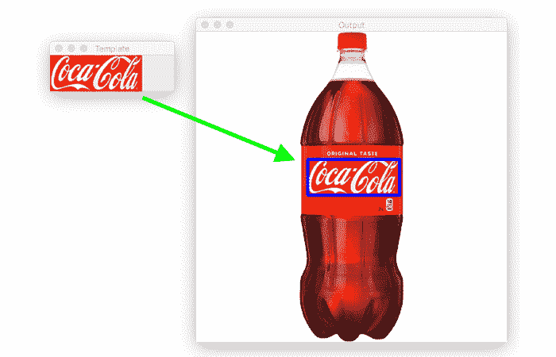

# OpenCV 模板匹配(cv2.matchTemplate)

> 原文：<https://pyimagesearch.com/2021/03/22/opencv-template-matching-cv2-matchtemplate/>

在本教程中，您将学习如何使用 OpenCV 和`cv2.matchTemplate`函数执行模板匹配。



除了轮廓过滤和处理，**模板匹配可以说是物体检测的最简单形式之一:**

*   实现起来很简单，只需要 2-3 行代码
*   模板匹配的计算效率很高
*   它不需要你执行阈值，边缘检测等。，以生成二进制图像(如轮廓检测和处理)
*   通过一个基本的扩展，模板匹配可以检测输入图像中相同/相似对象的多个实例(我们将在下周讨论)

当然，模板匹配并不完美。尽管有这些优点，但如果输入图像中存在变化因素，包括旋转、缩放、视角等变化，模板匹配很快就会失败。

如果您的输入图像包含这些类型的变化，您*不应该*使用模板匹配—利用专用的对象检测器，包括 HOG +线性 SVM、更快的 R-CNN、SSDs、YOLO 等。

但是在你知道旋转、缩放和视角不变的情况下，模板匹配可以创造奇迹。

**要学习如何用 OpenCV 执行模板匹配，** ***继续阅读。***

## **OpenCV 模板匹配(cv2.matchTemplate )**

在本教程的第一部分，我们将讨论什么是模板匹配以及 OpenCV 如何通过`cv2.matchTemplate`函数实现模板匹配。

从那里，我们将配置我们的开发环境，并审查我们的项目目录结构。

然后，我们将使用 OpenCV 实现模板匹配，将它应用于一些示例图像，并讨论它在哪里工作得好，什么时候不好，以及如何改进模板匹配结果。

### **什么是模板匹配？**

模板匹配可以被视为对象检测的一种非常基本的形式。使用模板匹配，我们可以使用包含我们想要检测的对象的“模板”来检测输入图像中的对象。

本质上，这意味着我们需要两幅图像来应用模板匹配:

1.  **源图像:**这是我们期望在其中找到与模板匹配的图像。
2.  **模板图像:**我们在*源图像中搜索的“对象补丁”。*

为了在源图像中找到模板，我们将模板从左到右和从上到下滑过源图像:

在每个 *(x，y)*-位置，计算一个度量来表示匹配的“好”或“坏”程度。通常，我们使用归一化相关系数来确定两个块的像素强度有多“相似”:

有关相关系数的完整推导，包括 OpenCV 支持的所有其他模板匹配方法，[请参考 OpenCV 文档。](https://docs.opencv.org/3.4/de/da9/tutorial_template_matching.html)

对于 *I* 上的每个位置 *T* ，计算出的结果度量存储在我们的结果矩阵 *R* 中。源图像中的每个 *(x，y)*-坐标(对于模板图像也具有有效的宽度和高度)在结果矩阵 *R* 中包含一个条目:

在这里，我们可以看到覆盖在原始图像上的结果矩阵 *R* 。注意 *R* 是如何与原始模板的**T5【而不是 大小相同的。这是因为*整个*模板必须适合要计算相关性的源图像。如果模板超出了源的边界，我们不计算相似性度量。**

**结果矩阵的亮位置** ***R*** **表示最佳匹配，其中暗区域表示源图像和模板图像之间的相关性很小。**注意结果矩阵的最亮区域如何出现在咖啡杯的左上角。

尽管模板匹配应用起来极其简单并且计算效率高，但是有许多限制。如果有*任何*对象比例变化、旋转或视角，模板匹配很可能会失败。

几乎在所有情况下，您都希望确保您正在检测的模板与您希望在源代码中检测的对象几乎相同。即使外观上很小、很小的偏差也会显著影响模板匹配结果，并使其变得毫无用处。

### **OpenCV 的“cv2.matchTemplate”函数**

我们可以使用 OpenCV 和`cv2.matchTemplate`函数应用模板匹配:

```
result = cv2.matchTemplate(image, template, cv2.TM_CCOEFF_NORMED)
```

在这里，您可以看到我们为`cv2.matchTemplate`函数提供了三个参数:

1.  包含我们想要检测的对象的输入`image`
2.  对象的`template`(即我们希望在`image`中检测的内容)
3.  模板匹配方法

这里，我们使用归一化的相关系数，这是您通常想要使用的模板匹配方法，[但是 OpenCV 也支持其他模板匹配方法。](https://docs.opencv.org/3.4/de/da9/tutorial_template_matching.html)

来自`cv2.matchTemplate`的输出`result`是具有空间维度的矩阵:

*   **宽度:** `image.shape[1] - template.shape[1] + 1`
*   **身高:** `image.shape[0] - template.shape[0] + 1`

然后我们可以在`result`中找到具有最大相关系数的位置，它对应于最有可能找到模板的区域(在本教程的后面你将学习如何做)。

同样值得注意的是，如果您只想检测输入图像中特定*区域内的对象，您可以提供一个遮罩，如下所示:*

```
result = cv2.matchTemplate(image, template, cv2.TM_CCOEFF_NORMED, mask)
```

`mask`必须具有与`template`相同的空间维度和数据类型。对于输入`image`中你*不想*搜索的区域，应该将`mask`设置为零。对于您想要搜索的`image`区域，请确保`mask`具有相应的值`255`。

### **配置您的开发环境**

要遵循这个指南，您需要在您的系统上安装 OpenCV 库。

幸运的是，OpenCV 可以通过 pip 安装:

```
$ pip install opencv-contrib-python
```

**如果你需要帮助为 OpenCV 配置开发环境，我*强烈推荐*阅读我的** [***pip 安装 OpenCV* 指南**](https://pyimagesearch.com/2018/09/19/pip-install-opencv/)——它将在几分钟内让你启动并运行。

### **在配置开发环境时遇到了问题？**

说了这么多，你是:

*   时间紧迫？
*   了解你雇主的行政锁定系统？
*   想要跳过与命令行、包管理器和虚拟环境斗争的麻烦吗？
*   准备好在您的 Windows、macOS 或 Linux 系统上运行代码*了吗*？

那今天就加入 [PyImageSearch 大学](https://pyimagesearch.com/pyimagesearch-plus/)吧！

**获得本教程的 Jupyter 笔记本和其他 PyImageSearch 指南，这些指南是** ***预先配置的*** **，可以在您的网络浏览器中运行在 Google Colab 的生态系统上！**无需安装。

最棒的是，这些 Jupyter 笔记本可以在 Windows、macOS 和 Linux 上运行！

### **项目结构**

在我们深入之前，让我们回顾一下我们的项目目录结构。

首先访问本教程的 ***“下载”*** 部分，检索源代码和示例图像。

您的目录应该如下所示:

```
$ tree . --dirsfirst
.
├── images
│   ├── 8_diamonds.png
│   ├── coke_bottle.png
│   ├── coke_bottle_rotated.png
│   ├── coke_logo.png
│   └── diamonds_template.png
└── single_template_matching.py

1 directory, 6 files

```

我们今天要回顾一个 Python 脚本`single_template_matching.py`，它将使用 OpenCV 执行模板匹配。

在`images`目录中，我们有五个图像，我们将对它们应用模板匹配。我们将在教程的后面看到这些图像。

### **用 OpenCV 实现模板匹配**

回顾了我们的项目目录结构后，让我们继续用 OpenCV 实现模板匹配。

打开目录结构中的`single_template_matching.py`文件，插入以下代码:

```
# import the necessary packages
import argparse
import cv2

# construct the argument parser and parse the arguments
ap = argparse.ArgumentParser()
ap.add_argument("-i", "--image", type=str, required=True,
	help="path to input image where we'll apply template matching")
ap.add_argument("-t", "--template", type=str, required=True,
	help="path to template image")
args = vars(ap.parse_args())
```

在**第 2 行和第 3 行，**我们导入我们需要的 Python 包。我们只需要用`argparse`解析命令行参数，用`cv2`绑定 OpenCV。

从那里，我们继续解析我们的命令行参数:

1.  `--image`:我们将对其应用模板匹配的磁盘上的输入图像的路径(即，我们想要在其中检测对象的图像)。
2.  `--template`:我们希望在输入图像中找到其实例的示例模板图像。

接下来，让我们准备用于模板匹配的图像和模板:

```
# load the input image and template image from disk, then display
# them on our screen
print("[INFO] loading images...")
image = cv2.imread(args["image"])
template = cv2.imread(args["template"])
cv2.imshow("Image", image)
cv2.imshow("Template", template)

# convert both the image and template to grayscale
imageGray = cv2.cvtColor(image, cv2.COLOR_BGR2GRAY)
templateGray = cv2.cvtColor(template, cv2.COLOR_BGR2GRAY)
```

我们首先加载我们的`image`和`template`，然后在屏幕上显示它们。

模板匹配通常应用于灰度图像，因此第 22 行和第 23 行将图像转换为灰度图像。

接下来，需要做的就是调用`cv2.matchTemplate`:

```
# perform template matching
print("[INFO] performing template matching...")
result = cv2.matchTemplate(imageGray, templateGray,
	cv2.TM_CCOEFF_NORMED)
(minVal, maxVal, minLoc, maxLoc) = cv2.minMaxLoc(result)
```

**第 27 行和第 28 行**通过`cv2.matchTemplate`功能执行模板匹配。我们向该函数传递三个必需的参数:

1.  我们希望在其中找到对象的输入图像
2.  我们要在输入图像中检测的对象的模板图像
3.  模板匹配方法

通常情况下，归一化相关系数(`cv2.TM_CCOEF_NORMED`)在大多数情况下工作良好，[，但是您可以参考 OpenCV 文档以获得关于其他模板匹配方法的更多细节。](https://docs.opencv.org/3.4/de/da9/tutorial_template_matching.html)

一旦我们应用了`cv2.matchTemplate`，我们会收到一个具有以下空间维度的`result`矩阵:

*   **宽度:** `image.shape[1] - template.shape[1] + 1`
*   **身高:** `image.shape[0] - template.shape[0] + 1`

该`result`矩阵将具有一个*大值*(更接近于`1`)，其中有*更可能是一个模板匹配。类似地，`result`矩阵将具有*小值*(更接近于`0`)，其中匹配的可能性*更小*。*

为了找到具有最大值的位置，也就是最有可能匹配的位置，我们调用`cv2.minMaxLoc` ( **第 29 行**)，传入`result`矩阵。

一旦我们有了具有最大归一化相关系数(`maxLoc`)的位置的 *(x，y)* 坐标，我们就可以提取坐标并导出边界框坐标:

```
# determine the starting and ending (x, y)-coordinates of the
# bounding box
(startX, startY) = maxLoc
endX = startX + template.shape[1]
endY = startY + template.shape[0]
```

**第 33 行**从我们的`maxLoc`中提取起始 *(x，y)*-坐标，该坐标来源于前一代码块中的调用`cv2.minMaxLoc`。

使用`startX`和`endX`坐标，我们可以通过将模板的宽度和高度分别加到`startX`和`endX`坐标上，得到第 34 行**和第 35 行**上的`endX`和`endY`坐标。

最后一步是在`image`上绘制检测到的边界框:

```
# draw the bounding box on the image
cv2.rectangle(image, (startX, startY), (endX, endY), (255, 0, 0), 3)

# show the output image
cv2.imshow("Output", image)
cv2.waitKey(0)
```

对第 38 行**上的`cv2.rectangle`的调用在图像上绘制边界框。**

**第 41 和 42 行**然后在我们的屏幕上显示我们的输出`image`。

### **OpenCV 模板匹配结果**

我们现在准备用 OpenCV 应用模板匹配！

访问本教程的 ***“下载”*** 部分来检索源代码和示例图像。

从那里，打开一个终端并执行以下命令:

```
$ python single_template_matching.py --image images/coke_bottle.png \
	--template images/coke_logo.png
[INFO] loading images...
[INFO] performing template matching...

```

在这个例子中，我们有一个包含可口可乐瓶的输入图像:

我们的目标是检测图像中的可口可乐标志:

通过应用 OpenCV 和`cv2.matchTemplate`函数，我们可以正确定位*在`coke_bottle.png`图像中的位置*`coke_logo.png`图像是:

这种方法是可行的，因为`coke_logo.png`中的可口可乐标志与`coke_bottle.png`中的标志大小相同(就比例而言)。类似地，徽标以相同的视角观看，并且不旋转。

如果标识的规模不同或视角不同，这种方法就会失败。

例如，让我们试试这个示例图像，但这次我稍微旋转了可口可乐瓶子，并缩小了瓶子:

```
$ python single_template_matching.py \
	--image images/coke_bottle_rotated.png \
	--template images/coke_logo.png
[INFO] loading images...
[INFO] performing template matching...
```

请注意我们是如何进行假阳性检测的！我们没有发现可口可乐的标志，现在的规模和旋转是不同的。

**这里的关键点在于模板匹配是*****对旋转、视角、比例的变化极其敏感。当这种情况发生时，你可能需要应用更先进的物体检测技术。***

 *在下面的示例中，我们正在处理一副牌，并试图检测方块 8 扑克牌上的“方块”符号:

```
$ python single_template_matching.py --image images/8_diamonds.png \
	--template images/diamonds_template.png 
[INFO] loading images...
[INFO] performing template matching...

```

在左边的*，*是我们的`diamonds_template.png`图像。我们使用 OpenCV 和`cv2.matchTemplate`函数找到所有的菱形符号*(右)* …

…但是这里发生了什么？

为什么没有检测出所有的钻石符号？

答案是，`cv2.matchTemplate`函数本身，*无法检测多个对象！*

不过，有一个解决方案——我将在下周的教程中介绍 OpenCV 的多模板匹配。

### **关于模板匹配的误报检测的说明**

你会注意到，在我们旋转可口可乐标志的例子中，我们没有检测到可口可乐标志；然而，我们的代码仍然“报告”找到了徽标:

请记住，`cv2.matchTemplate`函数*确实不知道*是否正确找到了对象——它只是在输入图像上滑动模板图像，计算归一化的相关性分数，然后返回分数最大的位置。

模板匹配是“哑算法”的一个例子没有任何机器学习在进行，T2 也不知道输入图像中有什么。

要过滤掉误报检测，您应该获取`maxVal`并使用`if`语句过滤掉低于某个阈值的分数。

### **演职员表和参考资料**

我要感谢在线教师[关于模板匹配的精彩文章](https://theailearner.com/2020/12/12/template-matching-using-opencv/)——我不能因为用扑克牌来演示模板匹配的想法而居功。这是他们的想法，而且是一个很好的想法。感谢他们想出了这个例子，我无耻地用在这里，谢谢。

此外，u/fireball_73 从 [Reddit 帖子](https://www.reddit.com/r/mildlyinfuriating/comments/91bqun/this_8_of_diamonds_card_has_10_diamonds_on_it/)中获得了方块 8 的图像。

## **总结**

在本教程中，您学习了如何使用 OpenCV 和`cv2.matchTemplate`函数执行模板匹配。

模板匹配是目标检测的一种基本形式。它非常快速有效，但缺点是当对象的旋转、缩放或视角发生变化时，它会失败——当这种情况发生时，你需要一种更高级的对象检测技术。

然而，假设您可以控制捕捉照片的环境中对象的比例或使其正常化。在这种情况下，您有可能摆脱模板匹配，并避免标记数据、训练对象检测器和调整其超参数的繁琐任务。

**要下载这篇文章的源代码(并在未来教程在 PyImageSearch 上发布时得到通知)，*只需在下面的表格中输入您的电子邮件地址！****