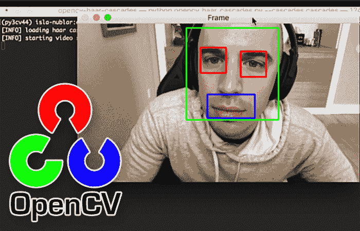

# OpenCV 头发瀑布

> 原文：<https://pyimagesearch.com/2021/04/12/opencv-haar-cascades/>

在本教程中，您将了解 OpenCV Haar 级联以及如何将它们应用于实时视频流。



Haar cascades 由 Viola 和 Jones 在他们 2001 年的开创性出版物《使用简单特征的增强级联 的 [*快速对象检测》中首次介绍，可以说是 OpenCV 的*最流行的*对象检测算法。*](https://www.cs.cmu.edu/~efros/courses/LBMV07/Papers/viola-cvpr-01.pdf)

当然，许多算法比哈尔级联更准确(HOG +线性 SVM、SSDs、更快的 R-CNN、YOLO，仅举几个例子)，但它们今天仍然相关和有用。

哈尔瀑布的一个主要好处是它们非常快——很难超越它们的速度。

Haar cascades 的*缺点*是它们倾向于假阳性检测，当应用于推断/检测时需要参数调整，并且一般来说，不如我们今天拥有的更“现代”的算法准确。

也就是说，哈尔喀斯是:

1.  计算机视觉和图像处理文献的重要部分
2.  仍然与 OpenCV 一起使用
3.  仍然有用，特别是在资源有限的设备中工作时，当我们负担不起使用计算成本更高的对象检测器时

在本教程的剩余部分，您将了解 Haar 级联，包括如何在 OpenCV 中使用它们。

**学习如何使用 OpenCV Haar cascades，*继续阅读。***

## **开 CV 发瀑布**

在本教程的第一部分，我们将回顾什么是哈尔级联，以及如何使用 OpenCV 库哈尔级联。

从那里，我们将配置我们的开发环境，然后检查我们的项目结构。

回顾了我们的项目目录结构后，我们将继续使用 OpenCV 实时应用我们的 Haar 级联。

我们将在本指南的最后讨论我们的结果。

### **什么是哈尔喀斯？**

保罗·维奥拉(Paul Viola)和迈克尔·琼斯(Michael Jones)在他们 2001 年的论文 [*中首次发表了使用简单特征*](https://www.cs.cmu.edu/~efros/courses/LBMV07/Papers/viola-cvpr-01.pdf) 的增强级联的快速对象检测，这项原创工作已经成为计算机视觉文献中被引用最多的论文之一。

在他们的论文中，Viola 和 Jones 提出了一种算法，能够检测图像中的对象，而不管它们在图像中的位置和比例。此外，该算法可以实时运行，使得检测视频流中的对象成为可能。

具体来说，Viola 和 Jones 专注于检测图像中的人脸。尽管如此，该框架仍可用于训练任意“物体”的检测器，如汽车、建筑物、厨房用具，甚至香蕉。

虽然 Viola-Jones 框架肯定打开了对象检测的大门，但它现在被其他方法远远超越，如使用梯度方向直方图(HOG) +线性 SVM 和深度学习。我们需要尊重这种算法，至少对引擎下发生的事情有一个高层次的理解。

还记得我们讨论过[图像和卷积](https://pyimagesearch.com/2016/07/25/convolutions-with-opencv-and-python/)以及我们如何从左到右和从上到下在图像上滑动一个小矩阵，为内核的每个中心像素计算输出值吗？事实证明，这种滑动窗口方法在检测图像中的对象时也非常有用:

在**图** 2 中，我们可以看到我们在**多尺度**下滑动一个**固定大小的窗口**穿过我们的图像。在每个阶段，我们的窗口都会停下来，计算一些特征，然后将该区域分类为*是，该区域确实包含人脸*，或者*否，该区域不包含人脸。*

这需要一点机器学习。我们需要一个训练有素的分类器来使用正面和负面的人脸样本:

*   正数据点是包含面部的区域的例子
*   负数据点是*不包含面部的区域的例子*

给定这些正面和负面的数据点，我们可以“训练”一个分类器来识别图像的给定区域是否包含人脸。

对我们来说幸运的是，OpenCV 可以使用预先训练好的 Haar 级联来执行开箱即用的人脸检测:

这确保了我们不需要提供自己的正样本和负样本，不需要训练自己的分类器，也不需要担心参数调整是否完全正确。相反，我们只需加载预训练的分类器，并检测图像中的人脸。

然而，在幕后，OpenCV 正在做一些非常有趣的事情。对于沿滑动窗口路径的每个停靠点，计算五个矩形特征:

如果你熟悉小波，你可能会发现它们与[哈尔基函数](http://en.wikipedia.org/wiki/Haar-like_features)和[哈尔小波](http://en.wikipedia.org/wiki/Haar_wavelet)(哈尔级联由此得名)有一些相似之处。

为了获得这五个矩形区域中每一个的特征，我们简单地从黑色区域下的像素总和中减去白色区域下的像素总和。有趣的是，这些特征在人脸检测中具有实际的重要性:

1.  眼睛区域往往比脸颊区域更暗。
2.  鼻子区域比眼睛区域更亮。

因此，给定这五个矩形区域和它们相应的和的差，我们可以形成能够分类面部部分的特征。

然后，对于整个特征数据集，我们使用 [AdaBoost 算法](http://en.wikipedia.org/wiki/AdaBoost)来选择哪些特征对应于图像的面部区域。

然而，正如您可以想象的，使用固定的滑动窗口并在图像的每个 *(x，y)*-坐标上滑动它，然后计算这些类似 Haar 的特征，最后执行实际的分类可能在计算上是昂贵的。

为了解决这个问题，Viola 和 Jones 引入了*级联*或*阶段*的概念。在滑动窗口路径的每一站，窗口都必须通过一系列测试，其中每一个后续测试都比前一个测试在计算上更昂贵。如果任何一个测试失败，该窗口将被自动丢弃。

Haar cascade 的一些好处是，由于使用了[积分图像](http://en.wikipedia.org/wiki/Summed_area_table)(也称为总面积表)，它们在计算 Haar 类特征时*非常快*。通过使用 AdaBoost 算法，它们对于特征选择也非常有效。

也许最重要的是，它们可以检测图像中的人脸，而不管人脸的位置或比例。

最后，用于对象检测的 Viola-Jones 算法能够实时运行。

### 哈尔叶栅的问题和局限性

然而，也不全是好消息。该检测器对于面部的正面图像往往是最有效的。

众所周知，Haar cascades 容易出现假阳性 —当没有人脸出现时，Viola-Jones 算法可以轻松报告图像中的人脸。

最后，正如我们将在本课的剩余部分看到的，调整 OpenCV 检测参数可能会非常繁琐。有时候，我们可以检测出一幅图像中的所有面孔。还会有(1)图像的区域被错误地分类为面部，和/或(2)面部被完全遗漏的其他情况。

如果你对维奥拉-琼斯算法感兴趣，看看官方的[维基百科页面](http://en.wikipedia.org/wiki/Viola%E2%80%93Jones_object_detection_framework)和[原始论文](https://www.cs.cmu.edu/~efros/courses/LBMV07/Papers/viola-cvpr-01.pdf)。维基百科页面在将算法分解成易于理解的部分方面做得非常好。

### **如何配合 OpenCV 使用 Haar cascades？**

OpenCV 库[维护着一个预先训练好的哈尔级联库](https://github.com/opencv/opencv/tree/master/data/haarcascades)。这些哈尔级联大多用于:

1.  人脸检测
2.  眼睛检测
3.  嘴部检测
4.  全身/部分身体检测

提供了其他预先训练的哈尔级联，包括一个用于俄罗斯车牌，另一个用于[猫脸检测](https://pyimagesearch.com/2016/06/20/detecting-cats-in-images-with-opencv/)。

我们可以使用`cv2.CascadeClassifer`函数从磁盘加载预训练的 Haar 级联:

```
detector = cv2.CascadeClassifier(path)
```

一旦 Haar 级联加载到内存中，我们可以使用`detectMultiScale`函数对其进行预测:

```
results = detector.detectMultiScale(
		gray, scaleFactor=1.05, minNeighbors=5,
		minSize=(30, 30), flags=cv2.CASCADE_SCALE_IMAGE)
```

`result`是一个边界框列表，包含边界框的起始`x`和`y`坐标，以及它们的宽度(`w`和高度(`h`)。

在本教程的后面部分，您将获得对`cv2.CascadeClassifier`和`detectMultiScale`的实践经验。

### **配置您的开发环境**

要遵循这个指南，您需要在您的系统上安装 OpenCV 库。

幸运的是，OpenCV 可以通过 pip 安装:

```
$ pip install opencv-contrib-python
```

**如果你需要帮助为 OpenCV 配置开发环境，我*强烈推荐*阅读我的** [***pip 安装 OpenCV* 指南**](https://pyimagesearch.com/2018/09/19/pip-install-opencv/)——它将在几分钟内让你启动并运行。

### **在配置开发环境时遇到了问题？**

说了这么多，你是:

*   时间紧迫？
*   了解你雇主的行政锁定系统？
*   想要跳过与命令行、包管理器和虚拟环境斗争的麻烦吗？
*   **准备好在您的 Windows、macOS 或 Linux 系统上运行代码*****？***

 *那今天就加入 [PyImageSearch 大学](https://pyimagesearch.com/pyimagesearch-university/)吧！

**获得本教程的 Jupyter 笔记本和其他 PyImageSearch 指南，这些指南已经过*预配置*，可以在您的网络浏览器中运行在 Google Colab 的生态系统上！**无需安装。

最棒的是，这些 Jupyter 笔记本可以在 Windows、macOS 和 Linux 上运行！

### **项目结构**

在我们了解 OpenCV 的 Haar 级联功能之前，我们首先需要回顾一下我们的项目目录结构。

首先访问本教程的 ***“下载”*** 部分，以检索源代码和预训练的 Haar cascades:

```
$ tree . --dirsfirst
.
├── cascades
│   ├── haarcascade_eye.xml
│   ├── haarcascade_frontalface_default.xml
│   └── haarcascade_smile.xml
└── opencv_haar_cascades.py

1 directory, 4 files
```

我们将对一个实时视频流应用三个哈尔级联。这些哈尔级联位于`cascades`目录中，包括:

1.  `haarcascade_frontalface_default.xml`:检测人脸
2.  `haarcascade_eye.xml`:检测脸部的左右眼
3.  虽然文件名暗示这个模型是一个“微笑检测器”，但它实际上是检测一张脸上“嘴”的存在

我们的`opencv_haar_cascades.py`脚本将从磁盘加载这三个哈尔级联，并将它们应用到一个视频流中，所有这些都是实时的。

### **实现 OpenCV Haar 级联对象检测(人脸、眼睛和嘴巴)**

回顾我们的项目目录结构，我们可以实现我们的 OpenCV Haar 级联检测脚本。

打开项目目录结构中的`opencv_haar_cascades.py`文件，我们就可以开始工作了:

```
# import the necessary packages
from imutils.video import VideoStream
import argparse
import imutils
import time
import cv2
import os
```

**第 2-7 行**导入我们需要的 Python 包。我们需要`VideoStream`来访问我们的网络摄像头，`argparse`用于命令行参数，`imutils`用于我们的 OpenCV 便利函数，`time`插入一个小的 sleep 语句，`cv2`用于我们的 OpenCV 绑定，以及`os`来构建文件路径，不知道你在哪个操作系统上(Windows 使用不同于 Unix 机器的路径分隔符，比如 macOS 和 Linux)。

我们只有一个命令行参数需要解析:

```
# construct the argument parser and parse the arguments
ap = argparse.ArgumentParser()
ap.add_argument("-c", "--cascades", type=str, default="cascades",
	help="path to input directory containing haar cascades")
args = vars(ap.parse_args())
```

`--cascades`命令行参数指向包含我们预先训练的面部、眼睛和嘴巴哈尔级联的目录。

我们继续从磁盘加载这些哈尔级联中的每一个:

```
# initialize a dictionary that maps the name of the haar cascades to
# their filenames
detectorPaths = {
	"face": "haarcascade_frontalface_default.xml",
	"eyes": "haarcascade_eye.xml",
	"smile": "haarcascade_smile.xml",
}

# initialize a dictionary to store our haar cascade detectors
print("[INFO] loading haar cascades...")
detectors = {}

# loop over our detector paths
for (name, path) in detectorPaths.items():
	# load the haar cascade from disk and store it in the detectors
	# dictionary
	path = os.path.sep.join([args["cascades"], path])
	detectors[name] = cv2.CascadeClassifier(path)
```

**第 17-21 行**定义了一个字典，将检测器的名称(键)映射到其对应的文件路径(值)。

**第 25 行**初始化我们的`detectors`字典。它将拥有与`detectorPaths`相同的密钥，但是一旦通过`cv2.CascadeClassifier`从磁盘加载，它的值将是 Haar cascade。

在**第 28 行，**我们分别遍历了每个 Haar 级联名称和路径。

对于每个检测器，我们构建完整的文件路径，从磁盘加载，并存储在我们的`detectors`字典中。

随着我们的三个哈尔级联中的每一个从磁盘加载，我们可以继续访问我们的视频流:

```
# initialize the video stream and allow the camera sensor to warm up
print("[INFO] starting video stream...")
vs = VideoStream(src=0).start()
time.sleep(2.0)

# loop over the frames from the video stream
while True:
	# grab the frame from the video stream, resize it, and convert it
	# to grayscale
	frame = vs.read()
	frame = imutils.resize(frame, width=500)
	gray = cv2.cvtColor(frame, cv2.COLOR_BGR2GRAY)

	# perform face detection using the appropriate haar cascade
	faceRects = detectors["face"].detectMultiScale(
		gray, scaleFactor=1.05, minNeighbors=5, minSize=(30, 30),
		flags=cv2.CASCADE_SCALE_IMAGE)
```

**第 36-37 行**初始化我们的`VideoStream`，插入一个小的`time.sleep`语句让我们的摄像头传感器预热。

从那里，我们继续:

*   循环播放视频流中的帧
*   阅读下一篇`frame`
*   调整它的大小
*   将其转换为灰度

一旦帧被转换成灰度，我们应用人脸检测器 Haar cascade 来定位输入帧中的任何人脸。

下一步是循环每个面部位置，应用我们的眼睛和嘴巴哈尔瀑布:

```
	# loop over the face bounding boxes
	for (fX, fY, fW, fH) in faceRects:
		# extract the face ROI
		faceROI = gray[fY:fY+ fH, fX:fX + fW]

		# apply eyes detection to the face ROI
		eyeRects = detectors["eyes"].detectMultiScale(
			faceROI, scaleFactor=1.1, minNeighbors=10,
			minSize=(15, 15), flags=cv2.CASCADE_SCALE_IMAGE)

		# apply smile detection to the face ROI
		smileRects = detectors["smile"].detectMultiScale(
			faceROI, scaleFactor=1.1, minNeighbors=10,
			minSize=(15, 15), flags=cv2.CASCADE_SCALE_IMAGE)
```

**第 53 行**在所有面部边界框上循环。然后，我们使用边界框信息在**线 55** 上提取脸部 ROI。

下一步是将我们的眼睛和嘴巴检测器应用到面部区域。

在第**行 58-60、**上对脸部 ROI 应用眼睛检测，而在第**行 63-65 上执行嘴检测。**

就像我们对所有面部检测进行循环一样，我们需要对眼睛和嘴巴检测进行同样的操作:

```
		# loop over the eye bounding boxes
		for (eX, eY, eW, eH) in eyeRects:
			# draw the eye bounding box
			ptA = (fX + eX, fY + eY)
			ptB = (fX + eX + eW, fY + eY + eH)
			cv2.rectangle(frame, ptA, ptB, (0, 0, 255), 2)

		# loop over the smile bounding boxes
		for (sX, sY, sW, sH) in smileRects:
			# draw the smile bounding box
			ptA = (fX + sX, fY + sY)
			ptB = (fX + sX + sW, fY + sY + sH)
			cv2.rectangle(frame, ptA, ptB, (255, 0, 0), 2)

		# draw the face bounding box on the frame
		cv2.rectangle(frame, (fX, fY), (fX + fW, fY + fH),
			(0, 255, 0), 2)
```

**第 68-72 行**在所有检测到的眼睛边界框上循环。然而，注意**行 70 和 71** 如何相对于*原始*帧图像尺寸导出眼睛边界框。

如果我们使用原始的`eX`、`eY`、`eW`和`eH`值，它们将是原始帧的`faceROI`、**、*而不是*、**，因此我们将面部边界框坐标添加到眼睛坐标。

我们在第 75-79 行上执行相同的一系列操作，这次是嘴部边界框。

最后，我们可以通过在屏幕上显示我们的输出`frame`来结束:

```
	# show the output frame
	cv2.imshow("Frame", frame)
	key = cv2.waitKey(1) & 0xFF

	# if the `q` key was pressed, break from the loop
	if key == ord("q"):
		break

# do a bit of cleanup
cv2.destroyAllWindows()
vs.stop()
```

然后，我们通过关闭 OpenCV 打开的所有窗口并停止视频流来进行清理。

### **哈尔级联结果**

我们现在准备用 OpenCV 应用哈尔叶栅！

请务必访问本教程的 ***“下载”*** 部分，以检索源代码和示例图像。

从那里，打开一个终端并执行以下命令:

```
$ python opencv_haar_cascades.py --cascades cascades
[INFO] loading haar cascades...
[INFO] starting video stream...
```

上面的视频显示了应用我们的三个 OpenCV Haar 级联进行人脸检测、眼睛检测和嘴巴检测的结果。

我们的结果实时运行没有问题，但正如您所见，检测本身是*而不是*最准确的:

*   我们检测我的脸没有问题，但是嘴巴和眼睛会发出一些假阳性信号。
*   当我眨眼时，会发生两种情况之一:(1)眼睛区域不再被检测到，或者(2)它被错误地标记为嘴
*   在许多帧中往往有多个嘴部检测

**OpenCV 的人脸检测 Haar cascades 趋于最准确。您可以在自己的应用程序中随意使用它们，在这些应用程序中，您可以容忍一些误报检测和一些参数调整。**

也就是说，对于面部结构检测，我强烈建议[使用面部标志代替](https://pyimagesearch.com/2017/04/10/detect-eyes-nose-lips-jaw-dlib-opencv-python/)——它们比眼睛和嘴巴哈尔瀑布本身更稳定，甚至更快*。*

 *## **总结**

在本教程中，您学习了如何使用 OpenCV 应用 Haar 级联。

具体来说，您学习了如何将哈尔级联应用于:

1.  人脸检测
2.  眼睛检测
3.  嘴部检测

我们的人脸检测结果是最稳定和准确的。不幸的是，在许多情况下，眼睛检测和嘴巴检测结果是不可用的——对于面部特征/部位提取，我建议您使用[面部标志](https://pyimagesearch.com/2017/04/10/detect-eyes-nose-lips-jaw-dlib-opencv-python/)。

我最后说一句，还有*很多*更准确的人脸检测方法，包括 HOG +线性 SVM 和基于深度学习的物体检测器，包括 SSDs，更快的 R-CNN，YOLO 等。尽管如此，如果你需要*纯速度*，你就是打不过 OpenCV 的哈尔卡斯。

**要下载这篇文章的源代码(并在未来教程在 PyImageSearch 上发布时得到通知)，*只需在下面的表格中输入您的电子邮件地址！*****