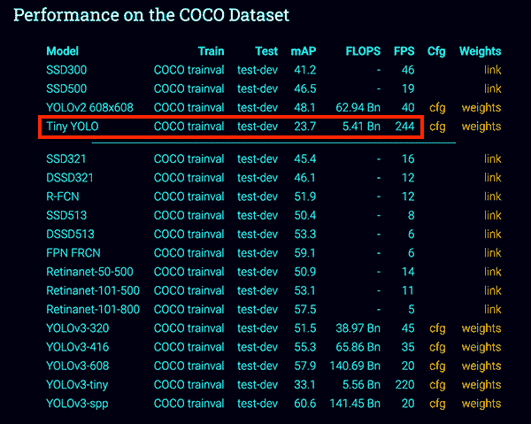
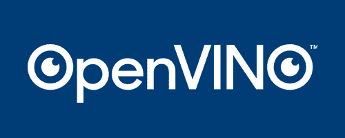

# 树莓派和 Movidius NCS 上的 YOLO 和微小 YOLO 目标检测

> 原文：<https://pyimagesearch.com/2020/01/27/yolo-and-tiny-yolo-object-detection-on-the-raspberry-pi-and-movidius-ncs/>

在本教程中，您将学习如何利用 YOLO 和蒂尼-YOLO 在带有 Movidius NCS 的 Raspberry Pi 上进行近实时对象检测。

**YOLO 物体检测器经常被认为是*最快的*基于深度学习的物体检测器**之一，比计算昂贵的两阶段检测器(例如更快的 R-CNN)和一些单级检测器(例如。RetinaNet 和一些(但不是全部)SSD 的变体)。

然而，即使有这样的速度，**YOLO*仍然*不够快，无法在树莓 Pi** 等嵌入式设备上运行——即使有 Movidius NCS 的帮助。

为了让 YOLO *变得更快*，雷德蒙等人(《YOLO》的创造者)，定义了一种被称为**微小 YOLO 的 YOLO 架构变体。**

小小的 YOLO 架构比它的大兄弟 快了**大约 442% *，在单个 GPU 上实现了超过 **244 FPS** 。***

小模型尺寸(< 50MB)和快速推理速度使微小 YOLO 物体探测器自然适合嵌入式计算机视觉/深度学习设备，如 Raspberry Pi、Google Coral 和 NVIDIA Jetson Nano。

今天，您将了解如何使用微型 YOLO，然后使用 Movidius NCS 将其部署到 Raspberry Pi，以获得近乎实时的对象检测。

**要了解如何利用 YOLO 和 TinyYOLO 通过 Movidius NCS 在树莓 Pi 上进行物体检测，*请继续阅读！***

## 树莓派和 Movidius NCS 上的 YOLO 和微小 YOLO 目标检测

在本教程的第一部分，我们将了解 YOLO 和微小 YOLO 物体探测器。

在那里，我将向您展示如何配置您的 Raspberry Pi 和 OpenVINO 开发环境，以便它们可以利用微小的 YOLO。

然后我们将回顾项目的目录结构，包括正确访问 OpenVINO 环境所需的 shell 脚本。

一旦我们理解了项目结构，我们将继续实现一个 Python 脚本，它:

1.  访问我们的 OpenVINO 环境。
2.  从视频流中读取帧。
3.  使用 Raspberry Pi、Movidius NCS 和 Tiny-YOLO 执行近实时对象检测。

我们将通过检查脚本的结果来结束本教程。

### 什么是 YOLO 和小 YOLO？

[](https://pyimagesearch.com/wp-content/uploads/2020/01/tiny_yolo_comparison.png)

**Figure 1:** Tiny-YOLO has a lower mAP score on the COCO dataset than most object detectors. That said, Tiny-YOLO may be a useful object detector to pair with your Raspberry Pi and Movidius NCS. ([image source](https://pjreddie.com/darknet/yolo/))

Tiny-YOLO 是 Redmon 等人在其 2016 年的论文 [*中提出的“你只看一次”(YOLO)物体检测器的变体:统一、实时的物体检测*](https://arxiv.org/abs/1506.02640) 。

创建 YOLO 是为了帮助提高较慢的两级物体探测器的速度，如较快的 R-CNN。

虽然 R-CNN 是*精确的*，但是它们是*非常慢的*，即使在 GPU 上运行也是如此。

相反，YOLO 等单级探测器*相当快*，在 GPU 上获得超实时性能。

**当然，缺点是 YOLO 往往是*不太准确*** (根据我的经验，比固态硬盘或 RetinaNet 更难训练)。

由于蒂尼-YOLO 是比它的大兄弟们更小的版本，这也意味着蒂尼-YOLO 不幸是 ***甚至更不准确的*** 。

作为参考，Redmon 等人在 COCO 基准数据集上报告了约 51-57%的 YOLO 地图，而 Tiny-YOLO 只有 23.7%的地图，不到其更大兄弟的一半精度。

也就是说，23%的 mAP 对于某些应用来说仍然是合理的。

使用 YOLO 时，我的一般建议是“简单地试一试”:

*   在某些情况下，它可能非常适合您的项目。
*   在其他情况下，您可能会寻求更准确的检测器(更快的 R-CNN、SSDs、RetinaNet 等)。).

要了解更多关于 YOLO、蒂尼-YOLO 和其他 YOLO 变种的信息，请务必参考雷德蒙等人的 2018 年出版物。

### 配置您的 Raspberry Pi + OpenVINO 环境

[](https://pyimagesearch.com/wp-content/uploads/2019/04/openvino_install_header.png)

**Figure 2:** Configuring the OpenVINO toolkit for your Raspberry Pi and Movidius NCS to conduct TinyYOLO object detection.

这个教程*需要*一个**树莓 Pi 4B**T4 和**m ovidius NC S2**(NC S1 不*支持*)来复制我的结果。

在这个项目中，为您的 Raspberry Pi 配置英特尔 Movidius NCS 无疑具有挑战性。

建议你(1)拿一个 ***[的副本给计算机视觉](https://pyimagesearch.com/raspberry-pi-for-computer-vision/)*** ，还有(2)把预先配置好的 **[收录闪存。img](https://pyimagesearch.com/2016/11/21/raspbian-opencv-pre-configured-and-pre-installed/)** 到你的 microSD。的。这本书附带的 img 是物有所值的，因为它会节省你无数个小时的辛苦和挫折。

对于那些想自己配置覆盆子 Pi + [OpenVINO](https://software.intel.com/en-us/openvino-toolkit) 的顽固少数人来说，这里有一个简单的指南:

1.  前往我的 **[BusterOS 安装指南](https://pyimagesearch.com/2019/09/16/install-opencv-4-on-raspberry-pi-4-and-raspbian-buster/)** 并按照所有指示创建一个名为`cv`的环境。
2.  按照我的 **[OpenVINO 安装指南](https://pyimagesearch.com/2019/04/08/openvino-opencv-and-movidius-ncs-on-the-raspberry-pi/)** 创建第二个环境名为`openvino`。一定要下载 OpenVINO 4.1.1 (4.1.2 有未解决的问题)。

您将需要一个名为 JSON-Minify 的包来解析我们的 JSON 配置。您可以将其安装到您的虚拟环境中:

```
$ pip install json_minify

```

在这一点上，你的 RPi 将有*和*一个普通的 OpenCV 环境以及一个 OpenVINO-OpenCV 环境。在本教程中，您将使用`openvino`环境。

现在，只需将 NCS2 插入蓝色 USB 3.0 端口(RPi 4B 具有 USB 3.0 以获得最高速度)，并使用以下任一方法启动您的环境:

**选项 A:** 在我的 *[预配置的 Raspbian 上使用 shell 脚本。img](https://pyimagesearch.com/2016/11/21/raspbian-opencv-pre-configured-and-pre-installed/)* (在我的 [OpenVINO 安装指南](https://pyimagesearch.com/2019/04/08/openvino-opencv-and-movidius-ncs-on-the-raspberry-pi/)的*“推荐:创建一个用于启动您的 OpenVINO 环境的 shell 脚本”*部分中描述了相同的 shell 脚本)。

从现在开始，您可以用**一个简单的命令**来*激活您的 OpenVINO* 环境(与上一步中的两个命令相反:

```
$ source ~/start_openvino.sh
Starting Python 3.7 with OpenCV-OpenVINO 4.1.1 bindings...

```

**选项 B:** 一二冲法。

如果您不介意执行两个命令而不是一个，您可以打开一个终端并执行以下操作:

```
$ workon openvino
$ source ~/openvino/bin/setupvars.sh

```

第一个命令激活我们的 OpenVINO 虚拟环境。第二个命令用 OpenVINO 设置 Movidius NCS(这非常重要，否则您的脚本会出错)。

**选项 A** 和**选项 B** 都假设你要么使用我的 *[预配置的 Raspbian。img](https://pyimagesearch.com/2016/11/21/raspbian-opencv-pre-configured-and-pre-installed/)* 或者说你按照我的 [OpenVINO 安装指南](https://pyimagesearch.com/2019/04/08/openvino-opencv-and-movidius-ncs-on-the-raspberry-pi/)自己安装了 OpenVINO 4.1.1。

**注意事项:**

*   某些版本的 OpenVINO 很难读取. mp4 视频。这是 PyImageSearch 已经向英特尔团队报告的一个已知 bug。我们的[已预先配置。img](https://pyimagesearch.com/2016/11/21/raspbian-opencv-pre-configured-and-pre-installed/) 包含一个修复。Abhishek Thanki 编辑了源代码，并从 source 编译了 OpenVINO。这篇博文已经够长了，所以我不能包含从源代码编译的说明。如果您遇到这个问题，请鼓励英特尔解决这个问题，或者(A) [使用我们的客户门户说明](https://rpi4cv.pyimagesearch.com/how-to-compile-opencv-openvino/)从源代码编译，或者(B)拿一份*[Raspberry Pi for Computer Vision](https://pyimagesearch.com/raspberry-pi-for-computer-vision/)*并使用预配置的. img
*   NCS1 不支持本教程提供的 TinyYOLO 模型。这是不典型的——通常，NCS2 和 NCS1 非常兼容(NCS2 更快)。
*   如果我们发现其他注意事项，我们会添加到此列表中。

### 项目结构

继续并获取今天的可下载内容。zip 来自今天教程的*“下载”部分。让我们用`tree`命令直接在终端中检查我们的项目结构:*

 *```
$ tree --dirsfirst
.
├── config
│   └── config.json
├── intel
│   ├── __init__.py
│   ├── tinyyolo.py
│   └── yoloparams.py
├── pyimagesearch
│   ├── utils
│   │   ├── __init__.py
│   │   └── conf.py
│   └── __init__.py
├── videos
│   └── test_video.mp4
├── yolo
│   ├── coco.names
│   ├── frozen_darknet_tinyyolov3_model.bin
│   ├── frozen_darknet_tinyyolov3_model.mapping
│   └── frozen_darknet_tinyyolov3_model.xml
└── detect_realtime_tinyyolo_ncs.py

6 directories, 13 files

```

我们在 COCO 数据集上训练的 TinyYOLO 模型是通过`yolo/`目录提供的。

`intel/`目录包含英特尔公司提供的两个类**:**

*   `TinyYOLOv3`:解析、缩放和计算 TinyYOLO 结果的 Union 上的[交集的类。](https://pyimagesearch.com/2016/11/07/intersection-over-union-iou-for-object-detection/)
*   `TinyYOLOV3Params`:用于建立层参数对象的类。

我们今天不会复习英特尔提供的任何一个脚本。我们鼓励您自己查看这些文件。

我们的`pyimagesearch`模块包含我们的`Conf`类，一个负责解析`config.json`的实用程序。

提供了一段人们走过公共场所的测试视频(摘自[牛津大学](http://www.robots.ox.ac.uk/ActiveVision/Research/Projects/2009bbenfold_headpose/project.html#datasets)的网站)供您执行 TinyYOLO 对象检测。我鼓励你也添加自己的`videos/`。

今天教程的核心在于`detect_realtime_tinyyolo_ncs.py`。该脚本加载 TinyYOLOv3 模型，并对实时视频流的每一帧执行推理。您可以使用您的 PiCamera、USB 摄像头或存储在磁盘上的视频文件。该脚本将在您的 Raspberry Pi 4B 和 NCS2 上计算接近实时的 TinyYOLOv3 推理的整体每秒帧数(FPS)基准。

### 我们的配置文件

[](https://pyimagesearch.com/wp-content/uploads/2020/01/tiny_yolo_openvino.png)

**Figure 3:** [Intel’s OpenVINO Toolkit](https://software.intel.com/en-us/openvino-toolkit) is combined with OpenCV allowing for optimized deep learning inference on Intel devices such as the Movidius Neural Compute Stick. We will use OpenVINO for TinyYOLO object detection on the Raspberry Pi and Movidius NCS.

我们的配置变量存放在我们的`config.json`文件中。现在打开它，让我们检查一下里面的东西:

```
{
	// path to YOLO architecture definition XML file
	"xml_path": "yolo/frozen_darknet_tinyyolov3_model.xml",

	// path to the YOLO weights
	"bin_path": "yolo/frozen_darknet_tinyyolov3_model.bin",

	// path to the file containing COCO labels
	"labels_path": "yolo/coco.names",

```

**第 3 行**定义了我们的 TinyYOLOv3 架构定义文件路径，而**第 6 行**指定了预训练 TinyYOLOv3 COCO 权重的路径。

然后我们在第 9 行的**上提供 COCO 数据集标签名称的路径。**

现在让我们看看用于过滤检测的变量:

```
	// probability threshold for detections filtering
	"prob_threshold": 0.2,

	// intersection over union threshold for filtering overlapping
	// detections
	"iou_threshold": 0.15
}

```

**第 12-16 行**定义概率和[交集超过并集(IoU)](https://pyimagesearch.com/2016/11/07/intersection-over-union-iou-for-object-detection/) 阈值，以便我们的驱动程序脚本可以过滤弱检测。如果您遇到太多的误报对象检测，您应该增加这些数字。**一般来说，我喜欢在`0.5`开始我的概率阈值。**

### 为 Movidius NCS 实现 YOLO 和小 YOLO 目标探测脚本

我们现在准备实施我们的微小 YOLO 物体检测脚本！

打开目录结构中的`detect_realtime_tinyyolo_ncs.py`文件，插入以下代码:

```
# import the necessary packages
from openvino.inference_engine import IENetwork
from openvino.inference_engine import IEPlugin
from intel.yoloparams import TinyYOLOV3Params
from intel.tinyyolo import TinyYOLOv3
from imutils.video import VideoStream
from pyimagesearch.utils import Conf
from imutils.video import FPS
import numpy as np
import argparse
import imutils
import time
import cv2
import os

```

我们从第 2-14 行开始，导入必要的包；让我们回顾一下最重要的几个:

*   `openvino`:`IENetwork`和`IEPlugin`的进口让我们的 Movidius NCS 接管了 TinyYOLOv3 的推论。
*   `intel`:`TinyYOLOv3`和`TinyYOLOV3Params`类是由英特尔公司提供的**(即不是我们开发的)并协助解析 TinyYOLOv3 结果。**
*   `imutils`:`VideoStream`类是线程化的，用于快速的相机帧捕获。`FPS`类提供了一个计算每秒帧数的框架。
*   `Conf`:解析注释 JSON 文件的类。
*   `cv2` : OpenVINO 的改良版 OpenCV 针对英特尔设备进行了优化。

导入准备就绪，现在我们将加载配置文件:

```
# construct the argument parser and parse the arguments
ap = argparse.ArgumentParser()
ap.add_argument("-c", "--conf", required=True,
	help="Path to the input configuration file")
ap.add_argument("-i", "--input", help="path to the input video file")
args = vars(ap.parse_args())

# load the configuration file
conf = Conf(args["conf"])

```

我们 Python 脚本的[命令行参数](https://pyimagesearch.com/2018/03/12/python-argparse-command-line-arguments/)包括:

*   `--conf`:我们在上一节中查看的输入配置文件的路径。
*   `--input`:输入视频文件的*可选*路径。如果没有指定输入文件，脚本将使用摄像机。

指定了我们的配置路径后， **Line 24** 从磁盘加载我们的配置文件。

既然我们的配置驻留在内存中，现在我们将继续加载我们的 COCO 类标签:

```
# load the COCO class labels our YOLO model was trained on and
# initialize a list of colors to represent each possible class
# label
LABELS = open(conf["labels_path"]).read().strip().split("\n")
np.random.seed(42)
COLORS = np.random.uniform(0, 255, size=(len(LABELS), 3))

```

**第 29-31 行**加载我们的 COCO 数据集类标签，并将随机颜色与每个标签相关联。我们将使用颜色来注释我们生成的边界框和类标签。

接下来，我们将把 TinyYOLOv3 模型加载到我们的 Movidius NCS 上:

```
# initialize the plugin in for specified device
plugin = IEPlugin(device="MYRIAD")

# read the IR generated by the Model Optimizer (.xml and .bin files)
print("[INFO] loading models...")
net = IENetwork(model=conf["xml_path"], weights=conf["bin_path"])

# prepare inputs
print("[INFO] preparing inputs...")
inputBlob = next(iter(net.inputs))

# set the default batch size as 1 and get the number of input blobs,
# number of channels, the height, and width of the input blob
net.batch_size = 1
(n, c, h, w) = net.inputs[inputBlob].shape

```

我们与 OpenVINO API 的第一个交互是初始化 NCS 的 Myriad 处理器，并从磁盘加载预先训练好的 TinyYOLOv3】第 34-38 行)。

我们然后:

*   准备我们的`inputBlob` ( **第 42 行**)。
*   将批量大小设置为`1`，因为我们将一次处理一个帧(**第 46 行**)。
*   确定输入体积形状尺寸(**行 47** )。

让我们继续初始化我们的摄像机或文件视频流:

```
# if a video path was not supplied, grab a reference to the webcam
if args["input"] is None:
	print("[INFO] starting video stream...")
	# vs = VideoStream(src=0).start()
	vs = VideoStream(usePiCamera=True).start()
	time.sleep(2.0)

# otherwise, grab a reference to the video file
else:
	print("[INFO] opening video file...")
	vs = cv2.VideoCapture(os.path.abspath(args["input"]))

# loading model to the plugin and start the frames per second
# throughput estimator
print("[INFO] loading model to the plugin...")
execNet = plugin.load(network=net, num_requests=1)
fps = FPS().start()

```

我们查询我们的`--input`参数，以确定我们是否将处理来自摄像机或视频文件的帧，并设置适当的视频流(**第 50-59 行**)。

由于 Intel 的 OpenCV-OpenVINO 实现中的一个 bug，如果你正在使用一个视频文件**，你必须在`cv2.VideoCapture`函数中指定*绝对路径*。**如果不这样做，OpenCV-OpenVINO 将无法处理该文件。

***注意:**如果没有提供`--input`命令行参数，将使用摄像机代替。默认情况下，您的 PiCamera ( **Line 53** )处于选中状态。如果您喜欢使用 USB 摄像头，只需注释掉**行 53** 并取消注释**行 52** 。*

我们与 OpenVINO API 的下一个交互是将 TinyYOLOv3 放到我们的 Movidius NCS ( **行 64** )上，同时**行 65** 开始测量 FPS 吞吐量。

至此，我们完成了设置，现在可以开始处理帧并执行 TinyYOLOv3 检测:

```
# loop over the frames from the video stream
while True:
	# grab the next frame and handle if we are reading from either
	# VideoCapture or VideoStream
	orig = vs.read()
	orig = orig[1] if args["input"] is not None else orig

	# if we are viewing a video and we did not grab a frame then we
	# have reached the end of the video
	if args["input"] is not None and orig is None:
		break

	# resize original frame to have a maximum width of 500 pixel and
	# input_frame to network size
	orig = imutils.resize(orig, width=500)
	frame = cv2.resize(orig, (w, h))

	# change data layout from HxWxC to CxHxW
	frame = frame.transpose((2, 0, 1))
	frame = frame.reshape((n, c, h, w))

	# start inference and initialize list to collect object detection
	# results
	output = execNet.infer({inputBlob: frame})
	objects = []

```

第 68 行开始我们的实时 TinyYOLOv3 对象检测循环。

首先，我们抓取并预处理我们的`frame` ( **第 71-86 行**)。

然后，我们执行对象检测推理(**行 90** )。

**第 91 行**初始化一个`objects`列表，我们接下来将填充它:

```
	# loop over the output items
	for (layerName, outBlob) in output.items():
		# create a new object which contains the required tinyYOLOv3
		# parameters
		layerParams = TinyYOLOV3Params(net.layers[layerName].params,
			outBlob.shape[2])

		# parse the output region
		objects += TinyYOLOv3.parse_yolo_region(outBlob,
			frame.shape[2:], orig.shape[:-1], layerParams,
			conf["prob_threshold"])

```

为了填充我们的`objects`列表，我们循环遍历`output`项，创建我们的`layerParams`，并解析输出区域(**第 94-103 行**)。请注意，我们使用英特尔提供的代码**来帮助解析我们的 YOLO 输出。**

YOLO 和 TinyYOLO 往往会产生相当多的假阳性。为了解决这个问题，接下来，我们将设计两种弱检测滤波器:

```
	# loop over each of the objects
	for i in range(len(objects)):
		# check if the confidence of the detected object is zero, if
		# it is, then skip this iteration, indicating that the object
		# should be ignored
		if objects[i]["confidence"] == 0:
			continue

		# loop over remaining objects
		for j in range(i + 1, len(objects)):
			# check if the IoU of both the objects exceeds a
			# threshold, if it does, then set the confidence of that
			# object to zero
			if TinyYOLOv3.intersection_over_union(objects[i],
				objects[j]) > conf["iou_threshold"]:
				objects[j]["confidence"] = 0

	# filter objects by using the probability threshold -- if a an
	# object is below the threshold, ignore it
	objects = [obj for obj in objects if obj['confidence'] >= \
		conf["prob_threshold"]]

```

**第 106 行**开始在我们的**第一个过滤器**的解析`objects`上循环

*   我们只允许置信度值不等于零的对象(**行 110 和 111** )。
*   然后，我们实际上修改任何没有通过联合(IoU) 阈值上的[交集的对象的置信度值(将其设置为零)(**第 114-120 行**)。](https://pyimagesearch.com/2016/11/07/intersection-over-union-iou-for-object-detection/)
*   有效地，***IoU 低的对象将被忽略。***

**第 124 和 125 行**简洁地说明了我们的**第二滤波器。**仔细检查代码，这两行:

*   重建(覆盖)我们的`objects`列表。
*   有效地，我们是 ***过滤掉不符合概率阈值的对象。***

既然我们的`objects`只包含我们关心的那些，我们将用边界框和类标签来注释我们的输出帧:

```
	# store the height and width of the original frame
	(endY, endX) = orig.shape[:-1]

	# loop through all the remaining objects
	for obj in objects:
		# validate the bounding box of the detected object, ensuring
		# we don't have any invalid bounding boxes
		if obj["xmax"] > endX or obj["ymax"] > endY or obj["xmin"] \
			< 0 or obj["ymin"] < 0:
			continue

		# build a label consisting of the predicted class and
		# associated probability
		label = "{}: {:.2f}%".format(LABELS[obj["class_id"]],
			obj["confidence"] * 100)

		# calculate the y-coordinate used to write the label on the
		# frame depending on the bounding box coordinate
		y = obj["ymin"] - 15 if obj["ymin"] - 15 > 15 else \
			obj["ymin"] + 15

		# draw a bounding box rectangle and label on the frame
		cv2.rectangle(orig, (obj["xmin"], obj["ymin"]), (obj["xmax"],
			obj["ymax"]), COLORS[obj["class_id"]], 2)
		cv2.putText(orig, label, (obj["xmin"], y),
			cv2.FONT_HERSHEY_SIMPLEX, 1, COLORS[obj["class_id"]], 3)

```

**第 128 行**提取我们原始框架的高度和宽度。我们需要这些值来进行注释。

然后我们循环过滤后的`objects`。在从**行 131** 开始的循环中，我们:

*   检查检测到的 *(x，y)*-坐标是否超出原始图像尺寸的界限；如果是这样，我们丢弃检测(**第 134-136 行**)。
*   构建我们的包围盒`label`，它由物体`"class_id"`和`"confidence"`组成。
*   使用输出帧(**第 145-152 行**)上的`COLORS`(来自**第 31 行**)标注边界框矩形和标签。如果框的顶部接近框架的顶部，**行 145 和 146** 将标签向下移动`15`个像素。

最后，我们将显示我们的框架，计算统计数据，并清理:

```
	# display the current frame to the screen and record if a user
	# presses a key
	cv2.imshow("TinyYOLOv3", orig)
	key = cv2.waitKey(1) & 0xFF

	# if the `q` key was pressed, break from the loop
	if key == ord("q"):
		break

	# update the FPS counter
	fps.update()

# stop the timer and display FPS information
fps.stop()
print("[INFO] elapsed time: {:.2f}".format(fps.elapsed()))
print("[INFO] approx. FPS: {:.2f}".format(fps.fps()))

# stop the video stream and close any open windows1
vs.stop() if args["input"] is None else vs.release()
cv2.destroyAllWindows()

```

结束后，我们显示输出帧并等待按下`q`键，此时我们将`break`退出循环(**第 156-161 行**)。

**第 164 行**更新我们的 FPS 计算器。

当(1)视频文件没有更多的帧，或者(2)用户在视频或相机流上按下`q`键时，循环退出。此时，**第 167-169 行**将 FPS 统计打印到您的终端。**第 172 和 173 行**停止流并破坏 GUI 窗口。

### 树莓 Pi 和 Movidius NCS 上的 YOLO 和小 YOLO 目标检测结果

要在树莓 Pi 上使用微小 YOLO 和 Movidius NCS，请确保:

1.  按照*“配置您的 Raspberry Pi + OpenVINO 环境”*中的说明配置您的开发环境。
2.  使用本教程的 ******【下载】****** 部分来**下载源代码和预训练的模型权重。**

在对源代码/模型权重进行解归档之后，您可以打开一个终端并执行以下命令:

```
$ python detect_realtime_tinyyolo_ncs.py --conf config/config.json \
	--input videos/test_video.mp4
[INFO] loading models...
[INFO] preparing inputs...
[INFO] opening video file...
[INFO] loading model to the plugin...
[INFO] elapsed time: 199.86
[INFO] approx. FPS: 2.66

```

这里我们提供了输入视频文件的路径。

我们的 Raspberry Pi、Movidius NCS 和 Tiny-YOLO 的组合可以以 **~2.66 FPS 的速率应用对象检测。**

**视频鸣谢:** *[牛津大学](http://www.robots.ox.ac.uk/ActiveVision/Research/Projects/2009bbenfold_headpose/project.html#datasets)。*

现在让我们尝试使用一个**相机**而不是一个视频文件，简单地通过省略`--input` [命令行参数](https://pyimagesearch.com/2018/03/12/python-argparse-command-line-arguments/):

```
$ python detect_realtime_tinyyolo_ncs.py --conf config/config.json
[INFO] loading models...
[INFO] preparing inputs...
[INFO] starting video stream...
[INFO] loading model to the plugin...
[INFO] elapsed time: 804.18
[INFO] approx. FPS: 4.28

```

请注意，处理相机流会导致更高的 FPS(分别为 **~4.28 FPS** 对 **2.66 FPS** )。

那么，为什么对摄像机流运行对象检测比对视频文件应用对象检测更快呢？

原因很简单，从视频文件中解码帧比从相机流中读取原始帧需要更多的 CPU 周期。

视频文件通常会应用某种级别的*压缩*来减小最终的视频文件大小。

虽然输出文件大小减小了，但读取时仍需要对帧进行解压缩 CPU 负责该操作。

相反，当从网络摄像头、USB 摄像头或 RPi 摄像头模块读取帧时，CPU 需要做的工作*显著减少*,这就是为什么我们的脚本在摄像头流上比在视频文件上运行得更快。

同样值得注意的是，使用树莓 Pi 相机模块可以获得*最快*速度。当使用 RPi 相机模块时，RPi 上的板载*显示和流处理* GPU(不，不是深度学习 GPU)处理读取和处理帧，因此 CPU 不必参与。

我将把它作为一个实验留给读者，来比较 USB 摄像头与 RPi 摄像头模块的吞吐率。

***注:**在 RPi 4B 4GB、NCS2(连接到 USB 3.0)上收集的所有 FPS 统计数据，并在 VNC 显示的 Raspbian 桌面上的 OpenCV GUI 窗口上提供服务。如果您运行无头算法(即没有 GUI)，您可能会获得 0.5 或更多的 FPS 增益，因为将帧显示到屏幕上也会占用宝贵的 CPU 周期。在比较结果时，请记住这一点。*

### 微型 YOLO 的缺点和局限性

虽然小 YOLO 的速度*更快，而且能够在树莓 Pi、**上运行，但你会发现它最大的问题是*精度***——较小的模型尺寸导致*的精度大大低于*的模型。*

 *作为参考， **Tiny-YOLO** 在 COCO 数据集上仅实现了 **23.7%的 mAP** ，而**更大的 YOLO 车型**实现了 **51-57%的 mAP** ，远远超过了*两倍于*Tiny-YOLO 的精度。

在测试 Tiny-YOLO 时，我发现它在一些图像/视频中工作得很好，而在另一些图像/视频中，它完全无法使用。

如果蒂尼-YOLO 没有给你想要的结果，不要气馁，很可能该模型只是不适合你的特定应用。

相反，可以考虑尝试更精确的物体检测器，包括:

*   更大、更精确的 YOLO 模型
*   单触发探测器(SSD)
*   更快的 R-CNN
*   RetinaNet

对于 Raspberry Pi 之类的嵌入式设备，我通常会推荐带 MobileNet 底座的单次检测器(SSD)。这些模型很难训练(即优化超参数)，但一旦你有了一个可靠的模型，速度和精度的权衡是非常值得的。

如果你有兴趣了解更多关于这些物体检测器的信息，我的书， ***[用 Python 进行计算机视觉的深度学习](https://pyimagesearch.com/deep-learning-computer-vision-python-book/)*** ，向你展示了如何从头开始训练这些物体检测器，然后将它们部署到图像和视频流中进行物体检测。

在 **[*计算机视觉树莓派*](https://pyimagesearch.com/raspberry-pi-for-computer-vision/)** 的内部，您将学习如何训练 MobileNet SSD 和 InceptionNet SSD 对象检测器，以及*将模型部署到嵌入式设备*。

## 摘要

在本教程中，您学习了如何在使用 Movidius NCS 的 Raspberry Pi 上利用微型 YOLO 进行近实时对象检测。

由于蒂尼-YOLO 的小尺寸(< 50MB)和快速推理速度(在 GPU 上约 244 FPS)，该模型非常适合在嵌入式设备上使用，如 Raspberry Pi、Google Coral 和 NVIDIA Jetson Nano。

使用 Raspberry Pi 和 Movidius NCS，我们能够获得 **~4.28 FPS** 。

我建议使用本教程中提供的代码和预先训练的模型作为您自己项目的模板/起点——扩展它们以满足您自己的需要。

**要下载源代码和预训练的小 YOLO 模型(并在未来的教程在 PyImageSearch 上发布时得到通知)，*只需在下面的表格中输入您的电子邮件地址！*****