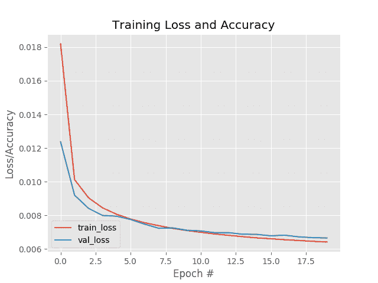
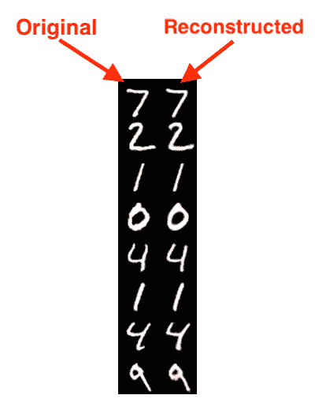
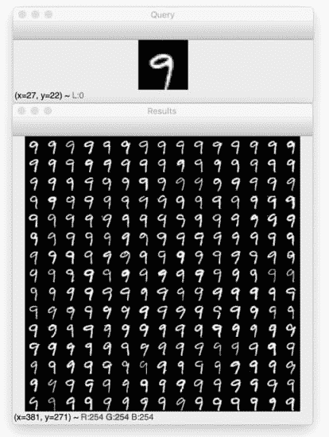
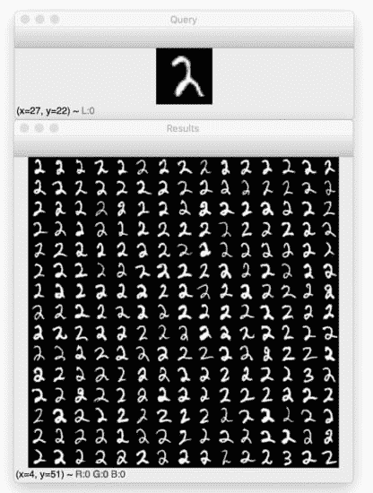
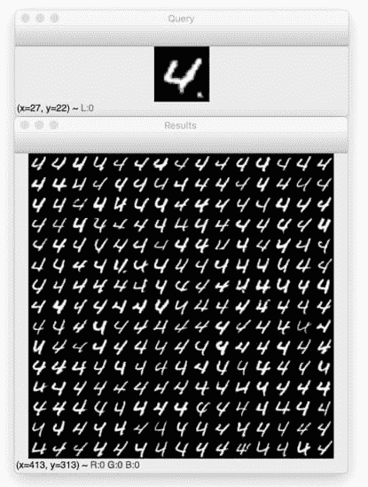
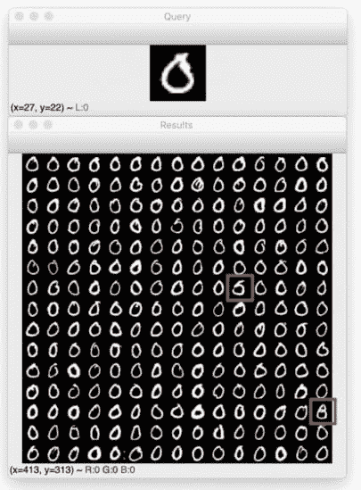

# 使用 Keras 和 TensorFlow 进行基于内容的图像检索的自动编码器

> 原文：<https://pyimagesearch.com/2020/03/30/autoencoders-for-content-based-image-retrieval-with-keras-and-tensorflow/>

在本教程中，您将学习如何使用卷积自动编码器，通过 Keras 和 TensorFlow 创建一个基于内容的图像检索系统(即图像搜索引擎)。

几周前，我撰写了一系列关于自动编码器的教程:

1.  **第一部分:** *[自动编码器简介](https://pyimagesearch.com/2020/02/17/autoencoders-with-keras-tensorflow-and-deep-learning/)*
2.  **第二部分:** *[去噪自动编码器](https://pyimagesearch.com/2020/02/24/denoising-autoencoders-with-keras-tensorflow-and-deep-learning/)*
3.  **第三部分:** *[用自动编码器进行异常检测](https://pyimagesearch.com/2020/03/02/anomaly-detection-with-keras-tensorflow-and-deep-learning/)*

这些教程大受欢迎；然而，我*没有*触及的一个话题是**基于内容的图像检索(CBIR)** ，这实际上只是一个用于**图像搜索引擎的花哨的学术词汇。**

[图像搜索引擎](https://pyimagesearch.com/2014/12/01/complete-guide-building-image-search-engine-python-opencv/)类似于文本搜索引擎，只是没有向搜索引擎提供*文本查询*，而是提供了*图像查询* — **。然后，图像搜索引擎在其数据库中找到所有视觉上相似/相关的图像，并将其返回给您**(就像文本搜索引擎返回文章、博客帖子等的链接一样。).

基于深度学习的 CBIR 和图像检索可以被框定为一种形式的**无监督学习:**

*   当训练自动编码器时，我们*不*使用任何类别标签
*   然后，自动编码器用于计算我们数据集中每个图像的潜在空间向量表示(即，给定图像的“特征向量”)
*   然后，在搜索时，我们计算潜在空间向量之间的距离——***距离更小*，*更相关/视觉上相似*两幅图像是**

因此，我们可以将 CBIR 项目分为三个不同的阶段:

1.  **阶段#1:** 训练自动编码器
2.  **阶段#2:** 通过使用自动编码器计算图像的潜在空间表示，从数据集中的所有图像中提取特征
3.  **阶段#3:** 比较潜在空间向量以找到数据集中的所有相关图像

在本教程中，我将向您展示如何实现这些阶段，给您留下一个功能齐全的自动编码器和图像检索系统。

**要了解如何使用自动编码器通过 Keras 和 TensorFlow 进行图像检索，*请继续阅读！***

## 使用 Keras 和 TensorFlow 进行基于内容的图像检索的自动编码器

在本教程的第一部分，我们将讨论如何自动编码器可以用于图像检索和建立图像搜索引擎。

从那里，我们将实现一个卷积自动编码器，然后在我们的图像数据集上进行训练。

一旦自动编码器被训练，我们将为数据集中的每幅图像计算**特征向量**。计算给定图像的特征向量只需要图像通过网络向前传递——编码器的输出(即潜在空间表示)将作为我们的特征向量。

所有图像编码后，我们可以通过计算矢量之间的距离来比较矢量。距离较小的图像将比距离较大的图像更相似。

最后，我们将回顾应用我们的自动编码器进行图像检索的结果。

### 如何将自动编码器用于图像检索和图像搜索引擎？

正如在我的[自动编码器简介](https://pyimagesearch.com/2020/02/17/autoencoders-with-keras-tensorflow-and-deep-learning/)教程中所讨论的，自动编码器:

1.  接受一组输入数据(即输入)
2.  在内部将输入数据压缩成一个**潜在空间表示**(即压缩和量化输入的单个向量)
3.  从这个潜在表示(即输出)中重建输入数据

为了用自动编码器建立一个图像检索系统，我们真正关心的是潜在空间表示向量。

一旦自动编码器被训练编码图像，我们就可以:

1.  使用网络的编码器部分来计算我们的数据集中每个图像的潜在空间表示— **该表示用作我们的特征向量，其量化图像的内容**
2.  将查询图像的特征向量与数据集中的所有特征向量进行比较(通常使用欧几里德距离或余弦距离)

具有*较小距离*的特征向量将被认为*更相似，*而具有*较大距离*的图像将被认为*不太相似。*

然后，我们可以根据距离(从最小到最大)对结果进行排序，并最终向最终用户显示图像检索结果。

### 项目结构

继续从 ***“下载”*** 部分获取本教程的文件。从那里，提取。zip，并打开文件夹进行检查:

```
$ tree --dirsfirst
.
├── output
│   ├── autoencoder.h5
│   ├── index.pickle
│   ├── plot.png
│   └── recon_vis.png
├── pyimagesearch
│   ├── __init__.py
│   └── convautoencoder.py
├── index_images.py
├── search.py
└── train_autoencoder.py

2 directories, 9 files
```

本教程由三个 Python 驱动程序脚本组成:

*   `train_autoencoder.py`:使用`ConvAutoencoder` CNN/class 在 MNIST 手写数字数据集上训练一个自动编码器
*   `index_images.py`:使用我们训练过的自动编码器的编码器部分，我们将计算数据集中每个图像的特征向量，并将这些特征添加到可搜索的索引中
*   `search.py`:使用相似性度量查询相似图像的索引

我们的`output/`目录包含我们训练过的自动编码器和索引。训练还会产生一个训练历史图和可视化图像，可以导出到`output/`文件夹。

### 为图像检索实现我们的卷积自动编码器架构

在训练我们的自动编码器之前，我们必须首先实现架构本身。为此，我们将使用 Keras 和 TensorFlow。

我们之前已经在 *PyImageSearch* 博客上实现过几次卷积自动编码器，所以当我今天在这里报道完整的实现时，你会想要参考我的[自动编码器简介教程](https://pyimagesearch.com/2020/02/17/autoencoders-with-keras-tensorflow-and-deep-learning/)以获得更多细节。

在`pyimagesearch`模块中打开`convautoencoder.py`文件，让我们开始工作:

```
# import the necessary packages
from tensorflow.keras.layers import BatchNormalization
from tensorflow.keras.layers import Conv2D
from tensorflow.keras.layers import Conv2DTranspose
from tensorflow.keras.layers import LeakyReLU
from tensorflow.keras.layers import Activation
from tensorflow.keras.layers import Flatten
from tensorflow.keras.layers import Dense
from tensorflow.keras.layers import Reshape
from tensorflow.keras.layers import Input
from tensorflow.keras.models import Model
from tensorflow.keras import backend as K
import numpy as np
```

导入包括来自`tf.keras`和 NumPy 的选择。接下来我们将继续定义我们的 autoencoder 类:

```
class ConvAutoencoder:
	@staticmethod
	def build(width, height, depth, filters=(32, 64), latentDim=16):
		# initialize the input shape to be "channels last" along with
		# the channels dimension itself
		# channels dimension itself
		inputShape = (height, width, depth)
		chanDim = -1

		# define the input to the encoder
		inputs = Input(shape=inputShape)
		x = inputs

		# loop over the number of filters
		for f in filters:
			# apply a CONV => RELU => BN operation
			x = Conv2D(f, (3, 3), strides=2, padding="same")(x)
			x = LeakyReLU(alpha=0.2)(x)
			x = BatchNormalization(axis=chanDim)(x)

		# flatten the network and then construct our latent vector
		volumeSize = K.int_shape(x)
		x = Flatten()(x)
		latent = Dense(latentDim, name="encoded")(x)
```

我们的`ConvAutoencoder`类包含一个静态方法`build`，它接受五个参数:(1) `width`、(2) `height`、(3) `depth`、(4) `filters`和(5) `latentDim`。

然后为编码器定义了`Input`，此时我们使用 [Keras 的功能 API](https://pyimagesearch.com/2019/10/28/3-ways-to-create-a-keras-model-with-tensorflow-2-0-sequential-functional-and-model-subclassing/) 循环遍历我们的`filters`并添加我们的`CONV => LeakyReLU => BN`层集合(**第 21-33 行**)。

然后我们拉平网络，构建我们的*潜在向量* ( **第 36-38 行**)。

潜在空间表示是我们数据的压缩形式— **一旦经过训练，这一层的输出将是我们用于量化和表示输入图像内容的特征向量。**

从这里开始，我们将构建网络解码器部分的输入:

```
		# start building the decoder model which will accept the
		# output of the encoder as its inputs
		x = Dense(np.prod(volumeSize[1:]))(latent)
		x = Reshape((volumeSize[1], volumeSize[2], volumeSize[3]))(x)

		# loop over our number of filters again, but this time in
		# reverse order
		for f in filters[::-1]:
			# apply a CONV_TRANSPOSE => RELU => BN operation
			x = Conv2DTranspose(f, (3, 3), strides=2,
				padding="same")(x)
			x = LeakyReLU(alpha=0.2)(x)
			x = BatchNormalization(axis=chanDim)(x)

		# apply a single CONV_TRANSPOSE layer used to recover the
		# original depth of the image
		x = Conv2DTranspose(depth, (3, 3), padding="same")(x)
		outputs = Activation("sigmoid", name="decoded")(x)

		# construct our autoencoder model
		autoencoder = Model(inputs, outputs, name="autoencoder")

		# return the autoencoder model
		return autoencoder
```

解码器模型接受编码器的输出作为其输入(**行 42 和 43** )。

以相反的顺序循环通过`filters`，我们构造`CONV_TRANSPOSE => LeakyReLU => BN`层块(**第 47-52 行**)。

**第 56-63 行**恢复图像的原始`depth`。

最后，我们构造并返回我们的`autoencoder`模型(**第 60-63 行**)。

有关我们实现的更多细节，请务必参考我们的【Keras 和 TensorFlow 自动编码器简介教程。

### 使用 Keras 和 TensorFlow 创建自动编码器训练脚本

随着我们的自动编码器的实现，让我们继续训练脚本(**阶段#1** )。

打开`train_autoencoder.py`脚本，插入以下代码:

```
# set the matplotlib backend so figures can be saved in the background
import matplotlib
matplotlib.use("Agg")

# import the necessary packages
from pyimagesearch.convautoencoder import ConvAutoencoder
from tensorflow.keras.optimizers import Adam
from tensorflow.keras.datasets import mnist
import matplotlib.pyplot as plt
import numpy as np
import argparse
import cv2
```

在**2-12 号线，**我们处理我们的进口。我们将使用`matplotlib`的`"Agg"`后端，这样我们可以将我们的训练图导出到磁盘。我们需要前一节中的自定义`ConvAutoencoder`架构类。当我们在 [MNIST 基准数据集](http://yann.lecun.com/exdb/mnist/)上训练时，我们将利用`Adam`优化器。

为了可视化，我们将在`visualize_predictions`助手函数中使用 OpenCV:

```
def visualize_predictions(decoded, gt, samples=10):
	# initialize our list of output images
	outputs = None

	# loop over our number of output samples
	for i in range(0, samples):
		# grab the original image and reconstructed image
		original = (gt[i] * 255).astype("uint8")
		recon = (decoded[i] * 255).astype("uint8")

		# stack the original and reconstructed image side-by-side
		output = np.hstack([original, recon])

		# if the outputs array is empty, initialize it as the current
		# side-by-side image display
		if outputs is None:
			outputs = output

		# otherwise, vertically stack the outputs
		else:
			outputs = np.vstack([outputs, output])

	# return the output images
	return outputs
```

在`visualize_predictions`助手中，我们将我们的原始地面实况输入图像(`gt`)与来自自动编码器(`decoded`)的输出重建图像进行比较，并生成并排比较蒙太奇。

**第 16 行**初始化我们的输出图像列表。

然后我们循环遍历`samples`:

*   抓取*原始和重建图像*(**第 21 和 22 行**)
*   并排堆叠一对图像*(**第 25 行**)*
**   垂直堆叠线对*(**第 29-34 行**)**

 **最后，我们将可视化图像返回给调用者( **Line 37** )。

我们需要一些命令行参数来让我们的脚本从我们的终端/命令行运行:

```
# construct the argument parse and parse the arguments
ap = argparse.ArgumentParser()
ap.add_argument("-m", "--model", type=str, required=True,
	help="path to output trained autoencoder")
ap.add_argument("-v", "--vis", type=str, default="recon_vis.png",
	help="path to output reconstruction visualization file")
ap.add_argument("-p", "--plot", type=str, default="plot.png",
	help="path to output plot file")
args = vars(ap.parse_args())
```

这里我们[解析三个命令行参数](https://pyimagesearch.com/2018/03/12/python-argparse-command-line-arguments/):

*   `--model`:指向我们训练过的输出 autoencoder 的路径——执行这个脚本的结果
*   `--vis`:输出可视化图像的路径。默认情况下，我们将我们的可视化命名为`recon_vis.png`
*   `--plot`:matplotlib 输出图的路径。如果终端中未提供该参数，则分配默认值`plot.png`

既然我们的导入、助手函数和命令行参数已经准备好了，我们将准备训练我们的自动编码器:

```
# initialize the number of epochs to train for, initial learning rate,
# and batch size
EPOCHS = 20
INIT_LR = 1e-3
BS = 32

# load the MNIST dataset
print("[INFO] loading MNIST dataset...")
((trainX, _), (testX, _)) = mnist.load_data()

# add a channel dimension to every image in the dataset, then scale
# the pixel intensities to the range [0, 1]
trainX = np.expand_dims(trainX, axis=-1)
testX = np.expand_dims(testX, axis=-1)
trainX = trainX.astype("float32") / 255.0
testX = testX.astype("float32") / 255.0

# construct our convolutional autoencoder
print("[INFO] building autoencoder...")
autoencoder = ConvAutoencoder.build(28, 28, 1)
opt = Adam(lr=INIT_LR, decay=INIT_LR / EPOCHS)
autoencoder.compile(loss="mse", optimizer=opt)

# train the convolutional autoencoder
H = autoencoder.fit(
	trainX, trainX,
	validation_data=(testX, testX),
	epochs=EPOCHS,
	batch_size=BS)
```

在**行 51-53** 中定义了超参数常数，包括训练时期数、学习率和批量大小。

我们的自动编码器(因此我们的 CBIR 系统)将在 **MNIST 手写数字数据集**上被训练，我们从磁盘的**第 57 行加载该数据集。**

为了预处理 MNIST 图像，我们向训练/测试集添加通道维度(**行 61 和 62** )并将像素强度缩放到范围*【0，1】*(**行 63 和 64** )。

随着我们的数据准备就绪，**第 68-70 行** `compile`我们的`autoencoder`与`Adam`优化器和均方差`loss`。

**第 73-77 行**然后将我们的模型与数据拟合(即训练我们的`autoencoder`)。

一旦模型被训练好，我们就可以用它来做预测:

```
# use the convolutional autoencoder to make predictions on the
# testing images, construct the visualization, and then save it
# to disk
print("[INFO] making predictions...")
decoded = autoencoder.predict(testX)
vis = visualize_predictions(decoded, testX)
cv2.imwrite(args["vis"], vis)

# construct a plot that plots and saves the training history
N = np.arange(0, EPOCHS)
plt.style.use("ggplot")
plt.figure()
plt.plot(N, H.history["loss"], label="train_loss")
plt.plot(N, H.history["val_loss"], label="val_loss")
plt.title("Training Loss and Accuracy")
plt.xlabel("Epoch #")
plt.ylabel("Loss/Accuracy")
plt.legend(loc="lower left")
plt.savefig(args["plot"])

# serialize the autoencoder model to disk
print("[INFO] saving autoencoder...")
autoencoder.save(args["model"], save_format="h5")
```

**第 83 行和第 84 行**对测试集进行预测，并使用我们的助手函数生成我们的自动编码器可视化。**第 85 行**使用 OpenCV 将可视化写入磁盘。

最后，我们绘制培训历史(**第 88-97 行**)并将我们的`autoencoder`序列化到磁盘(**第 101 行**)。

在下一部分中，我们将使用培训脚本。

### 训练自动编码器

我们现在准备训练我们的卷积自动编码器进行图像检索。

确保使用本教程的 ***【下载】*** 部分下载源代码，并从那里执行以下命令开始训练过程:

```
$ python train_autoencoder.py --model output/autoencoder.h5 \
    --vis output/recon_vis.png --plot output/plot.png
[INFO] loading MNIST dataset...
[INFO] building autoencoder...
Train on 60000 samples, validate on 10000 samples
Epoch 1/20
60000/60000 [==============================] - 73s 1ms/sample - loss: 0.0182 - val_loss: 0.0124
Epoch 2/20
60000/60000 [==============================] - 73s 1ms/sample - loss: 0.0101 - val_loss: 0.0092
Epoch 3/20
60000/60000 [==============================] - 73s 1ms/sample - loss: 0.0090 - val_loss: 0.0084
...
Epoch 18/20
60000/60000 [==============================] - 72s 1ms/sample - loss: 0.0065 - val_loss: 0.0067
Epoch 19/20
60000/60000 [==============================] - 73s 1ms/sample - loss: 0.0065 - val_loss: 0.0067
Epoch 20/20
60000/60000 [==============================] - 73s 1ms/sample - loss: 0.0064 - val_loss: 0.0067
[INFO] making predictions...
[INFO] saving autoencoder...
```

在我的 3Ghz 英特尔至强 W 处理器上，整个培训过程花费了大约 24 分钟。

查看**图 2、**中的曲线，我们可以看到训练过程是稳定的，没有过度拟合的迹象:



**Figure 2:** Training an autoencoder with Keras and TensorFlow for Content-based Image Retrieval (CBIR).

此外，下面的重构图表明，我们的自动编码器在重构输入数字方面做得非常好。



**Figure 3:** Visualizing reconstructed data from an autoencoder trained on MNIST using TensorFlow and Keras for image search engine purposes.

我们的自动编码器做得如此之好的事实也意味着我们的潜在空间表示向量在压缩、量化和表示输入图像方面做得很好——当构建图像检索系统时，**拥有这样的表示是*要求*。**

如果特征向量不能捕捉和量化图像的内容，那么*CBIR 系统将无法*返回相关图像。

如果您发现您的自动编码器无法正确重建图像，那么您的自动编码器不太可能在图像检索方面表现良好。

小心训练一个精确的自动编码器——这样做将有助于确保你的图像检索系统返回相似的图像。

### 使用经过训练的自动编码器实现图像索引器

随着我们的自动编码器成功训练(**阶段#1** ，我们可以继续进行图像检索管道的**特征提取/索引**阶段(**阶段#2** )。

这个阶段至少要求我们使用经过训练的自动编码器(特别是“编码器”部分)来接受输入图像，执行前向传递，然后获取网络编码器部分的输出，以生成我们的**特征向量**的索引。这些特征向量意味着量化每个图像的内容。

可选地，我们也可以使用专门的数据结构，例如 [VP-Trees](https://pyimagesearch.com/2019/08/26/building-an-image-hashing-search-engine-with-vp-trees-and-opencv/) 和随机投影树来提高我们的图像检索系统的查询速度。

打开目录结构中的`index_images.py`文件，我们将开始:

```
# import the necessary packages
from tensorflow.keras.models import Model
from tensorflow.keras.models import load_model
from tensorflow.keras.datasets import mnist
import numpy as np
import argparse
import pickle

# construct the argument parse and parse the arguments
ap = argparse.ArgumentParser()
ap.add_argument("-m", "--model", type=str, required=True,
	help="path to trained autoencoder")
ap.add_argument("-i", "--index", type=str, required=True,
	help="path to output features index file")
args = vars(ap.parse_args())
```

我们从进口开始。我们的`tf.keras`导入包括(1) `Model`以便我们可以构建编码器，(2) `load_model`以便我们可以加载我们在上一步中训练的自动编码器模型，以及(3)我们的`mnist`数据集。我们的特征向量索引将被序列化为一个 Python `pickle`文件。

我们有两个必需的[命令行参数](https://pyimagesearch.com/2018/03/12/python-argparse-command-line-arguments/):

*   `--model`:上一步训练好的自动编码器输入路径
*   `--index`:输出特征索引文件的路径，格式为`.pickle`

从这里，我们将加载并预处理我们的 MNIST 数字数据:

```
# load the MNIST dataset
print("[INFO] loading MNIST training split...")
((trainX, _), (testX, _)) = mnist.load_data()

# add a channel dimension to every image in the training split, then
# scale the pixel intensities to the range [0, 1]
trainX = np.expand_dims(trainX, axis=-1)
trainX = trainX.astype("float32") / 255.0
```

请注意，预处理步骤*与我们训练过程的步骤*相同。

然后我们将加载我们的自动编码器:

```
# load our autoencoder from disk
print("[INFO] loading autoencoder model...")
autoencoder = load_model(args["model"])

# create the encoder model which consists of *just* the encoder
# portion of the autoencoder
encoder = Model(inputs=autoencoder.input,
	outputs=autoencoder.get_layer("encoded").output)

# quantify the contents of our input images using the encoder
print("[INFO] encoding images...")
features = encoder.predict(trainX)
```

**第 28 行**从磁盘加载我们的`autoencoder`(在上一步中训练的)。

然后，使用自动编码器的`input`，我们创建一个`Model`，同时只访问网络的`encoder`部分(即潜在空间特征向量)作为`output` ( **行 32 和 33** )。

然后，我们将 MNIST 数字图像数据通过`encoder`来计算**第 37 行**上的特征向量`features`。

最后，我们构建了特征数据的字典映射:

```
# construct a dictionary that maps the index of the MNIST training
# image to its corresponding latent-space representation
indexes = list(range(0, trainX.shape[0]))
data = {"indexes": indexes, "features": features}

# write the data dictionary to disk
print("[INFO] saving index...")
f = open(args["index"], "wb")
f.write(pickle.dumps(data))
f.close()
```

**第 42 行**构建了一个由两部分组成的`data`字典:

*   `indexes`:数据集中每个 MNIST 数字图像的整数索引
*   `features`:数据集中每幅图像对应的特征向量

最后，**第 46-48 行**以 Python 的`pickle`格式将`data`序列化到磁盘。

### 为图像检索索引我们的图像数据集

我们现在准备使用自动编码器量化我们的图像数据集，特别是使用网络编码器部分的潜在空间输出。

要使用经过训练的 autoencoder 量化我们的图像数据集，请确保使用本教程的 ***“下载”*** 部分下载源代码和预训练模型。

从那里，打开一个终端并执行以下命令:

```
$ python index_images.py --model output/autoencoder.h5 \
	--index output/index.pickle
[INFO] loading MNIST training split...
[INFO] loading autoencoder model...
[INFO] encoding images...
[INFO] saving index...
```

如果您检查您的`output`目录的内容，您现在应该看到您的`index.pickle`文件:

```
$ ls output/*.pickle
output/index.pickle
```

### 使用 Keras 和 TensorFlow 实现图像搜索和检索脚本

我们的最终脚本，我们的图像搜索器，将所有的片段放在一起，并允许我们完成我们的 autoencoder 图像检索项目(**阶段#3** )。同样，我们将在这个实现中使用 Keras 和 TensorFlow。

打开`search.py`脚本，插入以下内容:

```
# import the necessary packages
from tensorflow.keras.models import Model
from tensorflow.keras.models import load_model
from tensorflow.keras.datasets import mnist
from imutils import build_montages
import numpy as np
import argparse
import pickle
import cv2
```

如您所见，这个脚本需要与我们的索引器相同的`tf.keras`导入。此外，我们将使用我的 [imutils 包](https://github.com/jrosebr1/imutils)中的`build_montages`便利脚本来显示我们的 autoencoder CBIR 结果。

让我们定义一个函数来计算两个特征向量之间的相似性:

```
def euclidean(a, b):
	# compute and return the euclidean distance between two vectors
	return np.linalg.norm(a - b)
```

这里我们用欧几里德距离来计算两个特征向量`a`和`b`之间的相似度。

有多种方法可以计算距离-对于许多 CBIR 应用程序来说，余弦距离是一种很好的替代方法。我还会在 [PyImageSearch 大师课程](https://pyimagesearch.com/pyimagesearch-gurus/)中介绍其他距离算法。

接下来，我们将定义我们的搜索函数:

```
def perform_search(queryFeatures, index, maxResults=64):
	# initialize our list of results
	results = []

	# loop over our index
	for i in range(0, len(index["features"])):
		# compute the euclidean distance between our query features
		# and the features for the current image in our index, then
		# update our results list with a 2-tuple consisting of the
		# computed distance and the index of the image
		d = euclidean(queryFeatures, index["features"][i])
		results.append((d, i))

	# sort the results and grab the top ones
	results = sorted(results)[:maxResults]

	# return the list of results
	return results
```

我们的`perform_search`函数负责比较所有特征向量的相似性，并返回`results`。

该函数接受查询图像的特征向量`queryFeatures`和要搜索的所有特征的`index`。

我们的`results`将包含顶部的`maxResults`(在我们的例子中，`64`是默认的，但我们很快会将其覆盖为`225`)。

**第 17 行**初始化我们的列表`results`，然后**第 20-20 行**填充它。这里，我们循环遍历`index`中的所有条目，计算`queryFeatures`和`index`中当前特征向量之间的欧几里德距离。

说到距离:

*   *距离*越小，*两幅图像越相似*
*   *距离*越大，*越不相似*

我们排序并抓取顶部的`results`，这样通过**第 29 行**与查询更相似的图像就在列表的最前面。

最后，我们`return`将搜索结果传递给调用函数(**第 32 行**)。

定义了距离度量和搜索工具后，我们现在准备好[解析命令行参数](https://pyimagesearch.com/pyimagesearch-gurus/):

```
# construct the argument parse and parse the arguments
ap = argparse.ArgumentParser()
ap.add_argument("-m", "--model", type=str, required=True,
	help="path to trained autoencoder")
ap.add_argument("-i", "--index", type=str, required=True,
	help="path to features index file")
ap.add_argument("-s", "--sample", type=int, default=10,
	help="# of testing queries to perform")
args = vars(ap.parse_args())
```

我们的脚本接受三个命令行参数:

*   `--model`:从*“训练自动编码器”*部分到被训练自动编码器的路径
*   `--index`:我们要搜索的特征索引(即来自*“为图像检索而索引我们的图像数据集”部分的序列化索引)*
*   `--sample`:要执行的测试查询的数量，默认值为`10`

现在，让我们加载并预处理我们的数字数据:

```
# load the MNIST dataset
print("[INFO] loading MNIST dataset...")
((trainX, _), (testX, _)) = mnist.load_data()

# add a channel dimension to every image in the dataset, then scale
# the pixel intensities to the range [0, 1]
trainX = np.expand_dims(trainX, axis=-1)
testX = np.expand_dims(testX, axis=-1)
trainX = trainX.astype("float32") / 255.0
testX = testX.astype("float32") / 255.0
```

然后我们将加载我们的自动编码器和索引:

```
# load the autoencoder model and index from disk
print("[INFO] loading autoencoder and index...")
autoencoder = load_model(args["model"])
index = pickle.loads(open(args["index"], "rb").read())

# create the encoder model which consists of *just* the encoder
# portion of the autoencoder
encoder = Model(inputs=autoencoder.input,
	outputs=autoencoder.get_layer("encoded").output)

# quantify the contents of our input testing images using the encoder
print("[INFO] encoding testing images...")
features = encoder.predict(testX)
```

这里，**线 57** 从磁盘加载我们训练好的`autoencoder`，而**线 58** 从磁盘加载我们腌制好的`index`。

然后我们构建一个`Model`，它将接受我们的图像作为一个`input`和我们的`encoder`层的`output`(即特征向量)作为我们模型的输出(**第 62 和 63 行**)。

给定我们的`encoder` , **行 67** 通过网络向前传递我们的测试图像集，生成一个`features`列表来量化它们。

我们现在将随机抽取一些图像样本，将它们标记为查询:

```
# randomly sample a set of testing query image indexes
queryIdxs = list(range(0, testX.shape[0]))
queryIdxs = np.random.choice(queryIdxs, size=args["sample"],
	replace=False)

# loop over the testing indexes
for i in queryIdxs:
	# take the features for the current image, find all similar
	# images in our dataset, and then initialize our list of result
	# images
	queryFeatures = features[i]
	results = perform_search(queryFeatures, index, maxResults=225)
	images = []

	# loop over the results
	for (d, j) in results:
		# grab the result image, convert it back to the range
		# [0, 255], and then update the images list
		image = (trainX[j] * 255).astype("uint8")
		image = np.dstack([image] * 3)
		images.append(image)

	# display the query image
	query = (testX[i] * 255).astype("uint8")
	cv2.imshow("Query", query)

	# build a montage from the results and display it
	montage = build_montages(images, (28, 28), (15, 15))[0]
	cv2.imshow("Results", montage)
	cv2.waitKey(0)
```

**第 70-72 行**采样一组测试图像索引，**将它们标记为我们的搜索引擎查询。**

然后我们从第 75 行的**开始循环查询。在内部，我们:**

*   抓住`queryFeatures`，**执行搜索**(**79 行和 80 行**)
*   初始化一个列表来保存我们的结果`images` ( **第 81 行**)
*   对结果进行循环，将图像缩放回范围*【0，255】*，从灰度图像创建 RGB 表示用于显示，然后将其添加到我们的`images`结果中(**第 84-89 行**)
*   在自己的 OpenCV 窗口中显示查询图像(**第 92 行和第 93 行**)
*   显示搜索引擎结果**中的`montage`**(**第 96 行和第 97 行**)
*   当用户按下一个键时，我们用一个*不同的*查询图像重复这个过程(**行 98**)；您应该在检查结果时继续按键，直到搜索完所有的查询样本

回顾一下我们的搜索脚本，首先我们加载了自动编码器和索引。

然后，我们抓住自动编码器的编码器部分，用它来量化我们的图像(即，创建特征向量)。

从那里，我们创建了一个随机查询图像的样本来测试我们的基于欧氏距离计算的搜索方法。较小的距离表示相似的图像——相似的图像将首先显示，因为我们的`results`是`sorted` ( **第 29 行**)。

我们搜索了每个查询的索引，在每个剪辑中最多只显示了`maxResults`。

在下一节中，我们将有机会直观地验证我们基于 autoencoder 的搜索引擎是如何工作的。

### 使用自动编码器、Keras 和 TensorFlow 的图像检索结果

我们现在可以看到我们的 autoencoder 图像检索系统的运行了！

首先确保你有:

1.  使用本教程的 ***【下载】*** 部分下载源代码
2.  执行`train_autoencoder.py`文件来训练卷积自动编码器
3.  运行`index_images.py`来量化我们数据集中的每幅图像

从那里，您可以执行`search.py`脚本来执行搜索:

```
$ python search.py --model output/autoencoder.h5 \
	--index output/index.pickle
[INFO] loading MNIST dataset...
[INFO] loading autoencoder and index...
[INFO] encoding testing images...
```

下面的例子提供了一个包含数字`9` ( *顶部*)的查询图像，以及来自我们的 autoencoder 图像检索系统*(底部)*的搜索结果:



**Figure 4:** *Top:* MNIST query image. *Bottom:* Autoencoder-based image search engine results. We learn how to use Keras, TensorFlow, and OpenCV to build a Content-based Image Retrieval (CBIR) system.

在这里，您可以看到我们的系统返回的搜索结果也包含 9。

现在让我们使用一个`2`作为我们的查询图像:



**Figure 5:** Content-based Image Retrieval (CBIR) is used with an autoencoder to find images of handwritten 2s in our dataset.

果然，我们的 CBIR 系统返回包含二的数字，这意味着潜在空间表示已经正确量化了`2`的样子。

下面是一个使用`4`作为查询图像的例子:



**Figure 6:** Content-based Image Retrieval (CBIR) is used with an autoencoder to find images of handwritten 4s in our dataset.

同样，我们的 autoencoder 图像检索系统返回所有四个作为搜索结果。

让我们看最后一个例子，这次使用一个`0`作为查询图像:



**Figure 7:** No image search engine is perfect. Here, there are mistakes in our results from searching MNIST for handwritten 0s using an autoencoder-based image search engine built with TensorFlow, Keras, and OpenCV.

这个结果更有趣—注意截图中突出显示的两个结果。

第一个高亮显示的结果可能是一个`5`，但是五的尾部似乎连接到中间部分，创建了一个数字，看起来像是一个`0`和一个`8`之间的交叉。

然后，我们在搜索结果的底部看到我认为是一个`8`(也用红色突出显示)。同样，我们可以理解我们的图像检索系统是如何将`8`视为与`0`在视觉上相似的。

### 提高 autoencoder 图像检索准确性和速度的技巧

在本教程中，我们在 MNIST 数据集上执行图像检索，以演示如何使用自动编码器来构建图像搜索引擎。

但是，您很可能希望使用自己的影像数据集，而不是 MNIST 数据集。

换入您自己的数据集就像用您自己的数据集加载器替换 MNIST 数据集加载器辅助函数一样简单-然后您可以在您的数据集上训练自动编码器。

然而，确保你的自动编码器足够精确。

如果您的自动编码器无法合理地重建您的输入数据，则:

1.  自动编码器无法捕获数据集中的模式
2.  潜在空间向量不会正确量化你的图像
3.  没有适当的量化，您的图像检索系统将返回不相关的结果

**因此，几乎您的 CBIR 系统的*整体精度*取决于您的自动编码器——请花时间确保它经过适当的培训。**

一旦你的自动编码器运行良好，你就可以继续优化搜索过程的速度。

其次，您还应该考虑 CBIR 系统的可扩展性。

我们在这里的实现是一个线性搜索的例子，复杂度为 *O(N)* ，这意味着它不能很好地扩展。

为了提高检索系统的速度，您应该使用近似最近邻算法和专门的数据结构，如 VP 树、随机投影树等。，可以将计算复杂度降低到 *O(log N)。*

要了解更多关于这些技术的内容，请参考我的文章用 VP-Trees 和 OpenCV 构建一个图像哈希搜索引擎。

## 摘要

在本教程中，您学习了如何使用 TensorFlow 和 Keras 将卷积自动编码器用于图像检索。

为了创建我们的图像检索系统，我们:

1.  在我们的图像数据集上训练卷积自动编码器
2.  使用经过训练的自动编码器来计算我们的数据集中每个图像的潜在空间表示——该表示作为我们的特征向量来量化图像的内容
3.  使用距离函数将查询图像的特征向量与数据集中的所有特征向量进行比较(在这种情况下，使用欧几里德距离，但余弦距离也适用)。向量之间的距离越小，*我们的图像就越相似。*

然后，我们根据计算出的距离对结果进行排序，并向用户显示结果。

自动编码器对于 CBIR 应用来说非常有用— **缺点是它们需要*大量的*训练数据，这些数据你可能有也可能没有。**

更高级的深度学习图像检索系统依赖于连体网络和三重损失来嵌入图像的向量，以便更相似的图像在欧几里得空间中靠得更近，而不太相似的图像离得更远——我将在未来的某个日期讨论这些类型的网络架构和技术。

**要下载这篇文章的源代码(包括预先训练的 autoencoder)，*只需在下面的表格中输入您的电子邮件地址！*****