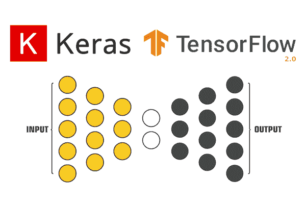
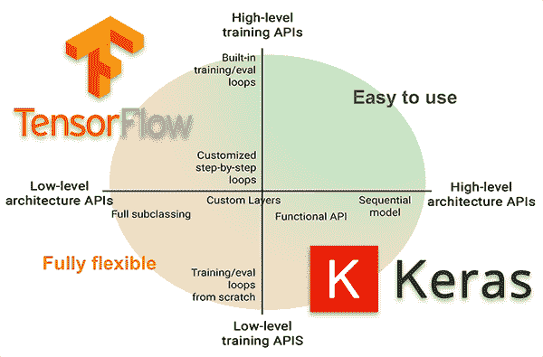
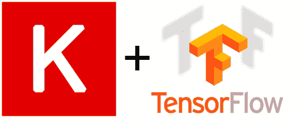
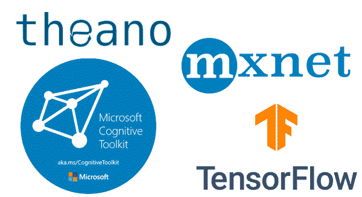
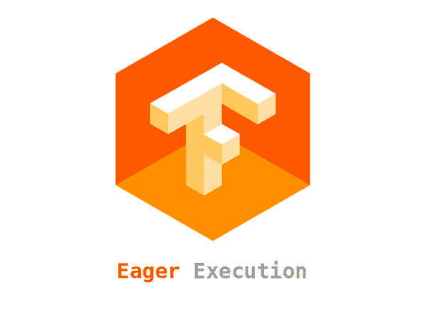
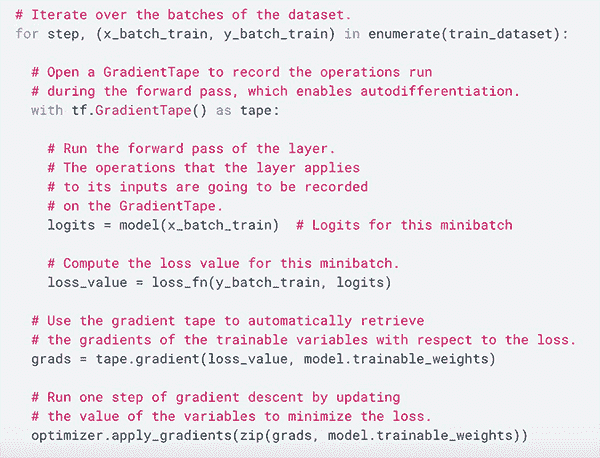
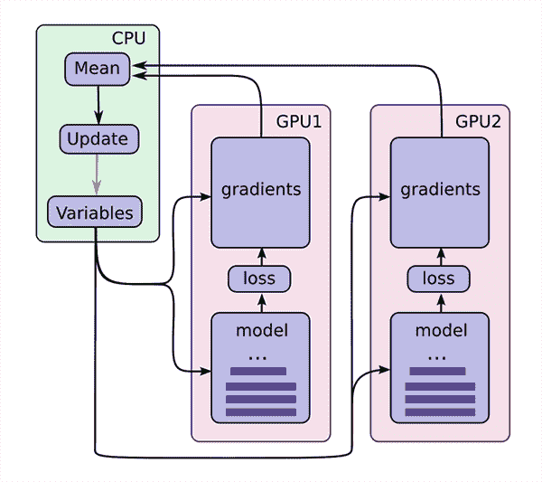
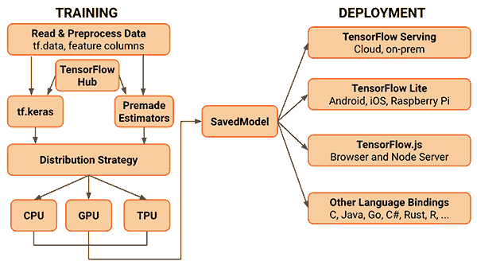

# keras vs . TF . keras:tensor flow 2.0 有什么不同？

> 原文：<https://pyimagesearch.com/2019/10/21/keras-vs-tf-keras-whats-the-difference-in-tensorflow-2-0/>

[](https://pyimagesearch.com/wp-content/uploads/2019/10/keras_vs_tfdotkeras_header.png)

在本教程中，您将发现 Keras 和`tf.keras`之间的区别，包括 TensorFlow 2.0 中的新功能。

今天的教程是从上周二我收到的一封来自 PyImageSearch 读者 Jeremiah 的电子邮件中得到启发的。

耶利米问道:

> 你好 Adrian，我看到前几天发布了 TensorFlow 2.0。
> 
> TensorFlow 开发者似乎正在推广 Keras，或者更确切地说， ***一种叫做 tf.keras，*** 的东西，作为 TensorFlow 2.0 的推荐高级 API。
> 
> 但是我以为 Keras 是它自己的独立包装？
> 
> 当我训练我自己的网络时，我对应该使用“哪个 Keras 包”感到困惑。
> 
> 其次，***tensor flow 2.0 值得升级到吗？***
> 
> 我在深度学习博客圈中看到了一些讨论 TensorFlow 2.0 的教程，但由于对 Keras、`tf.keras`和 TensorFlow 2.0 的所有困惑，我不知道从哪里开始。
> 
> 你能解释一下这个地区吗？

很好的问题，耶利米。

以防你没听说，期待已久的 TensorFlow 2.0 于 9 月 30 日正式发布。

虽然这肯定是一个值得庆祝的时刻，但许多深度学习实践者，如 Jeremiah，都在挠头:

*   TensorFlow 2.0 版本对我这个 Keras 用户来说意味着什么？
*   我应该用`keras`包来训练我自己的神经网络吗？
*   或者我应该使用 TensorFlow 2.0 中的`tf.keras`子模块？
*   作为一个 Keras 用户，我应该关心 TensorFlow 2.0 的哪些特性？

从 TensorFlow 1.x 到 TensorFlow 2.0 的过渡将会有点艰难，至少在开始时是这样，**但是有了正确的理解，您将能够轻松地完成迁移。**

在本教程的其余部分，我将讨论 Keras、`tf.keras`和 TensorFlow 2.0 版本之间的相似之处，包括你应该关心的特性*。*

**要了解 Keras、tf.keras 和 TensorFlow 2.0 的区别，** ***继续阅读！***

## keras vs . TF . keras:tensor flow 2.0 有什么不同？

在本教程的第一部分，我们将讨论 Keras 和 TensorFlow 之间交织的历史，包括它们的共同普及如何相互促进，相互成长和培育，引领我们到达今天的位置。

然后我会讨论**为什么你应该用`tf.keras`做*所有*你未来的深度学习项目和实验。**

接下来，我将讨论“计算后端”的概念，以及**TensorFlow 的流行如何使其成为 Keras 最流行的后端**，为 Keras 集成到 tensor flow 的`tf.keras`子模块铺平道路。

最后，我们将讨论作为 Keras 用户应该关注的一些最受欢迎的 TensorFlow 2.0 功能，包括:

*   会话和急切执行
*   自动微分
*   模型和层子类化
*   更好的多 GPU/分布式培训支持

TensorFlow 2.0 包含一个完整的生态系统，由 TensorFlow Lite(用于移动和嵌入式设备)和 tensor flow Extended for development production 机器学习管道(用于部署生产模型)组成。

我们开始吧！

### Keras 和张量流之间的交织关系

[](https://pyimagesearch.com/wp-content/uploads/2019/10/keras_vs_tfdotkeras_relationship.png)

**Figure 1:** Keras and TensorFlow have a complicated history together. Read this section for the Cliff’s Notes of their love affair. With TensorFlow 2.0, you should be using `tf.keras` rather than the separate Keras package.

了解 Keras 和 TensorFlow 之间复杂、交织的关系，就像听两个高中恋人开始约会、分手、最终找到共同道路的爱情故事——很长，很详细，在某些时候甚至是矛盾的。

我们不再为你回忆完整的爱情故事，而是回顾故事的片断:

*   Keras 最初是由谷歌人工智能开发人员/研究人员 [Francois Chollet](https://fchollet.com/) 创建和开发的。
*   Francois 在 2015 年 3 月 27 日提交并发布了第一版 Keras 到他的 GitHub。
*   最初，弗朗索瓦开发 Keras 是为了方便自己的研究和实验。
*   然而，随着深度学习普及的爆发，许多开发人员、程序员和机器学习从业者因其易于使用的 API 而涌向 Keras。
*   当时，没有太多的深度学习库可用——流行的包括 Torch、Theano 和 Caffe。
    *   这些库的问题在于，它就像试图编写汇编/C++来执行您的实验一样——乏味、耗时且低效。
    *   另一方面，Keras 非常容易使用，使得研究人员和开发人员能够更快地重复他们的实验*。*
*   为了训练你自己定制的神经网络， **Keras 需要一个** ***后端。***
    *   **A** ***后端*** **是一个计算引擎** —它构建网络图/拓扑，运行优化器，并执行实际的数字运算。
    *   为了理解后端的概念，考虑从头开始构建一个网站。这里你可以使用 PHP 编程语言和 SQL 数据库。您的 SQL 数据库是您的后端。您可以使用 MySQL、PostgreSQL 或 SQL Server 作为您的数据库；然而，用于与数据库交互的 PHP 代码不会改变(当然，前提是您使用某种抽象数据库层的 MVC 范式)。**本质上，PHP 并不关心使用的是什么数据库，只要它遵守 PHP 的规则。**
    *   Keras 也是如此。你可以把后端想象成你的数据库，把 Keras 想象成你用来访问数据库的编程语言。您可以换入任何您喜欢的后端，只要它遵守某些规则，您的代码就不必更改。
    *   因此，**你可以将 Keras 视为一组抽象，使其更容易执行深度学习** ( *边注:*虽然 Keras 一直支持快速原型制作，但对研究人员来说不够灵活。这在 TensorFlow 2.0 中有所改变，本文稍后将详细介绍)。
*   **最初，Keras 的默认后端是** [**Theano**](https://github.com/Theano/Theano) ，直到 v1.1.0 都是默认的
*   与此同时，**谷歌发布了 TensorFlow，**一个用于机器学习和训练神经网络的符号数学库。
    *   Keras 开始支持 TensorFlow 作为后端，慢慢地，但确实地，TensorFlow 成为最受欢迎的后端，**导致 TensorFlow 成为从** **Keras v1.1.0\.** 版本开始的 ***默认后端***

***   一旦 TensorFlow 成为 Keras 的默认后端，根据定义，**TensorFlow 和 Keras 的使用量一起增长** —没有 TensorFlow 就不可能有 Keras，如果你在系统上安装了 Keras，你也在安装 tensor flow。
    *   类似地，TensorFlow 用户越来越喜欢高级 Keras API 的简单性。*   **TensorFlow v 1 . 10 . 0 中引入了`tf.keras`子模块，**将 Keras *直接集成到 tensor flow 包本身内的第一步。*
    *   `tf.keras`包是/曾经是*与`keras`包分开的*，你将通过 pip(即`pip install keras`)安装该包。
    *   最初的`keras`包没有包含在`tensorflow`中，以确保兼容性，这样它们可以有机地开发。*   然而，现在这种情况正在改变——当谷歌在 2019 年 6 月宣布 TensorFlow 2.0 时，他们宣布 **Keras 现在是 TensorFlow** 的官方高级 API，用于快速轻松的模型设计和训练。*   随着 Keras 2.3.0 的[发布，Francois 声明:](https://github.com/keras-team/keras/releases)
    *   这是 Keras 的第一个版本，它使`keras`包与`tf.keras`同步
    *   Keras 的*最终*版本将支持多个后端(即，Theano、CNTK 等。).
    *   **最重要的是，未来所有深度学习实践者都应该将他们的代码切换到 TensorFlow 2.0 和`tf.keras`包。**
    *   最初的`keras`包仍然会得到错误修复，但是继续向前，**你应该使用`tf.keras`。****

 **正如你所知道的，Keras 和 TensorFlow 之间的历史是漫长的，复杂的，交织在一起的。

**但作为一名 Keras 用户，最重要的一点是，您应该在未来的项目中使用 TensorFlow 2.0 和`tf.keras`。**

### 开始在所有未来项目中使用`tf.keras`

[](https://pyimagesearch.com/wp-content/uploads/2019/10/keras_vs_tfdotkeras_together.png)

**Figure 2:** What’s the difference between Keras and tf.keras in TensorFlow 2.0?

2019 年 9 月 17 日 [Keras v2.3.0 正式发布](https://github.com/keras-team/keras/releases/tag/2.3.0) —在发布中 Francois Chollet(Keras 的创建者和主要维护者)表示:

> Keras v2.3.0 是*第一个*发布的 Keras，它使`keras`与`tf.keras`同步
> 
> 这将是最后一个支持 TensorFlow 之外的后端*和*的*主要版本(例如，Theano、CNTK 等)。)*
> 
> 最重要的是，**深度学习实践者应该开始转向 TensorFlow 2.0 和`tf.keras`包**

对于您的大多数项目来说，这很简单，只需将您的`import`行从:

```
from keras... import ...

```

给`import`加上`tensorflow`的前缀:

```
from tensorflow.keras... import ...

```

如果你正在使用定制的训练循环或者使用`Sessions`，那么你将不得不更新你的代码来使用新的`GradientTape`特性，但是总的来说，更新你的代码是相当容易的。

为了帮助你(自动)将代码从`keras`更新到`tf.keras`，谷歌发布了一个名为`tf_upgrade_v2`的脚本，顾名思义，它会分析你的代码并报告哪些行需要更新——该脚本甚至可以为你执行升级过程。

您可以[参考此处，了解更多关于自动将您的代码更新到 TensorFlow 2.0](https://www.tensorflow.org/guide/upgrade) 的信息。

### Keras 的计算“后端”

[](https://pyimagesearch.com/wp-content/uploads/2019/10/keras_vs_tfdotkeras_backends.png)

**Figure 3:** What computational backends does Keras support? What does it mean to use Keras directly in TensorFlow via `tf.keras`?

正如我在本文前面提到的，Keras 依赖于计算后端的概念。

计算后端在构建模型图、数值计算等方面执行所有的“繁重”工作。

**Keras 然后作为抽象坐在这个计算引擎之上，**让深度学习开发者/实践者更容易实现和训练他们的模型。

最初，Keras 支持 [Theano](https://github.com/Theano/Theano) 作为其首选的计算后端——后来它支持其他后端，包括 [CNTK](https://github.com/Microsoft/CNTK) 和 [mxnet](https://mxnet.incubator.apache.org/) ，仅举几例。

**然而，最流行的后端，** ***，*** **是 TensorFlow，它最终成为 Keras 的** ***默认*** **计算后端。**

随着越来越多的 TensorFlow 用户开始使用 Keras 的易用高级 API，TensorFlow 开发人员不得不认真考虑将 Keras 项目纳入 TensorFlow 中一个名为`tf.keras`的独立模块。

TensorFlow v1.10 是 TensorFlow 第一个在`tf.keras`中包含`keras`分支的版本。

**现在 TensorFlow 2.0 发布了*****`keras`和`tf.keras`都同步****，暗示`keras`和`tf.keras`仍然是*单独的*项目；然而，**开发者应该开始使用`tf.keras`向前发展，因为`keras`包将只支持错误修复。***

 *引用 Keras 的创建者和维护者 Francois Chollet 的话:

> 这也是多后端 Keras 的最后一个主要版本。展望未来，我们建议用户考虑在 TensorFlow 2.0 中将他们的 Keras 代码切换到`tf.keras`。
> 
> 它实现了相同的 Keras 2.3.0 API(因此切换应该像更改 Keras 导入语句一样容易)，但它对 TensorFlow 用户有许多优势，例如支持急切执行、分发、TPU 训练，以及低级 TensorFlow 和高级概念(如`Layer`和`Model`)之间通常更好的集成。
> 
> 也比较好保养。

如果你同时是 Keras 和 TensorFlow 用户，你应该考虑将你的代码切换到 TensorFlow 2.0 和`tf.keras`。

### TensorFlow 2.0 中的会话和急切执行

[](https://pyimagesearch.com/wp-content/uploads/2019/10/keras_vs_tfdotkeras_eager_execution.png)

**Figure 4:** Eager execution is a more Pythonic way of working dynamic computational graphs. TensorFlow 2.0 supports eager execution (as does PyTorch). You can take advantage of eager execution and sessions with TensorFlow 2.0 and `tf.keras`. ([image source](https://towardsdatascience.com/simple-neural-network-model-using-tensorflow-eager-execution-997bbadef84a))

在`tf.keras`中使用 Keras API 的 TensorFlow 1.10+用户将熟悉如何创建一个`Session`来训练他们的模型:

```
with tf.Session() as session:
	session.run(tf.global_variables_initializer())
	session.run(tf.tables_initializer())
	model.fit(X_train, y_train, validation_data=(X_valid, y_valid),
		epochs=10, batch_size=64)

```

创建`Session`对象并要求提前构建整个模型图有点麻烦，因此 TensorFlow 2.0 引入了[急切执行](https://www.tensorflow.org/guide/eager)的概念，从而将代码简化为:

```
model.fit(X_train, y_train, validation_data=(X_valid, y_valid),
	epochs=10, batch_size=64)

```

急切执行的好处是不需要构建*整个*模型图。

取而代之的是，立即对操作进行评估*，这使得开始构建您的模型(以及调试它们)变得更加容易。*

 *关于急切执行的更多细节，包括如何在 TensorFlow 2.0 中使用它，[请参考本文。](https://medium.com/coding-blocks/eager-execution-in-tensorflow-a-more-pythonic-way-of-building-models-e461810618c8)

如果你想比较急切执行和会话，以及它对训练模型速度的影响，请参考本页。

**使用 TensorFlow 2.0 自动微分和梯度胶带**

[](https://pyimagesearch.com/wp-content/uploads/2019/10/keras_vs_tfdotkeras_gradienttape.png)

**Figure 5:** How is TensorFlow 2.0 better at handling custom layers or loss functions? The answer lies in automatic differentiation and `GradientTape`. ([image source](https://twitter.com/fchollet/status/1158907168721997824))

如果您是一名需要实现自定义图层或损失函数的研究人员，您可能不喜欢 TensorFlow 1.x(当然喜欢)。

TensorFlow 1.x 的定制实现至少可以说是笨拙的——还有很多需要改进的地方。

随着 TensorFlow 2.0 的发布，这种情况开始改变——现在*更容易*实现自己的自定义损失。

变得更容易的一种方法是通过**自动微分**和`GradientTape`实现。

为了利用`GradientTape`,我们需要做的就是实现我们的模型架构:

```
# Define our model architecture
model = tf.keras.Sequential([
    tf.keras.layers.Dropout(rate=0.2, input_shape=X.shape[1:]),
    tf.keras.layers.Dense(units=64, activation='relu'),
    tf.keras.layers.Dropout(rate=0.2),
    tf.keras.layers.Dense(units=1, activation='sigmoid')
])

```

定义我们的损失函数和优化器:

```
# Define loss and optimizer
loss_func = tf.keras.losses.BinaryCrossentropy()
optimizer = tf.keras.optimizers.Adam()

```

创建负责执行单个批量更新的函数:

```
def train_loop(features, labels):
    # Define the GradientTape context
    with tf.GradientTape() as tape:
        # Get the probabilities
        predictions = model(features)
        # Calculate the loss
        loss = loss_func(labels, predictions)
    # Get the gradients
    gradients = tape.gradient(loss, model.trainable_variables)
    # Update the weights
    optimizer.apply_gradients(zip(gradients, model.trainable_variables))
    return loss

```

然后训练模型:

```
# Train the model
def train_model():
    start = time.time()
    for epoch in range(10):
        for step, (x, y) in enumerate(dataset):
            loss = train_loop(x, y)
            print('Epoch %d: last batch loss = %.4f' % (epoch, float(loss)))
    print("It took {} seconds".format(time.time() - start))

# Initiate training
train_model()

```

这个`GradientTape`魔法在幕后为我们处理差异，使得*更容易*处理自定义损失和层。

说到定制层和模型实现，请务必参考下一节。

### TensorFlow 2.0 中的模型和图层子类化

**TensorFlow 2.0 和`tf.keras`为我们提供了三种独立的方法来实现我们自己的定制模型:**

1.  连续的
2.  功能
3.  子类

顺序范式和函数范式在 Keras 中已经存在了很长一段时间，但是子类化特性对于许多深度学习实践者来说仍然是未知的。

**我将在下周就这三种方法做一个专门的教程，但是现在，**让我们来看看如何使用(1) TensorFlow 2.0，(2) `tf.keras`，和(3)模型子类化特性实现一个基于开创性 LeNet 架构的简单 CNN:

```
class LeNet(tf.keras.Model):
    def __init__(self):
        super(LeNet, self).__init__()
        self.conv2d_1 = tf.keras.layers.Conv2D(filters=6, 
                           kernel_size=(3, 3), activation='relu', 
                           input_shape=(32,32,1))
        self.average_pool = tf.keras.layers.AveragePooling2D()
        self.conv2d_2 = tf.keras.layers.Conv2D(filters=16, 
                           kernel_size=(3, 3), activation='relu')
        self.flatten = tf.keras.layers.Flatten()
        self.fc_1 = tf.keras.layers.Dense(120, activation='relu')
        self.fc_2 = tf.keras.layers.Dense(84, activation='relu')
        self.out = tf.keras.layers.Dense(10, activation='softmax')

    def call(self, input):
        x = self.conv2d_1(input)
        x = self.average_pool(x)
        x = self.conv2d_2(x)
        x = self.average_pool(x)
        x = self.flatten(x)
        x = self.fc_2(self.fc_1(x))
        return self.out(x)

lenet = LeNet()

```

注意`LeNet`类是`Model`的子类。

`LeNet`的构造器(即`init`)定义了模型中的每一层。

然后，`call`方法执行向前传递，**使您能够定制您认为合适的向前传递。**

使用模型子类化的好处是您的模型:

*   变得完全可定制。
*   使您能够实现和利用自己的自定义丢失实现。

由于您的架构继承了`Model`类，您仍然可以调用像`.fit()`、`.compile()`和`.evaluate()`这样的方法，从而保持易于使用(并且熟悉)的 Keras API。

如果你有兴趣了解更多关于 LeNet 的知识，你可以参考上一篇文章。

### TensorFlow 2.0 引入了更好的多 GPU 和分布式训练支持

[](https://pyimagesearch.com/wp-content/uploads/2019/10/keras_vs_tfdotkeras_multi_gpus.png)

**Figure 6:** Is TenorFlow 2.0 better with multiple GPU training? Yes, with the single worker `MirroredStrategy`. ([image source](https://jhui.github.io/2017/03/07/TensorFlow-GPU/))

TensorFlow 2.0 和`tf.keras`通过他们的`MirroredStrategy` 提供了更好的多 GPU 和分布式训练[。](https://www.tensorflow.org/guide/distributed_training#mirroredstrategy)

引用 TensorFlow 2.0 文档，*“`MirroredStrategy`支持一台机器上多个 GPU 的同步分布式训练”。*

如果你想使用多台机器(每台机器可能有多个 GPU)，[你应该看看`MultiWorkerMirroredStrategy`](https://www.tensorflow.org/guide/distributed_training#multiworkermirroredstrategy) 。

或者，如果你正在使用谷歌的云进行培训，[查看一下`TPUStrategy`](https://www.tensorflow.org/guide/distributed_training#tpustrategy) 。

不过现在，让我们假设你在一台拥有*多个 GPU*的*单机*上，你想确保你所有的 GPU 都用于训练。

您可以通过首先创建您的`MirroredStrategy`:

```
strategy = tf.distribute.MirroredStrategy()
print ('Number of devices: {}'.format(strategy.num_replicas_in_sync))

```

然后您需要声明您的模型架构，并在`strategy`的范围内编译它:

```
# Call the distribution scope context manager
with strategy.scope():
    # Define a model to fit the above data
    model = tf.keras.Sequential([
        tf.keras.layers.Dropout(rate=0.2, input_shape=X.shape[1:]),
        tf.keras.layers.Dense(units=64, activation='relu'),
        tf.keras.layers.Dropout(rate=0.2),
        tf.keras.layers.Dense(units=1, activation='sigmoid')
    ])

    # Compile the model
    model.compile(loss='binary_crossentropy',
                optimizer='adam',
                metrics=['accuracy'])

```

在那里，您可以调用`.fit`来训练模型:

```
# Train the model
model.fit(X, y, epochs=5)

```

如果您的机器有多个 GPU，TensorFlow 将为您处理多 GPU 培训。

### **TensorFlow 2.0 是一个生态系统，包括 TF 2.0、TF Lite、TFX、量化、部署**

[](https://pyimagesearch.com/wp-content/uploads/2019/10/keras_vs_tfdotkeras_ecosystem.png)

**Figure 7:** What is new in the TensorFlow 2.0 ecosystem? Should I use Keras separately or should I use `tf.keras`?

TensorFlow 2.0 不仅仅是一个计算引擎和一个用于训练神经网络的深度学习库— *远不止如此。*

借助 [TensorFlow Lite](https://www.tensorflow.org/lite/) (TF Lite)，我们可以训练、优化和量化模型，这些模型旨在运行在资源受限的设备上，如智能手机和其他嵌入式设备(如 Raspberry Pi、Google Coral 等)。).

或者，如果您需要将您的模型部署到生产中，您可以使用 TensorFlow Extended (TFX)，这是一个用于模型部署的端到端平台。

一旦你的研究和实验完成，你就可以利用 TFX 为生产准备模型，并使用谷歌的生态系统扩展你的模型。

借助 TensorFlow 2.0，我们真正开始看到研究、实验、模型准备/量化和生产部署之间更好、更高效的桥梁。

我对 TensorFlow 2.0 的发布以及它将对深度学习社区产生的影响感到非常兴奋。

**学分**

这篇文章中的所有代码示例都来自于 TensorFlow 2.0 的官方示例。请务必参考 Francois Chollet 提供的[完整代码示例](https://colab.research.google.com/drive/17u-pRZJnKN0gO5XZmq8n5A2bKGrfKEUg)了解更多详情。

此外，一定要看看 Sayak Paul 的 TensorFlow 2.0 的十个重要更新，这篇文章激发了今天的博文。

## 摘要

在本教程中，您了解了 Keras、`tf.keras`和 TensorFlow 2.0。

**第一个重要的收获是，使用`keras`包的深度学习实践者应该开始使用 TensorFlow 2.0 内的`tf.keras`。**

您不仅会享受到 TensorFlow 2.0 增加的速度和优化，还会收到新的功能更新——最新发布的`keras`包(v2.3.0)将是*最后一个支持多后端和功能更新的*版本。向前看，`keras`包将只接受错误修复。

你应该认真考虑在你未来的项目中迁移到`tf.keras`和 TensorFlow 2.0。

**第二点是，TensorFlow 2.0 比 GPU 加速的深度学习库更加*T2。***

您不仅能够使用 TensorFlow 2.0 和`tf.keras`来*训练*您自己的模型，而且您现在可以:

*   使用 TensorFlow Lite (TF Lite)将这些模型用于移动/嵌入式部署。
*   使用 TensorFlow Extended (TF Extended)将模型部署到生产中。

从我的角度来看，我已经*已经*开始将我最初的`keras`代码移植到`tf.keras`。我建议你也开始这样做。

我希望你喜欢今天的教程——我很快会带着新的 TensorFlow 2.0 和`tf.keras`教程回来。

**当未来的教程在 PyImageSearch 上发布时会得到通知(并收到我的关于计算机视觉、深度学习和 OpenCV 的 17 页免费资源指南 PDF)，*只需在下面的表格中输入您的电子邮件地址！*******