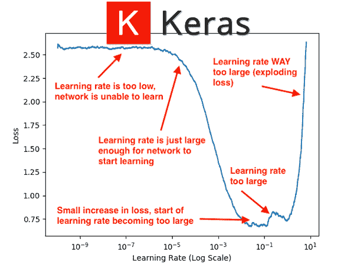
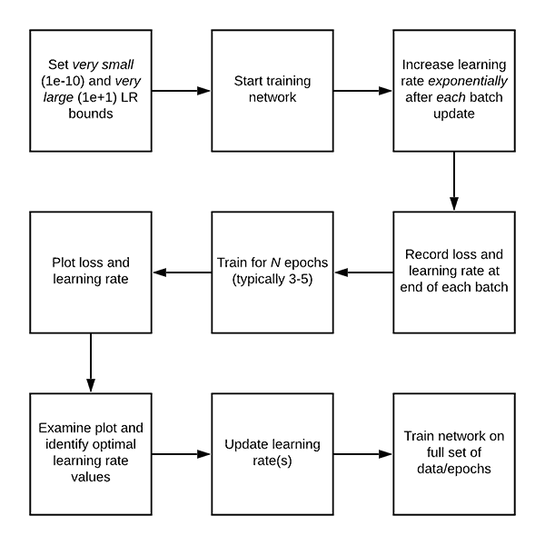
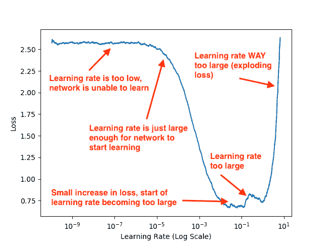
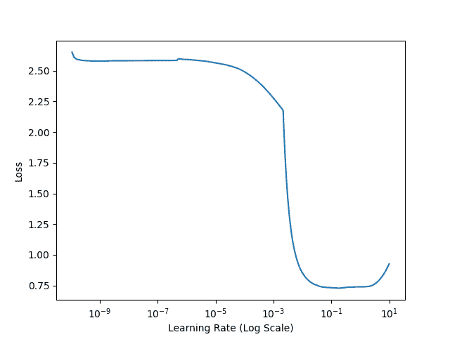
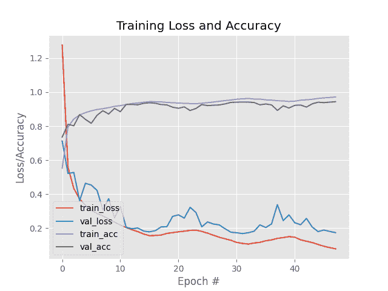
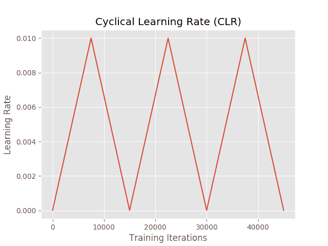

# Keras 学习率查找器

> 原文：<https://pyimagesearch.com/2019/08/05/keras-learning-rate-finder/>

[](https://pyimagesearch.com/wp-content/uploads/2019/08/keras_learning_rate_finder_header.png)

在本教程中，你将学习如何使用 Keras 自动找到学习率。本指南提供了 fast.ai 流行的“lr_find”方法的 Keras 实现。

今天是我们使用 Keras 的学习率计划、政策和衰退三部分系列的第三部分:

1.  **Part #1:** [*Keras 学习进度和衰减*](https://pyimagesearch.com/2019/07/22/keras-learning-rate-schedules-and-decay/)
2.  **Part #2:** [*循环学习率与 Keras 和深度学习*](https://pyimagesearch.com/2019/07/29/cyclical-learning-rates-with-keras-and-deep-learning/) (上周的帖子)
3.  **Part #3:** *Keras 学习率查找器* **(今日帖)**

上周，我们讨论了循环学习率(clr)以及如何使用它们通过**较少的实验**和**有限的超参数调整**来获得高精度的模型。

CLR 方法允许我们的学习速率在下限和上限之间循环振荡；然而，问题仍然存在， ***我们如何知道对于我们的学习率来说什么是好的选择？***

今天我将回答这个问题。

**当您完成本教程时，您将了解如何*自动*为您的神经网络找到最佳学习速率，**为您节省 10 秒、100 秒甚至 1000 秒的计算时间运行实验来调整您的超参数。

**要了解如何使用 Keras 找到最佳学习率，*继续阅读！***

## Keras 学习率查找器

***2020-06-11 更新:**此博文现已兼容 TensorFlow 2+!*

在本教程的第一部分，我们将简要讨论一个简单而优雅的算法，它可以用来自动为你的深度神经网络找到最佳学习速率。

从那以后，我将向您展示如何使用 Keras 深度学习框架来实现这种方法。

我们将学习率查找器实现应用于一个示例数据集，使我们能够获得最佳的学习率。

然后，我们将采用找到的学习率，并使用循环学习率策略来全面训练我们的网络。

### 如何为您的神经网络架构自动找到最佳学习速率

[](https://pyimagesearch.com/wp-content/uploads/2019/08/keras_learning_rate_finder_algorithm.png)

**Figure 1:** Deep learning requires tuning of hyperparameters such as the learning rate. Using a learning rate finder in Keras, we can automatically find a suitable min/max learning rate for cyclical learning rate scheduling and apply it with success to our experiments. This figure contains the basic algorithm for a learning rate finder.

在上周关于[循环学习率(CLRs)](https://pyimagesearch.com/2019/07/29/cyclical-learning-rates-with-keras-and-deep-learning/) 的教程中，我们讨论了 les lie Smith 2017 年的论文 [*用于训练神经网络*](https://arxiv.org/abs/1506.01186) 的循环学习率。

单从论文题目来看，史密斯博士对深度学习社区的明显贡献就是循环学习率算法。

**然而，还有第二个贡献可以说比 CLRs 更重要— *自动发现学习率。*** 在这篇论文中，Smith 博士提出了一个简单而优雅的解决方案，告诉我们如何自动找到训练的最佳学习率。

***注:**虽然该算法是由 Smith 博士提出的，但直到 fast.ai 的 Jermey Howard 建议他的学生使用它时才得以推广。如果你是 fast.ai 用户，你可能还记得`learn.lr_find`函数——我们将使用 TensorFlow/Keras 实现一个类似的方法。*

**自动学习率查找算法是这样工作的:**

*   **步骤#1:** 我们从定义学习率的上限和下限开始。下限应该非常小(1e-10)，上限应该非常大(1e+1)。
    *   在 1e-10 处，学习率对于我们的网络来说太小而无法学习，而在 1e+1 处，学习率太大，我们的模型将会过拟合。
    *   这两个都没问题，其实也是我们希望看到的！
*   第二步:然后我们开始训练我们的网络，从下限开始。
    *   每次批量更新后，我们都会成倍地提高学习速度。
    *   我们还会在每次批量更新后记录损失。
*   **步骤#3:** 训练继续，因此学习率继续增加，直到达到最大学习率值。
    *   通常，整个训练过程/学习率的增加只需要 1-5 个时期。
*   **步骤#4:** 训练完成后，我们绘制一个随时间变化的平滑损失图，使我们能够看到学习率同时为:
    *   刚好足够减少损失
    *   太大了，以至于损失开始增加。

下图(与帖子顶部的标题相同，但再次包含在这里，以便您可以轻松理解)使用 GoogLeNet 的变体(我们将在本教程的后面使用)可视化了 CIFAR-10 数据集上的学习率查找器算法的输出:

[](https://pyimagesearch.com/wp-content/uploads/2019/08/learing_rate_finder_lr_plot.png)

**Figure 2:** When inspecting a deep learning experiment, be sure to look at the loss landscape. This plot helps you identify when your learning rate is too low or too high.

在检查这个图的时候，请记住我们的学习率是在*每批更新*之后*指数增长*。在给定的一批完成后，我们增加下一批的学习率。

请注意，从 1e-10 到 1e-6，我们的损失基本上是平坦的— **学习率*太小了*，网络实际上无法学习任何东西。**从大约 1e-5 开始，我们的损失开始下降— **这是我们的网络实际可以学习的最小学习速率。**

当我们达到 1e-4 时，我们的网络学习速度非常快。在 1e-2 之后一点点，损耗有一个小的增加，但是大的增加直到 1e-1 才开始。

最后，到 1e+1 时，我们的损失急剧增加— **学习率对于我们的模型来说太高了，无法学习。**

给定这个图，我可以直观地检查它，并挑选出我的 CLR 学习率的下限和上限:

*   **下限:** 1e-5
*   **上限:** 1e-2

如果您使用的是[学习率计划/衰减策略](https://pyimagesearch.com/2019/07/22/keras-learning-rate-schedules-and-decay/)，那么您将选择 1e-2 作为您的初始学习率，然后随着您的训练而降低。

然而，在本教程中，我们将使用一个[循环学习率策略](https://pyimagesearch.com/2019/07/29/cyclical-learning-rates-with-keras-and-deep-learning/)，所以我们需要*的上下限。*

但是，问题仍然存在:

**我是如何生成学习率图的？**

我将在本教程的后面回答这个问题。

### 配置您的开发环境

要针对本教程配置您的系统，我首先建议您遵循以下任一教程:

*   [*如何在 Ubuntu 上安装 tensor flow 2.0*](https://pyimagesearch.com/2019/12/09/how-to-install-tensorflow-2-0-on-ubuntu/)
*   [*如何在 macOS 上安装 tensor flow 2.0*](https://pyimagesearch.com/2019/12/09/how-to-install-tensorflow-2-0-on-macos/)

这两个教程都将帮助您在一个方便的 Python 虚拟环境中，用这篇博文所需的所有软件来配置您的系统。

请注意 [PyImageSearch 不推荐也不支持 CV/DL 项目](https://pyimagesearch.com/faqs/single-faq/can-you-help-me-do-___-on-windows/)的窗口。

### 项目结构

请点击今天帖子的 ***【下载】*** ，其中除了我们的培训脚本之外，还包含上周的 CLR 实施和本周的学习率查找器。

然后，用`tree`命令检查项目布局:

```
$ tree --dirsfirst
.
├── output
│   ├── clr_plot.png
│   ├── lrfind_plot.png
│   └── training_plot.png
├── pyimagesearch
│   ├── __init__.py
│   ├── clr_callback.py
│   ├── config.py
│   ├── learningratefinder.py
│   └── minigooglenet.py
└── train.py

2 directories, 9 files

```

我们的`output/`目录包含三个图:

*   循环学习率图。
*   学习率查找器损失与学习率图。
*   我们的训练准确度/损失历史图。

pyimagesearch 模块包含三个类和一个配置:

*   `clr_callback.py`:包含作为 Keras 回调实现的`CyclicLR`类。
*   `learningratefinder.py`:持有`LearningRateFinder`类——今天教程的重点。
*   `minigooglenet.py`:有我们的 MiniGoogLeNet CNN 类。今天就不细说了。请参考 [*使用 Python 进行计算机视觉的深度学习*](https://pyimagesearch.com/deep-learning-computer-vision-python-book/) 以深入了解 GoogLeNet 和 MiniGoogLeNet。
*   `config.py`:保存配置参数/变量的 Python 文件。

在我们查看了`config.py`和`learningratefinder.py`文件后，我们将浏览一下`train.py`，我们的 Keras CNN 培训脚本。

### 实现我们的自动 Keras 学习率查找器

现在让我们定义一个名为`LearningRateFinder`的类，它封装了来自上面*“如何为你的神经网络架构自动找到最佳学习速率”*一节的算法逻辑。

我们的实现受到了来自 [ktrain](https://github.com/amaiya/ktrain) 库的`LRFinder`类的启发——我的主要贡献是对算法进行了一些调整，包括详细的文档和源代码的注释，使读者更容易理解算法的工作原理。

让我们开始吧——打开项目目录中的`learningratefinder.py`文件并插入以下代码:

```
# import the necessary packages
from tensorflow.keras.callbacks import LambdaCallback
from tensorflow.keras import backend as K
import matplotlib.pyplot as plt
import numpy as np
import tempfile

class LearningRateFinder:
	def __init__(self, model, stopFactor=4, beta=0.98):
		# store the model, stop factor, and beta value (for computing
		# a smoothed, average loss)
		self.model = model
		self.stopFactor = stopFactor
		self.beta = beta

		# initialize our list of learning rates and losses,
		# respectively
		self.lrs = []
		self.losses = []

		# initialize our learning rate multiplier, average loss, best
		# loss found thus far, current batch number, and weights file
		self.lrMult = 1
		self.avgLoss = 0
		self.bestLoss = 1e9
		self.batchNum = 0
		self.weightsFile = None

```

包裹在**2-6 号线**进口。我们将使用一个`LambdaCallback`来指示我们的回调在每次批量更新结束时运行。我们将使用`matplotlib`来实现一个叫做`plot_loss`的方法，它绘制了损失与学习率的关系。

`LearningRateFinder`类的构造函数从第 9 行的**开始。**

首先，我们存储初始化的模型，`stopFactor`指示何时退出训练(如果我们的损失变得太大)，以及`beta`值(用于平均/平滑我们的损失以便可视化)。

然后，我们初始化我们的学习率列表以及各个学习率的损失值(**行 17 和 18** )。

我们继续执行一些初始化，包括:

*   `lrMult`:学习率倍增系数。
*   `avgLoss`:一段时间内的平均损耗。
*   `bestLoss`:我们在训练时发现的最好的损失。
*   `batchNum`:当前批号更新。
*   `weightsFile`:我们的初始模型权重的路径(这样我们可以在找到我们的学习率后重新加载权重，并在训练前将它们设置为初始值)。

`reset`方法是一个便利/帮助函数，用于从我们的构造函数中重置所有变量:

```
	def reset(self):
		# re-initialize all variables from our constructor
		self.lrs = []
		self.losses = []
		self.lrMult = 1
		self.avgLoss = 0
		self.bestLoss = 1e9
		self.batchNum = 0
		self.weightsFile = None

```

使用我们的`LearningRateFinder`类时，必须能够同时处理以下两种情况:

*   可以放入内存的数据。
*   (1)通过数据生成器加载，因此太大而不适合内存；或者(2)需要对其应用数据扩充/附加处理，因此使用生成器的数据。

如果整个数据集可以放入内存*并且*没有应用数据扩充，我们可以使用 Keras 的`.fit`方法来训练我们的模型。

但是，如果我们使用数据生成器，或者出于内存需求，或者因为我们正在应用数据扩充，我们需要使用 Keras' `.fit`函数，并将图像数据生成器对象作为训练的第一个参数。

***注:**你可以在本教程中读到`.fit`和`.fit_generator` [的区别。请注意，`.fit_generator`功能已被弃用，现在`.fit`可以增加数据。](https://pyimagesearch.com/2018/12/24/how-to-use-keras-fit-and-fit_generator-a-hands-on-tutorial/)*

`is_data_generator`函数可以确定我们的输入`data`是一个原始的 NumPy 数组还是我们正在使用一个数据生成器:

```
	def is_data_iter(self, data):
		# define the set of class types we will check for
		iterClasses = ["NumpyArrayIterator", "DirectoryIterator",
			 "DataFrameIterator", "Iterator", "Sequence"]

		# return whether our data is an iterator
		return data.__class__.__name__ in iterClasses

```

这里我们检查输入数据类的名称是否属于第 41 行和第 42 行定义的数据迭代器类。

如果您正在使用自己的定制数据生成器，只需将其封装在一个类中，然后将您的类名添加到`iterClasses`列表中。

`on_batch_end`函数负责在每批完成后更新我们的学习率(即向前和向后传递):

```
	def on_batch_end(self, batch, logs):
		# grab the current learning rate and add log it to the list of
		# learning rates that we've tried
		lr = K.get_value(self.model.optimizer.lr)
		self.lrs.append(lr)

		# grab the loss at the end of this batch, increment the total
		# number of batches processed, compute the average average
		# loss, smooth it, and update the losses list with the
		# smoothed value
		l = logs["loss"]
		self.batchNum += 1
		self.avgLoss = (self.beta * self.avgLoss) + ((1 - self.beta) * l)
		smooth = self.avgLoss / (1 - (self.beta ** self.batchNum))
		self.losses.append(smooth)

		# compute the maximum loss stopping factor value
		stopLoss = self.stopFactor * self.bestLoss

		# check to see whether the loss has grown too large
		if self.batchNum > 1 and smooth > stopLoss:
			# stop returning and return from the method
			self.model.stop_training = True
			return

		# check to see if the best loss should be updated
		if self.batchNum == 1 or smooth < self.bestLoss:
			self.bestLoss = smooth

		# increase the learning rate
		lr *= self.lrMult
		K.set_value(self.model.optimizer.lr, lr)

```

我们将使用这个方法作为 Keras 回调，因此我们需要确保我们的函数接受 Keras 期望看到的两个变量— `batch`和`logs.`

**第 50 行和第 51 行**从我们的优化器中获取当前的学习率，然后将其添加到我们的学习率列表中(`lrs`)。

**第 57 行和第 58 行**在批次结束时抓取损失，然后增加我们的批次号。

**第 58-61 行**计算平均损失，平滑它，然后用`smooth`平均值更新`losses`列表。

**第 64 行**计算我们的最大损失值，它是目前为止我们找到的`stopFactor`和`bestLoss`的函数。

如果我们的`smoothLoss`已经长得比`stopLoss`大，那么我们就停止训练(**第 67-70 行**)。

**第 73 行和第 74 行**检查是否找到了新的`bestLoss`，如果是，我们更新变量。

最后，**行 77** 增加我们的学习率，而**行 78** 设置下一批的学习率值。

我们的下一个方法`find`，负责自动找到我们训练的最优学习率。当我们准备好找到我们的学习率时，我们将从我们的驱动程序脚本中调用这个方法:

```
	def find(self, trainData, startLR, endLR, epochs=None,
		stepsPerEpoch=None, batchSize=32, sampleSize=2048,
		verbose=1):
		# reset our class-specific variables
		self.reset()

		# determine if we are using a data generator or not
		useGen = self.is_data_iter(trainData)

		# if we're using a generator and the steps per epoch is not
		# supplied, raise an error
		if useGen and stepsPerEpoch is None:
			msg = "Using generator without supplying stepsPerEpoch"
			raise Exception(msg)

		# if we're not using a generator then our entire dataset must
		# already be in memory
		elif not useGen:
			# grab the number of samples in the training data and
			# then derive the number of steps per epoch
			numSamples = len(trainData[0])
			stepsPerEpoch = np.ceil(numSamples / float(batchSize))

		# if no number of training epochs are supplied, compute the
		# training epochs based on a default sample size
		if epochs is None:
			epochs = int(np.ceil(sampleSize / float(stepsPerEpoch)))

```

我们的`find`方法接受许多参数，包括:

*   `trainData`:我们的训练数据(数据的 NumPy 数组或者数据生成器)。
*   `startLR`:初始，开始学习率。
*   `epochs`:训练的时期数(如果没有提供值，我们将计算时期数)。
*   `stepsPerEpoch`:每个历元的批量更新步骤总数。
*   `batchSize`:我们优化器的批量大小。
*   `sampleSize`:找到最佳学习率时使用的来自`trainData`的样本数。
*   `verbose`:Keras '`.fit`方法的详细度设置。

**第 84 行**重置我们特定于类的变量，而**第 87 行**检查我们是否在使用数据迭代器或原始 NumPy 数组。

在我们使用数据生成器并且没有提供`stepsPerEpoch`变量的情况下，我们抛出一个异常，因为我们不可能从生成器中确定`stepsPerEpoch`(参见[本教程](https://pyimagesearch.com/2018/12/24/how-to-use-keras-fit-and-fit_generator-a-hands-on-tutorial/)了解为什么这是真的更多信息)。

否则，如果我们没有使用数据发生器，我们从`trainData`中获取`numSamples`，然后通过将数据点的数量除以我们的`batchSize` ( **第 97-101 行**)来计算`stepsPerEpoch`的数量。

最后，如果没有提供时期的数量，我们通过将`sampleSize`除以`stepsPerEpoch`的数量来计算训练时期的数量。*我个人的偏好*是让周期数最终在 3-5 的范围内——足够长以获得可靠的结果，但又不会长到浪费我数小时的训练时间。

让我们转到自动学习率查找算法的核心:

```
		# compute the total number of batch updates that will take
		# place while we are attempting to find a good starting
		# learning rate
		numBatchUpdates = epochs * stepsPerEpoch

		# derive the learning rate multiplier based on the ending
		# learning rate, starting learning rate, and total number of
		# batch updates
		self.lrMult = (endLR / startLR) ** (1.0 / numBatchUpdates)

		# create a temporary file path for the model weights and
		# then save the weights (so we can reset the weights when we
		# are done)
		self.weightsFile = tempfile.mkstemp()[1]
		self.model.save_weights(self.weightsFile)

		# grab the *original* learning rate (so we can reset it
		# later), and then set the *starting* learning rate
		origLR = K.get_value(self.model.optimizer.lr)
		K.set_value(self.model.optimizer.lr, startLR)

```

**第 111 行**计算当发现我们的学习率时将发生的批量更新的总数。

使用`numBatchUpdates`我们导出学习率倍增因子(`lrMult`)，该因子用于指数增加我们的学习率(**第 116 行**)。

第 121 行和第 122 行创建了一个临时文件来存储我们的模型的初始权重。当我们的学习率查找器完成运行后，我们将恢复这些权重。

接下来，我们获取优化器的初始学习率(**第 126 行**)，将其存储在`origLR`中，然后指示 Keras 为优化器设置初始学习率(`startLR`)。

让我们创建我们的`LambdaCallback`，它将在每次批处理完成时调用我们的`on_batch_end`方法:

```
		# construct a callback that will be called at the end of each
		# batch, enabling us to increase our learning rate as training
		# progresses
		callback = LambdaCallback(on_batch_end=lambda batch, logs:
			self.on_batch_end(batch, logs))

		# check to see if we are using a data iterator
		if useGen:
			self.model.fit(
				x=trainData,
				steps_per_epoch=stepsPerEpoch,
				epochs=epochs,
				verbose=verbose,
				callbacks=[callback])

		# otherwise, our entire training data is already in memory
		else:
			# train our model using Keras' fit method
			self.model.fit(
				x=trainData[0], y=trainData[1],
				batch_size=batchSize,
				epochs=epochs,
				callbacks=[callback],
				verbose=verbose)

		# restore the original model weights and learning rate
		self.model.load_weights(self.weightsFile)
		K.set_value(self.model.optimizer.lr, origLR)

```

**第 132 行和第 133 行**构造了我们的`callback`——每当一个批处理完成时，就会调用`on_batch_end`方法来自动更新我们的学习速率。

如果我们使用数据生成器，我们将使用`.fit_generator`方法(**第 136-142 行**)来训练我们的模型。否则，我们的整个训练数据以 NumPy 数组的形式存在于内存中，所以我们可以使用`.fit`方法(**第 145- 152 行**)。

训练完成后，我们重置初始模型权重和学习率值(**行 155 和 156** )。

我们的最后一种方法`plot_loss`，用于绘制我们的学习率和随时间的损失:

```
	def plot_loss(self, skipBegin=10, skipEnd=1, title=""):
		# grab the learning rate and losses values to plot
		lrs = self.lrs[skipBegin:-skipEnd]
		losses = self.losses[skipBegin:-skipEnd]

		# plot the learning rate vs. loss
		plt.plot(lrs, losses)
		plt.xscale("log")
		plt.xlabel("Learning Rate (Log Scale)")
		plt.ylabel("Loss")

		# if the title is not empty, add it to the plot
		if title != "":
			plt.title(title)

```

这种精确的方法生成了您在图 2 中看到的图。

稍后，在本教程的*“使用 Keras 找到我们的最佳学习率”*部分，您将发现如何使用我们刚刚实现的`LearningRateFinder`类来自动使用 Keras 找到最佳学习率。

### 我们的配置文件

在我们实现实际的训练脚本之前，让我们创建我们的配置。

打开`config.py`文件并插入以下代码:

```
# import the necessary packages
import os

# initialize the list of class label names
CLASSES = ["top", "trouser", "pullover", "dress", "coat",
	"sandal", "shirt", "sneaker", "bag", "ankle boot"]

# define the minimum learning rate, maximum learning rate, batch size,
# step size, CLR method, and number of epochs
MIN_LR = 1e-5
MAX_LR = 1e-2
BATCH_SIZE = 64
STEP_SIZE = 8
CLR_METHOD = "triangular"
NUM_EPOCHS = 48

# define the path to the output learning rate finder plot, training
# history plot and cyclical learning rate plot
LRFIND_PLOT_PATH = os.path.sep.join(["output", "lrfind_plot.png"])
TRAINING_PLOT_PATH = os.path.sep.join(["output", "training_plot.png"])
CLR_PLOT_PATH = os.path.sep.join(["output", "clr_plot.png"])

```

我们将使用[时尚 MNIST](https://pyimagesearch.com/2019/02/11/fashion-mnist-with-keras-and-deep-learning/) 作为这个项目的数据集。**第 5 行和第 6 行**为时尚 MNIST 数据集设置分类标签。

我们的循环学习率参数在**第 10-15 行**中指定。`MIN_LR`和`MAX_LR`将在下面的*“用 Keras 找到我们的最佳学习率”*一节中找到，但是为了完整起见，我们将它们包含在这里。如果需要复习这些参数，请参考[上周的帖子](https://pyimagesearch.com/2019/07/29/cyclical-learning-rates-with-keras-and-deep-learning/)。

我们将输出三种类型的图，路径通过**行 19-21** 指定。其中两个图将采用与上周相同的格式(培训和 CLR)。新类型是“学习率查找器”图。

### 实施我们的学习率查找器培训脚本

我们的学习率查找脚本将负责以下两个方面:

1.  使用我们在本指南前面实现的`LearningRateFinder`类自动找到我们的初始学习率
2.  采用我们找到的学习率值，然后在整个数据集上训练网络。

让我们开始吧！

打开`train.py`文件并插入以下代码:

```
# set the matplotlib backend so figures can be saved in the background
import matplotlib
matplotlib.use("Agg")

# import the necessary packages
from pyimagesearch.learningratefinder import LearningRateFinder
from pyimagesearch.minigooglenet import MiniGoogLeNet
from pyimagesearch.clr_callback import CyclicLR
from pyimagesearch import config
from sklearn.preprocessing import LabelBinarizer
from sklearn.metrics import classification_report
from tensorflow.keras.preprocessing.image import ImageDataGenerator
from tensorflow.keras.optimizers import SGD
from tensorflow.keras.datasets import fashion_mnist
import matplotlib.pyplot as plt
import numpy as np
import argparse
import cv2
import sys

```

**2-19 线**导入我们需要的包。注意我们如何导入我们的`LearningRateFinder`以及我们的`CyclicLR`回调。我们将在`fashion_mnist`训练`MiniGoogLeNet`。要了解更多关于数据集的信息，请务必阅读《时尚 MNIST 与 Keras》和《深度学习》 。

让我们继续[解析命令行参数](https://pyimagesearch.com/2018/03/12/python-argparse-command-line-arguments/):

```
# construct the argument parser and parse the arguments
ap = argparse.ArgumentParser()
ap.add_argument("-f", "--lr-find", type=int, default=0,
	help="whether or not to find optimal learning rate")
args = vars(ap.parse_args())

```

我们有一个单独的命令行参数，`--lr-find`，一个标志，指示是否找到最优的学习速率。

接下来，让我们准备数据:

```
# load the training and testing data
print("[INFO] loading Fashion MNIST data...")
((trainX, trainY), (testX, testY)) = fashion_mnist.load_data()

# Fashion MNIST images are 28x28 but the network we will be training
# is expecting 32x32 images
trainX = np.array([cv2.resize(x, (32, 32)) for x in trainX])
testX = np.array([cv2.resize(x, (32, 32)) for x in testX])

# scale the pixel intensities to the range [0, 1]
trainX = trainX.astype("float") / 255.0
testX = testX.astype("float") / 255.0

# reshape the data matrices to include a channel dimension (required
# for training)
trainX = trainX.reshape((trainX.shape[0], 32, 32, 1))
testX = testX.reshape((testX.shape[0], 32, 32, 1))

# convert the labels from integers to vectors
lb = LabelBinarizer()
trainY = lb.fit_transform(trainY)
testY = lb.transform(testY)

# construct the image generator for data augmentation
aug = ImageDataGenerator(width_shift_range=0.1,
	height_shift_range=0.1, horizontal_flip=True,
	fill_mode="nearest")

```

在这里我们:

*   加载时尚 MNIST 数据集(**第 29 行**)。
*   在第 33 行和第 34 行上，将每个图像从 *28×28* 图像调整为 *32×32* 图像(我们的网络期望的输入)。
*   将像素强度缩放到范围*【0，1】*(**第 37 行和第 38 行**)。
*   二进制化标签(**第 46-48 行**)。
*   构造我们的数据扩充对象(**第 51-53 行**)。在我的[以前的帖子](https://pyimagesearch.com/tag/data-augmentation/)中以及在*的 [*的*实践者包中阅读更多关于使用 Python](https://pyimagesearch.com/deep-learning-computer-vision-python-book/)* 进行计算机视觉深度学习的信息。

从这里，我们可以`compile`我们的`model`:

```
# initialize the optimizer and model
print("[INFO] compiling model...")
opt = SGD(lr=config.MIN_LR, momentum=0.9)
model = MiniGoogLeNet.build(width=32, height=32, depth=1, classes=10)
model.compile(loss="categorical_crossentropy", optimizer=opt,
	metrics=["accuracy"])

```

我们的`model`是用`SGD`(随机梯度下降)优化编译的。我们使用`"categorical_crossentropy"`损失，因为我们有 **> 2** 职业。如果您的数据集只有 2 个类，请务必使用`"binary_crossentropy"`。

下面的 if-then 块处理我们寻找最佳学习率时的情况:

```
# check to see if we are attempting to find an optimal learning rate
# before training for the full number of epochs
if args["lr_find"] > 0:
	# initialize the learning rate finder and then train with learning
	# rates ranging from 1e-10 to 1e+1
	print("[INFO] finding learning rate...")
	lrf = LearningRateFinder(model)
	lrf.find(
		aug.flow(trainX, trainY, batch_size=config.BATCH_SIZE),
		1e-10, 1e+1,
		stepsPerEpoch=np.ceil((len(trainX) / float(config.BATCH_SIZE))),
		batchSize=config.BATCH_SIZE)

	# plot the loss for the various learning rates and save the
	# resulting plot to disk
	lrf.plot_loss()
	plt.savefig(config.LRFIND_PLOT_PATH)

	# gracefully exit the script so we can adjust our learning rates
	# in the config and then train the network for our full set of
	# epochs
	print("[INFO] learning rate finder complete")
	print("[INFO] examine plot and adjust learning rates before training")
	sys.exit(0)

```

第 64 行检查我们是否应该尝试找到最佳学习率。假设如此，我们:

*   初始化`LearningRateFinder` ( **第 68 行**)。
*   以`1e-10`的学习率开始训练，并以指数方式增加，直到我们达到`1e+1` ( **第 69-73 行**)。
*   绘制损失与学习率的关系图，并保存结果数字(**第 77 行和第 78 行**)。
*   在向用户输出几条消息后，优雅地退出脚本(**第 83-85 行**)。

在这段代码执行之后，我们现在需要:

1.  查看生成的图。
2.  分别用我们的`MIN_LR`和`MAX_LR`更新`config.py`。
3.  在我们的完整数据集上训练网络。

假设我们已经完成了第 1 步和第 2 步，现在让我们处理第 3 步，我们的最小和最大学习率已经在配置中找到并更新了。在这种情况下，是时候初始化我们的[循环学习率类](https://pyimagesearch.com/2019/07/29/cyclical-learning-rates-with-keras-and-deep-learning/)并开始训练了:

```
# otherwise, we have already defined a learning rate space to train
# over, so compute the step size and initialize the cyclic learning
# rate method
stepSize = config.STEP_SIZE * (trainX.shape[0] // config.BATCH_SIZE)
clr = CyclicLR(
	mode=config.CLR_METHOD,
	base_lr=config.MIN_LR,
	max_lr=config.MAX_LR,
	step_size=stepSize)

# train the network
print("[INFO] training network...")
H = model.fit(
	x=aug.flow(trainX, trainY, batch_size=config.BATCH_SIZE),
	validation_data=(testX, testY),
	steps_per_epoch=trainX.shape[0] // config.BATCH_SIZE,
	epochs=config.NUM_EPOCHS,
	callbacks=[clr],
	verbose=1)

# evaluate the network and show a classification report
print("[INFO] evaluating network...")
predictions = model.predict(x=testX, batch_size=config.BATCH_SIZE)
print(classification_report(testY.argmax(axis=1),
	predictions.argmax(axis=1), target_names=config.CLASSES))

```

**2020-06-11 更新:**以前，TensorFlow/Keras 需要使用一种叫做`.fit_generator`的方法来完成数据扩充。现在，`.fit`方法也可以处理数据扩充，使代码更加一致。这也适用于从`.predict_generator`到`.predict`的迁移。请务必查看我关于 [fit 和 fit_generator](https://pyimagesearch.com/2018/12/24/how-to-use-keras-fit-and-fit_generator-a-hands-on-tutorial/) 以及[数据扩充](https://pyimagesearch.com/2019/07/08/keras-imagedatagenerator-and-data-augmentation/)的文章。

我们的`CyclicLR`用配置文件中新设置的参数初始化(**第 90-95 行**)。

然后我们的`model`是使用`.fit_generator` 通过我们的`aug`数据增强对象和我们的`clr`回调(**第 99-105 行**)训练的[。](https://pyimagesearch.com/2018/12/24/how-to-use-keras-fit-and-fit_generator-a-hands-on-tutorial/)

训练完成后，我们继续在测试集上评估我们的网络( **Line 109** )。终端打印出一个`classification_report`供我们检查。

最后，让我们绘制我们的培训历史和 CLR 历史:

```
# construct a plot that plots and saves the training history
N = np.arange(0, config.NUM_EPOCHS)
plt.style.use("ggplot")
plt.figure()
plt.plot(N, H.history["loss"], label="train_loss")
plt.plot(N, H.history["val_loss"], label="val_loss")
plt.plot(N, H.history["accuracy"], label="train_acc")
plt.plot(N, H.history["val_accuracy"], label="val_acc")
plt.title("Training Loss and Accuracy")
plt.xlabel("Epoch #")
plt.ylabel("Loss/Accuracy")
plt.legend(loc="lower left")
plt.savefig(config.TRAINING_PLOT_PATH)

# plot the learning rate history
N = np.arange(0, len(clr.history["lr"]))
plt.figure()
plt.plot(N, clr.history["lr"])
plt.title("Cyclical Learning Rate (CLR)")
plt.xlabel("Training Iterations")
plt.ylabel("Learning Rate")
plt.savefig(config.CLR_PLOT_PATH)

```

***2020-06-11 更新:**为了使该绘图片段与 TensorFlow 2+兼容，更新了`H.history`字典键，以完全拼出“精度”而没有“acc”(即`H.history["val_accuracy"]`和`H.history["accuracy"]`)。“val”没有拼成“validation”，这有点令人困惑；我们必须学会热爱 API 并与之共存，并永远记住这是一项正在进行的工作，世界各地的许多开发人员都为此做出了贡献。*

为训练程序生成了两个图，以配合我们已经应该有的学习率查找器图:

*   训练准确度/损失历史(**第 114-125 行**)。标准的情节格式包含在我的大部分教程和[我的深度学习书的每个实验中。](https://pyimagesearch.com/deep-learning-computer-vision-python-book/)
*   学习率历史(**第 128-134 行**)。该图将帮助我们直观地验证我们的学习率是根据我们的 CLR 意图而波动的。

### 使用 Keras 找到我们的最佳学习率

我们现在可以找到我们的最佳学习率了！

确保您已经使用本教程的 ***“下载”*** 部分下载了源代码——从那里，打开一个终端并执行以下命令:

```
$ python train.py --lr-find 1
[INFO] loading Fashion MNIST data...
[INFO] compiling model...
[INFO] finding learning rate...
Epoch 1/3
938/938 [==============================] - 23s 24ms/step - loss: 2.5839 - accuracy: 0.1072
Epoch 2/3
938/938 [==============================] - 21s 23ms/step - loss: 2.1177 - accuracy: 0.2587
Epoch 3/3
938/938 [==============================] - 21s 23ms/step - loss: 1.0178 - accuracy: 0.6591
[INFO] learning rate finder complete
[INFO] examine plot and adjust learning rates before training

```

[](https://pyimagesearch.com/wp-content/uploads/2019/08/lrfind_plot.png)

**Figure 3:** Analyzing a deep learning loss vs. learning rate plot to find an optimal learning rate for Keras.

`--lr-find`标志指示我们的脚本利用`LearningRateFinder`类将我们的学习速率从 1e-10 指数级提高到 1e+1。

在*每次*批量更新后，学习率增加，直到达到我们的最大学习率。

**图 3** 显示了我们的损失:

*   损耗停滞不前，没有从 1e-10 减少到大约 1e-6，这意味着学习率*太小*，我们的网络没有在学习。
*   在大约 1e-5 处，我们的损失开始减少，这意味着我们的学习速率*刚好足够大*，模型可以开始学习。
*   到 1e-3，损耗迅速下降，表明这是网络可以快速学习的“最佳点”。
*   就在 1e-1 之后，损失略有增加，这意味着我们的学习速率可能很快就会过大。
*   而到了 1e+1 的时候，我们的损失就开始爆发了(学习率*远*太大)。

基于这个图，我们应该选择 **1e-5 作为我们的基本学习速率，选择 1e-2 作为我们的最大学习速率** —这些值表示学习速率*足够小*以使我们的网络开始学习，以及学习速率*足够大*以使我们的网络快速学习，但是*不会大到*以至于我们的损失爆炸。

如果您需要帮助分析**图 3** ，请务必回头参考**图 2** 。

### 培训整个网络架构

如果还没有，回到我们的`config.py`文件，分别设置`MIN_LR = 1e-5`和`MAX_LR = 1e-2`:

```
# define the minimum learning rate, maximum learning rate, batch size,
# step size, CLR method, and number of epochs
MIN_LR = 1e-5
MAX_LR = 1e-2
BATCH_SIZE = 64
STEP_SIZE = 8
CLR_METHOD = "triangular"
NUM_EPOCHS = 48

```

从那里，执行以下命令:

```
$ python train.py
[INFO] loading Fashion MNIST data...
[INFO] compiling model...
[INFO] training network...
Epoch 1/48
937/937 [==============================] - 25s 27ms/step - loss: 1.2759 - accuracy: 0.5528 - val_loss: 0.7126 - val_accuracy: 0.7350
Epoch 2/48
937/937 [==============================] - 24s 26ms/step - loss: 0.5589 - accuracy: 0.7946 - val_loss: 0.5217 - val_accuracy: 0.8108
Epoch 3/48
937/937 [==============================] - 25s 26ms/step - loss: 0.4338 - accuracy: 0.8417 - val_loss: 0.5276 - val_accuracy: 0.8017
...
Epoch 46/48
937/937 [==============================] - 25s 26ms/step - loss: 0.0942 - accuracy: 0.9657 - val_loss: 0.1895 - val_accuracy: 0.9379
Epoch 47/48
937/937 [==============================] - 24s 26ms/step - loss: 0.0861 - accuracy: 0.9684 - val_loss: 0.1813 - val_accuracy: 0.9408
Epoch 48/48
937/937 [==============================] - 25s 26ms/step - loss: 0.0791 - accuracy: 0.9714 - val_loss: 0.1741 - val_accuracy: 0.9433
[INFO] evaluating network...
              precision    recall  f1-score   support

         top       0.91      0.89      0.90      1000
     trouser       0.99      0.99      0.99      1000
    pullover       0.92      0.92      0.92      1000
       dress       0.95      0.94      0.94      1000
        coat       0.92      0.93      0.92      1000
      sandal       0.99      0.99      0.99      1000
       shirt       0.82      0.84      0.83      1000
     sneaker       0.97      0.98      0.97      1000
         bag       0.99      1.00      0.99      1000
  ankle boot       0.98      0.97      0.97      1000

    accuracy                           0.94     10000
   macro avg       0.94      0.94      0.94     10000
weighted avg       0.94      0.94      0.94     10000

```

[](https://pyimagesearch.com/wp-content/uploads/2019/08/training_plot.png)

**Figure 4:** Our one and only experiment’s training accuracy/loss curves are plotted while using the min/max learning rate determined via our Keras learning rate finder method.

训练完成后，我们在时尚 MNIST 数据集上获得了 94%的准确率。

请记住，我们只运行了*一个实验*来调整我们模型的学习率。

我们的培训历史记录绘制在**图 4** 中。请注意三角循环学习率策略的特征“波浪”——随着学习率的增加和减少，我们的培训和验证损失会随着波浪上下波动。

说到周期性学习率政策，我们来看看学习率在培训期间是如何变化的:

[](https://pyimagesearch.com/wp-content/uploads/2019/08/clr_plot.png)

**Figure 5:** A plot of our cyclical learning rate schedule using the “triangular” mode. The min/max learning rates were determined with a Keras learning rate finder.

这里，我们完成了三角策略的三个完整周期，从 1e-5 的初始学习速率开始，增加到 1e-2，然后再次降低回 1e-5。

结合使用循环学习率和我们的自动学习率查找器实现，我们能够仅在一次*实验中获得高度准确的模型！*

您可以在自己的项目中使用 clr 和自动学习率查找器的组合来帮助您快速有效地调整学习率。

## 摘要

在本教程中，您学习了如何使用 Keras 深度学习库创建自动学习率查找器。

这种自动学习率查找算法遵循了 Leslie Smith 博士在他们 2017 年的论文中提出的建议， [*训练神经网络的循环学习率*](https://arxiv.org/abs/1506.01186) (但这种方法本身并没有得到普及，直到 Jermey Howard 建议 fast.ai 用户使用它)。

本指南的主要贡献是提供了一个记录良好的 Keras 学习率查找工具，包括一个如何使用它的例子。

**当使用 Keras 训练您自己的神经网络时，您可以使用这个学习率查找器实现，使您能够:**

1.  绕过 10 到 100 次调整你学习速度的实验。
2.  用较少的努力获得高精度的模型。

确保在使用您自己的数据集和架构探索学习率时使用该实现。

我希望你喜欢我在关于用 Keras 寻找、调整和安排学习率的系列教程中的最后一篇文章！

**要下载这篇文章的源代码(并在未来教程在 PyImageSearch 上发布时得到通知)，*只需在下面的表格中输入您的电子邮件地址！***