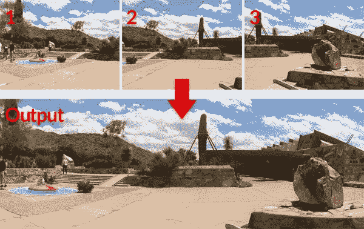
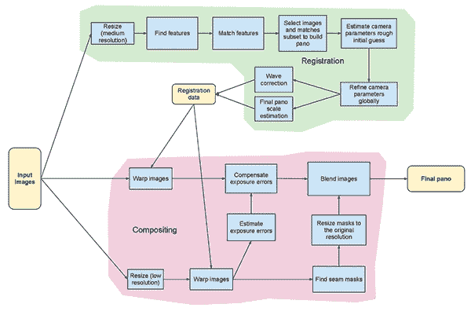
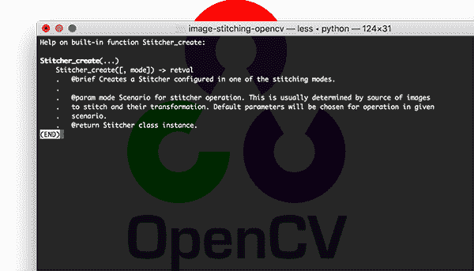
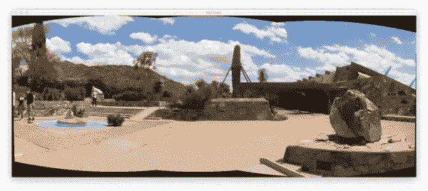
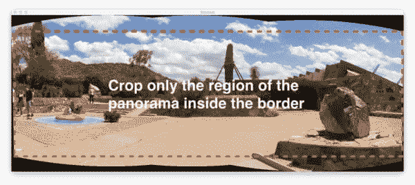
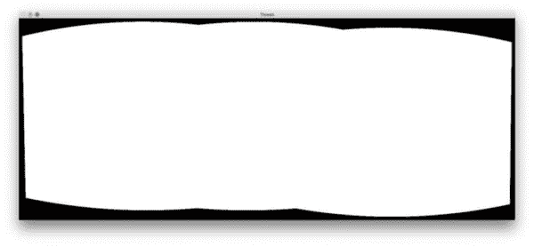
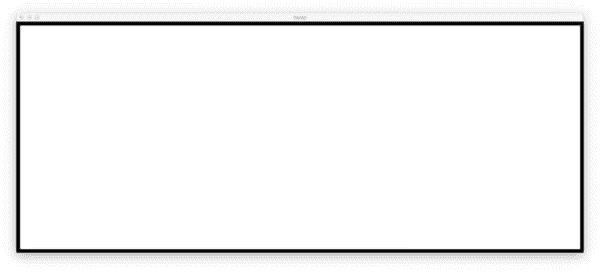
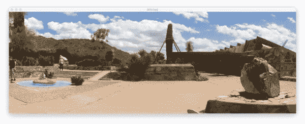

# 用 OpenCV 和 Python 实现图像拼接

> 原文：<https://pyimagesearch.com/2018/12/17/image-stitching-with-opencv-and-python/>

[](https://pyimagesearch.com/wp-content/uploads/2018/12/image_stitching_opencv_header.jpg)

在本教程中，您将学习如何使用 Python、OpenCV 以及`cv2.createStitcher`和`cv2.Stitcher_create`函数来执行图像拼接。使用今天的代码，你将能够将*多张*图像拼接在一起，创建拼接图像的全景。

就在两年前，我发表了两本关于图像拼接和全景图构建的指南:

1.  [图像拼接的基础知识](https://pyimagesearch.com/2016/01/11/opencv-panorama-stitching/)
2.  [实时全景和图像拼接](https://pyimagesearch.com/2016/01/25/real-time-panorama-and-image-stitching-with-opencv/)

这两个教程都涵盖了典型图像拼接算法的基础知识，至少需要四个关键步骤:

1.  检测关键点(狗、哈里斯等。)并提取局部不变描述符(SIFT、SURF 等)。)来自两个输入图像
2.  匹配图像之间的描述符
3.  使用 RANSAC 算法来估计使用我们的匹配特征向量的单应矩阵
4.  使用从步骤#3 获得的单应矩阵应用扭曲变换

然而，我最初实现的最大问题是它们不能处理两个以上的输入图像。

在今天的教程中，我们将再次讨论使用 OpenCV 进行图像拼接，包括如何将两幅以上的图像拼接成一幅全景图像。

**要学习如何用 OpenCV 和 Python 拼接图像，*继续阅读！***

## 用 OpenCV 和 Python 实现图像拼接

在今天教程的第一部分，我们将简要回顾 OpenCV 的图像拼接算法，该算法是通过`cv2.createStitcher`和`cv2.Stitcher_create`函数嵌入 OpenCV 库的。

从这里，我们将回顾我们的项目结构，并实现一个可用于图像拼接的 Python 脚本。

我们将回顾第一个脚本的结果，注意它的局限性，然后实现第二个 Python 脚本，该脚本可用于获得更美观的图像拼接结果。

最后，我们将回顾第二个脚本的结果，并再次注意任何限制或缺点。

### OpenCV 的图像拼接算法

[](https://pyimagesearch.com/wp-content/uploads/2018/12/image_stitching_opencv_pipeline.png)

**Figure 1:** The stitching module pipeline implemented in the Stitcher class ([source](https://docs.opencv.org/3.4/d1/d46/group__stitching.html)).

我们今天在这里使用的算法类似于 Brown 和 Lowe 在他们 2007 年的论文 [*中提出的具有不变特征的自动全景图像拼接*](http://matthewalunbrown.com/papers/ijcv2007.pdf) 的方法。

与之前对输入图像排序敏感的图像拼接算法不同，**Brown and Lowe 方法更加鲁棒，**使其*对以下各项不敏感*:

*   图像排序
*   图像的方向
*   照明变化
*   实际上不是全景的一部分的噪声图像

此外，他们的图像拼接方法能够通过使用增益补偿和图像混合来产生更美观的输出全景图像。

完整、详细的算法回顾超出了本文的范围，所以如果你有兴趣了解更多，请参考[原始出版物](http://matthewalunbrown.com/papers/ijcv2007.pdf)。

### 项目结构

让我们看看这个项目是如何用`tree`命令组织的:

```
$ tree --dirsfirst
.
├── images
│   └── scottsdale
│       ├── IMG_1786-2.jpg
│       ├── IMG_1787-2.jpg
│       └── IMG_1788-2.jpg
├── image_stitching.py
├── image_stitching_simple.py
└── output.png

2 directories, 6 files

```

输入图像放在`images/`文件夹中。我选择为我的`scottsdale/`图片集创建一个子文件夹，以防以后我想在这里添加更多的子文件夹。

今天我们将回顾两个 Python 脚本:

*   `image_stitching_simple.py`:我们的简单版图像拼接，不到 50 行 Python 代码就可以完成！
*   这个脚本包含了我提取拼接图像的 ROI 以获得美观效果的技巧。

最后一个文件`output.png`，是最终拼接图像的名称。使用命令行参数，您可以很容易地改变输出图像的文件名+路径。

### cv2.createStitcher 和 cv2。Stitcher_create 函数

[](https://pyimagesearch.com/wp-content/uploads/2018/12/image_stitching_opencv_signature.png)

**Figure 2:** The constructor signature for creating a Stitcher class object with OpenCV.

OpenCV 已经通过`cv2.createStitcher` (OpenCV 3.x)和`cv2.Stitcher_create` (OpenCV 4)函数实现了一个类似于 Brown 和 Lowe 论文的方法。

假设您已经正确配置并安装了的 [OpenCV，您将能够研究 OpenCV 3.x 的`cv2.createStitcher`的函数签名:](https://pyimagesearch.com/opencv-tutorials-resources-guides/)

```
createStitcher(...)
    createStitcher([, try_use_gpu]) -> retval

```

请注意，这个函数只有一个参数`try_gpu`，它可以用来提高图像拼接流水线的吞吐量。OpenCV 的 GPU 支持是*有限的*，我从来没有能够让这个参数工作，所以我建议总是让它作为`False`。

OpenCV 4 的`cv2.Stitcher_create`函数也有类似的特征:

```
Stitcher_create(...)
    Stitcher_create([, mode]) -> retval
    .   @brief Creates a Stitcher configured in one of the stitching
    .	modes.
    .   
    .   @param mode Scenario for stitcher operation. This is usually
    .	determined by source of images to stitch and their transformation.
    .	Default parameters will be chosen for operation in given scenario.
    .   @return Stitcher class instance.

```

为了执行实际的图像拼接，我们需要调用`.stitch`方法:

```
OpenCV 3.x:
stitch(...) method of cv2.Stitcher instance
    stitch(images[, pano]) -> retval, pano

OpenCV 4.x:
stitch(...) method of cv2.Stitcher instance
    stitch(images, masks[, pano]) -> retval, pano
    .   @brief These functions try to stitch the given images.
    .   
    .   @param images Input images.
    .   @param masks Masks for each input image specifying where to
    .	look for keypoints (optional).
    .   @param pano Final pano.
    .   @return Status code.

```

该方法接受一系列输入`images`，然后尝试将它们拼接成一幅全景图，将输出的全景图像返回给调用函数。

`status`变量表示图像拼接是否成功，可以是以下四个变量之一:

*   图像拼接成功了。
*   如果您收到此状态代码，您将需要更多的输入图像来构建您的全景。通常，如果在输入图像中没有检测到足够的关键点，就会出现此错误。
*   `ERR_HOMOGRAPHY_EST_FAIL = 2`:当 RANSAC 单应性估计失败时，出现此错误。同样，您可能需要更多的图像，或者您的图像没有足够的独特纹理/对象来精确匹配关键点。
*   我以前从未遇到过这个错误，所以我对它了解不多，但要点是它与未能从输入图像中正确估计相机的内在/外在特性有关。如果您遇到这个错误，您可能需要参考 OpenCV 文档，甚至钻研 OpenCV C++代码。

既然我们已经回顾了`cv2.createStitcher`、`cv2.Stitcher_create`和`.stitch`方法，让我们继续用 OpenCV 和 Python 实际实现图像拼接。

### 用 Python 实现图像拼接

让我们开始实施我们的图像拼接算法吧！

打开`image_stitching_simple.py`文件并插入以下代码:

```
# import the necessary packages
from imutils import paths
import numpy as np
import argparse
import imutils
import cv2

# construct the argument parser and parse the arguments
ap = argparse.ArgumentParser()
ap.add_argument("-i", "--images", type=str, required=True,
	help="path to input directory of images to stitch")
ap.add_argument("-o", "--output", type=str, required=True,
	help="path to the output image")
args = vars(ap.parse_args())

```

我们需要的包在**线 2-6** 导入。值得注意的是，我们将使用 OpenCV 和 [imutils](https://github.com/jrosebr1/imutils) 。如果您还没有，请继续安装它们:

*   要安装 OpenCV，只需遵循我的 [OpenCV 安装指南](https://pyimagesearch.com/opencv-tutorials-resources-guides/)。
*   imutils 包可以用 pip: `pip install --upgrade imutils`安装/更新。一定要升级它，因为经常会添加新功能。

从这里我们将解析第 9-14 行的两个命令行参数:

*   `--images`:要拼接的输入图像的目录路径。
*   `--output`:保存结果的输出图像的路径。

如果你不熟悉`argparse`和命令行参数的概念，那么阅读[这篇博文](https://pyimagesearch.com/2018/03/12/python-argparse-command-line-arguments/)。

让我们加载输入图像:

```
# grab the paths to the input images and initialize our images list
print("[INFO] loading images...")
imagePaths = sorted(list(paths.list_images(args["images"])))
images = []

# loop over the image paths, load each one, and add them to our
# images to stitch list
for imagePath in imagePaths:
	image = cv2.imread(imagePath)
	images.append(image)

```

这里我们抓住我们的`imagePaths` ( **第 18 行**)。

然后对于每个`imagePath`，我们将加载`image`并将其添加到`images`列表中(**第 19-25 行**)。

现在`images`已经在内存中，让我们继续使用 OpenCV 的内置功能将它们拼接成一个全景图:

```
# initialize OpenCV's image stitcher object and then perform the image
# stitching
print("[INFO] stitching images...")
stitcher = cv2.createStitcher() if imutils.is_cv3() else cv2.Stitcher_create()
(status, stitched) = stitcher.stitch(images)

```

在**线 30** 上创建`stitcher`对象。注意，根据您使用的是 OpenCV 3 还是 4，调用了不同的构造函数。

随后，我们可以将我们的`images`传递给`.stitch`方法(**行 31** )。对`.stitch`的调用返回一个`status`和我们的`stitched`图像(假设拼接成功)。

最后，我们将(1)将拼接的图像写入磁盘，并(2)将其显示在屏幕上:

```
# if the status is '0', then OpenCV successfully performed image
# stitching
if status == 0:
	# write the output stitched image to disk
	cv2.imwrite(args["output"], stitched)

	# display the output stitched image to our screen
	cv2.imshow("Stitched", stitched)
	cv2.waitKey(0)

# otherwise the stitching failed, likely due to not enough keypoints)
# being detected
else:
	print("[INFO] image stitching failed ({})".format(status))

```

假设我们的`status`标志指示成功(**行 35** )，我们将`stitched`图像写入磁盘(**行 37** )并显示它，直到按下一个键(**行 40 和 41** )。

否则，我们将简单地打印一条失败消息(**行 45 和 46** )。

### 基本图像拼接结果

为了尝试我们的图像拼接脚本，请确保使用教程的 ***“下载”*** 部分下载源代码和示例图像。

在目录里，你会找到三张我在参观弗兰克·劳埃德·赖特位于亚利桑那州斯科茨代尔的著名的塔利辛西屋时拍摄的照片:

[](https://pyimagesearch.com/wp-content/uploads/2018/12/image_stitching_opencv_scottsdale.jpg)

**Figure 3:** Three photos to test OpenCV image stitching with. These images were taken by me in Scottsdale, AZ at Frank Lloyd Wright’s famous Taliesin West house.

我们的目标是将这三幅图像拼接成一幅全景图像。要执行拼接，请打开一个终端，导航到下载代码+图像的位置，并执行以下命令:

```
$ python image_stitching_simple.py --images images/scottsdale --output output.png
[INFO] loading images...
[INFO] stitching images...

```

[](https://pyimagesearch.com/wp-content/uploads/2018/12/image_stitching_opencv_uncropped.jpg)

**Figure 4:** Image stitching performed with OpenCV. This image has undergone stitching but has yet to be cropped.

请注意我们是如何成功执行图像拼接的！

但是全景图周围的那些黑色区域呢？那些是什么？

这些区域来自执行构建全景所需的透视扭曲。

有一种方法可以消除它们…但是我们需要在下一节实现一些额外的逻辑。

### 用 OpenCV 和 Python 实现更好的图像拼接

[](https://pyimagesearch.com/wp-content/uploads/2018/12/image_stitching_opencv_ideal.jpg)

**Figure 5:** In this section, we’ll learn how to improve image stitching with OpenCV by cropping out the region of the panorama inside the red-dash border shown in the figure.

我们的第一个图像拼接脚本是一个良好的开端，但全景图周围的黑色区域并不是我们所说的“审美愉悦”。

更重要的是，你不会从 iOS、Android 等内置的流行图像拼接应用程序中看到这样的输出图像。

因此，我们将对我们的脚本进行一些修改，并加入一些额外的逻辑来创建更加美观的全景图。

我要再次重申，这种方法是一种黑客行为。

我们将回顾基本的图像处理操作，包括阈值、轮廓提取、形态学操作等。以获得我们想要的结果。

据我所知，OpenCV 的 Python 绑定没有为我们提供手动提取全景图的最大内部矩形区域所需的信息。如果 OpenCV 有，请在评论中告诉我，我很想知道。

让我们开始吧——打开`image_stitching.py`脚本并插入以下代码:

```
# import the necessary packages
from imutils import paths
import numpy as np
import argparse
import imutils
import cv2

# construct the argument parser and parse the arguments
ap = argparse.ArgumentParser()
ap.add_argument("-i", "--images", type=str, required=True,
	help="path to input directory of images to stitch")
ap.add_argument("-o", "--output", type=str, required=True,
	help="path to the output image")
ap.add_argument("-c", "--crop", type=int, default=0,
	help="whether to crop out largest rectangular region")
args = vars(ap.parse_args())

# grab the paths to the input images and initialize our images list
print("[INFO] loading images...")
imagePaths = sorted(list(paths.list_images(args["images"])))
images = []

# loop over the image paths, load each one, and add them to our
# images to stich list
for imagePath in imagePaths:
	image = cv2.imread(imagePath)
	images.append(image)

# initialize OpenCV's image sticher object and then perform the image
# stitching
print("[INFO] stitching images...")
stitcher = cv2.createStitcher() if imutils.is_cv3() else cv2.Stitcher_create()
(status, stitched) = stitcher.stitch(images)

```

所有这些代码都与我们之前的脚本相同，只有一个例外。

添加了`--crop`命令行参数。当在终端中为这个参数提供了一个`1`时，我们将继续执行我们的裁剪操作。

下一步是我们开始实施额外的功能:

```
# if the status is '0', then OpenCV successfully performed image
# stitching
if status == 0:
	# check to see if we supposed to crop out the largest rectangular
	# region from the stitched image
	if args["crop"] > 0:
		# create a 10 pixel border surrounding the stitched image
		print("[INFO] cropping...")
		stitched = cv2.copyMakeBorder(stitched, 10, 10, 10, 10,
			cv2.BORDER_CONSTANT, (0, 0, 0))

		# convert the stitched image to grayscale and threshold it
		# such that all pixels greater than zero are set to 255
		# (foreground) while all others remain 0 (background)
		gray = cv2.cvtColor(stitched, cv2.COLOR_BGR2GRAY)
		thresh = cv2.threshold(gray, 0, 255, cv2.THRESH_BINARY)[1]

```

请注意我是如何在第 40 行的**上设置了`--crop`标志时创建一个新块的。让我们开始穿过这个街区:**

*   首先，我们将为我们的`stitched`图像的所有边添加一个`10`像素边界(**第 43 行和第 44 行**)，确保我们能够在这一部分的后面找到完整的全景轮廓。
*   然后我们将为我们的`stitched`图像创建一个`gray`版本(**第 49 行**)。
*   从那里我们开始处理`gray`图像(**线 50** )。

以下是这三个步骤的结果(`thresh`):

[](https://pyimagesearch.com/wp-content/uploads/2018/12/image_stitching_opencv_thresh.jpg)

**Figure 6:** After thresholding, we’re presented with this threshold mask highlighting where the OpenCV stitched + warped image resides.

我们现在有了全景的二进制图像，其中白色像素(255)是前景，黑色像素(0)是背景。

给定阈值图像，我们可以应用轮廓提取，计算最大轮廓的边界框(即全景本身的轮廓)，并绘制边界框:

```
		# find all external contours in the threshold image then find
		# the *largest* contour which will be the contour/outline of
		# the stitched image
		cnts = cv2.findContours(thresh.copy(), cv2.RETR_EXTERNAL,
			cv2.CHAIN_APPROX_SIMPLE)
		cnts = imutils.grab_contours(cnts)
		c = max(cnts, key=cv2.contourArea)

		# allocate memory for the mask which will contain the
		# rectangular bounding box of the stitched image region
		mask = np.zeros(thresh.shape, dtype="uint8")
		(x, y, w, h) = cv2.boundingRect(c)
		cv2.rectangle(mask, (x, y), (x + w, y + h), 255, -1)

```

在**行 55-57** 提取并解析轮廓。**线 58** 然后抓取面积最大的轮廓(即拼接图像本身的轮廓)。

***注:**`imutils.grab_contours`函数是`imutils==0.5.2`中新增的，以适应 OpenCV 2.4、OpenCV 3、OpenCV 4 及其对`cv2.findContours`不同的返回签名。*

第 62 行为我们新的矩形遮罩分配内存。**第 63 行**然后计算我们最大轮廓的包围盒。使用包围矩形信息，在**第 64 行**，我们在蒙版上画一个白色的实心矩形。

上述代码块的输出如下所示:

[](https://pyimagesearch.com/wp-content/uploads/2018/12/image_stitching_opencv_mask.jpg)

**Figure 7:** The smallest rectangular region that the entire OpenCV panorama can fit in.

这个边界框是*整个全景图*能够容纳的最小矩形区域。

现在，这里是我为博客帖子整理的最大的黑客之一:

```
		# create two copies of the mask: one to serve as our actual
		# minimum rectangular region and another to serve as a counter
		# for how many pixels need to be removed to form the minimum
		# rectangular region
		minRect = mask.copy()
		sub = mask.copy()

		# keep looping until there are no non-zero pixels left in the
		# subtracted image
		while cv2.countNonZero(sub) > 0:
			# erode the minimum rectangular mask and then subtract
			# the thresholded image from the minimum rectangular mask
			# so we can count if there are any non-zero pixels left
			minRect = cv2.erode(minRect, None)
			sub = cv2.subtract(minRect, thresh)

```

在**第 70 行和第 71 行**，我们创建了我们的`mask`图像的两个副本:

1.  第一个蒙版`minMask`，将慢慢缩小尺寸，直到它可以放入全景图的内部(见**图 5** )。
2.  第二个遮罩`sub`，将用于确定我们是否需要继续减小`minMask`的大小。

**第 75 行**开始一个`while`循环，该循环将继续循环，直到`sub`中不再有前景像素。

**第 79 行**执行腐蚀形态学操作以减小`minRect`的尺寸。

**第 80 行**然后从`minRect`中减去`thresh`——一旦`minRect`中没有更多的前景像素，我们就可以脱离循环。

我在下面放了一个黑客的动画:


**Figure 8:** An animation of the hack I came up with to extract the `minRect` region of the OpenCV panorama image, making for an aesthetically pleasing stitched image

在*顶部*，我们有我们的`sub`图像，在*底部*我们有`minRect`图像。

请注意`minRect`的大小是如何逐渐减小的，直到`sub`中不再有前景像素——此时，我们知道我们已经找到了能够适合全景图最大矩形区域的*最小矩形遮罩*。

给定最小的内部矩形，我们可以再次找到轮廓并计算边界框，但这次我们将简单地从`stitched`图像中提取 ROI:

```
		# find contours in the minimum rectangular mask and then
		# extract the bounding box (x, y)-coordinates
		cnts = cv2.findContours(minRect.copy(), cv2.RETR_EXTERNAL,
			cv2.CHAIN_APPROX_SIMPLE)
		cnts = imutils.grab_contours(cnts)
		c = max(cnts, key=cv2.contourArea)
		(x, y, w, h) = cv2.boundingRect(c)

		# use the bounding box coordinates to extract the our final
		# stitched image
		stitched = stitched[y:y + h, x:x + w]

```

这里我们有:

*   在`minRect` ( **行 84 和 85** )中找到轮廓。
*   处理多个 OpenCV 版本的轮廓解析(**第 86 行**)。您需要`imutils>=0.5.2`来使用此功能。
*   抓取最大轮廓(**线 87** )。
*   计算最大轮廓的包围盒(**线 88** )。
*   使用边界框信息从我们的`stitched`中提取 ROI(**第 92 行**)。

最终的`stitched`图像可以显示在我们的屏幕上，然后保存到磁盘上:

```
	# write the output stitched image to disk
	cv2.imwrite(args["output"], stitched)

	# display the output stitched image to our screen
	cv2.imshow("Stitched", stitched)
	cv2.waitKey(0)

# otherwise the stitching failed, likely due to not enough keypoints)
# being detected
else:
	print("[INFO] image stitching failed ({})".format(status))

```

**第 95-99 行**处理保存和显示图像，不管我们的裁剪是否被执行。

和以前一样，如果`status`标志没有成功返回，我们将打印一条错误消息(**第 103 行和第 104 行**)。

让我们继续检查我们改进的图像拼接+ OpenCV 管道的结果。

### 改进的图像拼接结果

同样，确保您已经使用今天教程的 ***【下载】*** 部分下载了源代码和示例图像。

从那里，打开一个终端并执行以下命令:

```
$ python image_stitching.py --images images/scottsdale --output output.png \
	--crop 1
[INFO] loading images...
[INFO] stitching images...
[INFO] cropping...

```

[](https://pyimagesearch.com/wp-content/uploads/2018/12/image_stitching_opencv_cropped.jpg)

**Figure 8:** The result of our multiple image stitching with OpenCV and Python.

请注意，这次我们通过应用上一节中详细介绍的方法，从输出的拼接图像中移除了黑色区域(由扭曲变形引起)。

### 局限性和缺点

在之前的教程中，我演示了如何构建一个[实时全景图和图像拼接算法](https://pyimagesearch.com/2016/01/25/real-time-panorama-and-image-stitching-with-opencv/) —本教程依赖于这样一个事实，即我们手动执行关键点检测、特征提取和关键点匹配，使我们能够访问用于将两幅输入图像变形为全景图的单应矩阵。

虽然 OpenCV 的内置`cv2.createStitcher`和`cv2.Stitcher_create`函数肯定能够构建精确、美观的全景图，但该方法的一个主要缺点是它抽象了对单应矩阵的任何访问。

实时全景图构建的一个假设是场景本身在内容上变化不大。

一旦我们计算了初始单应性估计，我们应该只需要偶尔重新计算矩阵。

不必执行全面的关键点匹配和 RANSAC 估计，这极大地提高了我们构建全景图的速度，因此，如果无法访问原始单应矩阵，采用 OpenCV 的内置图像拼接算法并将其转换为实时算法将是一个挑战。

### 使用 OpenCV 执行图像拼接时遇到错误？

尝试使用`cv2.createStitcher`功能或`cv2.Stitcher_create`功能时，您可能会遇到错误。

我看到人们遇到的两个“容易解决”的错误是忘记他们正在使用的 OpenCV 版本。

例如，如果您正在使用 OpenCV 4，但试图调用`cv2.createSticher`，您将会遇到以下错误消息:

```
>>> cv2.createStitcher
Traceback (most recent call last):
  File "<stdin>", line 1, in <module>
AttributeError: module 'cv2' has no attribute 'createStitcher'

```

你应该使用`cv2.Stitcher_create`函数。

类似地，如果您使用 OpenCV 3 并试图调用`cv2.Sticher_create`,您将收到以下错误:

```
>>> cv2.Stitcher_create
Traceback (most recent call last):
  File "<stdin>", line 1, in <module>
AttributeError: module 'cv2' has no attribute 'Stitcher_create'

```

而是使用`cv2.createSticher`功能。

如果您不确定您正在使用哪个 OpenCV 版本，您可以使用`cv2.__version__`进行检查:

```
>>> cv2.__version__
'4.0.0'

```

这里可以看到我用的是 OpenCV 4.0.0。

您可以在您的系统上执行相同的检查。

**您可能遇到的最后一个错误，也可能是最常见的错误，**与 OpenCV 有关(1)没有 contrib 支持，以及(2)在没有启用`OPENCV_ENABLE_NONFREE=ON`选项的情况下被编译。

要解决此错误，您必须安装`opencv_contrib`模块，并将`OPENCV_ENABLE_NONFREE`选项设置为`ON`。

如果你遇到一个与 OpenCV 的非自由和贡献模块相关的错误，确保你参考我的 [OpenCV 安装指南](https://pyimagesearch.com/opencv-tutorials-resources-guides/)以确保你有 OpenCV 的完整安装。

***注意:**请注意，如果你没有遵循我的安装指南，我无法帮助你调试你自己的 OpenCV 安装，所以请确保你在配置你的系统时使用我的 [OpenCV 安装指南](https://pyimagesearch.com/opencv-tutorials-resources-guides/)。*

## 摘要

在今天的教程中，您学习了如何使用 OpenCV 和 Python 执行多幅图像拼接。

使用 OpenCV 和 Python，我们能够将多幅图像拼接在一起，并创建全景图像。

我们输出的全景图像不仅在拼接位置上*精确*，而且在审美上*令人愉悦*。

然而，使用 OpenCV 内置图像拼接类的最大缺点之一是它抽象掉了大量的内部计算，包括产生的单应矩阵本身。

如果您试图执行实时图像拼接，[正如我们在上一篇文章](https://pyimagesearch.com/2016/01/25/real-time-panorama-and-image-stitching-with-opencv/)中所做的，您可能会发现缓存单应矩阵并偶尔执行关键点检测、特征提取和特征匹配是有益的。

跳过这些步骤并使用缓存的矩阵来执行透视扭曲可以减少管道的计算负担，并最终加快实时图像拼接算法，但不幸的是，OpenCV 的`cv2.createStitcher` Python 绑定不为我们提供对原始矩阵的访问。

如果你有兴趣了解更多关于实时全景构建的知识，可以参考[我之前的帖子](https://pyimagesearch.com/2016/01/25/real-time-panorama-and-image-stitching-with-opencv/)。

我希望你喜欢今天的图像拼接教程！

**要下载今天帖子的源代码，请注意 PyImageSearch 上发布的教程，*只需在下面的表格中输入您的电子邮件地址！***