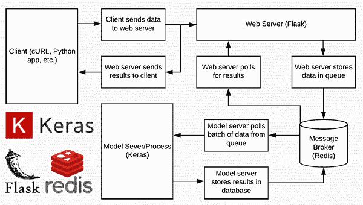
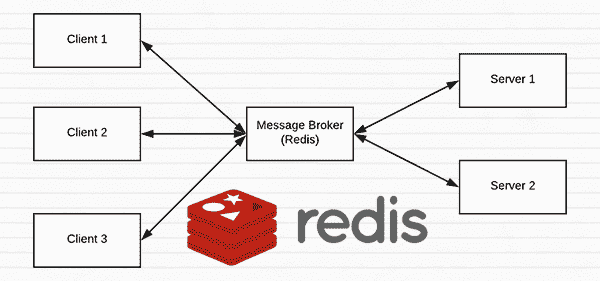
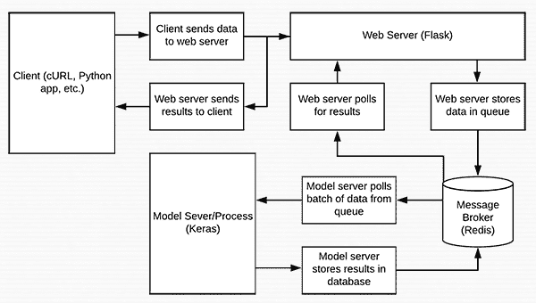
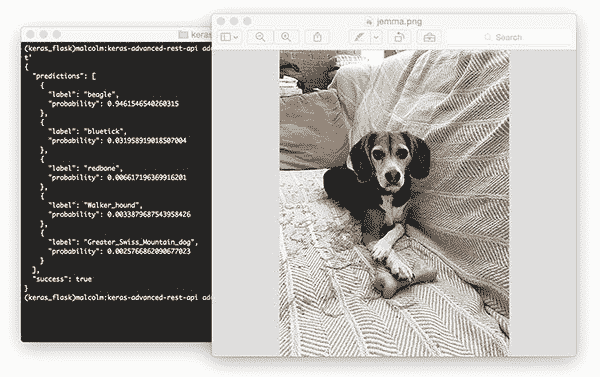
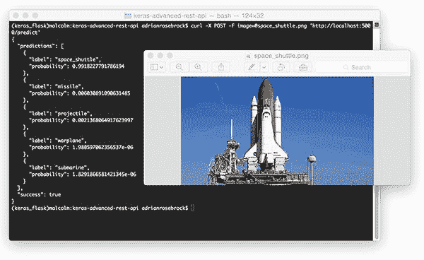
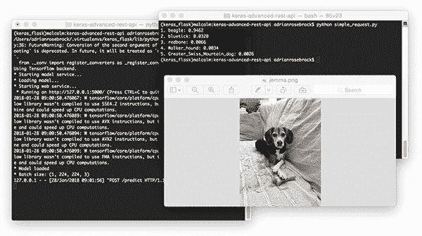
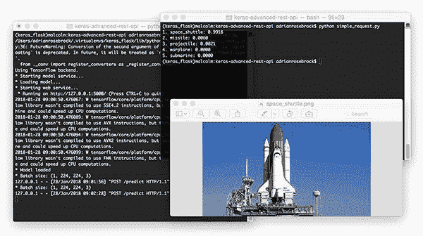

# 可扩展的 Keras +深度学习 REST API

> 原文：<https://pyimagesearch.com/2018/01/29/scalable-keras-deep-learning-rest-api/>

[](https://pyimagesearch.com/wp-content/uploads/2018/01/keras_api_header.png)

在今天的博客文章中，我们将创建一个深度学习 REST API，以高效、可扩展的方式包装 Keras 模型。

我们的 Keras +深度学习 REST API 将能够批量处理图像，扩展到多台机器(包括多台 web 服务器和 Redis 实例)，并在置于负载平衡器之后时进行循环调度。

为此，我们将使用:

*   Keras
*   [Redis](https://redis.io/) (一个内存中的数据结构存储)
*   烧瓶(Python 的一个微型 web 框架)
*   消息队列和消息代理编程范例

这篇博文比 PyImageSearch 上的其他教程更高级一些，面向读者:

*   熟悉 Keras 深度学习库的人
*   了解 web 框架和 web 服务的人(最好以前编写过简单的网站/web 服务)
*   他们了解基本的数据结构，如散列表/字典、列表，以及它们相关的渐进复杂性

更简单的 Keras +深度学习 REST API，请参考[我在官方 Keras.io 博客](https://blog.keras.io/building-a-simple-keras-deep-learning-rest-api.html)上做的这篇客座博文。

**要了解如何创建自己的可扩展 Keras +深度学习 REST API，*继续阅读！***

## 可扩展的 Keras +深度学习 REST API

***2020-06-16 更新:**此博文现已兼容 TensorFlow 2+!*

今天的教程分为多个部分。

我们将首先简要讨论一下 [Redis 数据存储库](https://redis.io/)，以及如何使用它来促进消息队列和消息代理。

从那里，我们将通过安装所需的 Python 包来配置我们的 Python 开发环境，以构建我们的 Keras 深度学习 REST API。

一旦我们配置好开发环境，我们就可以使用 [Flask web 框架](http://flask.pocoo.org/)实现我们实际的 Keras 深度学习 REST API。实现之后，我们将启动 Redis 和 Flask 服务器，然后使用 cURL 和 Python 向我们的深度学习 API 端点提交推理请求。

最后，我们将对构建自己的深度学习 REST API 时应该记住的注意事项进行简短的讨论。

### Redis 作为 REST API 消息代理/消息队列的简短介绍

[](https://pyimagesearch.com/wp-content/uploads/2018/01/keras_api_message_broker.png)

**Figure 1:** Redis can be used as a message broker/message queue for our deep learning REST API

[Redis](https://redis.io) 是内存中的数据存储。它不同于简单的键/值存储(如 [memcached](https://memcached.org/) )，因为它可以存储实际的数据结构。

要阅读更多关于 Redis 的内容，我鼓励您阅读这篇[简介](https://redis.io/topics/introduction)。

### 为我们的 Keras REST API 配置和安装 Redis

Redis 非常容易安装。下面是在您的系统上下载、解压缩和安装 Redis 的命令:

```
$ wget http://download.redis.io/redis-stable.tar.gz
$ tar xvzf redis-stable.tar.gz
$ cd redis-stable
$ make
$ sudo make install

```

要启动 Redis 服务器，请使用以下命令:

```
$ redis-server

```

让此终端保持打开状态，以保持 Redis 数据存储运行。

在另一个终端中，您可以验证 Redis 已经启动并正在运行:

```
$ redis-cli ping
PONG

```

只要你从 Redis 得到一个`PONG`回复，你就可以开始了。

### 配置 Python 开发环境以构建 Keras REST API

我建议您在 Python 虚拟环境中处理这个项目**，这样它就不会影响系统级 Python 和项目。**

为此，您需要安装 pip、virtualenv 和 virtualenvwrapper(假设您尚未安装)。有关在您的环境中配置这些工具的说明，请参见:

*   [*如何在 Ubuntu 上安装 tensor flow 2.0*](https://pyimagesearch.com/2019/12/09/how-to-install-tensorflow-2-0-on-ubuntu/)
*   [*如何在 macOS 上安装 tensor flow 2.0*](https://pyimagesearch.com/2019/12/09/how-to-install-tensorflow-2-0-on-macos/)

请注意 [PyImageSearch 不推荐也不支持 CV/DL 项目](https://pyimagesearch.com/faqs/single-faq/can-you-help-me-do-___-on-windows/)的窗口。

您还需要在虚拟环境中安装以下软件包:

```
$ workon dl4cv
$ pip install flask
$ pip install gevent
$ pip install requests
$ pip install redis

```

就是这样！

### 实现可伸缩的 Keras REST API

[](https://pyimagesearch.com/wp-content/uploads/2018/01/keras_api_data_flow.png)

**Figure 2:** Our deep learning Keras + Redis + Flask REST API data flow diagram

让我们开始构建我们的服务器脚本。为了方便起见，我在一个文件中实现了服务器，但是如果你认为合适的话，它也可以模块化。

为了获得最佳效果并避免复制/粘贴错误，我鼓励你使用这篇博文的 ***【下载】*** 部分来获取相关的脚本和图像。

让我们打开`run_keras_server.py`并一起走过它:

```
# import the necessary packages
from tensorflow.keras.applications import ResNet50
from tensorflow.keras.preprocessing.image import img_to_array
from tensorflow.keras.applications.resnet50 import preprocess_input
from tensorflow.keras.applications.resnet50 import decode_predictions
from threading import Thread
from PIL import Image
import numpy as np
import base64
import flask
import redis
import uuid
import time
import json
import sys
import io
```

上面列出了不少进口，特别是`ResNet50`、`flask`、`redis`。

为了简单起见，我们将使用在 ImageNet 数据集上预先训练的 ResNet。我将指出在哪里可以用 ResNet 替换您自己的模型。

`flask`模块包含[烧瓶](http://flask.pocoo.org/)库(用于构建我们的 web API)。`redis`模块将使我们能够与 Redis 数据存储接口。

从这里，让我们初始化将在整个`run_keras_server.py`中使用的常数:

```
# initialize constants used to control image spatial dimensions and
# data type
IMAGE_WIDTH = 224
IMAGE_HEIGHT = 224
IMAGE_CHANS = 3
IMAGE_DTYPE = "float32"

# initialize constants used for server queuing
IMAGE_QUEUE = "image_queue"
BATCH_SIZE = 32
SERVER_SLEEP = 0.25
CLIENT_SLEEP = 0.25
```

我们将向服务器传递尺寸为 *224 x 224* 并包含`3`个通道的`float32`个图像。

我们的服务器可以处理一个`BATCH_SIZE = 32`。如果您的生产系统上有 GPU，您会想要调整您的`BATCH_SIZE`以获得最佳性能。

我发现将`SERVER_SLEEP`和`CLIENT_SLEEP`都设置为`0.25`秒(分别是服务器和客户端在再次轮询 Redis 之前暂停的时间)在大多数系统上都可以很好地工作。如果你正在构建一个生产系统，一定要调整这些常量。

让我们启动 Flask 应用程序和 Redis 服务器:

```
# initialize our Flask application, Redis server, and Keras model
app = flask.Flask(__name__)
db = redis.StrictRedis(host="localhost", port=6379, db=0)
model = None

```

这里你可以看到启动 Flask 是多么容易。

我假设在您运行这个服务器脚本之前，您的 *Redis 服务器正在运行*。我们的 Python 脚本在端口`6379`上连接到我们的`localhost`上的 Redis 存储(Redis 的默认主机和端口值)。

不要忘记在这里初始化一个全局 Keras `model`到`None`。

接下来，让我们处理图像的序列化:

```
def base64_encode_image(a):
	# base64 encode the input NumPy array
	return base64.b64encode(a).decode("utf-8")

def base64_decode_image(a, dtype, shape):
	# if this is Python 3, we need the extra step of encoding the
	# serialized NumPy string as a byte object
	if sys.version_info.major == 3:
		a = bytes(a, encoding="utf-8")

	# convert the string to a NumPy array using the supplied data
	# type and target shape
	a = np.frombuffer(base64.decodestring(a), dtype=dtype)
	a = a.reshape(shape)

	# return the decoded image
	return a
```

Redis 将作为我们在服务器上的临时数据存储。图像将通过各种方法进入服务器，如 cURL、Python 脚本，甚至是移动应用程序。

此外，图像可能只是每隔一段时间出现一次(几小时或几天一次)，或者以非常高的速率出现(每秒多次)。我们需要把图像放在某个地方，因为它们在被处理之前会排队。我们的 Redis 商店将充当临时存储。

为了在 Redis 中存储我们的图像，需要对它们进行序列化。由于图像只是 NumPy 数组，我们可以利用 [base64 编码](https://en.wikipedia.org/wiki/Base64)来序列化图像。使用 base64 编码还有一个好处，就是允许我们使用 JSON 来存储图像的附加属性。

我们的`base64_encode_image`函数处理序列化，并在**第 36-38 行**中定义。

类似地，我们需要在通过模型传递图像之前对它们进行反序列化。这由**行 40-52** 上的`base64_decode_image`函数处理。

让我们预处理我们的图像:

```
def prepare_image(image, target):
	# if the image mode is not RGB, convert it
	if image.mode != "RGB":
		image = image.convert("RGB")

	# resize the input image and preprocess it
	image = image.resize(target)
	image = img_to_array(image)
	image = np.expand_dims(image, axis=0)
	image = preprocess_input(image)

	# return the processed image
	return image
```

在**第 54 行**上，我定义了一个`prepare_image`函数，它使用 Keras 中的 ResNet50 实现对我们的输入图像进行预处理以进行分类..当使用你自己的模型时，我建议修改这个函数来执行任何需要的预处理、缩放或归一化。

在这里，我们将定义我们的分类方法:

```
def classify_process():
	# load the pre-trained Keras model (here we are using a model
	# pre-trained on ImageNet and provided by Keras, but you can
	# substitute in your own networks just as easily)
	print("* Loading model...")
	model = ResNet50(weights="imagenet")
	print("* Model loaded")

```

正如我们将在下面的`__main__`中看到的，`classify_process`函数将在它自己的线程中被启动。该函数将从 Redis 服务器轮询图像批次，对图像进行分类，并将结果返回给客户端。

**73 线**加载`model`。我将此操作与终端`print`消息夹在一起——取决于您的 Keras 模型的大小，加载可以是瞬时的，也可能需要几秒钟。

当这个线程启动时，加载模型只发生*一次*——如果我们每次想要处理一个图像时都必须加载模型，这将会非常慢，此外，这可能会由于内存耗尽而导致服务器崩溃。

加载模型后，该线程将不断轮询新图像，然后对它们进行分类:

```
	# continually pool for new images to classify
	while True:
		# attempt to grab a batch of images from the database, then
		# initialize the image IDs and batch of images themselves
		queue = db.lrange(IMAGE_QUEUE, 0, BATCH_SIZE - 1)
		imageIDs = []
		batch = None

		# loop over the queue
		for q in queue:
			# deserialize the object and obtain the input image
			q = json.loads(q.decode("utf-8"))
			image = base64_decode_image(q["image"], IMAGE_DTYPE,
				(1, IMAGE_HEIGHT, IMAGE_WIDTH, IMAGE_CHANS))

			# check to see if the batch list is None
			if batch is None:
				batch = image

			# otherwise, stack the data
			else:
				batch = np.vstack([batch, image])

			# update the list of image IDs
			imageIDs.append(q["id"])
```

这里我们首先使用 Redis 数据库的`lrange`函数从我们的队列中获取最多`BATCH_SIZE`张图像(**第 80 行**)。

从那里我们初始化我们的`imageIDs`和`batch` ( **行 81 和 82** )并开始从**行 85** 开始在`queue`上循环。

在循环中，我们首先解码对象并将其反序列化为一个 NumPy 数组，`image` ( **第 87-89 行**)。

接下来，在**第 91-97 行**，我们将把`image`加到`batch`(或者如果`batch`当前是`None`，我们就把`batch`设置为当前的`image`)。

我们还将图像的`id`附加到`imageIDs` ( **第 100 行**)。

让我们完成循环和函数:

```
		# check to see if we need to process the batch
		if len(imageIDs) > 0:
			# classify the batch
			print("* Batch size: {}".format(batch.shape))
			preds = model.predict(batch)
			results = decode_predictions(preds)

			# loop over the image IDs and their corresponding set of
			# results from our model
			for (imageID, resultSet) in zip(imageIDs, results):
				# initialize the list of output predictions
				output = []

				# loop over the results and add them to the list of
				# output predictions
				for (imagenetID, label, prob) in resultSet:
					r = {"label": label, "probability": float(prob)}
					output.append(r)

				# store the output predictions in the database, using
				# the image ID as the key so we can fetch the results
				db.set(imageID, json.dumps(output))

			# remove the set of images from our queue
			db.ltrim(IMAGE_QUEUE, len(imageIDs), -1)

		# sleep for a small amount
		time.sleep(SERVER_SLEEP)
```

在这个代码块中，我们检查我们的批处理中是否有任何图像(**行 103** )。

如果我们有一批图像，我们通过将整批图像传递给模型来对其进行预测( **Line 106** )。

从那里，我们循环遍历一个`imageIDs`和相应的预测`results` ( **第 111-123 行**)。这些行将标签和概率附加到输出列表中，然后使用`imageID`作为键将输出存储在 Redis 数据库中(**行 117-123** )。

我们使用第 126 行**上的`ltrim`从队列中移除我们刚刚分类的图像集。**

最后，我们在设定的`SERVER_SLEEP`时间内休眠，等待下一批图像进行分类。

接下来让我们处理 REST API 的`/predict`端点:

```
@app.route("/predict", methods=["POST"])
def predict():
	# initialize the data dictionary that will be returned from the
	# view
	data = {"success": False}

	# ensure an image was properly uploaded to our endpoint
	if flask.request.method == "POST":
		if flask.request.files.get("image"):
			# read the image in PIL format and prepare it for
			# classification
			image = flask.request.files["image"].read()
			image = Image.open(io.BytesIO(image))
			image = prepare_image(image, (IMAGE_WIDTH, IMAGE_HEIGHT))

			# ensure our NumPy array is C-contiguous as well,
			# otherwise we won't be able to serialize it
			image = image.copy(order="C")

			# generate an ID for the classification then add the
			# classification ID + image to the queue
			k = str(uuid.uuid4())
			d = {"id": k, "image": base64_encode_image(image)}
			db.rpush(IMAGE_QUEUE, json.dumps(d))
```

稍后您会看到，当我们发布到 REST API 时，我们将使用`/predict`端点。当然，我们的服务器可以有多个端点。

我们使用函数上方的`@app.route`装饰器，格式如**第 131 行**所示，来定义我们的端点，以便 Flask 知道要调用什么函数。我们可以很容易地拥有另一个使用 AlexNet 而不是 ResNet 的端点，并且我们可以以类似的方式定义具有关联函数的端点。您明白这个想法，但是对于我们今天的目的，我们只有一个端点叫做`/predict`。

我们在**行 132** 定义的`predict`方法将处理对服务器的 POST 请求。这个函数的目标是构建 JSON `data`，我们将把它发送回客户端。

如果 POST 数据包含图像(**行 138 和 139** )，我们将图像转换为 PIL/枕头格式，并对其进行预处理(**行 142-144** )。

在开发这个脚本时，我花了*相当多的时间来调试*我的序列化和反序列化函数，结果发现我需要**第 148 行**来将数组转换成 C 连续排序(你可以在这里阅读更多关于[的内容)。老实说，这是一个相当大的痛苦，但我希望它能帮助您快速启动和运行。](https://stackoverflow.com/questions/26998223/what-is-the-difference-between-contiguous-and-non-contiguous-arrays)

如果你想知道在**行 100** 上提到的`id`，它实际上是在这里使用`uuid`(一个[通用唯一标识符](https://en.wikipedia.org/wiki/Universally_unique_identifier))在**行 152** 上生成的。我们使用 UUID 来防止哈希/键冲突。

接下来，我们将`image`的`id`和`base64`编码添加到`d`字典中。使用`rpush` ( **Line 154** )将这个 JSON 数据推送到 Redis `db`非常简单。

让我们轮询服务器以返回预测:

```
			# keep looping until our model server returns the output
			# predictions
			while True:
				# attempt to grab the output predictions
				output = db.get(k)

				# check to see if our model has classified the input
				# image
				if output is not None:
 					# add the output predictions to our data
 					# dictionary so we can return it to the client
					output = output.decode("utf-8")
					data["predictions"] = json.loads(output)

					# delete the result from the database and break
					# from the polling loop
					db.delete(k)
					break

				# sleep for a small amount to give the model a chance
				# to classify the input image
				time.sleep(CLIENT_SLEEP)

			# indicate that the request was a success
			data["success"] = True

	# return the data dictionary as a JSON response
	return flask.jsonify(data)

```

我们将不断循环，直到模型服务器返回输出预测。我们开始一个无限循环，并试图得到第 158-160 行的预测。

从那里，如果`output`包含预测，我们反序列化结果，并将它们添加到将返回给客户端的`data`。

我们还从`db`中`delete`出结果(因为我们已经从数据库中取出了结果，不再需要将它们存储在数据库中)并将`break`从循环中取出(**第 164-173 行**)。

否则，我们没有任何预测，我们需要睡觉，继续投票( **Line 177** )。

如果我们到达**线 180** ，我们就成功获得了我们的预言。在这种情况下，我们将`True`的`success`值添加到客户端数据中。

***注意:**对于这个示例脚本，我没有在上面的循环中添加超时逻辑，这在理想情况下会将`False`的`success`值添加到数据中。我将把它留给你来处理和实现。*

最后我们在`data`上调用`flask.jsonify`，并将其返回给客户端(**行 183** )。这就完成了我们的预测功能。

为了演示我们的 Keras REST API，我们需要一个`__main__`函数来实际启动服务器:

```
# if this is the main thread of execution first load the model and
# then start the server
if __name__ == "__main__":
	# load the function used to classify input images in a *separate*
	# thread than the one used for main classification
	print("* Starting model service...")
	t = Thread(target=classify_process, args=())
	t.daemon = True
	t.start()

	# start the web server
	print("* Starting web service...")
	app.run()

```

**第 187-197 行**定义了`__main__`函数，它将启动我们的`classify_process`线程(**第 191-193 行**)并运行 Flask app ( **第 197 行**)。

为了测试我们的 Keras 深度学习 REST API，请务必使用这篇博客文章的 ***“下载”*** 部分下载源代码+示例图像。

从这里，让我们启动 Redis 服务器(如果它还没有运行的话):

```
$ redis-server

```

然后，在一个单独的终端中，让我们启动 REST API Flask 服务器:

```
$ python run_keras_server.py 
Using TensorFlow backend.
 * Loading Keras model and Flask starting server...please wait until server has fully started
...
 * Running on http://127.0.0.1:5000

```

此外，我建议等到您的模型完全加载到内存中之后，再向服务器提交请求。

现在我们可以继续用 cURL 和 Python 测试服务器了。

### 使用 cURL 访问我们的 Keras REST API

[](https://pyimagesearch.com/wp-content/uploads/2018/01/keras_api_result01.jpg)

**Figure 3:** Using cURL to test our Keras REST API server. Pictured is my family beagle, Jemma. She is classified as a beagle with 94.6% confidence by our ResNet model.

cURL 工具预装在大多数(基于 Unix 的)操作系统上。我们可以通过使用以下命令在`/predict`端点将图像文件发布到我们的深度学习 REST API:

```
$ curl -X POST -F image=@jemma.png 'http://localhost:5000/predict'

```

您将在终端上收到 JSON 格式的预测:

```
{
  "predictions": [
    {
      "label": "beagle", 
      "probability": 0.9461546540260315
    }, 
    {
      "label": "bluetick", 
      "probability": 0.031958919018507004
    }, 
    {
      "label": "redbone", 
      "probability": 0.006617196369916201
    }, 
    {
      "label": "Walker_hound", 
      "probability": 0.0033879687543958426
    }, 
    {
      "label": "Greater_Swiss_Mountain_dog", 
      "probability": 0.0025766862090677023
    }
  ], 
  "success": true
}

```

让我们尝试传递另一个图像，这次是一架航天飞机:

```
$ curl -X POST -F image=@space_shuttle.png 'http://localhost:5000/predict'
{
  "predictions": [
    {
      "label": "space_shuttle", 
      "probability": 0.9918227791786194
    }, 
    {
      "label": "missile", 
      "probability": 0.006030891090631485
    }, 
    {
      "label": "projectile", 
      "probability": 0.0021368064917623997
    }, 
    {
      "label": "warplane", 
      "probability": 1.980597062356537e-06
    }, 
    {
      "label": "submarine", 
      "probability": 1.8291866581421345e-06
    }
  ], 
  "success": true
}

```

其结果可以在下面看到:



**Figure 4:** Submitting an input image to our Keras REST API and obtaining the prediction results.

我们的 Keras REST API 再次正确地对输入图像进行了分类。

### 使用 Python 向 Keras REST API 提交请求

如您所见，使用 cURL 进行验证非常容易。现在让我们构建一个 Python 脚本，它将发布一个图像并以编程方式解析返回的 JSON。

让我们回顾一下`simple_request.py`:

```
# import the necessary packages
import requests

# initialize the Keras REST API endpoint URL along with the input
# image path
KERAS_REST_API_URL = "http://localhost:5000/predict"
IMAGE_PATH = "jemma.png"

```

我们在这个脚本中使用 Python `requests`来处理向服务器发送数据。

我们的服务器运行在`localhost`上，可以通过端口`5000`访问，端点`/predict`由`KERAS_REST_API_URL`变量指定(**第 6 行**)。如果服务器远程运行或在不同的机器上运行，请确保指定适当的域/ip、端口和端点。

我们还定义了一个`IMAGE_PATH` ( **线 7** )。在这种情况下，`jemma.png`与我们的脚本在同一个目录中。如果您想使用其他图像进行测试，请确保指定输入图像的完整路径。

让我们加载图像并将其发送到服务器:

```
# load the input image and construct the payload for the request
image = open(IMAGE_PATH, "rb").read()
payload = {"image": image}

# submit the request
r = requests.post(KERAS_REST_API_URL, files=payload).json()

# ensure the request was sucessful
if r["success"]:
	# loop over the predictions and display them
	for (i, result) in enumerate(r["predictions"]):
		print("{}. {}: {:.4f}".format(i + 1, result["label"],
			result["probability"]))

# otherwise, the request failed
else:
	print("Request failed")

```

我们在**二进制模式**下读取**第 10** 行的图像，并将其放入有效载荷字典中。

有效载荷通过**行 14** 上的`requests.post`发送到服务器。

如果我们得到一个`success`消息，我们可以循环预测并把它们打印到终端上。我把这个脚本做得很简单，但是如果你想变得有趣，你也可以使用 OpenCV 在图像上绘制最高预测文本。

#### 运行简单请求脚本

将脚本投入使用很容易。打开一个终端并执行以下命令(当然，前提是我们的 Flask 服务器和 Redis 服务器都在运行)。

```
$ python simple_request.py
1\. beagle: 0.9462
2\. bluetick: 0.0320
3\. redbone: 0.0066
4\. Walker_hound: 0.0034
5\. Greater_Swiss_Mountain_dog: 0.0026

```



**Figure 5:** Using Python to programmatically consume the results of our Keras deep learning REST API.

对于`space_shuttle.png`，只需修改`IMAGE_PATH`变量:

```
IMAGE_PATH = "space_shuttle.png"

```

从那里，再次运行脚本:

```
$ python simple_request.py
1\. space_shuttle: 0.9918
2\. missile: 0.0060
3\. projectile: 0.0021
4\. warplane: 0.0000
5\. submarine: 0.0000

```



**Figure 6:** A second example of programmatically consuming our Keras deep learning REST API. Here a space shuttle is classified with 99% confidence by ResNet + Keras REST API.

### 扩展深度学习 REST API 时的注意事项

如果您预计 deep learning REST API 的负载会持续较长时间，您可能需要考虑负载平衡算法，如循环调度，以帮助在多个 GPU 机器和 Redis 服务器之间均匀地分配请求。

请记住，Redis 是一个内存中的数据存储，所以我们只能在队列中存储尽可能多的图像，我们有可用的内存。

数据类型为`float32`的单个 *224 x 224 x 3* 图像将消耗 602112 字节的内存。

假设一台服务器只有 16GB 的内存，这意味着我们的队列中可以容纳大约 26，500 张图像，但此时我们可能会希望添加更多的 GPU 服务器来更快地处理队列。

### 然而，有一个微妙的问题…

取决于你如何部署你的深度学习 REST API，将`classify_process`函数保存在与我们的 web API 代码的其余部分相同的文件中有一个微妙的问题。

大多数 web 服务器，包括 Apache 和 nginx，都允许多线程。

如果您将`classify_process`保存在与`predict`视图相同的*文件*中，那么您可以加载*多个模型*。如果您的服务器软件认为有必要创建一个新线程来服务传入的客户端请求，那么对于每个新线程，都会创建一个新视图，因此会加载一个新模型。

解决方案是将`classify_process`转移到一个*完全独立的进程*，然后和你的 Flask web 服务器和 Redis 服务器一起启动它。

在下周的博文中，我将基于今天的解决方案，展示如何解决这个问题，并演示:

*   如何配置 Apache web 服务器来服务我们的深度学习 REST API
*   如何将`classify_process`作为一个完全独立的 Python 脚本运行，避免“多模型综合症”
*   提供压力测试结果，确认和验证我们的深度学习 REST API 可以在高负载下扩展

## 摘要

在今天的博文中，我们学习了如何构建一个可扩展的 Keras +深度学习 REST API。

为了实现这一目标，我们:

*   构建了一个简单的 Flask 应用程序，将我们的 Keras 模型加载到内存中，并接受传入的请求。
*   利用 Redis 作为内存中的消息队列/消息代理。
*   利用线程来批处理输入图像，将它们写回消息队列，然后将结果返回给客户端。

这种方法可以扩展到多台机器，包括多台 web 服务器和 Redis 实例。

我希望你喜欢今天的博文！

请务必在下表中输入您的电子邮件地址，以便在 PyImageSearch 上发布未来教程时得到通知！