# 我对微软深度学习数据科学虚拟机(DSVM)的评论

> 原文：<https://pyimagesearch.com/2018/03/21/my-review-of-microsofts-deep-learning-virtual-machine/>

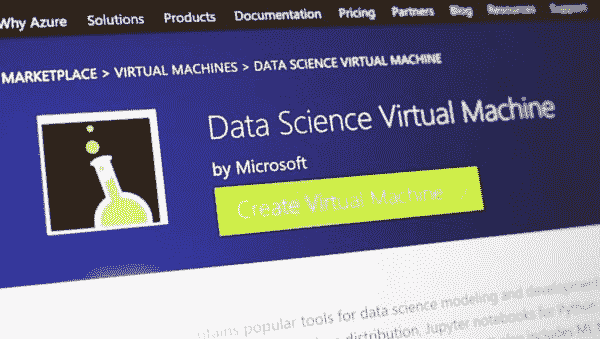

Image credit: [OnMSFT](https://www.onmsft.com/news/microsoft-releases-data-science-virtual-machines-windows-linux-help-kick-start-analytics-projects)

在过去的几个月里，我一直在使用微软的 Ubuntu 深度学习和数据科学虚拟机(DSVM)来完成我在 PyImageSearch 的几个项目。

起初，我有点犹豫(甚至有点抗拒)尝试一下——我已经有了一个[预配置的亚马逊 AWS 深度学习 AMI](https://pyimagesearch.com/2017/09/20/pre-configured-amazon-aws-deep-learning-ami-with-python/) ,它(1)我经常使用,( 2)对任何希望在自己的项目中使用它的 PyImageSearch 读者都是公开可用的。

虽然我不是亚马逊 AWS 用户界面的粉丝，但多年来我已经习惯了它。我想在它笨拙的复杂性中有一种“熟悉感”。

但是我听说了关于 Ubuntu DSVM 的 ***如此好的事情*，所以我决定测试一下。**

我被深深打动了。

界面更容易使用。表演很棒。价格很合理。

…而且，使用 Python 的*计算机视觉深度学习的所有代码都在上面运行，没有任何改动，这也没有什么坏处。*

微软甚至慷慨地允许我在他们的机器学习博客上发表一系列客座博文，分享我在使用、测试和评估机器学习时的经历:

*   [深度学习&微软 Azure 云中的计算机视觉](https://blogs.technet.microsoft.com/machinelearning/2018/01/18/deep-learning-computer-vision-in-the-microsoft-azure-cloud/)
*   [用 22 分钟在一场 Kaggle 比赛中获得第二名，深度学习&蔚蓝](https://blogs.technet.microsoft.com/machinelearning/2018/02/22/22-minutes-to-2nd-place-in-a-kaggle-competition-with-deep-learning-azure/)
*   [在微软 Azure cloud 中训练最先进的神经网络](https://blogs.technet.microsoft.com/machinelearning/2018/03/21/training-state-of-the-art-neural-networks-in-the-microsoft-azure-cloud/)

微软非常认真地将自己打造成深度学习、机器学习和数据科学的“首选”云环境。他们 DSVM 产品的质量表明了这一点。

在今天特别版博文的剩余部分，我将分享我对 DSVM 的想法，甚至演示如何启动您的第一个实例，并在其上运行您的第一个深度学习示例。

**了解更多微软深度学习虚拟机(以及它是否适合你)，*继续阅读！***

## 微软深度学习虚拟机综述

当我第一次评估微软的数据科学和深度学习虚拟机(DSVM)时，我用 Python 和 ***在 DSVM 上运行了所有来自 *[计算机视觉深度学习的代码示例](https://pyimagesearch.com/deep-learning-computer-vision-python-book/)**** 。

手动运行每个示例并检查输出的过程有点乏味，但这也是将 DSVM 放入振铃器并评估它的一个很好的方法:

*   **初学者用法**(即刚入门深度学习)
*   **从业者使用**，在这里你要建立深度学习模型，需要快速评估表现
*   **研究用途**，在大型图像数据集上训练深度神经网络。

使用 Python 进行计算机视觉深度学习的代码库*完美地补充了这个测试。*

*Starter Bundle* 里面的代码是为了帮助你迈出图像分类、深度学习和卷积神经网络(CNN)的第一步。

如果代码在 DSVM 上运行顺利，那么我肯定会推荐给正在寻找预配置深度学习环境的初学者。

*实践者包*中的章节+附带代码涵盖了更高级的技术(迁移学习、微调 GANs 等)。这些是深度学习实践者或工程师将在日常工作中应用的技术。

如果 DSVM 处理了这些例子，那么我知道我可以把它推荐给深度学习的从业者。

最后， *ImageNet 捆绑包*内的代码需要 GPU 马力(越多越好)和 I/O 性能。在这个包里，我演示了如何**复制最先进的出版物**(例如。ResNet、SqueezeNet 等。)在海量图像数据集上，如 120 万图像 ImageNet 数据集。

如果 DSVM 可以处理复制最先进论文的结果，那么我知道我可以向研究人员推荐 DSVM。

在这篇博文的前半部分，我将总结我在这些测试中的经历。

在那里，我将向您展示如何在微软云中启动您的第一个深度学习实例，然后在 DSVM 中运行您的第一个深度学习代码示例。

### 全面的深度学习库

[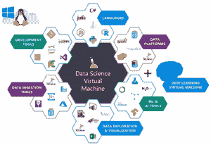](https://pyimagesearch.com/wp-content/uploads/2018/03/dsvm_review_libraries.png)

**Figure 1:** The Microsoft Azure Data Science Virtual Machine comes with all packages shown pre-installed and pre-configured for your immediate use.

微软的深度学习虚拟机运行在他们的 Azure 云中。

它在技术上可以运行 Windows 或 Linux，但对于几乎所有的深度学习项目，我会建议你使用他们的 Ubuntu DSVM 实例(除非你有特定的理由使用 Windows)。

安装在 DSVM 上的包的列表非常全面——你可以在这里找到完整的列表。我在下面列出了最著名的深度学习和计算机视觉包(特别是对 PyImageSearch 的读者)，让你知道这个列表有多全面:

*   TensorFlow
*   Keras
*   mxnet
*   Caffe/Caffe2
*   Torch/PyTorch
*   OpenCV
*   Jupyter
*   CUDA 和 cuDNN
*   python3

DSVM 团队每隔几个月发布一个新的、更新的 DSVM，并预先配置和安装最新的软件包。这是一个 ***巨大的*** 的证明，不仅证明了 DSVM 团队保持这个实例无缝运行(保持 DSVM 没有包冲突肯定是一个痛苦的过程，但它对最终用户是完全透明的)，也证明了微软希望让用户*也享受*体验的愿望。

### GPU 呢？

DSVM 可以在纯 CPU 和 GPU 实例中运行。

对于我下面运行的大多数实验和测试，我使用了一个带有**标准 NVIDIA K80 GPU** 的 **Ubuntu GPU 实例**。

此外，微软允许我访问他们刚刚发布的 **NVIDIA V100** 庞然大物，我用它进行了一些额外的快速抽查(见下面的结果— *真快！*)

对于所有的*初学者捆绑包*和*实践者捆绑包*实验，我选择测试微软的 Jupyter 笔记本。

这个过程非常简单。

我在浏览器中复制并粘贴了 Jupyter 笔记本服务器的 URL，启动了一个新的笔记本，几分钟后我就可以运行书中的例子了。

对于 *ImageNet 捆绑包*实验，我使用 SSH 来复制最先进的论文的结果，这需要几天的训练时间，我个人认为这不是 Jupyter 笔记本的正确用法。

### 便于深度学习初学者使用

[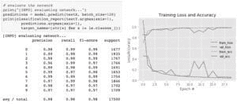](https://pyimagesearch.com/wp-content/uploads/2018/03/dsvm_review_lenet_mnist.jpg)

**Figure 2:** Training the LeNet architecture on the MNIST dataset. This combination is often referred to as the “hello world” example of Deep Learning.

在我在微软博客上的第一篇客座博文中，我在 MNIST 手写数字数据集上训练了一个简单的卷积神经网络(LeNet)。在 MNIST 上训练 LeNet 可能是研究深度学习的初学者的第一次“真正”实验。

模型和数据集都很简单，训练也可以在 CPU *或* GPU 上进行。

我用 Python(*Starter Bundle*)从计算机视觉的 *[深度学习的第 14 章中取出代码，并在微软 DSVM 上的 Jupyter 笔记本(你可以在这里找到](https://pyimagesearch.com/deep-learning-computer-vision-python-book/))中执行。*

其结果可以在上面的**图 2** 中看到。

经过 20 个时期的训练，我能够获得 98%的分类准确率。

使用 Python 进行计算机视觉深度学习的*的*初学者包*中的所有其他代码示例也运行顺利。*

能够在 Azure DSVM 上通过 Jupyter 笔记本在浏览器中运行代码(没有额外的配置)是一种很好的体验，我相信刚接触深度学习的用户会喜欢并欣赏这种体验。

### 对深度学习从业者实用有用

[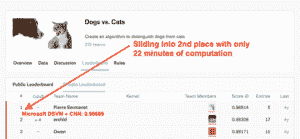](https://pyimagesearch.com/wp-content/uploads/2018/03/dsvm_review_kaggle_leaderboard.png)

**Figure 3:** Taking 2nd place on the Kaggle Leaderboard for the dogs vs. cats challenge is a breeze with the Microsoft Azure DSVM (pre-configured) using code from *Deep Learning for Computer Vision with Python*.

我在微软博客上的第二篇文章是面向从业者的。

深度学习实践者使用的一种常见技术是应用*迁移学习*，特别是*特征提取*，以快速训练模型并获得高精度。

为了演示如何将 DSVM 用于寻求快速训练模型和评估不同超参数的从业者，我:

1.  在 [Kaggle Dogs vs. Cats 数据集](https://www.kaggle.com/c/dogs-vs-cats)上使用预训练的 ResNet 模型进行特征提取。
2.  对提取的特征应用具有网格搜索超参数的逻辑回归分类器。
3.  获得了能够在比赛中夺取**第二名**的最终模型。

我还想在 25 分钟内完成所有这些。

**最终的结果是一个模型能够以仅仅 22 分钟的计算** 滑入*第二名(如图**图 3** 所示)。*

你可以在这篇文章中找到关于我如何完成这项任务的完整文章，包括 Jupyter 笔记本+代码。

但是它能更快地完成吗？

在我在 NVIDIA K80 上运行了 Kaggle Dogs vs. Cats 实验之后，微软允许我访问他们刚刚发布的 NVIDIA V100 GPUs。

我以前从未使用过 NVIDIA V100，所以看到结果我真的很兴奋。

我被震撼了。

NVIDIA K80 花了 *22 分钟*完成流水线，而 NVIDIA V100 只用了 **5 分钟**就完成了任务——这比 **340 *提高了一大截！***

我相信深度学习实践者将从在 V100 和 K80 上运行他们的实验中获得很多价值，但你也需要证明价格是合理的(见下文)。

### 强大到足以进行最先进的深度学习研究

[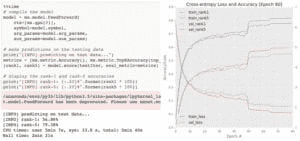](https://pyimagesearch.com/wp-content/uploads/2018/03/dsvm_review_squeezenet.jpg)

**Figure 4:** The Microsoft Azure DSVM handles training SqueezeNet on the ImageNet dataset easily.

DSVM 非常适合深度学习的初学者和实践者——但是从事最先进工作的研究人员呢？DSVM 对他们还有用吗？

为了评价这个问题，我:

1.  将整个 [ImageNet 数据集](http://image-net.org/)下载到虚拟机
2.  从第九章 *ImageNet 捆绑包*的 [*用 Python 进行计算机视觉的深度学习*](https://pyimagesearch.com/deep-learning-computer-vision-python-book/) 中取出代码，在那里我演示了如何在 ImageNet 上训练 SqueezeNet

我选择 SqueezeNet 有几个原因:

1.  我有一台本地机器已经在 ImageNet 上为一个单独的项目训练了 SqueezeNet，这使我能够很容易地比较结果。
2.  SqueezeNet 是我个人最喜欢的架构之一。
3.  得到的模型大小(小于 5MB，无量化)更容易用于生产环境，其中模型需要部署在资源受限的网络或设备上。

我在 NVIDIA K80 上总共训练了 80 个纪元的 SqueezeNet。SGD 用于以 1e-2 的初始学习速率训练网络(我发现 Iandola 等人推荐的 4e-2 对于稳定训练来说太大了)。在第 50、65 和 75 个时期，学习率分别下降了一个数量级。

在 K80 上，每个历元大约需要 140 分钟，所以整个训练时间为 **~1 周。**

根据使用的 GPU 数量，使用多个 GPU 可以轻松地将培训时间减少到 1-3 天。

训练完成后，我在 50，000 个图像测试集上进行评估(我从训练集中取样，因此我不必将结果提交给 ImageNet 评估服务器)。

总的来说，我获得了 **58.86%** rank-1 和 **79.38%** rank-5 的准确率。这些结果与 Iandola 等人报道的结果一致。

关于 SqueezeNet + ImageNet 的完整文章可以在微软博客上找到。

#### 使用 NVIDIA V100 进行难以置信的快速训练

在我使用 NVIDIA K80 在 ImageNet 上训练 SqueezeNet 之后，我使用单个 V100 GPU 重复了这个实验。

训练中的加速令人难以置信。

与 K80 相比(每个周期约 140 分钟)，V100 在 ***28 分钟*** 内完成了一个周期，一个*巨大的* **加速超过 400%！**

我能够在 36 个多小时内训练 SqueezeNet 并复制我之前实验的结果。

深度学习研究人员应该认真考虑 DSVM，特别是如果你不想拥有和维护实际的硬件。

### 但是价格呢？

[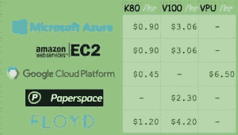](https://pyimagesearch.com/wp-content/uploads/2018/03/dsvm_pricing.jpg)

**Figure 5:** GPU compute pricing comparison for various deep learning + GPU providers.

在亚马逊的 EC2 上，对于一个 [p2.xlarge 实例](https://aws.amazon.com/ec2/instance-types/p2/)，你将支付 0.90 美元/小时(1x K80)、7.20 美元/小时(8x K80)或 14.40 美元/小时(16x K80)。**每 K80 每小时 0.90 美元。**

在[微软 Azure](https://azuremarketplace.microsoft.com/en-us/marketplace/apps/microsoft-ads.linux-data-science-vm-ubuntu?tab=PlansAndPrice) 上，价格完全相同，分别为 0.90 美元/小时(1x K80)、1.80 美元/小时(2x K80)和 3.60 美元/小时(4x K80)。**每 K80 小时的费用也是 0.90 美元。**

亚马逊已经准备好了 [V100 机器](https://aws.amazon.com/ec2/instance-types/p3/)，定价为 3.06 美元/小时(1x V100)、12.24 美元/小时(4x V100)、24.48 美元/小时(8x V100)。**准备在亚马逊 EC2 上为每 V100 花费 3.06 美元/小时。**

Azure 上最近发布的 V100 实例的价格极具竞争力，分别为 3.06 美元/小时(1 个 V100)、6.12 美元/小时(2 个 V100)、12.24 美元/小时(4 个 V100)。**这也是每 V100 每小时 3.06 美元。**

微软提供 [Azure Batch AI 定价](https://azure.microsoft.com/en-us/pricing/details/batch/)，类似于[亚马逊的现货定价](https://aws.amazon.com/ec2/spot/pricing/)，使你有可能在实例上获得更好的交易。

除非我们也看看谷歌、Paperspace 和 Floydhub，否则这不会是一个完整(和公平)的价格比较。

[谷歌](https://cloud.google.com/compute/pricing)收费 0.45 美元/小时(1x K80)，0.90 美元(2x K80)，1.80 美元/小时(4x K80)，3.60 美元/小时(8x K80)。*这显然是 K80 的最佳定价模式，价格是 MS/EC2 的一半。*据我所知，谷歌没有 V100 机器。相反，他们提供自己的品种，**[TPU](https://cloud.google.com/tpu/docs/pricing)，价格为 6.50 美元/小时/TPU。**

[Paperspace](https://www.paperspace.com/) 收费 2.30 美元/小时(1x V100 ),他们有 API 端点。

Floydhub 的定价是 4.20 美元/小时(1x V100)，但他们提供了一些很棒的团队协作解决方案。

说到可靠性，EC2 和 Azure 是最突出的。当你考虑到 Azure 的易用性(与 EC2 相比)时，就越来越难以证明长期坚持使用亚马逊是正确的。

如果你有兴趣尝试一下 Azure 云，微软也提供了 [**免费试用积分**](https://azure.microsoft.com/en-us/free/)；然而，试用*不能*用于 GPU 机器(我知道，这是个败笔，但 GPU 实例很珍贵)。

### 在微软云中启动第一个深度学习实例

启动 DSVM 实例非常简单——本节将是启动 DSVM 实例的快速入门指南。

对于高级配置，您需要[参考文档](https://docs.microsoft.com/en-us/azure/)(因为我将主要选择默认选项)。

此外，你可能想考虑注册微软的免费 Azure 试用版 ，这样你就可以测试他们的 Azure 云，而无需花费你的资金

***注:**微软的试用不能用于 GPU 机器。我知道，这是令人失望的，但 GPU 实例是一个巨大的溢价。*

我们开始吧！

**第一步:**在【portal.azure.com】创建用户账号或登录。

**第二步:**点击左上角的*“创建资源”*。

[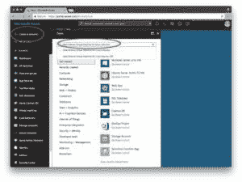](https://pyimagesearch.com/wp-content/uploads/2018/03/dsvm-createresource-1.jpg)

**Figure 6:** Microsoft Azure “Create Resource” screen.

**第三步:**在搜索框中输入*“Data Science Virtual Machine for Linux”*，它会根据您的输入自动完成。选择第一个 Ubuntu 选项。

**第四步:**配置基本设置:创建一个名字(没有空格或特殊字符)。选择 **HDD** (不要选择 SSD)。我选择使用一个简单的密码，而不是一个密钥文件，但这取决于你。在*【订阅】*下，查看您是否有可用的免费积分。您需要创建一个*“资源组”*——我使用了现有的“rg1”。

[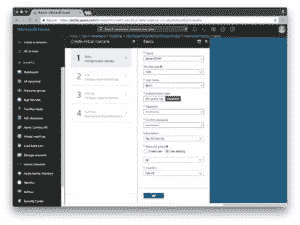](https://pyimagesearch.com/wp-content/uploads/2018/03/dsvm-createresource-configfilled.jpg)

**Figure 7:** Microsoft Azure resource “Basic Settings”.

**第五步:**选择一个地区，然后选择你的 VM。我选择了可用的 K80 实例(NC65_V3)。如果向下滚动(NC6S_V3)，V100 实例也可用。我的一个抱怨是我不理解命名惯例。我希望它们能像跑车一样命名，或者至少像 2x K80 机器的“K80-2”那样命名，但它们是以虚拟 CPU 的数量命名的，当我们对 GPU 感兴趣时，这有点令人困惑。

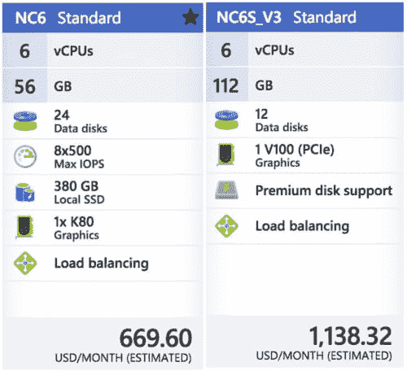

**Figure 8:** The Microsoft Azure DSVM will run on a K80 GPU and V100 GPU.

**第 6 步:**查看总结页面并同意合同:

[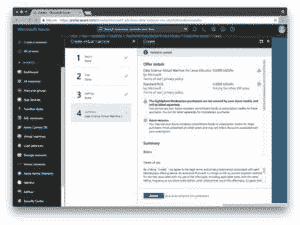](https://pyimagesearch.com/wp-content/uploads/2018/03/dsvm-summary.jpg)

**Figure 9:** The summary page allows you to review and agree to the contract.

**第 7 步** **:** 等待系统部署完成——当您的系统准备就绪时，您会看到一个方便的通知。

**第八步:**点击*“所有资源”。*您将在这里看到您所支付的一切:

[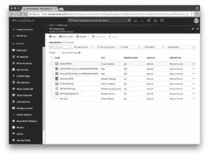](https://pyimagesearch.com/wp-content/uploads/2018/03/dsvm-all-resources.jpg)

**Figure 10:** The Azure “All Resources” page shows my DSVM and associated services.

如果您选择虚拟机，那么您将看到关于您的机器的信息(在一个新的选项卡中打开下面的屏幕截图，以便您可以看到包含 IP 地址等的图像的更高分辨率版本。):

[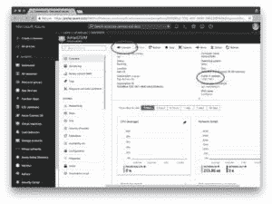](https://pyimagesearch.com/wp-content/uploads/2018/03/dsvm-resource-overview.jpg)

**Figure 11:** The “Resource Overview” page allows for you to see your instance’s

**步骤 9:** 通过 SSH 和/或 Jupyter 连接。

无论您使用的是密钥文件还是密码，单击 connect 选项都会为您提供 SSH 的连接详细信息:

不幸的是，没有显示到 Jupyter 的便捷链接。要访问 Jupyter，您需要:

1.  在浏览器中打开一个新标签
2.  导航到`https://yourAzureDsvmPublicIP:8000`(“http”后面的“s”很重要)。请确保在 URL 中填入您的公共 IP。

### 在深度学习虚拟机上运行代码

现在，让我们运行我在 Jupyter 的第一篇微软帖子中的 LeNet + MNIST 的例子。

这是一个两步过程:

**第一步:** SSH 入机(见上一节**第九步**)。

将目录更改为`~/notebooks`目录。

克隆回购:`$ git clone https://github.com/jrosebr1/microsoft-dsvm.git`

第二步:在浏览器中启动 Jupyter(参见上一节中的**第九步**)。

点击`microsoft-dsvm`目录。

打开相应的`.ipynb`文件(`pyimagesearch-training-your-first-cnn.ipynb`)。

在运行笔记本之前，我想向您介绍一个小技巧。

这不是强制性的，但是如果您在 DSVM 中使用多台笔记本电脑，这可以减少一些麻烦。

这种伎俩的动机是这样的:如果你执行一个笔记本，但让它“运行”，内核仍然有一个 GPU 锁。无论何时运行不同的笔记本，您都会看到诸如“资源耗尽”之类的错误。

快速解决方法是将下面两行 ***放在笔记本最底部的自己的单元格*** 中:

```
%%javascript
Jupyter.notebook.session.delete();

```

现在，当你执行完笔记本中的所有单元格，笔记本会优雅地关闭自己的内核。这样你就不必记得手动关闭它。

从那里，你可以点击第一个单元格内的某处，然后点击*“单元格>运行全部”。* **这将运行笔记本中的所有单元，并在 MNIST 上训练 LeNet。**从那里，您可以在浏览器中查看输出，并获得类似于下面的结果:

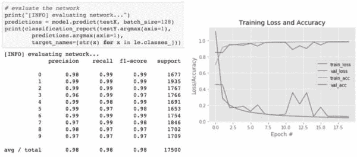

**Figure 12:** Training LeNet on MNIST in the Microsoft Azure cloud and the Data Science Virtual Machine (DSVM).

我喜欢在完成后或修改后开始新的运行前清除所有输出。你可以从*“内核>重启&清除输出*菜单中选择。

## 摘要

在今天的博文中，我回顾并讨论了我个人对微软的数据科学和深度学习虚拟机(DSVM)的体验。

我还演示了如何启动您的第一个 DSVM 实例，并在其上运行您的第一个深度学习示例。

我将第一个承认，在尝试 DSVM 时我有点犹豫，但我很高兴我这样做了。

我对 DSVM 进行的每一项测试，从初学者的使用到复制最先进论文的结果，它都处理得很轻松。

当我能够使用微软新的 NVIDIA V100 GPU 实例时，**我的实验飞了**，看到 NVIDIA K80 实例的加速比高达****% 400。****

 ****如果你在市场上寻找一个基于深度学习云的 GPU 实例，我会鼓励你尝试一下微软的 DSVM——体验非常棒，微软的支持非常好，DSVM 本身功能强大但易于使用。

此外，微软和 DSVM 团队将赞助 **[PyImageConf 2018](https://www.pyimageconf.com/)** ，这是 PyImageSearch 自己的计算机视觉和深度学习会议。

[](https://www.pyimageconf.com/)

在会议期间，PyImageConf 与会者将有 ***免费*访问 DSVM GPU 实例**，允许您:

*   接着是讲座和研讨会
*   训练他们自己的模型
*   最好向演讲者学习

了解更多关于 PyImageConf 2018， **[只需点击这里](https://www.pyimageconf.com/)** 。

我希望在那里见到你！****