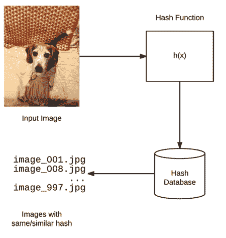
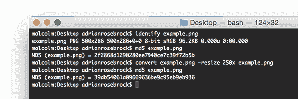
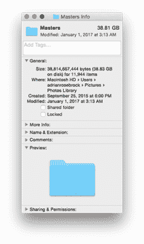
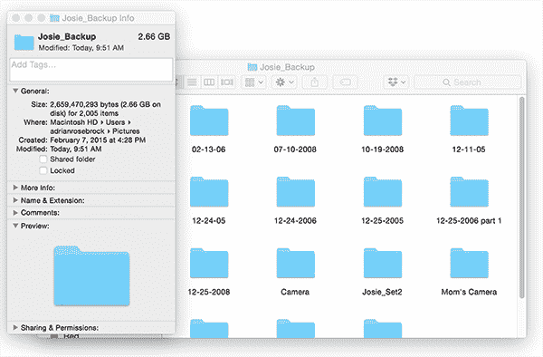
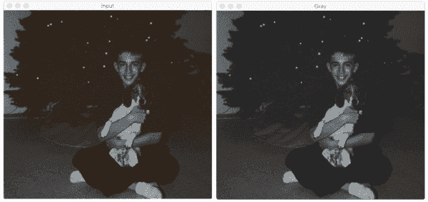
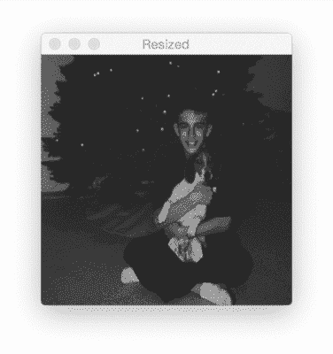
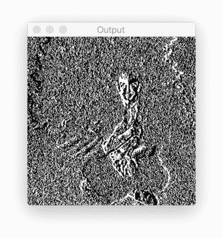

# 用 OpenCV 和 Python 实现图像哈希

> 原文：<https://pyimagesearch.com/2017/11/27/image-hashing-opencv-python/>



今天的博文是关于图像哈希的— ***，这是我写过的最难的博文。***

图像哈希并不是一项特别难的技术(事实上，这是我在 PyImageSearch 博客上教过的最简单的算法之一)。

但是 ***为什么*** 的主题和潜在原因，我今天在所有的日子里几乎撕心裂肺地讨论。

这篇博文剩下的介绍是非常个人化的**，涵盖了五年前发生在我生活中的事件，几乎直到今天。**

 **如果你想跳过个人讨论，直接跳到图像哈希内容，我就不做评判了 PyImageSearch 的重点毕竟是做计算机视觉博客。

要跳到计算机视觉内容，只需滚动到*“使用 OpenCV 和 Python 的图像哈希”*部分，在那里我将深入研究算法和实现。

虽然 PyImageSearch 是一个计算机视觉和深度学习博客，但我是一个非常真实的人。

有时候我内心的人性需要一个分享的地方。

一个分享童年的地方。

精神疾病。

以及爱和失去的感觉。

我很感激你是 PyImageSearch 的读者，我希望你能让我写这篇介绍，倾诉，并继续我寻找平静的旅程。

* * *

五年前，就在今天，我最好的朋友死在了我的怀里。

她的名字叫乔西。

你们中的一些人可能认识这个名字——它出现在我所有书籍和出版物的献词中。

乔西是一只狗，一只完美、可爱、体贴的小猎犬，是我 11 岁时爸爸送给我的。

也许你已经理解失去童年宠物的感受。

或者也许你没看到这有什么大不了的——“这只是一只狗，对吗？”

但对我来说，乔西不仅仅是一只狗。

她是把我的童年和成年联系在一起的最后一根线。任何纯真的童年情感都与那根线联系在一起。

当那根线断了的时候，我也几乎断了。

至少可以说，我的童年有点混乱。

我在一个破碎的家庭中长大。我的母亲患有(现在仍然患有)双相精神分裂症、抑郁症、严重焦虑和许多其他精神疾病，不胜枚举。

不用说太多细节，我母亲的病肯定不是她的错——但她经常拒绝她如此迫切需要的照顾和帮助。当她接受帮助，如果经常不顺利。

我的童年包括(看起来没完没了的)去精神病院的参观，然后是和我母亲近乎紧张的互动。当她从紧张症中走出来时，我的家庭生活经常陷入混乱和混乱。

你在那种环境下成长得很快。

你很容易失去童年的纯真。

我的父亲一定意识到了我早年潜在的灾难性轨迹(以及它如何对我成年后的幸福产生重大影响)，他在我 11 岁的时候给我带了一只小猎犬回家，很可能帮助我保留童年的一部分。

他是对的。而且成功了。

作为一个孩子，没有比抱着一只小狗更好的感觉了，感觉它的心跳贴着你的心跳，顽皮地在你的怀里扭动，五分钟后在你的腿上睡着了。

乔西还给我一些童年的纯真。

每当我放学回家，她都在。

每当我独自坐着，深夜玩电子游戏(这是我经常用来帮助我“逃离”和应对的一种仪式)，她都在那里。

每当我的家庭生活变成尖叫、叫喊和精神疾病折磨的完全无法理解的尖叫时，乔西总是在我身边。

随着我进入尴尬的中后期青少年时期，我自己也开始受到焦虑问题的困扰，我后来知道，这种情况对于在这种环境下长大的孩子来说太常见了。

在高中一年级和二年级期间，由于我患有急性焦虑症，我爸爸不得不从学校护士办公室接我回家不下 20 次。

尽管我十几岁时也有问题，试图长大并以某种方式理解我和我的家庭发生了什么，但乔西总是躺在我身边，陪着我，提醒我小时候是什么样的。

但是当乔西五年前死在我怀里时，那根线断了——那根唯一的线将“成年的我”和“童年的我”联系在一起。

接下来的一年是残酷的。我正在完成我博士的最后一个学期的课程，准备开始我的论文。我在全职工作。我甚至有一些兼职项目正在进行中…

一直以来，我不仅要面对失去最好的朋友，还要面对失去童年的痛苦。

那不是一个好年景，我挣扎了很久。

然而，乔西去世后不久，我在收集和整理我家人所有的她的照片中找到了一点安慰。

这项治疗性的怀旧任务包括扫描实物照片，翻旧的数码相机 SD 卡，甚至在打包好的盒子里寻找早已被遗忘的存储卡上有照片的手机。

当我不工作或不在学校的时候，我花了很多时间将所有这些照片导入 Mac 上的 iPhoto。这是单调乏味的体力劳动，但这正是我需要的工作。

然而，当我完成了 80%的照片导入时，重量变得让我无法承受。为了自己的精神健康，我需要休息一下。

现在已经过去五年了。

我还有剩下的 20%要完成，这正是我现在正在做的。

我现在在一个更好的地方，在个人、精神和身体上。该是我完成我开始的事情的时候了，不为别的，只为我欠自己和乔西的。

问题是我看这些 JPEGs 的目录已经五年了。

有些目录已经导入 iPhoto(我平时看照片的地方)。

其他人没有。

我不知道哪些照片已经存在 iPhoto 中。

那么，我该如何决定我还需要对哪些目录的照片进行排序，然后导入/组织呢？

*答案是图像哈希。*

我发现它非常有说服力，以至于我可以应用计算机视觉，我的激情，来完成一项对我来说意义重大的任务。

感谢你阅读这篇文章，并和我一起踏上这段旅程。

* * *

## 用 OpenCV 和 Python 实现图像哈希


**Figure 1:** Image hashing (also called perceptual hashing) is the process of constructing a hash value based on the visual contents of an image. We use image hashing for CBIR, near-duplicate detection, and reverse image search engines.

图像哈希*或**知觉哈希**或*的过程是:

1.  检查图像的内容
2.  基于图像的内容构建唯一标识输入图像*的哈希值*

 *也许最著名的图像哈希实现/服务是 [TinEye](https://tineye.com/) ，一个反向图像搜索引擎。

使用 TinEye，用户能够:

1.  上传图像
2.  然后 TinEye 会告诉用户*图片出现在网络的哪个位置*

在这一部分的顶部可以看到感知散列/图像散列算法的视觉示例。

给定一个输入图像，我们的算法根据图像的*视觉外观计算图像散列。*

感觉上相似的图像应该具有相似的散列(其中“相似”通常被定义为散列之间的汉明距离)。

通过利用图像散列算法，我们可以在常数时间内，或者在最坏的情况下，当利用适当的数据结构时，在 *O(lg n)* 时间内找到几乎相同的图像。

在这篇博文的剩余部分，我们将:

1.  讨论图像哈希/感知哈希(以及为什么传统哈希不起作用)
2.  实现图像散列，特别是*差异散列* (dHash)
3.  将图像哈希应用于现实世界的问题和数据集

### 为什么不能用 md5，sha-1 等。？



**Figure 2:** In this example I take an input image and compute the md5 hash. I then resize the image to have a width of 250 pixels rather than 500 pixels, followed by computing the md5 hash again. Even though the contents of the image did not change, the hash did.

以前有密码学或文件验证(即校验和)背景的读者可能会奇怪，为什么我们不能使用 [md5](https://en.wikipedia.org/wiki/MD5) 、 [sha-1](https://en.wikipedia.org/wiki/SHA-1) 等。

这里的问题在于加密散列算法的本质:改变文件中的一个比特将导致不同的散列。

这意味着，如果我们仅仅改变输入图像中一个*单像素*的颜色，我们最终会得到一个不同的校验和，而事实上我们(很可能)无法判断这个单像素是否发生了变化——对我们来说，两幅图像在感知上看起来是一样的*。*

这方面的一个例子见上面的**图 2** 。这里，我取一个输入图像并计算 md5 散列。然后，我将图像的宽度调整为 250 像素，而不是 500 像素——没有对图像做任何修改。然后，我重新计算 md5 散列。**注意哈希值是如何变化的，即使图像的视觉内容没有变化！**

在图像哈希和感知哈希的情况下，我们实际上希望*相似的图像*也有*相似的哈希*。**因此，如果图像相似，我们实际上会寻求*一些哈希冲突*。**

### 我们项目的图像散列数据集

这个项目的目标是帮助我开发一个计算机视觉应用程序，它可以(使用[针和干草堆类比](https://en.wikipedia.org/wiki/Needle_in_a_haystack)):

1.  取两个图像输入目录，分别是*草堆*和*针。*
2.  确定哪些针*已经*在干草堆里，哪些针*没有*在干草堆里。

完成这项任务(对于这个特定的项目)最有效的方法是使用*图像散列*，这个概念我们将在本文后面讨论。

在这里，我的*干草堆*是我在 iPhotos 中收集的照片——这个目录的名称是`Masters`:



**Figure 3:** The *“Masters”* directory contains all images in my iPhotos album.

从截图中我们可以看到，我的`Masters`目录包含了 11944 张照片，总共 38.81GB。

然后我有了我的*针*，一组图像(和相关的子目录):



**Figure 4:** Inside the *“Josie_Backup”* directory I have a number of images, some of which have been imported into iPhoto and others which have not. My goal is to determine which subdirectories of photos inside *“Josie_Backup”* need to be added to *“Masters”*.

目录包含了许多我的狗(乔西)的照片以及许多不相关的家庭照片。

我的目标是确定哪些目录和图像已经被导入 iPhoto，哪些目录我还需要导入并整理。

使用图像哈希，我们可以快速完成这个项目。

### 理解感知图像哈希和差异哈希

我们将为这篇博文实现的图像哈希算法被称为*差分哈希*或者简称为*哈希*。

我第一次记得是在我本科/研究生生涯的末期，在 [HackerFactor](http://www.hackerfactor.com/blog/index.php?/archives/529-Kind-of-Like-That.html) 博客上读到关于 dHash 的文章。

我今天的目标是:

1.  为 dHash 感知哈希算法提供额外的见解。
2.  给你配备一个手工编码的 dHash 实现。
3.  提供一个应用于实际数据集的图像哈希的真实示例。

dHash 算法只有四个步骤，非常简单易懂。

#### 第一步:转换成灰度



**Figure 5:** The first step in image hashing via the difference hashing algorithm is to convert the input image *(left)* to grayscale *(right)*.

我们的图像哈希算法的第一步是将输入图像转换为灰度，并丢弃任何颜色信息。

丢弃颜色使我们能够:

1.  更快地散列图像*因为我们只需要检查一个通道*
2.  匹配完全相同但颜色空间略有变化的图像(因为颜色信息已被移除)

无论出于什么原因，如果您对颜色特别感兴趣，您可以在每个通道上独立运行哈希算法，然后在最后合并(尽管这将导致 3 倍大的哈希)。

#### 第二步:调整大小



**Figure 6:** The next step in perceptual hashing is to resize the image to a fixed size, *ignoring aspect ratio.* For many hashing algorithms, resizing is the slowest step. **Note:** Instead of resizing to *9×8* pixels I resized to *257×256* so we could more easily visualize the hashing algorithm.

既然我们的输入图像已经被转换为灰度，我们需要将其压缩到 9×8 像素，忽略纵横比。对于大多数图像+数据集，调整大小/插值步骤是算法中*最慢的*部分。

然而，现在你可能有两个问题:

1.  为什么我们在调整大小时忽略了图像的长宽比？
2.  为什么*9×8*——这似乎是一个“奇怪”的尺寸？

要回答第一个问题:

我们将图像压缩到 9×8，T2 忽略长宽比，以确保生成的图像散列将匹配相似的照片，而不管它们的初始空间尺寸。

第二个问题需要更多的解释，我们将在下一步中给出完整的答案。

#### 第三步:计算差异

我们的最终目标是计算 64 位哈希——因为 *8×8 = 64* 我们已经非常接近这个目标了。

那么，我们究竟为什么要把尺寸调整到 9×8 呢？

好吧，记住我们正在实现的算法的名字:**差分哈希。**

差异哈希算法通过计算*个相邻*像素之间的差异(即相对梯度)来工作。

如果我们取每行有 9 个像素的输入图像，并计算相邻列像素之间的差异，我们最终得到 8 个差异。八行八个差(即 *8×8* )是 64，这将成为我们的 64 位哈希。

在实践中，我们实际上不需要计算差异——我们可以应用“大于”测试(或“小于”测试，只要始终使用相同的操作，这并不重要，我们将在下面的步骤 4 中看到)。

如果这一点令人困惑，不要担心，一旦我们开始实际查看一些代码，一切都会变得清晰。

#### 步骤#4:构建散列



**Figure 6:** Here I have included the binary difference map used to construct the image hash. Again, I am using a *256×256* image so we can more easily visualize the image hashing algorithm.

最后一步是分配位并构建结果散列。为了做到这一点，我们使用一个简单的二进制测试。

给定一个差分图像 *D* 和相应的一组像素 *P* ，我们应用下面的测试:*P【x】>P【x+1】= 1 否则 0。*

在这种情况下，我们测试左像素是否比右像素更亮。如果左边的像素更亮，我们将输出值设置为 1。否则，如果左边的像素更暗，我们将输出值设置为零。

这个操作的输出可以在上面的**图 6** 中看到(这里我已经将可视化的大小调整为 *256×256* 像素，以便更容易看到)。如果我们假设这个差异图是 *8×8* 像素，这个测试的输出产生一组 64 个二进制值，然后将它们组合成单个 64 位整数(即，实际的图像散列)。

#### dHash 的优势

使用差异散列(dHash)有许多好处，但主要的好处包括:

1.  如果输入图像的纵横比发生变化，我们的图像哈希不会发生变化(因为我们忽略了纵横比)。
2.  调整亮度或对比度将(1)不改变我们的哈希值，或者(2)仅稍微改变它*，确保哈希值紧密结合。*
**   差异散列法非常快。*

 *#### 比较不同的哈希

通常我们使用[汉明距离](https://en.wikipedia.org/wiki/Hamming_distance)来比较哈希值。汉明距离测量两个不同散列中的位数。

汉明距离为零的两个散列意味着这两个散列是*相同的*(因为没有不同的比特)，并且这两个图像也是相同的/感觉上相似的。

HackerFactor 的 Neal Krawetz 博士认为，具有差异 *> 10* 位的散列最有可能是不同的，而 1 和 10 之间的汉明距离可能是同一图像的变体。实际上，您可能需要为自己的应用程序和相应的数据集调整这些阈值。

为了这篇博文的目的，我们将只检查哈希是否*相同*。我将把优化搜索以计算汉明差异留在 PyImageSearch 的未来教程中。

### 用 OpenCV 和 Python 实现图像哈希

我对图像哈希和差异哈希的实现受到了 GitHub 上的 [imagehash 库的启发，但做了调整，以(1)使用 OpenCV 而不是 PIL，以及(2)正确地(在我看来)利用完整的 64 位哈希而不是压缩它。](https://github.com/JohannesBuchner/imagehash)

我们将使用图像哈希而不是加密哈希(如 md5、sha-1 等。)由于我的针或干草堆中的一些图像可能被轻微修改过，包括潜在的 JPEG 伪像。

因此，我们需要依靠我们的*感知哈希*算法来处理输入图像的这些微小变化。

首先，确保您已经安装了我的 [imutils 包](https://github.com/jrosebr1/imutils)，这是一系列方便的函数，可以使 OpenCV 的使用更加容易(并且确保您可以访问您的 Python 虚拟环境，假设您正在使用它):

```
$ workon cv
$ pip install imutils

```

从那里，打开一个新文件，命名为`hash_and_search.py`，我们将得到编码:

```
# import the necessary packages
from imutils import paths
import argparse
import time
import sys
import cv2
import os

```

**第 2-7 行**处理导入我们需要的 Python 包。确保您已经安装了`imutils`来访问`paths`子模块。

从这里开始，让我们定义`dhash`函数，它将包含我们的*差分散列*实现:

```
def dhash(image, hashSize=8):
	# resize the input image, adding a single column (width) so we
	# can compute the horizontal gradient
	resized = cv2.resize(image, (hashSize + 1, hashSize))

	# compute the (relative) horizontal gradient between adjacent
	# column pixels
	diff = resized[:, 1:] > resized[:, :-1]

	# convert the difference image to a hash
	return sum([2 ** i for (i, v) in enumerate(diff.flatten()) if v])

```

我们的`dhash`函数需要一个输入`image`和一个可选的`hashSize`。我们设置`hashSize=8`来表示我们的输出散列将是*8×8 = 64*位。

**第 12 行**将我们的输入`image`调整为`(hashSize + 1, hashSize)`——这完成了我们算法的**步骤#2** 。

给定`resized`图像，我们可以计算**线 16** 上的二进制`diff`，它测试相邻像素是*更亮*还是*更暗* ( **步骤#3** )。

最后，**第 19 行**通过将布尔值转换成 64 位整数来构建散列(**步骤#4** )。

然后将得到的整数返回给调用函数。

既然已经定义了我们的`dhash`函数，让我们继续解析我们的命令行参数:

```
# construct the argument parse and parse the arguments
ap = argparse.ArgumentParser()
ap.add_argument("-a", "--haystack", required=True,
	help="dataset of images to search through (i.e., the haytack)")
ap.add_argument("-n", "--needles", required=True,
	help="set of images we are searching for (i.e., needles)")
args = vars(ap.parse_args())

```

我们的脚本需要两个命令行参数:

*   `--haystack`:图像输入目录的路径，我们将检查`--needles`路径。
*   我们正在搜索的一组图像。

**我们的目标是确定`--needles`中的每个图像是否存在于`--haystack`中。**

现在让我们开始加载`--haystack`和`--needles`图像路径:

```
# grab the paths to both the haystack and needle images 
print("[INFO] computing hashes for haystack...")
haystackPaths = list(paths.list_images(args["haystack"]))
needlePaths = list(paths.list_images(args["needles"]))

# remove the `\` character from any filenames containing a space
# (assuming you're executing the code on a Unix machine)
if sys.platform != "win32":
	haystackPaths = [p.replace("\\", "") for p in haystackPaths]
	needlePaths = [p.replace("\\", "") for p in needlePaths]

```

**第 31 行和第 32 行**获取每个目录中相应图像的路径。

当实现这个脚本时，我的数据集中的许多图像在它们的文件名中有*个空格*。在普通的 Unix 系统中，我们对文件名中带有`\`的空格进行转义，从而将文件名`Photo 001.jpg`转换为`Photo\ 001.jpg`。

然而，Python 假设路径是*未转义的*，所以我们必须删除路径中任何出现的`\`(**行 37 和 38** )。

***注意:**Windows 操作系统使用`\`来分隔路径，而 Unix 系统使用`/`。Windows 系统在路径中自然会有一个`\`，因此我在**行 36** 上做了这个检查。我还没有在 Windows 上测试过这段代码——这只是我对它在 Windows 中应该如何处理的“最佳猜测”。用户小心。*

```
# grab the base subdirectories for the needle paths, initialize the
# dictionary that will map the image hash to corresponding image,
# hashes, then start the timer
BASE_PATHS = set([p.split(os.path.sep)[-2] for p in needlePaths])
haystack = {}
start = time.time()

```

**第 43 行**抓取`needlePaths`里面的子目录名——我需要这些子目录名来确定哪些文件夹*已经*添加到草堆里了，哪些子目录我*还需要检查*。

然后第 44 行初始化`haystack`，这是一个将图像散列映射到各自文件名的字典。

我们现在准备为我们的`haystackPaths`提取图像散列:

```
# loop over the haystack paths
for p in haystackPaths:
	# load the image from disk
	image = cv2.imread(p)

	# if the image is None then we could not load it from disk (so
	# skip it)
	if image is None:
		continue

	# convert the image to grayscale and compute the hash
	image = cv2.cvtColor(image, cv2.COLOR_BGR2GRAY)
	imageHash = dhash(image)

	# update the haystack dictionary
	l = haystack.get(imageHash, [])
	l.append(p)
	haystack[imageHash] = l

```

在第 48 行的**上，我们在`haystackPaths`的所有图像路径上循环。**

对于每个图像，我们从磁盘中加载它(**第 50 行**)，并检查图像是否是`None` ( **第 54 和 55 行**)。如果`image`是`None`，那么图像无法从磁盘正确读取，可能是由于图像编码的问题(这种现象你可以在这里了解更多关于[的信息)，所以我们跳过图像。](https://pyimagesearch.com/2016/12/26/opencv-resolving-nonetype-errors/)

**行 58 和 59** 计算`imageHash`，而**行 62-64** 维护一个*文件路径列表*，这些路径*映射到相同的散列值。*

下一个代码块显示了散列过程的一些诊断信息:

```
# show timing for hashing haystack images, then start computing the
# hashes for needle images
print("[INFO] processed {} images in {:.2f} seconds".format(
	len(haystack), time.time() - start))
print("[INFO] computing hashes for needles...")

```

然后我们可以继续从我们的`needlePaths`中提取哈希值:

```
# loop over the needle paths
for p in needlePaths:
	# load the image from disk
	image = cv2.imread(p)

	# if the image is None then we could not load it from disk (so
	# skip it)
	if image is None:
		continue

	# convert the image to grayscale and compute the hash
	image = cv2.cvtColor(image, cv2.COLOR_BGR2GRAY)
	imageHash = dhash(image)

	# grab all image paths that match the hash
	matchedPaths = haystack.get(imageHash, [])

	# loop over all matched paths
	for matchedPath in matchedPaths:
		# extract the subdirectory from the image path
		b = p.split(os.path.sep)[-2]

		# if the subdirectory exists in the base path for the needle
		# images, remove it
		if b in BASE_PATHS:
			BASE_PATHS.remove(b)

```

这个代码块的一般流程与上面的几乎相同:

*   我们从磁盘加载图像(同时确保它不是`None`)
*   将图像转换为灰度
*   并计算图像散列

*与*的区别在于，我们不再将哈希值存储在`haystack`中。

相反，我们现在**检查**的`haystack`字典，看看是否有任何图像路径 ***具有相同的散列值*** ( **行 87** )。

如果有图像具有相同的哈希值，那么我知道我已经*手动检查了这个特定的图像子目录，并将它们添加到 iPhoto 中。既然我已经手动检查过了，那我就没有必要再检查一遍了；因此，我可以循环所有的`matchedPaths`并将它们从`BASE_PATHS` ( **第 89-97 行**)中移除。*

简单来说:所有图片+相关子目录`matchedPaths`都已经*在我的 iPhotos 相册里*了。

我们的最终代码块遍历了`BASE_PATHS`中所有剩余的子目录，并让我知道哪些仍然需要手动调查并添加到 iPhoto 中:

```
# display directories to check
print("[INFO] check the following directories...")

# loop over each subdirectory and display it
for b in BASE_PATHS:
	print("[INFO] {}".format(b))

```

我们的图像哈希实现现在已经完成了！

让我们继续应用我们的图像哈希算法来解决我一直试图解决的针/干草堆问题。

### 使用 OpenCV 和 Python 结果的图像哈希

要查看我们的图像哈希算法，请向下滚动到本教程的 ***“下载”*** 部分，然后下载源代码+示例图像数据集。

我*没有*在这里包括我的个人 iPhotos 数据集，因为:

1.  整个数据集大约为 39GB
2.  有许多我不想分享的个人照片

相反，我包含了来自 [UKBench 数据集](https://archive.org/details/ukbench)的样本图像，您可以使用它们。

为了确定我还需要检查哪些目录(即“needles”)并在以后添加到“haystack”中，我打开了一个终端并执行了以下命令:

```
$ python hash_and_search.py --haystack haystack --needles needles
[INFO] computing hashes for haystack...
[INFO] processed 7466 images in 1111.63 seconds
[INFO] computing hashes for needles...
[INFO] check the following directories...
[INFO] MY_PIX
[INFO] 12-25-2006 part 1

```

正如您从输出中看到的，整个散列和搜索过程花费了大约 18 分钟。

然后，我有了一个清晰的输出，显示了我仍然需要检查的目录:在 14 个可能的子目录中，我仍然需要对其中的两个进行排序，分别是`MY_PIX`和`12-25-2006 part 1`。

通过浏览这些子目录，我可以完成我的照片整理项目。

正如我上面提到的，我是*而不是*，包括我在本帖*【下载】*中的个人照片档案。如果您对我在下载中提供的示例执行`hash_and_search.py`脚本，您的结果将如下所示:

```
$ python hash_and_search.py --haystack haystack --needles needles
[INFO] computing hashes for haystack...
[INFO] processed 1000 images in 7.43 seconds
[INFO] computing hashes for needles...
[INFO] check the following directories...
[INFO] PIX
[INFO] December2014

```

它有效地演示了完成相同任务的脚本。

### 在哪里可以了解更多关于图像哈希的信息？

如果你有兴趣了解更多关于图像哈希的知识，我建议你先看看 [imagehashing GitHub repo](https://github.com/JohannesBuchner/imagehash) ，这是一个流行的(基于 PIL 的)Python 库，用于感知图像哈希。这个库包括许多图像哈希实现，包括差异哈希、平均哈希等。

从那里，看一看[Tham Ngap Wei](http://qtandopencv.blogspot.com/2016/06/introduction-to-image-hash-module-of.html)([PyImageSearch 大师成员](https://pyimagesearch.com/pyimagesearch-gurus/))的博客，他写了大量关于图像散列的文章，甚至[为 OpenCV-contrib 库贡献了一个 C++图像散列模块](https://github.com/opencv/opencv_contrib/tree/master/modules/img_hash/src)。

## 摘要

在今天的博文中，我们讨论了图像哈希、感知哈希，以及如何使用这些算法来(快速)确定图像的*视觉内容*是否相同或相似。

从那里，我们实现了差异哈希，一种常见的感知哈希算法，它(1)非常快，同时(2)非常准确。

在 Python 中实现了差异哈希之后，我们将它应用于现实世界的数据集，以解决我正在处理的一个实际问题。

我希望你喜欢今天的帖子！

**为了在 PyImageSearch 上发布未来的计算机视觉教程时得到通知，*请务必在下表中输入您的电子邮件地址！*******