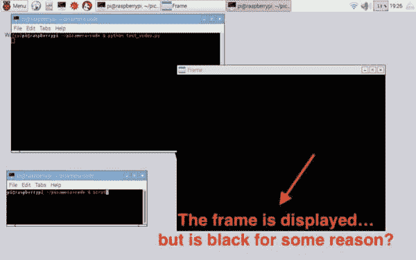
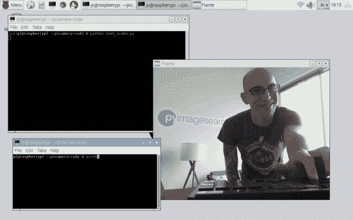

# 使用 Raspberry Pi 相机模块的常见错误

> 原文：<https://pyimagesearch.com/2016/08/29/common-errors-using-the-raspberry-pi-camera-module/>



今天的博文将从我们最近在 PyImageSearch 博客上的深度学习教程趋势中转移一下注意力，而是专注于我最近收到的大量电子邮件中的一个主题— **使用 Raspberry Pi 相机模块时的常见错误。**

我想以提到[达夫·琼斯](https://github.com/waveform80)开始这篇文章，他是 [picamera 库](https://github.com/waveform80/picamera)的维护者和主要贡献者。Dave 是我有幸与之互动的最活跃的开源贡献者之一(他也是一个非常好的人)。

几个月前，我在使用(当时)最新的`picamera==1.11`库，遇到了一些错误。在检查了`picamera` GitHub、[之后，我注意到一个关于我的问题](https://github.com/waveform80/picamera/issues/297)的问题已经被发布了。我确认了这个 bug 的存在，Dave 随后找到了这个 bug——并在当天结束前修复了它，甚至向 PyPI 存储库发布了一个新的更新版本。

不言而喻，如果没有戴夫，树莓派上的计算机视觉和 OpenCV 就不会这么有趣，或者一半容易上手。

在过去的几年里，我在使用 Raspberry Pi 和`picamera`库时遇到了一些“常见”错误。我今天的目标是记录这些错误，这样你就可以很容易地修复它们。

事实上，我今天在这里记录的大多数问题根本不是真正的“错误”——它们只是对`picamera`库如何与您的 Raspberry Pi 设置一起工作的误解。

## 使用 Raspberry Pi 相机模块的常见错误

在我们查看使用 Raspberry Pi 相机模块时的常见错误之前，让我们首先讨论如何简单地*访问*视频流`picamera`。

### 如何访问您的 picamera 视频流

首先，我假设你已经按照 *[中的说明使用 OpenCV 和 Python](https://pyimagesearch.com/2015/03/30/accessing-the-raspberry-pi-camera-with-opencv-and-python/)* 访问了 Raspberry Pi 相机，并在你的 Pi 上安装了`picamera`库。

如果您还没有安装`picamera`，这可以通过使用`pip`来完成:

```
$ pip install "picamera[array]"

```

我们将`[array]`部分添加到命令中，以确保我们可以将帧作为 NumPy 数组读取，从而使模块与 OpenCV 兼容。

在`pip`安装完`picamera`后，您可以使用以下命令检查版本号:

```
$ pip freeze

```

**报道的 picamera 版本应该是*至少是* 1.12。**

#### 关于 Python 虚拟环境的快速说明

如果你是 PyImageSearch 博客的常客，你会知道我经常使用 Python 虚拟环境*——正因为如此，你可能也一样。*

 *在我们继续之前，花点时间看看您是否正在使用 Python 虚拟环境，方法是使用您的`~/.profile`文件并列出您系统上所有可用的虚拟环境:

```
$ source ~/.profile
$ lsvirtualenv

```

如果您得到一个与没有找到`lsvirtualenv`命令相关的错误，那么您是*而不是*在利用 Python 虚拟环境(或者您可能在编辑您的`~/.profile`文件时犯了一个错误)。如果您没有使用 Python 虚拟环境，那么您可以跳过下一段，转到下一小节。

假设您正在使用 Python 虚拟环境，您可以执行`workon`命令来访问您系统上的每个单独的 Python 虚拟环境。在 PyImageSearch 博客上的大多数安装教程中，我们将我们的 Python 虚拟环境命名为`cv`，是“计算机视觉”的缩写:

```
$ workon cv

```

#### 用于访问您的 Raspberry Pi 相机模块的 Python 模板

为了访问`picamera`视频流，我创建了一个简单的、可扩展的模板，我将在下面为你详述。

打开一个新文件，将其命名为`test_video.py`，并插入以下代码:

```
# import the necessary packages
from picamera.array import PiRGBArray
from picamera import PiCamera
import time
import cv2

# initialize the camera and grab a reference to the raw camera capture
camera = PiCamera()
camera.resolution = (640, 480)
camera.framerate = 32
rawCapture = PiRGBArray(camera, size=(640, 480))

# allow the camera to warmup
time.sleep(0.1)

```

**第 2-5 行**处理导入我们需要的 Python 包。

然后我们初始化第 8 行上的`camera`对象，这允许我们访问 Raspberry Pi 相机模块。我们将视频流的分辨率定义为 *640 x 480* ，最大帧率为 32 FPS ( **第 9 行和第 10 行**)。

从那里，我们在第 11 行的**上初始化我们的`PiRGBArray`对象，传入原始的`camera`对象，然后*显式地*重新声明分辨率。这个`PiRGBArray`对象允许我们以 NumPy 格式从 Raspberry Pi 相机模块中读取帧，从而使帧与 OpenCV 兼容。**

最后，我们等待 0.1 秒，让 Raspberry Pi 摄像头传感器预热。

我们的下一个代码块实际处理从我们的 Raspberry Pi 相机传感器捕获帧:

```
# capture frames from the camera
for frame in camera.capture_continuous(rawCapture, format="bgr", use_video_port=True):
	# grab the raw NumPy array representing the image - this array
	# will be 3D, representing the width, height, and # of channels
	image = frame.array

	# show the frame
	cv2.imshow("Frame", image)
	key = cv2.waitKey(1) & 0xFF

	# clear the stream in preparation for the next frame
	rawCapture.truncate(0)

	# if the `q` key was pressed, break from the loop
	if key == ord("q"):
		break

```

在**的第 17 行**，我们开始循环使用`capture_continuous`函数从`camera`捕获的帧。我们向这个方法传递三个参数。

第一个是`rawCapture`，我们想要读取每一帧的格式。然后我们指定`format`为`bgr`，因为 OpenCV 希望图像通道是 BGR 顺序而不是 RGB。最后，`use_video_port`布尔值表示我们正在将流视为视频。

一旦我们有了`frame`，我们就可以通过`.array`属性(**第 20 行**)访问原始的 NumPy 数组。

我们使用 OpenCV GUI 函数在第 23 行**和第 24 行** 将帧显示到屏幕上。

但是在我们继续下一帧之前，我们首先需要通过调用`rawCapture`对象上的`.truncate`方法来准备我们的流。如果你*不*这样做，你的 Python 脚本将抛出一个错误——确切的错误我们将在本指南后面回顾。

最后，如果按下`q`键(**第 30 行和第 31 行**，我们从循环中断开。

要执行`test_video.py`脚本，只需打开终端/命令行提示符并执行以下命令:

```
$ python test_video.py

```

***注意:**如果您正在使用 Python 虚拟环境，您将希望使用`workon`命令切换到安装了 OpenCV + picamera 库的 Python 环境。*

如果一切顺利，您应该会看到 Raspberry Pi 视频流显示在您的提要中:



**Figure 1:** Displaying the Raspberry Pi video stream to our screen.

否则，如果你得到一个错误——继续阅读。下面我详细列出了我遇到的最常见的错误信息。

### 无法连接到您的 picamera 模块？

下面的错误信息看起来熟悉吗？

```
$ python test_video.py 
mmal: mmal_vc_component_create: failed to create component 'vc.ril.camera' (1:ENOMEM)
mmal: mmal_component_create_core: could not create component 'vc.ril.camera' (1)
Traceback (most recent call last):
  File "test_video.py", line 11, in <module>
    camera = PiCamera()
  File "/home/pi/.virtualenvs/cv2/local/lib/python2.7/site-packages/picamera/camera.py", line 488, in __init__
    self.STEREO_MODES[stereo_mode], stereo_decimate)
  File "/home/pi/.virtualenvs/cv2/local/lib/python2.7/site-packages/picamera/camera.py", line 526, in _init_camera
    "Camera is not enabled. Try running 'sudo raspi-config' "
picamera.exc.PiCameraError: Camera is not enabled. Try running 'sudo raspi-config' and ensure that the camera has been enabled.

```

如果你收到这个错误信息，那么你可能忘记了(1)运行`raspi-config`，92)启用摄像机，以及(3)重启你的 Pi。

如果你在运行`raspi-config`后*仍然*得到一个错误信息，那么你的相机可能安装不正确。在这种情况下，我建议观看一下这个安装视频，然后尝试再次安装您的 Raspberry Pi 相机模块(确保首先关闭您的 Pi！)

<https://www.youtube.com/embed/GImeVqHQzsE?feature=oembed>*