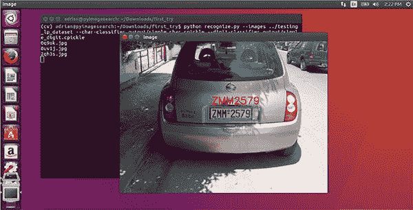
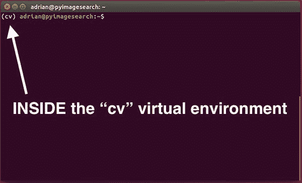
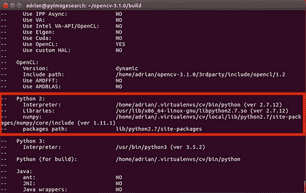
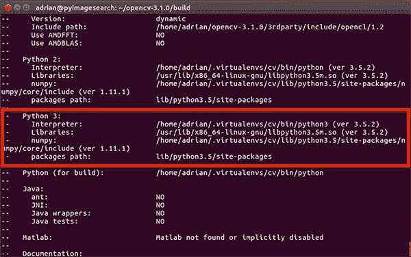
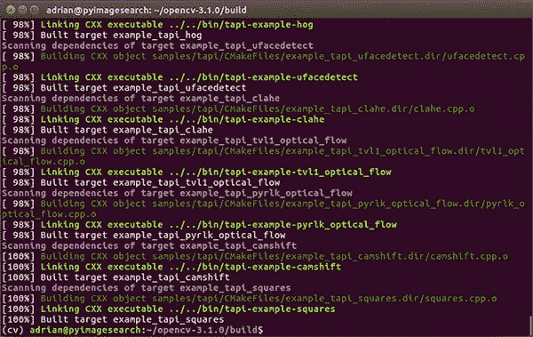
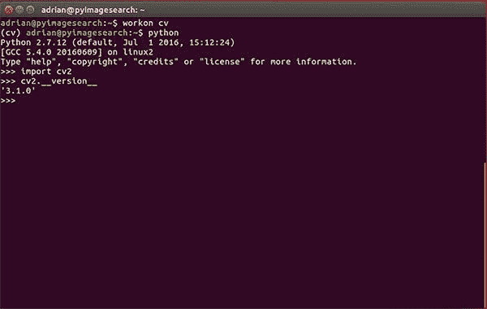

# Ubuntu 16.04:如何安装 OpenCV

> 原文：<https://pyimagesearch.com/2016/10/24/ubuntu-16-04-how-to-install-opencv/>



在过去两年运行 PyImageSearch 博客的过程中，我撰写了两篇教程，详细介绍了在 Ubuntu 上安装 OpenCV(带有 Python 绑定)所需的步骤。您可以在这里找到这两个教程:

*   [在 Ubuntu 14.04 上安装 OpenCV 3.0 和 Python 2.7+](https://pyimagesearch.com/2015/06/22/install-opencv-3-0-and-python-2-7-on-ubuntu/)
*   [在 Ubuntu 14.04 上安装 OpenCV 3.0 和 Python 3.4+](https://pyimagesearch.com/2015/07/20/install-opencv-3-0-and-python-3-4-on-ubuntu/)

然而，随着*对 Ubuntu 14.04 winding down* 的支持和 ***Ubuntu 16.04 被设定为下一个 LTS*** (支持到 2021 年 4 月)，我认为应该创建一个 ***新的、更新的 Ubuntu + OpenCV 安装教程。***

在本教程中，我将*记录*、*演示*、*提供在 Ubuntu 16.04 上使用*Python 2.7 或 Python 3.5 绑定安装 OpenCV 3 的详细步骤*。*

此外，这个文档已经从我之前的 Ubuntu 14.04 教程*完全更新了*，以使用来自`apt-get`库的最新更新包。

要了解如何在 Ubuntu 16.04 系统上安装 OpenCV，请继续阅读。

***注意:**不关心 Python 绑定，只想在你的系统上安装 OpenCV(可能是为了 C++编码)？别担心，这个教程对你仍然有效。遵循说明并执行步骤——到本文结束时，您的系统上已经安装了 OpenCV。从这里开始，忽略 Python 绑定，照常进行。*

## Ubuntu 16.04:如何安装 OpenCV

在我们进入本教程之前，我想提一下 Ubuntu 16.04 实际上已经安装了 Python 2.7 和 Python 3.5。实际版本(截至 2016 年 10 月 24 日)为:

*   Python 2.7.12(在终端中键入`python`时默认使用)。
*   Python 3.5.2(可以通过`python3`命令访问)。

再次重申，Python 2.7 仍然是 Ubuntu 使用的默认 Python 版本。有[计划迁移到 Python 3](https://wiki.ubuntu.com/Python) ，默认使用 Python 3；然而，据我所知，我们离真正成为现实还有很长的路要走。

无论哪种情况，本教程都将支持**Python 2.7 和 Python 3。我强调了需要你做出*决定*的步骤，决定你想使用哪个版本的 Python。确保你与你的决定一致，否则你将不可避免地遇到编译、链接和导入错误。**

 **关于*你应该使用哪一个* Python 版本……*我不想讨论这个问题*。我简单地说，你应该使用你日常使用的任何版本的 Python。请记住，Python 3 代表着未来——但也请记住，一旦您理解了 Python 版本之间的差异，将 Python 2.7 代码移植到 Python 3 也不是一件非常困难的事情。就 OpenCV 而言，OpenCV 3 并不关心您使用的是哪个版本的 Python:绑定将同样工作。

说了这么多，让我们开始在 Ubuntu 16.04 上安装带有 Python 绑定的 OpenCV。

### 步骤 1:在 Ubuntu 16.04 上安装 OpenCV 依赖项

本教程中的大多数(事实上，*所有*)步骤都将通过使用您的终端来完成。首先，打开你的命令行并更新`apt-get`包管理器来刷新和升级预安装的包/库:

```
$ sudo apt-get update
$ sudo apt-get upgrade

```

接下来，让我们安装一些开发人员工具:

```
$ sudo apt-get install build-essential cmake pkg-config

```

`pkg-config`包(很可能)已经安装在您的系统上，但是为了以防万一，请确保将它包含在上面的`apt-get`命令中。`cmake`程序用于自动配置我们的 OpenCV 构建。

OpenCV 是一个图像处理和计算机视觉库。因此，OpenCV 需要能够从磁盘加载 JPEG、PNG、TIFF 等各种图像文件格式。为了从磁盘加载这些图像，OpenCV 实际上调用了其他图像 I/O 库，这些库实际上方便了加载和解码过程。我们在下面安装了必要的组件:

```
$ sudo apt-get install libjpeg8-dev libtiff5-dev libjasper-dev libpng12-dev

```

好了，现在我们有了从磁盘加载图像的库，但是视频呢？使用以下命令安装用于处理视频流和访问摄像机帧的软件包:

```
$ sudo apt-get install libavcodec-dev libavformat-dev libswscale-dev libv4l-dev
$ sudo apt-get install libxvidcore-dev libx264-dev

```

OpenCV 自带了一套非常有限的 GUI 工具。这些 GUI 工具允许我们在屏幕上显示图像(`cv2.imshow`)、等待/记录按键(`cv2.waitKey`)、跟踪鼠标事件(`cv2.setMouseCallback`)，并创建简单的 GUI 元素，如滑块和跟踪条。同样，您不应该期望用 OpenCV 构建成熟的 GUI 应用程序——这些只是允许您调试代码和构建非常简单的应用程序的简单工具。

在内部，处理 OpenCV GUI 操作的模块的名称是`highgui`。`highgui`模块依赖于 GTK 库，您应该使用以下命令安装它:

```
$ sudo apt-get install libgtk-3-dev

```

接下来，我们安装用于优化 OpenCV 内部各种功能的库，例如矩阵运算:

```
$ sudo apt-get install libatlas-base-dev gfortran

```

我们将通过安装 Python 2.7 和 Python 3.5 的 Python 开发头文件和库来结束步骤#1(这样您就可以同时拥有这两个版本):

```
$ sudo apt-get install python2.7-dev python3.5-dev

```

***注意:*** *如果你没有安装 Python 开发头文件和静态库，你会在**步骤#4** 中遇到问题，在那里我们运行`cmake`来配置我们的构建。如果没有安装这些头文件，那么`cmake`命令将无法自动确定 Python 解释器和 Python 库的正确值。简而言之，这一部分的输出看起来是“空的”,您将无法构建 Python 绑定。当您到达**步骤#4** 时，花时间将您的命令输出与我的进行比较。*

### 步骤 2:下载 OpenCV 源代码

在本文发表时，OpenCV 的最新版本是`3.1.0`，我们下载了它的`.zip`，并使用以下命令将其解压缩:

```
$ cd ~
$ wget -O opencv.zip https://github.com/Itseez/opencv/archive/3.1.0.zip
$ unzip opencv.zip

```

当 OpenCV 的新版本发布时，你可以查看官方的 [OpenCV GitHub](https://github.com/opencv/opencv) ，并通过更改`.zip`的版本号下载最新版本。

然而，我们还没有下载完源代码——我们还需要 [opencv_contrib](https://github.com/opencv/opencv_contrib) 库:

```
$ wget -O opencv_contrib.zip https://github.com/Itseez/opencv_contrib/archive/3.1.0.zip
$ unzip opencv_contrib.zip

```

为什么我们还要费心下载 contrib repo 呢？

嗯，我们希望 OpenCV 3 的*完全安装*到[能够访问诸如 SIFT 和 SURF](https://pyimagesearch.com/2015/07/16/where-did-sift-and-surf-go-in-opencv-3/) 之类的特性(没有双关语的意思)。在 OpenCV 2.4 中，SIFT 和 SURF 包含在 OpenCV 的*默认*安装中。然而，随着 OpenCV 3+的发布，这些包已经被转移到 contrib 中，contrib 中包含(1)当前正在开发的模块或者(2)标记为“非自由的”(即专利的)模块。你可以在这篇博文的[中了解更多关于 SIFT/SURF 重组背后的原因。](https://pyimagesearch.com/2015/07/16/where-did-sift-and-surf-go-in-opencv-3/)

***注意:**在复制和粘贴过程中，您可能需要使用“< = >”按钮扩展上述命令。在较小的浏览器窗口中，`3.1.0.zip`中的`.zip`可能会被截断。为了方便起见，我在下面包含了`opencv`档案和`opencv_contrib`档案的完整 URL:*

*   [https://github . com/itseez/opencv/archive/3 . 1 . 0 . zip](https://github.com/Itseez/opencv/archive/3.1.0.zip)T3]
*   [https://github . com/itseez/opencv _ contib/archive/3 . 1 . 0 . zip](https://github.com/Itseez/opencv_contrib/archive/3.1.0.zip)T3]

*我还想提一下，**两个**你的`opencv`和`opencv_contrib`版本应该是一样的(这里是`3.1.0`)。如果版本号不匹配，您很容易遇到编译时错误(或者更糟，几乎无法调试的运行时错误)。*

### 步骤 3:设置您的 Python 环境——Python 2.7 或 Python 3

我们现在准备开始为构建配置我们的 Python 开发环境。第一步是安装`pip`，一个 Python 包管理器:

```
$ cd ~
$ wget https://bootstrap.pypa.io/get-pip.py
$ sudo python get-pip.py

```

我在*我做过的每一个 OpenCV + Python 安装教程*中都提到过这一点，但今天我要在这里再说一遍:我是 [virtualenv](https://virtualenv.pypa.io/en/latest/) 和 [virtualenvwrapper](https://virtualenvwrapper.readthedocs.org/en/latest/) 的*超级粉丝*。**这些 Python 包允许你为你正在进行的*每个*项目创建*独立的* Python 环境。**

简而言之，使用这些包可以让你解决*“项目 X 依赖于 1.x 版本，但项目 Y 需要 4.x* 的困境。使用 Python 虚拟环境的一个奇妙的副作用是，您可以让您的系统保持整洁，没有混乱。

虽然你当然可以在没有 Python 虚拟环境的情况下使用 Python 绑定来安装 OpenCV， ***我强烈推荐你使用它们*** ，因为其他 PyImageSearch 教程利用了 Python 虚拟环境。在本指南的剩余部分，我还假设您已经安装了`virtualenv`和`virtualenvwrapper`。

如果你想要一个完整、详细的解释，为什么 Python 虚拟环境是一个最佳实践，你绝对应该[读一读这篇在 RealPython 上的精彩博文。在本教程的前半部分](https://realpython.com/blog/python/python-virtual-environments-a-primer/)，我也提供了一些关于为什么我个人更喜欢 Python 虚拟环境[的评论。](https://pyimagesearch.com/2016/05/02/accessing-rpi-gpio-and-gpio-zero-with-opencv-python/)

让我再次重申，在 Python 社区中，利用某种虚拟环境是**的标准做法，所以我建议你也这样做:**

 **```
$ sudo pip install virtualenv virtualenvwrapper
$ sudo rm -rf ~/get-pip.py ~/.cache/pip

```

一旦我们安装了`virtualenv`和`virtualenvwrapper`，我们需要更新我们的`~/.bashrc`文件，在文件的*底部*包含以下行:

```
# virtualenv and virtualenvwrapper
export WORKON_HOME=$HOME/.virtualenvs
source /usr/local/bin/virtualenvwrapper.sh

```

`~/.bashrc`文件只是一个 shell 脚本，每当您启动一个新的终端时，Bash 都会运行它。您通常使用该文件来设置各种配置。在本例中，我们设置了一个名为`WORKON_HOME`的环境变量，指向 Python 虚拟环境所在的目录。然后我们从`virtualenvwrapper`加载任何必要的配置。

要更新您的`~/.bashrc`文件，只需使用标准的文本编辑器。我会推荐使用`nano`、`vim`或`emacs`。你也可以使用图形编辑器，但是如果你刚刚开始使用，`nano`可能是最容易操作的。

一个更简单的解决方案是使用`cat`命令，完全避免编辑器:

```
$ echo -e "\n# virtualenv and virtualenvwrapper" >> ~/.bashrc
$ echo "export WORKON_HOME=$HOME/.virtualenvs" >> ~/.bashrc
$ echo "source /usr/local/bin/virtualenvwrapper.sh" >> ~/.bashrc

```

编辑完我们的`~/.bashrc`文件后，我们需要重新加载修改:

```
$ source ~/.bashrc

```

***注意:*** *在`.bashrc`上调用`source`对于我们当前的 shell 会话来说，只需要**一次**。每当我们打开一个新的终端，`.bashrc`的内容就会自动**执行**(包括我们的更新)。*

现在我们已经安装了`virtualenv`和`virtualenvwrapper`，下一步是实际上*创建*Python 虚拟环境——我们使用`mkvirtualenv`命令来完成。

但是在执行这个命令之前，你需要做一个选择:是用 Python 2.7 还是 Python 3？

您选择的结果将决定您在下一节中运行哪个命令。

#### 创建您的 Python 虚拟环境

如果您决定使用 Python 2.7，请使用以下命令创建 Python 2.7 虚拟环境:

```
$ mkvirtualenv cv -p python2

```

否则，使用此命令创建 Python 3 虚拟环境:

```
$ mkvirtualenv cv -p python3

```

无论您决定使用哪个 Python 命令，最终结果都是我们创建了一个名为`cv`(计算机视觉的简称)的 Python 虚拟环境。

您可以随意命名这个虚拟环境(并创建任意数量的 Python 虚拟环境)，但是对于 bing，我建议坚持使用`cv`名称，因为这是我将在本教程的剩余部分中使用的名称。

#### 验证您是否在“cv”虚拟环境中

如果你重启了你的 Ubuntu 系统；注销并重新登录；或者打开一个新的终端，您需要使用`workon`命令来重新访问您的`cv`虚拟环境。下面是一个`workon`命令的例子:

```
$ workon cv

```

要验证您是否在`cv`虚拟环境中，只需检查您的命令行— *如果您在提示前看到文本`(cv)`，那么您**在`cv`虚拟环境中是****:*



**Figure 1:** Make sure you see the *“(cv)”* text on your prompt, indicating that you ***are*** in the *cv* virtual environment.

否则，如果你 ***没有*** 看到`cv`文本，那么你 ***在`cv`虚拟环境中就不是*** :


**Figure 2:** If you do not see the *“(cv)”* text on your prompt, then you ***are not*** in the *cv* virtual environment and need to run the *“workon”* command to resolve this issue.

要访问`cv`虚拟环境，只需使用上面提到的`workon`命令。

#### 将 NumPy 安装到 Python 虚拟环境中

在我们编译 OpenCV 之前的最后一步是安装 [NumPy](http://www.numpy.org/) ，一个用于数值处理的 Python 包。要安装 NumPy，请确保您处于`cv`虚拟环境中(否则 NumPy 将被安装到 Python 的*系统*版本中，而不是`cv`环境中)。从那里执行以下命令:

```
$ pip install numpy

```

### 步骤 4:在 Ubuntu 16.04 上配置和编译 OpenCV

至此，我们所有必要的先决条件都已经安装好了——我们现在可以编译 OpenCV 了！

但是在我们这样做之前，通过检查您的提示(您应该看到它前面的`(cv)`文本)，再次检查您是否在`cv`虚拟环境中，如果不是，使用`workon`命令:

```
$ workon cv

```

确保您在`cv`虚拟环境中之后，我们可以使用 CMake 设置和配置我们的构建:

```
$ cd ~/opencv-3.1.0/
$ mkdir build
$ cd build
$ cmake -D CMAKE_BUILD_TYPE=RELEASE \
    -D CMAKE_INSTALL_PREFIX=/usr/local \
    -D INSTALL_PYTHON_EXAMPLES=ON \
    -D INSTALL_C_EXAMPLES=OFF \
    -D OPENCV_EXTRA_MODULES_PATH=~/opencv_contrib-3.1.0/modules \
    -D PYTHON_EXECUTABLE=~/.virtualenvs/cv/bin/python \
    -D BUILD_EXAMPLES=ON ..

```

上面的命令将目录更改为`~/opencv-3.1.0`，如果您一直在学习本教程，那么这里就是您下载和解压缩`.zip`文件的地方。

***注意:**如果您在本教程的`cmake`或`make`阶段遇到与`stdlib.h: No such file or directory`相关的错误，您还需要在 CMake 中包含以下选项:`-D ENABLE_PRECOMPILED_HEADERS=OFF`。在这种情况下，我建议删除您的`build`目录，重新创建它，然后重新运行包含上述选项的 CMake。这将解决`stdlib.h`错误。感谢 Carter Cherry 和 Marcin 在评论区指出这一点！*

在这个目录中，我们创建一个名为`build`的子目录，并在其中进行更改。`build`目录是实际编译将要发生的地方。

最后，我们执行`cmake`来配置我们的构建。

在我们继续实际编译 OpenCV 之前，请确保检查 CMake 的输出！

为此，向下滚动标题为`Python 2`和`Python 3`的部分。

***如果你正在使用 Python 2.7 支持*** 的 Ubuntu 16.04 上编译 OpenCV，确保`Python 2`部分包含到`Interpreter`、`Libraries`、`numpy`和`packages path`的有效路径。您的输出应该类似于下面的内容:



**Figure 3:** Ensuring that Python 2.7 will be used when compiling OpenCV 3 for Ubuntu 16.04.

检查这个输出，您可以看到:

1.  `Interpreter`指向`cv`虚拟环境中的 Python 2.7 二进制文件。
2.  `Libraries`指向 Python 2.7 库(我们在步骤#1 的最后一步安装了这个库)。
3.  `numpy`值指向我们在`cv`虚拟环境中的 NumPy 安装。
4.  最后，`packages path`指向`lib/python2.7/site-packages`。当与`CMAKE_INSTALL_PREFIX`结合时，这意味着编译 OpenCV 后，我们将在`/usr/local/lib/python2.7/site-packages/`中找到我们的`cv2.so`绑定。

类似地， ***如果你正在用 Python 3 支持*** 编译 OpenCV 16.04，你会想要确保你的`Python 3`部分看起来类似于我的下面:



**Figure 4:** Validating that Python 3 will be used when compiling OpenCV 3 for Ubuntu 16.04.

同样，请注意我的`Interpreter`、`Libraries`、`numpy`和`packages path`是如何被正确设置的。

如果您 ***没有*** 看到这些变量路径中的`cv`虚拟环境， ***几乎可以肯定是因为您在运行 CMake 之前不在`cv`虚拟环境中！***

如果确实如此，只需通过调用`workon cv`访问`cv`虚拟环境，并重新运行上面提到的 CMake 命令。

假设 CMake 命令没有任何错误地退出，现在可以编译 OpenCV:

```
$ make -j4

```

`-j`开关控制编译 OpenCV 时要使用的进程数量——您可能希望将该值设置为您机器上的处理器/内核数量。在我的例子中，我有一个四核处理器，所以我设置了`-j4`。

使用多个进程可以让 OpenCV 编译得更快；然而，有时会遇到竞争条件，编译就会失败。如果没有*以前编译 OpenCV 的大量*经验，你真的无法判断这是不是真的，如果你真的遇到了错误，我的第一个建议是运行`make clean`刷新编译，然后只使用一个内核进行编译:

```
$ make clean
$ make

```

下面你可以找到一个成功的 OpenCV + Python 在 Ubuntu 16.04 上编译的截图:



**Figure 5:** Successfully compiling OpenCV 3 for Ubuntu 16.04.

最后一步是在 Ubuntu 16.04 上实际*安装* OpenCV 3:

```
$ sudo make install
$ sudo ldconfig

```

### 步骤 5:完成 OpenCV 的安装

你已经到了最后阶段，只需要再走几步，你的 Ubuntu 16.04 系统就可以安装 OpenCV 3 了。

#### 对于 Python 2.7:

运行`sudo make install`之后，您的 OpenCV 3 的 Python 2.7 绑定现在应该位于`/usr/local/lib/python-2.7/site-packages/`中。您可以使用`ls`命令来验证这一点:

```
$ ls -l /usr/local/lib/python2.7/site-packages/
total 1972
-rw-r--r-- 1 root staff 2016608 Sep 15 09:11 cv2.so

```

***注意:**在某些情况下，你可能会发现 OpenCV 安装在`/usr/local/lib/python2.7/dist-packages`而不是`/usr/local/lib/python2.7/site-packages`(注意`dist-packages`对`site-packages`)。如果您的`cv2.so`绑定不在`site-packages`目录中，请务必检查`dist-pakages`。*

最后一步是 [sym-link](https://en.wikipedia.org/wiki/Symbolic_link) 我们的 OpenCV `cv2.so`绑定到我们的`cv`Python 2.7 虚拟环境中:

```
$ cd ~/.virtualenvs/cv/lib/python2.7/site-packages/
$ ln -s /usr/local/lib/python2.7/site-packages/cv2.so cv2.so

```

#### 对于 Python 3.5:

运行`sudo make install`后，您的 OpenCV + Python 3 绑定应该位于`/usr/local/lib/python3.5/site-packages/`中。同样，您可以使用`ls`命令来验证这一点:

```
$ ls -l /usr/local/lib/python3.5/site-packages/
total 1972
-rw-r--r-- 1 root staff 2016816 Sep 13 17:24 cv2.cpython-35m-x86_64-linux-gnu.so

```

自从 OpenCV 3 发布以来，我一直对这种行为感到困惑，但是由于某种原因，当用 Python 3 支持编译 OpenCV 时，输出的`cv2.so`文件名是不同的。实际的文件名可能会因人而异，但它应该类似于`cv2.cpython-35m-x86_64-linux-gnu.so`。

同样，我不知道为什么会发生这种情况，但这是一个非常简单的解决方法。我们需要做的就是重命名文件:

```
$ cd /usr/local/lib/python3.5/site-packages/
$ sudo mv cv2.cpython-35m-x86_64-linux-gnu.so cv2.so

```

将`cv2.cpython-35m-x86_64-linux-gnu.so`重命名为简单的`cv2.so`后，我们可以将 OpenCV 绑定符号链接到 Python 3.5 的`cv`虚拟环境中:

```
$ cd ~/.virtualenvs/cv/lib/python3.5/site-packages/
$ ln -s /usr/local/lib/python3.5/site-packages/cv2.so cv2.so

```

### 步骤 6:测试 OpenCV 安装

**恭喜你，你现在已经在你的 Ubuntu 16.04 系统上安装了 OpenCV 3！**

要验证您的安装正在运行，请执行以下操作:

1.  打开一个新的终端。
2.  执行`workon`命令来访问`cv` Python 虚拟环境。
3.  尝试导入 Python + OpenCV 绑定。

我在下面演示了如何执行这些步骤:

```
$ cd ~
$ workon cv
$ python
Python 3.5.2 (default, Jul  5 2016, 12:43:10) 
[GCC 5.4.0 20160609] on linux
Type "help", "copyright", "credits" or "license" for more information.
>>> import cv2
>>> cv2.__version__
'3.1.0'
>>>

```

如您所见，我可以将 OpenCV 绑定导入到 Python 3.5 shell 中。

下面是我利用本教程中概述的相同步骤将 OpenCV 绑定导入 Python 2.7 shell 的截图:



**Figure 6:** Ensuring that I can successfully import my Python + OpenCV bindings on Ubuntu 16.04.

因此，不管你决定使用哪个 Python 版本，只要按照本教程中详细描述的步骤，你就能在你的 Ubuntu 16.04 系统上安装 OpenCV + Python。

一旦安装了 OpenCV，您就可以删除`opencv-3.1.0`和`opencv_contrib-3.1.0`目录(以及它们相关的`.zip`文件):

```
$ cd ~
$ rm -rf opencv-3.1.0 opencv_contrib-3.1.0 opencv.zip opencv_contrib.zip

```

但是，运行这个命令时要小心！在浏览这些目录之前，您需要确保您已经在系统上正确安装了 OpenCV。否则，您将需要重新启动整个编译过程！

## 故障排除和常见问题

在本节中，我将解决一些在 Ubuntu 16.04 上安装 OpenCV 时出现的常见问题。

***Q.*** 当我执行`mkvirtualenv`或`workon`时，我得到一个“命令未找到错误”。

***答:*** 你会得到这个错误信息有三个主要原因，都与**步骤#3:** 有关

1.  首先，确保你已经使用`pip`软件包管理器安装了`virtualenv`和`virtualenvwrapper`。您可以通过运行`pip freeze`，检查输出，并确保在已安装包列表中看到`virtualenv`和`virtualenvwrapper`来验证这一点。
2.  您的`~/.bashrc`文件可能无法正确更新。要对此进行诊断，请使用文本编辑器，如`nano`，并查看您的`~/.bashrc`文件的内容。在文件的底部，您应该看到正确的`export`和`source`命令出现了(再次检查**步骤#3** 中应该附加到`~/.bashrc`的命令)。
3.  编辑完您的`~/.bashrc`文件后，您可能忘记对其进行`source`并重新加载其内容。确保在编辑完源代码`~/.bashrc`后运行它，以确保内容被重新加载——这将使你能够访问`mkvirtualenv`和`workon`命令。

***问*** 每当我打开一个新的终端，注销或者重启我的 Ubuntu 系统，我都无法执行`mkvirtualenv`或者`workon`命令。

***A.*** 见**原因#2** 来自上一题。

***Q.*** 当我(1)打开一个导入 OpenCV 的 Python shell 或者(2)执行一个调用 OpenCV 的 Python 脚本时，我得到一个错误:`Import Error: No module named cv2`。

***A.*** 不幸的是，这个错误消息的确切原因极难诊断，因为有*多种*原因可能导致这种情况发生。一般来说，我推荐以下建议来帮助诊断和解决错误:

1.  使用`workon cv`命令确保您处于`cv`虚拟环境中。如果这个命令给你一个错误，那么请看这个 FAQ 中的第一个问题。
2.  如果在你确保你的`~/.bashrc`文件已经被正确地更新和`source`之后，那么试着在你的`cv`虚拟环境中调查`site-packages`目录的内容。根据您的 Python 版本，您可以在`~/.virtualenvs/cv/lib/python2.7/site-packages/`或`~/.virtualenvs/cv/lib/python3.5/site-packages/`中找到`site-packages`目录。确保(1)这个`site-packages`目录中有一个`cv2.so`文件，以及(2)它正确地用符号链接到一个有效的现有文件。
3.  请务必检查位于`/usr/local/lib/python2.7/site-packages/`和`/usr/local/lib/python3.5/site-packages/`的 Python 系统安装的`site-packages`(甚至`dist-packages`)目录。理想情况下，你应该有一个`cv2.so`文件。
4.  如果所有这些都失败了，检查 OpenCV 构建的`build/lib`目录。那里的*应该是那里的`cv2.so`文件(前提是`cmake`和`make`都执行无误)。如果`cv2.so`文件存在，*手动将其*复制到系统`site-packages`目录以及`cv`虚拟环境的`site-packages`目录中。*

## 摘要

在今天的博文中，我演示了如何在你的 ***Ubuntu 16.04 系统*** 上安装带有 Python 2.7 或 Python 3 绑定的 ***OpenCV 3*** 。

更多其他操作系统上的 OpenCV 安装教程(如 OSX、Raspbian 等。)，[请参考本页](https://pyimagesearch.com/opencv-tutorials-resources-guides/)，我在这里提供了额外的链接和资源。

## *但是在你走之前……*

如果您有兴趣了解更多关于 OpenCV、计算机视觉和图像处理的知识，请务必在下面的表格中输入您的电子邮件地址，以便在新的博客文章发表时收到通知！****