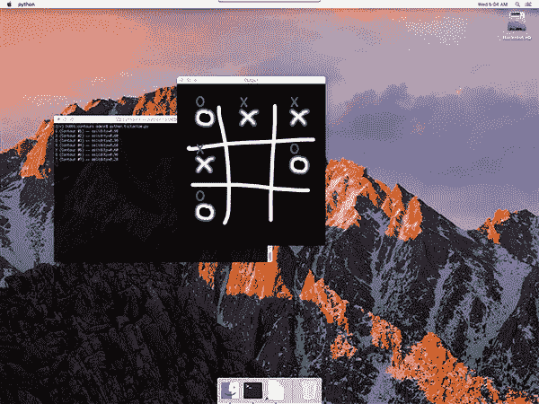
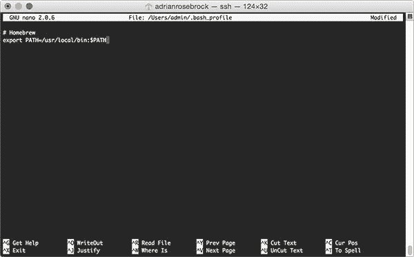
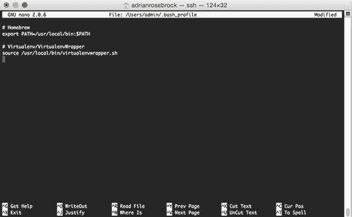
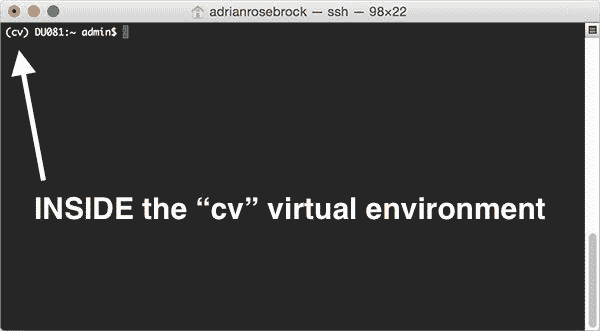
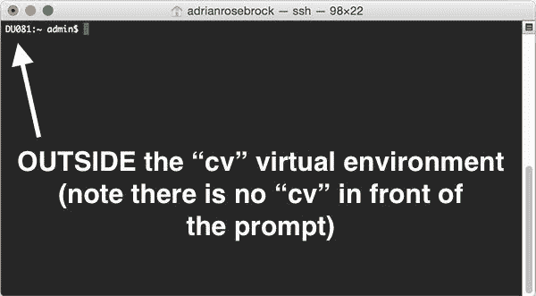
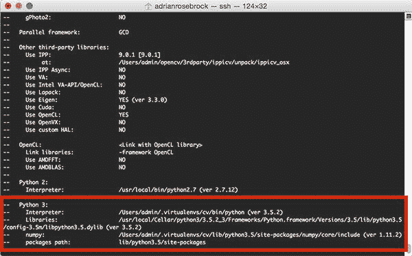
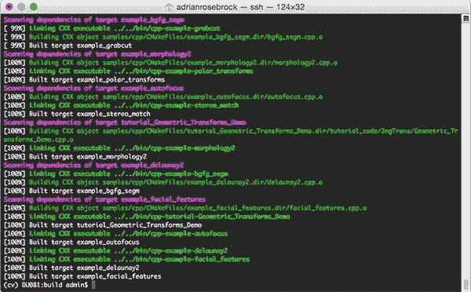
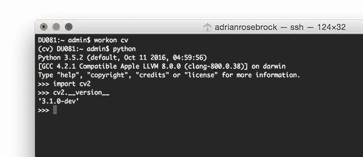

# macOS:安装 OpenCV 3 和 Python 3.5

> 原文：<https://pyimagesearch.com/2016/12/05/macos-install-opencv-3-and-python-3-5/>



上周我报道了如何在 macOS Sierra 和更高版本上安装 OpenCV 3 和 Python 2.7 绑定。

在今天的教程中，我们将学习如何在 macOS 上安装带有 *Python 3.5* 绑定的 **OpenCV 3。**

我决定将这些安装教程分成两个独立的指南，以使它们组织有序，易于理解。

**要了解如何在 macOS 系统上安装 OpenCV 3 和 Python 3.5 绑定，*继续阅读。***

## macOS:安装 OpenCV 3 和 Python 3.5

正如我在这篇文章的介绍中提到的，我上周花了[时间讲述如何在 macOS](https://pyimagesearch.com/2016/11/28/macos-install-opencv-3-and-python-2-7/) 上安装 OpenCV 3 和 Python 2.7 绑定。

上周的教程和今天的教程中的许多步骤非常相似(在某些情况下是相同的)，所以我试图删减每个步骤的一些解释以减少冗余。如果你发现任何步骤令人困惑或麻烦，我建议参考 OpenCV 3 + Python 2.7 教程，在那里我提供了更多的见解。

例外情况是*“第 7 步:在 macOS 上通过 CMake 配置 OpenCV 3 和 Python 3.5”*，其中我提供了一个关于如何配置 OpenCV 版本的 ***非常全面的演练*** 。您应该格外注意这一步,以确保您的 OpenCV 构建已经正确配置。

说了这么多，让我们继续在 macOS 上安装 OpenCV 3 和 Python 3.5 绑定。

### 步骤 1:安装 Xcode

在我们的系统上编译 OpenCV 之前，我们首先需要安装 Xcode，这是苹果公司为 Mac 操作系统提供的一套软件开发工具。

下载 Xcode 最简单的方法是打开桌面上的 *App Store* 应用，在搜索栏中搜索*“Xcode”*，然后点击*“获取”*按钮:


**Figure 1:** Downloading and installing Xcode on macOS.

安装 Xcode 后，你需要打开一个终端，确保你已经[接受了开发者许可](http://apple.stackexchange.com/questions/175069/how-to-accept-xcode-license):

```
$ sudo xcodebuild -license

```

我们还需要安装苹果命令行工具。这些工具包括 GCC、make、clang 等程序和库。您可以使用以下命令来安装 Apple 命令行工具:

```
$ sudo xcode-select --install

```

执行上述命令时，将弹出一个确认窗口，要求您确认安装:


**Figure 2:** Installing the Apple Command Line Tools on macOS.

点击*“安装”*按钮继续。实际安装过程应该不到 5 分钟即可完成。

### 第二步:安装自制软件

下一步是安装 [Homebrew](http://brew.sh/) ，一个 macOS 的包管理器。你可以把家酿看作是 macOS 上基于 Ubuntu/Debian 的 *apt-get* 。

安装 Homebrew 本身超级简单，只需复制并粘贴下面的*整个*命令:

```
$ /usr/bin/ruby -e "$(curl -fsSL https://raw.githubusercontent.com/Homebrew/install/master/install)"

```

一旦安装了 Homebrew，您应该运行以下命令来确保软件包定义是最新的:

```
$ brew update

```

我们现在需要更新我们的`~/.bash_profile`文件(或者创建它，如果它不存在的话)。使用您最喜欢的文本编辑器打开文件(在本例中我使用的是`nano`):

```
$ nano ~/.bash_profile

```

然后将以下几行添加到文件中:

```
# Homebrew
export PATH=/usr/local/bin:$PATH

```

这个`export`命令简单地更新了`PATH`变量，在查询*系统路径*之前，沿着*自制程序路径*寻找二进制文件/库。

我在下面附上了我的`~/.bash_profile`的截图作为参考:



**Figure 3:** Updating my *.bash_profile* file to include Homebrew.

更新`.bash_profile`文件后，保存并退出编辑器，然后使用`source`确保对`.bash_profile`的更改被手动重新加载:

```
$ source ~/.bash_profile

```

该命令只需要执行*一次*。每当你打开一个新的终端，你的`.bash_profile`将会自动为你**`source`。**

 **### 步骤 3:为 Python 3.5 和 macOS 设置自制程序

将 Python 系统作为您的主要解释器来开发被认为是不好的形式。Python 的系统版本应该只服务于一个目的——支持系统例程和操作。还有一个事实是 macOS *没有*自带 Python 3。

相反，你应该安装你自己的 Python 版本，该版本独立于系统安装。使用自制软件，我们可以使用以下命令安装 Python 3:

```
$ brew install python3

```

***注:**确保你没有忘记“python3”中的“3”。以上命令将在您的系统上安装 Python 3.5。然而，如果你去掉“3 ”,你将最终安装 Python 2.7。*

作为健全性检查，重要的是确认你使用的是 Python 3 的*自制版本，而不是 Python 3* 的*系统版本。要做到这一点，只需使用`which`命令:*

```
$ which python3
/usr/local/bin/python3

```

**重要提示:**仔细检查这个输出。如果你看到`/usr/local/bin/python3`，那么你就是正确的*使用*自制版本的 Python* 。然而，如果输出是`/usr/bin/python3`，那么你就是*错误地*使用了*系统版本的 Python* 。*

 *如果您发现自己使用的是 Python 的系统版本，而不是自制版本，您应该:

1.  确保自制软件安装无误。
2.  检查`brew install python3`是否成功完成。
3.  您已经正确更新了您的`~/.bash_profile`，并使用`source`重新加载了更改。这基本上可以归结为确保你的`~/.bash_profile`看起来像我上面图 3 中的**。**

### 步骤 4:安装 Python 虚拟环境和 NumPy

到目前为止，我们已经取得了很大进展。我们已经通过自制程序安装了 Python 3 的非系统版本。然而，我们不能就此止步。让我们安装 [virtualenv](https://virtualenv.pypa.io/en/latest/) 和 [virtualenvwrapper](https://virtualenvwrapper.readthedocs.io/en/latest/) ，这样我们就可以为我们正在进行的每个项目创建*独立的* Python 环境——这被认为是用 Python 编程语言开发软件的最佳实践。

我已经在以前的博客文章中令人作呕地讨论过 Python 虚拟环境*，所以如果你对它们如何工作以及我们为什么使用它们感到好奇，请参考这篇博客文章的[前半部分。我也*强烈推荐*通读](https://pyimagesearch.com/2016/05/02/accessing-rpi-gpio-and-gpio-zero-with-opencv-python/)[RealPython.com 博客](https://realpython.com/blog/python/python-virtual-environments-a-primer/)上的这篇精彩教程，它深入探究了 Python 虚拟环境。*

 *#### 安装 virtualenv 和 virtualenvwrapper

使用`pip`可以轻松安装`virtualenv`和`virtualenvwrapper`:

```
$ pip install virtualenv virtualenvwrapper

```

安装完这些软件包后，我们需要再次更新我们的`~/.bash_profile`:

```
$ nano ~/.bash_profile

```

打开后，将下列行追加到文件中:

```
# Virtualenv/VirtualenvWrapper
source /usr/local/bin/virtualenvwrapper.sh

```

更新后，您的`~/.bash_profile`应该与我的相似:



**Figure 4:** Updating your .bash_profile file to include virtualenv/virtualenvwrapper.

更新您的`.bash_profile`后，保存它，退出，然后再次`source`它:

```
$ source ~/.bash_profile

```

我将重申这个命令只需要执行*一次*。每次你打开一个新的终端窗口，这个文件就会自动为你生成**。**

 **#### 创建您的 Python 3 虚拟环境

我们现在可以使用`mkvirtualenv`命令创建一个名为`cv`的 Python 3 虚拟环境:

```
$ mkvirtualenv cv -p python3

```

`-p python3`开关确保创建 Python 3 虚拟环境，而不是 Python 2.7 虚拟环境。

同样，上面的命令将创建一个名为`cv`的 Python 环境，它独立于系统上所有其他 Python 环境的*。这个环境将有自己的`site-packages`目录，等等。，允许您避免跨项目的任何类型的库版本问题。*

 *`mkvirtualenv`命令只需要执行一次。在创建了之后，要访问`cv` Python 虚拟环境*，只需使用`workon`命令:*

```
$ workon cv

```

要验证您是否在`cv`虚拟环境中，只需检查您的命令行。如果你看到提示前面的文字`(cv)`，那么你就是 ***在`cv`虚拟环境中的*** :



**Figure 5:** Make sure you see the *“(cv)”* text on your prompt, indicating that you ***are*** in the *cv* virtual environment.

否则，如果你 ***没有*** 看到`cv`文本，那么你 ***在`cv`虚拟环境中就不是*** :



**Figure 6:** If you do not see the *“(cv)”* text on your prompt, then you ***are not*** in the *cv* virtual environment and you need to run the *“workon”* command to resolve this issue before continuing.

如果你发现自己处于这种情况，你需要做的就是利用上面提到的`workon`命令。

#### 安装 NumPy

OpenCV 需要的唯一基于 Python 的先决条件是一个科学计算包 [NumPy](http://www.numpy.org/) 。

要将 NumPy 安装到我们的`cv`虚拟环境中，请确保您处于`cv`环境中(否则 NumPy 将被安装到*系统的*版本的 Python 中),然后利用`pip`来处理实际安装:

```
$ pip install numpy

```

### 步骤 5:使用自制软件安装 OpenCV 先决条件

OpenCV 要求在我们编译它之前安装一些先决条件。这些软件包与(1)用于构建和编译的工具，(2)用于图像 I/O 操作的库(即，从磁盘加载各种图像文件格式，如 JPEG、PNG、TIFF 等)相关。)或(3)优化库。

要在 macOS 上安装 OpenCV 的这些必备组件，请执行以下命令:

```
$ brew install cmake pkg-config
$ brew install jpeg libpng libtiff openexr
$ brew install eigen tbb

```

### 步骤 6:从 GitHub 下载 OpenCV 3 源代码

正如我在[上周的教程](https://pyimagesearch.com/2016/11/28/macos-install-opencv-3-and-python-2-7/)中所详述的，macOS 上的 OpenCV 3 需要通过*对 GitHub 的最新提交*来编译，而不是实际的*标记版本*(即 3.0、3.1 等。).这是因为 OpenCV 的当前标记版本没有提供对 QTKit vs. AVFoundation 错误的修复(请参见上周的博客文章以获得对此的详细讨论)。

首先，我们需要下载 [OpenCV GitHub repo](https://github.com/opencv/opencv) :

```
$ cd ~
$ git clone https://github.com/opencv/opencv

```

后面是 [opencv_contrib repo](https://github.com/opencv/opencv_contrib) :

```
$ git clone https://github.com/opencv/opencv_contrib

```

### 步骤 7:在 macOS 上通过 CMake 配置 OpenCV 和 Python 3.5

教程的这一部分是最具挑战性的部分，也是你*最想关注的部分。*

首先，我将演示如何通过创建一个`build`目录来设置您的构建。

然后我提供了一个 CMake 模板，您可以使用它在 macOS 上开始编译 OpenCV 3 和 Python 3.5 绑定。该模板要求您填写两个值:

1.  您的`libpython3.5.dylib`文件的路径。
2.  Python 3.5 的`Python.h`头的路径。

***我会帮你找到并确定这些路径的正确值。***

最后，我提供一个完整的 CMake 命令*作为例子。*请注意，is 命令是*专用于我的机器。*由于指定的路径不同，您的 CMake 命令可能略有不同。请阅读本节的其余部分了解详细信息。

#### 设置构件

为了用 Python 3.5 绑定为 macOS 编译 OpenCV，我们首先需要设置构建。这相当于更改目录并创建一个`build`目录:

```
$ cd ~/opencv
$ mkdir build
$ cd build

```

#### 用于 macOS 的 OpenCV 3 + Python 3.5 CMake 模板

下一部分，我们配置我们的实际构建，变得有点棘手。为了使这个过程更容易，我构建了下面的 ***OpenCV 3 + Python 3.5 CMake 模板:***

```
$ cmake -D CMAKE_BUILD_TYPE=RELEASE \
    -D CMAKE_INSTALL_PREFIX=/usr/local \
    -D OPENCV_EXTRA_MODULES_PATH=~/opencv_contrib/modules \
    -D PYTHON3_LIBRARY=YYY \
    -D PYTHON3_INCLUDE_DIR=ZZZ \
    -D PYTHON3_EXECUTABLE=$VIRTUAL_ENV/bin/python \
    -D BUILD_opencv_python2=OFF \
    -D BUILD_opencv_python3=ON \
    -D INSTALL_PYTHON_EXAMPLES=ON \
    -D INSTALL_C_EXAMPLES=OFF \
    -D BUILD_EXAMPLES=ON ..

```

看着这个模板，我想向你指出几件事:

1.  `BUILD_opencv_python2=OFF`:这个开关表示我们*不想*构建 Python 2.7 绑定。这需要在 CMake 命令中明确声明。当我们实际运行 CMake 时，不这样做可能会导致问题。
2.  `BUILD_opencv_python3=ON`:我们希望 OpenCV 3 + Python 3.5 绑定能够建立起来。此指令向 CMake 表明应该构建 Python 3.5 绑定，而不是 Python 2.7。
3.  `PYTHON3_LIBRARY=YYY`:这是 ***第一个*** 值，需要自己填写。您需要用您的`libpython3.5.dylib`文件的路径替换`YYY`。在下一节中，我将帮助您找到这个值的路径。
4.  `PYTHON3_INCLUDE_DIR=ZZZ`:这是您需要填写的 ***秒*** 值。您需要用到您的`Python.h`头的路径替换`ZZZ`。再说一遍，我会帮你确定这条路。

#### 确定您的 Python 3.5 库和包含目录

我们将从配置您的`PYTHON3_LIBRARY`值开始。这个开关应该指向您的`libpython3.5.dylib`文件。该文件位于`/usr/local/Cellar/python`的多个嵌套子目录中。要找到`libpython3.5.dylib`文件的*确切路径*，只需使用带有通配符的`ls`命令(自动制表符结束也可以):

```
$ ls /usr/local/Cellar/python3/3.*/Frameworks/Python.framework/Versions/3.5/lib/python3.5/config-3.5m/libpython3.5.dylib
/usr/local/Cellar/python3/3.5.2_3/Frameworks/Python.framework/Versions/3.5/lib/python3.5/config-3.5m/libpython3.5.dylib

```

请注意这个命令的输出— ***这是您的`libpython3.5.dylib`文件的完整路径，将替换上面 CMake 模板中的`YYY`。***

让我们继续确定`PYTHON3_INCLUDE_DIR`变量。这个路径应该指向用于生成实际 OpenCV 3 + Python 3.5 绑定的 Python 3.5 的`Python.h`头文件。

同样，我们将使用相同的`ls`和通配符技巧来确定正确的路径:

```
$ ls -d /usr/local/Cellar/python3/3.*/Frameworks/Python.framework/Versions/3.5/include/python3.5m/
/usr/local/Cellar/python3/3.5.2_3/Frameworks/Python.framework/Versions/3.5/include/python3.5m/

```

`ls -d`命令的输出是我们到`Python.h`头的完整路径。 ***该值将替换 CMake 模板中的`ZZZ`。***

#### 填写 CMake 模板

现在我们已经确定了`PYTHON3_LIBRARY`和`PYTHON3_INCLUDE_DIR`的值，我们需要更新 CMake 命令来反映这些路径。

在我的机器上，配置我的 OpenCV 3 + Python 3.5 版本的 *full* CMake 命令如下所示:

```
$ cmake -D CMAKE_BUILD_TYPE=RELEASE \
    -D CMAKE_INSTALL_PREFIX=/usr/local \
    -D OPENCV_EXTRA_MODULES_PATH=~/opencv_contrib/modules \
    -D PYTHON3_LIBRARY=/usr/local/Cellar/python3/3.5.2_3/Frameworks/Python.framework/Versions/3.5/lib/python3.5/config-3.5m/libpython3.5.dylib \
    -D PYTHON3_INCLUDE_DIR=/usr/local/Cellar/python3/3.5.2_3/Frameworks/Python.framework/Versions/3.5/include/python3.5m/ \
    -D PYTHON3_EXECUTABLE=$VIRTUAL_ENV/bin/python \
    -D BUILD_opencv_python2=OFF \
    -D BUILD_opencv_python3=ON \
    -D INSTALL_PYTHON_EXAMPLES=ON \
    -D INSTALL_C_EXAMPLES=OFF \
    -D BUILD_EXAMPLES=ON ..

```

*但是，请不要复制和粘贴我的 CMake 命令*——确保您已经使用了上面的说明来正确地确定您的`PYTHON3_LIBRARY`和`PYTHON3_INCLUDE_DIR`值。

一旦您填写了这些值，执行您的`cmake`命令，您的 OpenCV 3 + Python 3.5 构建将被配置。

例如，看看我的配置中的`Python 3`部分的输出:



**Figure 7:** Ensuring that Python 3.5 will be used when compiling OpenCV 3 for macOS.

特别是，您需要确保:

1.  `Interpreter`指向您的`cv`虚拟环境中的 Python 二进制文件。
2.  `Libraries`指向你的`libpython3.5.dylib`文件。
3.  正在使用的`numpy`版本是您在`cv`虚拟环境中安装的版本。

### 步骤 8:在 macOS 上编译并安装 OpenCV 3

在研究了您的`cmake`命令并确保它没有错误地退出(并且`Python 3`部分被正确配置)之后，您现在可以编译 OpenCV:

```
$ make -j4

```

在这种情况下，我提供了`-j4`来使用我机器上的所有四个内核编译 OpenCV。您可以根据您拥有的处理器/内核数量来调整该值。

OpenCV 可能需要一段时间来编译，大约 30-90 分钟，这取决于您的系统规格。我会考虑在编译的时候出去散散步。

成功的编译将以 100%的完成结束:



**Figure 8:** Successfully compiling OpenCV 3 from source with Python 3.5 bindings on macOS.

假设 OpenCV 编译无误，您现在可以在 macOS 系统上安装它了:

```
$ sudo make install

```

### 步骤 9:重命名并符号化链接你的 OpenCV 3 + Python 3.5 绑定

运行`sudo make install`之后，您的 OpenCV 3 + Python 3.5 绑定应该位于`/usr/local/lib/python3.5/site-packages`中。您可以使用`ls`命令来验证这一点:

```
$ cd /usr/local/lib/python3.5/site-packages/
$ ls -l *.so
-rwxr-xr-x  1 root  admin  3694564 Nov 15 11:28 cv2.cpython-35m-darwin.so

```

自从 OpenCV 3 发布以来，我一直对这种行为感到困惑，但出于某种原因，当编译 OpenCV 并启用 Python 3 支持时，输出`cv2.so`绑定的名称不同。实际的文件名会根据您的系统架构而有所不同，但是它看起来应该类似于`cv2.cpython-35m-darwin.so`。

同样，我不知道为什么会发生这种情况，但这很容易解决。我们需要做的就是将文件重命名为`cv2.so`:

```
$ cd /usr/local/lib/python3.5/site-packages/
$ mv cv2.cpython-35m-darwin.so cv2.so
$ cd ~

```

将`cv2.cpython-35m-darwin.so`重命名为`cv2.so`后，我们需要将 OpenCV 绑定符号链接到 Python 3.5 的`cv`虚拟环境中:

```
$ cd ~/.virtualenvs/cv/lib/python3.5/site-packages/
$ ln -s /usr/local/lib/python3.5/site-packages/cv2.so cv2.so
$ cd ~

```

### 步骤 10:验证你的 OpenCV 3 在 macOS 上的安装

要验证您在 macOS 上安装的 OpenCV 3 + Python 3.5 是否正常工作，您应该:

1.  打开一个新的终端。
2.  执行`workon`命令来访问`cv` Python 虚拟环境。
3.  尝试导入 Python + OpenCV 绑定。

以下是您可以用来测试安装的具体步骤:

```
$ workon cv
$ python
Python 3.5.2 (default, Oct 11 2016, 04:59:56) 
[GCC 4.2.1 Compatible Apple LLVM 8.0.0 (clang-800.0.38)] on darwin
Type "help", "copyright", "credits" or "license" for more information.
>>> import cv2
>>> cv2.__version__
'3.1.0-dev'
>>>

```

***注:**记下`cv2.__version__`中的`-dev`。这表明我们使用的是 OpenCV 的开发版本，而不是带标签的版本。一旦 OpenCV 3.2 发布，这些指令可以被更新，只需下载一个带标签版本的. zip 文件，而不必克隆整个存储库。*

我还在下面附上了一个利用这些相同步骤的截图。如您所见，我可以从 Python 3.5 shell 访问我的 OpenCV 3 绑定:



**Figure 9:** Ensuring that I have successfully installed my OpenCV 3 + Python 3.5 bindings on macOS.

***恭喜你，你已经在 macOS 系统上安装了带 Python 3.5 绑定的 OpenCV！***

## 那么，下一步是什么？

恭喜你。你现在在 macOS 系统上有了一个全新的 OpenCV 安装——我敢肯定你只是渴望利用你的安装来构建一些很棒的计算机视觉应用程序…

…但我也愿意打赌*你刚刚开始学习计算机视觉和 OpenCV* ，可能会对到底从哪里开始感到有点困惑和不知所措。

就我个人而言，我是**以身作则**的忠实粉丝，所以好的第一步是找点乐子，[读读这篇关于在图像/视频中发现猫的博文](https://pyimagesearch.com/2016/06/20/detecting-cats-in-images-with-opencv/)。本教程旨在*非常实用*，演示如何(快速)构建一个 Python + OpenCV 应用程序来检测图像中猫的存在。

如果你真的对提升你的计算机视觉技能感兴趣，你绝对应该看看我的书《实用 Python 和 OpenCV +案例研究》*。我的书不仅*涵盖了计算机视觉和图像处理的基础知识*，还教你如何解决现实世界的计算机视觉问题包括 ***图像和视频流中的人脸检测******视频中的物体跟踪******手写识别*** 。*

[](https://pyimagesearch.com/practical-python-opencv/)

因此，让我们在 macOS 系统上充分利用 OpenCV 3 新安装程序

## 摘要

在本教程中，您学习了如何在 macOS Sierra 上编译和安装 OpenCV 3 和 Python 3.5 绑定。

为此，我们使用 CMake 实用程序手工配置和编译 OpenCV 3。虽然这不完全是最“有趣”的体验，但它*确实*给了我们*对安装的完全和总的控制*。

如果你正在寻找一种更简单的方式将 OpenCV 安装到你的 Mac 系统上，请不要忘记关注下周的博客文章，在这篇文章中，我将演示如何只用自制软件在 macOS 上安装 OpenCV。

为了在这篇博文发布时得到通知，请在下面的表格中输入您的电子邮件地址，我会在教程发布时通知您。*******