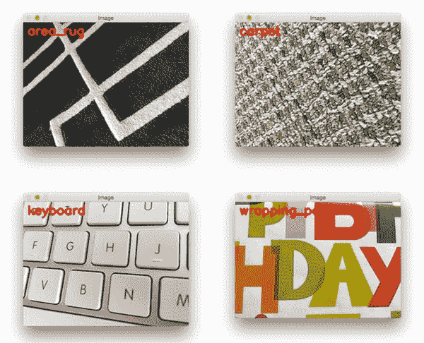
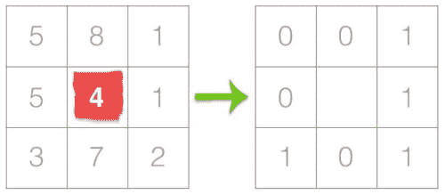
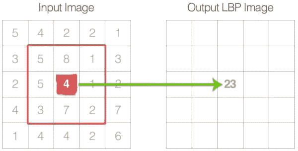
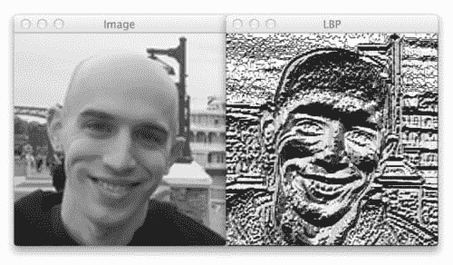
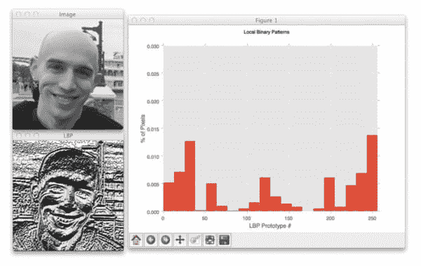
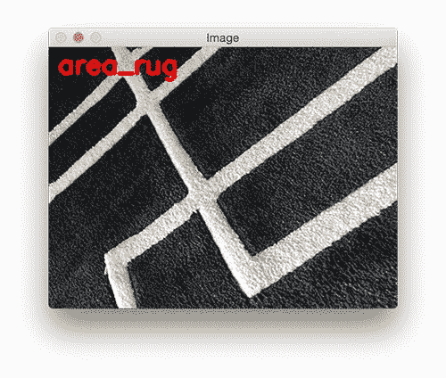
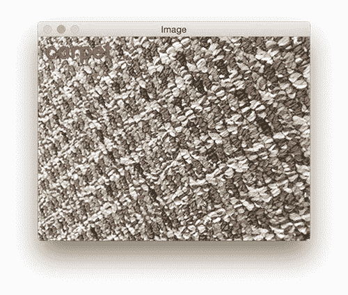
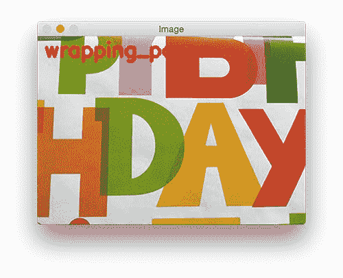

# 使用 Python 和 OpenCV 的本地二进制模式

> 原文：<https://pyimagesearch.com/2015/12/07/local-binary-patterns-with-python-opencv/>

[](https://pyimagesearch.com/wp-content/uploads/2015/12/lbp_results_montage.jpg)

好吧。我就直说了。 ***今天是我 27 岁的生日。***

小时候，我总是对自己的生日感到超级兴奋。离能开车又近了一年。去看 R 级电影。或者买酒。

但现在作为一个成年人，我并不太在乎我的生日——我想这只是对时间流逝的又一个提醒，以及它是如何无法停止的。老实对你说，我想我对在短短几年内进入“大 3-0”有点紧张。

为了重新点燃一些“小孩子的兴奋”，我想用今天的帖子做一些特别的事情。由于今天既是*星期一*(当新的 PyImageSearch 博客帖子发布的时候)又是*我的生日*(这两个事件直到 2020 年才会再次重合)，我决定整理一个关于 ***图像纹理和模式识别的非常棒的教程*** 。

在这篇博文的剩余部分，我将向你展示如何使用[局部二元模式](https://en.wikipedia.org/wiki/Local_binary_patterns)图像描述符(以及一点机器学习)来自动*分类*和*识别图像中的*纹理和模式(例如包装纸、蛋糕糖衣或蜡烛的纹理/模式)。

请继续阅读，了解更多关于局部二进制模式以及它们如何用于纹理分类的信息。

## 图片搜索大师

这篇关于纹理和模式识别的博文大部分是基于 ***[PyImageSearch 大师课程](https://pyimagesearch.com/pyimagesearch-gurus/)*** 里面的局部二进制模式课。

虽然 PyImageSearch 大师们的课程比本教程更详细地介绍了**，但我仍然想让你领略一下 PyImageSearch 大师们——我的*计算机视觉巨著*——为你准备了什么。**

 **如果你喜欢这个教程，有超过 **29 课**跨越 **324 页**涵盖图像描述符(猪，哈拉里克，泽尼克等)。)、关键点检测器(FAST、DoG、GFTT 等。)，以及局部不变描述符(SIFT，SURF，RootSIFT 等)。)，课程里面。

在撰写本文时，PyImageSearch 大师课程还涵盖了额外的 **166 节**课和**1291 页**，包括计算机视觉主题，如*人脸识别*、*深度学习*、*自动车牌识别*和*训练您自己的定制物体检测器*，仅举几例。

**如果您对此感兴趣， *[请务必看一看，并考虑报名参加下一次公开招生！](https://pyimagesearch.com/pyimagesearch-gurus/)***

## 什么是局部二进制模式？

局部二进制模式，或简称为 LBPs，是一种因 Ojala 等人的工作而流行的纹理描述符，他们在 2002 年的论文 *[【多分辨率灰度和具有局部二进制模式的旋转不变纹理分类](http://www.outex.oulu.fi/publications/pami_02_opm.pdf)* (尽管 LBPs 的概念早在 1993 年就被引入)。

与基于[灰度共生矩阵](http://www.mathworks.com/heimg/gray-level-co-occurrence-matrix-glcm.html)计算纹理的*全局表示*的 [Haralick 纹理特征](http://haralick.org/journals/TexturalFeatures.pdf)不同，LBPs 计算纹理的*局部表示*。这种局部表示是通过将每个像素与其周围的相邻像素进行比较而构建的。

构造 LBP 纹理描述符的第一步是将图像转换成灰度。对于灰度图像中的每个像素，我们选择围绕中心像素的大小为 *r* 的邻域。然后为该中心像素计算 LBP 值，并将其存储在与输入图像具有相同宽度和高度的输出 2D 阵列中。

例如，让我们看看原始的 LBP 描述符，它对固定的 *3 x 3* 像素邻域进行操作，就像这样:

[](https://pyimagesearch.com/wp-content/uploads/2015/12/lbp_thresholding.jpg)

**Figure 1:** The first step in constructing a LBP is to take the 8 pixel neighborhood surrounding a center pixel and threshold it to construct a set of 8 binary digits.

在上图中，我们选取中心像素(以红色突出显示)并将其与其邻域的 8 个像素进行阈值比较。如果中心像素的亮度大于或等于其邻居的亮度，那么我们将该值设置为*1*；否则，我们将其设置为 *0* 。有了 8 个周围像素，我们总共有 *2 个^ 8 = 256 个*可能的 LBP 码组合。

从那里，我们需要计算中心像素的 LBP 值。我们可以从任何相邻像素开始，顺时针或逆时针工作，但我们的排序必须保持*一致*用于我们图像中的所有像素和我们数据集中的所有图像。给定一个 *3 x 3* 的邻域，我们就有 8 个邻居需要进行二元测试。二进制测试的结果存储在一个 8 位数组中，然后我们将其转换为十进制，如下所示:

[](https://pyimagesearch.com/wp-content/uploads/2015/12/lbp_calculation.jpg)

**Figure 2:** Taking the 8-bit binary neighborhood of the center pixel and converting it into a decimal representation. (Thanks to Bikramjot of [Hanzra Tech](http://hanzratech.in/) for the inspiration on this visualization!)

在这个例子中，我们从右上角开始，顺时针*地累积二进制字符串。然后，我们可以将这个二进制字符串转换为十进制，得到值 23。*

 *该值存储在输出 LBP 2D 数组中，我们可以如下图所示:

[](https://pyimagesearch.com/wp-content/uploads/2015/12/lbp_to_output.jpg)

**Figure 3:** The calculated LBP value is then stored in an output array with the same width and height as the original image.

然后，对输入图像中的每个像素重复这个阈值处理、累积二进制串以及将输出十进制值存储在 LBP 阵列中的过程。

以下是一个计算和可视化完整 LBP 2D 阵列的示例:

[](https://pyimagesearch.com/wp-content/uploads/2015/12/lbp_2d_array.jpg)

**Figure 4:** An example of computing the LBP representation *(right)* from the original input image *(left)*.

最后一步是计算输出 LBP 阵列的直方图。由于一个 *3 x 3* 邻域具有 *2 ^ 8 = 256* 个可能的模式，因此我们的 LBP 2D 阵列具有 0 的最小值*和 255* 的最大值*，允许我们构建 LBP 代码的 256-bin 直方图作为我们的最终特征向量:*

[](https://pyimagesearch.com/wp-content/uploads/2015/12/lbp_256bin_histogram.jpg)

**Figure 5:** Finally, we can compute a histogram that tabulates the number of times each LBP pattern occurs. We can treat this histogram as our feature vector.

这种原始 LBP 实现的一个主要好处是，我们可以捕获图像中非常细粒度的细节。然而，能够在如此小的尺度下捕捉细节也是算法的*最大缺点——我们无法捕捉不同尺度下的细节，只能捕捉固定的 *3 x 3* 尺度！*

为了解决这个问题，Ojala 等人提出了对原始 LBP 实现的扩展，以处理可变的邻域大小。为了说明可变的邻域大小，引入了两个参数:

1.  要考虑的圆形对称邻域中的点数 *p* (从而消除对方形邻域的依赖)。
2.  圆的半径 *r* ，这允许我们考虑不同的尺度。

以下是这些参数的可视化:

[](https://pyimagesearch.com/wp-content/uploads/2015/12/lbp_num_points_radii.jpg)

**Figure 6:** Three neighborhood examples with varying *p* and *r* used to construct Local Binary Patterns.

最后，重要的是我们要考虑 LBP ***一致性*** 的概念。如果一个 LBP 最多有**两个 *0-1* 或 *1-0* 转换，则认为它是均匀的。例如，模式`00001000` (2 个转变)和`10000000` (1 个转变)都被认为是**统一模式**，因为它们最多包含两个 *0-1* 和 *1-0* 转变。另一方面，图案`01010010`是*而不是*被认为是统一图案，因为它有六个 *0-1* 或 *1-0* 转换。**

 **局部二进制模式中统一原型的数量完全取决于点的数量 *p* 。随着 *p* 值的增加，直方图的维数也会增加。请参考 Ojala 等人的原始论文，以获得关于基于该值导出图案和均匀图案的数量的完整解释。然而，暂时简单地记住，给定 LBP 中的点数 *p* ，存在 *p + 1* **统一模式**。因此，直方图的最终维度是 *p + 2* ，其中添加的条目列出了 ***不一致*** 的所有模式。

那么为什么统一的 LBP 模式如此有趣呢？简而言之:它们增加了额外的*旋转和灰度不变性*，因此它们通常在从图像中提取 LBP 特征向量时使用。

## 使用 Python 和 OpenCV 的本地二进制模式

本地二进制模式实现可以在 [scikit-image](http://scikit-image.org/docs/dev/api/skimage.feature.html#skimage.feature.local_binary_pattern) 和 [mahotas](http://mahotas.readthedocs.org/en/latest/lbp.html) 包中找到。OpenCV 也实现了 LBP，但是严格地说是在人脸识别的环境中——底层的 LBP 提取器不公开用于原始 LBP 直方图计算。

总的来说，我推荐使用 LBP 的 scikit-image 实现，因为它们提供了对您想要生成的 LBP 直方图类型的更多控制。此外，scikit-image 实现还包括改进旋转和灰度不变性的 LBP 的变体。

在我们开始从图像中提取局部二进制模式并使用它们进行分类之前，我们首先需要创建一个纹理数据集。为了形成这个数据集，今天早些时候，我在我的公寓里走了一圈，收集了 20 张不同纹理和图案的照片，包括一张**区域地毯**:

[](https://pyimagesearch.com/wp-content/uploads/2015/12/lbp_area_rug_examples.jpg)

**Figure 7:** Example images of the area rug texture and pattern.

请注意地毯图片是如何进行几何设计的。

我还收集了一些**地毯**的例子:

[](https://pyimagesearch.com/wp-content/uploads/2015/12/lbp_carpet_examples.jpg)

**Figure 8:** Four examples of the carpet texture.

请注意地毯是如何具有粗糙纹理的独特图案的。

然后我拍了几张桌子上的**键盘**的照片:

[](https://pyimagesearch.com/wp-content/uploads/2015/12/lbp_keyboard_examples.jpg)

**Figure 9:** Example images of my keyboard.

请注意，键盘几乎没有纹理，但它确实展示了白色按键和其间银色金属间距的可重复模式。

最后，我收集了最后几个**包装纸**的例子(因为毕竟是我的生日):

[](https://pyimagesearch.com/wp-content/uploads/2015/12/lbp_wrapping_paper_examples.jpg)

**Figure 10:** Our final texture we are going to classify — wrapping paper.

包装纸具有非常光滑的纹理，但也展示了独特的模式。

给定这个由**区域地毯**、**地毯**、**键盘**和**包装纸**组成的数据集，我们的目标是从这些图像中提取局部二进制模式，并应用机器学习对这些纹理图像进行自动识别和分类。

让我们通过为我们的项目定义目录结构来开始演示:

```
$ tree --dirsfirst -L 3
.
├── images
│   ├── testing
│   │   ├── area_rug.png
│   │   ├── carpet.png
│   │   ├── keyboard.png
│   │   └── wrapping_paper.png
│   └── training
│       ├── area_rug [4 entries]
│       ├── carpet [4 entries]
│       ├── keyboard [4 entries]
│       └── wrapping_paper [4 entries]
├── pyimagesearch
│   ├── __init__.py
│   └── localbinarypatterns.py
└── recognize.py

8 directories, 7 files

```

`images/`目录包含我们的`testing/`和`training/`图像。

我们将创建一个`pyimagesearch`模块来组织我们的代码。在`pyimagesearch`模块中，我们将创建`localbinarypatterns.py`，顾名思义，这里将存储我们的本地二进制模式实现。

说到本地二进制模式，现在让我们继续创建描述符类:

```
# import the necessary packages
from skimage import feature
import numpy as np

class LocalBinaryPatterns:
	def __init__(self, numPoints, radius):
		# store the number of points and radius
		self.numPoints = numPoints
		self.radius = radius

	def describe(self, image, eps=1e-7):
		# compute the Local Binary Pattern representation
		# of the image, and then use the LBP representation
		# to build the histogram of patterns
		lbp = feature.local_binary_pattern(image, self.numPoints,
			self.radius, method="uniform")
		(hist, _) = np.histogram(lbp.ravel(),
			bins=np.arange(0, self.numPoints + 3),
			range=(0, self.numPoints + 2))

		# normalize the histogram
		hist = hist.astype("float")
		hist /= (hist.sum() + eps)

		# return the histogram of Local Binary Patterns
		return hist

```

我们从导入 [scikit-image](http://scikit-image.org/) 的`feature`子模块开始，它包含本地二进制模式描述符的实现。

**第 5 行**为我们的`LocalBinaryPatterns`类定义了构造函数。正如上一节提到的，我们知道 LBPs 需要两个参数:围绕中心像素的图案的*半径*，以及沿着外半径的*点数*。我们将把这两个值存储在第 8 行和第 9 行上。

从那里，我们在第 11 行的**上定义我们的`describe`方法，它接受一个必需的参数——我们想要从中提取 LBP 的图像。**

使用我们提供的半径和点数，在**行 15 和 16** 处理实际的 LBP 计算。`uniform`方法表明我们正在计算 LBPs 的旋转和灰度不变形式。

然而，由`local_binary_patterns`函数返回的`lbp`变量不能直接用作特征向量。相反，`lbp`是一个 2D 数组，其宽度和高度与我们的输入图像相同——`lbp`中的每个值的范围从 *[0，numPoints + 2]* ，每个可能的 *numPoints + 1* 可能的旋转不变原型的值(有关更多信息，请参见本文顶部对*均匀模式*的讨论)以及所有*不*均匀模式的额外维度，总共产生*个 numPoints*

因此，为了构建实际的特征向量，我们需要调用`np.histogram`，它计算每个 LBP 原型出现的次数。返回的直方图是 *numPoints + 2* 维的，每个原型的整数计数。然后，我们获取这个直方图并对其进行归一化，使其总和为 *1* ，然后将其返回给调用函数。

既然已经定义了我们的`LocalBinaryPatterns`描述符，让我们看看如何用它来识别纹理和图案。创建一个名为`recognize.py`的新文件，让我们开始编码:

```
# import the necessary packages
from pyimagesearch.localbinarypatterns import LocalBinaryPatterns
from sklearn.svm import LinearSVC
from imutils import paths
import argparse
import cv2
import os

# construct the argument parse and parse the arguments
ap = argparse.ArgumentParser()
ap.add_argument("-t", "--training", required=True,
	help="path to the training images")
ap.add_argument("-e", "--testing", required=True, 
	help="path to the tesitng images")
args = vars(ap.parse_args())

# initialize the local binary patterns descriptor along with
# the data and label lists
desc = LocalBinaryPatterns(24, 8)
data = []
labels = []

```

我们从**的第 2-7 行**开始，导入必要的命令行参数。注意我们是如何从上面定义的`pyimagesearch`子模块导入`LocalBinaryPatterns`描述符的。

从那里，**第 10-15 行**处理解析我们的命令行参数。这里我们只需要两个开关:到`--training`数据的路径和到`--testing`数据的路径。

在本例中，我们将纹理分为两组:每组 4 个图像的训练组(每组 4 个图像=总共 16 个图像)，以及每组 1 个图像的测试组(每组 4 个图像 x 每组 1 个图像= 4 个图像)。16 幅图像的训练集将用于“训练”我们的分类器，然后我们将在 4 幅图像的测试集上评估性能。

在**第 19 行**上，我们使用 *numPoints=24* 和 *radius=8* 初始化我们的`LocalBinaryPattern`描述符。

为了存储 LBP 特征向量和与每个纹理类相关联的标签名称，我们将初始化两个列表:`data`存储特征向量，`labels`存储每个纹理的名称(**第 20 行和第 21 行**)。

现在是时候从我们的训练图像集中提取 LBP 特征了:

```
# loop over the training images
for imagePath in paths.list_images(args["training"]):
	# load the image, convert it to grayscale, and describe it
	image = cv2.imread(imagePath)
	gray = cv2.cvtColor(image, cv2.COLOR_BGR2GRAY)
	hist = desc.describe(gray)

	# extract the label from the image path, then update the
	# label and data lists
	labels.append(imagePath.split(os.path.sep)[-2])
	data.append(hist)

# train a Linear SVM on the data
model = LinearSVC(C=100.0, random_state=42)
model.fit(data, labels)

```

我们开始在**24 号线**循环播放我们的训练图像。对于这些图像中的每一个，我们从磁盘加载它们，将它们转换成灰度，并提取局部二进制模式特征。然后从图像路径中提取标签(即纹理名称),并分别更新我们的`labels`和`data`列表。

一旦我们提取了我们的特征和标签，我们就可以在**第 36 行和第 37 行**上训练我们的[线性支持向量机](https://en.wikipedia.org/wiki/Support_vector_machine#Linear_SVM)来学习各种纹理类别之间的差异。

一旦我们的线性 SVM 被训练，我们可以用它来分类后续的纹理图像:

```
# loop over the testing images
for imagePath in paths.list_images(args["testing"]):
	# load the image, convert it to grayscale, describe it,
	# and classify it
	image = cv2.imread(imagePath)
	gray = cv2.cvtColor(image, cv2.COLOR_BGR2GRAY)
	hist = desc.describe(gray)
	prediction = model.predict(hist.reshape(1, -1))

	# display the image and the prediction
	cv2.putText(image, prediction[0], (10, 30), cv2.FONT_HERSHEY_SIMPLEX,
		1.0, (0, 0, 255), 3)
	cv2.imshow("Image", image)
	cv2.waitKey(0)

```

正如我们在**第 24** 行的*训练图像*上循环以收集数据来训练我们的分类器一样，我们现在在**第 40** 行的*测试图像*上循环以测试我们的分类器的性能和准确性。

同样，我们需要做的只是从磁盘加载我们的图像，将其转换为灰度，从灰度图像中提取局部二进制模式，然后将特征传递到我们的线性 SVM 进行分类(**第 43-46 行**)。

我想提醒您注意 46 号**线上的`hist.reshape(1, -1)`。这将我们的直方图从 1D 阵列重塑为 2D 阵列，从而允许多个特征向量的潜力来运行预测。**

**第 49-52 行**显示了我们屏幕的输出分类。

## 结果

让我们通过执行以下命令来尝试我们的纹理分类系统:

```
$ python recognize.py --training images/training --testing images/testing

```

这是我们分类的第一张输出图像:

[](https://pyimagesearch.com/wp-content/uploads/2015/12/lbp_area_rug_result.jpg)

**Figure 11:** Our Linear SVM + Local Binary Pattern combination is able to correctly classify the area rug pattern.

果然，图像被正确分类为“区域地毯”。

让我们试试另一个:

[](https://pyimagesearch.com/wp-content/uploads/2015/12/lbp_carpet_result.jpg)

**Figure 12:** We are also able to recognize the carpet pattern.

我们的分类器再次正确地识别了图像的纹理/图案。

以下是正确标记键盘模式的示例:

[](https://pyimagesearch.com/wp-content/uploads/2015/12/lbp_keyboard_result.jpg)

**Figure 13:** Classifying the keyboard pattern is also easy for our method.

最后，我们还能够识别包装纸的纹理和图案:

[](https://pyimagesearch.com/wp-content/uploads/2015/12/lbp_wrapping_paper_result.jpg)

**Figure 14:** Using Local Binary Patterns to classify the texture of an image.

虽然这个例子很小很简单，但它仍然能够证明，通过使用局部二进制模式特征和一点机器学习，我们能够正确地对图像的纹理和模式进行分类。

## 摘要

在这篇博文中，我们学习了如何从图像中提取局部二进制模式，并使用它们(以及一点机器学习)来执行 ***纹理和模式识别*** 。

如果你喜欢这篇博文，一定要看一看 ***[PyImageSearch 大师课程](https://pyimagesearch.com/pyimagesearch-gurus/)*** 这一课的大部分内容都是从那里得来的。

在课程中，你会发现超过 **166 节课**涵盖**1291**页的计算机视觉主题，例如:

*   人脸识别。
*   深度学习。
*   自动车牌识别。
*   训练您自己的自定义对象检测器。
*   构建图像搜索引擎。
*   …还有更多！

**如果您对此感兴趣， *[请务必看一看，并考虑报名参加下一次公开招生！](https://pyimagesearch.com/pyimagesearch-gurus/)***

下周见！*****