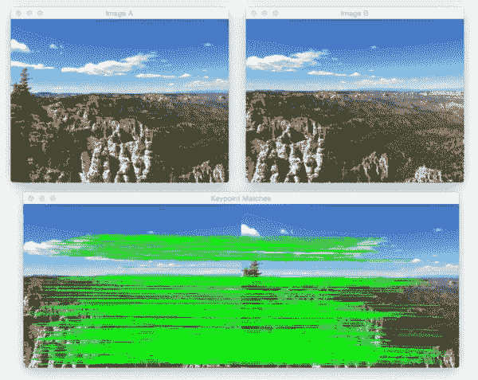
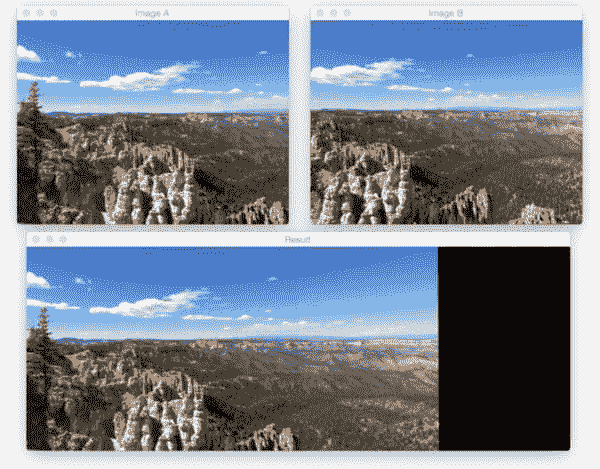
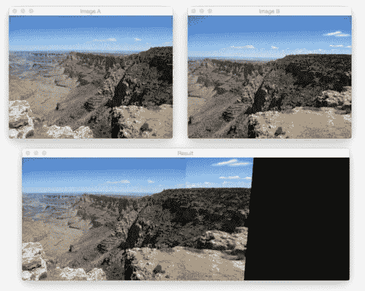
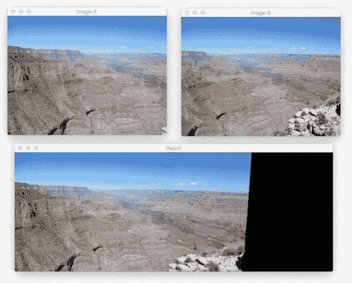
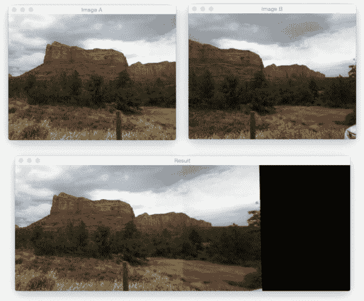

# OpenCV 全景拼接

> 原文：<https://pyimagesearch.com/2016/01/11/opencv-panorama-stitching/>

[](https://pyimagesearch.com/wp-content/uploads/2016/01/bryce_result_02.jpg)

在今天的博文中，我将演示如何使用 Python 和 OpenCV 执行 ***图像拼接和*** 全景构建。给定两幅图像，我们将它们“缝合”在一起，创建一个简单的全景图，如上例所示。

为了构建我们的图像全景，我们将利用计算机视觉和图像处理技术，例如:关键点检测和局部不变描述符；关键点匹配；RANSAC 和透视扭曲。

既然有 [***主要区别*** 如何 OpenCV 2.4.X 和 OpenCV 3。x 处理关键点检测和局部不变描述符](https://pyimagesearch.com/2015/07/16/where-did-sift-and-surf-go-in-opencv-3/)(比如 SIFT 和 SURF)，我已经特别注意提供与 ***和*** 两个版本兼容的代码(当然前提是你编译的 OpenCV 3 有`opencv_contrib`支持)。

在未来的博客文章中，我们将扩展我们的全景拼接代码，以处理多个图像，而不是只有两个。

**继续阅读，了解如何使用 OpenCV 进行全景拼接。**

## OpenCV 全景拼接

我们的全景拼接算法包括四个步骤:

*   **步骤#1:** 检测关键点(狗、哈里斯等。)并提取局部不变描述符(SIFT、SURF 等)。)来自两个输入图像。
*   **步骤#2:** 匹配两幅图像之间的描述符。
*   **步骤#3:** 使用 [RANSAC 算法](https://en.wikipedia.org/wiki/RANSAC)使用我们匹配的特征向量来估计[单应矩阵](https://en.wikipedia.org/wiki/Homography_(computer_vision))。
*   **步骤#4:** 使用从**步骤#3** 获得的单应矩阵应用扭曲变换。

我们将把所有这四个步骤封装在`panorama.py`中，在这里我们将定义一个用于构建全景图的`Stitcher`类。

`Stitcher`类将依赖于 [imutils](https://github.com/jrosebr1/imutils) Python 包，所以如果您的系统上还没有安装它，那么您现在就想安装它:

```
$ pip install imutils

```

让我们开始复习`panorama.py`:

```
# import the necessary packages
import numpy as np
import imutils
import cv2

class Stitcher:
	def __init__(self):
		# determine if we are using OpenCV v3.X
		self.isv3 = imutils.is_cv3(or_better=True)

```

我们从**2-4 号线**开始，导入我们需要的包。我们将使用 NumPy 进行矩阵/数组操作，`imutils`用于一组 OpenCV 便利方法，最后`cv2`用于 OpenCV 绑定。

从那里，我们在第 6 行的**上定义了`Stitcher`类。`Stitcher`的构造函数只是通过调用`is_cv3`方法来检查我们使用的 OpenCV 版本。由于 OpenCV 2.4 和 OpenCV 3 在处理关键点检测和局部不变描述符的方式上有很大的不同，所以确定我们正在使用的 OpenCV 版本是很重要的。**

接下来，让我们开始研究`stitch`方法:

```
	def stitch(self, images, ratio=0.75, reprojThresh=4.0,
		showMatches=False):
		# unpack the images, then detect keypoints and extract
		# local invariant descriptors from them
		(imageB, imageA) = images
		(kpsA, featuresA) = self.detectAndDescribe(imageA)
		(kpsB, featuresB) = self.detectAndDescribe(imageB)

		# match features between the two images
		M = self.matchKeypoints(kpsA, kpsB,
			featuresA, featuresB, ratio, reprojThresh)

		# if the match is None, then there aren't enough matched
		# keypoints to create a panorama
		if M is None:
			return None

```

`stitch`方法只需要一个参数`images`，它是我们将要拼接在一起形成全景图的(两幅)图像的列表。

我们还可以选择提供`ratio`，用于匹配特征时的大卫·劳的比率测试(在本教程后面的比率测试中有更多信息)；`reprojThresh`，这是 RANSAC 算法允许的最大像素“回旋空间”，最后是`showMatches`，一个布尔值，用于指示关键点匹配是否应该可视化。

**第 15 行**解包`images`列表(同样，我们假设它只包含两个图像)。`images`列表的排序很重要:**我们希望图像按照*从左到右*的顺序提供。**如果图像没有按照顺序*或*提供，那么我们的代码仍然会运行——但是我们的输出全景图将只包含一个图像，而不是两个。

一旦我们打开了`images`列表，我们就在**的第 16 行和第 17 行**上调用`detectAndDescribe`方法。该方法简单地从两幅图像中检测关键点并提取局部不变描述符(即 SIFT)。

给定关键点和特征，我们使用`matchKeypoints` ( **第 20 行和第 21 行**)来匹配两幅图像中的特征。我们将在本课稍后定义此方法。

如果返回的匹配`M`是`None`，那么没有足够的关键点被匹配来创建全景，所以我们简单地返回到调用函数(**第 25 和 26 行**)。

否则，我们现在准备应用透视变换:

```
		# otherwise, apply a perspective warp to stitch the images
		# together
		(matches, H, status) = M
		result = cv2.warpPerspective(imageA, H,
			(imageA.shape[1] + imageB.shape[1], imageA.shape[0]))
		result[0:imageB.shape[0], 0:imageB.shape[1]] = imageB

		# check to see if the keypoint matches should be visualized
		if showMatches:
			vis = self.drawMatches(imageA, imageB, kpsA, kpsB, matches,
				status)

			# return a tuple of the stitched image and the
			# visualization
			return (result, vis)

		# return the stitched image
		return result

```

假设`M`不是`None`，我们在**第 30 行**解包元组，给我们一个关键点列表`matches`，从 RANSAC 算法导出的单应矩阵`H`，以及最后的`status`，一个指示`matches`中的哪些关键点使用 RANSAC 被成功空间验证的索引列表。

给定我们的单应矩阵`H`，我们现在准备将两幅图像拼接在一起。首先，我们调用`cv2.warpPerspective`,它需要三个参数:我们想要变形的图像(在本例中，是右侧的*图像)、 *3 x 3* 变换矩阵(`H`)，以及输出图像的最终形状。我们通过对两幅图像的宽度求和，然后使用第二幅图像的高度，从输出图像中导出形状。*

 ***第 30 行**检查我们是否应该可视化关键点匹配，如果是，我们调用`drawMatches`并将全景和可视化的元组返回给调用方法(**第 37-42 行**)。

否则，我们只需返回拼接后的图像( **Line 45** )。

既然已经定义了`stitch`方法，让我们看看它调用的一些助手方法。我们从`detectAndDescribe`开始:

```
	def detectAndDescribe(self, image):
		# convert the image to grayscale
		gray = cv2.cvtColor(image, cv2.COLOR_BGR2GRAY)

		# check to see if we are using OpenCV 3.X
		if self.isv3:
			# detect and extract features from the image
			descriptor = cv2.xfeatures2d.SIFT_create()
			(kps, features) = descriptor.detectAndCompute(image, None)

		# otherwise, we are using OpenCV 2.4.X
		else:
			# detect keypoints in the image
			detector = cv2.FeatureDetector_create("SIFT")
			kps = detector.detect(gray)

			# extract features from the image
			extractor = cv2.DescriptorExtractor_create("SIFT")
			(kps, features) = extractor.compute(gray, kps)

		# convert the keypoints from KeyPoint objects to NumPy
		# arrays
		kps = np.float32([kp.pt for kp in kps])

		# return a tuple of keypoints and features
		return (kps, features)

```

顾名思义，`detectAndDescribe`方法接受一幅图像，然后检测关键点并提取局部不变描述符。在我们的实现中，我们使用高斯(狗)关键点检测器的[差和](http://www.cs.utexas.edu/~grauman/courses/fall2009/papers/local_features_synthesis_draft.pdf) [SIFT 特征提取器](https://en.wikipedia.org/wiki/Scale-invariant_feature_transform)。

在**的第 52 行**我们检查我们是否在使用 OpenCV 3.X。如果是，那么我们使用`cv2.xfeatures2d.SIFT_create`函数来实例化我们的狗关键点检测器和 SIFT 特征提取器。对`detectAndCompute`的调用处理关键点和特征的提取(**行 54 和 55** )。

需要注意的是，你*的**必须**的*已经编译了 OpenCV 3。启用 [opencv_contrib](https://github.com/itseez/opencv_contrib) 支持的 x。如果没有，您将得到一个错误，如`AttributeError: 'module' object has no attribute 'xfeatures2d'`。如果是这样的话，请前往我的 [OpenCV 3 教程页面](https://pyimagesearch.com/opencv-tutorials-resources-guides/)，在那里我详细介绍了如何安装 OpenCV 3 并为各种操作系统和 Python 版本启用`opencv_contrib`支持。

**第 58-65 行**处理如果我们使用 OpenCV 2.4。`cv2.FeatureDetector_create`函数实例化了我们的关键点检测器(DoG)。对`detect`的调用返回我们的关键点集合。

从那里，我们需要使用关键字`SIFT`初始化`cv2.DescriptorExtractor_create`来设置我们的 SIFT 特性`extractor`。调用`extractor`的`compute`方法返回一组特征向量，这些向量量化了图像中每个检测到的关键点周围的区域。

最后，我们的关键点从`KeyPoint`对象转换成一个 NumPy 数组(**第 69 行**)并返回给调用方法(**第 72 行**)。

接下来，让我们看看`matchKeypoints`方法:

```
	def matchKeypoints(self, kpsA, kpsB, featuresA, featuresB,
		ratio, reprojThresh):
		# compute the raw matches and initialize the list of actual
		# matches
		matcher = cv2.DescriptorMatcher_create("BruteForce")
		rawMatches = matcher.knnMatch(featuresA, featuresB, 2)
		matches = []

		# loop over the raw matches
		for m in rawMatches:
			# ensure the distance is within a certain ratio of each
			# other (i.e. Lowe's ratio test)
			if len(m) == 2 and m[0].distance < m[1].distance * ratio:
				matches.append((m[0].trainIdx, m[0].queryIdx))

```

`matchKeypoints`函数需要四个参数:与第一幅图像相关联的关键点和特征向量，随后是与第二幅图像相关联的关键点和特征向量。还提供了 David Lowe 的`ratio`测试变量和 RANSAC 重投影阈值。

将特征匹配在一起实际上是一个相当简单的过程。我们简单地循环两个图像的描述符，计算距离，并找到每对描述符的最小距离。由于这是计算机视觉中非常常见的做法，OpenCV 有一个名为`cv2.DescriptorMatcher_create`的内置函数，为我们构建特征匹配器。`BruteForce`值表示我们将对*进行彻底的*计算来自两幅图像的*所有特征向量*之间的欧几里德距离，并找到具有最小距离的描述符对。

对**行 79** 上的`knnMatch`的调用使用 *k=2* 在两个特征向量集之间执行 [k-NN 匹配](https://en.wikipedia.org/wiki/K-nearest_neighbors_algorithm)(指示返回每个特征向量的前两个匹配)。

我们想要前两个匹配而不仅仅是前一个匹配的原因是因为我们需要应用 David Lowe 的比率测试来进行假阳性匹配修剪。

再次，**第 79 行**计算每对描述符的`rawMatches`——但是有可能这些对是假阳性的，这意味着图像补片实际上不是真正的匹配。为了尝试修剪这些假阳性匹配，我们可以单独循环每个`rawMatches`(**行 83** )并应用劳氏比率测试，该测试用于确定高质量的特征匹配。劳氏比的典型值通常在*【0.7，0.8】*范围内。

一旦我们使用劳氏比率测试获得了`matches`，我们就可以计算两组关键点之间的单应性:

```
		# computing a homography requires at least 4 matches
		if len(matches) > 4:
			# construct the two sets of points
			ptsA = np.float32([kpsA[i] for (_, i) in matches])
			ptsB = np.float32([kpsB[i] for (i, _) in matches])

			# compute the homography between the two sets of points
			(H, status) = cv2.findHomography(ptsA, ptsB, cv2.RANSAC,
				reprojThresh)

			# return the matches along with the homograpy matrix
			# and status of each matched point
			return (matches, H, status)

		# otherwise, no homograpy could be computed
		return None

```

计算两组点之间的单应性最少需要*四个匹配的初始组*。对于更可靠的单应性估计，我们应该具有实质上不止四个匹配点。

最后，我们的`Stitcher`方法中的最后一个方法`drawMatches`用于可视化两幅图像之间的关键点对应关系:

```
	def drawMatches(self, imageA, imageB, kpsA, kpsB, matches, status):
		# initialize the output visualization image
		(hA, wA) = imageA.shape[:2]
		(hB, wB) = imageB.shape[:2]
		vis = np.zeros((max(hA, hB), wA + wB, 3), dtype="uint8")
		vis[0:hA, 0:wA] = imageA
		vis[0:hB, wA:] = imageB

		# loop over the matches
		for ((trainIdx, queryIdx), s) in zip(matches, status):
			# only process the match if the keypoint was successfully
			# matched
			if s == 1:
				# draw the match
				ptA = (int(kpsA[queryIdx][0]), int(kpsA[queryIdx][1]))
				ptB = (int(kpsB[trainIdx][0]) + wA, int(kpsB[trainIdx][1]))
				cv2.line(vis, ptA, ptB, (0, 255, 0), 1)

		# return the visualization
		return vis

```

该方法要求我们传入两幅原始图像、与每幅图像相关联的关键点集、应用 Lowe's ratio 测试后的初始匹配，以及最后由单应性计算提供的`status`列表。使用这些变量，我们可以通过从第一幅图像中的关键点 *N* 到第二幅图像中的关键点 *M* 画一条直线来可视化“内侧”关键点。

现在我们已经定义了我们的`Stitcher`类，让我们继续创建`stitch.py`驱动程序脚本:

```
# import the necessary packages
from pyimagesearch.panorama import Stitcher
import argparse
import imutils
import cv2

# construct the argument parse and parse the arguments
ap = argparse.ArgumentParser()
ap.add_argument("-f", "--first", required=True,
	help="path to the first image")
ap.add_argument("-s", "--second", required=True,
	help="path to the second image")
args = vars(ap.parse_args())

```

我们从在**2-5 号线**进口我们需要的包装开始。注意我们如何将`panorama.py`和`Stitcher`类放入`pyimagesearch`模块中，只是为了保持代码整洁。

***注意:**如果你在阅读这篇文章时遇到了组织代码的困难，请务必使用这篇文章底部的表格下载源代码。的。代码下载的 zip 文件将立即运行，不会出现任何错误。*

从那里，**第 8-14 行**解析我们的命令行参数:`--first`，它是我们全景图中第一个图像的路径(最左边的图像的*)，和`--second`，它是全景图中第二个图像的路径(最右边的*图像的*)。*

**记住，这些图像路径需要按照*从左到右*的顺序提供！**

驱动程序脚本的其余部分简单地处理加载我们的图像，调整它们的大小(以便它们适合我们的屏幕)，以及构建我们的全景:

```
# load the two images and resize them to have a width of 400 pixels
# (for faster processing)
imageA = cv2.imread(args["first"])
imageB = cv2.imread(args["second"])
imageA = imutils.resize(imageA, width=400)
imageB = imutils.resize(imageB, width=400)

# stitch the images together to create a panorama
stitcher = Stitcher()
(result, vis) = stitcher.stitch([imageA, imageB], showMatches=True)

# show the images
cv2.imshow("Image A", imageA)
cv2.imshow("Image B", imageB)
cv2.imshow("Keypoint Matches", vis)
cv2.imshow("Result", result)
cv2.waitKey(0)

```

一旦我们的图像被加载并调整了大小，我们就在**的第 23 行**初始化我们的`Stitcher`类。然后我们调用`stitch`方法，传入我们的两个图像(**，从左到右的顺序)**，并指示我们想要可视化这两个图像之间的关键点匹配。

最后，**行 27-31** 将我们的输出图像显示到我们的屏幕上。

## 全景拼接结果

2014 年年中，我去了趟亚利桑那州和犹他州，去欣赏国家公园。一路上，我在许多地方停留，包括布莱斯峡谷、大峡谷和塞多纳。鉴于这些地区有美丽的风景，我自然拍了一堆照片——其中一些非常适合构建全景。我在今天的博客中包含了这些图像的样本，以演示全景拼接。

说了这么多，让我们试试我们的 OpenCV 全景缝合器。打开终端，发出以下命令:

```
$ python stitch.py --first images/bryce_left_01.png \
	--second images/bryce_right_01.png

```

[](https://pyimagesearch.com/wp-content/uploads/2016/01/bryce_match_01.jpg)

**Figure 1:** *(Top)* The two input images from Bryce canyon (in left-to-right order). *(Bottom)* The matched keypoint correspondences between the two images.

在此图的顶部,我们可以看到两幅输入图像(调整大小以适合我的屏幕，raw。jpg 文件的分辨率要高得多)。在*底部*，我们可以看到两幅图像之间匹配的关键点。

使用这些匹配的关键点，我们可以应用透视变换并获得最终的全景图:

[](https://pyimagesearch.com/wp-content/uploads/2016/01/bryce_result_01.jpg)

**Figure 2:** Constructing a panorama from our two input images.

正如我们所看到的，这两个图像已经成功地拼接在一起！

***注:*** *在许多这样的示例图像上，你会经常看到一条可见的“接缝”贯穿拼接图像的中心。这是因为我用我的 iPhone 或数码相机拍摄了许多照片，自动对焦在*打开**，因此每次拍摄 *的焦点略有不同。当您对每张照片使用相同的焦点时，图像拼接和全景构建效果最佳。我从未打算用这些度假照片进行图像拼接，否则我会小心调整相机传感器。在这两种情况下，只要记住接缝是由于不同的传感器属性在我拍照时，并不是故意的。*

让我们试试另一组图像:

```
$ python stitch.py --first images/bryce_left_02.png \
	--second images/bryce_right_02.png

```

[](https://pyimagesearch.com/wp-content/uploads/2016/01/bryce_result_02.jpg)

**Figure 3:** Another successful application of image stitching with OpenCV.

同样，我们的`Stitcher`类能够从两幅输入图像中构建一幅全景图。

现在，让我们继续前往大峡谷:

```
$ python stitch.py --first images/grand_canyon_left_01.png \
	--second images/grand_canyon_right_01.png

```

[](https://pyimagesearch.com/wp-content/uploads/2016/01/grand_canyon_result_01.jpg)

**Figure 4:** Applying image stitching and panorama construction using OpenCV.

在上面的输入图像中，我们可以看到两幅输入图像之间有很大的重叠。全景图的主要增加部分是在拼接图像的右侧，我们可以看到更多的“突出部分”被添加到输出中。

这是大峡谷的另一个例子:

```
$ python stitch.py --first images/grand_canyon_left_02.png \
	--second images/grand_canyon_right_02.png

```

[](https://pyimagesearch.com/wp-content/uploads/2016/01/grand_canyon_result_02.jpg)

**Figure 5:** Using image stitching to build a panorama using OpenCV and Python.

从这个例子中，我们可以看到大峡谷的*广阔区域已经被添加到全景图中。*

最后，让我们用一个来自亚利桑那州塞多纳的图像拼接示例来结束这篇博文:

```
$ python stitch.py --first images/sedona_left_01.png \
	--second images/sedona_right_01.png

```

[](https://pyimagesearch.com/wp-content/uploads/2016/01/sedona_result_01.jpg)

**Figure 6:** One final example of applying image stitching.

就我个人而言，我发现塞多纳的红岩国家是我去过的最美丽的地区之一。如果你有机会，一定要来，你不会失望的。

现在你有了，使用 Python 和 OpenCV 的图像拼接和全景图构建！

## 摘要

在这篇博文中，我们学习了如何使用 OpenCV 执行图像拼接和全景构建。为*OpenCV 2.4 和 OpenCV 3 的*图像拼接提供了源代码。

我们的图像拼接算法需要四个步骤:(1)检测关键点和提取局部不变描述符；(2)图像间的描述符匹配；(3)应用 RANSAC 估计单应矩阵；以及(4)使用单应矩阵应用扭曲变换。

虽然简单，但在为两幅图像构建全景图时，该算法在实践中效果很好。在未来的博客文章中，我们将回顾如何构建全景图，并为超过两张图像执行图像拼接*。*

无论如何，我希望你喜欢这篇文章！请务必使用下面的表格下载源代码并尝试一下。*