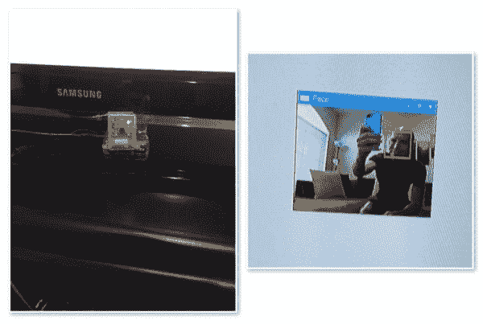
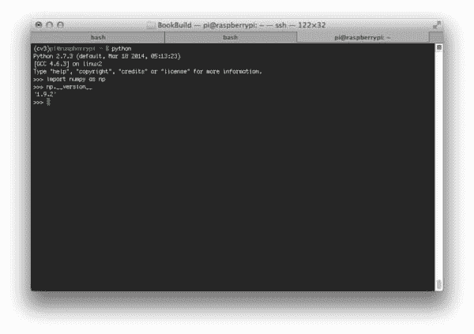
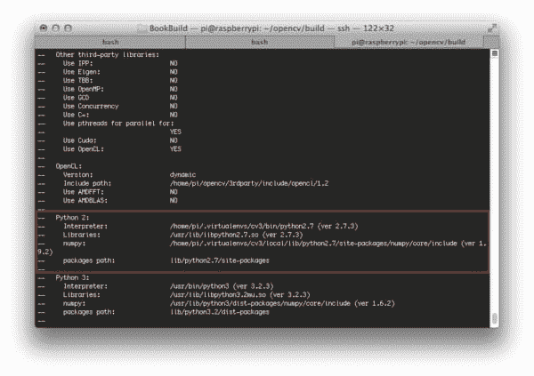
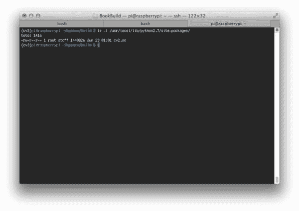
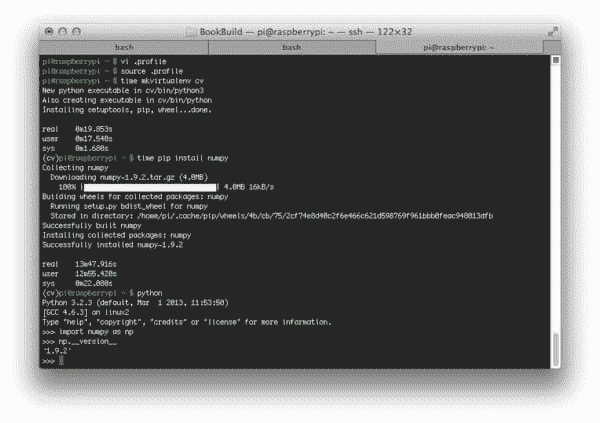
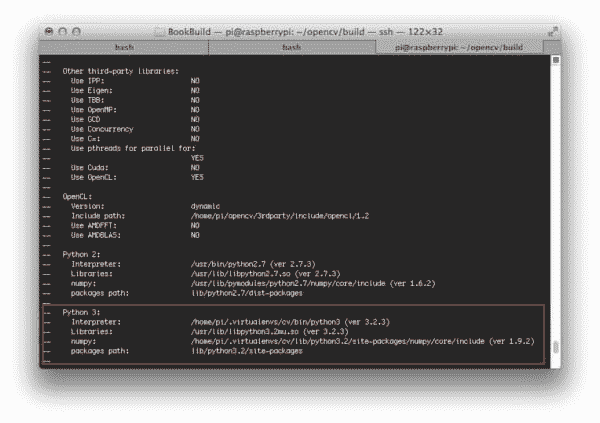
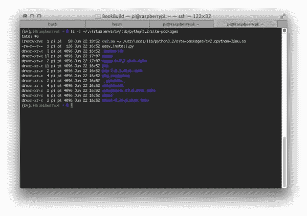

# 在您的 Raspberry Pi 2 上为 Python 2.7 和 Python 3+安装 OpenCV 3.0

> 原文：<https://pyimagesearch.com/2015/07/27/installing-opencv-3-0-for-both-python-2-7-and-python-3-on-your-raspberry-pi-2/>

[](https://pyimagesearch.com/practical-python-opencv/?src=pi-opencv-install)

老实说，我喜欢 Raspberry Pi 用于计算机视觉教学——它可能是向程序员、开发人员和学生展示计算机视觉世界的最佳教学工具之一。

对于业余爱好者和车库黑客来说，这是非常棒的，因为你可以在一个便宜但超级有趣的硬件上学习。这对*的企业和产品*来说太棒了，因为他们可以在价格合理且可靠的硬件上部署计算机视觉算法。树莓派在研究和学术界也很流行。考虑到它的成本损失，我们现在可以使用大量的 Raspberry Pis 来进行大规模的分布式计算机视觉研究项目。

鉴于这些好处和对各种领域的适用性，我的关于在你的 Raspberry Pi 2 和 B+ 上安装 OpenCV 和 Python 的教程*仍然*是 PyImageSearch 博客上最受欢迎的帖子之一也就不足为奇了。

但是今天，这种情况将会改变——因为我认为 ***这篇博文*** 将会超过它的前任，成为 PyImageSearch 博客上最受欢迎的文章。

你看，我们将向前迈出一步，学习如何在你的树莓 Pi 上安装(刚刚发布的) **OpenCV 3.0 库**for***both*****Python 2.7**和 **Python 3+** 。

没错。在本分步指南结束时，你将在你的 Raspberry Pi 2 上安装全新的 OpenCV 3.0 库，以及 **Python 2.7+** 或 **Python 3+** 绑定。这绝对是一个激动人心的教程——到目前为止，OpenCV 只支持 Python 2.7。但是现在有了 OpenCV 3.0 版本，我们终于可以*在我们的项目中利用 Python 3+。*

正如你在 PyImageSearch 博客的其他地方看到的，能够在树莓 Pi 上利用 OpenCV 已经导致了真正伟大的项目，例如使用 Python + OpenCV + Dropbox +树莓 Pi 2:

[](https://pyimagesearch.com/wp-content/uploads/2015/05/pi_home_surveillance_animated.gif)

因此，如果你对构建这样的基于计算机视觉的项目感兴趣，那么请跟我来，我们将很快在你的 Raspberry Pi 2 上安装带有 Python 绑定的 OpenCV 3.0。

# 在您的 Raspberry Pi 2 上安装适用于 Python 2.7+和 Python 3+的 OpenCV 3.0

**更新:**您现在正在阅读的教程涵盖了如何在***Raspbian wheesy***上安装带有 Python 2.7 和 Python 3 绑定的 OpenCV 3。Raspbian Jessie 现在已经取代了 Raspbian Wheezy，如果这是你第一次阅读本教程*，那么你很可能正在使用 Raspbian Jessie。*请使用以下更新的指南来帮助您在您的 Raspberry Pi 上安装 OpenCV + Python。

*   [如何在 ***拉斯边杰西*** 上安装 OpenCV 3.0？](https://pyimagesearch.com/2015/10/26/how-to-install-opencv-3-on-raspbian-jessie/)
*   [安装指南:Raspberry Pi 3+***Raspbian Jessie***+OpenCV 3。](https://pyimagesearch.com/2016/04/18/install-guide-raspberry-pi-3-raspbian-jessie-opencv-3/)

这篇博客文章的其余部分将详细介绍如何在你的 **Raspberry Pi 2** 上为 **Python 2.7** 和 **Python 3+** 安装 OpenCV 3.0。这些安装说明也可以用于 B+，但是我*强烈推荐*使用 Pi 2 运行 OpenCV 应用程序——增加的速度和内存使 Pi 2 更适合计算机视觉。

为了保持本教程的简洁和有条理，我将 OpenCV 3.0 的安装过程分成了四个部分:

*   **第 1 部分:通过安装所需的包和库来配置您的 Raspberry Pi。**不管你使用的是 Python 2.7 还是 Python 3+，我们都需要采取一些步骤来为 OpenCV 3.0 准备我们的 Raspberry Pi——这些步骤主要是调用`apt-get`，然后安装所需的包和库。
*   **第二节:用 Python 2.7+支持编译 OpenCV 3.0。**如果您想在您的 Raspberry Pi 上安装 OpenCV 3.0 和 Python 2.7+绑定，那么这是您想去的地方。完成本部分后，跳过第 3 部分，直接进入第 4 部分。
*   **第三节:用 Python 3+支持编译 OpenCV 3.0。**类似地，如果您想在您的 Pi 2 上安装 OpenCV 3.0 和 Python 3+绑定，那么请完成第 1 部分并直接跳到第 3 部分。
*   第 4 部分:验证您的 OpenCV 3.0 安装。在您的 Raspberry Pi 2 上安装了支持 Python 的 OpenCV 3.0 之后，您会想要确认它是否确实正确安装并按预期运行。本节将向您展示如何验证您的 OpenCV 3.0 安装，并确保它正常工作。

# Python 2.7+还是 Python 3+？

在我们开始之前，花点时间考虑一下您将使用哪个版本的 Python。你准备用 ***Python 2.7 绑定编译 OpenCV 3.0 吗？*** 还是准备编译 OpenCV 3.0 ***Python 3 绑定？***

每个都有优点和缺点，但是选择取决于你自己。如果您经常使用 Python 3 并且对它很熟悉，那么继续使用 Python 3 绑定进行编译。然而，如果你做了大量的科学 Python 开发，你可能想要坚持使用 Python 2.7(至少目前是这样)。虽然像 [NumPy](http://www.numpy.org/) 、 [Scipy](http://www.scipy.org/) 和 [scikit-learn](http://scikit-learn.org/stable/) 这样的软件包确实增加了科学社区中 Python 3+的采用率，但是仍然有许多科学软件包仍然需要 Python 2.7——因此，如果您使用 Python 3，然后意识到您日常使用的许多软件包只支持 Python 2.7，您可以很容易地将自己归类。

如果有疑问，我通常建议科学开发人员使用 Python 2.7，因为它确保了使用更大的科学软件包的能力，并允许您使用遗留代码进行实验。然而，这种情况正在迅速改变——所以继续使用你最熟悉的 Python 版本吧！

# 第 1 部分:通过安装所需的包和库来配置您的 Raspberry Pi

让我们通过更新我们的 Raspberry Pi 来开始这个 OpenCV 3.0 安装教程:

```
$ sudo apt-get update
$ sudo apt-get upgrade
$ sudo rpi-update

```

**计时:** 9m 5s

现在，我们可以安装从源代码构建 OpenCV 所需的开发人员工具:

```
$ sudo apt-get install build-essential git cmake pkg-config

```

**计时:** 43s

以及用于从磁盘加载各种图像格式的安装包:

```
$ sudo apt-get install libjpeg8-dev libtiff4-dev libjasper-dev libpng12-dev

```

**计时:**27 秒

让我们安装一些视频 I/O 包:

```
$ sudo apt-get install libavcodec-dev libavformat-dev libswscale-dev libv4l-dev

```

**计时:**26 秒

安装 GTK，它处理 OpenCV 的 GUI 操作:

```
$ sudo apt-get install libgtk2.0-dev

```

**计时:** 2m 20s

我们还可以通过安装这些包来优化 OpenCV 中的各种功能(如矩阵运算):

```
$ sudo apt-get install libatlas-base-dev gfortran

```

**计时:**46 秒

至此，我们已经安装了所有的先决条件，所以让我们从 GitHub 下载 [OpenCV 库并检查`3.0.0`版本:](https://github.com/Itseez/opencv)

```
$ cd ~
$ git clone https://github.com/Itseez/opencv.git
$ cd opencv
$ git checkout 3.0.0

```

**计时:**8 米 34 秒

**更新(2016 年 1 月 3 日):**你可以用任何当前版本替换`3.0.0`版本(现在是`3.1.0`)。请务必查看 OpenCV.org[的最新发布信息。](http://opencv.org/category/news)

对于 OpenCV 3.0 的完整安装，也要抓取 [opencv_contrib](https://github.com/itseez/opencv_contrib) repo:

```
$ cd ~
$ git clone https://github.com/Itseez/opencv_contrib.git
$ cd opencv_contrib
$ git checkout 3.0.0

```

**计时:**1 分 7 秒

同样，确保你为`opencv_contrib`检查的 ***版本与你为上面的`opencv`检查的*** 版本相同，否则你可能会遇到编译错误。

现在我们正处在一个十字路口，一种*选择你自己(OpenCV)的冒险！*

你可以按照**第 2 节**用 Python 2.7+绑定编译 OpenCV 3.0。或者你可以前往**第 3 节**并安装带有 Python 3+绑定的 OpenCV 3.0。选择权在你——但要明智地选择！一旦你做出了选择，以后改变主意就不那么容易了。

***注:**两个版本的 Python 当然都可以安装 OpenCV 3.0(其实也不是太难)，但不在本教程讨论范围之内；我一定会在以后的文章中介绍这种技术。*

# 第 2 节:用 Python 2.7+支持编译 OpenCV 3.0

安装 Python 2.7 头文件，以便我们可以编译 OpenCV 3.0 绑定:

```
$ sudo apt-get install python2.7-dev

```

**计时:**1 分 20 秒

安装`pip`，兼容 Python 2.7 的 Python 包管理器:

```
$ wget https://bootstrap.pypa.io/get-pip.py
$ sudo python get-pip.py

```

**计时:**33 秒

正如我们在最初的教程中在你的 Raspberry Pi 上安装 OpenCV 2.4.X 一样，我们将利用 [virtualenv](https://virtualenv.pypa.io/en/latest/) 和 [virtualenvwrapper](https://virtualenvwrapper.readthedocs.org/en/latest/) ，它们允许我们为每个 Python 项目创建单独的 Python 环境。在安装 OpenCV 和 Python 绑定时，安装`virtualenv`和`virtualenvwrapper`肯定是*而不是*的需求；然而， ***是标准的 Python 开发实践*** ， ***我强烈推荐*** ，本教程的其余部分将假设您正在使用它们！

安装`virtualenv`和`virtualenvwrapper`就像使用`pip`命令一样简单:

```
$ sudo pip install virtualenv virtualenvwrapper
$ sudo rm -rf ~/.cache/pip

```

**计时:**17 秒

接下来，我们需要更新我们的`~/.profile`文件，方法是在您最喜欢的编辑器中打开它，并在文件的底部添加以下几行。

```
# virtualenv and virtualenvwrapper
export VIRTUALENVWRAPPER_PYTHON=/usr/bin/python2.7
export WORKON_HOME=$HOME/.virtualenvs
source /usr/local/bin/virtualenvwrapper.sh

```

而如果你的`~/.profile`文件不存在， ***创建它*** 。

现在您的`~/.profile`文件已经更新了，您需要重新加载它，以便更改生效。强制重新加载。`profile`，可以:注销，重新登录；关闭您的终端并打开一个新的终端；或者最简单的解决方法是使用`source`命令:

```
$ source ~/.profile

```

是时候创建`cv3`虚拟环境了，我们将在这里进行计算机视觉工作:

```
$ mkvirtualenv cv3

```

**计时:**19 秒

如果您需要访问`cv3`虚拟环境(例如在您注销或重启您的 Pi 后)，只需`source`您的`~/.profile` `file (to ensure it has been loaded) and use the` 工作站 `command:`

```
$ workon cv3
```

您的 shell 将被更新为只使用`cv3`虚拟环境中的包。

接下来，我们需要的唯一 Python 依赖项是 NumPy，所以确保您在`cv3`虚拟环境中并安装 NumPy:

```
$ pip install numpy

```

**计时 13 分 47 秒**

虽然不太可能，但自从我们使用`sudo`命令安装`pip`以来，我已经看到过`.cache`目录给出“权限被拒绝”错误的例子。如果您遇到这种情况，只需删除`.cache/pip`目录并重新安装 NumPy:

```
$ sudo rm -rf ~/.cache/pip/
$ pip install numpy

```

太棒了，我们有进步了！现在，您应该已经在`cv3`虚拟环境中的 Raspberry Pi 上安装了 NumPy，如下所示:

[](https://pyimagesearch.com/wp-content/uploads/2015/06/rpi_py2_numpy.jpg)

**Figure 1:** NumPy has been successfully installed into our virtual environment for Python 2.7+.

***注意:*** *执行所有这些步骤可能会很耗时，所以注销/重启并稍后回来完成安装是完全正常的。**但是，如果您已经注销或重启了您的 Pi** ，那么您**需要**返回到您的`cv3`虚拟环境，然后再继续本指南。否则，OpenCV 3.0 将无法正确编译和安装，并且您可能会遇到导入错误。*

所以我再说一遍，**在你运行任何其他命令**之前，你要确保你是在`cv3`虚拟环境中:

```
$ workon cv3

```

一旦您进入`cv3`虚拟环境，您就可以使用`cmake`来设置构建:

```
$ cd ~/opencv
$ mkdir build
$ cd build
$ cmake -D CMAKE_BUILD_TYPE=RELEASE \
	-D CMAKE_INSTALL_PREFIX=/usr/local \
	-D INSTALL_C_EXAMPLES=ON \
	-D INSTALL_PYTHON_EXAMPLES=ON \
	-D OPENCV_EXTRA_MODULES_PATH=~/opencv_contrib/modules \
	-D BUILD_EXAMPLES=ON ..

```

***更新(2016 年 1 月 3 日):**为了构建 OpenCV `3.1.0`，需要在`cmake`命令中设置`-D INSTALL_C_EXAMPLES=OFF`(而不是`ON`)。OpenCV v3.1.0 CMake 构建脚本中有一个错误，如果您打开此开关，可能会导致错误。一旦您将此开关设置为 off，CMake 应该会顺利运行。*

CMake 将运行大约 30 秒，在它完成后(假设没有错误)，您将需要检查输出，尤其是 **Python 2** 部分:

[](https://pyimagesearch.com/wp-content/uploads/2015/06/rpi_py2_cmake_output.jpg)

**Figure 2:** The output of CMake looks good — OpenCV 3.0 will compile with Python 2.7 bindings using the Python interpreter and NumPy package associated with our virtual environment.

这里的关键是确保 CMake 已经获得了 Python 2.7 解释器和与`cv3`虚拟环境相关联的`numpy`包。

其次，请务必查看 **`packages path`** 配置——这是 OpenCV 3.0 绑定将被编译和存储的目录路径。从上面的输出中，我们可以看到我的 OpenCV 绑定将存储在`/usr/local/lib/python2.7/site-packages`中

现在剩下的就是编译 OpenCV 3.0 了:

```
$ make -j4

```

其中 *4* 对应于我们的 Raspberry Pi 2 上的 4 个内核。

**计时:65 米 33 秒**

假设 OpenCV 已经编译成功，现在您可以将它安装到您的 Raspberry Pi 上:

```
$ sudo make install
$ sudo ldconfig

```

至此，OpenCV 3.0 已经安装在您的 Raspberry Pi 2 上了——只差一步了。

还记得我上面提到的`packages path`吗？

花点时间研究一下这个目录的内容，在我的例子中是`/usr/local/lib/python2.7/site-packages/`:

[](https://pyimagesearch.com/wp-content/uploads/2015/06/rpi_py2_sitepackages.jpg)

**Figure 3:** Our Python 2.7+ bindings for OpenCV 3.0 have been successfully installed on our system. The last step is to sym-link the cv2.so file into our virtual environment.

您应该会看到一个名为`cv2.so`的文件，这是我们实际的 Python 绑定。我们需要采取的最后一步是将`cv2.so`文件符号链接到我们的`cv3`环境的`site-packages`目录中:

```
$ cd ~/.virtualenvs/cv3/lib/python2.7/site-packages/
$ ln -s /usr/local/lib/python2.7/site-packages/cv2.so cv2.so

```

这就是你想要的！您刚刚在您的 Raspberry Pi 上编译并安装了 OpenCV 3.0 和 Python 2.7 绑定！

继续第 4 节以验证您的 OpenCV 3.0 安装是否正常工作。

# 第 3 节:用 Python 3+支持编译 OpenCV 3.0

首先:安装 Python 3 头文件，这样我们就可以编译 OpenCV 3.0 绑定:

```
$ sudo apt-get install python3-dev

```

**计时:**54 秒

安装`pip`，确保它与 Python 3 兼容(注意我执行的是`python3`而不仅仅是`python`):

```
$ wget https://bootstrap.pypa.io/get-pip.py
$ sudo python3 get-pip.py

```

**计时**:28 秒

就像[原创教程中关于在你的树莓 Pi 2](https://pyimagesearch.com/2015/02/23/install-opencv-and-python-on-your-raspberry-pi-2-and-b/) 上安装 OpenCV 2.4.X 一样，我们要利用 [virtualenv](https://virtualenv.pypa.io/en/latest/) 和 [virtualenvwrapper](https://virtualenvwrapper.readthedocs.org/en/latest/) 。同样，这不是在您的系统上安装 OpenCV 3.0 的必要条件，但是我强烈推荐您使用这些包来管理您的 Python 环境。此外，本教程的其余部分将假设您正在使用`virtualenv`和`virtualenvwrapper`。

使用`pip3`命令安装`virtualenv`和`virtualenvwrapper`:

```
$ sudo pip3 install virtualenv virtualenvwrapper

```

**计时:**17 秒

既然`virtualenv`和`virtualenvwrapper`已经安装在我们的系统上，我们需要更新每次启动终端时加载的`~/.profile`文件。在您最喜欢的文本编辑器中打开您的`~/.profile`文件(如果它不存在**创建它**，并添加以下几行:

```
# virtualenv and virtualenvwrapper
export VIRTUALENVWRAPPER_PYTHON=/usr/bin/python3
export WORKON_HOME=$HOME/.virtualenvs
source /usr/local/bin/virtualenvwrapper.sh

```

为了使对我们的`~/.profile`文件的更改生效，您可以(1)注销并重新登录，(2)关闭您当前的终端并打开一个新的终端，或者(3)简单地使用`source`命令:

```
$ source ~/.profile

```

让我们创建我们的`cv`虚拟环境，OpenCV 将在其中编译和访问:

```
$ mkvirtualenv cv

```

**计时:**19 秒

***注意:*** *我把 Python 2.7+和 Python 3+的安装指令聚集在同一个树莓派上，所以我不能对每个安装使用相同的虚拟环境名。在这种情况下，`cv3`虚拟环境指的是我的 Python 2.7 环境，`cv`虚拟环境指的是我的 Python 3+环境。您可以随意命名这些环境，我只是想澄清一下，希望能消除任何困惑。*

这个命令将创建你的`cv`虚拟环境，它*完全独立于*Python 安装系统。如果您需要访问这个虚拟环境，只需使用`workon`命令:

```
$ workon cv

```

你会被丢进你的`cv`虚拟环境。

无论如何，我们需要的唯一 Python 依赖项是 NumPy，所以确保您在`cv`虚拟环境中并安装 NumPy:

```
$ pip install numpy

```

**计时 13 分 47 秒**

如果由于某种原因，你的`.cache`目录给你一个权限被拒绝的错误，只需删除它并重新安装 NumPy，否则你可以跳过这一步:

```
$ sudo rm -rf ~/.cache/pip/
$ pip install numpy

```

此时，您应该有了一个很好的 NumPy 的全新安装，如下所示:

[](https://pyimagesearch.com/wp-content/uploads/2015/06/rpi_py3_numpy.jpg)

**Figure 4:** NumPy has been successfully installed for Python 3+ in the cv virtual environment.

好了，这需要一段时间，但是我们终于准备好在你的 Raspberry Pi 上用 Python 3+绑定编译 OpenCV 3.0 了。

需要注意的是，如果你已经注销了**或者重启了****，那么在编译 OpenCV 3.0 之前，你*需要回到你的`cv`虚拟环境中。如果你不这样做，OpenCV 3.0 将无法正确编译和安装，当你试图导入 OpenCV 并得到可怕的`ImportError: No module named cv2`错误时，你将会感到困惑。***

 ***同样，**在运行本节**中的任何其他命令之前，您需要确保您处于`cv`虚拟环境中:

```
$ workon cv

```

在您进入`cv`虚拟环境后，我们可以设置我们的构建:

```
$ cd ~/opencv
$ mkdir build
$ cd build
$ cmake -D CMAKE_BUILD_TYPE=RELEASE \
	-D CMAKE_INSTALL_PREFIX=/usr/local \
	-D INSTALL_C_EXAMPLES=ON \
	-D INSTALL_PYTHON_EXAMPLES=ON \
	-D OPENCV_EXTRA_MODULES_PATH=~/opencv_contrib/modules \
	-D BUILD_EXAMPLES=ON ..

```

***更新(2016 年 1 月 3 日):**为了构建 OpenCV `3.1.0`，需要在`cmake`命令中设置`-D INSTALL_C_EXAMPLES=OFF`(而不是`ON`)。OpenCV v3.1.0 CMake 构建脚本中有一个错误，如果您打开此开关，可能会导致错误。一旦您将此开关设置为 off，CMake 应该会顺利运行。*

在 CMake 运行之后，花一点时间检查 Make 配置的输出，密切注意 **Python 3** 部分:

[](https://pyimagesearch.com/wp-content/uploads/2015/06/rpi_py3_cmake_ououtput.jpg)

**Figure 5:** Definitely take the time to ensure that CMake has found the correct Python 3+ interpreter before continuing on to compile OpenCV 3.0.

具体来说，您需要确保 CMake 已经获得了您的 Python 3 解释器！

由于我们正在用 **Python 3** 绑定来编译 OpenCV 3.0，我将检查 Python 3 部分并确保我的`Interpreter`和`numpy`路径指向我的`cv`虚拟环境。正如你从上面所看到的，它们确实如此。

另外，**要特别注意`packages path`** 配置——这是到 OpenCV 3.0 绑定将被编译和存储的目录的路径。在运行了`make`命令之后(下面将详细描述)，您将在这个目录中检查您的 OpenCV 3.0 绑定。在这种情况下，我的`packages path`是`lib/python3.2/site-packages`，所以我将检查`/usr/local/lib/python3.2/site-packages`中我编译的输出文件。

现在剩下的就是编译 OpenCV 3.0 了:

```
$ make -j4

```

其中 *4* 对应于我们的 Raspberry Pi 2 上的 4 个内核。使用多个内核将*极大地*加速编译时间，将它从**的 2.8 小时**降低到**的 1 小时多一点！**

**计时:65 米 33 秒**

假设 OpenCV 已经编译成功，现在您可以将它安装到您的 Raspberry Pi 上:

```
$ sudo make install
$ sudo ldconfig

```

**计时:**39 秒

至此 OpenCV 3.0 已经安装在我们的树莓 Pi 上了！

然而，我们还没有完全完成。

还记得我上面提到的`packages path`吗？

让我们列出该目录的内容，看看 OpenCV 绑定是否在其中:

```
$ ls -l /usr/local/lib/python3.2/site-packages
total 1416
-rw-r--r-- 1 root staff 1447637 Jun 22 18:26 cv2.cpython-32mu.so

```

这里我们可以看到有一个名为`cv2.cpython-32mu.so`的文件，这是我们实际的 Python 绑定。

然而，为了在我们的`cv`虚拟环境中使用 OpenCV 3.0，我们首先需要将 OpenCV 二进制文件符号链接到`cv`环境的`site-packages`目录中:

```
$ cd ~/.virtualenvs/cv/lib/python3.2/site-packages/
$ ln -s /usr/local/lib/python3.2/site-packages/cv2.cpython-32mu.so cv2.so

```

因此，现在当您列出与我们的`cv`虚拟环境相关联的`site-packages`目录的内容时，您将看到我们的 OpenCV 3.0 绑定(`cv2.so`文件):

[](https://pyimagesearch.com/wp-content/uploads/2015/06/rpi_py3_sitepackages.jpg)

**Figure 6:** A good validation step to take is to list the contents of the site-packages directory for the cv virtual environment. You should see your cv2.so file sym-linked into the directory.

这就是你想要的！支持 Python 3+的 OpenCV 3.0 现已成功安装在您的系统上！

# 第 4 节:验证您的 OpenCV 3.0 安装

在我们结束本教程之前，让我们确保 OpenCV 绑定已经正确安装。打开一个终端，进入`cv`虚拟环境(或者`cv3`，如果你遵循 Python 2.7+安装步骤)，启动你的 Python shell 导入 OpenCV:

```
$ workon cv
$ python
>>> import cv2
>>> cv2.__version__
'3.0.0'

```

果然，我们可以看到 OpenCV 3.0 和 Python 3+支持已经安装在我的 Raspberry Pi 上:

[](https://pyimagesearch.com/wp-content/uploads/2015/06/rpi_py3_opencv_installed.jpg)

**Figure 7:** Success! OpenCV 3.0 with Python bindings has been successfully installed on our Raspberry Pi 2!

# 摘要

在这篇博客文章中，我详细介绍了如何在您的 Raspberry Pi 2 上安装 OpenCV 3.0 以及 Python 2.7+和 Python 3+绑定。还提供了每个安装步骤的时间，以便您可以相应地计划安装。请记住，如果您在设置了`virtualenv`和`virtualenvwrapper`之后注销或重启您的 Pi，您将需要执行`workon`命令来重新访问您的计算机视觉虚拟环境，然后继续我详述的步骤。如果你不这样做，你很容易发现自己处于可怕的`ImportError: No module named cv2`错误的境地。

随着 Raspberry Pi 和 Raspbian/NOOBS 操作系统的发展，我们的安装说明也将随之发展。如果您遇到任何边缘情况，请随时[让我知道](https://pyimagesearch.com/contact/)，这样我就可以随时更新这些安装说明。

当然，在未来的博客帖子中，我们将使用 OpenCV 3.0 和 Raspberry Pi 做一些真正令人惊叹的项目，所以请考虑在下面的表格中输入您的电子邮件地址，以便在这些帖子发布时得到通知！***