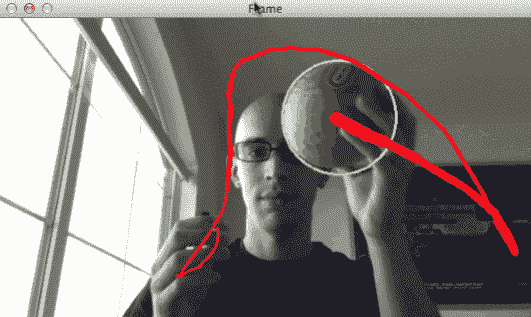

# 用 OpenCV 跟踪球

> 原文：<https://pyimagesearch.com/2015/09/14/ball-tracking-with-opencv/>

今天是 PyImageSearch 上的第 100 篇博文。

**100 个帖子。**很难相信，但这是真的。

当我在 2014 年 1 月开始 PyImageSearch 时，我不知道这个博客会变成什么样。我不知道它会如何进化和成熟。我当然不知道它会变得如此受欢迎。100 篇博文下来，我觉得答案现在已经很明显了，虽然我挣扎着要把它用文字表达出来(讽刺，既然我是作家)直到我看到这条来自 **[@si2w](https://twitter.com/si2w)** 的推文:

我完全同意。我希望 PyImageSearch 的其他读者也能如此。

这是一段不可思议的旅程，我真的要感谢你，PyImageSearch 的读者们。没有你，这个博客真的不可能出现。

也就是说，为了让第 100 篇博文与众不同，我想我会做一些有趣的事情——用 OpenCV 跟踪球:

<https://www.youtube.com/embed/dKpRsdYSCLQ?feature=oembed>