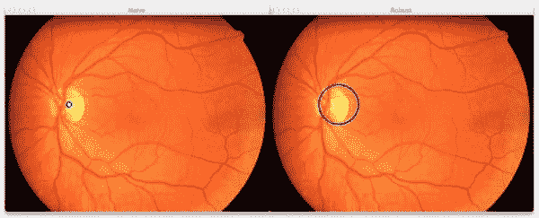

# 使用 Python 和 OpenCV 寻找图像中的亮点

> 原文：<https://pyimagesearch.com/2014/09/29/finding-brightest-spot-image-using-python-opencv/>

[](https://pyimagesearch.com/wp-content/uploads/2014/08/bright-area-retina-noise.jpg)

最初我打算写一篇关于我的[开始使用深度学习指南](https://pyimagesearch.com/2014/09/22/getting-started-deep-learning-python/)的后续文章，但是由于一些不幸的个人事件，我没能完成这篇博文。但是不要担心…我今天仍然有一个非常棒的教程给你！

* * *

烂教程比温啤酒还烂。

你想知道为什么吗？

因为你总能在几秒钟内一口气喝下一杯温啤酒…

但是你可以花 ***小时*** 在阅读误导性的教程时误入歧途。

这是我写这篇文章的灵感——我真的很讨厌我看过的所有详细说明如何使用 OpenCV 找到图像最亮点的博客文章。

你看，他们省略了一行代码,这对于提高抗噪能力至关重要。

如果你和我一样，那就不太好了。

所以请坐好。放松点。并且知道你将会读到一本好的教程。你不会在这里浪费时间。

在这篇博文中，我将向你展示如何使用 Python 和 OpenCV 找到图像中最亮的地方……我还将向你展示一行预处理代码，你将需要这些代码来改善你的结果。

**OpenCV 和 Python 版本:**
这个例子将运行在 **Python 2.7/Python 3.4+** 和 **OpenCV 2.4.X/OpenCV 3.0+** 上。

# 你需要的不仅仅是`cv2.minMaxLoc`

几周前，一位 PyImageSearch 的读者来信询问寻找图像中最亮点的最佳方法。

你看，他们正在处理视网膜图像(见本文顶部的例子)。这些图像通常为橙色或黄色，圆形，包含眼睛的重要物理结构，包括视神经和黄斑。

这位读者想知道找到视神经中心的最佳方法，视神经中心通常是视网膜图像中最亮的地方。

要使用 Python 和 OpenCV 找到图像的最亮点，可以使用`cv2.minMaxLoc`函数。

然而，这里的术语“斑点”有点误导。

根据`cv2.minMaxLoc`图像的“最亮点”实际上不是一个区域——*它只是整个**图像中最亮的单个像素。***

这意味着如果不采取必要的预防措施，`cv2.minMaxLoc`功能极易受到噪音的影响。在正常情况下不会有亮点的区域(在这种情况下，除了视神经中心以外的区域)中的单个亮点可能会极大地影响您的结果。

相反，你最好检查图像的*区域*，而不是单个像素。当你检查区域时，你让平均值平衡了一切——并且你不容易受噪音影响。

那么，在不明确检查图像的每个区域的情况下，如何模仿这种“区域”效果呢？

我带你去看。

这篇博客文章的其余部分致力于向你展示如何使用 Python 和 OpenCV 找到图像的亮点

# 使用 Python 和 OpenCV 寻找图像中的亮点

让我们开始吧。

打开你喜欢的编辑器，创建一个名为`bright.py`的新文件，让我们开始吧。

```
# import the necessary packages
import numpy as np
import argparse
import cv2

# construct the argument parse and parse the arguments
ap = argparse.ArgumentParser()
ap.add_argument("-i", "--image", help = "path to the image file")
ap.add_argument("-r", "--radius", type = int,
	help = "radius of Gaussian blur; must be odd")
args = vars(ap.parse_args())

# load the image and convert it to grayscale
image = cv2.imread(args["image"])
orig = image.copy()
gray = cv2.cvtColor(image, cv2.COLOR_BGR2GRAY)

```

在**2-4 行**我们将导入我们需要的包。如果你是一个普通的 PyImageSearch 读者，这些包现在对你来说应该感觉像旧帽子。我们将使用 NumPy 进行数值处理，`argparse`解析命令行参数，而`cv2`用于 OpenCV 绑定。

从那里，我们将在**的第 7-11 行**解析我们的命令行参数。这里没什么特别的。
第一个开关，`--image`，是我们要寻找的最亮点的图像路径。第二个开关`--radius`，是一个整数，表示我们将要应用于图像的高斯模糊的半径。

需要注意的是，这个半径值必须是*奇数*和**而不是** *偶数。*

接下来，让我们继续在**行 14** 加载图像，在**行 15** 复制它，并在**行 15** 将其转换为灰度。

## 易感方法:

现在，让我们继续应用“可能方法”来检测图像中最亮的点:

```
# perform a naive attempt to find the (x, y) coordinates of
# the area of the image with the largest intensity value
(minVal, maxVal, minLoc, maxLoc) = cv2.minMaxLoc(gray)
cv2.circle(image, maxLoc, 5, (255, 0, 0), 2)

# display the results of the naive attempt
cv2.imshow("Naive", image)

```

找到图像中最亮点的简单方法是使用`cv2.minMaxLoc`函数 ***，无需任何预处理*** 。这个函数需要一个参数，也就是我们的灰度图像。然后，该函数获取我们的灰度图像，并分别找到具有最小和最大亮度值的像素的值和 *(x，y)* 位置。

分解一下:`minVal`包含最小像素亮度值，`maxVal`包含最大像素亮度值，`minLoc`指定 minVal 的 *(x，y)* 坐标，`maxLoc`指定`maxLoc`的 *(x，y)* 坐标。

在这个应用程序中，我们只关心具有最大值的像素，所以我们将抓住它，在第 20 行的**区域周围画一个圆，并在第 24** 行的**上显示它。**

这种方法的最大问题，也是为什么我称之为寻找图像中最亮点的敏感方法，是它的*极易受噪声影响。*

 *一个像素可能会严重影响您的结果…

那么我们如何解决这个问题呢？

简单。

我们将通过预处理步骤应用高斯模糊。

## 稍微稳健一点的方法:

让我们来看看如何做到这一点:

```
# import the necessary packages
import numpy as np
import argparse
import cv2

# construct the argument parse and parse the arguments
ap = argparse.ArgumentParser()
ap.add_argument("-i", "--image", help = "path to the image file")
ap.add_argument("-r", "--radius", type = int,
	help = "radius of Gaussian blur; must be odd")
args = vars(ap.parse_args())

# load the image and convert it to grayscale
image = cv2.imread(args["image"])
orig = image.copy()
gray = cv2.cvtColor(image, cv2.COLOR_BGR2GRAY)

# perform a naive attempt to find the (x, y) coordinates of
# the area of the image with the largest intensity value
(minVal, maxVal, minLoc, maxLoc) = cv2.minMaxLoc(gray)
cv2.circle(image, maxLoc, 5, (255, 0, 0), 2)

# display the results of the naive attempt
cv2.imshow("Naive", image)

# apply a Gaussian blur to the image then find the brightest
# region
gray = cv2.GaussianBlur(gray, (args["radius"], args["radius"]), 0)
(minVal, maxVal, minLoc, maxLoc) = cv2.minMaxLoc(gray)
image = orig.copy()
cv2.circle(image, maxLoc, args["radius"], (255, 0, 0), 2)

# display the results of our newly improved method
cv2.imshow("Robust", image)
cv2.waitKey(0)

```

就像我上面提到的，使用没有任何预处理的`cv2.minMaxLoc`会让你非常容易受到噪声的影响。

相反，最好先对图像应用高斯模糊以消除高频噪声。这样，即使像素值非常大(还是因为噪声)，也会被其邻居平均掉。

在第 28 行上，我们使用命令行参数提供的半径来应用高斯模糊。

然后我们再次调用`cv2.minMaxLoc`来寻找图像中最亮的像素。

然而，由于我们已经应用了模糊预处理步骤，我们已经将所有像素与彼此提供的`radius`一起平均。这样做可以消除高频噪声，使`cv2.minMaxLoc`更不容易受到影响。

通过使用更大的半径，我们将在更大的像素邻域内进行平均——从而模仿图像的更大区域。

通过使用更小的半径，我们可以在更小的区域内进行平均。

确定正确的半径在很大程度上取决于您正在开发的应用程序和您试图解决的任务。

# 结果

启动终端并执行以下命令:

```
$ python bright.py --image retina.png --radius 41

```

如果一切顺利，您应该会看到下图:

[](https://pyimagesearch.com/wp-content/uploads/2014/08/bright-area-retina.jpg)

**Figure 1:** Detecting the brightest area of a retinal image using our naive and robust methods. The results are good and look quite similar.

在左边的*上，我们有使用没有任何预处理的`cv2.minMaxLoc` ***的易受影响的方法，在右边的*上，我们有健壮的方法。*****

 **但是你可能会看着这些图像说，*“嗨，阿德里安，他们都探测到了图像的同一个区域！”*

你说得对。他们做到了。

但是，请注意，当您发出以下命令时，如果我将一个亮点添加到该图像的顶部中间部分，会发生什么情况:

```
$ python bright.py --image images/retina-noise.png --radius 41

```

您的结果应该类似于:

[](https://pyimagesearch.com/wp-content/uploads/2014/08/bright-area-retina-noise.jpg)

**Figure 2:** Adding a single bright pixel to the image has thrown off the results of cv2.minMaxLoc without any pre-processing (*left*), but the robust method is still able to easily find the optic center (*right*).

现在，朴素的`cv2.minMaxLoc`方法找到这个白色像素。先说清楚。该功能工作正常。它实际上是在整个图像中找到一个最亮的像素。

然而，这真的不是我们想要的。

我们感兴趣的是图像中最亮的 ***区域*** ，也就是视神经中心。

幸运的是，通过利用高斯模糊，我们能够对给定半径内的像素邻域进行平均，从而丢弃单个亮像素，并缩小光学中心区域，这没有问题。

显然，让健壮方法正确工作的一个重要方面是正确设置您的`radius`大小。如果您的`radius`尺寸太小，您将无法找到图像中更大、更亮的区域。

但是如果你将`radius`的大小设置得太大，那么你将会检测到太大的区域，错过较小的区域，导致低于标准的结果。

一定要花些时间玩玩`radius`尺寸，看看结果。

# 摘要

在这篇博文中，我向你展示了为什么在找到图像中最亮的点之前应用高斯模糊是至关重要的。

通过应用高斯模糊，可以将给定半径内的像素平均在一起。取平均值可以消除高频噪声，否则这些噪声会干扰`cv2.minMaxLoc`函数的结果。

确保探索高斯模糊半径的适当值。如果你取的值太小，你会减轻平均值的影响，错过更大更亮的区域。但是如果你的半径太大，你就探测不到小的明亮区域。***