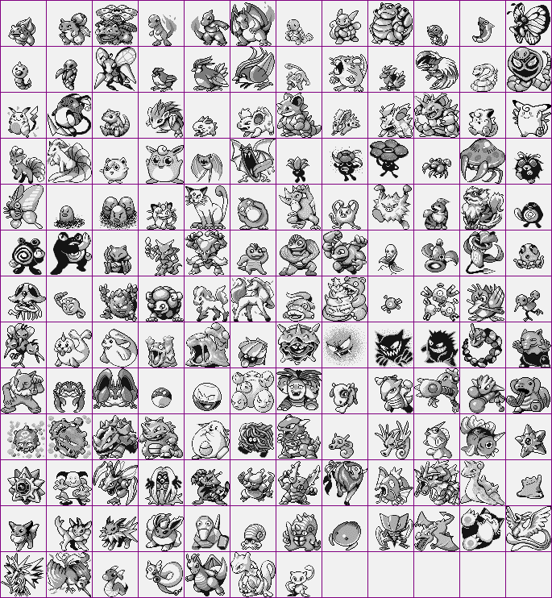
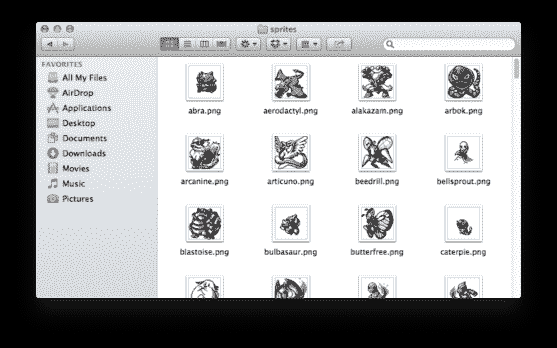

# 用 Python 构建 Pokedex:抓取口袋妖怪精灵(第 2 步，共 6 步)

> 原文：<https://pyimagesearch.com/2014/03/24/building-pokedex-python-scraping-pokemon-sprites-step-2-6/>

[](https://pyimagesearch.com/wp-content/uploads/2014/03/pokemonsprites.png)

**Figure 1:** Our database of Pokemon Red, Blue, and Green sprites.

如果我们能建立一个真实生活的 Pokedex 会怎么样？

你知道，就像小智一样——用你的 Pokedex 指向一只口袋妖怪(或者在这种情况下，给一只口袋妖怪拍照),识别它，并获得它的统计数据。

虽然这个想法源于口袋妖怪电视剧，但我将向你展示如何将它变成现实。

# 以前的帖子:

在我们深入讨论细节之前，这里有一些以前的帖子，你可以查看一下关于构建我们的 Pokedex 的上下文和更多细节:

*   **步骤 1:** [用 Python 构建 Pokedex:入门(第 1 步，共 6 步)](https://pyimagesearch.com/2014/03/10/building-pokedex-python-getting-started-step-1-6/)

# 第二步:抓取我们的口袋妖怪数据库

在开始构建我们的口袋妖怪搜索引擎之前，我们首先需要收集数据。这篇文章正是致力于此——搜集和建立我们的口袋妖怪数据库。我把这篇文章组织成了一个 Python web 抓取教程；当你读完这篇文章的时候，你将会像专业人士一样用 Python 抓取网页。

## 我们的数据来源

我最终决定刮[口袋妖怪 DB](http://pokemondb.net/pokedex/national#gen-1) 因为他们有一些容易获得的最高质量的精灵。他们的 HTML 格式很好，使得下载口袋妖怪精灵图像很容易。

不过我稍微作弊了一下，把网页的相关部分复制粘贴成了明文文件。以下是一些 HTML 的示例:

```
<span class="infocard"><span class="infocard-img"><i class="pki" data-sprite="pkiAll n2"></i></span><span class="infocard-data"><a href="/sprites/ivysaur" class="ent-name">Ivysaur</a></span></span>
<span class="infocard"><span class="infocard-img"><i class="pki" data-sprite="pkiAll n3"></i></span><span class="infocard-data"><a href="/sprites/venusaur" class="ent-name">Venusaur</a></span></span>
<span class="infocard"><span class="infocard-img"><i class="pki" data-sprite="pkiAll n4"></i></span><span class="infocard-data"><a href="/sprites/charmander" class="ent-name">Charmander</a></span></span>
<span class="infocard"><span class="infocard-img"><i class="pki" data-sprite="pkiAll n5"></i></span><span class="infocard-data"><a href="/sprites/charmeleon" class="ent-name">Charmeleon</a></span></span>
<span class="infocard"><span class="infocard-img"><i class="pki" data-sprite="pkiAll n6"></i></span><span class="infocard-data"><a href="/sprites/charizard" class="ent-name">Charizard</a></span></span>
<span class="infocard"><span class="infocard-img"><i class="pki" data-sprite="pkiAll n7"></i></span><span class="infocard-data"><a href="/sprites/squirtle" class="ent-name">Squirtle</a></span></span>
<span class="infocard"><span class="infocard-img"><i class="pki" data-sprite="pkiAll n8"></i></span><span class="infocard-data"><a href="/sprites/wartortle" class="ent-name">Wartortle</a></span></span>
<span class="infocard"><span class="infocard-img"><i class="pki" data-sprite="pkiAll n9"></i></span><span class="infocard-data"><a href="/sprites/blastoise" class="ent-name">Blastoise</a></span></span>
<span class="infocard"><span class="infocard-img"><i class="pki" data-sprite="pkiAll n10"></i></span><span class="infocard-data"><a href="/sprites/caterpie" class="ent-name">Caterpie</a></span></span>
<span class="infocard"><span class="infocard-img"><i class="pki" data-sprite="pkiAll n11"></i></span><span class="infocard-data"><a href="/sprites/metapod" class="ent-name">Metapod</a></span></span>
<span class="infocard"><span class="infocard-img"><i class="pki" data-sprite="pkiAll n12"></i></span><span class="infocard-data"><a href="/sprites/butterfree" class="ent-name">Butterfree</a></span></span>
<span class="infocard"><span class="infocard-img"><i class="pki" data-sprite="pkiAll n13"></i></span><span class="infocard-data"><a href="/sprites/weedle" class="ent-name">Weedle</a></span></span>
...

```

你可以使用本文底部的表格下载完整的 HTML 文件。

## 抓取和下载

现在我们有了原始的 HTML，我们需要解析它并为每个口袋妖怪下载精灵。

我非常喜欢大量的例子和代码，所以让我们直接进入主题，想想我们该怎么做:

```
# import the necessary packages
from bs4 import BeautifulSoup
import argparse
import requests

# construct the argument parser and parse the arguments
ap = argparse.ArgumentParser()
ap.add_argument("-p", "--pokemon-list", required = True,
	help = "Path to where the raw Pokemon HTML file resides")
ap.add_argument("-s", "--sprites", required = True,
	help = "Path where the sprites will be stored")
args = vars(ap.parse_args())

```

**第 2-4 行**处理导入我们将使用的包。我们将使用`BeautifulSoup`解析 HTML，使用`requests`下载口袋妖怪图像。最后，`argparse`用于解析我们的命令行参数。

要安装 Beautiful soup，只需使用 pip:

```
$ pip install beautifulsoup4

```

然后，在**第 7-12 行**我们解析我们的命令行参数。开关`--pokemon-list`是我们将要解析的 HTML 文件的路径，而`--sprites`是下载和存储口袋妖怪精灵的目录的路径。

现在，让我们从 HTML 文件中提取口袋妖怪的名字:

```
# construct the soup and initialize the list of pokemon
# names
soup = BeautifulSoup(open(args["pokemon_list"]).read())
names = []

# loop over all link elements
for link in soup.findAll("a"):
	# update the list of pokemon names
	names.append(link.text)

```

在第 16 行的**处，我们使用`BeautifulSoup`来解析我们的 HTML——我们简单地从磁盘上加载我们的 HTML 文件，然后将它传递给构造函数。`BeautifulSoup`其他的就交给他了。然后第 17 行**初始化列表来存储我们的口袋妖怪`names`。

然后，我们开始循环第 20 行上的所有链接元素。这些链接的 href 属性指向一个特定的口袋妖怪。但是，我们不需要跟踪每个链接。相反，我们只是获取元素的内部文本。这段文字包含了我们的口袋妖怪的名字。

```
# loop over the pokemon names
for name in names:
	# initialize the parsed name as just the lowercase
	# version of the pokemon name
	parsedName = name.lower()

	# if the name contains an apostrophe (such as in
	# Farfetch'd, just simply remove it)
	parsedName = parsedName.replace("'", "")

	# if the name contains a period followed by a space
	# (as is the case with Mr. Mime), then replace it
	# with a dash
	parsedName = parsedName.replace(". ", "-")

	# handle the case for Nidoran (female)
	if name.find(u'\u2640') != -1:
		parsedName = "nidoran-f"

	# and handle the case for Nidoran (male)
	elif name.find(u'\u2642') != -1:
		parsedName = "nidoran-m"

```

现在我们有了一个口袋妖怪名字的列表，我们需要循环遍历它们(**第 25 行**)并正确格式化名字，这样我们就可以下载文件了。最终，经过格式化和净化的名称将用于下载 sprite 的 URL 中。

让我们来看看这些步骤:

*   **第 28 行:**净化口袋妖怪名字的第一步是将其转换成小写。
*   第 32 行:我们需要处理的第一个特例是删除撇号。撇号出现在名称“Farfetch'd”中。
*   **第 37 行:**然后，我们需要替换一个句号和空格的出现。这发生在“哑剧先生”这个名字里。请注意“.”在名字中间。这个需要去掉。
*   **第 40-45 行:**现在，我们需要处理尼多朗家族中出现的 unicode 字符。“男性”和“女性”的符号在实际游戏中使用，但是为了下载 Nidorans 的精灵，我们需要手动构造文件名。

现在，我们终于可以下载口袋妖怪精灵了:

```
	# construct the URL to download the sprite
	print "[x] downloading %s" % (name)
	url = "http://img.pokemondb.net/sprites/red-blue/normal/%s.png" % (parsedName)
	r = requests.get(url)

	# if the status code is not 200, ignore the sprite
	if r.status_code != 200:
		print "[x] error downloading %s" % (name)
		continue

	# write the sprite to file
	f = open("%s/%s.png" % (args["sprites"], name.lower()), "wb")
	f.write(r.content)
	f.close()

```

**第 49 行**构建口袋妖怪精灵的 URL。URL 的基础是`http://img.pokemondb.net/sprites/red-blue/normal/`——我们通过添加口袋妖怪的名字加上“.”来完成 URL 的构建。png "文件扩展名。

使用`requests`包在一行(**行 50** )上下载实际图像。

**第 53-55 行**检查请求的状态代码。如果状态代码不是 200，表明下载不成功，那么我们处理错误并继续循环 Pokemon 名称。

最后**第 58-60 行**将精灵保存到文件中。

## 运行我们的刮擦

现在我们的代码已经完成，我们可以通过发出以下命令来执行我们的抓取:

```
$ python parse_and_download.py --pokemon-list pokemon_list.html --sprites sprites

```

这个脚本假设包含口袋妖怪 HTML 的文件存储在`pokemon_list.html`中，下载的口袋妖怪精灵将存储在`sprites`目录中。

脚本运行完成后，您应该有一个充满 Pokemon 精灵的目录:

[](https://pyimagesearch.com/wp-content/uploads/2014/03/downloadedsprites.png)

**Figure 1:** After `parse_and_download.py` has finished running, you should have a directory filled with Pokemon sprites, like this.

就这么简单！只需一点代码和一些关于如何抓取图像的知识，我们就可以用不到 75 行代码构建一个 Python 脚本来抓取口袋妖怪精灵。

***注:**在我写完这篇博文后， [thegatekeeper07](http://www.reddit.com/user/thegatekeeper07) 建议使用 [Veekun 口袋妖怪数据库](http://veekun.com/dex/downloads)。使用这个数据库可以让你跳过抓取步骤，你可以下载一个口袋妖怪精灵的 tarball。如果你决定采取这种方法，这是一个很好的选择；但是，您可能需要稍微修改我的源代码来使用 Veekun 数据库。只是一些需要记住的事情！*

# 摘要

这篇文章充当了 Python 网页抓取教程:我们从红色、蓝色和绿色版本下载了最初的 151 个口袋妖怪的精灵图像。

我们利用`BeautifulSoup`和`requests`包下载我们的口袋妖怪。这些软件包对于使刮削变得容易和简单，并使头痛最小化是必不可少的。

现在我们有了口袋妖怪的数据库，我们可以索引它们，并使用形状描述符来描述它们的形状。我们将在下一篇博文中讨论这个问题。

如果您希望在本系列文章发布时收到电子邮件更新，请在下表中输入您的电子邮件地址: