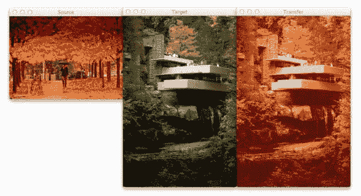

# 图像间的超快速色彩转换

> 原文：<https://pyimagesearch.com/2014/06/30/super-fast-color-transfer-images/>

[](https://pyimagesearch.com/wp-content/uploads/2014/06/sunset_ocean.jpg)

大约一个月前，我在海边度过了一个早晨，沿着沙滩散步，让清凉的水拍打着我的脚。它是宁静的，放松的。然后我拿出我的 iPhone，抓拍了几张经过的海洋和云彩的照片。你知道，一些值得纪念的事情。因为我知道我一回到办公室，我的鼻子就要开始工作了。

回到家里，我把照片导入笔记本电脑，心想，嘿，一定有办法把我上午拍的这张海滩照片拍成黄昏时的样子。

由于我是一名计算机视觉科学家，我当然不会求助于 Photoshop。

不，这必须是一个手工设计的算法，可以拍摄任意两个图像，一个源图像和一个目标图像，然后将颜色空间从`source`图像转移到`target`图像。

几周前，我在浏览 reddit 时，看到了一个关于如何在两张图片之间转换颜色的帖子。作者的实现使用了基于直方图的方法，旨在平衡三种“类型”的箱:相等、过剩和不足。

这种方法取得了很好的效果——但是以速度为代价。使用这种算法将需要您对源图像中的每个像素执行查找，随着图像大小的增加，这将变得非常昂贵。虽然你可以用一点数字魔法来加速这个过程，但是你可以做得更好。

***好得多，其实好得多。***

如果我告诉你，你可以创建一个只使用图像通道的平均值和标准偏差 的 ***颜色转移算法，那会怎么样？***

就是这样。没有复杂的代码。没有计算直方图。只是简单的统计。

顺便说一下，这种方法甚至可以轻松处理巨大的图像。

感兴趣吗？

请继续阅读。

你也可以[通过 GitHub](https://github.com/jrosebr1/color_transfer) 下载代码或者通过 PyPI 安装(假设你已经安装了 OpenCV)。

# 颜色传递算法

我实现的颜色转换是(粗略地)基于赖因哈德等人 2001 年提出的图像间的[](http://www.thegooch.org/Publications/PDFs/ColorTransfer.pdf)*颜色转换。*

 *在这篇论文中，赖因哈德和他的同事证明了通过分别利用 L*a*b*颜色空间和每个 L*、a*和 b*通道的平均值和标准偏差，颜色可以在两个图像之间转移。

算法是这样的:

*   **第一步:**输入一张`source`和一张`target`图像。源图像包含您希望您的`target`图像模仿的色彩空间。在这个页面顶部的图中，左边的日落图像是我的`source`，中间的图像是我的`target`，右边的图像是应用到`target`的`source`的色彩空间。
*   **第二步:**将`source`和`target`图像都转换到 L*a*b*颜色空间。L*a*b*颜色空间模拟感知均匀性，其中颜色值数量的小变化也应该产生颜色重要性的相对相等的变化。L*a*b*颜色空间在模仿人类如何解释颜色方面比标准 RGB 颜色空间做得好得多，正如您将看到的，它非常适合颜色传递。
*   **第三步:**为`source`和`target`拆分通道。
*   **步骤 4:** 计算`source`和`target`图像的 L*a*b*通道的平均值和标准偏差。
*   **第五步:**从`target`通道中减去`target`图像的 L*a*b*通道的平均值。
*   **第六步:**按`target`的标准差除以`source`的标准差，再乘以`target`通道的比值缩放`target`通道。
*   **第七步:**为`source`添加 L*a*b*通道的含义。
*   **第 8 步:**裁剪掉范围*【0，255】*之外的任何值。(**注:**这一步不是原纸的一部分。我添加它是因为 OpenCV 处理色彩空间转换的方式。如果您要在不同的语言/库中实现该算法，您将不得不自己执行色彩空间转换，或者了解执行转换的库是如何工作的)。
*   第九步:合并频道。
*   **第十步:**从 L*a*b*空间转换回 RGB 颜色空间。

我知道这看起来需要很多步骤，但实际上并不多，特别是考虑到在使用 Python、NumPy 和 OpenCV 时实现这种算法是多么简单。

如果现在看起来有点复杂，不要担心。继续阅读，我将解释驱动算法的代码。

# 要求

我假设您的系统上安装了 Python、OpenCV(带有 Python 绑定)和 NumPy。

如果有人想帮我在 [GitHub repo](https://github.com/jrosebr1/color_transfer) 中创建一个`requirements.txt`文件，那将会非常棒。

# 安装

假设您已经安装了 OpenCV(带有 Python 绑定)和 NumPy，最简单的安装方法是使用`pip`:

```
$ pip install color_transfer

```

# 代码解释

我创建了一个 PyPI 包，你可以用它在你自己的图片之间进行颜色转换。GitHub 上也有该代码。

无论如何，让我们卷起袖子，把手弄脏，看看在`color_transfer`包的引擎盖下发生了什么:

```
# import the necessary packages
import numpy as np
import cv2

def color_transfer(source, target):
	# convert the images from the RGB to L*ab* color space, being
	# sure to utilizing the floating point data type (note: OpenCV
	# expects floats to be 32-bit, so use that instead of 64-bit)
	source = cv2.cvtColor(source, cv2.COLOR_BGR2LAB).astype("float32")
	target = cv2.cvtColor(target, cv2.COLOR_BGR2LAB).astype("float32")

```

**2 号线和 3 号线**输入我们需要的包裹。我们将使用 NumPy 进行数值处理，使用`cv2`进行 OpenCV 绑定。

从那里，我们在**线 5** 上定义我们的`color_transfer`函数。这个函数执行颜色从`source`图像(第一个参数)到`target`图像(第二个参数)的实际转换。

赖因哈德等人详述的算法表明，应该利用 L*a*b*颜色空间，而不是标准的 RGB。为了处理这个问题，我们将源图像和目标图像都转换到 L*a*b*颜色空间的第 9 行**和第 10 行** ( **步骤 1 和 2** )。

OpenCV 将图像表示为多维 NumPy 数组，但默认为`uint8`数据类型。这对于大多数情况来说没问题，但是当执行颜色传输时，我们可能会有负值和十进制值，因此我们需要利用浮点数据类型。

现在，让我们开始执行实际的颜色转换:

```
	# compute color statistics for the source and target images
	(lMeanSrc, lStdSrc, aMeanSrc, aStdSrc, bMeanSrc, bStdSrc) = image_stats(source)
	(lMeanTar, lStdTar, aMeanTar, aStdTar, bMeanTar, bStdTar) = image_stats(target)

	# subtract the means from the target image
	(l, a, b) = cv2.split(target)
	l -= lMeanTar
	a -= aMeanTar
	b -= bMeanTar

	# scale by the standard deviations
	l = (lStdTar / lStdSrc) * l
	a = (aStdTar / aStdSrc) * a
	b = (bStdTar / bStdSrc) * b

	# add in the source mean
	l += lMeanSrc
	a += aMeanSrc
	b += bMeanSrc

	# clip the pixel intensities to [0, 255] if they fall outside
	# this range
	l = np.clip(l, 0, 255)
	a = np.clip(a, 0, 255)
	b = np.clip(b, 0, 255)

	# merge the channels together and convert back to the RGB color
	# space, being sure to utilize the 8-bit unsigned integer data
	# type
	transfer = cv2.merge([l, a, b])
	transfer = cv2.cvtColor(transfer.astype("uint8"), cv2.COLOR_LAB2BGR)

	# return the color transferred image
	return transfer

```

**第 13 行和第 14 行**调用了`image_stats`函数，我将在几个段落中详细讨论。但是现在，要知道这个函数只是分别计算 L*、a*和 b*通道的像素强度的平均值和标准偏差(**步骤 3 和 4** )。

现在我们有了`source`和`target`图像的每个 L*a*b*通道的平均值和标准偏差，我们现在可以执行颜色转换。

在**第 17-20 行**，我们将目标图像分割成 L*、a*和 b*分量，并减去它们各自的平均值(**步骤 5** )。

从那里，我们通过目标标准偏差除以源图像的标准偏差的比率进行缩放，在**行 23-25** 上执行**步骤 6** 。

然后，我们可以应用**步骤 7** ，在**行 28-30** 添加源通道的平均值。

**第 8 步**在**第 34-36 行**上处理，在这里我们截取落在范围*【0，255】*之外的值(在 L*a*b*颜色空间的 OpenCV 实现中，这些值被缩放到范围*【0，255】*，尽管这不是原始 L*a*b*规范的一部分)。

最后，我们通过将缩放后的 L*a*b*通道合并在一起，并最终转换回原始 RGB 色彩空间，在**行 41 和 42** 上执行**步骤 9** 和**步骤 10** 。

最后，我们在第 45 行**返回彩色传输图像。**

让我们快速看一下`image_stats`函数，使这段代码解释更加完整:

```
def image_stats(image):
	# compute the mean and standard deviation of each channel
	(l, a, b) = cv2.split(image)
	(lMean, lStd) = (l.mean(), l.std())
	(aMean, aStd) = (a.mean(), a.std())
	(bMean, bStd) = (b.mean(), b.std())

	# return the color statistics
	return (lMean, lStd, aMean, aStd, bMean, bStd)

```

这里我们定义了`image_stats`函数，它接受一个参数:我们想要计算统计数据的`image`。

在调用**行 49** 上的`cv2.split`将我们的图像分解到各自的通道之前，我们假设图像已经在 L*a*b*颜色空间中。

从那里，**行 50-52** 处理每个通道的平均值和标准偏差的计算。

最后，在**线 55** 上返回每个通道的一组平均值和标准偏差。

# 例子

要获取`example.py`文件并运行示例，[只需从 GitHub 项目页面](https://github.com/jrosebr1/color_transfer)获取代码。

你已经在这篇文章的顶部看到了海滩的例子，但是让我们再看一看:

```
$ python example.py --source images/ocean_sunset.jpg --target images/ocean_day.jpg

```

执行该脚本后，您应该会看到以下结果:

[](https://pyimagesearch.com/wp-content/uploads/2014/06/sunset_ocean.jpg)

**Figure 1:** The image on the left is the source, the middle image is the target, and the right is the output image after applying the color transfer from the source to the target. Notice how a nice sunset effect is created in the output image.

注意日落照片的橙色和红色是如何被转移到白天的海洋照片上的。

[](https://pyimagesearch.com/practical-python-opencv/?src=in-post-super-fast-color-transfer)

太棒了。但是让我们尝试一些不同的东西:

```
$ python example.py --source images/woods.jpg --target images/storm.jpg

```

[](https://pyimagesearch.com/wp-content/uploads/2014/06/woods_storm..jpg)

**Figure 2:** Using color transfer to make storm clouds look much more ominous using the green foliage of a forest scene.

这里你可以看到在左边的*我们有一张林地的照片——大部分是与植被相关的绿色和与树皮相关的深棕色。*

然后在*中间*我们有一个不祥的雷雨云——但让我们让它更不祥！

如果你曾经经历过严重的雷雨或龙卷风，你可能已经注意到在暴风雨来临之前，天空会变成一片诡异的绿色。

正如你在*右边*看到的，我们已经成功地通过将森林区域的颜色空间映射到我们的云上来模拟这种不祥的绿色天空。

很酷，对吧？

再举一个例子:

```
$ python example.py --source images/autumn.jpg --target images/fallingwater.jpg

```

[](https://pyimagesearch.com/wp-content/uploads/2014/06/autumn_fallingwater.jpg)

**Figure 3:** Using color transfer between images to create an autumn style effect on the output image.

在这里，我结合了我最喜欢的两件东西:秋叶*(左)*和中世纪的现代建筑，在这种情况下，弗兰克劳埃德赖特的流水别墅*(中)*。

流水别墅的中间照片展示了一些令人惊叹的中世纪建筑，但如果我想给它一个“秋天”风格的效果呢？

你猜对了——把秋天图像的色彩空间转移到流水上！正如你在右边的*所看到的，结果非常棒。*

# 改进算法的方法

虽然赖因哈德等人的算法非常快，但有一个特别的缺点——它依赖于全局颜色统计，因此具有相似像素强度值的大区域会显著影响平均值(从而影响整体颜色传递)。

为了解决这个问题，我们可以考虑两种解决方案:

**选项 1:** 在您想要模拟颜色的较小感兴趣区域(ROI)中计算源图像的平均值和标准偏差，而不是使用整个图像。采用这种方法将使您的平均值和标准差更好地代表您想要使用的色彩空间。

**选项 2:** 第二种方法是将 k 均值应用于两幅图像。您可以在 L*a*b*颜色空间中对每个图像的像素强度进行聚类，然后使用欧几里得距离确定最相似的两个图像之间的质心。然后，只计算这些区域内的统计数据。同样，这将使您的均值和标准差具有更“局部”的效果，并有助于缓解全球统计数据的过度代表性问题。当然，缺点是这种方法速度很慢，因为现在增加了一个昂贵的集群步骤。

# 摘要

在这篇文章中，我展示了如何使用 Python 和 OpenCV 在图像之间进行超快速的颜色转换。

然后，我提供了一个(大致)基于赖因哈德等人论文的实现。

与需要计算每个通道的 CDF 然后构建查找表(LUT)的基于直方图的颜色传递方法不同，这种方法严格依赖于 L*a*b*颜色空间中像素强度的平均值和标准偏差，这使得它非常高效，并且能够快速处理非常大的图像。

如果您希望改进此算法的结果，请考虑对源图像和目标图像应用 k-means 聚类，匹配具有相似质心的区域，然后在每个单独的区域内执行颜色传递。这样做将使用 ***局部*** 颜色统计，而不是 ***全局*** 统计，从而使颜色转移更具视觉吸引力。

# GitHub 上提供的代码

寻找这篇文章的源代码？只需前往 GitHub 项目页面！

# 在一个周末学习计算机视觉的基础知识

[](https://pyimagesearch.com/practical-python-opencv/)

如果你有兴趣学习计算机视觉的基础知识，但不知道从哪里开始，你绝对应该看看我的新电子书， [*实用 Python 和 OpenCV*](https://pyimagesearch.com/practical-python-opencv/) 。

在这本书里，我涵盖了计算机视觉和图像处理的基础…我可以在一个周末教你！

我知道，这听起来好得难以置信。

但是我向你保证，这本书是你学习计算机视觉基础的快速入门指南。读完这本书后，你将很快成为一名 OpenCV 大师！

所以如果你想学习 OpenCV 的基础知识，[一定要看看我的书](https://pyimagesearch.com/practical-python-opencv/)。你不会失望的。*