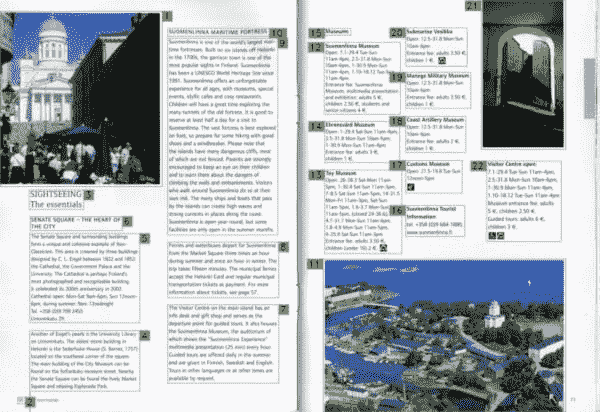

# PyImageSearch 大师成员聚焦:Tuomo Hiippala

> 原文：<https://pyimagesearch.com/2016/03/14/pyimagesearch-gurus-member-spotlight-tuomo-hiippala/>

Photo credit: Heta Koski / CSC

在今天的博文中，我采访了 PyImageSearch Gurus 的成员 Tuomo Hiippala，他最近获得了 28000 欧元(约合 30500 美元)的资助，用于研究计算机视觉如何用于研究视觉文化，包括社交媒体图像和照片档案。我们将讨论他在*非常独特的研究领域*，它融合了语言学和计算机视觉，以及 ***他的工作如何塑造现代视觉数据分析。***

Tuomo 是 PyImageSearch 博客的长期读者，甚至是 [PyImageSearch 大师 Kickstarter 活动](https://www.kickstarter.com/projects/1186001332/pyimagesearch-gurus-become-a-computer-vision-openc?token=edfe2e40)的第一批支持者之一。很荣幸他今天来到这里，他是我在博客上采访的第一个人。从这次对托莫— *的采访中可以获得很多知识，尤其是计算机视觉如何应用于现实世界的问题。*

理想情况下，我希望这种类型的*聚焦*和*采访*帖子在未来能够更频繁地出现在 PyImageSearch 博客上。虽然我试图每周发布新的技巧、窍门和教程，但真正重要的*是你，读者，如何将这些知识应用到你自己的项目中。*

如果 PyImageSearch 博客、 *[实用 Python 和 OpenCV](https://pyimagesearch.com/practical-python-opencv/)* ，或者 [PyImageSearch 大师课程](https://pyimagesearch.com/pyimagesearch-gurus/)在你的计算机视觉之旅中对你有所帮助， ***请在这篇博客上留下评论或者[给我发消息](https://pyimagesearch.com/contact/)*** 。就像我说的，我很乐意在未来做更多这样的采访帖子！

## PyImageSearch 大师成员聚焦:Tuomo Hiippala

**阿德里安:** 嘿托莫！谢谢你同意接受采访。很高兴有你在 PyImageSearch 博客上。

**托墨:** 作为长期读者:荣幸之至！

阿德里安: 我们开始采访吧。你在哪里工作/你的工作是什么？

我现在是芬兰于韦斯屈莱大学应用语言研究中心的博士后研究员。至于我的背景，我获得了赫尔辛基大学的英语语言学博士学位，专业是语言学。不过，我是一种特殊的语言学家，因为我的兴趣远不止语言。

基本上，我研究语言是如何与其他交流方式互动的，比如照片、图表、信息图……等等。访问一个网站或拿起一份日报，很快就会让你意识到为什么一起研究所有这些不同的模式是有意义的。它们密切协调，并一直相互作用——这是交流的固有特征，但奇怪的是，这只是最近才真正受到不同领域研究人员的关注。

阿德里安: 你最初是如何对计算机视觉产生兴趣的？

我不得不检查我的笔记本:我在 2014 年德国法兰克福书展期间写下了一些东西…我依稀记得在交易会上检查了一些参展商，他们宣传自动文档管理解决方案。这是我真正想到这个主意的时候，尽管我显然已经熟悉了光学字符识别等技术，这些技术在 20 世纪 90 年代彻底改变了语言学，消除了手动输入的僵局。无论如何，那时我决定学习更多关于计算机视觉的知识，并顺便了解 Python。

阿德里安: 你如何在工作中使用计算机视觉？

我现在正在做几个项目:第一个是开发一个半自动的文档分析系统，它使用 OpenCV、Tesseract 和 NLTK 来检查文档图像，并将它们的特征标注到 XML 数据库中。商业 OCR 软件在这方面并不实用，因为它主要是提取内容。为了研究不同的交流模式是如何协同工作的，我们需要知道更多:内容、它在布局中的位置、逻辑组织和语义的相互关系——而这只能让我们对文档及其内部工作有一个最基本的了解。我希望明年夏天在柏林举行的计算语言学协会年会上展示我正在进行的工作！

**Figure 1:** Detecting text regions in images (outlined in green). Non-text regions are outlined in red.

我也在研究如何利用计算机视觉让研究人员更好地掌握大量的视觉数据。人文和社会科学的许多不同领域都与视觉传播有关——然而许多研究人员倾向于手工进行视觉分析，这实际上不允许他们认真处理通常在历史照片档案或 Instagram 等社交媒体服务中发现的大量数据。OpenCV 等开源库和其他使编程更易访问的工具有着巨大的潜力——IPython 是开发和共享此类工具的理想候选。这就是我想贡献的，专注于应用，把算法的开发留给计算机科学家。尽管如此，我还是努力学习算法！

阿德里安: 你提到你申请了助学金。你能多告诉我一些吗？

**托莫:** 确定！芬兰文化基金会刚刚授予我价值 28 000 欧元(约 35000 美元)的个人赠款，用于研究如何使用计算机视觉来研究视觉文化，如社交媒体图像和照片档案。我还在 2015 年从赫尔辛基市获得了 3500 欧元的资助，用于研究游览赫尔辛基的游客分享的照片，即他们如何看待这座城市，这是我的另一个长期研究兴趣。我目前正在等待旅游季节的开始，开始收集数据！

***注:**有兴趣了解更多拓跋研究？一定要把这两页看一遍:*

*   *https://www.csc.fi/web/atcsc/-/humanisti-datailee*
*   *[http://www . inthefieldstories . net/a-humanist-take-on-scientific-computing/](http://www.inthefieldstories.net/a-humanist-take-on-scientific-computing/)*

阿德里安:PyImageSearch/PyImageSearch 大师们是如何帮助你获得资助的？

**托莫:** 我能说什么呢？博客和课程让我的工作受益匪浅:它为我开辟了一个全新的研究领域。虽然我只学了一年半的计算机视觉，但我已经有足够的信心在研究中应用这些技术。这显然对获得任何资金都是至关重要的。

**阿德里安:** 你会向其他试图学习计算机视觉的开发者和学生推荐 [PyImageSearch 大师课程](https://pyimagesearch.com/pyimagesearch-gurus/)吗？

当然——我认为这个课程质量极高，物有所值——我想我是 Kickstarter 上第一批支持它的五个人之一！我发现特别吸引人的是课程材料写得非常好，并且以一种允许人们同时学习 Python 的方式呈现。它们很好地结合在一起，球场和周围的社区也是如此！

阿德里安: 你还有什么想分享的吗？

我当然会向任何人推荐学习计算机视觉(和机器学习)，无论他们的专业或学术兴趣如何。我认为，PyImageSearch 大师课程中展示的各种项目很好地说明了计算机视觉在未来能够并将会有丰富的应用。最棒的是，由于 Python 和大量高质量的教程，这些技术中的大多数对于外行人来说都是可以理解的。只管潜进去，一定会有回报的！

**Adrian:** 如果一个 PyImageSearch 的读者想聊天，在哪里和你联系最好？

**Tuomo:** 你可以在 Twitter([【http://twitter.com/tuomo_h/](http://twitter.com/tuomo_h/))、LinkedIn([【https://fi.linkedin.com/in/tuomohiippala](https://fi.linkedin.com/in/tuomohiippala))和 GitHub([【https://github.com/thiippal](https://github.com/thiippal))上找到我。随时联系！

## 摘要

在今天的帖子中，我采访了在于韦斯屈莱大学工作的 Tuomo Hiippala。他的研究融合了两个独特的研究领域:*语言学*和*计算机视觉*，他的工作重点是让研究人员更好地理解大量的视觉数据。

理想情况下，我很乐意在未来的博客文章中做更多的 PyImageSearch 读者采访和聚焦。如果 PyImageSearch 博客、 *[实用 Python 和 OpenCV](https://pyimagesearch.com/practical-python-opencv/)* 或者 [PyImageSearch 大师](https://pyimagesearch.com/pyimagesearch-gurus/)课程在你的计算机视觉之旅中帮助了你， ***请评论这篇文章或者[给我发消息](https://pyimagesearch.com/contact/)让我知道！***