# 使用 OMR、Python 和 OpenCV 的气泡式多项选择扫描仪和测试评分器

> 原文：<https://pyimagesearch.com/2016/10/03/bubble-sheet-multiple-choice-scanner-and-test-grader-using-omr-python-and-opencv/>


在过去的几个月里，我的收件箱收到了相当多的请求，要求我使用计算机视觉和图像处理技术来构建一个类似气泡表/扫描仪的测试阅读器。

虽然我在做这个关于机器学习和深度学习的系列时获得了很多乐趣，但如果我说这个小小的迷你项目不是一个短暂的、受欢迎的休息，那我就是在撒谎。运行 PyImageSearch 博客，我最喜欢的部分之一是演示如何使用计算机视觉建立解决问题的*实际*解决方案。

事实上，这个项目*之所以如此特别*是因为我们将结合*以前许多*博文中的技术，包括[构建文档扫描仪](https://pyimagesearch.com/2014/09/01/build-kick-ass-mobile-document-scanner-just-5-minutes/)、[轮廓排序](https://pyimagesearch.com/2015/04/20/sorting-contours-using-python-and-opencv/)和[透视变换](https://pyimagesearch.com/2014/08/25/4-point-opencv-getperspective-transform-example/)。使用从这些以前的帖子中获得的知识，我们将能够快速完成这个气泡表扫描仪和测试分级机。

你看，上周五下午，我很快地用 Photoshopped 处理了一份示例 bubble 试卷，打印了几份，然后着手编写实际实现的代码。

总的来说，我对这个实现非常满意，我认为你完全可以使用这个气泡表分级器/OMR 系统作为你自己项目的起点。

**要了解更多关于利用计算机视觉、图像处理和 OpenCV 对泡泡试卷进行自动评分的信息，*继续阅读。***

## 使用 OMR、Python 和 OpenCV 的气泡纸扫描仪和测试分级机

在这篇博文的剩余部分，我将讨论什么是光学标记识别 (OMR)。然后，我将演示如何使用*严格地说*计算机视觉和图像处理技术以及 OpenCV 库来实现气泡纸测试扫描仪和分类器。

一旦我们实现了我们的 OMR 系统，我将提供我们的测试评分员在几个示例考试中的样本结果，包括那些被恶意填写的。

最后，我将讨论当前气泡页扫描仪系统的一些缺点，以及我们如何在未来的迭代中改进它。

### 什么是光学标记识别(OMR)？

光学标记识别，或简称为 OMR，是自动分析人类标记的文档并解释其结果的过程。

可以说，OMR 最著名、最容易识别的形式是**，与你在小学、中学甚至高中参加的考试没有什么不同。**

 **如果你不熟悉“气泡纸测试”或“Scantron 测试”的商标/公司名称，它们只是你作为学生参加的多项选择测试。考试中的每个问题都是选择题，你用 2 号铅笔在正确答案对应的“泡泡”上做标记。

你经历过的最著名的冒泡测试(至少在美国)是在填写大学入学申请之前参加高中的 sat 考试。

我*相信【that 使用 Scantron 提供的软件来进行 OMR 和学生考试评分，但是我很可能错了。我之所以注意到这一点，是因为 Scantron 在美国超过 98%的学区使用。*

简而言之，我想说的是，光学标记识别以及对人类标记的表格和考试进行评分和解释的能力有一个巨大的市场。

### 使用 OMR、Python 和 OpenCV 实现气泡纸扫描仪和分级机

现在我们已经了解了 OMR 的基本知识，让我们使用 Python 和 OpenCV 来构建一个计算机视觉系统，它可以*读取*和*等级*气泡表测试。

当然，我会一路提供大量的视觉示例图像，这样你就可以准确地理解*我在应用什么技术*和*我为什么要使用它们。*

以下是我为这个项目收集的一个填写在气泡表考试中的例子:

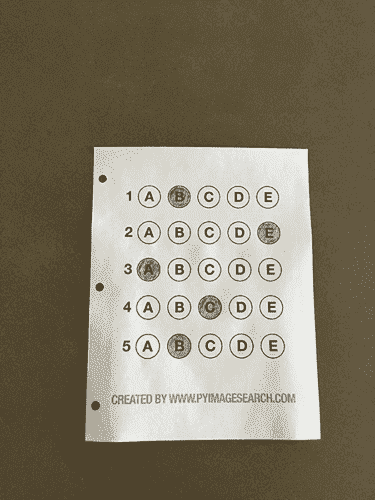

**Figure 1:** The example, filled in bubble sheet we are going to use when developing our test scanner software.

在我们构建测试分类器的过程中，我们将使用这张图片作为示例。在本课的稍后部分，您还将找到附加的示例考试。

我还包含了一个空白的考试模板，作为一个 PSD (Photoshop)文件，这样你就可以随意修改了。你可以使用这篇文章底部的 ***【下载】*** 部分下载代码、示例图片和模板文件。

#### 构建气泡纸扫描仪和分级机的 7 个步骤

这篇博文的目标是使用 Python 和 OpenCV 构建一个气泡表扫描器和测试分类器。

为此，我们的实施需要满足以下 7 个步骤:

*   **步骤#1:** 在图像中检测检查。
*   **步骤#2:** 应用透视变换来提取检查的俯视鸟瞰图。
*   **步骤#3:** 从透视变换后的考试中提取泡泡集(即可能的答案选择)。
*   **步骤#4:** 将问题/泡泡按行排序。
*   **步骤#5:** 确定每行的标记(即“冒泡”)答案。
*   **步骤#6:** 在我们的答案中查找正确答案，以确定用户的选择是否正确。
*   **步骤#7:** 对考试中的所有问题重复上述步骤。

本教程的下一节将介绍我们算法的实际实现。

#### 用 Python 和 OpenCV 实现气泡图扫描仪

首先，打开一个新文件，命名为`test_grader.py`，让我们开始工作:

```
# import the necessary packages
from imutils.perspective import four_point_transform
from imutils import contours
import numpy as np
import argparse
import imutils
import cv2

# construct the argument parse and parse the arguments
ap = argparse.ArgumentParser()
ap.add_argument("-i", "--image", required=True,
	help="path to the input image")
args = vars(ap.parse_args())

# define the answer key which maps the question number
# to the correct answer
ANSWER_KEY = {0: 1, 1: 4, 2: 0, 3: 3, 4: 1}

```

在第 2-7 行,我们导入了我们需要的 Python 包。

你应该已经在你的系统上安装了 OpenCV 和 Numpy，但是你*可能*没有最新版本的 [imutils](https://github.com/jrosebr1/imutils) ，这是我的一套方便的函数，可以使执行基本的图像处理操作更加容易。要安装`imutils`(或升级到最新版本)，只需执行以下命令:

```
$ pip install --upgrade imutils

```

**第 10-12 行**解析我们的命令行参数。这里我们只需要一个开关`--image`，它是到输入气泡表测试图像的路径，我们将对它进行正确性评分。

**第 17 行**然后定义了我们的`ANSWER_KEY`。

顾名思义，`ANSWER_KEY`提供了*问题编号*到正确气泡的*索引的整数映射。*

在这种情况下， *0* 的键表示*第一个问题*，而 *1* 的值表示*【B】*为正确答案(因为*“B”*是字符串*【ABCDE】*中的索引 *1* )。作为第二个例子，考虑映射到值 *4* 的键*1*—这将表明第二个问题的答案是*“E”*。

为了方便起见，我在这里用简单的英语写下了整个答案:

*   **问题 1:** B
*   问题 2: E
*   **问题 3:** 答
*   第四个问题: D
*   **问题 5:** B

接下来，让我们预处理我们的输入图像:

```
# load the image, convert it to grayscale, blur it
# slightly, then find edges
image = cv2.imread(args["image"])
gray = cv2.cvtColor(image, cv2.COLOR_BGR2GRAY)
blurred = cv2.GaussianBlur(gray, (5, 5), 0)
edged = cv2.Canny(blurred, 75, 200)

```

在**第 21** 行，我们从磁盘中加载图像，然后将其转换为灰度(**第 22** 行)，并对其进行模糊处理以减少高频噪声(**第 23** 行)。

然后，我们将 Canny 边缘检测器应用于第 24 行的**以找到检查的*边缘/轮廓*。**

下面我附上了应用边缘检测后的考试截图:

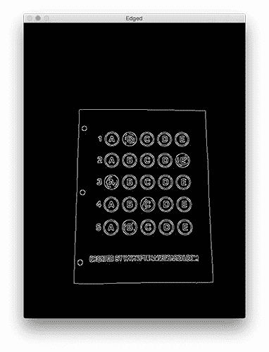

**Figure 2:** Applying edge detection to our exam neatly reveals the outlines of the paper.

请注意文档的边缘是如何被清晰地定义的，检查的所有四个顶点都出现在图像中。

在我们的下一步中，获取文档的轮廓*极其重要*,因为我们将使用它作为标记对检查应用透视变换，从而获取文档的俯视鸟瞰图:

```
# find contours in the edge map, then initialize
# the contour that corresponds to the document
cnts = cv2.findContours(edged.copy(), cv2.RETR_EXTERNAL,
	cv2.CHAIN_APPROX_SIMPLE)
cnts = imutils.grab_contours(cnts)
docCnt = None

# ensure that at least one contour was found
if len(cnts) > 0:
	# sort the contours according to their size in
	# descending order
	cnts = sorted(cnts, key=cv2.contourArea, reverse=True)

	# loop over the sorted contours
	for c in cnts:
		# approximate the contour
		peri = cv2.arcLength(c, True)
		approx = cv2.approxPolyDP(c, 0.02 * peri, True)

		# if our approximated contour has four points,
		# then we can assume we have found the paper
		if len(approx) == 4:
			docCnt = approx
			break

```

现在我们已经有了考试的大纲，我们应用`cv2.findContours`函数来查找与考试本身相对应的行。

我们通过在**线 37** 上按照轮廓的*面积*(从最大到最小)对轮廓进行分类(当然，是在确保在**线 34** 上找到至少一个轮廓之后)。这意味着较大的轮廓将被放在列表的前面，而较小的轮廓将出现在列表的后面。

我们假设我们的检查将是图像的*主焦点，因此比图像中的其他对象大。这个假设允许我们“过滤”我们的轮廓，简单地通过调查它们的区域并且知道对应于检查的轮廓应该在列表的前面附近。*

然而，*轮廓面积和尺寸*是不够的——我们还应该检查轮廓上*顶点的数量*。

为了做到这一点，我们在第 40 行的**上循环我们的每个(排序的)轮廓。对于它们中的每一个，我们近似轮廓，这实质上意味着我们*简化*轮廓中的点数，使其成为“更基本”的几何形状。你可以在这篇关于[构建移动文档扫描仪的文章中读到更多关于轮廓近似的内容。](https://pyimagesearch.com/2014/09/01/build-kick-ass-mobile-document-scanner-just-5-minutes/)**

在第 47 行第 47 行第 47 行第 47 行第 47 行第 47 行第 47 行第 41 行，我们检查我们的近似轮廓是否有四个点，如果有，*我们认为我们已经找到了测试。*

下面我提供了一个示例图像，演示了在原始图像上绘制的`docCnt`变量:

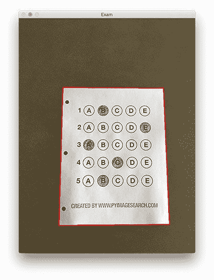

**Figure 3:** An example of drawing the contour associated with the exam on our original image, indicating that we have successfully found the exam.

果然这个区域对应的是考试大纲。

既然我们已经使用轮廓找到了检查的轮廓，我们可以应用透视变换来获得文档的自上而下的鸟瞰图:

```
# apply a four point perspective transform to both the
# original image and grayscale image to obtain a top-down
# birds eye view of the paper
paper = four_point_transform(image, docCnt.reshape(4, 2))
warped = four_point_transform(gray, docCnt.reshape(4, 2))

```

在这种情况下，我们将使用我实现的`four_point_transform`函数，它:

1.  以*特定的、可重复的方式排列轮廓的 *(x，y)*-坐标。*
2.  对区域应用透视变换。

你可以在[这篇文章](https://pyimagesearch.com/2014/08/25/4-point-opencv-getperspective-transform-example/)以及[这篇更新的关于坐标排序的文章](https://pyimagesearch.com/2016/03/21/ordering-coordinates-clockwise-with-python-and-opencv/)中了解更多关于透视变换的信息，但是现在，简单地理解一下，这个函数处理“倾斜的”考试并对其进行变换，返回文档的自顶向下视图:

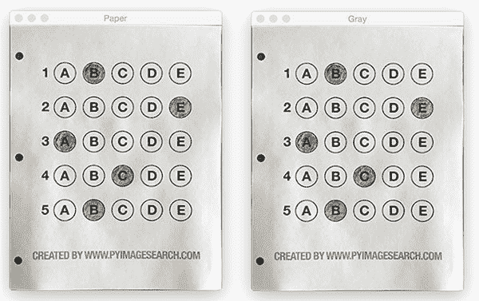

**Figure 4:** Obtaining a top-down, birds-eye view of both the original image *(left)* along with the grayscale version *(right)*.

好吧，现在我们有进展了。

我们在原始图像中找到了我们的考试。

我们应用透视变换来获得文档的 90 度视角。

但是我们如何着手对文件进行评分呢？

该步骤从*二值化*开始，或者从图像的*背景*中对*前景*进行阈值分割/分割的过程:

```
# apply Otsu's thresholding method to binarize the warped
# piece of paper
thresh = cv2.threshold(warped, 0, 255,
	cv2.THRESH_BINARY_INV | cv2.THRESH_OTSU)[1]

```

在应用 Otsu 的阈值方法后，我们的检查现在是一个*二进制*图像:

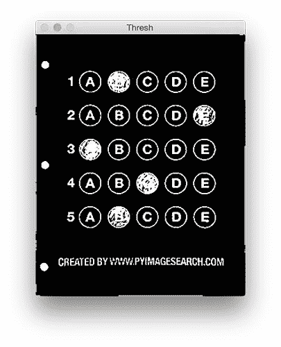

**Figure 5:** Using Otsu’s thresholding allows us to segment the foreground from the background of the image.

注意图像的*背景*是*黑色*，而*前景*是*白色。*

这种二值化将允许我们再次应用轮廓提取技术来找到检查中的每个气泡:

```
# find contours in the thresholded image, then initialize
# the list of contours that correspond to questions
cnts = cv2.findContours(thresh.copy(), cv2.RETR_EXTERNAL,
	cv2.CHAIN_APPROX_SIMPLE)
cnts = imutils.grab_contours(cnts)
questionCnts = []

# loop over the contours
for c in cnts:
	# compute the bounding box of the contour, then use the
	# bounding box to derive the aspect ratio
	(x, y, w, h) = cv2.boundingRect(c)
	ar = w / float(h)

	# in order to label the contour as a question, region
	# should be sufficiently wide, sufficiently tall, and
	# have an aspect ratio approximately equal to 1
	if w >= 20 and h >= 20 and ar >= 0.9 and ar <= 1.1:
		questionCnts.append(c)

```

**第 64-67 行**处理在我们的`thresh`二进制图像上寻找轮廓，随后初始化`questionCnts`，这是对应于考试上的问题/气泡的轮廓列表。

为了确定图像的哪些区域是气泡，我们首先遍历每个单独的轮廓(**行 70** )。

对于这些轮廓中的每一个，我们计算边界框(**线 73** )，这也允许我们计算*纵横比*，或者更简单地说，宽度与高度的比率(**线 74** )。

为了将轮廓区域视为气泡，该区域应该:

1.  足够宽和高(在这种情况下，两个维度都至少有 20 个像素)。
2.  具有大约等于 1 的纵横比。

只要这些检查有效，我们就可以更新我们的`questionCnts`列表，并将该区域标记为气泡。

下面我附上了一张截图，它在我们的图片上画出了`questionCnts`的输出:

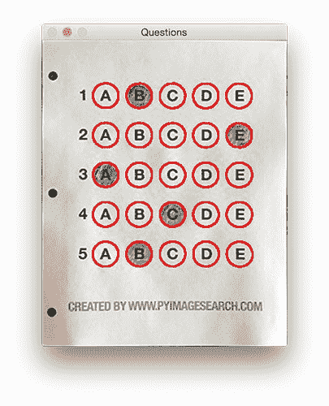

**Figure 6:** Using contour filtering allows us to find all the question bubbles in our bubble sheet exam recognition software.

请注意*只有*考试的问题区域被突出显示，其他什么都没有。

我们现在可以进入 OMR 系统的“分级”部分:

```
# sort the question contours top-to-bottom, then initialize
# the total number of correct answers
questionCnts = contours.sort_contours(questionCnts,
	method="top-to-bottom")[0]
correct = 0

# each question has 5 possible answers, to loop over the
# question in batches of 5
for (q, i) in enumerate(np.arange(0, len(questionCnts), 5)):
	# sort the contours for the current question from
	# left to right, then initialize the index of the
	# bubbled answer
	cnts = contours.sort_contours(questionCnts[i:i + 5])[0]
	bubbled = None

```

首先，我们必须从上到下对我们的`questionCnts`进行排序。这将确保考试中靠近顶端的*行问题将出现在排序列表中的第*个*行。*

我们还初始化了一个 bookkeeper 变量来跟踪`correct`答案的数量。

在第 90 行，我们开始循环我们的问题。由于每个问题有 5 个可能的答案，我们将应用 NumPy 数组切片和轮廓排序从左到右对*当前轮廓集*进行排序。

这种方法有效的原因是因为我们已经从上到下对轮廓进行了排序。我们*知道*每个问题的 5 个泡泡将依次出现在我们的列表中——**，但是我们*不知道*这些泡泡是否会从左到右排序。**在**行 94** 上的轮廓排序调用解决了这个问题，并确保轮廓的每一行从左到右排序成行。

为了形象化这个概念，我在下面附上了一个截图，用不同的颜色描绘了每一行问题:

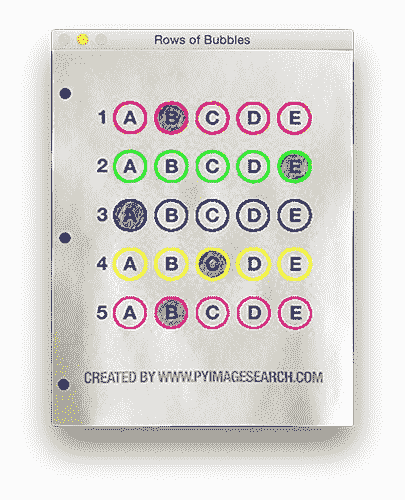

**Figure 7:** By sorting our contours from top-to-bottom, followed by left-to-right, we can extract each row of bubbles. Therefore, each row is equal to the bubbles for one question.

给定一排气泡，下一步是确定填充哪个气泡。

我们可以通过使用我们的`thresh`图像并计算每个气泡区域中非零像素(即*前景像素*)的数量来实现这一点:

```
	# loop over the sorted contours
	for (j, c) in enumerate(cnts):
		# construct a mask that reveals only the current
		# "bubble" for the question
		mask = np.zeros(thresh.shape, dtype="uint8")
		cv2.drawContours(mask, [c], -1, 255, -1)

		# apply the mask to the thresholded image, then
		# count the number of non-zero pixels in the
		# bubble area
		mask = cv2.bitwise_and(thresh, thresh, mask=mask)
		total = cv2.countNonZero(mask)

		# if the current total has a larger number of total
		# non-zero pixels, then we are examining the currently
		# bubbled-in answer
		if bubbled is None or total > bubbled[0]:
			bubbled = (total, j)

```

**行 98** 处理在该行中每个排序的气泡上的循环。

然后，我们为第**行 101** 上的当前气泡构建一个遮罩，然后对被遮罩区域中非零像素的数量进行计数(**行 107 和 108** )。我们计数的非零像素越多，前景像素就越多，因此具有最大非零计数的气泡是考生冒泡的气泡的索引(**第 113 行和第 114 行**)。

下面我提供了一个例子，创建一个遮罩并应用到与问题相关的每个气泡上:

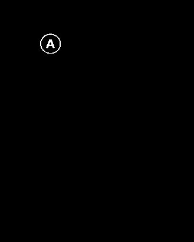

**Figure 8:** An example of constructing a mask for each bubble in a row.

显然，与*“B”*相关联的气泡具有最多的阈值像素，因此是用户已经在他们的检查上标记的气泡。

下一个代码块处理在`ANSWER_KEY`中查找正确答案，更新任何相关的簿记员变量，最后在我们的图像上绘制标记的气泡:

```
	# initialize the contour color and the index of the
	# *correct* answer
	color = (0, 0, 255)
	k = ANSWER_KEY[q]

	# check to see if the bubbled answer is correct
	if k == bubbled[1]:
		color = (0, 255, 0)
		correct += 1

	# draw the outline of the correct answer on the test
	cv2.drawContours(paper, [cnts[k]], -1, color, 3)

```

基于应试者是正确的还是不正确的，产生了在考试中抽取哪种颜色。如果应试者的答案*正确*，我们将用*绿色*突出显示他们的答案。但是，如果考生犯了错误并标记了错误答案，我们会通过用*红色*突出显示*正确的*答案让他们知道:

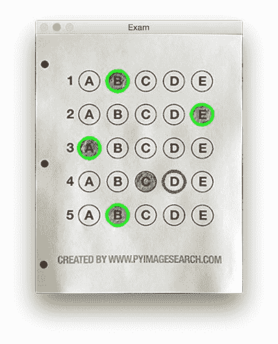

**Figure 9:** Drawing a “green” circle to mark “correct” or a “red” circle to mark “incorrect”.

最后，我们的最后一个代码块处理考试评分并在屏幕上显示结果:

```
# grab the test taker
score = (correct / 5.0) * 100
print("[INFO] score: {:.2f}%".format(score))
cv2.putText(paper, "{:.2f}%".format(score), (10, 30),
	cv2.FONT_HERSHEY_SIMPLEX, 0.9, (0, 0, 255), 2)
cv2.imshow("Original", image)
cv2.imshow("Exam", paper)
cv2.waitKey(0)

```

下面您可以看到我们完全评分的示例图像的输出:

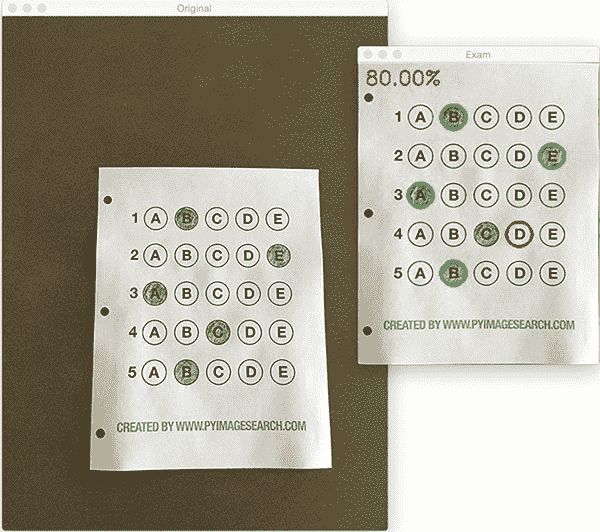

**Figure 10:** Finishing our OMR system for grading human-taken exams.

在这种情况下，读者在考试中获得了 80 分。他们唯一错过的问题是第 4 题，他们错误地将*【C】*标为正确答案(正确答案是*【D】*)。

### 为什么不用圆检测？

阅读完本教程后，您可能会想知道:

*“嗨阿德里安，一个答案泡泡是一个圆。那么为什么你提取轮廓而不是应用[霍夫圆](https://pyimagesearch.com/2014/07/21/detecting-circles-images-using-opencv-hough-circles/)来寻找图像中的圆呢？”*

问得好。

首先，在图像到图像的基础上调整霍夫圆的参数可能是一个真正的痛苦。但这只是次要原因。

**真正的原因**是:

***用户错误。***

有多少次，不管是有意还是无意，你在泡泡表上填了线以外的内容？我不是专家，但我不得不猜测，每 20 分中至少有 1 分是考生“稍微”超出标准的。

你猜怎么着？

霍夫圆不能很好地处理其轮廓的变形——在这种情况下，您的圆检测将完全失败。

因此，我建议使用轮廓和轮廓属性来帮助你过滤气泡和答案。`cv2.findContours`函数不关心气泡是“圆的”、“完全圆的”，还是“哦，我的上帝，那是什么鬼东西？”。

相反，`cv2.findContours`函数将返回一组*斑点*给你，它们将是你图像中的前景区域。然后你可以对这些区域进行处理和过滤，找到你的问题(就像我们在本教程中所做的那样)，然后继续你的工作。

### 我们的气泡纸测试扫描仪和分级机结果

要查看我们的气泡表测试分类器，请务必使用教程底部的 ***“下载”*** 部分下载源代码和示例图像。

我们已经在这篇文章的前面看到了`test_01.png`作为我们的例子，所以让我们试试`test_02.png`:

```
$ python test_grader.py --image images/test_02.png

```

这里我们可以看到一个特别邪恶的用户参加了我们的考试。他们对测试不满意，在测试的前面写下了 *"#yourtestsux"* 和一个激发 *"#breakthesystem"* 的无政府状态。他们还在所有答案上标注了*【A】*。

用户在考试中仅获得可怜的 20%的分数，这也许不足为奇，完全是因为运气:

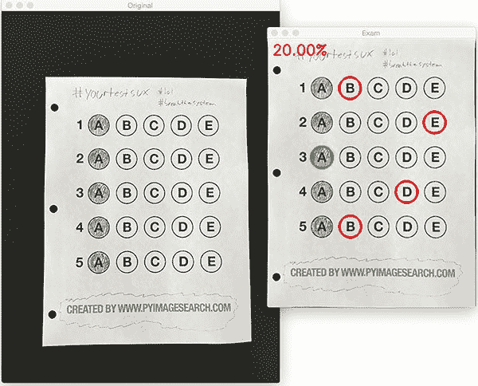

**Figure 11:** By using contour filtering, we are able to ignore the regions of the exam that would have otherwise compromised its integrity.

让我们尝试另一个图像:

```
$ python test_grader.py --image images/test_03.png

```

这一次，这位读者做得稍微好一点，得了 60 分:

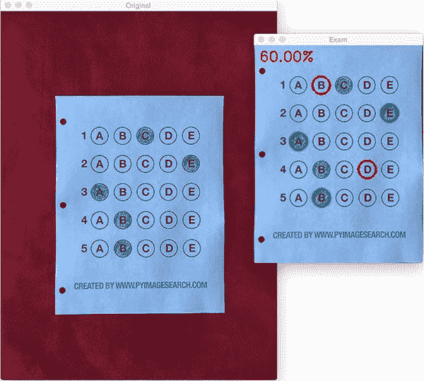

**Figure 12:** Building a bubble sheet scanner and test grader using Python and OpenCV.

在这个特殊的例子中，读者只需沿着对角线标记所有答案:

```
$ python test_grader.py --image images/test_04.png

```

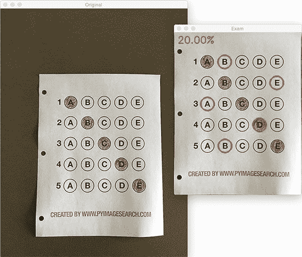

**Figure 13:** Optical Mark Recognition for test scoring using Python and OpenCV.

不幸的是，对于应试者来说，这个策略并没有得到很好的回报。

让我们看最后一个例子:

```
$ python test_grader.py --image images/test_05.png

```


**Figure 14:** Recognizing bubble sheet exams using computer vision.

这个学生显然提前学习了，考试得了满分。

### 扩展 OMR 和测试扫描仪

无可否认，去年夏天/初秋是我一生中最忙的时期之一，所以我需要在上周五的一个下午[时间盒](https://en.wikipedia.org/wiki/Timeboxing)开发 OMR 和测试扫描仪软件。

虽然我已经实现了一个可以工作的气泡纸测试扫描仪的框架，但是仍然有一些地方需要改进。最明显需要改进的地方是处理未填充气泡的*逻辑。*

在当前的实现中，我们(天真地)假设读者在每个问题行中填写了*一个*和*仅一个*气泡。

然而，由于我们简单地通过计数一行中阈值像素的数量，然后以降序排序来确定特定气泡是否被“填充”,这可能导致两个问题:

1.  如果用户*没有*给出特定问题的答案，会发生什么？
2.  如果用户居心叵测，在同一行将多个气泡标记为*“正确”怎么办？*

幸运的是，检测和处理这些问题并不是非常具有挑战性，我们只需要插入一点逻辑。

对于问题#1，如果读者选择*而不是*来冒泡特定行的答案，那么我们可以在**行 108** 上放置一个*最小阈值*，在那里我们计算`cv2.countNonZero`:


**Figure 15:** Detecting if a user has marked zero bubbles on the exam.

如果这个值足够大，那么我们可以将气泡标记为“已填充”。相反，如果`total`太小，那么我们可以跳过这个特定的气泡。如果在这一行的末尾没有足够大阈值计数的*或*气泡，我们可以将该问题标记为考生“跳过”。

一组类似的步骤可以应用于问题#2，其中用户将多个气泡标记为对单个问题正确:


**Figure 16:** Detecting if a user has marked multiple bubbles for a given question.

同样，我们需要做的就是应用我们的阈值和计数步骤，这一次跟踪是否有*多个气泡*具有超过某个预定义值的`total`。如果是这样，我们可以使问题无效，并将问题标记为不正确。

## 摘要

在这篇博文中，我演示了如何使用计算机视觉和图像处理技术构建气泡表扫描仪和测试分级机。

具体来说，我们实现了*光学标记识别* (OMR)方法，这有助于我们捕获带有人类标记的文档和*自动分析结果的能力。*

最后，我提供了一个 Python 和 OpenCV 实现，您可以用它来构建自己的冒泡表测试评分系统。

如有任何问题，欢迎在评论区留言！

但是在此之前，请务必在下面的表格中输入您的电子邮件地址，以便在 PyImageSearch 博客上发布以后的教程时得到通知！**