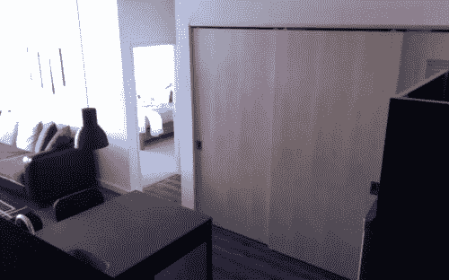
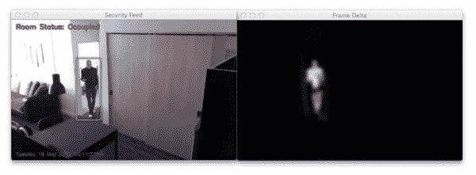
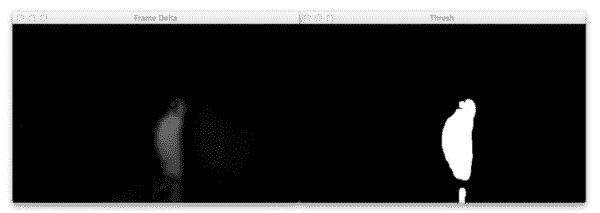
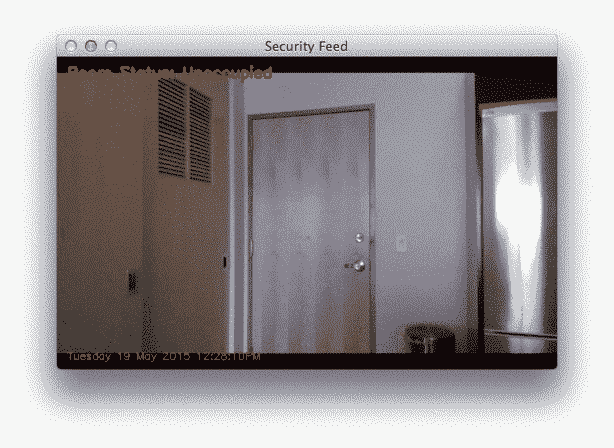

# 用 Python 和 OpenCV 实现基本的运动检测和跟踪

> 原文：<https://pyimagesearch.com/2015/05/25/basic-motion-detection-and-tracking-with-python-and-opencv/>

最后更新于 2021 年 7 月 8 日。

> ***那个狗娘养的。我知道他拿走了我最后一瓶啤酒。***

这些话是一个男人永远不应该说的。但是当我关上冰箱门的时候，我在愤怒的厌恶的叹息中喃喃自语。

你看，我刚刚花了 12 个多小时为即将到来的 [PyImageSearch 大师课程](https://pyimagesearch.com/pyimagesearch-gurus/)写内容。我的大脑被烧焦了，几乎像半熟的炒鸡蛋一样从耳朵里漏出来。晚上结束后，我想做的就是放松，看我一直最喜欢的电影*《侏罗纪公园》*，同时啜饮一杯来自 Smuttynose 的冰镇冰精 IPA，Smuttynose 是一家我最近变得相当喜欢的啤酒厂。

但是那个狗娘养的詹姆斯昨晚过来喝了我最后一瓶啤酒。

嗯， ***据称是*** 。

我实际上无法证明任何事情。事实上，我并没有真正看到*喝着啤酒，我的脸埋在笔记本电脑里，手指在键盘上浮动，狂热地敲打着教程和文章。*但我感觉他是罪魁祸首。*他是我唯一喝 IPAs 的(前)朋友。*

所以我做了任何男人都会做的事。

***我在厨房橱柜顶上安装了一个树莓派，以自动检测他是否试图再次拉啤酒偷屎:***

过度？

也许吧。

但是我很重视我的啤酒。如果詹姆斯再想偷我的啤酒，我会当场抓住他。

*   【2021 年 7 月更新:添加了关于 OpenCV 中可使用的替代背景减除和运动检测算法的新章节。

## 关于运动检测的两部分系列

**这是*两部分系列*中的*第一篇*关于建立家庭监控的运动检测和跟踪系统。**

本文的其余部分将详细介绍如何使用计算机视觉技术构建一个基本的运动检测和跟踪系统，用于家庭监控。这个例子将与来自你的网络摄像头的*预先录制的视频*和*实时流一起工作；然而，我们将在我们的笔记本电脑/台式机上开发这个系统。*

在本系列的第二篇文章中，我将向您展示如何更新代码以与您的 Raspberry Pi 和相机板配合使用，以及如何扩展您的家庭监控系统以捕捉任何检测到的运动并将其上传到您的个人 Dropbox。

也许在这一切结束时，我们可以抓住赤手詹姆斯…

## 一点点关于背景减法

背景减除在许多计算机视觉应用中是至关重要的。我们用它来计算通过收费站的汽车数量。我们用它来计算进出商店的人数。

我们用它来进行运动检测。

在本文开始编码之前，我想说在 OpenCV 中有很多方法来执行运动检测、跟踪和分析。有些很简单。其他的就很复杂了。两种主要方法是基于高斯混合模型的前景和背景分割形式:

1.  [*KaewTraKulPong 等人提出的一种改进的自适应背景混合模型，通过`cv2.BackgroundSubtractorMOG`函数进行实时跟踪，并带有阴影检测*](http://www.ee.surrey.ac.uk/CVSSP/Publications/papers/KaewTraKulPong-AVBS01.pdf) 。
2.  [*改进的自适应高斯混合模型用于背景减除*](http://www.zoranz.net/Publications/zivkovic2004ICPR.pdf) 由 Zivkovic，以及 *[高效的自适应密度估计每图像像素用于背景减除](http://www.zoranz.net/Publications/zivkovicPRL2006.pdf)* 的任务，也由 Zivkovic，可通过`cv2.BackgroundSubtractorMOG2`函数获得。

在 OpenCV 的新版本中，我们有基于贝叶斯(概率)的前景和背景分割，实现自 Godbehere 等人 2012 年的论文 *[在可变光照条件下对人类参观者的视觉跟踪，用于响应音频艺术装置](http://goldberg.berkeley.edu/pubs/acc-2012-visual-tracking-final.pdf)* 。我们可以在`cv2.createBackgroundSubtractorGMG`函数中找到这个实现(不过我们将等待 OpenCV 3 完全使用这个函数)。

所有这些方法都与*从前景中分割出背景*有关(它们甚至为我们提供了辨别实际运动和阴影以及小的光照变化的机制)！

那么，这为什么如此重要呢？为什么我们要关心哪些像素属于*前景*，哪些像素属于*背景*？

在运动检测中，我们倾向于做出以下假设:

我们视频流的*背景*很大程度上是*静止不变的*。因此，如果我们可以对背景建模，我们就可以监控它的实质性变化。如果有实质性的变化，我们可以检测到——这种变化通常对应于我们视频上的*运动*。

显然，在现实世界中，这个假设很容易失败。由于阴影、反射、照明条件和环境中任何其他可能的变化，我们的背景在视频的不同帧中可能看起来非常不同。如果背景看起来不一样，它会打乱我们的算法。这就是为什么最成功的背景减除/前景检测系统*利用固定安装的摄像机*和在*受控的照明条件下。*

我上面提到的方法虽然非常强大，但是计算量也很大。因为我们的最终目标是在这个 2 部分系列的最后将这个系统部署到 Raspberry Pi，所以我们最好坚持简单的方法。我们将在以后的博客文章中回到这些更强大的方法，但目前我们将保持它的简单和高效。

在这篇博文的剩余部分，我将详细介绍(可以说)你可以建立的最基本的运动检测和跟踪系统。它不会是完美的，但它将能够在 Pi 上运行，并且仍然能够提供好的结果。

## 用 Python 和 OpenCV 实现基本的运动检测和跟踪

好吧，你准备好帮我开发一个家庭监控系统来抓那个偷啤酒的混蛋了吗？

打开一个编辑器，创建一个新文件，命名为`motion_detector.py`，让我们开始编码:

```
# import the necessary packages
from imutils.video import VideoStream
import argparse
import datetime
import imutils
import time
import cv2

# construct the argument parser and parse the arguments
ap = argparse.ArgumentParser()
ap.add_argument("-v", "--video", help="path to the video file")
ap.add_argument("-a", "--min-area", type=int, default=500, help="minimum area size")
args = vars(ap.parse_args())

# if the video argument is None, then we are reading from webcam
if args.get("video", None) is None:
	vs = VideoStream(src=0).start()
	time.sleep(2.0)

# otherwise, we are reading from a video file
else:
	vs = cv2.VideoCapture(args["video"])

# initialize the first frame in the video stream
firstFrame = None

```

**2-7 线**进口我们必要的包装。所有这些看起来应该都很熟悉，除了`imutils`包，这是我创建的一组方便的函数，用来简化基本的图像处理任务。如果您的系统上还没有安装 [imutils](https://github.com/jrosebr1/imutils) ，您可以通过 pip: `pip install imutils`进行安装。

接下来，我们将解析第 10-13 行的[命令行参数](https://pyimagesearch.com/2018/03/12/python-argparse-command-line-arguments/)。我们将在这里定义两个开关。第一个是可选的。它只是定义了一个预先录制的视频文件的路径，我们可以在其中检测运动。如果您*不*提供视频文件的路径，那么 OpenCV 将利用您的网络摄像头来检测动作。

我们还将定义`--min-area`，它是被视为实际“运动”的图像区域的最小尺寸(以像素为单位)。正如我将在本教程后面讨论的，我们经常会发现图像的小区域发生了实质性的变化，可能是由于噪声或光照条件的变化。实际上，这些小区域根本不是真正的运动——所以我们将定义一个区域的最小尺寸来对抗和过滤掉这些误报。

**第 16-22 行**处理抓取对我们`vs`对象的引用。在视频文件路径是*而不是*提供的情况下(**第 16-18 行**)，我们将抓取一个对网络摄像头的引用，并等待它预热。如果视频文件*是由*提供的，那么我们将在**的第 21 行和第 22 行**创建一个指向它的指针。

最后，我们将通过定义一个名为`firstFrame`的变量来结束这段代码。

任何关于`firstFrame`是什么的猜测？

如果您猜测它存储了视频文件/网络摄像头流的第一帧，那么您猜对了。

***假设:**我们视频文件的第一帧将包含*无运动*和*仅有背景*——因此，我们可以仅使用视频的第一帧*来模拟我们视频流的背景。

显然，我们在这里做了一个相当大的假设。但是，我们的目标是在树莓 Pi 上运行这个系统，所以我们不能太复杂。正如你将在这篇文章的结果部分看到的，我们能够在跟踪一个人在房间里走动时轻松地检测到运动。

```
# loop over the frames of the video
while True:
	# grab the current frame and initialize the occupied/unoccupied
	# text
	frame = vs.read()
	frame = frame if args.get("video", None) is None else frame[1]
	text = "Unoccupied"

	# if the frame could not be grabbed, then we have reached the end
	# of the video
	if frame is None:
		break

	# resize the frame, convert it to grayscale, and blur it
	frame = imutils.resize(frame, width=500)
	gray = cv2.cvtColor(frame, cv2.COLOR_BGR2GRAY)
	gray = cv2.GaussianBlur(gray, (21, 21), 0)

	# if the first frame is None, initialize it
	if firstFrame is None:
		firstFrame = gray
		continue

```

现在我们有了对视频文件/网络摄像头流的引用，我们可以开始循环第 28 行的每一帧。

对第 31 行**上的`vs.read()`的调用返回了一个帧，我们确保我们在第 32** 行**上正确地抓取了该帧。**

我们还将定义一个名为`text`的字符串，并对其进行初始化，以表明我们正在监视的房间是“未被占用的”。如果房间里确实有活动，我们可以更新这个字符串。

如果没有从视频文件中成功读取一帧，我们将从第 37 行**和第 38 行**的循环中断开。

现在我们可以开始处理我们的帧，并为运动分析做准备(**第 41-43 行**)。我们首先将它的宽度缩小到 500 像素——不需要直接从视频流中处理大的原始图像。我们还将图像转换为灰度，因为颜色与我们的运动检测算法无关。最后，我们将应用高斯模糊来平滑我们的图像。

重要的是要明白，即使是视频流的连续帧也不会完全相同！

由于数码相机传感器的微小差异，没有两帧是 100%相同的——一些像素肯定会有不同的亮度值。也就是说，我们需要考虑这一点，并将高斯平滑应用于整个 *21 x 21* 区域(**第 43 行**)的平均像素强度。这有助于消除可能干扰我们运动检测算法的高频噪声。

正如我上面提到的，我们需要以某种方式模拟图像的背景。同样，我们将假设视频流的第一帧包含*无运动*，并且是我们背景看起来像什么的*好例子*。如果`firstFrame`没有初始化，我们将存储它以供参考，并继续处理视频流的下一帧(**第 46-48 行**)。

以下是示例视频的第一帧:

[](https://pyimagesearch.com/wp-content/uploads/2015/05/first_frame_example_02.jpg)

**Figure 2:** Example first frame of a video file. Notice how it’s a still-shot of the background, no motion is taking place.

上面的帧满足了视频的第一帧仅仅是静态背景的假设——没有运动发生。

给定这个静态背景图像，我们现在准备实际执行运动检测和跟踪:

```
	# compute the absolute difference between the current frame and
	# first frame
	frameDelta = cv2.absdiff(firstFrame, gray)
	thresh = cv2.threshold(frameDelta, 25, 255, cv2.THRESH_BINARY)[1]

	# dilate the thresholded image to fill in holes, then find contours
	# on thresholded image
	thresh = cv2.dilate(thresh, None, iterations=2)
	cnts = cv2.findContours(thresh.copy(), cv2.RETR_EXTERNAL,
		cv2.CHAIN_APPROX_SIMPLE)
	cnts = imutils.grab_contours(cnts)

	# loop over the contours
	for c in cnts:
		# if the contour is too small, ignore it
		if cv2.contourArea(c) < args["min_area"]:
			continue

		# compute the bounding box for the contour, draw it on the frame,
		# and update the text
		(x, y, w, h) = cv2.boundingRect(c)
		cv2.rectangle(frame, (x, y), (x + w, y + h), (0, 255, 0), 2)
		text = "Occupied"

```

现在我们已经通过`firstFrame`变量对背景进行了建模，我们可以利用它来计算视频流中初始帧和后续新帧之间的差异。

计算两个帧之间的差是一个简单的减法，其中我们取它们对应的像素强度差的绝对值(**行 52** ):

*delta = |背景 _ 模型–当前 _ 帧|*

帧增量的示例如下所示:

[](https://pyimagesearch.com/wp-content/uploads/2015/05/frame_delta_example.jpg)

**Figure 3:** An example of the frame delta, the difference between the original first frame and the current frame.

注意图像的背景是如何清晰地变成黑色的。然而，包含运动的区域(比如我在房间里走动的区域)要比*亮得多*。这意味着较大的帧增量表示图像中正在发生运动。

然后，我们将对第 53 条线**上的`frameDelta`进行阈值处理，以显示图像中仅在像素强度值上有*显著*变化的区域。如果 delta 小于 *25* ，我们丢弃该像素并将其设置为黑色(即背景)。如果 delta 大于 *25* ，我们会将其设置为白色(即前景)。下面是我们的阈值化增量图像的一个示例:**

[](https://pyimagesearch.com/wp-content/uploads/2015/05/frame_delta_thresholded.jpg)

**Figure 4:** Thresholding the frame delta image to segment the foreground from the background.

再次注意，图像的背景是黑色的，而前景(以及运动发生的地方)是白色的。

给定这个阈值图像，很容易应用轮廓检测来找到这些白色区域的轮廓(**行 58-60** )。

我们开始循环第 63 行**上的每个轮廓，在这里我们将过滤第 65**行和第 66** 行上的无关的小轮廓。**

如果轮廓面积大于我们提供的`--min-area`，我们将在**第 70 行和第 71 行**绘制包围前景和运动区域的边界框。我们还将更新我们的`text`状态字符串，以表明该房间“已被占用”。

```
	# draw the text and timestamp on the frame
	cv2.putText(frame, "Room Status: {}".format(text), (10, 20),
		cv2.FONT_HERSHEY_SIMPLEX, 0.5, (0, 0, 255), 2)
	cv2.putText(frame, datetime.datetime.now().strftime("%A %d %B %Y %I:%M:%S%p"),
		(10, frame.shape[0] - 10), cv2.FONT_HERSHEY_SIMPLEX, 0.35, (0, 0, 255), 1)

	# show the frame and record if the user presses a key
	cv2.imshow("Security Feed", frame)
	cv2.imshow("Thresh", thresh)
	cv2.imshow("Frame Delta", frameDelta)
	key = cv2.waitKey(1) & 0xFF

	# if the `q` key is pressed, break from the lop
	if key == ord("q"):
		break

# cleanup the camera and close any open windows
vs.stop() if args.get("video", None) is None else vs.release()
cv2.destroyAllWindows()

```

这个例子的其余部分简单地包装了一切。我们在左上角的图像上画出房间状态，然后在左下角画出时间戳(让它看起来像“真实的”安全录像)。

**第 81-83 行**显示了我们的工作结果，让我们可以直观地看到视频中是否检测到任何运动，以及帧增量和阈值图像，以便我们可以调试我们的脚本。

***注意:**如果你下载了这篇文章的代码，并打算将其应用到你自己的视频文件中，你可能需要调整`cv2.threshold`和`--min-area`参数的值，以获得最佳的照明条件。*

最后，**行 91 和 92** 清理并释放视频流指针。

### 结果

显然，我想在偷啤酒的詹姆斯再次拜访我之前，确保我们的运动检测系统正常工作——我们将在本系列的第 2 部分讨论这个问题。为了使用 Python 和 OpenCV 测试我们的运动检测系统，我创建了两个视频文件。

首先，`example_01.mp4`监视我公寓的前门，并检测门何时打开。第二张，`example_02.mp4`是用安装在我厨房橱柜上的树莓 Pi 拍摄的。它俯视厨房和客厅，检测人们走动时的动作。

让我们试试我们的简单检测器。打开终端并执行以下命令:

```
$ python motion_detector.py --video videos/example_01.mp4

```

下面是来自运动检测的一些静止帧的. gif:

[](https://pyimagesearch.com/wp-content/uploads/2015/05/animated_motion_01.gif)

**Figure 5:** A few example frames of our motion detection system in Python and OpenCV in action.

请注意，直到门打开时才检测到运动——然后我们能够检测到自己走进门。你可以在这里看到完整的视频:

<https://www.youtube.com/embed/fi4LORwk8Fc?feature=oembed>