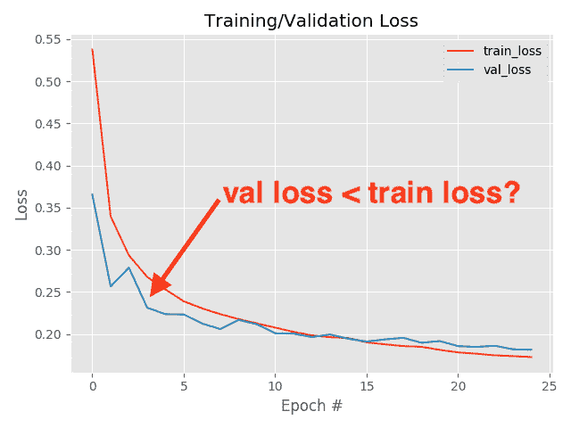
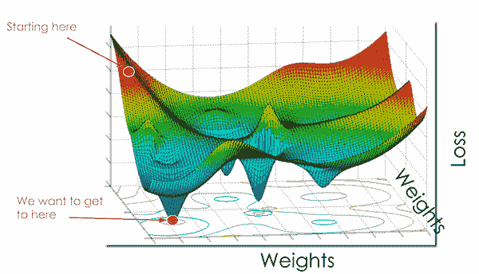
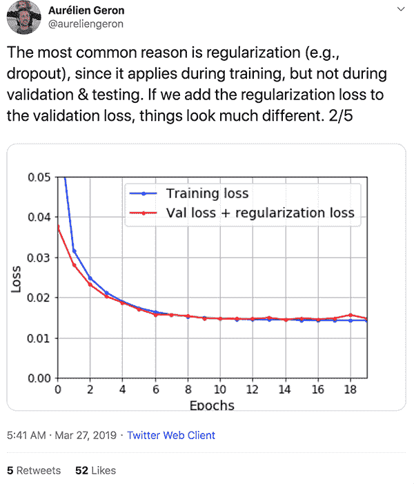
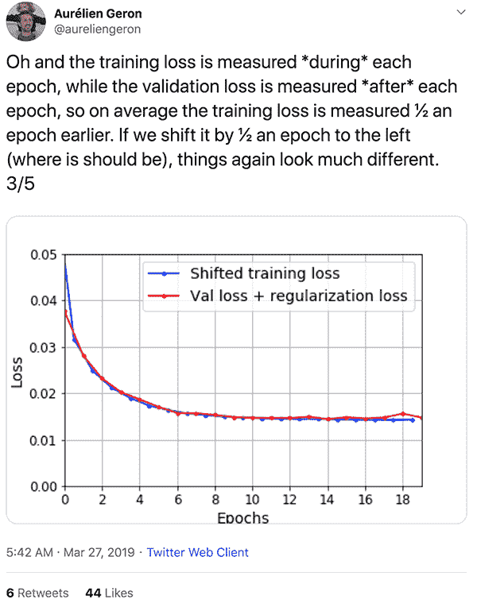
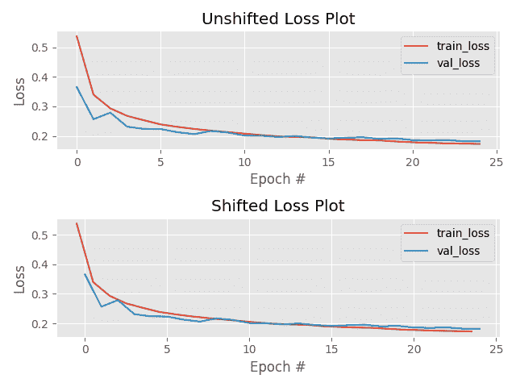
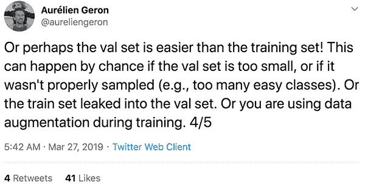
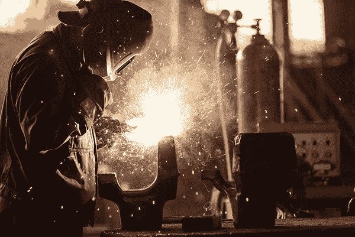

# 为什么我的验证损失低于培训损失？

> 原文：<https://pyimagesearch.com/2019/10/14/why-is-my-validation-loss-lower-than-my-training-loss/>

在本教程中，您将了解在训练您自己的自定义深度神经网络时，验证损失可能低于训练损失的三个主要原因。

我第一次对研究机器学习和神经网络感兴趣是在高中后期。那时候没有很多可访问的机器学习库，当然也没有 scikit-learn。

[](https://pyimagesearch.com/wp-content/uploads/2019/10/train_val_header.png)

每天下午 2 点 35 分，我会离开高中，跳上回家的公交车，在 15 分钟内，我会在我的笔记本电脑前，研究机器学习，并试图用手实现各种算法。

我很少停下来休息，只是偶尔不吃晚饭，这样我就可以继续工作和学习到深夜。

在这些深夜会议**中，我会*手工实现*模型和优化算法**(用所有语言的 Java 当时我也在学 Java)。

由于它们是由一个初露头角的高中程序员手工实现的 ML 算法，而他只学过一门微积分课程，**我的实现毫无疑问*容易出现错误*。**

我特别记得一个晚上。

时间是凌晨 1 点半。我累了。我饿了(因为我没吃晚饭)。我很担心第二天的西班牙语考试，我肯定不是为了考试而学习的。

我试图训练一个简单的前馈神经网络，根据基本的颜色通道统计(即平均值和标准偏差)对图像内容进行分类。

我的网络正在训练…但是我遇到了一个非常奇怪的现象:

**我的验证损失低于培训损失！**

这怎么可能呢？

*   **我是否不小心切换了训练和验证损失的图标签？**潜在地。我没有像 matplotlib 这样的绘图库，所以我的损失日志被传输到一个 CSV 文件，然后在 Excel 中绘制。肯定容易出现人为错误。
*   我的代码中有错误吗？几乎可以肯定。我同时在自学 Java 和机器学习——那些代码中肯定有某种错误。
*   我是不是太累了以至于我的大脑无法理解？也很有可能。在我生命的那段时间里，我睡得不多，很容易忽略一些显而易见的东西。

但是，事实证明上面的情况都不是*——**我的验证损失*比我的培训损失*要低。***

直到大学三年级，我第一次参加正式的机器学习课程，我才终于明白为什么验证损失可以低于训练损失。

几个月前，杰出的作者 aurélien Geron[发布了一条 tweet 线程](https://twitter.com/aureliengeron/status/1110839223878184960),简明地解释了为什么你可能会遇到验证损失低于培训损失的情况。

我受到 Aurélien 精彩解释的启发，想在这里用我自己的评论和代码来分享它，确保没有学生(像我多年前一样)必须挠头想知道*“为什么我的验证损失低于我的培训损失？!"*。

**要了解验证损失可能低于培训损失的三个主要原因，*请继续阅读！***

## 为什么我的验证损失低于培训损失？

在本教程的第一部分，我们将讨论神经网络中“损失”的概念，包括损失代表什么以及我们为什么要测量它。

从那里，我们将实现一个基本的 CNN 和训练脚本，然后使用我们新实现的 CNN 运行一些实验(这将导致我们的验证损失低于我们的训练损失)。

根据我们的结果，我将解释您的验证损失可能低于培训损失的三个主要原因。

### 训练一个神经网络，什么是“损失”？

[](https://pyimagesearch.com/wp-content/uploads/2019/10/train_val_loss_landscape.png)

**Figure 1:** What is the “loss” in the context of machine/deep learning? And why is my validation loss lower than my training loss? ([image source](https://medium.com/@RosieCampbell/demystifying-deep-neural-nets-efb726eae941))

在最基本的层面上，损失函数量化了给定预测器在对数据集中的输入数据点进行分类时的“好坏”程度。

损失越小，分类器在对输入数据和输出目标之间的关系进行建模方面的工作就越好。

也就是说，有一点我们可以过度拟合我们的模型——通过对训练数据*建模过于接近*，我们的模型失去了概括的能力。

**因此，我们寻求:**

1.  **降低我们的损失，**从而提高我们模型的准确性。
2.  **尽快完成**并尽可能少地进行超参数更新/实验。
3.  所有的**都不会过度拟合**我们的网络，也不会过于紧密地模拟训练数据。

这是一种平衡行为，我们对损失函数和模型优化器的选择会极大地影响我们最终模型的质量、准确性和可推广性。

典型的损失函数(也称为“目标函数”或“得分函数”)包括:

*   二元交叉熵
*   范畴交叉熵
*   稀疏分类交叉熵
*   均方误差
*   平均绝对误差
*   标准铰链
*   方形铰链

对损失函数的全面回顾超出了这篇文章的范围，但是目前，只要理解对于大多数任务:

*   损失衡量你的模型的“好”
*   损失越小越好
*   但是你需要小心不要吃太多

若要在训练您自己的自定义神经网络时了解有关损失函数的角色的更多信息，请确保:

*   阅读此[关于参数化学习和线性分类的介绍](https://pyimagesearch.com/2016/08/22/an-intro-to-linear-classification-with-python/)。
*   浏览下面关于 [Softmax 分类器](https://pyimagesearch.com/2016/09/12/softmax-classifiers-explained/)的教程。
*   请参考本指南关于[多级 SVM 损耗](https://pyimagesearch.com/2016/09/05/multi-class-svm-loss/)的内容。

此外，如果您想要一份关于损失函数在机器学习/神经网络中作用的完整、分步指南，请确保您阅读 [*使用 Python 对计算机视觉进行深度学习*](https://pyimagesearch.com/deep-learning-computer-vision-python-book/) ，在那里我详细解释了参数化学习和损失方法(包括代码和实验)。

### 项目结构

继续使用本文的 ***【下载】*** 部分下载源代码。从那里，通过`tree`命令检查项目/目录结构:

```
$ tree --dirsfirst
.
├── pyimagesearch
│   ├── __init__.py
│   └── minivggnet.py
├── fashion_mnist.py
├── plot_shift.py
└── training.pickle

1 directory, 5 files

```

今天我们将使用较小版本的 VGGNet，称为 MiniVGGNet。`pyimagesearch`模块包括这个 CNN。

我们的脚本在时尚 MNIST 数据集上训练 MiniVGGNet。我在之前的博客文章中写过关于在时尚 MNIST 上培训 MiniVGGNet 的文章，所以今天我们不会谈论太多细节。

今天的训练脚本生成一个`training.pickle`文件，记录训练准确度/损失历史。在下面的 ***原因#2*** 部分中，我们将使用`plot_shift.py`将培训损失图移动半个时期，以证明当验证损失低于培训损失时，测量损失的时间起作用。

现在让我们深入三个原因来回答这个问题，*“为什么我的验证损失低于我的培训损失？”*。

### 原因#1:在培训期间应用了正则化，但在验证/测试期间没有应用

[](https://pyimagesearch.com/wp-content/uploads/2019/10/train_val_tweet01.png)

**Figure 2:** Aurélien answers the question: *“Ever wonder why validation loss > training loss?”* on his twitter feed ([image source](https://twitter.com/aureliengeron/status/1110839345609465856?s=20)). The first reason is that regularization is applied during training but not during validation/testing.

当训练深度神经网络时，我们经常应用**正则化**来帮助我们的模型:

1.  **获得更高的验证/测试精度**
2.  理想情况下，**更好地概括**验证和测试集之外的数据

正则化方法通常**牺牲训练精度来提高验证/测试精度**——在某些情况下，这可能导致验证损失低于训练损失。

**其次，请记住，在验证/测试阶段，退出等正则化方法*不会*应用。**

正如 Aurélien 在**图 2** 中所示，将正则化因素纳入验证损失(例如在验证/测试期间应用下降)可以使你的训练/验证损失曲线看起来更相似。

### 原因#2:在每个时期的期间测量训练损失*，而在每个时期的*之后测量验证损失

*[](https://pyimagesearch.com/wp-content/uploads/2019/10/train_val_tweet02.png)

**Figure 3:** Reason #2 for validation loss sometimes being less than training loss has to do with when the measurement is taken ([image source](https://twitter.com/aureliengeron/status/1110839480024338432?s=20)).

您可能看到验证损失低于培训损失的第二个原因是损失值的测量和报告方式:

1.  在每个时期的期间测量训练损失
**   而验证损失是在每个时期的之后的*测量的**

 *你的训练损失在整个时期内不断被报告；然而，**验证度量仅在当前训练时期完成后才在验证集*上计算。***

这意味着，平均而言，培训损失是在半个时期之前测量的。

如果将训练损失向左移动半个历元，您会看到训练值和损失值之间的差距要小得多。

有关这种行为的实际例子，请阅读下面一节。

#### 实施我们的培训脚本

我们将实现一个简单的 Python 脚本，在时尚 MNIST 数据集上训练一个小型的类似 VGG 的网络(称为 MiniVGGNet)。在培训期间，我们会将培训和验证损失保存到磁盘。然后，我们将创建一个单独的 Python 脚本来比较未偏移和偏移损失图。

让我们从实施培训脚本开始:

```
# import the necessary packages
from pyimagesearch.minivggnet import MiniVGGNet
from sklearn.metrics import classification_report
from tensorflow.keras.optimizers import SGD
from tensorflow.keras.datasets import fashion_mnist
from tensorflow.keras.utils import to_categorical
import argparse
import pickle

# construct the argument parser and parse the arguments
ap = argparse.ArgumentParser()
ap.add_argument("-i", "--history", required=True,
	help="path to output training history file")
args = vars(ap.parse_args())

```

**第 2-8 行**导入我们需要的包、模块、类和函数。也就是说，我们导入`MiniVGGNet`(我们的 CNN)、`fashion_mnist`(我们的数据集)和`pickle`(确保我们可以为*单独的*脚本序列化我们的训练历史以处理绘图)。

[命令行参数](https://pyimagesearch.com/2018/03/12/python-argparse-command-line-arguments/)，`--history`，指向单独的`.pickle`文件，该文件将很快包含我们的训练历史(**第 11-14 行**)。

然后，我们初始化几个超参数，即我们要训练的时期数、初始学习速率和批量大小:

```
# initialize the number of epochs to train for, base learning rate,
# and batch size
NUM_EPOCHS = 25
INIT_LR = 1e-2
BS = 32

```

然后，我们加载并预处理我们的时尚 MNIST 数据:

```
# grab the Fashion MNIST dataset (if this is your first time running
# this the dataset will be automatically downloaded)
print("[INFO] loading Fashion MNIST...")
((trainX, trainY), (testX, testY)) = fashion_mnist.load_data()

# we are using "channels last" ordering, so the design matrix shape
# should be: num_samples x rows x columns x depth
trainX = trainX.reshape((trainX.shape[0], 28, 28, 1))
testX = testX.reshape((testX.shape[0], 28, 28, 1))

# scale data to the range of [0, 1]
trainX = trainX.astype("float32") / 255.0
testX = testX.astype("float32") / 255.0

# one-hot encode the training and testing labels
trainY = to_categorical(trainY, 10)
testY = to_categorical(testY, 10)

# initialize the label names
labelNames = ["top", "trouser", "pullover", "dress", "coat",
	"sandal", "shirt", "sneaker", "bag", "ankle boot"]

```

**第 25-34 行**加载并预处理训练/验证数据。

**第 37 行和第 38 行**将我们的类标签二进制化，而**第 41 行和第 42 行**列出了人类可读的类标签名称，用于稍后的分类报告。

在这里，我们拥有了根据 MNIST 时装数据编译和训练 MiniVGGNet 模型所需的一切:

```
# initialize the optimizer and model
print("[INFO] compiling model...")
opt = SGD(lr=INIT_LR, momentum=0.9, decay=INIT_LR / NUM_EPOCHS)
model = MiniVGGNet.build(width=28, height=28, depth=1, classes=10)
model.compile(loss="categorical_crossentropy", optimizer=opt,
	metrics=["accuracy"])

# train the network
print("[INFO] training model...")
H = model.fit(trainX, trainY,
	validation_data=(testX, testY),
	 batch_size=BS, epochs=NUM_EPOCHS)

```

**第 46-49 行**初始化并编译`MiniVGGNet`模型。

**线 53-55** 然后安装/训练`model`。

在这里，我们将评估我们的`model`并序列化我们的培训历史:

```
# make predictions on the test set and show a nicely formatted
# classification report
preds = model.predict(testX)
print("[INFO] evaluating network...")
print(classification_report(testY.argmax(axis=1), preds.argmax(axis=1),
	target_names=labelNames))

# serialize the training history to disk
print("[INFO] serializing training history...")
f = open(args["history"], "wb")
f.write(pickle.dumps(H.history))
f.close()

```

**第 59-62 行**对测试集进行预测，并向终端打印分类报告。

**第 66-68 行**将我们的训练准确性/损失历史序列化到一个`.pickle`文件中。我们将使用*单独的* Python 脚本中的训练历史来绘制损耗曲线，包括一个显示半个纪元偏移的图。

继续使用本教程的 ***【下载】*** 部分下载源代码。

从那里，打开一个终端并执行以下命令:

```
$ python fashion_mnist.py --history training.pickle
[INFO] loading Fashion MNIST...
[INFO] compiling model...
[INFO] training model...
Train on 60000 samples, validate on 10000 samples   
Epoch 1/25
60000/60000 [==============================] - 200s 3ms/sample - loss: 0.5433 - accuracy: 0.8181 - val_loss: 0.3281 - val_accuracy: 0.8815
Epoch 2/25
60000/60000 [==============================] - 194s 3ms/sample - loss: 0.3396 - accuracy: 0.8780 - val_loss: 0.2726 - val_accuracy: 0.9006
Epoch 3/25
60000/60000 [==============================] - 193s 3ms/sample - loss: 0.2941 - accuracy: 0.8943 - val_loss: 0.2722 - val_accuracy: 0.8970
Epoch 4/25
60000/60000 [==============================] - 193s 3ms/sample - loss: 0.2717 - accuracy: 0.9017 - val_loss: 0.2334 - val_accuracy: 0.9144
Epoch 5/25
60000/60000 [==============================] - 194s 3ms/sample - loss: 0.2534 - accuracy: 0.9086 - val_loss: 0.2245 - val_accuracy: 0.9194
...
Epoch 21/25
60000/60000 [==============================] - 195s 3ms/sample - loss: 0.1797 - accuracy: 0.9340 - val_loss: 0.1879 - val_accuracy: 0.9324
Epoch 22/25
60000/60000 [==============================] - 194s 3ms/sample - loss: 0.1814 - accuracy: 0.9342 - val_loss: 0.1901 - val_accuracy: 0.9313
Epoch 23/25
60000/60000 [==============================] - 193s 3ms/sample - loss: 0.1766 - accuracy: 0.9351 - val_loss: 0.1866 - val_accuracy: 0.9320
Epoch 24/25
60000/60000 [==============================] - 193s 3ms/sample - loss: 0.1770 - accuracy: 0.9347 - val_loss: 0.1845 - val_accuracy: 0.9337
Epoch 25/25
60000/60000 [==============================] - 194s 3ms/sample - loss: 0.1734 - accuracy: 0.9372 - val_loss: 0.1871 - val_accuracy: 0.9312
[INFO] evaluating network...
              precision    recall  f1-score   support

         top       0.87      0.91      0.89      1000
     trouser       1.00      0.99      0.99      1000
    pullover       0.91      0.91      0.91      1000
       dress       0.93      0.93      0.93      1000
        coat       0.87      0.93      0.90      1000
      sandal       0.98      0.98      0.98      1000
       shirt       0.83      0.74      0.78      1000
     sneaker       0.95      0.98      0.97      1000
         bag       0.99      0.99      0.99      1000
  ankle boot       0.99      0.95      0.97      1000

    accuracy                           0.93     10000
   macro avg       0.93      0.93      0.93     10000
weighted avg       0.93      0.93      0.93     10000

[INFO] serializing training history...

```

检查工作目录的内容，您应该有一个名为`training.pickle`的文件——该文件包含我们的培训历史日志。

```
$ ls *.pickle
training.pickle

```

在下一节中，我们将学习如何绘制这些值，并将我们的训练信息向左移动半个历元，从而使我们的训练/验证损失曲线看起来更相似。

#### 转移我们的培训损失值

我们的`plot_shift.py`脚本用于绘制来自`fashion_mnist.py`的训练历史输出。使用这个脚本，我们可以研究如何将我们的训练损失向左移动半个历元，使我们的训练/验证图看起来更相似。

打开`plot_shift.py`文件并插入以下代码:

```
# import the necessary packages
import matplotlib.pyplot as plt
import numpy as np
import argparse
import pickle

# construct the argument parser and parse the arguments
ap = argparse.ArgumentParser()
ap.add_argument("-i", "--input", required=True,
	help="path to input training history file")
args = vars(ap.parse_args())

```

**第 2-5 行**导入`matplotlib`(用于绘图)、NumPy(用于简单的数组创建操作)、`argparse` ( [命令行参数](https://pyimagesearch.com/2018/03/12/python-argparse-command-line-arguments/))和`pickle`(用于加载我们的序列化训练历史)。

**第 8-11 行**解析`--input`命令行参数，该参数指向我们在磁盘上的`.pickle`训练历史文件。

让我们继续加载我们的数据并初始化我们的曲线图:

```
# load the training history
H = pickle.loads(open(args["input"], "rb").read())

# determine the total number of epochs used for training, then
# initialize the figure
epochs = np.arange(0, len(H["loss"]))
plt.style.use("ggplot")
(fig, axs) = plt.subplots(2, 1)

```

**第 14 行**使用`--input`命令行参数加载我们的序列化训练历史`.pickle`文件。

**第 18 行**为我们的 *x* 轴腾出空间，该轴在训练历史中的跨度从 0 到数字`epochs`。

**第 19 行和第 20 行**将我们的绘图图设置为同一图像中的两个堆叠图:

*   顶部的**图**将按原样包含损耗曲线。
*   另一方面，**底部图**将包括训练损失的偏移(但不包括验证损失)。正如奥雷连恩的推文中所说，训练损失将向左移动半个时代。然后我们将能够观察到这些图是否排列得更紧密。

让我们生成我们的**顶部图:**

```
# plot the *unshifted* training and validation loss
plt.style.use("ggplot")
axs[0].plot(epochs, H["loss"], label="train_loss")
axs[0].plot(epochs, H["val_loss"], label="val_loss")
axs[0].set_title("Unshifted Loss Plot")
axs[0].set_xlabel("Epoch #")
axs[0].set_ylabel("Loss")
axs[0].legend()

```

然后画出我们的**底图:**

```
# plot the *shifted* training and validation loss
axs[1].plot(epochs - 0.5, H["loss"], label="train_loss")
axs[1].plot(epochs, H["val_loss"], label="val_loss")
axs[1].set_title("Shifted Loss Plot")
axs[1].set_xlabel("Epoch #")
axs[1].set_ylabel("Loss")
axs[1].legend()

# show the plots
plt.tight_layout()
plt.show()

```

请注意第 32 行的**处的 ***培训损失被移至`0.5`时代的左侧*——本例的中心。****

现在让我们分析我们的训练/验证图。

打开终端并执行以下命令:

```
$ python plot_shift.py --input training.pickle

```

[](https://pyimagesearch.com/wp-content/uploads/2019/10/train_val_shifted_plot.png)

**Figure 4:** Shifting the training loss plot 1/2 epoch to the left yields more similar plots. Clearly the time of measurement answers the question, *“Why is my validation loss lower than training loss?”.*

正如您所观察到的，将训练损失值向左移动半个历元(*底部*)使得训练/验证曲线与未移动(*顶部*)的曲线更加相似。

### 原因 3:验证集可能比训练集更容易(或者可能有漏洞)

[](https://pyimagesearch.com/wp-content/uploads/2019/10/train_val_tweet03.png)

**Figure 5:** Consider how your validation set was acquired/generated. Common mistakes could lead to validation loss being less than training loss. ([image source](https://twitter.com/aureliengeron/status/1110839534013472769?s=20))

验证损失低于训练损失的最后一个最常见的原因是由于数据分布本身。

**考虑您的验证集是如何获得的:**

*   您能保证验证集是从与定型集相同的分布中取样的吗？
*   你确定验证示例和你的训练图像一样具有挑战性吗？
*   你能保证没有“数据泄漏”(例如，训练样本偶然混入验证/测试样本)？
*   您确信您的代码正确地创建了训练、验证和测试分割吗？

**每一个深度学习从业者在职业生涯中都至少犯过一次以上的错误*。***

 *是的，当这种情况发生时会很尴尬——但这就是问题的关键——这种情况*确实会发生，所以现在花点时间研究一下你的代码。*

### 额外收获:你训练的够努力吗？

[](https://pyimagesearch.com/wp-content/uploads/2019/10/train_val_train_harder.jpg)

**Figure 6:** If you are wondering why your validation loss is lower than your training loss, perhaps you aren’t “training hard enough”.

奥雷连恩在他的推文中没有提到的一个方面是**“足够努力地训练”**的概念。

当训练深度神经网络时，我们最大的担忧几乎总是过拟合——为了克服过拟合，我们引入了**正则化技术**(在上面的*原因#1* 中讨论过)。我们以下列形式应用正则化:

*   拒绝传统社会的人
*   L2 重量衰减
*   降低模型容量(即，更浅的模型)

我们还倾向于在学习率上更保守一点，以确保我们的模型不会超出损失景观中损失较低的区域。

这一切都很好，但有时我们最终会 ***过度规范*我们的模型。**

如果你经历了验证损失低于上述训练损失的所有三个原因，你可能过度规范了你的模型。通过以下方式开始放松你的正规化约束:

*   降低你的 L2 重量衰减强度。
*   减少你申请退学的数量。
*   增加您的模型容量(即，使其更深)。

你也应该尝试用更大的学习率来训练，因为你可能已经变得太保守了。

Summary

今天的教程很大程度上受到了作者 Aurélien Geron 的以下推文的启发。

在帖子中，Aurélien 专业而简洁地解释了在训练深度神经网络时，验证损失可能低于训练损失的三个原因:

1.  **原因#1:** 正则化在训练期间应用，但不在验证/测试期间应用。如果您在验证/测试期间添加正则化损失，您的损失值和曲线将看起来更相似。
2.  **原因#2:** 训练损失在每个历元期间测量*，而验证损失在每个历元*之后测量*。平均而言，训练损失是在 1/2 个时期之前测量的。如果你把你的训练损失曲线向左移动半个纪元，你的损失会对齐得更好。*
3.  **原因#3:** 你的验证集可能比你的训练集容易*或者*你的数据有漏洞/你的代码有 bug。确保您的验证集相当大，并且是从与您的训练集相同的分布(和难度)中取样的。
4.  **奖励:**你可能过度规范了你的模型。尝试减少您的正则化约束，包括增加您的模型容量(即，使用更多参数使其更深)，减少压差，减少 L2 权重衰减强度等。

希望这有助于澄清为什么您的验证损失可能会低于您的培训损失的任何困惑！

当我第一次开始学习机器学习和神经网络时，这对我来说肯定是一个令人挠头的问题，直到我上了大学才明白这到底是为什么——而且*当时没有一个解释像奥雷连恩的解释那样清晰简洁。*

我希望你喜欢今天的教程！

**要下载源代码(并在 PyImageSearch 上发布未来教程时得到通知)，*只需在下表中输入您的电子邮件地址！******