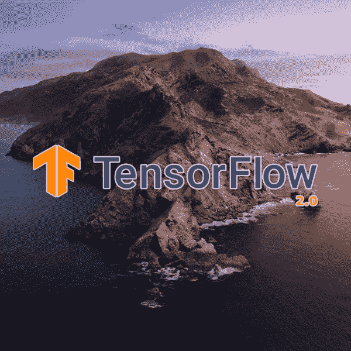
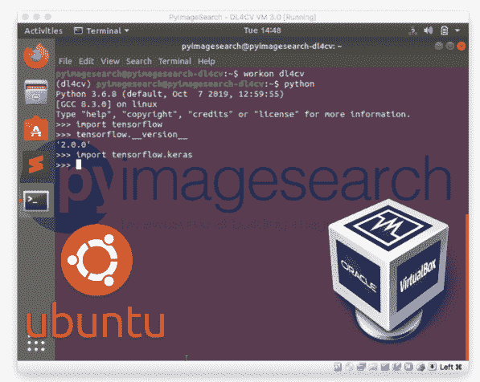
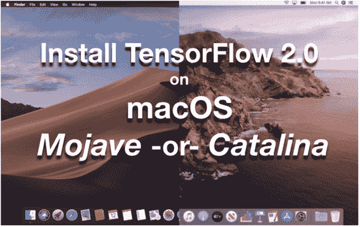
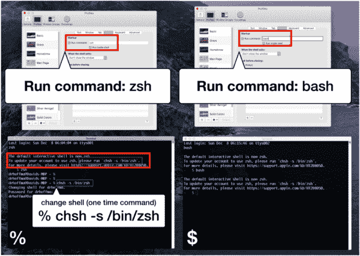
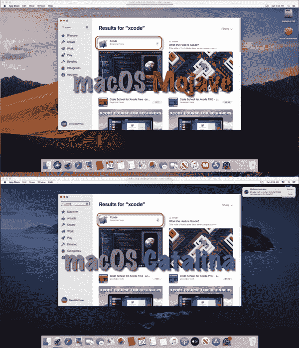
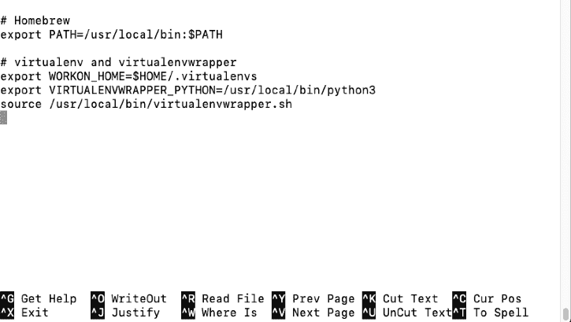
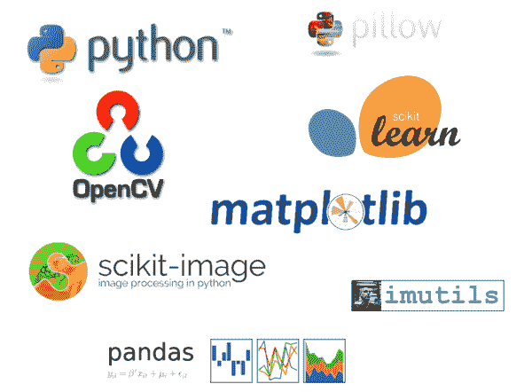
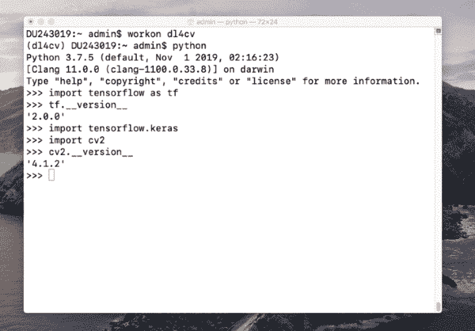

# 如何在 macOS 上安装 TensorFlow 2.0

> 原文：<https://pyimagesearch.com/2019/12/09/how-to-install-tensorflow-2-0-on-macos/>

[](https://pyimagesearch.com/wp-content/uploads/2019/12/tensorflow2_install_macos_header.png)

在本教程中，您将学习在运行 Catalina 或 Mojave 的 macOS 系统上安装 TensorFlow 2.0

TensorFlow 2.0 中有许多重要的更新，包括急切执行、自动微分和更好的多 GPU/分布式训练支持，**但*最重要的更新*是 Keras 现在是 TensorFlow 的*官方*高级深度学习 API。**

此外，如果你有我的书《用 Python 进行计算机视觉的深度学习[](https://pyimagesearch.com/deep-learning-computer-vision-python-book/)*的副本，你应该使用这个指南在你的 macOS 系统上正确安装 TensorFlow 2.0。*

 *在本教程中，您将学习如何在 macOS 上安装 TensorFlow 2.0(使用 Catalina 或 Mojave)。

或者，[点击这里获取我的 **Ubuntu + TensorFlow 2.0** 安装说明](https://pyimagesearch.com/2019/12/09/how-to-install-tensorflow-2-0-on-ubuntu/)。

**要了解如何在 macOS 上安装 TensorFlow 2.0，*继续阅读。***

## 如何在 macOS 上安装 TensorFlow 2.0

在本教程的第一部分，我们将简要讨论预配置的深度学习开发环境，这是我的书 *[用 Python 进行计算机视觉的深度学习](https://pyimagesearch.com/deep-learning-computer-vision-python-book/)的一部分。*

然后，我们将在 macOS 系统上配置和安装 TensorFlow 2.0。

我们开始吧。

### 预先配置的深度学习环境



**Figure 1:** My deep learning Virtual Machine with TensorFlow, Keras, OpenCV, and all other Deep Learning and Computer Vision libraries you need, pre-configured and pre-installed.

当谈到使用深度学习和 Python 时，我*强烈推荐*使用基于 Unix 的环境。

深度学习工具可以更容易地配置和安装在 Unix 系统上，允许您快速开发和运行神经网络。

当然，配置自己的深度学习+ Python + Linux 开发环境可能是一项非常繁琐的任务，*尤其是*如果您是 Unix 新手，是命令行/终端的初学者，或者是手动编译和安装包的新手。

为了帮助您快速启动深度学习+ Python 教育，我创建了两个预配置的环境:

1.  [**预配置 VirtualBox Ubuntu 虚拟机(VM)**](https://pyimagesearch.com/2017/09/22/deep-learning-python-ubuntu-virtual-machine/) 拥有成功所需的所有必要深度学习库(包括 *Keras* 、 *TensorFlow* 、 *scikit-learn* 、 *scikit-image* 、 *OpenCV* 等) ***预配置*** 和 ***预安装【***
2.  [**预先配置的深度学习亚马逊机器映像(AMI)**](https://pyimagesearch.com/2017/09/20/pre-configured-amazon-aws-deep-learning-ami-with-python/) ，它运行在亚马逊网络服务(AWS)的弹性计算(EC2)基础设施上。互联网上的任何人都可以免费使用这个环境，不管你是否是我的 DL4CV 客户(需要支付云/GPU 费用)。深度学习库是 ***预装的*** 除了 *TFOD API* 、 *Mask R-CNN* 、 *RetinaNet* 、 *mxnet* 之外还包括#1 中列出的两个。

我 ***强烈敦促*** 如果您正在阅读我的书籍，请考虑使用我预先配置的环境。使用预先配置好的环境不是欺骗— **他们只是让你专注于学习，而不是系统管理员的工作。**

如果你更熟悉微软 Azure 的基础设施，一定要[看看他们的 Ubuntu 数据科学虚拟机(DSVM)，包括我对环境的评测](https://pyimagesearch.com/2018/03/21/my-review-of-microsofts-deep-learning-virtual-machine/)。Azure 团队为你维护了一个很好的环境，我不能说他们提供了足够高的支持，同时我确保我所有的深度学习章节都在他们的系统上成功运行。

也就是说，预配置环境并不适合所有人。

在本教程的剩余部分，我们将作为“深度学习系统管理员”在我们的裸机 macOS 上安装 TensorFlow 2.0。

### 配置您的 macOS TensorFlow 2.0 深度学习系统

在计算机上安装 TensorFlow 2.0 的以下说明假设:

*   您拥有系统的管理权限
*   您可以打开一个终端，或者您有一个到目标机器的活动 SSH 连接
*   你知道如何操作命令行。

我们开始吧！

#### 第一步:选择你的 macOS 深度学习平台 Catalina 或 Mojave

[](https://pyimagesearch.com/wp-content/uploads/2019/12/tensorflow2_install_macos_mojave_catlina.png)

**Figure 3:** This tutorial supports installing TensorFlow 2.0 on macOS Mojave or macOS Catalina.

本指南中的这些 TensorFlow 2.0 安装说明与以下操作系统兼容:

1.  **macOS:** 10.15“卡特琳娜”
2.  **macOS:** 10.14“莫哈韦”

或者，[你可以遵循我的 Ubuntu + TensorFlow 2.0 安装说明](https://pyimagesearch.com/2019/12/09/how-to-install-tensorflow-2-0-on-ubuntu/)。

***注:**你可能会疑惑“Windows 呢？”请记住，我不支持 PyImageSearch 博客上的窗口。[你可以在我的常见问题](https://pyimagesearch.com/faqs/single-faq/can-you-help-me-do-___-on-windows)中了解更多关于我的“无窗口政策”。*

#### 第二步(仅限卡特琳娜):选择巴什或 ZSH 作为你的 shell

这一步只针对 **macOS 卡特琳娜*的*T3。如果您使用 Mojave，请忽略此步骤并跳到**步骤#3** 。**

在 macOS Catalina 上，您可以选择使用 Bash shell 或 ZSH shell。

你可能已经习惯了 Bash。先前版本的 macOS 使用 Bash，默认情况下，Ubuntu 也使用 Bash。**苹果公司现已做出决定，今后他们的操作系统将使用 ZSH。**

有什么大不了的，我应该换吗？

描述 Bash 和 ZSH 之间的区别超出了本文的范围——这完全由您决定。我会推荐你阅读这个 [ZSH vs. Bash 教程](https://stackabuse.com/zsh-vs-bash/)来开始，但是同样的，选择权在你。

一方面，您可能会发现这些变化对您没有太大影响，并且使用 ZSH 将非常类似于 Bash。另一方面，高级用户可能会注意到一些附加功能。

如果您将从 High Sierra 或 Mojave 升级到 Catalina，默认情况下，您的系统可能会使用 Bash，除非您通过进入终端配置文件设置来明确更改它。

如果你的电脑*安装了 Catalina，或者你从头开始安装 Catalina*，那么你的系统可能会默认使用 ZSH。

无论哪种方式，如果你决定需要在卡特琳娜上切换，你可以[按照这些指示设置你的个人资料使用 ZSH](http://osxdaily.com/2018/12/29/use-zsh-default-terminal-mac-os-x/) 。

通过*“终端首选项”>“配置文件”>“外壳”*菜单更改外壳相对简单，如图**图 4** 所示:

[](https://pyimagesearch.com/wp-content/uploads/2019/12/tensorflow2_install_macos_zsh.png)

**Figure 4:** Changing your macOS Catalina shell to ZSH (left), a step you may wish to do before installing TensorFlow 2.0 on macOS (**[click for high-res](https://pyimagesearch.com/wp-content/uploads/2019/12/tensorflow2_install_macos_zsh.png)**).

**您使用的 shell 决定了您稍后在本安装指南中编辑哪个终端配置文件:**

*   **ZSH:** `~/.zshrc`
*   **迎头痛击:** `~/.bash_profile`

如果你从`~/.zshrc`内部采购，ZSH 将会满足`~/.bash_profile`。请记住，不是所有的设置都有效。例如，在我的`~/.bash_profile`中，我有一个定制的 bash 提示符，它只显示当前最低级别的工作目录(更短)以及我正在工作的 Git 库的哪个分支(对软件开发有用)。问题是 ZSH 不喜欢我定制的 Bash 提示符，所以我必须删除它。我将不得不建立一个自定义的 ZSH 提示在未来。

实际上，如果将所需的 Bash 配置文件中的设置复制到 ZSH 配置文件中，并确保它们能够工作，效果可能会更好。或者，您可以在您的 ZSH 概要文件中获得 Bash 概要文件(例如，将`source ~/.bash_profile`作为一行插入到您的`~/.zshrc`文件中——然后打开一个新的 shell 或者用`source ~/.zshrc`命令重新加载它)。

如果您以前在 Bash 中工作(例如，您升级到了 Catalina)，您可能会在终端中遇到以下消息:

```
The default interactive shell is now zsh.
To update your account to use zsh, please run chsh -s /bin/zsh
For more details, please visit https://support.apple.com/kb/HT208050.

```

这意味着要切换 shells，您应该在提示符下输入命令:

```
$ chsh -s /bin/zsh

```

**注意 ZSH 提示是`%`。本教程的剩余部分将在提示符的开头显示`$`，但是如果你使用的是 ZSH，你可以把它想象成`%`。**

#### 步骤 3:安装 macOS 深度学习依赖项

[](https://pyimagesearch.com/wp-content/uploads/2019/12/tensorflow2_instal_macos_xcode.png)

**Figure 5:** Prior to installing TensorFlow 2.0 on macOS Mojave or macOS Catalina, you must install Xcode from the App Store.

在任一版本的 macOS 中，打开你的 macOS 应用商店，找到并**下载/安装 Xcode** ( **图 5** )。

从那里，在终端中接受 Xcode 许可证:

```
$ sudo xcodebuild -license

```

阅读协议时按下`space`键。然后在提示符下键入`agree`。

然后安装 Xcode select:

```
$ sudo xcode-select --install

```

***注意:*** *如果你遇到这个错误信息`xcode-select: error: tool 'xcodebuild' requires Xcode, but active developer directory '/Library/Developer/CommandLineTools' is a command line tools instance`* *你可能需要遵循[这些 SOF 指令](https://stackoverflow.com/questions/17980759/xcode-select-active-developer-directory-error)。*

[](https://pyimagesearch.com/wp-content/uploads/2019/12/tensorflow2_install_macos_xcode_select.png)

**Figure 6:** To install TensorFlow 2.0 on macOS Mojave/Catalina, be sure to install the Xcode-select tools.

非官方的、社区驱动的 macOS 软件包管理器被称为 **Homebrew** (简称 brew)。许多你可以用 Aptitude (apt)在 Ubuntu 上安装的软件包都可以通过 macOS 上的 HomeBrew 获得。

我们将使用自制软件安装一些依赖项。它没有预装在 macOS 上，所以让我们现在安装它(只有在你还没有自制软件的情况下才这样做):

```
$ /usr/bin/ruby -e "$(curl -fsSL https://raw.githubusercontent.com/Homebrew/install/master/install)"

```

从那里，更新家酿:

```
$ brew update

```

现在继续编辑您的 ZSH 个人资料或 Bash 个人资料。**确保根据您在 macOS 上使用的是 ZSH 还是 Bash 来更新正确的文件:**

1.  `~/.zshrc`
2.  `~/.bash_profile`(猛击)

```
$ nano ~/.zshrc # ZSH
$ nano ~/.bash_profile # Bash

```

同样，你应该只根据你的 macOS 系统使用的 shell 来编辑上述文件中的一个。

从这里开始，在您的概要文件的末尾插入以下行:

```
# Homebrew
export PATH=/usr/local/bin:$PATH

```

保存文件(`ctrl + x`、`y`、`enter`)，并退出到您的终端。

现在，开始创建概要文件(即重新加载):

```
$ source ~/.zshrc # ZSH
$ source ~/.bash_profile # Bash

```

同样，根据您使用的 macOS shell，应该只执行上述命令中的*一个*。

我们现在准备好**安装 Python 3:**

```
$ brew install python3

```

让我们检查一下 Python 3 在这一点上是否正确链接:

```
$ which python3
/usr/local/bin/python3

```

***警告:**根据我们的经验，Python 3.8 与 TensorFlow 2.0 不兼容。如果您的系统安装了 Python 3.8，我们建议在**步骤#5** 中安装 TensorFlow 2.2+。否则，坚持使用 Python 3.6 或 3.7 是一个稳妥的选择。确保通过执行`python3 --version`来检查您的 Python 版本。*

您应该验证输出路径以`/usr/local`开始。如果没有，那么仔细检查是否安装了 Homebrew 的 Python。我们不想使用系统 Python，因为我们的虚拟环境将基于家酿的 Python。

此时，Homebrew 和 Python 已经准备好让我们**安装依赖项:**

```
$ brew install cmake pkg-config wget
$ brew install jpeg libpng libtiff openexr
$ brew install eigen tbb hdf5

```

我们的依赖项包括编译器工具、图像 I/O、优化工具和用于处理大型数据集/序列化文件的 HDF5。

在 macOS 上安装依赖项做得很好——您现在可以继续进行**步骤#4** 。

***警告:*** *在这一节我们与家酿一起工作。当您处于**步骤#4** 描述的虚拟环境中时，千万不要执行`brew`命令，因为从那里恢复您系统的包和依赖树可能很困难。如果您看到 bash/ZSH 提示符以`({env_name})`开头，那么您处于 Python 虚拟环境* *中，您应该在运行`brew`命令之前执行 deactivate。*

#### 步骤 4:安装 pip 和虚拟环境

在这一步中，我们将设置 pip 和 Python 虚拟环境。

我们将使用事实上的 Python 包管理器 pip。

***注意:**虽然欢迎您选择 Anaconda(或替代产品)，但我仍然发现 pip 在社区中更普遍。如果您愿意的话，可以随意使用 Anaconda，但请理解我不能为它提供支持。*

让我们下载并安装 pip:

```
$ wget https://bootstrap.pypa.io/get-pip.py
$ sudo python3 get-pip.py

```

为了补充 pip，我推荐同时使用 [virtualenv](https://virtualenv.pypa.io/en/latest/) 和 [virtualenvwrapper](https://virtualenvwrapper.readthedocs.io/en/latest/) 来管理虚拟环境。

就 Python 开发而言，虚拟环境是最佳实践。它们允许您在隔离的开发和生产环境中测试不同版本的 Python 库。我每天都在使用它们，对于所有 Python 开发，你也应该使用它们。

换句话说，不要将 TensorFlow 2.0 和相关的 Python 包直接安装到您的系统环境中。以后只会出问题。

现在让我们安装我喜欢的虚拟环境工具:

```
$ pip3 install virtualenv virtualenvwrapper

```

***注意:**您的系统可能需要您使用`sudo`命令来安装上述虚拟环境工具。这将只需要一次—从现在开始，不要使用`sudo`。*

从这里开始，我们需要更新 bash 概要文件:

```
$ nano ~/.zshrc # ZSH
$ nano ~/.bash_profile # Bash

```

根据您的 macOS 系统使用的 shell，只编辑上述文件中的*一个*。

接下来，在文件底部输入以下几行:

```
# virtualenv and virtualenvwrapper
export WORKON_HOME=$HOME/.virtualenvs
export VIRTUALENVWRAPPER_PYTHON=/usr/local/bin/python3
source /usr/local/bin/virtualenvwrapper.sh

```

保存文件(`ctrl + x`、`y`、`enter`)，并退出到您的终端。

[](https://pyimagesearch.com/wp-content/uploads/2019/12/tensorflow2_install_macos_profile.png)

**Figure 7:** How to install TensorFlow 2.0 on macOS. This figure shows the Bash or ZSH profile in macOS configured with Homebrew and virtualenvwrapper.

不要忘记在您的个人资料中查找变更:

```
$ source ~/.zshrc # ZSH
$ source ~/.bash_profile # Bash

```

您只需要执行上述命令中的*一个*——验证您首先使用的是哪个 shell(ZSH 或 Bash)。

输出将显示在您的终端上，表明`virtualenvwrapper`已安装。

***注意:**如果您在这里遇到错误，您需要在继续之前解决它们。通常，这一点上的错误是由于您的 Bash/ZSH 配置文件中的打字错误。*

现在我们准备创建你的 **Python 3** 深度学习**虚拟**环境命名为`dl4cv`:

```
$ mkvirtualenv dl4cv -p python3

```

您可以根据需要使用不同的名称(以及其中的包)创建类似的虚拟环境。在我的个人系统上，我有许多虚拟环境。为了给我的书 *[开发和测试软件，用 Python](https://pyimagesearch.com/deep-learning-computer-vision-python-book/)* 进行计算机视觉的深度学习，我喜欢用`dl4cv`来命名(或在名称前)环境。也就是说，请随意使用对您来说最有意义的术语。

在您的系统上设置虚拟环境非常棒！

#### 第五步:在 macOS 上安装 TensorFlow 2.0 到你的虚拟环境中

在这一步，我们将安装 TensorFlow 2.0。

张量流的先决条件是数值处理的 NumPy。继续使用 pip 安装 NumPy 和 TensorFlow 2.0:

```
$ pip install numpy
$ pip install tensorflow==2.0.0

```

安装 TensorFlow 2.0 非常棒！

#### 第 6 步:将相关的包安装到你的`dl4cv` **虚拟环境**

[](https://pyimagesearch.com/wp-content/uploads/2019/12/tensorflow2_install_ubuntu_libraries.png)

**Figure 8:** A fully-fledged TensorFlow 2.0 deep learning environment requires a handful of other Python libraries as well.

在这一步，我们将安装通用深度学习开发所需的附加包。

我们从标准图像处理库开始，包括 OpenCV:

```
$ pip install opencv-contrib-python
$ pip install scikit-image
$ pip install pillow
$ pip install imutils

```

这些图像处理库将允许我们执行图像 I/O、各种预处理技术以及图形显示。

从那里，让我们安装机器学习库和支持库，包括 scikit-learn 和 matplotlib:

```
$ pip install scikit-learn
$ pip install matplotlib
$ pip install progressbar2
$ pip install beautifulsoup4
$ pip install pandas

```

伟大的工作安装相关的图像处理和机器学习库。

#### 步骤 7:测试您的安装

在这一步，作为一个快速的健全测试，我们将测试我们的安装。

在您的`dl4cv`环境中启动一个 Python shell(或者您命名的任何 Python 虚拟环境),并确保您可以导入以下包:

```
$ workon dl4cv
$ python
>>> import tensorflow as tf
>>> tf.__version__
2.0.0
>>> import tensorflow.keras
>>> import cv2
>>> cv2.__version__
4.1.2

```

***注意:**如果你在 Python 3.7.3 ( **卡特琳娜**)和 Clang 11.0 上你可能会遇到[这个错误。](https://github.com/tensorflow/tensorflow/issues/33183)这是一个已知问题，有可用的解决方案[此处](https://github.com/tensorflow/tensorflow/issues/33183#issuecomment-543931248)。*

[](https://pyimagesearch.com/wp-content/uploads/2019/12/tensorflow2_install_macos_test.png)

**Figure 8:** Testing TensorFlow 2.0 installation on macOS inside a Python interpreter.

### 访问您的 TensorFlow 2.0 虚拟环境

至此，你的 TensorFlow 2.0 `dl4cv`环境已经整装待发。无论何时你想执行 TensorFlow 2.0 代码(比如来自我的[深度学习书籍](https://pyimagesearch.com/deep-learning-computer-vision-python-book/)，一定要使用`workon`命令进入安装了 TensorFlow 2.0 的 Python 虚拟环境:

```
$ workon dl4cv

```

您的 ZSH 或 Bash 提示符前面会有`(dl4cv)`，表明您“在”TensorFlow 2.0 虚拟环境中。

如果您需要回到系统级环境，可以停用当前的虚拟环境:

```
$ deactivate

```

### 常见问题(FAQ)

问:这些说明看起来真的很复杂。您有预配置的环境吗？

答:是的，说明可能会让人望而生畏。我建议在遵循这些说明之前，先复习一下您的 Unix 命令行技能。

也就是说，我确实为我的书提供了两个*预配置环境*:

1.  **[预配置深度学习虚拟机](https://pyimagesearch.com/2017/09/22/deep-learning-python-ubuntu-virtual-machine/) :** 我的 VirtualBox VM 包含在您购买的[我的深度学习本](https://pyimagesearch.com/deep-learning-computer-vision-python-book/)中。只需下载 VirtualBox 并将虚拟机导入 VirtualBox。从那里，启动它，你将在几分钟内运行示例代码。
2.  **[【亚马逊机器映像(EC2 AMI)](https://pyimagesearch.com/2017/09/20/pre-configured-amazon-aws-deep-learning-ami-with-python/) :** 在网上免费提供给大家。即使你没有我的深度学习书，你也可以无条件地使用这个环境(当然，AWS 收费)。同样，AWS 上的计算资源不是免费的——你需要支付云/GPU 费用，而不是 AMI 本身。可以说，在云中的深度学习平台上工作比在现场保持深度学习箱更便宜，更省时。免费的硬件升级，没有系统管理员的麻烦，没有打电话给硬件供应商询问保修政策，没有电费，只需按使用量付费。如果您有几个一次性项目，并且不想投资硬件，这是最佳选择。

**问:为什么我们没有安装 Keras？**

答:从 TensorFlow v1.10.0 开始，Keras 正式成为 TensorFlow 的一部分。通过安装 TensorFlow 2.0，Keras API 被固有地安装。

Keras 已经深深嵌入到 TensorFlow 中，`tf.keras`是 TensorFlow 2.0 中主要的高级 API。TensorFlow 附带的传统函数现在与`tf.keras`配合得很好。

为了更详细地理解 Keras 和`tf.keras`之间的区别，看看我最近的[博客文章](https://pyimagesearch.com/2019/10/21/keras-vs-tf-keras-whats-the-difference-in-tensorflow-2-0/)。

现在，您可以在 Python 程序中使用以下语句导入 Keras:

```
$ workon dl4cv
$ python
>>> import tensorflow.keras
>>>

```

**问:这些指令支持 macOS Mojave 和 macOS Catalina 吗？**

答:是的，这些说明已经在 Mojave 和 Catalina 上进行了全面测试。也就是说，自制软件经常变化，可能是问题的根源。如果您有任何问题，请[联系我](https://pyimagesearch.com/contact)或在下面留言。请尊重这个网页和我的电子邮件收件箱，不要倾倒大量的终端输出。请记住这个关于调试开发环境的 [PyImageSearch 策略](https://pyimagesearch.com/faqs/single-faq/can-you-help-me-setup-or-debug-my-development-environment/)。

**问:我真的卡住了。有东西坏了。你能帮我吗？**

答:我真的很喜欢帮助读者，我也很乐意帮助你配置你的深度学习开发环境。

也就是说，我每天会收到 100 多封电子邮件和博客帖子评论——我根本没有时间一一回复

由于我自己和我的团队收到的请求数量，我的客户比非客户得到的支持优先。请通过浏览 **[我的图书和课程库](https://pyimagesearch.com/books-and-courses/)** 考虑成为客户。

我个人推荐你去拿一本《用 Python 进行计算机视觉的深度学习[](https://pyimagesearch.com/deep-learning-computer-vision-python-book/)*——那本书包括访问我预先配置的深度学习开发环境，有 TensorFlow，Keras，OpenCV 等。*预装。*您将在几分钟内启动并运行。*

 *## 摘要

在本教程中，您学习了如何在 MAC OS(Catalina 或 Mojave)上安装 TensorFlow 2.0。

现在你的深度学习装备已经配置好了，我建议你拿一份用 Python 编写的 *[计算机视觉深度学习。](https://pyimagesearch.com/deep-learning-computer-vision-python-book/)*你将获得很好的教育，你将学会如何成功地将深度学习应用到你自己的项目中。

**要在 PyImageSearch 上发布未来教程时得到通知，*只需在下表中输入您的电子邮件地址！*****