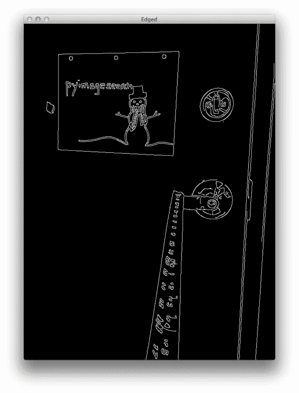

# 使用 Python 和 OpenCV 查找相机到对象/标记的距离

> 原文：<https://pyimagesearch.com/2015/01/19/find-distance-camera-objectmarker-using-python-opencv/>

最后更新于 2021 年 7 月 8 日。

几天前，一位 PyImageSearch 的读者 Cameron 发来电子邮件，询问如何找到从相机到图像中的物体/标记的距离。他花了一些时间研究，但还没有找到一个实现。

我完全了解卡梅伦的感受。几年前，我在做一个小项目，分析棒球离开投手的手向本垒板移动的过程。

使用运动分析和基于轨迹的跟踪，我能够在视频帧中找到/估计球的位置。因为棒球有已知的大小，我也能估计到本垒板的距离。

这是一个有趣的工作项目，尽管该系统并不像我希望的那样准确——球快速移动的“运动模糊”使得很难获得高度准确的估计。

我的项目绝对是一个“异常”的情况，但总的来说，确定从相机到标记的距离实际上是计算机视觉/图像处理领域中一个非常好的研究问题。你可以找到非常简单明了的技术，比如三角形相似度。您可以使用相机模型的内在参数找到复杂(尽管更精确)的方法。

在这篇博文中，我将向你展示卡梅伦和我是如何想出一个解决方案来计算我们的相机到一个已知物体或标记的距离的。

一定要读一读这篇文章——你不会想错过的！

*   **更新 2021 年 7 月:**新增三个章节。第一部分介绍如何通过相机校准改进距离测量。第二部分讨论立体视觉和深度相机来测量距离。最后一节简要介绍了激光雷达如何与相机数据配合使用，以提供高度精确的距离测量。

# 物体/标记到摄像机距离的三角形相似性

为了确定我们的相机到一个已知物体或标记的距离，我们将利用*三角形相似度*。

三角形的相似性是这样的:假设我们有一个已知宽度的标记或物体。然后我们把这个标记放在离我们相机有一段距离 *D* 的地方。我们用相机给物体拍照，然后测量像素的表观宽度 *P* 。这使我们能够推导出我们相机的感知焦距 F :

*F =(P×D)/W*

例如，假设我将一张标准的*8.5×11 英寸的纸放在一张*纸上(水平放置； *W = 11* ) *D = 24 寸*在我的相机前，拍一张照片。当我测量图像中纸张的宽度时，我注意到纸张的感知宽度是 *P = 248 像素*。

我的焦距 F 是:

*F =(248 px x24in)/11in = 543.45*

随着我继续将相机移近和移离对象/标记，我可以应用三角形相似性来确定对象到相机的距离:

*D' = (W x F) / P*

同样，为了更具体，让我们假设我把我的相机移动到离我的记号笔 3 英尺(或 36 英寸)远的地方，拍下同一张纸的照片。通过自动图像处理，我能够确定这张纸的感知宽度现在是 *170 像素*。把这个代入我们现在得到的等式:

*D’=(11 英寸 x 543.45)/170 = 35 英寸*

或者大约 36 英寸，也就是 3 英尺。

***注意:**当我为这个例子拍摄照片时，我的卷尺有点松，因此结果会有大约 1 英寸的误差。此外，我还匆忙地拍摄了照片，而不是 100%地在卷尺的尺标上，这增加了 1 英寸的误差。尽管如此，三角形相似性仍然成立，你可以使用这种方法来计算从一个物体或标记到你的相机的距离非常容易。*

现在有意义了吗？

太棒了。让我们来看一些代码，看看如何使用 Python、OpenCV、图像处理和计算机视觉技术来找到从您的相机到一个对象或标记的距离。

# 使用 Python 和 OpenCV 查找相机到物体/标记的距离

让我们着手开始这个项目吧。打开一个新文件，命名为`distance_to_camera.py`，然后我们开始工作:

```
# import the necessary packages
from imutils import paths
import numpy as np
import imutils
import cv2

def find_marker(image):
	# convert the image to grayscale, blur it, and detect edges
	gray = cv2.cvtColor(image, cv2.COLOR_BGR2GRAY)
	gray = cv2.GaussianBlur(gray, (5, 5), 0)
	edged = cv2.Canny(gray, 35, 125)

	# find the contours in the edged image and keep the largest one;
	# we'll assume that this is our piece of paper in the image
	cnts = cv2.findContours(edged.copy(), cv2.RETR_LIST, cv2.CHAIN_APPROX_SIMPLE)
	cnts = imutils.grab_contours(cnts)
	c = max(cnts, key = cv2.contourArea)

	# compute the bounding box of the of the paper region and return it
	return cv2.minAreaRect(c)

```

我们要做的第一件事是导入我们必需的包(**第 2-5 行**)。我们将使用`imutils`中的`paths`将可用图像加载到一个目录中。我们将使用 NumPy 进行数值处理，使用`cv2`进行 OpenCV 绑定。

从那里我们定义了我们的`find_marker`函数。这个函数接受一个参数，`image`，用来查找我们想要计算距离的对象。

在这种情况下，我们使用一张 8.5 x 11 英寸的标准纸作为标记。

我们的第一个任务是在图像中找到这张纸。

为此，我们将把图像转换成灰度，稍微模糊以去除高频噪声，并对第 9-11 行应用边缘检测。

应用这些步骤后，我们的图像应该看起来像这样:

[](https://pyimagesearch.com/wp-content/uploads/2014/12/distance_to_camera_edged.jpg)

**Figure 1:** Applying edge detection to find our marker, which in this case is a piece of paper.

如你所见，我们的记号笔(这张纸)的边缘显然已经被损坏了。现在我们需要做的就是找到代表这张纸的轮廓(即轮廓)。

我们通过使用`cv2.findContours`函数(注意处理不同的 OpenCV 版本)在**行 15 和 16** 上找到我们的标记，然后在**行 17** 上确定面积最大的轮廓。

我们假设面积最大的轮廓是我们的一张纸。这个假设适用于这个特殊的例子，但实际上*在图像中寻找标记是高度特定的应用。*

在我们的例子中，简单的边缘检测和寻找最大的轮廓效果很好。我们还可以通过应用轮廓近似，丢弃没有 4 个点的任何轮廓(因为一张纸是矩形的，因此有 4 个点)，然后找到最大的 4 点轮廓，来使这个例子更加健壮。

***注意:**关于这种方法的更多信息可以在[这篇文章中找到](https://pyimagesearch.com/2014/09/01/build-kick-ass-mobile-document-scanner-just-5-minutes/ "How to Build a Kick-Ass Mobile Document Scanner in Just 5 Minutes")关于构建一个超级移动文档扫描仪的文章。*

在图像中寻找标记的其他替代方法是利用颜色，使得标记的颜色与图像中场景的其余部分明显不同。您还可以应用关键点检测、局部不变描述符和关键点匹配等方法来查找标记；然而，这些方法超出了本文的范围，而且是高度特定于应用程序的。

无论如何，现在我们有了对应于我们的标记的轮廓，我们将包含 *(x，y)*-坐标和框的宽度和高度(以像素为单位)的边界框返回给第 20 行**的调用函数**。

让我们快速定义一个函数，使用上面详述的三角形相似性计算到一个对象的距离:

```
def distance_to_camera(knownWidth, focalLength, perWidth):
	# compute and return the distance from the maker to the camera
	return (knownWidth * focalLength) / perWidth

```

该函数采用标记的`knownWidth`、计算的`focalLength`和图像中对象的感知宽度(以像素为单位测量)，并应用上面详述的三角形相似度来计算到对象的实际距离。

要了解我们如何利用这些功能，请继续阅读:

```
# initialize the known distance from the camera to the object, which
# in this case is 24 inches
KNOWN_DISTANCE = 24.0

# initialize the known object width, which in this case, the piece of
# paper is 12 inches wide
KNOWN_WIDTH = 11.0

# load the furst image that contains an object that is KNOWN TO BE 2 feet
# from our camera, then find the paper marker in the image, and initialize
# the focal length
image = cv2.imread("images/2ft.png")
marker = find_marker(image)
focalLength = (marker[1][0] * KNOWN_DISTANCE) / KNOWN_WIDTH

```

找到图像中物体或标记的距离的第一步是*校准*和*计算焦距*。为此，我们需要知道:

*   相机与物体的距离。
*   宽度(单位为英寸、米等。)的这个对象。*注意:*也可以使用高度，但是这个例子只使用宽度。

让我们也花点时间，提一下我们正在做的*并不是真正的摄像机校准*。真正的相机校准涉及相机的内在参数，你可以在这里阅读更多。

在**第 28 行**我们初始化我们已知的`KNOWN_DISTANCE`从相机到我们的对象是 24 英寸。在**的第 32 行**，我们将对象的`KNOWN_WIDTH`初始化为 11 英寸(即一张水平放置的标准 8.5×11 英寸的纸)。

下一步很重要: ***这是我们简单的校准步骤。***

我们在第 37 行**处从磁盘上加载第一张图像—我们将使用这张图像作为我们的校准图像。**

一旦图像被加载，我们在图像的第 38 行的**处找到这张纸，然后使用三角形相似度计算第 39 行**的**处的`focalLength`。**

现在我们已经“校准”了我们的系统，并且有了`focalLength`，我们可以很容易地计算从我们的相机到后续图像中的标记的距离。

让我们看看这是如何做到的:

```
# loop over the images
for imagePath in sorted(paths.list_images("images")):
	# load the image, find the marker in the image, then compute the
	# distance to the marker from the camera
	image = cv2.imread(imagePath)
	marker = find_marker(image)
	inches = distance_to_camera(KNOWN_WIDTH, focalLength, marker[1][0])

	# draw a bounding box around the image and display it
	box = cv2.cv.BoxPoints(marker) if imutils.is_cv2() else cv2.boxPoints(marker)
	box = np.int0(box)
	cv2.drawContours(image, [box], -1, (0, 255, 0), 2)
	cv2.putText(image, "%.2fft" % (inches / 12),
		(image.shape[1] - 200, image.shape[0] - 20), cv2.FONT_HERSHEY_SIMPLEX,
		2.0, (0, 255, 0), 3)
	cv2.imshow("image", image)
	cv2.waitKey(0)

```

我们开始在第 42 行的**图像路径上循环。**

然后，对于列表中的每一幅图像，我们在**行 45** 处从磁盘上加载图像，在**行 46、**处找到图像中的标记，然后在**行 47** 处计算物体到摄像机的距离。

从那里，我们简单地在我们的标记周围画出边界框，并在第 50-57 行的**上显示距离(在第 50 行**的**上计算`boxPoints`，注意处理不同的 OpenCV 版本)。**

# 结果

要查看我们的脚本，请打开终端，导航到您的代码目录，并执行以下命令:

```
$ python distance_to_camera.py

```

如果一切顺利，您应该首先看到`2ft.png`的结果，这是我们用来“校准”系统和计算初始`focalLength`的图像:

从上面的图像中我们可以看到，我们的焦距是正确确定的，根据代码中的`KNOWN_DISTANCE`和`KNOWN_WIDTH`变量，到纸张的距离是 2 英尺。

现在我们有了焦距，我们可以计算到后续图像中标记的距离:

在上面的例子中，我们的相机现在距离标记大约 3 英尺。

让我们试着再向后移动一英尺:

同样，重要的是要注意，当我捕捉这个例子的照片时，我做得太匆忙，在卷尺中留下了太多的松弛。此外，我也没有确保我的相机是 100%对齐的脚标记，所以再次，在这些例子中大约有 1 英寸的误差。

尽管如此，本文中详细介绍的三角形相似性方法仍然有效，并允许您找到从图像中的对象或标记到您的相机的距离。

# **通过摄像机校准改进距离测量**

为了进行距离测量，我们首先需要校准我们的系统。在这篇文章中，我们使用了一个简单的“像素/度量”技术。

然而，通过计算外部和内部参数来执行适当的摄像机校准，可以获得更好的精度:

*   **外部参数**是用于将物体从世界坐标系转换到摄像机坐标系的旋转和平移矩阵
*   **内在参数**是内部相机参数，如焦距，将信息转换成像素

最常见的方法是使用 OpenCV 执行棋盘式摄像机校准。这样做将会消除影响输出图像的径向失真和切向失真，从而影响图像中对象的输出测量。

这里有一些资源可以帮助您开始进行相机校准:

*   [了解镜头畸变](https://learnopencv.com/understanding-lens-distortion/)
*   [使用 OpenCV 进行摄像机校准](https://learnopencv.com/camera-calibration-using-opencv/)
*   [相机校准(官方 OpenCV 文档)](https://docs.opencv.org/master/dc/dbb/tutorial_py_calibration.html)

# **用于距离测量的立体视觉和深度相机**

作为人类，我们认为拥有两只眼睛是理所当然的。即使我们在事故中失去了一只眼睛，我们仍然可以看到和感知我们周围的世界。

然而，只用一只眼睛我们就失去了重要的信息——****。****

 *深度知觉给我们从我们站的地方到我们面前的物体的感知距离。为了感知深度，我们需要两只眼睛。

另一方面，大多数相机只有*一只眼睛*，这就是为什么使用标准 2D 相机获得深度信息如此具有挑战性([尽管你可以使用深度学习模型来尝试从 2D 图像中“学习深度”](https://heartbeat.fritz.ai/research-guide-for-depth-estimation-with-deep-learning-1a02a439b834))。

您可以使用两个摄像头(如 USB 网络摄像头)创建能够计算深度信息的立体视觉系统:

*   [极线几何和立体视觉介绍](https://learnopencv.com/introduction-to-epipolar-geometry-and-stereo-vision/)
*   [使用 OpenCV 制作低成本立体摄像机](https://learnopencv.com/making-a-low-cost-stereo-camera-using-opencv/)
*   [使用立体相机的深度感知(Python/C++)](https://learnopencv.com/depth-perception-using-stereo-camera-python-c/)

或者，你可以使用内置深度相机的特定硬件，如 [OpenCV 的 AI Kit (OAK-D)](https://store.opencv.ai/products/oak-d) 。

# **深度信息激光雷达**

为了获得更精确的深度信息，你应该考虑使用激光雷达。**激光雷达使用光传感器来测量传感器与其前方任何物体之间的距离。**

激光雷达在无人驾驶汽车中尤其受欢迎，因为在无人驾驶汽车中，摄像头根本不够用。

我们将在 [PyImageSearch 大学](https://pyimagesearch.com/pyimagesearch-university/)内部介绍如何将激光雷达用于自动驾驶汽车应用。

# 摘要

在这篇博文中，我们学习了如何确定图像中的一个已知物体到我们相机的距离。

为了完成这项任务，我们利用了*三角形相似度*，这要求我们在应用我们的算法之前知道两个重要参数:

1.  我们用作标记的对象的*宽度(或高度)*，以某种距离度量，如英寸或米。
2.  步骤 1 中摄像机到标记的*距离*(英寸或米)。

然后，可以使用计算机视觉和图像处理算法来自动确定以像素为单位的物体的感知宽度/高度，并完成三角形相似性，给出我们的焦距。

然后，在随后的图像中，我们只需要找到我们的标记/对象，并利用计算的焦距来确定从相机到对象的距离。*