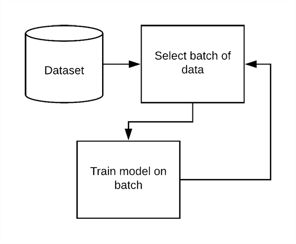
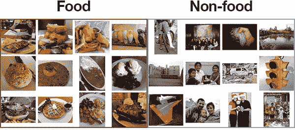

# Keras:基于深度学习的大数据集特征提取

> 原文：<https://pyimagesearch.com/2019/05/27/keras-feature-extraction-on-large-datasets-with-deep-learning/>

[](https://pyimagesearch.com/wp-content/uploads/2019/05/keras_feature_extraction_header.jpg)

在本教程中，您将了解如何使用 Keras 对太大而不适合内存的图像数据集进行特征提取。您将利用 ResNet-50(在 ImageNet 上进行了预训练)从大型图像数据集中提取特征，然后使用增量学习在提取的特征基础上训练分类器。

今天是我们关于 Keras 迁移学习的三部分系列的第二部分:

*   **Part 1:** [用 Keras 转移学习和深度学习](https://pyimagesearch.com/2019/05/20/transfer-learning-with-keras-and-deep-learning/)(上周教程)
*   第 2 部分: Keras:大型数据集上的特征提取(今天的帖子)
*   **第三部分:**用 Keras 和深度学习进行微调(下周教程)

上周我们讨论了如何使用 Keras 执行[迁移学习——在该教程中，我们主要关注通过特征提取的 ***迁移学习。***](https://pyimagesearch.com/2019/05/20/transfer-learning-with-keras-and-deep-learning/)

使用这种方法，我们能够利用 CNN 来识别从未被训练过的类别*!*

这种方法的问题在于它**假设我们提取的所有特征都可以放入内存**——*事实可能并非总是如此！*

例如，假设我们有一个包含 50，000 幅图像的数据集，并希望利用 ResNet-50 网络通过 FC 层之前的最后一层进行特征提取，则输出体积的大小将为 *7 x 7 x 2048 = 100，352-dim* 。

如果我们有 50，000 个这样的 100，352 维特征向量(假设 32 位浮点)，**然后*我们将需要总共 40.14GB 的 RAM* 来在内存中存储整个特征向量集！**

大多数人的机器中没有 40GB 以上的 RAM，因此在这些情况下，我们需要能够执行**增量学习，并在 ***增量数据子集上训练我们的模型。*****

 **今天剩余的教程将告诉你如何做到这一点。

**要了解如何利用 Keras 在大型数据集上进行特征提取，*请继续阅读！***

## Keras:基于深度学习的大数据集特征提取

***2020-06-04 更新:**此博文现已兼容 TensorFlow 2+!*

在本教程的第一部分，我们将简要讨论将网络视为特征提取器的概念(这在上周的教程中有更详细的介绍)。

在此基础上，我们将研究提取的要素数据集过大而无法放入内存的情况，在这种情况下，我们需要对数据集应用**增量学习**。

接下来，我们将实现 Python 源代码，可用于:

1.  Keras 特征提取
2.  随后对提取的特征进行增量学习

我们开始吧！

### 作为特征提取器的网络

[](https://pyimagesearch.com/wp-content/uploads/2019/05/transfer_learning_keras_feature_extract.png)

**Figure 1:** *Left*: The original VGG16 network architecture that outputs probabilities for each of the 1,000 ImageNet class labels. *Right*: Removing the FC layers from VGG16 and instead returning the final POOL layer. This output will serve as our extracted features.

在执行*深度学习特征提取*时，我们将预先训练好的网络视为一个任意的特征提取器，允许输入图像向前传播，在预先指定的层停止，将该层的*输出*作为我们的特征。

这样做，我们仍然可以利用美国有线电视新闻网学到的强大的、有区别的特征。 ***我们也可以用它们来识别美国有线电视新闻网从未上过的课程！***

通过深度学习进行特征提取的示例可以在本节顶部的**图 1** 中看到。

这里我们采用 VGG16 网络，允许图像向前传播到最终的 max-pooling 层(在完全连接的层之前)，并提取该层的激活。

max-pooling 层的输出具有体积形状 *7 x 7 x 512* ，我们将其展平为特征向量 *21，055-dim* 。

给定一个由 *N* 幅图像组成的数据集，我们可以对数据集中的所有图像重复特征提取过程，给我们留下总共*N×21，055-dim* 个特征向量。

鉴于这些特征，我们可以在这些特征上训练一个“标准”的机器学习模型(如逻辑回归或线性 SVM)。

***注意:**通过深度学习进行特征提取在 [**中有所涉及，更多细节**在上周的帖子](https://pyimagesearch.com/2019/05/20/transfer-learning-with-keras-and-deep-learning/)中——如果你对特征提取如何工作有任何问题，请参考它。*

### 如果提取的特征太大，内存容纳不下怎么办？

通过深度学习进行特征提取是非常好的…

***…但是当你提取的特征太大而不适合内存时会发生什么？***

请记住,(的大多数实现，包括 scikit-learn)逻辑回归和支持向量机要求您的整个数据集可以一次性访问*用于训练(即，整个数据集必须适合 RAM)。*

那太好了，**但是如果你有 50GB，100GB，甚至 1TB 的提取特征，你打算怎么办？**

大部分人都接触不到这么大内存的机器。

那么，你会怎么做？

### 解决方案:渐进式学习(即“在线学习”)

[](https://pyimagesearch.com/wp-content/uploads/2019/05/keras_feature_extraction_incremental_learning.png)

**Figure 2:** The process of incremental learning plays a role in deep learning feature extraction on large datasets.

当你的整个数据集不适合内存时，你需要执行**(有时称为“在线学习”)。**

 **增量学习使你能够在被称为**批次**的*数据*的小子集上训练你的模型。

使用增量学习，培训过程变成:

1.  从数据集中加载一小批数据
2.  在批次上训练模型
3.  分批重复循环数据集，边走边训练，直到我们达到收敛

但是等等，这个过程听起来不是很熟悉吗？

应该的。

这正是我们如何训练神经网络的*。*

 *神经网络是增量学习者的极好例子。

事实上，如果您查看 scikit-learn 文档，您会发现增量学习的分类模型要么是 NNs 本身，要么与 NNs 直接相关(即`Perceptron`和`SGDClassifier`)。

我们将使用 Keras 实现我们自己的神经网络，而不是使用 scikit-learn 的增量学习模型。

这个神经网络将在我们从 CNN 提取的特征之上被训练。

我们的培训流程现在变成了:

1.  使用 CNN 从我们的图像数据集中提取所有特征。
2.  在提取的特征之上训练一个简单的前馈神经网络。

### 配置您的开发环境

要针对本教程配置您的系统，我首先建议您遵循以下任一教程:

*   [*如何在 Ubuntu 上安装 tensor flow 2.0*](https://pyimagesearch.com/2019/12/09/how-to-install-tensorflow-2-0-on-ubuntu/)
*   *[如何在 macOS 上安装 tensor flow 2.0](https://pyimagesearch.com/2019/12/09/how-to-install-tensorflow-2-0-on-macos/)*

这两个教程都将帮助您在一个方便的 Python 虚拟环境中，用这篇博文所需的所有软件来配置您的系统。

请注意 [PyImageSearch 不推荐也不支持 CV/DL 项目](https://pyimagesearch.com/faqs/single-faq/can-you-help-me-do-___-on-windows/)的窗口。

### Food-5K 数据集

[](https://pyimagesearch.com/wp-content/uploads/2019/05/transfer_learning_keras_food5k_dataset.jpg)

**Figure 3:** The Foods-5K dataset will be used for this example of deep learning feature extraction with Keras.

我们今天将在这里使用的数据集是 [**Food-5K 数据集**](https://mmspg.epfl.ch/downloads/food-image-datasets/) ，由瑞士联邦理工学院[的](https://www.epfl.ch)[多媒体信号处理小组(MSPG)](https://mmspg.epfl.ch/) 策划。

该数据集包含 5，000 幅图像，每幅图像属于以下两类之一:

1.  食物
2.  非食品

**我们今天的目标是:**

1.  使用在 ImageNet 上预先训练的 ResNet-50，利用 Keras 特征提取从 Food-5K 数据集中提取特征。
2.  在这些特征的基础上训练一个简单的神经网络来识别 CNN 从未被训练来识别的类别。

值得注意的是，整个 Food-5K 数据集，经过特征提取后，如果一次全部加载只会占用~2GB 的 RAM—***这不是重点*。**

今天这篇文章的重点是向你展示如何使用增量学习来训练提取特征的模型。

**这样，不管你是在处理 *1GB* 的数据还是 *100GB* 的数据，你都会知道*在通过深度学习提取的特征之上训练模型的确切步骤*。**

#### 下载 Food-5K 数据集

首先，确保你使用博文的 ***【下载】*** 部分获取了今天教程的源代码。

下载完源代码后，将目录更改为`transfer-learning-keras`:

```
$ unzip keras-feature-extraction.zip
$ cd keras-feature-extraction

```

根据我的经验，**我发现下载 Food-5K 数据集有点不可靠。**

因此，我更新了这篇教程，提供了一个链接，指向我托管的可下载的 Food-5K 数据集。使用以下链接可靠地下载数据集:

[下载 Food-5K 数据集](https://s3-us-west-2.amazonaws.com/static.pyimagesearch.com/food-datasets/Food-5K.zip)

下载完数据集后，将它解压缩到项目文件夹中:

```
$ unzip Food-5k.zip

```

### 项目结构

继续并导航回根目录:

```
$ cd ..

```

从那里，我们能够用`tree`命令分析我们的项目结构:

```
$ tree --dirsfirst --filelimit 10
.
├── Food-5K
│   ├── evaluation [1000 entries]
│   ├── training [3000 entries]
│   └── validation [1000 entries]
├── dataset
├── output
├── pyimagesearch
│   ├── __init__.py
│   └── config.py
├── build_dataset.py
├── extract_features.py
├── Food-5K.zip
└── train.py

8 directories, 6 files

```

`config.py`文件包含 Python 格式的配置设置。我们的其他 Python 脚本将利用配置。

使用我们的`build_dataset.py`脚本，我们将组织并输出`Food-5K/`目录的内容到数据集文件夹。

从那里，`extract_features.py`脚本将通过特征提取使用迁移学习来计算每个图像的特征向量。这些特征将输出到 CSV 文件。

`build_dataset.py`和`extract_features.py`都详细复习了[上周](https://pyimagesearch.com/2019/05/20/transfer-learning-with-keras-and-deep-learning/)；然而，我们今天将再次简要地浏览它们。

最后，我们来回顾一下`train.py`。在这个 Python 脚本中，我们将使用增量学习在提取的特征上训练一个简单的神经网络。这个脚本不同于上周的教程，我们将在这里集中精力。

### 我们的配置文件

让我们从查看存储配置的`config.py`文件开始，即图像输入数据集的路径以及提取特征的输出路径。

打开`config.py`文件并插入以下代码:

```
# import the necessary packages
import os

# initialize the path to the *original* input directory of images
ORIG_INPUT_DATASET = "Food-5K"

# initialize the base path to the *new* directory that will contain
# our images after computing the training and testing split
BASE_PATH = "dataset"

# define the names of the training, testing, and validation
# directories
TRAIN = "training"
TEST = "evaluation"
VAL = "validation"

# initialize the list of class label names
CLASSES = ["non_food", "food"]

# set the batch size
BATCH_SIZE = 32

# initialize the label encoder file path and the output directory to
# where the extracted features (in CSV file format) will be stored
LE_PATH = os.path.sep.join(["output", "le.cpickle"])
BASE_CSV_PATH = "output"

```

花时间通读`config.py`脚本，注意注释。

大多数设置都与目录和文件路径有关，这些都在我们的其余脚本中使用。

关于配置的完整回顾，一定要参考上周的帖子[。](https://pyimagesearch.com/2019/05/20/transfer-learning-with-keras-and-deep-learning/)

### 构建影像数据集

每当我在数据集上执行机器学习(尤其是 Keras/deep learning)时，我都喜欢使用以下格式的数据集:

`dataset_name/class_label/example_of_class_label.jpg`

维护这个目录结构不仅使我们的数据集在磁盘**上保持有序，而且*和*也使我们能够在本系列教程后面的微调中利用 Keras 的`flow_from_directory`函数。**

由于 Food-5K 数据集*提供了预先提供的数据分割*，我们最终的目录结构将具有以下形式:

`dataset_name/split_name/class_label/example_of_class_label.jpg`

同样，这一步并不总是必要的，但是它*是*一个最佳实践(在我看来)，并且我建议你也这样做。

至少它会给你编写 Python 代码来组织磁盘上的图像的经验。

现在让我们使用`build_dataset.py`文件来构建我们的目录结构:

```
# import the necessary packages
from pyimagesearch import config
from imutils import paths
import shutil
import os

# loop over the data splits
for split in (config.TRAIN, config.TEST, config.VAL):
	# grab all image paths in the current split
	print("[INFO] processing '{} split'...".format(split))
	p = os.path.sep.join([config.ORIG_INPUT_DATASET, split])
	imagePaths = list(paths.list_images(p))

	# loop over the image paths
	for imagePath in imagePaths:
		# extract class label from the filename
		filename = imagePath.split(os.path.sep)[-1]
		label = config.CLASSES[int(filename.split("_")[0])]

		# construct the path to the output directory
		dirPath = os.path.sep.join([config.BASE_PATH, split, label])

		# if the output directory does not exist, create it
		if not os.path.exists(dirPath):
			os.makedirs(dirPath)

		# construct the path to the output image file and copy it
		p = os.path.sep.join([dirPath, filename])
		shutil.copy2(imagePath, p)

```

在**行 2-5** 上导入我们的包之后，我们继续循环训练、测试和验证分割(**行 8** )。

我们创建我们的 split + class 标签目录结构(如上所述),然后用 Food-5K 图像填充目录。结果是我们可以用来提取特征的有组织的数据。

让我们执行脚本并再次检查我们的目录结构。

您可以使用本教程的 ***“下载”*** 部分下载源代码——从那里，打开一个终端并执行以下命令:

```
$ python build_dataset.py 
[INFO] processing 'training split'...
[INFO] processing 'evaluation split'...
[INFO] processing 'validation split'...

```

这样做之后，您将会看到以下目录结构:

```
$ tree --dirsfirst --filelimit 10
.
├── Food-5K
│   ├── evaluation [1000 entries]
│   ├── training [3000 entries]
│   ├── validation [1000 entries]
│   └── Food-5K.zip
├── dataset
│   ├── evaluation
│   │   ├── food [500 entries]
│   │   └── non_food [500 entries]
│   ├── training
│   │   ├── food [1500 entries]
│   │   └── non_food [1500 entries]
│   └── validation
│       ├── food [500 entries]
│       └── non_food [500 entries]
├── output
├── pyimagesearch
│   ├── __init__.py
│   └── config.py
├── build_dataset.py
├── extract_features.py
└── train.py

16 directories, 6 files

```

请注意，我们的数据集/目录现在已被填充。每个子目录的格式如下:

`split_name/class_label`

组织好数据后，我们就可以继续进行特征提取了。

### 使用 Keras 进行深度学习特征提取

现在我们已经为项目构建了数据集目录结构，我们可以:

1.  使用 Keras 通过深度学习从数据集中的每个图像中提取特征。
2.  以 CSV 格式将分类标签+提取的要素写入磁盘。

为了完成这些任务，我们需要实现`extract_features.py`文件。

上周的帖子中[详细介绍了这个文件，所以为了完整起见，我们在这里只简要回顾一下这个脚本:](https://pyimagesearch.com/2019/05/20/transfer-learning-with-keras-and-deep-learning/)

```
# import the necessary packages
from sklearn.preprocessing import LabelEncoder
from tensorflow.keras.applications import ResNet50
from tensorflow.keras.applications.resnet50 import preprocess_input
from tensorflow.keras.preprocessing.image import img_to_array
from tensorflow.keras.preprocessing.image import load_img
from pyimagesearch import config
from imutils import paths
import numpy as np
import pickle
import random
import os

# load the ResNet50 network and initialize the label encoder
print("[INFO] loading network...")
model = ResNet50(weights="imagenet", include_top=False)
le = None

# loop over the data splits
for split in (config.TRAIN, config.TEST, config.VAL):
	# grab all image paths in the current split
	print("[INFO] processing '{} split'...".format(split))
	p = os.path.sep.join([config.BASE_PATH, split])
	imagePaths = list(paths.list_images(p))

	# randomly shuffle the image paths and then extract the class
	# labels from the file paths
	random.shuffle(imagePaths)
	labels = [p.split(os.path.sep)[-2] for p in imagePaths]

	# if the label encoder is None, create it
	if le is None:
		le = LabelEncoder()
		le.fit(labels)

	# open the output CSV file for writing
	csvPath = os.path.sep.join([config.BASE_CSV_PATH,
		"{}.csv".format(split)])
	csv = open(csvPath, "w")

```

在**行 16** 上，ResNet 被加载，但不包括头部。预先训练的 ImageNet 权重也被加载到网络中。使用这种预先训练的无头网络，通过迁移学习进行特征提取现在是可能的。

从那里，我们继续循环第 20 行上的数据分割。

在里面，我们为特定的`split`抓取所有的`imagePaths`，并安装我们的标签编码器(**第 23-34 行**)。

打开一个 CSV 文件进行写入(**第 37-39 行**)，这样我们就可以将我们的类标签和提取的特征写入磁盘。

现在我们的初始化都设置好了，我们可以开始批量循环图像:

```
	# loop over the images in batches
	for (b, i) in enumerate(range(0, len(imagePaths), config.BATCH_SIZE)):
		# extract the batch of images and labels, then initialize the
		# list of actual images that will be passed through the network
		# for feature extraction
		print("[INFO] processing batch {}/{}".format(b + 1,
			int(np.ceil(len(imagePaths) / float(config.BATCH_SIZE)))))
		batchPaths = imagePaths[i:i + config.BATCH_SIZE]
		batchLabels = le.transform(labels[i:i + config.BATCH_SIZE])
		batchImages = []

		# loop over the images and labels in the current batch
		for imagePath in batchPaths:
			# load the input image using the Keras helper utility
			# while ensuring the image is resized to 224x224 pixels
			image = load_img(imagePath, target_size=(224, 224))
			image = img_to_array(image)

			# preprocess the image by (1) expanding the dimensions and
			# (2) subtracting the mean RGB pixel intensity from the
			# ImageNet dataset
			image = np.expand_dims(image, axis=0)
			image = preprocess_input(image)

			# add the image to the batch
			batchImages.append(image)

```

批次中的每个`image`被加载并预处理。从那里它被附加到`batchImages`。

我们现在将通过 ResNet 发送批处理以提取特征:

```
		# pass the images through the network and use the outputs as
		# our actual features, then reshape the features into a
		# flattened volume
		batchImages = np.vstack(batchImages)
		features = model.predict(batchImages, batch_size=config.BATCH_SIZE)
		features = features.reshape((features.shape[0], 7 * 7 * 2048))

		# loop over the class labels and extracted features
		for (label, vec) in zip(batchLabels, features):
			# construct a row that exists of the class label and
			# extracted features
			vec = ",".join([str(v) for v in vec])
			csv.write("{},{}\n".format(label, vec))

	# close the CSV file
	csv.close()

# serialize the label encoder to disk
f = open(config.LE_PATH, "wb")
f.write(pickle.dumps(le))
f.close()

```

批次的特征提取发生在**线 72** 上。使用 ResNet，我们的输出层的体积大小为 *7 x 7 x 2，048* 。将输出视为一个特征向量，我们简单地将其展平为一个列表*7 x 7 x 2048 = 100352-dim*(**第 73 行**)。

然后，该批特征向量被输出到 CSV 文件，每行的第一个条目是类`label`，其余的值组成特征`vec`。

我们将对每个分割中的所有批次重复这一过程，直到完成。最后，我们的标签编码器被转储到磁盘。

更详细的逐行回顾，请参考上周的教程。

* * *

要从我们的数据集中提取特征，请确保使用指南的 ***【下载】*** 部分下载本文的源代码。

从那里，打开一个终端并执行以下命令:

```
$ python extract_features.py
[INFO] loading network...
[INFO] processing 'training split'...
...
[INFO] processing batch 92/94
[INFO] processing batch 93/94
[INFO] processing batch 94/94
[INFO] processing 'evaluation split'...
...
[INFO] processing batch 30/32
[INFO] processing batch 31/32
[INFO] processing batch 32/32
[INFO] processing 'validation split'...
...
[INFO] processing batch 30/32
[INFO] processing batch 31/32
[INFO] processing batch 32/32

```

在 NVIDIA K80 GPU 上，整个特征提取过程花费了**5 毫秒。**

你也可以在 CPU 上运行`extract_features.py` ,但这会花费更长的时间。

特征提取完成后，您的输出目录中应该有三个 CSV 文件，分别对应于我们的每个数据分割:

```
$ ls -l output/
total 2655188
-rw-rw-r-- 1 ubuntu ubuntu  502570423 May 13 17:17 evaluation.csv
-rw-rw-r-- 1 ubuntu ubuntu 1508474926 May 13 17:16 training.csv
-rw-rw-r-- 1 ubuntu ubuntu  502285852 May 13 17:18 validation.csv

```

### 实施增量学习培训脚本

最后，我们现在准备利用**增量学习**通过对大型数据集进行特征提取来应用迁移学习。

我们在本节中实现的 Python 脚本将负责:

1.  构造简单的前馈神经网络结构。
2.  实现一个 CSV 数据生成器，用于向神经网络生成一批标签+特征向量。
3.  使用数据生成器训练简单神经网络。
4.  评估特征提取器。

打开`train.py`脚本，让我们开始吧:

```
# import the necessary packages
from tensorflow.keras.models import Sequential
from tensorflow.keras.layers import Dense
from tensorflow.keras.optimizers import SGD
from tensorflow.keras.utils import to_categorical
from sklearn.metrics import classification_report
from pyimagesearch import config
import numpy as np
import pickle
import os

```

在**2-10 行**导入我们需要的包。我们最显著的导入是 TensorFlow/Keras' `Sequential` API，我们将使用它来构建一个简单的前馈神经网络。

几个月前，我写了一篇关于[实现定制 Keras 数据生成器](https://pyimagesearch.com/2018/12/24/how-to-use-keras-fit-and-fit_generator-a-hands-on-tutorial/)的教程，更具体地说，就是从 CSV 文件中产生数据，用 Keras 训练神经网络。

当时，我发现读者对使用这种生成器的实际应用有些困惑— *today 就是这种实际应用的一个很好的例子。*

再次请记住，我们假设提取的特征的整个 CSV 文件将*而不是*适合内存。因此，我们需要一个定制的 Keras 生成器来生成成批的标签和数据给网络，以便对其进行训练。

现在让我们实现生成器:

```
def csv_feature_generator(inputPath, bs, numClasses, mode="train"):
	# open the input file for reading
	f = open(inputPath, "r")

	# loop indefinitely
	while True:
		# initialize our batch of data and labels
		data = []
		labels = []

		# keep looping until we reach our batch size
		while len(data) < bs:
			# attempt to read the next row of the CSV file
			row = f.readline()

```

我们的`csv_feature_generator`接受四个参数:

*   `inputPath`:包含提取特征的输入 CSV 文件的路径。
*   `bs`:每个数据块的批量大小(或长度)。
*   `numClasses`:一个整数值，表示我们的数据中类的数量。
*   `mode`:我们是在培训还是在评估/测试。

在**第 14 行**，我们打开 CSV 文件进行读取。

从第 17 行的**开始，我们无限循环，从初始化我们的数据和标签开始。(**第 19 和 20 行**)。**

从那里开始，我们将循环直到长度`data`等于从**行 23** 开始的批量。

我们从读取 CSV 中的一行开始(**第 25 行**)。一旦我们有了行，我们将继续处理它:

```
			# check to see if the row is empty, indicating we have
			# reached the end of the file
			if row == "":
				# reset the file pointer to the beginning of the file
				# and re-read the row
				f.seek(0)
				row = f.readline()

				# if we are evaluating we should now break from our
				# loop to ensure we don't continue to fill up the
				# batch from samples at the beginning of the file
				if mode == "eval":
					break

			# extract the class label and features from the row
			row = row.strip().split(",")
			label = row[0]
			label = to_categorical(label, num_classes=numClasses)
			features = np.array(row[1:], dtype="float")

			# update the data and label lists
			data.append(features)
			labels.append(label)

		# yield the batch to the calling function
		yield (np.array(data), np.array(labels))

```

如果`row`为空，我们将从文件的开头重新开始(**第 29-32 行**)。如果我们处于评估模式，我们将从我们的循环中`break`，确保我们不会从文件的开始填充批处理(**第 38 和 39 行**)。

假设我们继续，从`row` ( **第 42-45 行**)中提取`label`和`features`。

然后，我们将特征向量(`features`和`label`分别附加到`data`和`labels`列表，直到列表达到指定的批量大小(**第 48 和 49 行**)。

当批处理准备好时，**行 52** 产生作为元组的`data`和`labels`。Python 的`yield`关键字对于让我们的函数像生成器一样运行至关重要。

让我们继续—在训练模型之前，我们还有几个步骤:

```
# load the label encoder from disk
le = pickle.loads(open(config.LE_PATH, "rb").read())

# derive the paths to the training, validation, and testing CSV files
trainPath = os.path.sep.join([config.BASE_CSV_PATH,
	"{}.csv".format(config.TRAIN)])
valPath = os.path.sep.join([config.BASE_CSV_PATH,
	"{}.csv".format(config.VAL)])
testPath = os.path.sep.join([config.BASE_CSV_PATH,
	"{}.csv".format(config.TEST)])

# determine the total number of images in the training and validation
# sets
totalTrain = sum([1 for l in open(trainPath)])
totalVal = sum([1 for l in open(valPath)])

# extract the testing labels from the CSV file and then determine the
# number of testing images
testLabels = [int(row.split(",")[0]) for row in open(testPath)]
totalTest = len(testLabels)

```

我们的标签编码器从磁盘的第 54 行**加载。然后，我们得到训练、验证和测试 CSV 文件的路径(**第 58-63 行**)。**

**第 67 行和第 68 行**处理对训练集和验证集中图像数量的计数。有了这些信息，我们将能够告诉`.fit_generator`函数每个时期有多少个`batch_size`步骤。

让我们为每个数据分割构建一个生成器:

```
# construct the training, validation, and testing generators
trainGen = csv_feature_generator(trainPath, config.BATCH_SIZE,
	len(config.CLASSES), mode="train")
valGen = csv_feature_generator(valPath, config.BATCH_SIZE,
	len(config.CLASSES), mode="eval")
testGen = csv_feature_generator(testPath, config.BATCH_SIZE,
	len(config.CLASSES), mode="eval")

```

第 76-81 行初始化我们的 CSV 特征生成器。

我们现在准备建立一个简单的神经网络:

```
# define our simple neural network
model = Sequential()
model.add(Dense(256, input_shape=(7 * 7 * 2048,), activation="relu"))
model.add(Dense(16, activation="relu"))
model.add(Dense(len(config.CLASSES), activation="softmax"))

```

与上周的教程相反，我们使用了逻辑回归机器学习模型，今天我们将建立一个简单的神经网络进行分类。

**第 84-87 行**使用 Keras 定义了一个简单的`100352-256-16-2`前馈神经网络架构。

我是怎么得出两个隐藏层的`256`和`16`的值的？

一个好的经验法则是取层中先前节点数的平方根，然后找到最接近的 2 的幂。

在这种情况下，2 与`100352`最接近的幂就是`256`。`256`的平方根是`16`，因此给出了我们的架构定义。

让我们继续`compile`我们的`model`:

```
# compile the model
opt = SGD(lr=1e-3, momentum=0.9, decay=1e-3 / 25)
model.compile(loss="binary_crossentropy", optimizer=opt,
	metrics=["accuracy"])

```

我们`compile`我们的`model`使用随机梯度下降(`SGD`)，初始学习速率为`1e-3`(它将在`25`时期衰减)。

我们在这里使用`"binary_crossentropy"`作为`loss`函数**，因为我们只有两个类。** **如果你有两个以上的职业，那么你应该使用`"categorical_crossentropy"`。**

随着我们的`model`被编译，现在我们准备好训练和评估:

```
# train the network
print("[INFO] training simple network...")
H = model.fit(
	x=trainGen,
	steps_per_epoch=totalTrain // config.BATCH_SIZE,
	validation_data=valGen,
	validation_steps=totalVal // config.BATCH_SIZE,
	epochs=25)

# make predictions on the testing images, finding the index of the
# label with the corresponding largest predicted probability, then
# show a nicely formatted classification report
print("[INFO] evaluating network...")
predIdxs = model.predict(x=testGen,
	steps=(totalTest //config.BATCH_SIZE) + 1)
predIdxs = np.argmax(predIdxs, axis=1)
print(classification_report(testLabels, predIdxs,
	target_names=le.classes_))

```

***2020-06-04 更新:**以前，TensorFlow/Keras 需要使用一种叫做`.fit_generator`的方法来完成数据扩充。现在，`.fit`方法也可以处理数据扩充，使代码更加一致。这也适用于从`.predict_generator`到`.predict`的迁移。请务必查看我关于 [fit 和 fit_generator](https://pyimagesearch.com/2018/12/24/how-to-use-keras-fit-and-fit_generator-a-hands-on-tutorial/) 以及[数据扩充](https://pyimagesearch.com/2019/07/08/keras-imagedatagenerator-and-data-augmentation/)的文章。*

**第 96-101 行**使用我们的训练和验证生成器(`trainGen`和`valGen`)适合我们的`model`。使用发电机和我们的`model`允许 ***增量学习*** 。

使用增量学习，我们不再需要一次将所有数据加载到内存中。相反，批量数据流经我们的网络，使得处理大规模数据集变得容易。

当然，CSV 数据并不能有效利用空间，速度也不快。在用 Python 进行计算机视觉深度学习的 *[里面，我教如何更高效地使用 HDF5 进行存储。](https://pyimagesearch.com/deep-learning-computer-vision-python-book/)*

对模型的评估发生在**行 107-109** 上，其中`testGen`批量生成我们的特征向量。然后在终端打印一份分类报告(**行 110 和 111** )。

### Keras 特征提取结果

最后，我们准备在从 ResNet 提取的特征上训练我们的简单神经网络！

确保使用本教程的 ***【下载】*** 部分下载源代码。

从那里，打开一个终端并执行以下命令:

```
$ python train.py
Using TensorFlow backend.
[INFO] training simple network...
Epoch 1/25
93/93 [==============================] - 43s 462ms/step - loss: 0.0806 - accuracy: 0.9735 - val_loss: 0.0860 - val_accuracy: 0.9798
Epoch 2/25
93/93 [==============================] - 43s 461ms/step - loss: 0.0124 - accuracy: 0.9970 - val_loss: 0.0601 - val_accuracy: 0.9849
Epoch 3/25
93/93 [==============================] - 42s 451ms/step - loss: 7.9956e-04 - accuracy: 1.0000 - val_loss: 0.0636 - val_accuracy: 0.9859
Epoch 4/25
93/93 [==============================] - 42s 450ms/step - loss: 2.3326e-04 - accuracy: 1.0000 - val_loss: 0.0658 - val_accuracy: 0.9859
Epoch 5/25
93/93 [==============================] - 43s 459ms/step - loss: 1.4288e-04 - accuracy: 1.0000 - val_loss: 0.0653 - val_accuracy: 0.9859
...
Epoch 21/25
93/93 [==============================] - 42s 456ms/step - loss: 3.3550e-05 - accuracy: 1.0000 - val_loss: 0.0661 - val_accuracy: 0.9869
Epoch 22/25
93/93 [==============================] - 42s 453ms/step - loss: 3.1843e-05 - accuracy: 1.0000 - val_loss: 0.0663 - val_accuracy: 0.9869
Epoch 23/25
93/93 [==============================] - 42s 452ms/step - loss: 3.1020e-05 - accuracy: 1.0000 - val_loss: 0.0663 - val_accuracy: 0.9869
Epoch 24/25
93/93 [==============================] - 42s 452ms/step - loss: 2.9564e-05 - accuracy: 1.0000 - val_loss: 0.0664 - val_accuracy: 0.9869
Epoch 25/25
93/93 [==============================] - 42s 454ms/step - loss: 2.8628e-05 - accuracy: 1.0000 - val_loss: 0.0665 - val_accuracy: 0.9869
[INFO] evaluating network...
              precision    recall  f1-score   support

        food       0.99      0.99      0.99       500
    non_food       0.99      0.99      0.99       500

    accuracy                           0.99      1000
   macro avg       0.99      0.99      0.99      1000
weighted avg       0.99      0.99      0.99      1000

```

在 NVIDIA K80 上的训练花费了大约 **~30m** 。你也可以在 CPU 上训练，但是这将花费相当长的时间。

**正如我们的输出所示，我们能够在 Food-5K 数据集上获得 *~99%的准确率*，尽管 ResNet-50 从未*接受过食品/非食品类的训练！***

 *正如你所看到的，迁移学习是一种非常强大的技术，使你能够从 CNN 中提取特征，并识别出他们没有被训练过的类。

在关于 Keras 和深度学习的迁移学习系列教程的后面，我将向您展示如何执行微调，这是另一种迁移学习方法。

### 有兴趣了解更多关于在线/增量学习的信息吗？


**Figure 4:** [Creme](https://github.com/creme-ml/creme) is a library specifically tailored to incremental learning. The API is similar to that of scikit-learn’s which will make you feel at home while putting it to work on large datasets where in**creme**ntal learning is required.

神经网络和深度学习是增量学习的一种形式——我们可以一次对一个样本或一批样本训练这样的网络。

然而，*仅仅因为我们能够*应用神经网络解决问题*并不意味着我们应该*。

相反，我们需要为工作带来合适的工具。仅仅因为你手里有一把锤子，并不意味着你会用它来敲螺丝。

增量学习算法包含一组用于以增量方式训练模型的技术。

当数据集太大而无法放入内存时，我们通常会利用增量学习。

然而，scikit-learn 库确实包含少量在线学习算法:

1.  它没有把增量学习作为一等公民对待。
2.  这些实现很难使用。

进入 [**Creme 库**](https://github.com/creme-ml/creme) —一个专门用于 **creme** ntal 学习 Python 的*库。*

我真的很喜欢我第一次使用 creme 的经历，并且发现 scikit-learn 启发的 API 非常容易使用。

[点击这里阅读我的*在线/增量学习与 Keras 和 Creme* 的文章！](https://pyimagesearch.com/2019/06/17/online-incremental-learning-with-keras-and-creme/)

## 摘要

在本教程中，您学习了如何:

1.  利用 Keras 进行深度学习特征提取。
2.  对提取的特征执行增量学习。

利用增量学习使我们能够在太大而不适合内存的数据集上训练模型。

**神经网络是增量学习者的一个很好的例子**因为我们可以通过批量加载数据，确保整个网络不必一次装入 RAM。使用增量学习，我们能够获得 **~98%的准确率**。

我建议在需要使用 Keras 对大型数据集进行特征提取时，使用这段代码作为模板。

我希望你喜欢这个教程！

**要下载这篇文章的源代码(并在未来教程在 PyImageSearch 上发布时得到通知)，*只需在下面的表格中输入您的电子邮件地址！*********