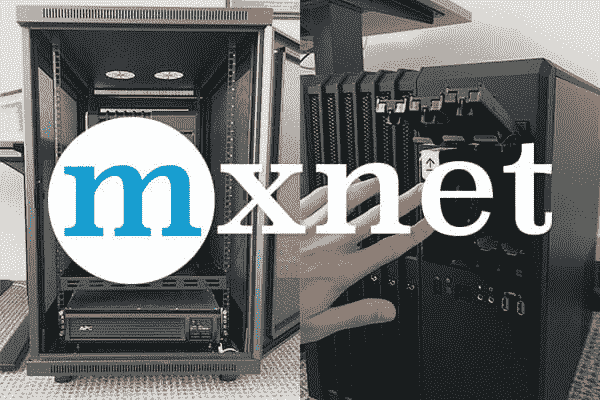
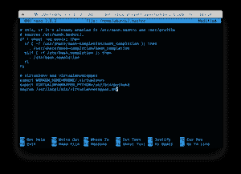
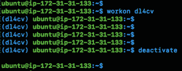
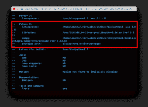
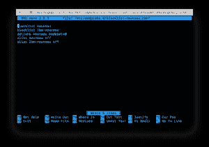
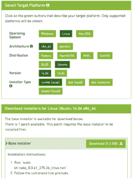
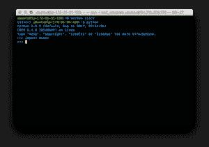

# 深度学习如何安装 mxnet

> 原文：<https://pyimagesearch.com/2017/11/13/how-to-install-mxnet-for-deep-learning/>



说到深度学习， [Keras](https://keras.io/) 是我最喜欢的 Python 库…

但是紧随其后的是 [mxnet](https://mxnet.incubator.apache.org/) 。

我喜欢 mxnet 的一点是，它在性能和易用性方面结合了两者的优点。在 mxnet 中，您会发现:

*   **Caffe-like binary**帮助您构建高效打包的图像数据集/记录文件。
*   一个**类似 Keras 的语法**让 Python 编程语言轻松构建深度学习模型。
*   在**多个 GPU 上训练深度神经网络并跨多台机器进行扩展的方法**。

每当我实现卷积神经网络时，我倾向于首先使用 Keras。Keras 没有 mxnet 那么冗长，并且通常更容易实现给定的神经网络架构+训练过程。

但是，当我需要从最初的实验扩大到 ImageNet 大小的数据集(或更大)时，我经常使用 mxnet 来(1)构建高效打包的数据集，然后(2)在多个 GPU 和/或多台机器上训练我的网络。

由于 mxnet 的 Python 绑定是编译的 C/C++二进制文件，所以我能够充分利用我的机器的性能。

事实上，当**在 ImageNet** 和**上训练卷积神经网络以复制开创性论文(如 VGGNet、ResNet、SqueezeNet 等)的最先进结果**时，我们使用 mxnet 内的 *[深度学习和 Python](https://pyimagesearch.com/deep-learning-computer-vision-python-book/)* (特别是 ImageNet 包)进行计算机视觉..

在这篇博文的剩余部分，你将学习如何在你的 Ubuntu 机器上安装和配置用于深度学习的 mxnet。

## 深度学习如何安装 mxnet

在今天的博客文章中，我将向你展示如何在你的系统上安装 mxnet 进行深度学习，只需要 5 个(相对)简单的步骤。

mxnet 深度学习包是一个 Apache 项目，并有强大的 T2 社区支持。要开始使用 mxnet，我推荐这里的教程和解释。鉴于 Apache 社区对 mxnet 深度学习的贡献([就更不用说了，亚马逊的](http://www.allthingsdistributed.com/2016/11/mxnet-default-framework-deep-learning-aws.html))我认为在可预见的未来，它会一直存在下去。

在我们继续安装 mxnet 之前，我想指出的是，第 4 步分为:

*   针对**纯 CPU 用户的步骤# 4a**
*   以及针对 **GPU 用户的步骤#4b。**

GPU 的安装要复杂得多，有可能出错。这些说明已经过测试，我相信它们将成为您安装过程中的良好指南。

让我们开始吧。

### 步骤 1:安装必备组件

首先，你要确保你的 Ubuntu 16.04 或 14.04 系统是最新的。您可以执行以下命令从 Ubuntu 存储库中更新软件包:

```
$ sudo apt-get update
$ sudo apt-get upgrade

```

接下来，让我们安装一些开发工具、图像/视频 I/O、GUI 操作和其他包(并非所有这些都是 100%必要的，但如果你在深度学习或机器学习领域工作，你会希望安装它们):

```
$ sudo apt-get install build-essential cmake git unzip pkg-config
$ sudo apt-get install libjpeg-dev libtiff5-dev libjasper-dev libpng12-dev
$ sudo apt-get install libavcodec-dev libavformat-dev libswscale-dev libv4l-dev
$ sudo apt-get install libxvidcore-dev libx264-dev
$ sudo apt-get install libgtk-3-dev
$ sudo apt-get install libhdf5-serial-dev graphviz
$ sudo apt-get install libopenblas-dev libatlas-base-dev gfortran
$ sudo apt-get install python-tk python3-tk python-imaging-tk

```

第三，让我们安装 Python 头文件:

```
$ sudo apt-get install python2.7-dev python3-dev

```

现在我们已经安装了适当的系统先决条件，让我们继续。

### 步骤 2:建立虚拟环境

虚拟环境对于 Python 开发至关重要，并且是一种标准实践。Python 虚拟环境允许开发人员在一台机器上创建多个独立的开发环境。您甚至可以使用 Python 虚拟环境来安装来自 Python 包索引或其他来源的包的两个不同版本。

我非常鼓励你使用虚拟环境进行深度学习。如果你不相信，那么看看这篇关于为什么 Python 虚拟环境是最佳实践的文章。

出于本安装指南其余部分的目的，我们将创建一个名为`dl4cv`的 Python 虚拟环境——这是我的书《用 Python 进行计算机视觉深度学习的中使用的虚拟环境的名称。我选择了`dl4cv`这个名字，以保持我的书/博客帖子的命名一致。如果您愿意，可以使用不同的名称。

首先我们将安装 PIP，一个 Python 包管理器。然后我们将安装 Python 虚拟环境和一个方便的包装工具。随后，我们将创建一个虚拟环境，然后上路。

让我们安装`pip`:

```
$ wget https://bootstrap.pypa.io/get-pip.py
$ sudo python get-pip.py
$ sudo python3 get-pip.py

```

然后，我们需要 pip-安装我们将使用的两个 Python 虚拟环境库:

```
$ sudo pip install virtualenv virtualenvwrapper
$ sudo rm -rf ~/.cache/pip get-pip.py

```

现在让我们更新我们的`~/.bashrc`文件，在文件的底部包含以下几行:

```
# virtualenv and virtualenvwrapper
export WORKON_HOME=$HOME/.virtualenvs
export VIRTUALENVWRAPPER_PYTHON=/usr/bin/python3
source /usr/local/bin/virtualenvwrapper.sh

```

[](https://pyimagesearch.com/wp-content/uploads/2017/11/mxnet_install_bashrc.png)

**Figure 1:** Editing your `~/.bashrc` file with `virtualenvwrapper` settings using nano terminal text editor.

既然`~/.bashrc`已经更改，我们需要重新加载它:

```
$ source ~/.bashrc

```

您将看到几条消息，表明`virtualenvwrapper`已经在您的系统上进行了自我配置。

#### 创建 dl4cv 虚拟环境

出于我的[深度学习书籍](https://pyimagesearch.com/deep-learning-computer-vision-python-book/)的目的，我们使用 Python 3，所以让我们在我们的系统上创建一个名为`dl4cv`的 Python 3 环境。这个环境将容纳深度学习和计算机视觉的相关包，特别是 mxnet。

```
$ mkvirtualenv dl4cv -p python3

```

每当您想要创建一个新的虚拟环境时，只需提供一个名称和您想要使用的 Python 版本。就这么简单。今天我们只需要一个环境，所以让我们继续。

#### 我怎么知道我在一个正确的环境中或者根本不在一个环境中？

如果您曾经停用虚拟环境或重启机器，您将需要在恢复工作之前访问 Python 虚拟环境。

为此，只需使用`workon`命令:

```
$ workon dl4cv

```

在本例中，我已经提供了我的环境的名称，`dl4cv`，但是您可能想要指定您想要使用的环境的名称。

为了验证您是否在环境中，您将在 bash 提示符前看到`(dl4cv)`，如下图所示:

[](https://pyimagesearch.com/wp-content/uploads/2017/11/mxnet_install_workon_deactivate_crop.png)

**Figure 2:** Using the `workon dl4cv` command we can activate the `dl4cv` virtual environment. Similarly we can use the `deactivate` command to exit the environment.

要退出您的环境，只需停用它:

```
$ deactivate

```

然后您会看到`(dl4cv)`已经从 bash 提示符的开头删除，如图 2 中的**所示。**

### 步骤 3:将 OpenCV 安装到 dl4cv 虚拟环境中

在本节中，我们将把 OpenCV 安装到 dl4cv 虚拟环境中。首先，我们将下载并解压缩 OpenCV 3.3。然后我们将从源代码构建和编译 OpenCV。最后，我们将测试 OpenCV 是否已经安装。

#### 安装 NumPy

首先，我们将把 NumPy 安装到虚拟环境中:

```
$ workon dl4cv
$ pip install numpy

```

#### 下载 OpenCV

接下来，让我们将 [opencv](https://github.com/Itseez/opencv) 和 [opencv_contrib](https://github.com/itseez/opencv_contrib) 下载到您的主目录中:

```
$ cd ~
$ wget -O opencv.zip https://github.com/Itseez/opencv/archive/3.3.1.zip
$ wget -O opencv_contrib.zip https://github.com/Itseez/opencv_contrib/archive/3.3.1.zip

```

您需要扩展上面的命令(使用 *" < = > "* 按钮)来复制并粘贴*完整路径*到`opencv_contrib` URL。

然后，让我们解压缩这两个文件:

```
$ unzip opencv.zip
$ unzip opencv_contrib.zip

```

#### 运行 CMake

让我们创建一个`build`目录并运行 CMake:

```
$ cd ~/opencv-3.3.1/
$ mkdir build
$ cd build
$ cmake -D CMAKE_BUILD_TYPE=RELEASE \
    -D CMAKE_INSTALL_PREFIX=/usr/local \
    -D WITH_CUDA=OFF \
    -D INSTALL_PYTHON_EXAMPLES=ON \
    -D OPENCV_EXTRA_MODULES_PATH=~/opencv_contrib-3.3.1/modules \
    -D BUILD_EXAMPLES=ON ..

```

对于 CMake，为了兼容性，您的标志与我的标志匹配是很重要的。此外，确保你的`opencv_contrib`版本与你下载的 OpenCV 版本`3.3.1`相同*。如果版本不匹配，那么你的编译将会失败。*

在我们进入实际的编译步骤之前，请确保您检查了 CMake 的输出！

首先滚动到标题为`Python 3`的部分。

确保您的 Python 3 部分如下图所示:

[](https://pyimagesearch.com/wp-content/uploads/2017/11/mxnet_install_cmake_results_box.png)

**Figure 3:** OpenCV 3.3.1 CMake command results show that the `dl4cv` virtual environment will be used.

你需要确保解释器指向位于虚拟环境中的二进制文件，而 T2 指向我们的 NumPy 安装。

在任何一种情况下，如果您 ***没有*** 看到这些变量路径中的`dl4cv`虚拟环境，那么 ***几乎肯定是因为您在运行 CMake 之前不在`dl4cv`虚拟环境中！***

如果是这种情况，使用`workon dl4cv`访问`dl4cv`虚拟环境，并重新运行上面概述的命令(我还建议删除`build`目录，重新创建它，并再次运行 CMake)。

#### 编译 OpenCV

现在我们已经准备好编译 OpenCV 了。假设您的`cmake`命令已正确退出，确保您在`build`目录中并执行以下命令:

```
$ make -j4

```

***注:****`-j`标志指定编译时使用的处理器内核数量。在这种情况下，我使用了`-j4`,因为我的机器有四个内核。如果遇到编译错误，您可以运行命令`make clean`，然后在没有并行标志`make`的情况下编译。*

从那里，你需要做的就是安装 OpenCV 3.3，然后如果你愿意的话，释放一些磁盘空间:

```
$ sudo make install
$ sudo ldconfig
$ cd ~
$ rm -rf opencv-3.3.0 opencv.zip
$ rm -rf opencv_contrib-3.3.1 opencv_contrib.zip

```

#### 将 OpenCV 符号链接到您的虚拟环境

要将 OpenCV 绑定符号链接到`dl4cv`虚拟环境中，发出以下命令:

```
$ cd ~/.virtualenvs/dl4cv/lib/python3.5/site-packages/
$ ln -s /usr/local/lib/python3.5/site-packages/cv2.cpython-35m-x86_64-linux-gnu.so cv2.so
$ cd ~

```

***注意:**同样，确保使用上面工具栏中的“< = >”按钮展开代码块以抓取完整的`ln`命令(你不想忘记`cv2.so`文件吧！)*

注意，在这个例子中，我使用的是 *Python 3.5* 。如果您使用的是 *Python 3.6* (或更新版本)，您将需要更新上面的路径以使用您的特定 Python 版本。

其次，您的`.so`文件(也就是实际的 OpenCV 绑定)可能是上面显示的一些变体，所以一定要通过仔细检查路径来使用合适的文件。

#### 测试您的 OpenCV 3.3 安装

现在我们已经安装并链接了 OpenCV 3.3，让我们做一个快速的健全性测试来看看事情是否正常:

```
$ workon dl4cv
$ python
>>> import cv2
>>> cv2.__version__
'3.3.1'

```

在启动 Python ( `workon dl4cv`)之前，确保您处于`dl4cv`虚拟环境中。当您打印出版本时，它应该与您安装的 OpenCV 版本相匹配(在我们的例子中，OpenCV `3.3.1`)。

就这样——假设您没有遇到导入错误，您准备好继续**步骤#4** 了，我们将在那里安装 mxnet。

### 第四步

遵循适用于您的系统的说明:

*   **步骤#4.a** :纯 CPU 模式
*   **步骤#4.b** : GPU 模式

### 步骤#4.a:为纯 CPU 模式安装 mxnet

如果你有一台 GPU 机器，并希望利用你的 GPU 通过 mxnet 进行深度学习，那么你应该跳过这一步，继续进行**步骤# 4 . b**——这一部分是针对 *CPU 专用的*。

让我们克隆 mxnet 存储库和检验分支`0.11.0` —一个与我的书 [*一起使用的分支，用 Python 进行计算机视觉的深度学习*](https://pyimagesearch.com/deep-learning-computer-vision-python-book/) :

```
$ cd ~
$ git clone --recursive https://github.com/apache/incubator-mxnet.git mxnet --branch 0.11.0

```

然后我们可以编译 mxnet:

```
$ cd mxnet
$ make -j4 \
	USE_OPENCV=1 \
	USE_BLAS=openblas

```

最后，我们需要将 mxnet 符号链接到我们的 dl4cv 环境:

```
$ cd ~/.virtualenvs/dl4cv/lib/python3.5/site-packages/
$ ln -s ~/mxnet/python/mxnet mxnet
$ cd ~

```

***注意:**务必**不要**删除你 home 文件夹里的 mxnet 目录。我们的 Python 绑定在那里，我们还需要`~/mxnet/bin`中的文件来创建序列化的图像数据集。*

### 步骤#4.b:为 GPU 模式安装 mxnet

这一步只针对 *GPU 用户*。如果您的计算机上没有 GPU，请参考上面的纯 CPU 说明。

首先，我们需要准备我们的系统，用 NVIDIA CUDA 驱动程序替换默认驱动程序:

```
$ sudo apt-get install linux-image-generic linux-image-extra-virtual
$ sudo apt-get install linux-source linux-headers-generic

```

我们现在将安装 [CUDA 工具包](https://developer.nvidia.com/cuda-toolkit)。安装的这一部分要求您注意所有说明，并注意系统警告和错误。

首先，通过创建一个新文件来禁用新内核驱动程序:

```
$ sudo nano /etc/modprobe.d/blacklist-nouveau.conf

```

然后将以下几行添加到文件中，然后保存+退出:

```
blacklist nouveau
blacklist lbm-nouveau
options nouveau modeset=0
alias nouveau off
alias lbm-nouveau off

```

如果您使用的是`nano`，您的屏幕应该是这样的，但是您可以随意使用其他终端文本编辑器:

[](https://pyimagesearch.com/wp-content/uploads/2017/11/mxnext_install_gpu_blacklist.png)

**Figure 4:** The `blacklist_noveau.conf` file has been created prior to installing mxnet for deep learning with GPU capability.

不要忘记我们更新初始 RAM 文件系统并重启机器的关键步骤:

```
$ echo options nouveau modeset=0 | sudo tee -a /etc/modprobe.d/nouveau-kms.conf
$ sudo update-initramfs -u
$ sudo reboot

```

如果您通过 SSH 连接，您的会话将会结束，您需要等待一段时间才能重新连接。

#### 安装 CUDA

现在让我们从 NVIDIA CUDA Toolkit 网站获取 CUDA Toolkit v8.0 版:

[https://developer.nvidia.com/cuda-80-ga2-download-archive](https://developer.nvidia.com/cuda-80-ga2-download-archive)

然后，您应该为您的系统选择合适的下载。我假设你用的是 Ubuntu 16.04，所以你的浏览器应该是这样的:

[](https://pyimagesearch.com/wp-content/uploads/2017/11/mxnet_install_gpu_cuda_download.png)

**Figure 5:** Selecting the CUDA 8.0 download for a GPU machine running Ubuntu 16.04.

注意我是如何选择`Linux => x86_64 => Ubuntu => 16.04 runfile (local)`的。

从该屏幕下载文件名为`cuda_8.0.61_375.26_linux-run`或类似名称的`-run`文件。

为此，只需右击复制下载链接，并使用`wget`回到您的终端下载文件:

```
wget https://developer.nvidia.com/compute/cuda/8.0/Prod2/local_installers/cuda_8.0.61_375.26_linux-run

```

***重要提示:**在撰写本文时，NVIDIA 网站上有一个小的出入。如**图 5** 所示，在“基础安装程序”下载下，文件名(如所写)以`.run`结尾。实际可下载的文件以`-run`结尾。你现在应该可以复制我的`wget` + URL 命令了，除非 NVIDIA 再次更改文件名。*

***注意:**您需要点击上面代码块工具栏中的< = >按钮来展开代码块。这将使您能够将**的完整 URL** 复制到`-run`文件中。*

从这里开始，您需要做的就是解压`-run`文件:

```
$ chmod +x cuda_8.0.61_375.26_linux-run
$ mkdir installers
$ sudo ./cuda_8.0.61_375.26_linux-run -extract=`pwd`/installers

```

执行`-run`脚本大约需要一分钟。

现在让我们安装 NVIDIA 内核驱动程序:

```
$ cd installers
$ sudo ./NVIDIA-Linux-x86_64-375.26.run

```

在此步骤中，您需要遵循屏幕上的提示，其中之一是接受 EULA。

然后，我们可以将 NVIDIA 可加载内核模块添加到 Linux 内核中:

```
$ modprobe nvidia

```

最后，安装 CUDA 工具包和示例:

```
$ sudo ./cuda-linux64-rel-8.0.61-21551265.run
$ sudo ./cuda-samples-linux-8.0.61-21551265.run

```

您需要接受许可并再次按照提示进行操作。当它要求您指定安装路径时，您可以按下<enter>接受默认值。</enter>

既然已经安装了 NVIDIA CUDA 驱动程序和工具，让我们更新`~/.bashrc`以包含使用 nano 的 CUDA 工具包:

```
$ nano ~/.bashrc

```

将这些行附加到文件的末尾:

```
# NVIDIA CUDA Toolkit
export PATH=/usr/local/cuda-8.0/bin:$PATH
export LD_LIBRARY_PATH=/usr/local/cuda-8.0/lib64/

```

接下来，重新加载`~/.bashrc`并通过编译+运行`deviceQuery`示例程序来测试 CUDA 工具包的安装:

```
$ source ~/.bashrc
$ cd /usr/local/cuda-8.0/samples/1_Utilities/deviceQuery
$ sudo make
$ ./deviceQuery
deviceQuery, CUDA Driver = CUDART, CUDA Driver Version = 8.0, CUDA Runtime Version = 8.0,
 NumDevs = 1, Device0 = Tesla K80
Result = PASS

```

从这里开始，如果你有一个`Result = PASS`，那么我们准备安装 cuDNN。

#### 安装 cuDNN

对于这一步，你需要[在 NVIDIA](https://developer.nvidia.com/accelerated-computing-developer-program) 创建一个免费账户，并[下载 cuDNN](https://developer.nvidia.com/cudnn) 。

对于本教程，请务必下载用于 Linux 的 cud nn v 6.0***，这是 TensorFlow 所需要的(假设你想在你的深度学习机器上安装 TensorFlow 和 mxnet)* 。**

 **NVIDIA *需要认证才能访问下载*，因此你将无法使用`wget`下载文件。

如果你在本地机器上，你可以通过浏览器下载 cuDNN 文档。

然而，如果您在一台*远程机器*上(即，SSH'ing 到一台机器上)，您将希望首先将文件下载到您的*本地机器*和*，然后*使用`scp`来传输文件(当然，同时用您适当的值替换`username`和`your_ip_address`):

```
$ scp -i EC2KeyPair.pem ~/Downloads/cudnn-8.0-linux-x64-v6.0.tgz \
	username@your_ip_address:~

```

现在文件已经在你的远程 GPU 机器上了(在我的例子中是 EC2)，解压文件，然后将结果文件分别复制到`lib64`和`include`中，使用`-P`开关保留符号链接:

```
$ cd ~
$ tar -zxf cudnn-8.0-linux-x64-v6.0.tgz
$ cd cuda
$ sudo cp -P lib64/* /usr/local/cuda/lib64/
$ sudo cp -P include/* /usr/local/cuda/include/
$ cd ~

```

这就是安装 cuDNN 的方法——这一步相当简单，只要你保存了符号链接，你就可以开始了。

#### 用 CUDA 安装 mxnet

让我们用 Python 克隆已经过 [*计算机视觉深度学习测试的 mxnet 库和检出分支`0.11.0`:*](https://pyimagesearch.com/deep-learning-computer-vision-python-book/)

```
$ cd ~
$ git clone --recursive https://github.com/apache/incubator-mxnet.git mxnet --branch 0.11.0

```

然后我们可以编译 mxnet:

```
$ cd mxnet
$ make -j4 \
	USE_OPENCV=1 \
	USE_BLAS=openblas \
	USE_CUDA=1 \
	USE_CUDA_PATH=/usr/local/cuda \
	USE_CUDNN=1

```

最后，我们需要将 mxnet 符号链接到我们的`dl4cv`环境:

```
$ cd ~/.virtualenvs/dl4cv/lib/python3.5/site-packages/
$ ln -s ~/mxnet/python/mxnet mxnet
$ cd ~

```

***注意:**务必**不要**删除你 home 文件夹里的 mxnet 目录。我们的 Python 绑定在那里，我们还需要`~/mxnet/bin`中的文件来创建序列化的图像数据集。*

### 步骤#5:验证安装

最后一步是测试 mxnet 是否已经正确安装:

```
$ workon dl4cv
$ python
>>> import mxnet
>>>

```

[](https://pyimagesearch.com/wp-content/uploads/2017/11/mxnet_install_validating_install.png)

**Figure 6:** Validating our mxnet for deep learning install completed successfully.

如果 mxnet 导入没有错误，那么恭喜你——你已经成功安装了用于深度学习的 mxnet。

### **接下来是什么？我推荐 [PyImageSearch 大学](https://pyimagesearch.com/pyimagesearch-university/?utm_source=blogPost&utm_medium=bottomBanner&utm_campaign=What%27s%20next%3F%20I%20recommend)。**

********课程信息:**
60+总课时 64+学时点播代码演练视频最后更新:2022 年 12 月
★★★4.84(128 评分)15800+学员报名人数**

****我强烈****

**你是否认为学习计算机视觉和深度学习必须是耗时的、势不可挡的、复杂的？还是必须涉及复杂的数学和方程？还是需要计算机科学的学位？**

**那是*而不是*的情况。**

**要掌握计算机视觉和深度学习，你需要的只是有人用*简单、直观的*术语向你解释事情。*而这正是我做的*。我的使命是改变教育和复杂的人工智能主题的教学方式。**

**如果你是认真学习计算机视觉的，你的下一站应该是 PyImageSearch 大学，最全面的计算机视觉，深度学习，以及今天在线的 OpenCV 课程。在这里，你将学习如何成功地将计算机视觉应用到你的工作、研究和项目中。和我一起掌握计算机视觉。**

****PyImageSearch 大学里面你会发现:****

*   **& check; **60+Course** About basic computer vision, deep learning, and OpenCV topics**
*   **& check; **60+completion certificate****
*   **& check; **64+hours** of video on demand**
*   **& check; **The new course *will be published regularly*** to ensure that you can keep up with the latest technology.**
*   **Check of&; **The pre-configured Jupyter notebook is in Google Colab 【T1]****
*   **& check; Run all code examples in your web browser—for Windows, macOS and Linux (no development environment configuration required! )**
*   **&检查；访问 PyImageSearch**
*   **& check in the **centralized code warehouse of all 500+tutorials on *; **Easily click to download** code, data set, pre-training model, etc.*****
*   **& check; **Access** on mobile phones, notebooks, desktops and other devices.**

**[点击这里加入 PyImageSearch 大学](https://pyimagesearch.com/pyimagesearch-university/?utm_source=blogPost&utm_medium=bottomBanner&utm_campaign=What%27s%20next%3F%20I%20recommend)**

## 摘要

在今天的博客文章中，你学习了如何在你的 Ubuntu 机器上安装 mxnet 进行深度学习，包括*纯 CPU*和*基于 GPU 的*培训。

一旦你开始使用 mxnet，你会发现它:

*   包括 **Caffe-like 二进制文件**来帮助你构建高效的备份图像记录文件(这将为你*节省大量*磁盘空间)。
*   提供了一个类似 Keras 的 API 来构建深度神经网络(尽管 mxnet 肯定比 Keras 更冗长)。

现在，你已经配置好了你的深度学习环境，我建议你采取下一步，看看我的新书，《用 Python 进行计算机视觉的深度学习》。

在书中，你将从**学习深度学习的基础**开始，然后逐步学习更高级的内容，包括从零开始在具有挑战性的 ImageNet 数据集上训练网络的**。**

 **你还会发现我的**个人蓝图/最佳实践**，我用它来决定*在面临新问题时应用哪种深度学习技术*。

要了解更多关于用 Python 进行计算机视觉深度学习的*、*、**、[只需点击这里](https://pyimagesearch.com/deep-learning-computer-vision-python-book/)、**、*。*

 *否则，请务必*在下面的表格*中输入您的电子邮件地址，以便在 PyImageSearch 上发布新的博客文章时得到通知。*****