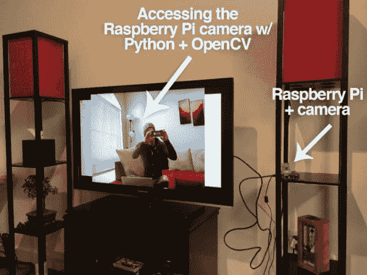

# 使用 OpenCV 和 Python 访问 Raspberry Pi 摄像机

> 原文：<https://pyimagesearch.com/2015/03/30/accessing-the-raspberry-pi-camera-with-opencv-and-python/>

在过去的一年里，PyImageSearch 博客有很多受欢迎的博文。使用 k-means 聚类来寻找图像中的主色曾经(现在仍然)非常流行。我个人最喜欢的文章之一，[构建一个超棒的移动文档扫描仪](https://pyimagesearch.com/2014/09/01/build-kick-ass-mobile-document-scanner-just-5-minutes/ "How to Build a Kick-Ass Mobile Document Scanner in Just 5 Minutes")几个月来一直是最受欢迎的 PyImageSearch 文章。我写的第一个(大的)教程，[霍比特人和直方图](https://pyimagesearch.com/2014/01/27/hobbits-and-histograms-a-how-to-guide-to-building-your-first-image-search-engine-in-python/ "Hobbits and Histograms – A How-To Guide to Building Your First Image Search Engine in Python")，一篇关于建立一个简单的图像搜索引擎的文章，今天仍然有很多点击。

但是 ***到目前为止*** ，PyImageSearch 博客上最受欢迎的帖子是我的教程[在你的 Raspberry Pi 2 和 B+](https://pyimagesearch.com/2015/02/23/install-opencv-and-python-on-your-raspberry-pi-2-and-b/ "Install OpenCV and Python on your Raspberry Pi 2 and B+") 上安装 OpenCV 和 Python。看到你和 PyImageSearch 的读者们对 Raspberry Pi 社区的喜爱真的是太棒了，我计划在未来继续写更多关于 OpenCV+Raspberry Pi 的文章。

无论如何，在我发布了 Raspberry Pi + OpenCV 安装教程之后，许多评论都要求我继续讨论如何使用 Python 和 OpenCV 访问 Raspberry Pi 相机。

在本教程中，我们将使用 [picamera](https://picamera.readthedocs.org/en/release-1.9/) ，它为相机模块提供了一个纯 Python 接口。最棒的是，我将向您展示如何使用 picamera 来捕捉 OpenCV 格式的图像。

请继续阅读，了解如何…

***重要:**在遵循本教程中的步骤之前，请务必遵循我的 [Raspberry Pi OpenCV 安装指南](https://pyimagesearch.com/opencv-tutorials-resources-guides/)。*

**OpenCV 和 Python 版本:**
这个例子将运行在 **Python 2.7/Python 3.4+** 和 **OpenCV 2.4.X/OpenCV 3.0+** 上。

# 第一步:我需要什么？

首先，你需要一个 Raspberry Pi 相机板模块。

我从亚马逊以不到 30 美元的价格买到了我的 [5MP Raspberry Pi 相机板模块，含运费。很难相信相机板模块几乎和 Raspberry Pi 本身一样贵——但它只是显示了过去 5 年硬件的进步。我还拿起了一个](http://www.amazon.com/gp/product/B00E1GGE40/ref=as_li_tl?ie=UTF8&camp=1789&creative=390957&creativeASIN=B00E1GGE40&linkCode=as2&tag=trndingcom-20&linkId=XF5KMO3TGBUENU5T)[相机外壳](http://www.amazon.com/gp/product/B00IJZJKK4/ref=as_li_tl?ie=UTF8&camp=1789&creative=390957&creativeASIN=B00IJZJKK4&linkCode=as2&tag=trndingcom-20&linkId=PMQZXV7K7MWCPAZ3)来保护相机的安全，因为为什么不呢？

假设你已经有了相机模块，你需要安装它。安装非常简单，我不会创建我自己的安装相机板的教程，我只会让你参考官方的 Raspberry Pi 相机安装指南:

<https://www.youtube.com/embed/GImeVqHQzsE?feature=oembed>