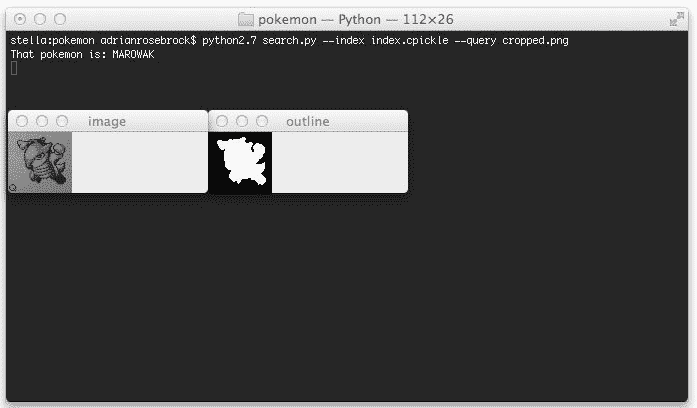
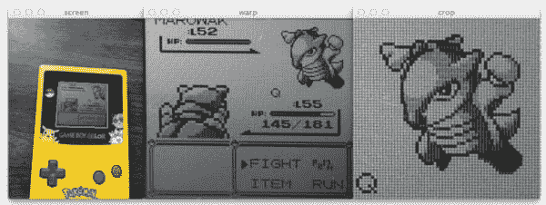
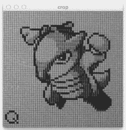
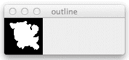
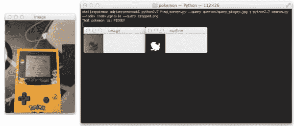
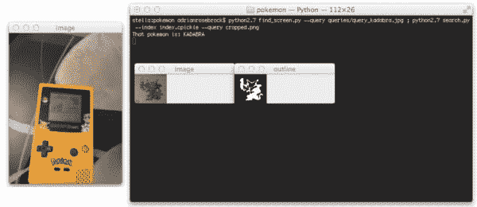

# 用 Python 构建 Pokedex:用 OpenCV 比较形状描述符(第 6 步，共 6 步)

> 原文：<https://pyimagesearch.com/2014/05/19/building-pokedex-python-comparing-shape-descriptors-opencv/>

[](https://pyimagesearch.com/wp-content/uploads/2014/05/marowak-results.jpg)

这是用 Python 和 OpenCV 构建真实 Pokedex 的最后一步。

这是一切汇集的地方。

我们将把所有的碎片粘在一起，组成一个基于形状特征的图像搜索引擎。

我们探索了使用计算机视觉建造一个 Pokedex 需要什么。然后我们[搜索网页，建立了一个口袋妖怪](https://pyimagesearch.com/2014/03/24/building-pokedex-python-scraping-pokemon-sprites-step-2-6/ "Building a Pokedex in Python: Scraping the Pokemon Sprites (Step 2 of 6)")的数据库。我们已经使用 Zernike moments 索引了口袋妖怪精灵数据库[。我们已经分析了查询图像，并使用边缘检测和轮廓发现技术](https://pyimagesearch.com/2014/04/07/building-pokedex-python-indexing-sprites-using-shape-descriptors-step-3-6/ "Building a Pokedex in Python: Indexing our Sprites using Shape Descriptors (Step 3 of 6)")找到了我们的游戏男孩屏幕[。我们已经使用`cv2.warpPerspective`函数](https://pyimagesearch.com/2014/04/21/building-pokedex-python-finding-game-boy-screen-step-4-6/ "Building a Pokedex in Python: Finding the Game Boy Screen (Step 4 of 6)")执行了透视扭曲和变换[。](https://pyimagesearch.com/2014/05/05/building-pokedex-python-opencv-perspective-warping-step-5-6/ "Building a Pokedex in Python: OpenCV and Perspective Warping (Step 5 of 6)")

原来如此。最后一步。是时候将所有这些步骤结合到一个工作的 Pokedex 中了。

你准备好了吗？

我是。这是一个伟大的系列职位。我准备好把它带回家了。

# 以前的帖子

这篇文章是关于如何使用 Python、OpenCV、计算机视觉和图像处理技术构建真实 Pokedex 的一系列博客文章的一部分。如果这是你正在阅读的系列文章中的第一篇，一定要花时间去消化它，理解我们在做什么。但是在你读完之后，一定要回到之前的文章。有大量与计算机视觉、图像处理和图像搜索引擎相关的精彩内容，你一定不想错过！

最后，如果您有任何问题，[请发邮件给我](https://pyimagesearch.com/contact/)。我喜欢和读者聊天。我很乐意回答你关于计算机视觉的任何问题。

*   **步骤 1:** [用 Python 构建 Pokedex:入门(第 1 步，共 6 步)](https://pyimagesearch.com/2014/03/10/building-pokedex-python-getting-started-step-1-6/)
*   **第二步:** [用 Python 构建 Pokedex:抓取口袋妖怪精灵(第二步，共六步)](https://pyimagesearch.com/2014/03/24/building-pokedex-python-scraping-pokemon-sprites-step-2-6/)
*   **第三步:** [用 Python 构建 Pokedex:使用形状描述符索引我们的精灵(第三步，共六步)](https://pyimagesearch.com/2014/04/07/building-pokedex-python-indexing-sprites-using-shape-descriptors-step-3-6/)
*   **第 4 步:** [用 Python 构建 Pokedex:寻找游戏男孩屏幕(第 4 步，共 6 步)](https://pyimagesearch.com/2014/04/21/building-pokedex-python-finding-game-boy-screen-step-4-6/)
*   **第 5 步:** [用 Python 构建 Pokedex:OpenCV 和透视扭曲(第 5 步，共 6 步)](https://pyimagesearch.com/2014/05/05/building-pokedex-python-opencv-perspective-warping-step-5-6/)

# 用 Python 构建 Pokedex:比较形状描述符

当我们结束前一篇文章时，我们已经将透视扭曲和变换应用到我们的 Game Boy 屏幕上，以获得自上而下/鸟瞰视图:

[](https://pyimagesearch.com/wp-content/uploads/2014/04/python-opencv-perspective-transform.jpg)

**Figure 1:** Performing a perspective transformation using Python and OpenCV on the Game Boy screen and cropping out the Pokemon.

然后，我们提取了与口袋妖怪在屏幕中的位置相对应的 ROI(感兴趣区域)。

[](https://pyimagesearch.com/wp-content/uploads/2014/04/marowak-cropped.jpg)

**Figure 2:** Cropping the Pokemon from our Game Boy screen using Python and OpenCV.

从这里开始，需要做两件事。

首先，我们需要使用 Zernike 矩从裁剪的口袋妖怪(我们的“查询图像”)中提取特征。

Zernike 矩用于表征图像中物体的形状。你可以在这里阅读更多关于他们的信息。

其次，一旦我们有了形状特征，我们需要将它们与我们的形状特征数据库进行比较。在构建 Pokedex 的第二步中，我们从口袋妖怪精灵数据库中提取了 Zernike 矩。我们将使用 Zernike 特征向量之间的欧几里德距离来确定两个口袋妖怪精灵有多“相似”。

现在我们有了一个计划，让我们定义一个`Searcher`类，它将用于比较查询图像和我们的 Pokemon 精灵索引:

```
# import the necessary packages
from scipy.spatial import distance as dist

class Searcher:
	def __init__(self, index):
		# store the index that we will be searching over
		self.index = index

	def search(self, queryFeatures):
		# initialize our dictionary of results
		results = {}

		# loop over the images in our index
		for (k, features) in self.index.items():
			# compute the distance between the query features
			# and features in our index, then update the results
			d = dist.euclidean(queryFeatures, features)
			results[k] = d

		# sort our results, where a smaller distance indicates
		# higher similarity
		results = sorted([(v, k) for (k, v) in results.items()])

		# return the results
		return results

```

我们在第二条线上做的第一件事是导入 SciPy `distance`包。这个包包含了许多距离函数，但具体来说，我们将使用欧几里德距离来比较特征向量。

**第 4 行**定义了我们的`Searcher`类，**第 5-7 行**定义了构造函数。我们将接受一个单一的参数，我们特性的`index`。我们将假设我们的`index`是一个标准的 Python 字典，以口袋妖怪的名字作为键，以形状特征(即用于量化口袋妖怪形状和轮廓的数字列表)作为值。

**第 9 行**定义了我们的`search`方法。这个方法只接受一个参数——我们的查询特性。我们将查询特征与索引中的每个值(特征向量)进行比较。

我们在第 11 行的**上初始化我们的`results`字典。口袋妖怪的名字将是关键，特征向量之间的距离将作为值。**

最后，我们可以对**14-18 行**进行比较。我们首先循环遍历我们的`index`，然后我们计算查询特征和第 17 行的**索引中的特征之间的欧几里德距离。最后，我们使用当前的 Pokemon 名称作为键，距离作为值来更新我们的`results`字典。**

我们通过在**行 22** 上对`results`进行排序来结束我们的`search`方法，其中特征向量之间的距离越小表示图像越“相似”。然后我们在第 25 行**返回我们的`results`。**

在实际比较特征向量方面，所有繁重的工作都由我们的`Searcher`类来完成。它从数据库中获取预先计算的特征的索引，然后将该索引与查询特征进行比较。然后根据相似性对这些结果进行排序，并将其返回给调用函数。

现在我们已经定义了 Searcher 类，让我们创建`search.py`，它将把所有东西粘在一起:

```
# import the necessary packages
from pyimagesearch.searcher import Searcher
from pyimagesearch.zernikemoments import ZernikeMoments
import numpy as np
import argparse
import pickle
import imutils
import cv2

# construct the argument parser and parse the arguments
ap = argparse.ArgumentParser()
ap.add_argument("-", "--index", required = True,
	help = "Path to where the index file will be stored")
ap.add_argument("-q", "--query", required = True,
	help = "Path to the query image")
args = vars(ap.parse_args())

# load the index
index = open(args["index"], "rb").read()
index = pickle.loads(index)

```

**第 2-8 行**处理导入我们需要的所有包。出于组织的目的，我将我们的`Searcher`类放在了`pyimagesearch`包中。这同样适用于第 3 行**的`ZernikeMoments`形状描述符和第 7 行**的`imutils`。`imutils`包简单地包含了一些方便的方法，可以很容易地调整图像的大小。然后，我们导入 NumPy 来操作我们的数组(因为 OpenCV 将图像视为多维 NumPy 数组)，`argparse`解析我们的命令行参数，`cPickle`加载我们预先计算的特性索引，`cv2`将我们绑定到 OpenCV 库中。

**第 11-16 行**解析我们的命令行参数。`--index`开关是到我们预先计算的索引的路径，而`--query`是到我们裁剪的查询图像的路径，这是[步骤 5](https://pyimagesearch.com/2014/05/05/building-pokedex-python-opencv-perspective-warping-step-5-6/ "Building a Pokedex in Python: OpenCV and Perspective Warping (Step 5 of 6)") 的输出。

**第 19 行和第 20 行**简单地使用`pickle`从磁盘上加载我们预先计算的 Zernike 矩指数。

现在让我们从磁盘上加载查询图像并对其进行预处理:

```
# load the query image, convert it to grayscale, and
# resize it
image = cv2.imread(args["query"])
image = cv2.cvtColor(image, cv2.COLOR_BGR2GRAY)
image = imutils.resize(image, width = 64)

```

这段代码非常简单明了，但是我们还是来看一下吧。

**第 24 行**使用`cv2.imread`函数从磁盘上加载我们的查询图像。然后，我们将查询图像转换成第 25 行的灰度图像。最后，我们在第 26 行的**上调整图像的宽度为 64 像素。**

我们现在需要为形状描述符准备查询图像，方法是对其进行阈值处理并找到轮廓:

```
# threshold the image
thresh = cv2.adaptiveThreshold(image, 255, cv2.ADAPTIVE_THRESH_MEAN_C,
	cv2.THRESH_BINARY_INV, 11, 7)

# initialize the outline image, find the outermost
# contours (the outline) of the pokemon, then draw
# it
outline = np.zeros(image.shape, dtype = "uint8")
cnts = cv2.findContours(thresh.copy(), cv2.RETR_EXTERNAL,
	cv2.CHAIN_APPROX_SIMPLE)
cnts = imutils.grab_contours(cnts)
cnts = sorted(cnts, key = cv2.contourArea, reverse = True)[0]
cv2.drawContours(outline, [cnts], -1, 255, -1)

```

第一步是在第 29 行和第 30 行对我们的查询图像进行阈值处理。我们将使用`cv2.adaptiveThreshold`函数应用自适应阈值，并将低于阈值的所有像素设置为黑色(0)，高于阈值的所有像素设置为白色(255)。

我们的阈值输出如下所示:

[](https://pyimagesearch.com/wp-content/uploads/2014/05/marowak-threshold.png)

**Figure 3:** Applying local thresholding our query image using `cv2.adaptiveThreshold`.

接下来，我们在第 36-38 行的**上用我们的查询图像的相同维度初始化一个“空白”零数组。这个图像将持有我们的口袋妖怪的轮廓/剪影。**

对第 36 行**上`cv2.findContours`的调用在我们的阈值图像中找到所有轮廓。`cv2.findContours`函数*会破坏你在*中传递的图像，所以一定要用 NumPy `copy()`方法复制一份。**

然后，我们对**线 39** 做一个重要的假设。我们将假设具有最大面积的轮廓(使用`cv2.contourArea`函数计算)对应于我们的口袋妖怪的轮廓。

这个假设是合理的。鉴于我们已经成功地从原始图像中裁剪出了口袋妖怪，面积最大的轮廓对应于我们的口袋妖怪当然是合理的。

从这里，我们使用 cv2.drawContours 函数在第 40 行上绘制最大的轮廓。

您可以在下面看到绘制等高线的输出:

[](https://pyimagesearch.com/wp-content/uploads/2014/05/marowak-outline.png)

**Figure 4:** Drawing the largest contours using `cv2.contourArea` and `cv2.drawContours`.

我们代码的其余部分非常简单:

```
# compute Zernike moments to characterize the shape of
# pokemon outline
desc = ZernikeMoments(21)
queryFeatures = desc.describe(outline)

# perform the search to identify the pokemon
searcher = Searcher(index)
results = searcher.search(queryFeatures)
print "That pokemon is: %s" % results[0][1].upper()

# show our images
cv2.imshow("image", image)
cv2.imshow("outline", outline)
cv2.waitKey(0)

```

我们在半径为 21 像素的**线** **44** 上初始化我们的`ZernikeMoments`形状描述符。这就是我们在[索引口袋妖怪精灵数据库](https://pyimagesearch.com/2014/04/07/building-pokedex-python-indexing-sprites-using-shape-descriptors-step-3-6/ "Building a Pokedex in Python: Indexing our Sprites using Shape Descriptors (Step 3 of 6)")时使用的半径完全相同的描述符。因为我们的目的是比较我们的口袋妖怪图像的相似性，使用一个描述符进行索引，然后使用另一个描述符进行比较是没有意义的。如果您的目的是比较图像的相似性，获得一致的图像特征表示是很重要的。

**线 45** 然后从上面的**图 4** 中看到的轮廓/剪影图像中提取我们的 Zernike 矩。

为了执行我们的实际搜索，我们首先在**行 48** 上初始化我们的`Searcher`，并在**行 49** 上执行搜索。

因为我们的结果是按照相似性排序的(首先是较小的欧几里德距离)，所以列表中的第一个元组将包含我们的标识。我们在第 50 行的**处打印出我们确定的口袋妖怪的名字。**

最后，我们显示我们的查询图像和轮廓，并等待在第 53-55 行上的按键。

要执行我们的脚本，发出以下命令:

```
$ python search.py --index index.cpickle --query cropped.png

```

当我们的脚本执行完毕时，您会看到类似下面的内容:

[](https://pyimagesearch.com/wp-content/uploads/2014/05/marowak-results.jpg)

**Figure 5:** The results of our identification. Sure enough, our Pokemon is a Marowak

果不其然，我们的口袋妖怪是一只马罗瓦克。

以下是使用波波作为查询影像时的结果:

[](https://pyimagesearch.com/wp-content/uploads/2014/05/pidgey-results.jpg)

**Figure 6:** Identifying Pidgey with our Pokedex.

和 Kadabra:

[](https://pyimagesearch.com/wp-content/uploads/2014/05/kadabra-results.jpg)

**Figure 7:** Identifying Kadabra with our Pokedex.

你会注意到 Kabdra 大纲并没有完全“填充”。幸运的是，我们的 Zernike moments 形状功能足够强大，可以处理这种情况。但这可能是一个信号，表明我们在预处理图像时应该更加小心。我将把它留给读者作为未来的工作。

无论如何，在所有情况下，我们的口袋妖怪图像搜索引擎能够毫无问题地识别口袋妖怪。

谁说 Pokedex 是虚构的？

显然，通过利用计算机视觉和图像处理技术，我们能够在现实生活中建立一个！

# 摘要

在这篇文章中，我们总结了用 Python 和 OpenCV 构建 Pokedex 的系列文章。

我们利用了许多重要的计算机视觉和图像处理技术，如灰度转换、阈值处理和轮廓查找。

然后我们用 Zernike 矩来描述我们口袋妖怪的形状。

为了构建一个实际的图像搜索引擎，我们需要一个查询图像。我们捕获了 Game Boy 屏幕的原始照片，然后应用透视扭曲和变换来获得屏幕的俯视图/鸟瞰图。

最后，本文使用 OpenCV 和 Python 比较了我们的形状描述符。

最终结果是一个现实生活中的工作 Pokedex！

只需将您的智能手机对准 Game Boy 屏幕，抓拍一张照片，我给你的 Python 脚本就会处理好剩下的事情！

# 包扎

我希望你和我一样喜欢这一系列的博文！

我花了很多时间来写这样的帖子，如果你能花点时间在下面的表格中输入你的电子邮件地址，我会非常感激，这样我可以在写更多文章的时候和你保持联系。