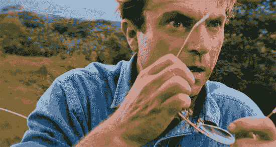
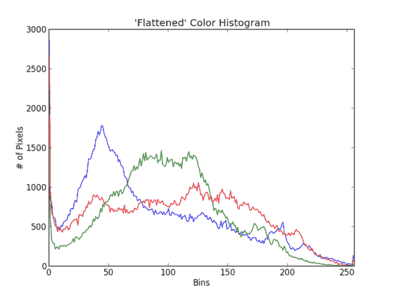
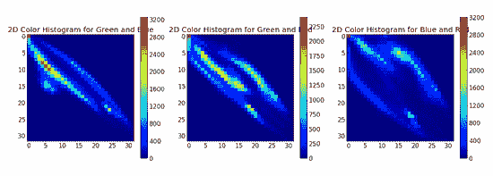

# 聪明的女孩:计算机视觉和图像搜索引擎利用颜色直方图指南

> 原文：<https://pyimagesearch.com/2014/01/22/clever-girl-a-guide-to-utilizing-color-histograms-for-computer-vision-and-image-search-engines/>

[](https://pyimagesearch.com/wp-content/uploads/2014/01/grant.jpg)

> 这是……这是直方图。格兰特博士

好吧。所以这可能不是准确的报价。但我认为格兰特博士如果知道颜色直方图的力量也会同样激动不已。

更重要的是，停电时，直方图不会吃掉游客。

那么，到底什么是直方图呢？直方图表示图像中颜色的分布。它可以被可视化为一个图形(或绘图),给出强度(像素值)分布的高层次直觉。在本例中，我们假设 RGB 颜色空间，因此这些像素值将在 0 到 255 的范围内。如果您在不同的色彩空间中工作，像素范围可能会有所不同。

绘制直方图时，X 轴充当我们的“箱”。如果我们构建一个有 256 个面元的直方图，那么我们可以有效地计算每个像素值出现的次数。相比之下，如果我们只使用 2 个(等间距的)面元，那么我们计算一个像素在范围`[0, 128)`或`[128, 255]`内的次数。然后，在 Y 轴上绘制被装箱到 X 轴值的像素数。

**OpenCV 和 Python 版本:**
这个例子将运行在 **Python 2.7** 和 **OpenCV 2.4.X/OpenCV 3.0+** 上。

通过简单地检查图像的直方图，您可以对对比度、亮度和强度分布有一个大致的了解。

这篇文章会给你一个 OpenCV 直方图的例子，从开始到结束。

# 图像搜索引擎的应用

在图像搜索引擎的上下文中，直方图可以充当特征向量(即，用于量化图像并将其与其他图像进行比较的数字列表)。为了在图像搜索引擎中使用颜色直方图，我们假设具有相似颜色分布的图像在语义上是相似的。我将在这篇文章后面的“缺点”部分详细讨论这个假设；但是，暂时让我们假设具有相似颜色分布的图像具有相似的内容。

可以使用距离度量来比较颜色直方图的“相似性”。常见的选择包括:欧几里得、相关、卡方、交集和 Bhattacharyya。在大多数情况下，我倾向于使用卡方距离，但选择通常取决于被分析的图像数据集。无论您使用哪种距离度量，我们都将使用 OpenCV 来提取颜色直方图。

# 游览侏罗纪公园

让我们想象一下，我们正和格兰特博士一行人一起进行他们的第一次侏罗纪公园之旅。我们带着手机来记录整个经历(让我们也假设拍照手机在当时是一个“东西”)。假设我们没有像丹尼斯·内德瑞那样让我们的脸被恐龙吃掉，我们可以稍后从我们的智能手机上下载图片到我们的电脑上，并为每张图片计算直方图。

在旅行的最开始，我们花了很多时间在实验室里，了解 DNA，并见证了一只小迅猛龙的孵化。这些实验室有很多“钢铁”和“灰色”的颜色。后来，我们上了吉普车，开进了公园。公园本身就是一片丛林——到处都是绿色。

那么基于这两种颜色分布，你觉得上面的格兰特博士图像更像哪一种呢？

嗯，我们看到照片的背景中有相当多的绿色植物。十有八九，格兰特博士照片的颜色分布会与我们在丛林之旅中拍摄的照片以及我们在实验室中拍摄的照片更加“相似”。

[](https://pyimagesearch.com/practical-python-opencv/?src=in-post-clever-girl)

# 使用 OpenCV 计算直方图

现在，让我们开始构建一些我们自己的颜色直方图。

我们将使用 OpenCV 中的`cv2.calcHist`函数来构建直方图。在我们进入任何代码示例之前，让我们快速回顾一下这个函数:

```
cv2.calcHist(images, channels, mask, histSize, ranges)

```

1.  **图像:**这是我们想要计算直方图的图像。包装成列表:`[myImage]`。
2.  **通道:**一个索引列表，在这里我们指定要计算直方图的通道的索引。要计算灰度图像的直方图，列表应该是`[0]`。为了计算所有三个红色、绿色和蓝色通道的直方图，通道列表应该是`[0, 1, 2]`。
3.  **蒙版:**我还没有在这个博客中介绍蒙版，但本质上，蒙版是一个与我们的原始图像形状相同的`uint8`图像，其中零值的像素被忽略，值大于零的像素被包括在直方图计算中。使用掩模允许我们只计算图像的特定区域的直方图。现在，我们将只使用一个值`None`作为遮罩。
4.  **histSize:** 这是我们在计算直方图时想要使用的箱数。同样，这是一个列表，我们为每个通道计算一个直方图。箱子的大小不必都一样。以下是每个通道 32 个箱的示例:`[32, 32, 32]`。
5.  **范围:**可能的像素值范围。通常，这是每个通道的`[0, 256]`，但是如果您使用 RGB 以外的颜色空间(如 HSV)，范围可能会有所不同。

现在我们已经了解了`cv2.calcHist`函数，让我们来写一些实际的代码。

```
# import the necessary packages
from matplotlib import pyplot as plt
import numpy as np
import argparse
import cv2

# construct the argument parser and parse the arguments
ap = argparse.ArgumentParser()
ap.add_argument("-i", "--image", required = True, help = "Path to the image")
args = vars(ap.parse_args())

# load the image and show it
image = cv2.imread(args["image"])
cv2.imshow("image", image)

```

这段代码还不是很令人兴奋。我们所做的就是导入我们需要的包，设置一个参数解析器，并加载我们的图像。

```
# convert the image to grayscale and create a histogram
gray = cv2.cvtColor(image, cv2.COLOR_BGR2GRAY)
cv2.imshow("gray", gray)
hist = cv2.calcHist([gray], [0], None, [256], [0, 256])
plt.figure()
plt.title("Grayscale Histogram")
plt.xlabel("Bins")
plt.ylabel("# of Pixels")
plt.plot(hist)
plt.xlim([0, 256])

```

现在事情变得更有趣了。在第 2 行，我们将图像从 RGB 色彩空间转换为灰度。第 4 行计算实际的直方图。继续将代码的参数与上面的函数文档进行匹配。我们可以看到，我们的第一个参数是灰度图像。灰度图像只有一个通道，因此我们使用值`[0]`作为`channels`。我们没有掩码，所以我们将`mask`值设置为`None`。我们将在直方图中使用 256 个柱，可能的值范围从 0 到 256。

对`plt.show()`的调用显示:

[](https://pyimagesearch.com/wp-content/uploads/2014/01/grant-gray-hist.png)

**Figure 1:** Dr. Grant grayscale histogram.

还不错。我们如何解释这个直方图？嗯，箱(0-255)被绘制在 X 轴上。Y 轴计算每个箱中的像素数量。大多数像素在大约 50 到大约 125 的范围内。观察直方图的右尾部，我们看到在 200 到 255 的范围内只有很少的像素。这意味着图像中很少有“白”像素。

现在我们已经看到了灰度直方图，让我们来看看我所说的“扁平”颜色直方图:

```
# grab the image channels, initialize the tuple of colors,
# the figure and the flattened feature vector
chans = cv2.split(image)
colors = ("b", "g", "r")
plt.figure()
plt.title("'Flattened' Color Histogram")
plt.xlabel("Bins")
plt.ylabel("# of Pixels")
features = []

# loop over the image channels
for (chan, color) in zip(chans, colors):
	# create a histogram for the current channel and
	# concatenate the resulting histograms for each
	# channel
	hist = cv2.calcHist([chan], [0], None, [256], [0, 256])
	features.extend(hist)

	# plot the histogram
	plt.plot(hist, color = color)
	plt.xlim([0, 256])

# here we are simply showing the dimensionality of the
# flattened color histogram 256 bins for each channel
# x 3 channels = 768 total values -- in practice, we would
# normally not use 256 bins for each channel, a choice
# between 32-96 bins are normally used, but this tends
# to be application dependent
print "flattened feature vector size: %d" % (np.array(features).flatten().shape)

```

与灰度直方图相比，计算扁平化的颜色直方图肯定需要更多的代码。让我们把这段代码拆开，更好地了解发生了什么:

*   第 29 行和第 30 行:我们要做的第一件事是将图像分成三个通道:蓝色、绿色和红色。通常，我们读到的是红、绿、蓝(RGB)。但是，OpenCV 以相反的顺序将图像存储为 NumPy 数组:BGR。这一点值得注意。然后，我们初始化一组表示颜色的字符串。
*   **第 31-35 行:**这里我们只是设置我们的 PyPlot 图，并初始化我们的级联直方图列表。
*   第 38 行:让我们开始循环频道。
*   第 42 行和第 43 行:我们现在正在为每个通道计算直方图。本质上，这与计算单通道灰度图像的直方图是一样的。然后，我们将颜色直方图连接到我们的特征列表。
*   **第 46 和 47 行:**使用当前通道名称绘制直方图。
*   第 55 行:在这里，我们只是检查我们的扁平颜色直方图的形状。我称之为“扁平”直方图，并不是因为(1)直方图没有“峰值”或者(2)我调用 NumPy 的 flatten()方法。我称之为“扁平”直方图，因为直方图是像素计数的单一列表。稍后，我们将探索多维直方图(2D 和 3D)。展平的直方图就是将每个单独通道 *的直方图*连接在一起*。*

现在让我们绘制颜色直方图:

[](https://pyimagesearch.com/wp-content/uploads/2014/01/flattened_color.png)

**Figure 2:** Color histograms for each Red, Green, and Blue channel of the Dr. Grant image.

太棒了。这很简单。这个直方图告诉我们什么？嗯，在仓#50 周围的深蓝色像素值中有一个峰值。这个蓝色范围指的是格兰特的蓝色衬衫。从箱#50 到#125 的更大范围的绿色像素指的是背景中格兰特博士后面的森林。

# 多维直方图

到目前为止，我们一次只计算了一个通道的直方图。现在我们转向多维直方图，一次考虑两个通道。

我喜欢用**和**这个词来解释多维直方图。比如我们可以问一个问题比如
“有多少像素的红色值为 10 **，**的蓝色值为 30？”有多少像素的绿色值为 200 **红色值为 130**？通过使用连接词**和**，我们能够构建多维直方图。

就这么简单。让我们检查一些代码来自动完成构建 2D 直方图的过程:

```
# let's move on to 2D histograms -- I am reducing the
# number of bins in the histogram from 256 to 32 so we
# can better visualize the results
fig = plt.figure()

# plot a 2D color histogram for green and blue
ax = fig.add_subplot(131)
hist = cv2.calcHist([chans[1], chans[0]], [0, 1], None,
	[32, 32], [0, 256, 0, 256])
p = ax.imshow(hist, interpolation = "nearest")
ax.set_title("2D Color Histogram for Green and Blue")
plt.colorbar(p)

# plot a 2D color histogram for green and red
ax = fig.add_subplot(132)
hist = cv2.calcHist([chans[1], chans[2]], [0, 1], None,
	[32, 32], [0, 256, 0, 256])
p = ax.imshow(hist, interpolation = "nearest")
ax.set_title("2D Color Histogram for Green and Red")
plt.colorbar(p)

# plot a 2D color histogram for blue and red
ax = fig.add_subplot(133)
hist = cv2.calcHist([chans[0], chans[2]], [0, 1], None,
	[32, 32], [0, 256, 0, 256])
p = ax.imshow(hist, interpolation = "nearest")
ax.set_title("2D Color Histogram for Blue and Red")
plt.colorbar(p)

# finally, let's examine the dimensionality of one of
# the 2D histograms
print "2D histogram shape: %s, with %d values" % (
	hist.shape, hist.flatten().shape[0])

```

是的，这是相当多的代码。但这只是因为我们正在为 RGB 通道的每种组合计算 2D 颜色直方图:红色和绿色，红色和蓝色，绿色和蓝色。

既然我们正在处理多维直方图，我们需要记住我们正在使用的仓的数量。在前面的例子中，出于演示的目的，我使用了 256 个箱。然而，如果我们对 2D 直方图中的每个维度使用 256 个面元，那么我们得到的直方图将具有 65，536 个单独的像素计数。这不仅浪费资源，而且不切实际。计算多维直方图时，大多数应用程序使用 8 到 64 个区间。如第 64 行和第 65 行所示，我现在使用 32 个而不是 256 个。

通过检查`cv2.calcHist`函数的第一个参数，可以看出这段代码中最重要的内容。这里我们看到我们正在传递两个通道的列表:绿色和蓝色通道。这就是全部了。

那么 2D 直方图是如何存储在 OpenCV 中的呢？这是 2D 数字阵列。因为我为每个通道使用了 32 个面元，所以现在我有一个 32×32 的直方图。我们可以简单地通过展平它来将这个直方图视为一个特征向量(**行 88 和 89** )。展平直方图会产生一个包含 1024 个值的列表。

我们如何可视化 2D 直方图？让我们来看看。

[](https://pyimagesearch.com/wp-content/uploads/2014/01/grant-2d-histograms.png)

**Figure 3:** 2D color histograms for Dr. Grant.

在上图中，我们看到了三个图表。第一个是绿色和蓝色通道的 2D 颜色直方图，第二个是绿色和红色的直方图，第三个是蓝色和红色的直方图。蓝色阴影代表低像素计数，而红色阴影代表高像素计数(即 2D 直方图中的峰值)。当 X=5 且 Y=10 时，我们可以在绿色和蓝色 2D 直方图(第一幅图)中看到这样一个峰值。

使用 2D 直方图一次考虑两个通道。但是如果我们想考虑所有三个 RGB 通道呢？你猜对了。我们现在要构建一个 3D 直方图。

```
# our 2D histogram could only take into account 2 out
# of the 3 channels in the image so now let's build a
# 3D color histogram (utilizing all channels) with 8 bins
# in each direction -- we can't plot the 3D histogram, but
# the theory is exactly like that of a 2D histogram, so
# we'll just show the shape of the histogram
hist = cv2.calcHist([image], [0, 1, 2],
	None, [8, 8, 8], [0, 256, 0, 256, 0, 256])
print "3D histogram shape: %s, with %d values" % (
	hist.shape, hist.flatten().shape[0])

```

这里的代码非常简单——它只是上面代码的扩展。我们现在为每个 RGB 通道计算一个 8×8×8 的直方图。我们无法形象化这个直方图，但可以看到形状确实是`(8, 8, 8)`有 512 个值。同样，将 3D 直方图视为特征向量可以通过简单地展平阵列来完成。

# 色彩空间

本文中的例子只探索了 RGB 颜色空间，但是可以在 OpenCV 中为任何颜色空间构建直方图。讨论色彩空间超出了本文的范围，但是如果你感兴趣，可以查看关于转换色彩空间的文档。

# 缺点

在这篇文章的前面，我们假设具有相似颜色分布的图像在语义上是相似的。对于小而简单的数据集，事实上可能是这样。然而，在实践中，这一假设并不总是成立的。

让我们想想这是为什么。

首先，根据定义，颜色直方图忽略了图像中物体的形状和纹理。这意味着颜色直方图没有对象形状或对象纹理的概念。此外，直方图还忽略任何空间信息(即，像素值来自图像中的何处)。直方图的扩展，颜色相关图，可以用于编码像素之间的空间关系。

我们来想想 [Chic Engine](http://www.chicengine.com) ，我的视觉时尚搜索引擎 iPhone app。我对不同类型的衣服有不同的分类，比如鞋子和衬衫。如果我用颜色直方图来描述一只红鞋子和一件红衬衫，直方图会假设它们是同一个对象。很明显它们都是红色的，但是语义到此为止——它们根本不一样。颜色直方图根本无法“模拟”鞋子或衬衫是什么。

最后，颜色直方图对“噪声”很敏感，例如拍摄图像的环境中的光照变化和量化误差(选择要增加的面元)。通过使用不同于 RGB 的颜色空间(例如 HSV 或 L*a*b*)可以潜在地减轻这些限制。

然而，尽管如此，直方图仍然被广泛用作图像描述符。它们实现起来非常简单，计算速度也非常快。虽然它们有其局限性，但如果在正确的环境中正确使用，它们会非常强大。

直到周一！