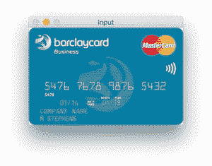
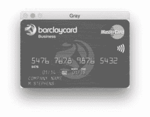
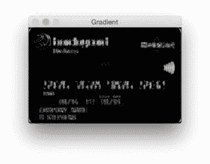
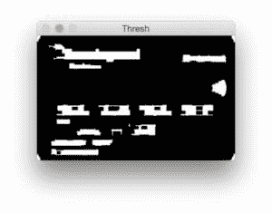
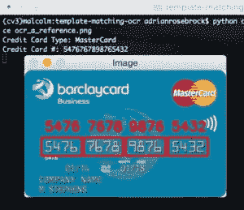
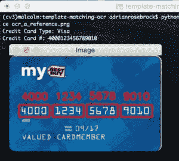
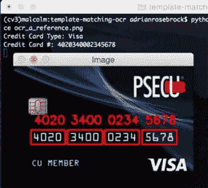
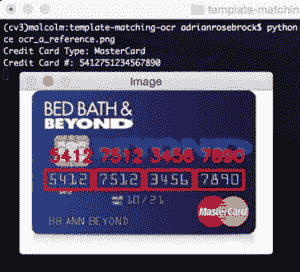
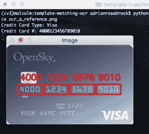

# 用 OpenCV 和 Python 实现信用卡 OCR

> 原文：<https://pyimagesearch.com/2017/07/17/credit-card-ocr-with-opencv-and-python/>

今天的博文是我们最近关于光学字符识别(OCR)和计算机视觉系列的延续。

在之前的博客文章中，我们学习了[如何安装 Tesseract 二进制文件并将其用于 OCR](https://pyimagesearch.com/2017/07/03/installing-tesseract-for-ocr/) 。然后，我们学习了如何使用基本的图像处理技术来清理图像，以[提高 Tesseract OCR 的输出](https://pyimagesearch.com/2017/07/10/using-tesseract-ocr-python/)。

然而，正如我在这些之前的帖子中多次提到的，Tesseract *不应该被视为能够获得高精度的光学字符识别的通用现成解决方案。*

在某些情况下，它会工作得很好，而在其他情况下，它会悲惨地失败。

这种用例的一个很好的例子是信用卡识别，给定一个输入图像，
我们希望:

1.  检测图像中信用卡的位置。
2.  将与信用卡上的十六位数字相关的四组四位数字本地化。
3.  应用 OCR 来识别信用卡上的十六位数字。
4.  识别信用卡的类型(如 Visa、MasterCard、American Express 等。).

在这些情况下，Tesseract 库无法正确识别数字(这可能是因为 Tesseract 没有接受过信用卡示例字体的训练)。因此，我们需要设计自己的 OCR 信用卡定制解决方案。

在今天的博文中，我将展示我们如何使用模板匹配作为一种 OCR 形式来帮助我们创建一个解决方案，以自动识别信用卡并从图像中提取相关的信用卡数字。

**要了解更多关于在 OpenCV 和 Python 中使用 OCR 模板匹配的信息，*请继续阅读。***

## 用 OpenCV 和 Python 实现信用卡 OCR

今天的博文分为三部分。

在第一部分中，我们将讨论 OCR-A 字体，这是一种专门为帮助光学字符识别算法而创建的字体。

然后我们将设计一个计算机视觉和图像处理算法，它可以:

1.  定位信用卡上的四组四位数。
2.  提取这四个分组中的每一个，然后分别对十六个数字进行分段。
3.  使用模板匹配和 OCR-A 字体识别十六位信用卡数字中的每一位。

最后，我们将看一些将我们的信用卡 OCR 算法应用于实际图像的例子。

### OCR 字体

OCR-A 字体是在 20 世纪 60 年代末设计的，以便(1)当时的 OCR 算法和(2)人类可以容易地识别字符。该字体得到包括 ANSI 和 ISO 等标准组织的支持。

尽管现代 OCR 系统不需要 OCR-A 等特殊字体，但它仍广泛用于身份证、报表和信用卡。

事实上，有相当多的字体是专门为 OCR 设计的，包括 OCR-B 和 MICR E-13B。

虽然现在你可能不会经常写纸质支票，但下次你写的时候，你会看到底部使用的 MICR E-13B 字体包含了你的路由和账号。MICR 代表磁性墨水字符识别代码。磁性传感器、照相机和扫描仪都会定期读取你的支票。

以上每种字体都有一个共同点——它们都是为方便 OCR 而设计的。

在本教程中，我们将为 OCR 制作一个模板匹配系统——一种常见于信用卡/借记卡正面的字体。

### 使用 OpenCV 通过模板匹配进行 OCR

在本节中，我们将使用 Python + OpenCV 实现我们的模板匹配算法，以自动识别信用卡数字。

为了实现这一点，我们需要应用一些图像处理操作，包括阈值处理、计算梯度幅度表示、形态学操作和轮廓提取。这些技术已经在其他博客文章中使用过，用于[检测图像中的条形码](https://pyimagesearch.com/2015/11/30/detecting-machine-readable-zones-in-passport-images/)和[识别护照图像中的机器可读区域](https://pyimagesearch.com/2015/11/30/detecting-machine-readable-zones-in-passport-images/)。

因为将会有许多图像处理操作被应用来帮助我们检测和提取信用卡数字，所以我已经包括了输入图像通过我们的图像处理管道时的许多中间截图。

这些额外的截图将让您更加深入地了解我们如何能够将基本的图像处理技术链接在一起，以构建计算机视觉项目的解决方案。

让我们开始吧。

打开一个新文件，命名为`ocr_template_match.py`，然后我们开始工作:

```
# import the necessary packages
from imutils import contours
import numpy as np
import argparse
import imutils
import cv2

```

**行 1-** **6** 处理这个脚本的导入包。如果你的机器上还没有安装 [OpenCV](https://pyimagesearch.com/opencv-tutorials-resources-guides/) 和 [imutils](https://github.com/jrosebr1/imutils) ，你将需要安装它们。模板匹配在 OpenCV 中已经存在一段时间了，所以您的版本(v2.4，v3。*，等等。)可能会起作用。

要安装/升级`imutils`，只需使用`pip`:

```
$ pip install --upgrade imutils

```

***注意:**如果你正在使用 Python 虚拟环境(正如我所有的 [OpenCV 安装教程](https://pyimagesearch.com/opencv-tutorials-resources-guides/)所做的)，确保你首先使用`workon`命令访问你的虚拟环境，然后安装/升级`imutils`* *。*

现在我们已经安装并导入了包，我们可以解析我们的命令行参数了:

```
# construct the argument parser and parse the arguments
ap = argparse.ArgumentParser()
ap.add_argument("-i", "--image", required=True,
	help="path to input image")
ap.add_argument("-r", "--reference", required=True,
	help="path to reference OCR-A image")
args = vars(ap.parse_args())

```

在**的第 8-14 行**我们建立了一个参数解析器，添加两个参数，解析它们，存储为变量`args`。

两个必需的命令行参数是:

*   `--image`:要进行 OCR 的图像的路径。
*   `--reference`:参考 OCR-A 图像的路径。该图像包含 OCR-A 字体中的数字 0-9，从而允许我们稍后在管道中执行模板匹配。

接下来，让我们定义信用卡类型:

```
# define a dictionary that maps the first digit of a credit card
# number to the credit card type
FIRST_NUMBER = {
	"3": "American Express",
	"4": "Visa",
	"5": "MasterCard",
	"6": "Discover Card"
}

```

信用卡类型，如美国运通卡、维萨卡等。，可以通过[检查 16 位信用卡号](http://money.howstuffworks.com/personal-finance/debt-management/credit-card1.htm)的第一位来识别。在**第 16-23 行**我们定义了一个字典`FIRST_NUMBER`，它将第一个数字映射到相应的信用卡类型。

让我们通过加载参考 OCR-A 图像来开始我们的图像处理管道:

```
# load the reference OCR-A image from disk, convert it to grayscale,
# and threshold it, such that the digits appear as *white* on a
# *black* background
# and invert it, such that the digits appear as *white* on a *black*
ref = cv2.imread(args["reference"])
ref = cv2.cvtColor(ref, cv2.COLOR_BGR2GRAY)
ref = cv2.threshold(ref, 10, 255, cv2.THRESH_BINARY_INV)[1]

```

首先，我们加载`reference` OCR-A 图像(**第 29 行**)，然后将其转换为灰度(**第 30 行**)并对其进行阈值处理+反转(**第 31 行**)。在每个操作中，我们存储或覆盖我们的参考图像`ref`。

[](https://pyimagesearch.com/wp-content/uploads/2017/06/ocr_a_reference_bitwise.jpg)

**Figure 4:** The OCR-A font for the digits 0-9\. We will be using this font along with template matching to OCR credit card digits in images.

**图 4** 显示了这些步骤的结果。

现在让我们在 OCR 上定位轮廓——字体图像:

```
# find contours in the OCR-A image (i.e,. the outlines of the digits)
# sort them from left to right, and initialize a dictionary to map
# digit name to the ROI
refCnts = cv2.findContours(ref.copy(), cv2.RETR_EXTERNAL,
	cv2.CHAIN_APPROX_SIMPLE)
refCnts = imutils.grab_contours(refCnts)
refCnts = contours.sort_contours(refCnts, method="left-to-right")[0]
digits = {}

```

在**的第 36 行和第 37 行**中，我们找到了`ref`图像中的轮廓。然后，由于 OpenCV 2.4、3 和 4 版本[存储返回轮廓信息的方式不同](https://pyimagesearch.com/2015/08/10/checking-your-opencv-version-using-python/)，我们检查版本并对第**行第 38** 处的`refCnts`进行适当的更改。

接下来，我们[从左到右对轮廓](https://pyimagesearch.com/2015/04/20/sorting-contours-using-python-and-opencv/)进行排序，并初始化一个字典`digits`，它将数字名称映射到感兴趣的区域(**第 39 和 40 行**)。

此时，我们应遍历轮廓，提取 ROI，并将其与相应的数字相关联:

```
# loop over the OCR-A reference contours
for (i, c) in enumerate(refCnts):
	# compute the bounding box for the digit, extract it, and resize
	# it to a fixed size
	(x, y, w, h) = cv2.boundingRect(c)
	roi = ref[y:y + h, x:x + w]
	roi = cv2.resize(roi, (57, 88))

	# update the digits dictionary, mapping the digit name to the ROI
	digits[i] = roi

```

在**第 43 行**，我们循环参考图像轮廓。在循环中，`i`保存数字名称/数字，`c`保存轮廓。

我们在每个轮廓周围计算一个边界框，`c`，(**第 46 行**)存储 *(x，y)*——矩形的坐标和宽度/高度。

在**第 47 行**上，我们使用边界矩形参数从`ref`(参考图像)中提取`roi`。该 ROI 包含数字。我们将**第 48 行**的每个 ROI 调整为 57×88 像素的固定大小。我们需要确保*每个*数字都被调整到固定的大小，以便在本教程的后面应用数字识别的模板匹配。

我们将每个数字 0-9(字典键)与第 51 行的每个`roi`图像(字典值)相关联。

**此时，我们已经完成了从参考图像中提取数字，并将它们与相应的数字名称相关联。**

我们的下一个目标是分离出输入`--image`中的 16 位信用卡号码。我们需要找到并隔离这些数字，然后才能启动模板匹配来识别每个数字。这些图像处理步骤相当有趣和有见地，尤其是如果你以前从未开发过图像处理管道，一定要密切关注。

让我们继续初始化几个结构化内核:

```
# initialize a rectangular (wider than it is tall) and square
# structuring kernel
rectKernel = cv2.getStructuringElement(cv2.MORPH_RECT, (9, 3))
sqKernel = cv2.getStructuringElement(cv2.MORPH_RECT, (5, 5))

```

你可以把内核想象成一个小矩阵，我们在图像上滑动它来进行(卷积)操作，例如模糊、锐化、边缘检测或其他图像处理操作。

在第 55 行和第 56 行上，我们构造了两个这样的内核——一个是矩形的，一个是正方形的。我们将使用矩形的用于[礼帽形态操作符](https://en.wikipedia.org/wiki/Top-hat_transform)，方形的用于闭合操作。我们将很快看到这些技术的实际应用。

现在让我们准备要进行 OCR 的图像:

```
# load the input image, resize it, and convert it to grayscale
image = cv2.imread(args["image"])
image = imutils.resize(image, width=300)
gray = cv2.cvtColor(image, cv2.COLOR_BGR2GRAY)

```

在**第 59 行**中，我们加载了保存信用卡照片的命令行参数`image`。然后，我们将它调整为`width=300`、*，保持纵横比* ( **第 60 行**)，接着将其转换为灰度(**第 61 行**)。

让我们看看我们的输入图像:

[](https://pyimagesearch.com/wp-content/uploads/2017/06/ocr_input.jpg)

**Figure 5:** The example input credit card image that we will be OCR’ing in the rest of this tutorial.

接下来是我们的调整大小和灰度操作:

[](https://pyimagesearch.com/wp-content/uploads/2017/06/ocr_gray.jpg)

**Figure 6:** Converting the image to grayscale is a requirement prior to applying the rest of our image processing pipeline.

现在，我们的图像是灰度的，大小是一致的，让我们执行一个形态学操作:

```
# apply a tophat (whitehat) morphological operator to find light
# regions against a dark background (i.e., the credit card numbers)
tophat = cv2.morphologyEx(gray, cv2.MORPH_TOPHAT, rectKernel)

```

使用我们的`rectKernel`和`gray`图像，我们执行一个[礼帽](https://en.wikipedia.org/wiki/Top-hat_transform)形态学操作，将结果存储为`tophat` ( **第 65 行**)。

正如您在下图中看到的，礼帽操作在深色背景(即信用卡号码)下显示出浅色区域:

[](https://pyimagesearch.com/wp-content/uploads/2017/06/ocr_tophat.jpg)

**Figure 7:** Applying a tophat operations reveals light regions (i.e., the credit card digits) against a dark background.

给定我们的`tophat`图像，让我们计算沿着 *x* 方向的梯度:

```
# compute the Scharr gradient of the tophat image, then scale
# the rest back into the range [0, 255]
gradX = cv2.Sobel(tophat, ddepth=cv2.CV_32F, dx=1, dy=0,
	ksize=-1)
gradX = np.absolute(gradX)
(minVal, maxVal) = (np.min(gradX), np.max(gradX))
gradX = (255 * ((gradX - minVal) / (maxVal - minVal)))
gradX = gradX.astype("uint8")

```

我们分离数字的下一步是计算`tophat`图像在 *x* 方向的[沙尔梯度](https://en.wikipedia.org/wiki/Sobel_operator)。我们在第 69 行**和第 70 行**完成这个计算，将结果存储为`gradX`。

在计算了`gradX`数组中每个元素的绝对值之后，我们采取一些步骤将这些值缩放到范围 *[0-255]* (因为图像当前是浮点数据类型)。为此，我们计算`gradX` ( **行 72** )的`minVal`和`maxVal`，然后是**行 73** 所示的缩放等式(即最小/最大归一化)。最后一步是将`gradX`转换为`uint8`，其范围为*【0-255】*(**行 74** )。

结果如下图所示:

[](https://pyimagesearch.com/wp-content/uploads/2017/06/ocr_gradient.jpg)

**Figure 8:** Computing the Scharr gradient magnitude representation of the image reveals vertical changes in the gradient.

让我们继续改进我们的信用卡数字查找算法:

```
# apply a closing operation using the rectangular kernel to help
# cloes gaps in between credit card number digits, then apply
# Otsu's thresholding method to binarize the image
gradX = cv2.morphologyEx(gradX, cv2.MORPH_CLOSE, rectKernel)
thresh = cv2.threshold(gradX, 0, 255,
	cv2.THRESH_BINARY | cv2.THRESH_OTSU)[1]

# apply a second closing operation to the binary image, again
# to help close gaps between credit card number regions
thresh = cv2.morphologyEx(thresh, cv2.MORPH_CLOSE, sqKernel)

```

为了缩小间隙，我们在**线 79** 上进行关闭操作。注意，我们再次使用了`rectKernel`。随后，我们对`gradX`图像执行 [Otsu](https://en.wikipedia.org/wiki/Otsu%27s_method) 和二进制阈值处理(**行 80 和 81** )，随后是另一个关闭操作(**行 85** )。这些步骤的结果如下所示:

[](https://pyimagesearch.com/wp-content/uploads/2017/06/ocr_thresh.jpg)

**Figure 9:** Thresholding our gradient magnitude representation reveals candidate regions” for the credit card numbers we are going to OCR.

接下来，让我们找到轮廓并初始化数字分组位置列表。

```
# find contours in the thresholded image, then initialize the
# list of digit locations
cnts = cv2.findContours(thresh.copy(), cv2.RETR_EXTERNAL,
	cv2.CHAIN_APPROX_SIMPLE)
cnts = imutils.grab_contours(cnts)
locs = []

```

在**第 89-91 行**中，我们找到轮廓并把它们存储在一个列表中，`cnts`。然后，我们初始化一个列表来保存**行 92** 上的数字组位置。

现在让我们循环遍历轮廓，同时根据每个轮廓的纵横比进行过滤，这样我们就可以从信用卡的其他不相关区域中删除数字组位置:

```
# loop over the contours
for (i, c) in enumerate(cnts):
	# compute the bounding box of the contour, then use the
	# bounding box coordinates to derive the aspect ratio
	(x, y, w, h) = cv2.boundingRect(c)
	ar = w / float(h)

	# since credit cards used a fixed size fonts with 4 groups
	# of 4 digits, we can prune potential contours based on the
	# aspect ratio
	if ar > 2.5 and ar < 4.0:
		# contours can further be pruned on minimum/maximum width
		# and height
		if (w > 40 and w < 55) and (h > 10 and h < 20):
			# append the bounding box region of the digits group
			# to our locations list
			locs.append((x, y, w, h))

```

在**第 95 行**，我们以和参考图像相同的方式循环遍历轮廓。在计算了每个轮廓的外接矩形之后，`c` ( **第 98 行**)，我们通过将宽度除以高度(**第 99 行**)来计算纵横比，`ar`。

使用纵横比，我们分析每个轮廓的形状。如果`ar`在 2.5 和 4.0 之间(宽大于高)，以及`w`在 40 和 55 像素之间，而`h`在 10 和 20 像素之间，我们将边界矩形参数以一个方便的元组追加到`locs` ( **第 101-110 行**)。

***注意:**这些长宽比以及最小宽度和高度的值是在我的输入信用卡图像集上通过实验找到的。您可能需要为自己的应用程序更改这些值。*

下图显示了我们找到的分组——出于演示目的，我让 OpenCV 在每个分组周围绘制了一个边界框:

[](https://pyimagesearch.com/wp-content/uploads/2017/06/ocr_groupings.jpg)

**Figure 10:** Highlighting the four groups of four digits (sixteen overall) on a credit card.

接下来，我们将从左到右对分组进行排序，并为信用卡数字初始化一个列表:

```
# sort the digit locations from left-to-right, then initialize the
# list of classified digits
locs = sorted(locs, key=lambda x:x[0])
output = []

```

在**行** **114** 上，我们根据 *x-* 值对`locs`进行排序，因此它们将从左到右排序。

我们初始化一个列表`output`，它将在**行 115** 中保存图像的信用卡号。

现在我们知道了每组四位数的位置，让我们遍历这四个已排序的分组并确定其中的位数。

这个循环相当长，分为三个代码块，这是第一个代码块:

```
# loop over the 4 groupings of 4 digits
for (i, (gX, gY, gW, gH)) in enumerate(locs):
	# initialize the list of group digits
	groupOutput = []

	# extract the group ROI of 4 digits from the grayscale image,
	# then apply thresholding to segment the digits from the
	# background of the credit card
	group = gray[gY - 5:gY + gH + 5, gX - 5:gX + gW + 5]
	group = cv2.threshold(group, 0, 255,
		cv2.THRESH_BINARY | cv2.THRESH_OTSU)[1]

	# detect the contours of each individual digit in the group,
	# then sort the digit contours from left to right
	digitCnts = cv2.findContours(group.copy(), cv2.RETR_EXTERNAL,
		cv2.CHAIN_APPROX_SIMPLE)
	digitCnts = imutils.grab_contours(digitCnts)
	digitCnts = contours.sort_contours(digitCnts,
		method="left-to-right")[0]

```

在该循环的第一个块中，我们在每侧提取并填充该组 5 个像素(**行 125** )，应用阈值处理(**行 126 和 127** )，并查找和排序轮廓(**行 129-135** )。详情一定要参考代码。

下面显示的是已提取的单个组:

[](https://pyimagesearch.com/wp-content/uploads/2017/06/ocr_group_extraction.jpg)

**Figure 11:** An example of extracting a single group of digits from the input credit card for OCR.

让我们用一个嵌套循环继续这个循环，进行模板匹配和相似性得分提取:

```
	# loop over the digit contours
	for c in digitCnts:
		# compute the bounding box of the individual digit, extract
		# the digit, and resize it to have the same fixed size as
		# the reference OCR-A images
		(x, y, w, h) = cv2.boundingRect(c)
		roi = group[y:y + h, x:x + w]
		roi = cv2.resize(roi, (57, 88))

		# initialize a list of template matching scores	
		scores = []

		# loop over the reference digit name and digit ROI
		for (digit, digitROI) in digits.items():
			# apply correlation-based template matching, take the
			# score, and update the scores list
			result = cv2.matchTemplate(roi, digitROI,
				cv2.TM_CCOEFF)
			(_, score, _, _) = cv2.minMaxLoc(result)
			scores.append(score)

		# the classification for the digit ROI will be the reference
		# digit name with the *largest* template matching score
		groupOutput.append(str(np.argmax(scores)))

```

使用`cv2.boundingRect`我们获得提取包含每个数字的 ROI 所需的参数(**行 142 和 143** )。为了使模板匹配具有一定程度的准确性，我们将第 144 行上的`roi`调整为与我们的参考 OCR-A 字体数字图像(57×88 像素)相同的大小。

我们在**行 147** 上初始化一个`scores`列表。请将此视为我们的置信度得分——它越高，就越有可能是正确的模板。

现在，让我们循环(第三个嵌套循环)每个参考数字**并执行模板匹配。这是为这个脚本**所做的繁重工作。

OpenCV 有一个方便的函数叫做`cv2.matchTemplate`,在这个函数中你提供两个图像:一个是模板，另一个是输入图像。对这两幅图像应用`cv2.matchTemplate`的目的是确定它们有多相似。

在这种情况下，我们提供参考图像`digitROI`和来自包含候选数字的信用卡的`roi`。使用这两幅图像，我们调用模板匹配函数并存储`result` ( **行 153 和 154** )。

接下来，我们从`result` ( **第 155 行**)中提取`score`，并将其添加到我们的`scores`列表中(**第 156 行**)。这就完成了最内层的循环。

使用分数(0-9 的每个数字一个)，我们取最大分数——最大分数*应该是我们正确识别的数字*。我们在**第 160 行**找到得分最高的数字，通过`np.argmax`抓取具体指标。这个索引的整数名称表示基于与每个模板的比较的最可能的数字(同样，记住索引已经预先排序为 0-9)。

最后，让我们在每组周围画一个矩形，并以红色文本查看图像上的信用卡号:

```
	# draw the digit classifications around the group
	cv2.rectangle(image, (gX - 5, gY - 5),
		(gX + gW + 5, gY + gH + 5), (0, 0, 255), 2)
	cv2.putText(image, "".join(groupOutput), (gX, gY - 15),
		cv2.FONT_HERSHEY_SIMPLEX, 0.65, (0, 0, 255), 2)

	# update the output digits list
	output.extend(groupOutput)

```

对于这个循环的第三个也是最后一个块，我们在组周围画一个 5 像素的填充矩形(**行 163 和 164** )，然后在屏幕上画文本(**行 165 和 166** )。

最后一步是将数字附加到输出列表中。Pythonic 式的方法是使用`extend`函数，将 iterable 对象(本例中是一个列表)的每个元素附加到列表的末尾。

为了查看脚本的执行情况，让我们将结果输出到终端，并在屏幕上显示我们的图像。

```
# display the output credit card information to the screen
print("Credit Card Type: {}".format(FIRST_NUMBER[output[0]]))
print("Credit Card #: {}".format("".join(output)))
cv2.imshow("Image", image)
cv2.waitKey(0)

```

**线 172** 将信用卡类型打印到控制台，然后在随后的**线 173** 上打印信用卡号。

在最后一行，我们在屏幕上显示图像，并在退出脚本前等待任何键被按下**行 174 和 175** 。

花一点时间祝贺自己——你坚持到了最后。概括地说，这个脚本:

1.  在字典中存储信用卡类型。
2.  拍摄参考图像并提取数字。
3.  将数字模板存储在字典中。
4.  本地化四个信用卡号码组，每个组包含四个数字(总共 16 个数字)。
5.  提取要“匹配”的数字。
6.  对每个数字执行模板匹配，将每个 ROI 与每个数字模板 0-9 进行比较，同时存储每个尝试匹配的分数。
7.  找到每个候选数字的最高分，并构建一个名为`output`的列表，其中包含信用卡号。
8.  将信用卡号和信用卡类型输出到我们的终端，并将输出图像显示到我们的屏幕上。

现在是时候看看脚本的运行情况并检查我们的结果了。

### 信用卡 OCR 结果

既然我们已经编写了信用卡 OCR 系统的代码，让我们试一试。

在这个例子中，我们显然不能使用真实的信用卡号码，所以我使用 Google 收集了一些信用卡的示例图片。这些信用卡*显然是伪造的*，并且仅用于演示目的。

然而，你可以在这篇博文中应用同样的技术来识别真实信用卡上的数字。

要查看我们的信用卡 OCR 系统的运行情况，请打开一个终端并执行以下命令:

```
$ python ocr_template_match.py --reference ocr_a_reference.png \
	--image images/credit_card_05.png
Credit Card Type: MasterCard
Credit Card #: 5476767898765432

```

我们的第一张结果图，100%正确:

[](https://pyimagesearch.com/wp-content/uploads/2017/06/ocr_result_05.jpg)

**Figure 12:** Applying template matching with OpenCV and Python to OCR the digits on a credit card.

请注意，我们是如何通过检查信用卡号的第一个数字来正确地将信用卡标记为 *MasterCard* 的。

让我们尝试第二个图像，这一次是签证:

```
$ python ocr_template_match.py --reference ocr_a_reference.png \
	--image images/credit_card_01.png
Credit Card Type: Visa
Credit Card #: 4000123456789010

```

[](https://pyimagesearch.com/wp-content/uploads/2017/06/ocr_result_01.jpg)

**Figure 13:** A second example of OCR’ing digits using Python and OpenCV.

再一次，我们能够使用模板匹配正确地识别信用卡。

再来一张图片，这次来自宾夕法尼亚州的一家信用合作社 PSECU:

```
$ python ocr_template_match.py --reference ocr_a_reference.png \
	--image images/credit_card_02.png
Credit Card Type: Visa
Credit Card #: 4020340002345678

```

[](https://pyimagesearch.com/wp-content/uploads/2017/06/ocr_result_02.jpg)

**Figure 14:** Our system is correctly able to find the digits on the credit card, then apply template matching to recognize them.

我们的 OCR 模板匹配算法可以正确识别 16 位数字中的每一位。假设 16 位数字中的每一位都被正确识别，我们也可以将信用卡标记为 Visa。

这是另一张万事达卡的示例图片，这张图片来自《床、浴室和其他》:

```
$ python ocr_template_match.py --reference ocr_a_reference.png \
	--image images/credit_card_03.png
Credit Card Type: MasterCard
Credit Card #: 5412751234567890

```

[](https://pyimagesearch.com/wp-content/uploads/2017/06/ocr_result_03.jpg)

**Figure 15:** Regardless of credit card design and type, we can still detect the digits and recognize them using template matching.

我们的模板匹配 OCR 算法在这里没有问题！

作为我们的最后一个例子，让我们使用另一种签证:

```
$ python ocr_template_match.py --reference ocr_a_reference.png \
	--image images/credit_card_04.png
Credit Card Type: Visa
Credit Card #: 4000123456789010

```

[](https://pyimagesearch.com/wp-content/uploads/2017/06/ocr_result_04.jpg)

**Figure 16:** A final example of applying OCR with Python and OpenCV.

在这篇博文的每个例子中，我们使用 OpenCV 和 Python 的模板匹配 OCR 脚本 100%正确地识别了 16 位数字中的每一位。

再者，模板匹配也是比较数字时非常*快速的*方法。

不幸的是，我们无法将我们的 OCR 图像应用到真实的信用卡图像上，因此这无疑提出了一个问题，即这种方法在真实的图像上是否可靠。鉴于照明条件、视角和其他一般噪声的变化，我们可能需要采取一种更加面向机器学习的方法。

不管怎样，至少对于这些示例图像，我们能够成功地将模板匹配应用为一种 OCR 形式。

## 摘要

在本教程中，我们学习了如何通过 OpenCV 和 Python 使用模板匹配来执行光学字符识别(OCR)。

具体来说，我们应用我们的模板匹配 OCR 方法来识别信用卡的类型以及 16 个信用卡数字。

为此，我们将图像处理流程分为 4 个步骤:

1.  通过各种图像处理技术，包括形态学操作、阈值处理和轮廓提取，检测信用卡上的四组四个数字。
2.  从四个分组中提取每个单独的数字，得到需要分类的 16 个数字。
3.  通过与 OCR-A 字体进行比较，将模板匹配应用于每个数字，以获得我们的数字分类。
4.  检查信用卡号的第一个数字以确定发行公司。

在评估了我们的信用卡 OCR 系统之后，我们发现，如果发卡的信用卡公司使用 OCR-A 字体来表示数字，那么它是 100%准确的。

为了扩展这个应用程序，您可能希望在野外收集信用卡的真实图像，并潜在地训练一个机器学习模型(通过标准的特征提取或训练或卷积神经网络)，以进一步提高该系统的准确性。

我希望你喜欢这篇关于使用 OpenCV 和 Python 通过模板匹配进行 OCR 的博文。

为了在 PyImageSearch 上发布未来教程时得到通知，请务必在下表中输入您的电子邮件地址！