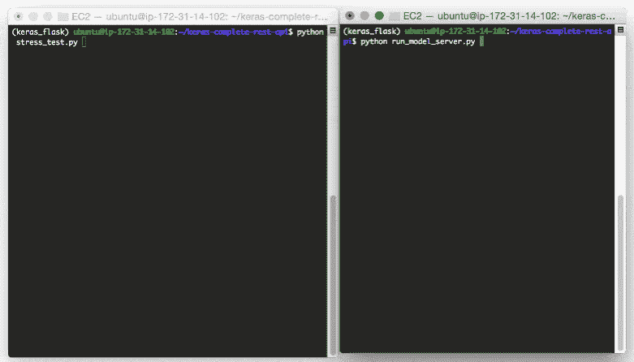

# 使用 Keras、Redis、Flask 和 Apache 在生产中进行深度学习

> 原文：<https://pyimagesearch.com/2018/02/05/deep-learning-production-keras-redis-flask-apache/>

将深度学习模型交付给生产是一项重要的任务。

如果你不相信我，花一秒钟看看亚马逊、谷歌、微软等“科技巨头”。— *几乎所有的*都提供了一些方法，将你的机器学习/深度学习模型运送到云中进行生产。

使用模型部署服务是完全可以接受的……**但是如果您想*拥有整个流程*并且*不依赖外部服务，该怎么办？***

这种情况比你想象的更常见。考虑:

*   不能将敏感数据移出网络的内部项目
*   指定整个基础结构必须位于公司内部的项目
*   需要私有云的政府组织
*   处于“秘密模式”的初创公司，需要在内部对其服务/应用进行压力测试

在这些情况下，你会如何将你的深度学习模型投入生产，也许最重要的是，**同时使它*可扩展*？**

今天的帖子是我们关于构建深度学习模型服务器 REST API 的三部分系列的最后一章:

1.  第一部分 ( **发布在 Keras.io 官方博客上！**)是一个简单的 Keras +深度学习 REST API，用于单线程使用，没有并发请求。如果这是你第一次构建深度学习 web 服务器，或者如果你正在做一个家庭/业余爱好项目，这种方法非常适合。
2.  在[第二部分](https://pyimagesearch.com/2018/01/29/scalable-keras-deep-learning-rest-api/)中，我们展示了如何利用 **Redis** 以及**消息排队/消息代理**范例高效地批量处理传入的推理请求(但是在服务器线程上有一个小警告，可能会导致问题)。
3.  在本系列的最后一部分，我将向您展示如何解决这些服务器线程问题，进一步扩展我们的方法，提供基准，并演示如何使用 Keras、Redis、Flask 和 Apache 在生产中高效扩展深度学习。

正如我们的压力测试结果将展示的那样，我们的单个 GPU 机器可以轻松处理 **500 个并发请求**(每个请求之间的延迟为 0.05 秒)，而无需担心— ***这种性能还会继续扩展。***

**要了解如何使用 Keras、Redis、Flask 和 Apache 将自己的深度学习模型交付到生产中，*继续阅读。***

## 使用 Keras、Redis、Flask 和 Apache 在生产中进行深度学习

***2020-06-16 更新:**此博文现已兼容 TensorFlow 2+!*

<https://www.youtube.com/embed/1uoHYcMZ7nc?feature=oembed>