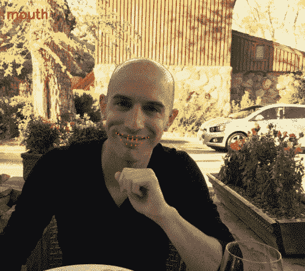
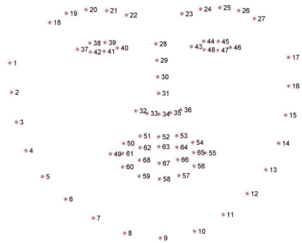
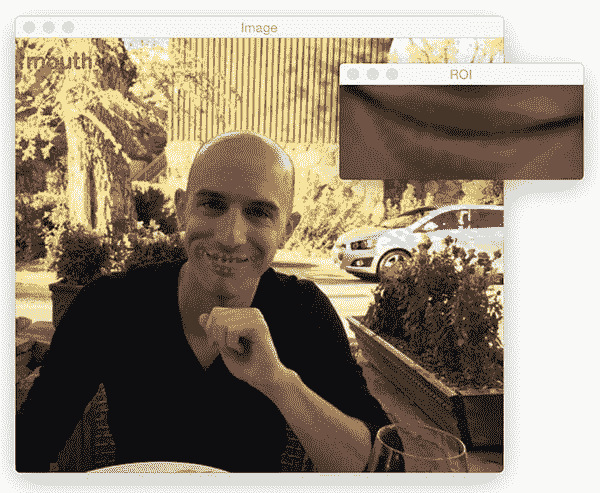
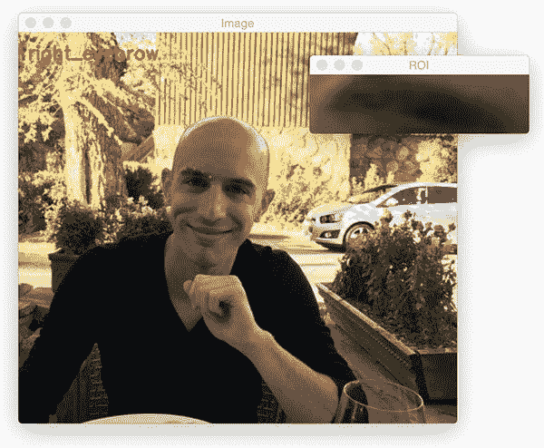
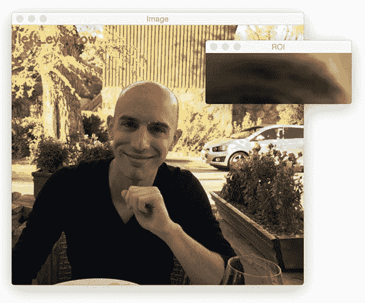
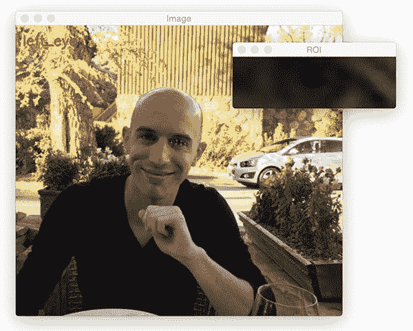
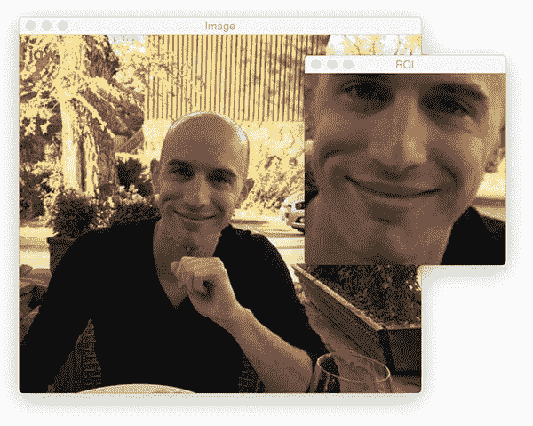
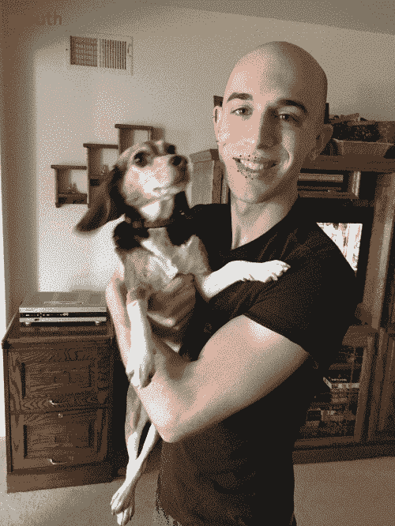
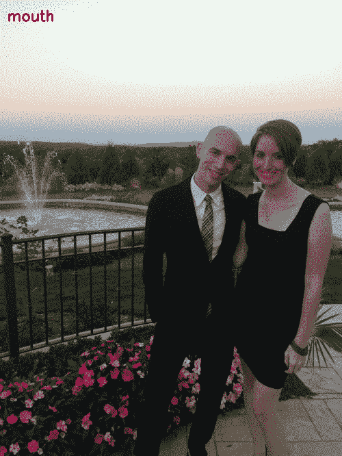

# 使用 dlib、OpenCV 和 Python 检测眼睛、鼻子、嘴唇和下巴

> 原文：<https://pyimagesearch.com/2017/04/10/detect-eyes-nose-lips-jaw-dlib-opencv-python/>

今天的博客文章是我们当前关于面部标志检测及其在计算机视觉和图像处理中的应用系列的第三部分。



两周前，我演示了如何安装 dlib 库，我们用它来检测面部标志。

然后，上周我讨论了如何使用 dlib 来实际地 [*检测图像*](https://pyimagesearch.com/2017/04/03/facial-landmarks-dlib-opencv-python/)中的面部标志。

今天，我们将采取下一步，使用我们检测到的面部标志来帮助我们标记和提取面部区域，包括:

*   口
*   右眉
*   左眉毛
*   右眼
*   左眼
*   鼻子
*   颌

**要了解如何使用 dlib、OpenCV 和 Python 分别提取这些人脸区域，*继续阅读。***

## 使用 dlib、OpenCV 和 Python 检测眼睛、鼻子、嘴唇和下巴

今天的博文将首先讨论与面部标志相关的 *(x，y)*-坐标，以及如何将这些面部标志映射到面部的*特定*区域。

然后，我们将编写一些代码，用于提取面部区域的每一个。

我们将通过在一些示例图像上演示我们的方法的结果来结束这篇博文。

在这篇博文结束时，你将对如何通过面部标志(自动)提取面部区域有一个深刻的理解，并将能够将这一知识应用到你自己的应用中。

### 面部区域的面部标志索引

dlib 内部实现的面部标志检测器产生 68 个 *(x，y)*-坐标，映射到*特定的面部结构*。这 68 个点映射是通过在标记的 [iBUG 300-W 数据集](https://ibug.doc.ic.ac.uk/resources/facial-point-annotations/)上训练形状预测器而获得的。

下面我们可以看到这 68 个坐标中的每一个都映射到了什么:



**Figure 1:** Visualizing each of the 68 facial coordinate points from the iBUG 300-W dataset ([higher resolution](https://pyimagesearch.com/wp-content/uploads/2017/04/facial_landmarks_68markup.jpg)).

检查图像，我们可以看到面部区域可以通过简单的 Python 索引来访问(假设使用 Python 零索引，因为上面的图像是一个索引):

*   通过*【48，68】*可以进入*口*。
*   *右眉*通穴*【17、22】。*
*   左眉*经*穴*【22、27】*。
*   *右眼*使用*【36，42】。*
*   *左眼*与*【42，48】。*
*   *鼻*使用*【27，35】。*
*   并且通过*【0，17】夹爪。*

这些映射编码在 imutils 库的 [face_utils 内的`FACIAL_LANDMARKS_IDXS`字典中:](https://github.com/jrosebr1/imutils/blob/master/imutils/face_utils.py#L8)

```
# define a dictionary that maps the indexes of the facial
# landmarks to specific face regions
FACIAL_LANDMARKS_IDXS = OrderedDict([
	("mouth", (48, 68)),
	("right_eyebrow", (17, 22)),
	("left_eyebrow", (22, 27)),
	("right_eye", (36, 42)),
	("left_eye", (42, 48)),
	("nose", (27, 35)),
	("jaw", (0, 17))
])

```

使用这个字典，我们可以很容易地将索引提取到面部标志数组中，并通过提供一个字符串作为关键字来提取各种面部特征。

### 用 OpenCV 和 Python 可视化面部标志

稍微困难一点的任务是*可视化*这些面部标志中的每一个，并将结果叠加在输入图像上。

为此，我们需要已经包含在 imutils 库中的`visualize_facial_landmarks`函数[:](https://github.com/jrosebr1/imutils/blob/master/imutils/face_utils/helpers.py#L56)

```
def visualize_facial_landmarks(image, shape, colors=None, alpha=0.75):
	# create two copies of the input image -- one for the
	# overlay and one for the final output image
	overlay = image.copy()
	output = image.copy()

	# if the colors list is None, initialize it with a unique
	# color for each facial landmark region
	if colors is None:
		colors = [(19, 199, 109), (79, 76, 240), (230, 159, 23),
			(168, 100, 168), (158, 163, 32),
			(163, 38, 32), (180, 42, 220)]

```

我们的`visualize_facial_landmarks`函数需要两个参数，后跟两个可选参数，每个参数详述如下:

*   我们将要在其上绘制面部标志可视化的图像。
*   `shape`:NumPy 数组，包含映射到各个面部部位的 68 个面部标志坐标。
*   `colors`:用于对每个面部标志区域进行颜色编码的 BGR 元组列表。
*   `alpha`:用于控制原始图像上叠加的不透明度的参数。

**第 45 行和第 46 行**创建了我们输入图像的两个副本——我们需要这些副本，以便在输出图像上绘制一个半透明的覆盖图。

**第 50 行**检查`colors`列表是否为`None`，如果是，用预设的 BGR 元组列表初始化(记住，OpenCV 是按 BGR 顺序而不是 RGB 顺序存储颜色/像素强度的)。

我们现在准备通过面部标志来可视化每个单独的面部区域:

```
	# loop over the facial landmark regions individually
	for (i, name) in enumerate(FACIAL_LANDMARKS_IDXS.keys()):
		# grab the (x, y)-coordinates associated with the
		# face landmark
		(j, k) = FACIAL_LANDMARKS_IDXS[name]
		pts = shape[j:k]

		# check if are supposed to draw the jawline
		if name == "jaw":
			# since the jawline is a non-enclosed facial region,
			# just draw lines between the (x, y)-coordinates
			for l in range(1, len(pts)):
				ptA = tuple(pts[l - 1])
				ptB = tuple(pts[l])
				cv2.line(overlay, ptA, ptB, colors[i], 2)

		# otherwise, compute the convex hull of the facial
		# landmark coordinates points and display it
		else:
			hull = cv2.convexHull(pts)
			cv2.drawContours(overlay, [hull], -1, colors[i], -1)

```

在**第 56 行**上，我们遍历了`FACIAL_LANDMARKS_IDXS`字典中的每个条目。

对于这些区域中的每一个，我们提取给定面部部分的索引，并从`shape` NumPy 数组中获取 *(x，y)* 坐标。

**第 63-69 行**检查我们是否在画*爪*，如果是，我们简单地循环各个点，画一条连接爪点的线。

否则，**行 73-75** 处理计算点的[凸包](https://en.wikipedia.org/wiki/Convex_hull)并在覆盖图上绘制凸包。

最后一步是通过`cv2.addWeighted`函数创建一个[透明叠加](https://pyimagesearch.com/2016/03/07/transparent-overlays-with-opencv/):

```
	# apply the transparent overlay
	cv2.addWeighted(overlay, alpha, output, 1 - alpha, 0, output)

	# return the output image
	return output

```

将`visualize_facial_landmarks`应用到图像和相关的面部标志后，输出将类似于下图:


**Figure 2:** A visualization of each facial landmark region overlaid on the original image.

为了学习如何将所有的部分粘在一起(并提取每个面部区域)，让我们继续下一部分。

### 使用 dlib、OpenCV 和 Python 提取人脸部分

在继续学习本教程之前，请确保您已经:

1.  根据我在[这篇博文](https://pyimagesearch.com/2017/03/27/how-to-install-dlib/)中的说明安装了 dlib。
2.  已将 [imutils](https://github.com/jrosebr1/imutils) 安装/升级至最新版本，确保您可以访问`face_utils`子模块:`pip install --upgrade imutils`

从那里，打开一个新文件，将其命名为`detect_face_parts.py`，并插入以下代码:

```
# import the necessary packages
from imutils import face_utils
import numpy as np
import argparse
import imutils
import dlib
import cv2

# construct the argument parser and parse the arguments
ap = argparse.ArgumentParser()
ap.add_argument("-p", "--shape-predictor", required=True,
	help="path to facial landmark predictor")
ap.add_argument("-i", "--image", required=True,
	help="path to input image")
args = vars(ap.parse_args())

# initialize dlib's face detector (HOG-based) and then create
# the facial landmark predictor
detector = dlib.get_frontal_face_detector()
predictor = dlib.shape_predictor(args["shape_predictor"])

# load the input image, resize it, and convert it to grayscale
image = cv2.imread(args["image"])
image = imutils.resize(image, width=500)
gray = cv2.cvtColor(image, cv2.COLOR_BGR2GRAY)

# detect faces in the grayscale image
rects = detector(gray, 1)

```

本例中的第一个代码块与我们之前的教程中的代码块相同。

我们只是:

*   导入我们需要的 Python 包(**第 2-7 行**)。
*   解析我们的命令行参数(**第 10-15 行**)。
*   实例化 dlib 的[基于 HOG 的](https://pyimagesearch.com/2014/11/10/histogram-oriented-gradients-object-detection/)人脸检测器并加载面部标志预测器(**第 19 行和第 20 行**)。
*   加载并预处理我们的输入图像(**第 23-25 行**)。
*   检测输入图像中的人脸(**第 28 行**)。

同样，要想更全面、更详细地了解这个代码块，请参阅上周关于使用 dlib、OpenCV 和 Python 进行[面部标志检测的博客文章。](https://pyimagesearch.com/2017/04/03/facial-landmarks-dlib-opencv-python/)

既然我们已经在图像中检测到面部，我们可以单独循环每个面部 ROI:

```
# loop over the face detections
for (i, rect) in enumerate(rects):
	# determine the facial landmarks for the face region, then
	# convert the landmark (x, y)-coordinates to a NumPy array
	shape = predictor(gray, rect)
	shape = face_utils.shape_to_np(shape)

	# loop over the face parts individually
	for (name, (i, j)) in face_utils.FACIAL_LANDMARKS_IDXS.items():
		# clone the original image so we can draw on it, then
		# display the name of the face part on the image
		clone = image.copy()
		cv2.putText(clone, name, (10, 30), cv2.FONT_HERSHEY_SIMPLEX,
			0.7, (0, 0, 255), 2)

		# loop over the subset of facial landmarks, drawing the
		# specific face part
		for (x, y) in shape[i:j]:
			cv2.circle(clone, (x, y), 1, (0, 0, 255), -1)

```

对于每个面部区域，我们确定 ROI 的面部标志，并将 68 个点转换成一个 NumPy 数组(**行 34 和 35** )。

然后，对于每一个面部部分，我们在第 38 行的**处循环。**

我们在**线 42 和 43** 上画出面部区域的名称/标签，然后在**线 47 和 48** 上画出每个单独的面部标志作为圆圈。

为了实际地*提取*每个面部区域，我们只需要计算与特定区域相关联的 *(x，y)* 坐标的边界框，并使用 NumPy 数组切片来提取它:

```
		# extract the ROI of the face region as a separate image
		(x, y, w, h) = cv2.boundingRect(np.array([shape[i:j]]))
		roi = image[y:y + h, x:x + w]
		roi = imutils.resize(roi, width=250, inter=cv2.INTER_CUBIC)

		# show the particular face part
		cv2.imshow("ROI", roi)
		cv2.imshow("Image", clone)
		cv2.waitKey(0)

	# visualize all facial landmarks with a transparent overlay
	output = face_utils.visualize_facial_landmarks(image, shape)
	cv2.imshow("Image", output)
	cv2.waitKey(0)

```

通过`cv2.boundingRect`在**行 51** 处理计算区域的包围盒。

使用 NumPy 数组切片，我们可以提取第 52 行**上的 ROI。**

然后这个 ROI 被调整到 250 像素的宽度，这样我们可以更好地可视化它( **Line 53** )。

**第 56-58 行**向我们的屏幕显示*个人*面部区域。

**第 61-63 行**然后应用`visualize_facial_landmarks`函数为每个面部部分创建一个透明叠加。

### 面零件标注结果

既然我们的例子已经编写好了，让我们来看看一些结果。

请务必使用本指南的 ***【下载】*** 部分下载源代码+示例图像+ dlib 面部标志预测器模型。

在那里，您可以使用以下命令来可视化结果:

```
$ python detect_face_parts.py --shape-predictor shape_predictor_68_face_landmarks.dat \
	--image images/example_01.jpg

```

注意我的*嘴*是如何首先被检测到的:



**Figure 3:** Extracting the mouth region via facial landmarks.

接着是我的*右眉*:



**Figure 4:** Determining the right eyebrow of an image using facial landmarks and dlib.

然后是*左眉*:



**Figure 5:** The dlib library can extract facial regions from an image.

接下来是右眼:


**Figure 6:** Extracting the right eye of a face using facial landmarks, dlib, OpenCV, and Python.

连同左眼*:*

*

**Figure 7:** Extracting the left eye of a face using facial landmarks, dlib, OpenCV, and Python.

最后是*下颌线*:



**Figure 8:** Automatically determining the jawline of a face with facial landmarks.

正如你所看到的，下颚线的边界框是 m 整张脸。

这张图像的最后一个可视化效果是我们的透明覆盖图，每个面部标志区域都用不同的颜色突出显示:


**Figure 9:** A transparent overlay that displays the individual facial regions extracted via the image with facial landmarks.

让我们试试另一个例子:

```
$ python detect_face_parts.py --shape-predictor shape_predictor_68_face_landmarks.dat \
	--image images/example_02.jpg

```

这次我创建了一个输出的 GIF 动画:



**Figure 10:** Extracting facial landmark regions with computer vision.

最后一个例子也是如此:

```
$ python detect_face_parts.py --shape-predictor shape_predictor_68_face_landmarks.dat \
	--image images/example_03.jpg

```



**Figure 11:** Automatically labeling eyes, eyebrows, nose, mouth, and jaw using facial landmarks.

## 摘要

在这篇博文中，我演示了如何使用面部标志检测来检测图像中的各种面部结构。

具体来说，我们学习了如何检测和提取:

*   口
*   右眉
*   左眉毛
*   右眼
*   左眼
*   鼻子
*   下颌的轮廓

这是使用 dlib 预先训练的面部标志检测器以及一点 OpenCV 和 Python 的魔力完成的。

此时，您可能对面部标志的准确性印象深刻——使用面部标志有明显的优势，特别是对于面部对齐、面部交换和提取各种面部结构。

*…但最大的问题是:*

> "面部标志检测可以实时运行吗？"

为了找到答案，你需要继续关注下周的博客文章。

**为了在下周发布关于实时面部标志检测的博文时得到通知，*请务必在下表中输入您的电子邮件地址！***

到时候见。*