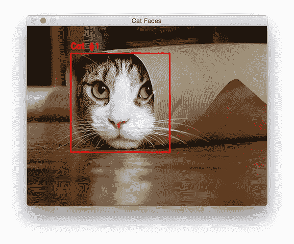
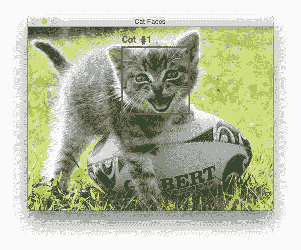
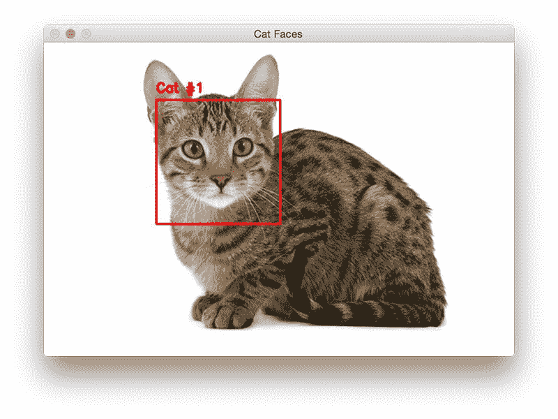

# 用 OpenCV 检测图像中的猫

> 原文：<https://pyimagesearch.com/2016/06/20/detecting-cats-in-images-with-opencv/>


([source](http://www.cats.org.uk/plymouth/adopt-a-cat))

您知道 OpenCV 可以检测图像中的猫脸… ***开箱即用*** **没有*额外功能吗？***

我也没有。

我不得不亲自检查一下…并做一些调查工作，看看这个 cat 检测器如何在我没有注意到的情况下偷偷溜进 OpenCV 库(就像一只猫溜进一个空的谷物盒，等待被发现)。

在这篇博文的剩余部分，我将演示如何使用 OpenCV 的 cat 检测器来检测图像中的猫脸。同样的技术也可以应用于视频流。

## 用 OpenCV 检测图像中的猫

如果你看一下 [OpenCV 储存库](https://github.com/Itseez/opencv)，特别是在 [haarcascades 目录](https://github.com/Itseez/opencv/tree/master/data/haarcascades)中(OpenCV 在那里存储了所有预先训练的 Haar 分类器，以检测各种对象、身体部位等。)，您会注意到两个文件:

*   `haarcascade_frontalcatface.xml`
*   `haarcascade_frontalcatface_extended.xml`

这两种哈尔级联都可以用来检测图像中的“猫脸”。事实上，我使用了这些非常相同的级联来生成这篇博文顶部的示例图像。

做了一点调查工作，我发现 cascades 是由传奇人物 [Joseph Howse](http://nummist.com/) 训练并贡献给 OpenCV 库的，他撰写了许多关于计算机视觉的教程、书籍和演讲。

在这篇博文的剩余部分，我将向你展示如何利用 Howse 的 Haar 级联来检测图像中的猫。

### Cat 检测代码

让我们开始使用 OpenCV 检测图像中的猫。打开一个新文件，将其命名为`cat_detector.py`，并插入以下代码:

```
# import the necessary packages
import argparse
import cv2

# construct the argument parse and parse the arguments
ap = argparse.ArgumentParser()
ap.add_argument("-i", "--image", required=True,
	help="path to the input image")
ap.add_argument("-c", "--cascade",
	default="haarcascade_frontalcatface.xml",
	help="path to cat detector haar cascade")
args = vars(ap.parse_args())

```

**第 2 行和第 3 行**导入我们需要的 Python 包，而**第 6-12 行**解析我们的命令行参数。这里我们只需要一个参数，输入`--image`,我们想用 OpenCV 检测猫的脸。

我们也可以(可选地)通过`--cascade`开关为我们的 Haar 级联提供一条路径。我们将默认这个路径为`haarcascade_frontalcatface.xml`，并假设您在*的同一个目录*中有`haarcascade_frontalcatface.xml`文件作为您的`cat_detector.py`脚本。

***注意:**我在这篇博文的“下载”部分方便地包含了代码、cat 检测器 Haar cascade 和本教程中使用的示例图像。如果您是使用 Python + OpenCV(或 Haar cascades)的新手，我建议您下载提供的。zip 文件，以便更容易理解。*

接下来，让我们检测输入图像中的猫:

```
# load the input image and convert it to grayscale
image = cv2.imread(args["image"])
gray = cv2.cvtColor(image, cv2.COLOR_BGR2GRAY)

# load the cat detector Haar cascade, then detect cat faces
# in the input image
detector = cv2.CascadeClassifier(args["cascade"])
rects = detector.detectMultiScale(gray, scaleFactor=1.3,
	minNeighbors=10, minSize=(75, 75))

```

在第**行第 15 和 16** 行，我们从磁盘加载输入图像，并将其转换为灰度(这是将图像传递给 Haar 级联分类器之前的一个常规预处理步骤，尽管并不严格要求)。

**第 20 行**从磁盘加载我们的 Haar cascade(在本例中是 cat 检测器)并实例化`cv2.CascadeClassifier`对象。

通过调用`detector`对象的`detectMultiScale`方法，在**的第 21 行和第 22 行**上用 OpenCV 检测图像中的猫脸。我们向`detectMultiScale`方法传递四个参数，包括:

1.  我们的图像，`gray`，我们想要检测其中的猫脸。
2.  检测猫脸时使用的[图像金字塔](https://pyimagesearch.com/2015/03/16/image-pyramids-with-python-and-opencv/)中的`scaleFactor`。较大的比例因子会提高检测器的速度，但会损害我们的真阳性检测精度。相反，较小的比例会减慢检测过程，但会增加真阳性检测。然而，这种较小的规模也会增加假阳性检测率。更多信息见这篇博文的 ***【关于哈尔喀特的笔记】*** 部分。
3.  `minNeighbors`参数控制给定区域中被视为“猫脸”区域的最小检测边界框数量。该参数对于删除误报检测非常有帮助。
4.  最后，`minSize`参数是不言自明的。该值确保每个检测到的边界框至少为*宽 x 高*像素(在本例中为 *75 x 75* )。

`detectMultiScale`函数返回一个 4 元组列表`rects`。这些元组包含每个检测到的猫脸的 *(x，y)*-坐标和*宽度*和*高度*。

最后，让我们画一个矩形包围图像中的每只猫的脸:

```
# loop over the cat faces and draw a rectangle surrounding each
for (i, (x, y, w, h)) in enumerate(rects):
	cv2.rectangle(image, (x, y), (x + w, y + h), (0, 0, 255), 2)
	cv2.putText(image, "Cat #{}".format(i + 1), (x, y - 10),
		cv2.FONT_HERSHEY_SIMPLEX, 0.55, (0, 0, 255), 2)

# show the detected cat faces
cv2.imshow("Cat Faces", image)
cv2.waitKey(0)

```

给定我们的边界框(即`rects`)，我们在**行的第 25** 上逐个遍历它们。

然后我们在第 26 行的**处画一个矩形包围每个猫的脸，而第 27 和 28** 行的**显示一个整数，计算图像中猫的数量。**

最后，**行 31 和 32** 将输出图像显示到我们的屏幕上。

### Cat 检测结果

为了测试我们的 OpenCV cat 检测器，请务必使用本文底部的 ***【下载】*** 部分下载源代码到本教程。

然后，解压缩归档文件后，您应该有以下三个文件/目录:

1.  我们的 Python + OpenCV 脚本用来检测图像中的猫。
2.  `haarcascade_frontalcatface.xml`:猫探测器哈尔梯级。 ***出于兼容性考虑，请使用提供的 Haar 级联，而不是 OpenCV 的 GitHub 库中的那个。***
3.  `images`:我们将对其应用 cat detector cascade 的测试图像目录。

从那里，执行以下命令:

```
$ python cat_detector.py --image images/cat_01.jpg

```



**Figure 1:** Detecting a cat face in an image, even with parts of the cat occluded ([source](https://www.youtube.com/watch?v=tntOCGkgt98)).

请注意，我们已经能够检测到图像中的猫脸，即使它身体的其他部分被遮挡。

让我们尝试另一个图像:

```
python cat_detector.py --image images/cat_02.jpg

```



**Figure 2:** A second example of detecting a cat in an image with OpenCV, this time the cat face is slightly different

这只猫的脸明显不同于另一只，因为它正在“喵”叫。在任一情况下，cat 检测器级联都能够正确地找到图像中的猫脸。

这张图片也是如此:

```
$ python cat_detector.py --image images/cat_03.jpg

```



**Figure 3:** Cat detection with OpenCV and Python 

我们的最后一个例子演示了使用 OpenCV 和 Python 在一幅图像中检测多只猫:

```
$ python cat_detector.py --image images/cat_04.jpg

```


**Figure 4:** Detecting multiple cats in the same image with OpenCV ([source](//www.cats.org.uk/plymouth/adopt-a-cat)).

请注意，Haar cascade 可能会以您不喜欢的顺序返回边界框。在这种情况下，中间的猫实际上被标记为第三只猫。您可以通过根据边界框的 *(x，y)*-坐标对边界框进行排序来解决这个“问题”，以获得一致的排序。

#### 关于准确性的快速注释

值得注意的是，在`.xml`文件的注释部分，Joseph Howe 详细描述了猫探测器 Haar cascades 可以在实际存在*人脸*的地方报告*猫脸*。

在这种情况下，他建议同时执行*人脸检测*和*猫检测，然后丢弃任何*与人脸边界框*重叠的猫边界框。*

 *### 关于哈尔瀑布的一个注记

保罗·维奥拉(Paul Viola)和迈克尔·琼斯(Michael Jones)于 2001 年首次发表了 *[使用简单特征的增强级联进行快速物体检测](https://www.cs.cmu.edu/~efros/courses/LBMV07/Papers/viola-cvpr-01.pdf)*，这项原创工作已经成为计算机视觉领域被引用最多的论文之一。

该算法能够检测图像中的对象，而不管它们的位置和比例。也许最有趣的是，探测器可以在现代硬件上实时运行。

在他们的论文中，Viola 和 Jones 专注于训练一个*人脸检测器*；然而，该框架也可以用于训练任意“对象”的检测器，例如汽车、香蕉、路标等。

#### 问题？

哈尔级联最大的问题是获得正确的`detectMultiScale`参数，特别是`scaleFactor`和`minNeighbors`。您很容易遇到需要逐个图像地调整这些参数的*和*的情况，这在使用对象检测器时非常不理想。

`scaleFactor`变量控制你的[图像金字塔](https://pyimagesearch.com/2015/03/16/image-pyramids-with-python-and-opencv/)，用于检测图像中不同比例的物体。如果你的`scaleFactor`太大，那么你只会评估图像金字塔的几层，可能会导致你错过金字塔各层之间*尺度的物体。*

另一方面，如果您将`scaleFactor`设置得太低，那么您将评估*许多*金字塔层。这将有助于你检测图像中的更多对象，但它(1)使检测过程更慢，(2) ***大大增加了假阳性检测率，这是 Haar cascades 众所周知的。***

为了记住这一点，我们经常应用 **[梯度方向直方图+线性 SVM 检测](https://pyimagesearch.com/2014/11/10/histogram-oriented-gradients-object-detection/)** 来代替。

HOG +线性 SVM 框架参数通常更容易调整——最棒的是，HOG +线性 SVM 享有*小得多的假阳性检测率*。唯一的缺点是更难让 HOG +线性 SVM 实时运行。

## 摘要

在这篇博文中，我们学习了如何使用 OpenCV 附带的默认 Haar 级联来检测图像中的猫。这些哈尔级联由 [Joseph Howse](https://twitter.com/CatsAndMonkeys) 训练并贡献给 OpenCV 项目，最初是由 Kendrick Tan 在本文[中引起我的注意。](http://kendricktan.github.io/find-cats-in-photos-using-computer-vision.html)

虽然哈尔级联非常有用，但我们经常使用 HOG +线性 SVM，因为它更容易调整检测器参数，更重要的是，我们可以享受到低得多的假阳性检测率。

在 PyImageSearch 大师课程中，我详细介绍了如何构建定制的 HOG +线性 SVM 物体检测器来识别图像中的各种物体，包括汽车、路标和更多的 *[。](https://pyimagesearch.com/pyimagesearch-gurus/)*

无论如何，我希望你喜欢这篇博文！

在你离开之前，请务必使用下面的表格注册 PyImageSearch 时事通讯，以便在新的博客文章发表时得到通知。*