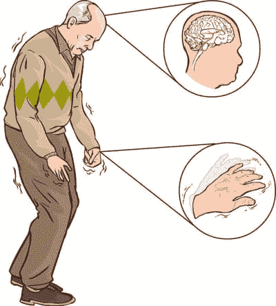
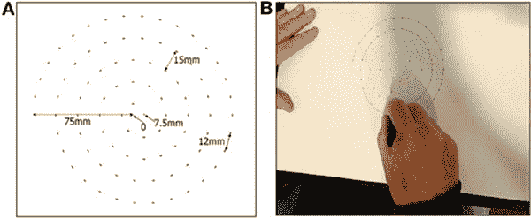
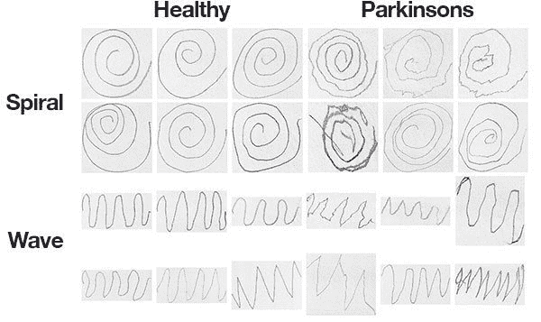
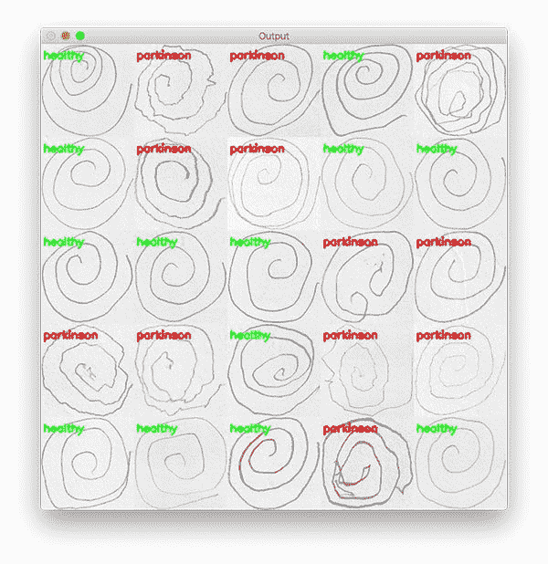

# 用 OpenCV、计算机视觉和螺旋波试验检测帕金森病

> 原文：<https://pyimagesearch.com/2019/04/29/detecting-parkinsons-disease-with-opencv-computer-vision-and-the-spiral-wave-test/>

[](https://pyimagesearch.com/wp-content/uploads/2019/04/detect_parkinsons_opencv_header.jpg)

在本教程中，您将学习如何使用 OpenCV 和机器学习在手绘的螺旋和波浪图像中自动检测帕金森病。

今天的教程灵感来自 PyImageSearch 阅读器，若奥·保罗·福拉多，一个来自巴西的博士生。

Joao 感兴趣的是**利用计算机视觉和机器学习，基于几何图形**(即螺旋和符号波)自动检测和预测帕金森病。

虽然我对帕金森病很熟悉，但我没有听说过几何绘画测试——一点点研究让我看到了 2017 年的一篇论文， [*使用绘制螺旋*](https://www.frontiersin.org/articles/10.3389/fneur.2017.00435/full) 的速度和笔压的综合指数来区分帕金森病的不同阶段，作者是扎姆等人。

研究人员发现，在帕金森病患者中**绘画速度*较慢*，笔压*较低*——这在帕金森病更严重/更严重的患者中*尤其明显。***

帕金森氏症的症状之一是肌肉颤抖和僵硬，使其更难画出平滑的螺旋和波浪。

Joao 假设，有可能仅用图画而不用测量笔在纸上的速度和压力来检测帕金森氏病。

**降低对跟踪笔速度和压力的要求:**

1.  执行测试时不需要额外的硬件。
2.  让自动检测帕金森氏症变得更加容易。

Joao 和他的顾问亲切地允许我访问他们收集的数据集，这些数据集包括由(1)帕金森病患者和(2)健康参与者绘制的螺旋和波浪。

我看了看数据集，考虑了我们的选择。

最初，Joao 想将深度学习应用到项目中，但经过考虑，我仔细解释说，深度学习虽然强大，*并不总是适合这项工作的工具！*例如，你不会想用锤子敲螺丝。

相反，你看着你的工具箱，仔细考虑你的选择，并抓住正确的工具。

我向 Joao 解释了这一点，然后展示了我们如何使用标准的计算机视觉和机器学习算法，以 83.33%的准确率**预测图像中的帕金森氏症。**

 ****学习如何应用计算机视觉和 OpenCV 基于几何图形检测帕金森，*继续阅读！***

## 用 OpenCV、计算机视觉和螺旋波测试检测帕金森病

在本教程的第一部分，我们将简要讨论帕金森病，包括几何图形如何用于检测和预测帕金森病。

然后，我们将检查从患有帕金森症的患者(T0)和没有帕金森症的患者(T3)那里收集的数据集。

在查看数据集之后，我将介绍如何使用 HOG 图像描述符来量化输入图像，然后我们如何在提取的特征之上训练随机森林分类器。

我们将通过检查我们的结果来结束。

### 什么是帕金森病？

[](https://pyimagesearch.com/wp-content/uploads/2019/04/detect_parkinsons_opencv_patient.jpg)

**Figure 1:** Patients with Parkinson’s disease have nervous system issues. Symptoms include movement issues such as tremors and rigidity. In this blog post, we’ll use OpenCV and machine learning to detect Parkinson’s disease from hand drawings consisting of spirals and waves.

帕金森病是一种影响运动的神经系统疾病。这种疾病是进行性的，分为五个不同的阶段([来源](https://parkinson.org/Understanding-Parkinsons/What-is-Parkinsons/Stages-of-Parkinsons))。

1.  第一阶段:通常不会影响日常生活的轻微症状，包括仅*身体一侧*的震颤和运动问题。
2.  第二阶段:症状继续恶化，震颤和僵硬现在影响到*身体的两侧*。日常任务变得富有挑战性。
3.  **阶段 3:** 失去平衡和运动，跌倒变得频繁和常见。患者仍然能够(通常)独立生活。
4.  **第四阶段:**症状变得严重且拘束。患者无法独自生活，需要他人帮助进行日常活动。
5.  第五阶段:可能无法行走或站立。病人很可能被束缚在轮椅上，甚至会产生幻觉。

虽然帕金森病无法治愈，**早期检测加上适当的药物治疗可以*显著地*改善症状和生活质量，**使其成为计算机视觉和机器学习从业者探索的重要课题。

### 画出螺旋和波浪来检测帕金森病

[](https://pyimagesearch.com/wp-content/uploads/2019/04/detect_parkinsons_opencv_drawing.jpg)

**Figure 2:** A 2017 study by Zham et al. concluded that it is possible to detect Parkinson’s by asking the patient to draw a spiral while tracking the speed of pen movement and pressure. No image processing was conducted in this study. ([image source](https://www.frontiersin.org/articles/10.3389/fneur.2017.00435/full))

Zham 等人在 2017 年进行的一项研究发现，通过让患者画一个*螺旋*然后跟踪，可以检测出帕金森氏症:

1.  绘图速度
2.  笔压

研究人员发现，在帕金森病患者中**绘画速度*较慢*，笔压*较低*——这在帕金森病更严重/更严重的患者中*尤其明显。***

我们将利用这样一个事实，即两种最常见的帕金森氏症症状包括震颤和肌肉僵硬，它们直接影响手绘螺旋和波浪的视觉外观。

视觉外观的变化将使我们能够训练一种计算机视觉+机器学习算法来*自动*检测帕金森病。

### 螺旋和波浪数据集

[](https://pyimagesearch.com/wp-content/uploads/2019/04/detect_parkinsons_dataset.jpg)

**Figure 3:** Today’s Parkinson’s image dataset is curated by Andrade and Folado from the NIATS of Federal University of Uberlândia. We will use Python and OpenCV to train a model for automatically classifying Parkinson’s from similar spiral/wave drawings.

我们今天在这里使用的数据集是由 Uberlândia 联邦大学 niats 的 Adriano de Oliveira Andrade 和 Joao Paulo Folado 策划的。

数据集本身由 204 幅图像组成，并预先分为训练集和测试集，包括:

*   **螺旋:** 102 张图像，72 次训练，30 次测试
*   **波:** 102 张图像，72 次训练，30 次测试

**上面的图 3** 显示了每个图纸和相应类别的示例。

虽然对一个人来说，在这些画中对帕金森和健康进行分类是具有挑战性的，如果不是不可能的话，但其他人在视觉外观上表现出明显的偏差——我们的目标是量化这些画的视觉外观，然后训练一个机器学习模型来对它们进行分类。

### 为今天的项目准备计算环境

今天的环境很容易在您的系统上启动和运行。

您将需要以下软件:

*   OpenCV
*   NumPy
*   Scikit-learn
*   Scikit-image
*   imutils

每个包都可以用 Python 的包管理器 pip 安装。

但是在你深入 pip 之前，[阅读这篇教程来设置你的**虚拟环境**并安装 OpenCV 和 pip](https://pyimagesearch.com/2018/09/19/pip-install-opencv/) 。

下面您可以找到配置开发环境所需的命令。

```
$ workon cv # insert your virtual environment name such as `cv`
$ pip install opencv-contrib-python # see the tutorial linked above
$ pip install scikit-learn
$ pip install scikit-image
$ pip install imutils

```

### 项目结构

继续并抓取今天的 ***【下载】*** 与今天的帖子相关联。的。zip 文件包含螺旋和波浪数据集以及一个 Python 脚本。

您可以在终端中使用`tree`命令来检查文件和文件夹的结构:

```
$ tree --dirsfirst --filelimit 10
.
├── dataset
│   ├── spiral
│   │   ├── testing
│   │   │   ├── healthy [15 entries]
│   │   │   └── parkinson [15 entries]
│   │   └── training
│   │       ├── healthy [36 entries]
│   │       └── parkinson [36 entries]
│   └── wave
│       ├── testing
│       │   ├── healthy [15 entries]
│       │   └── parkinson [15 entries]
│       └── training
│           ├── healthy [36 entries]
│           └── parkinson [36 entries]
└── detect_parkinsons.py

15 directories, 1 file

```

我们的`dataset/`首先被分解成`spiral/`和`wave/`。这些文件夹中的每一个都被进一步分成`testing/`和`training/`。最后，我们的图像保存在`healthy/`或`parkinson/`文件夹中。

今天我们将回顾一个 Python 脚本:`detect_parkinsons.py`。这个脚本将读取所有的图像，提取特征，并训练一个机器学习模型。最后，结果将显示在一个蒙太奇。

### 实施帕金森检测器脚本

为了实现我们的帕金森检测器，你可能会试图用深度学习和卷积神经网络(CNN)来解决这个问题——不过这种方法有一个问题。

开始，我们没有太多的训练数据，**只有 72 张图片用于训练。**当面临缺乏跟踪数据时，我们通常采用**数据扩充——但在这种情况下*数据扩充也是有问题的。***

你需要*非常*小心，因为数据增强的不当使用可能会使健康患者的画看起来像帕金森患者的画(反之亦然)。

**更重要的是，有效地将计算机视觉应用到问题中*就是将正确的工具带到工作中***——例如，你不会用螺丝刀敲钉子。

仅仅因为你可能知道如何将深度学习应用于一个问题，并不一定意味着深度学习“总是”该问题的最佳选择。

在本例中，我将向您展示在训练数据量有限的情况下，[梯度方向直方图(HOG)图像描述符](https://gurus.pyimagesearch.com/lesson-sample-histogram-of-oriented-gradients-and-car-logo-recognition/)和随机森林分类器如何表现良好。

打开一个新文件，将其命名为`detect_parkinsons.py`，并插入以下代码:

```
# import the necessary packages
from sklearn.ensemble import RandomForestClassifier
from sklearn.preprocessing import LabelEncoder
from sklearn.metrics import confusion_matrix
from skimage import feature
from imutils import build_montages
from imutils import paths
import numpy as np
import argparse
import cv2
import os

```

我们从第 2-11 行的**开始:**

*   我们将大量使用 scikit-learn，这在前三个导入中显而易见:
    *   我们使用的分类器是`RandomForestClassifier`。
    *   我们将使用一个`LabelEncoder`把标签编码成整数。
    *   一个`confusion_matrix`将被建立，以便我们可以获得原始的准确性、敏感性和特异性。
*   定向梯度直方图(HOG)将来自 scikit-image 的`feature`导入。
*   来自`imutils`的两个模块将投入使用:
    *   我们将`build_montages`进行可视化。
    *   我们的`paths`导入将帮助我们提取数据集中每个图像的文件路径。
*   NumPy 将帮助我们计算统计数据并获取随机指数。
*   `argparse`导入将允许我们[解析命令行参数](https://pyimagesearch.com/2018/03/12/python-argparse-command-line-arguments/)。
*   OpenCV ( `cv2`)将用于读取、处理和显示图像。
*   我们的程序将通过`os`模块适应 Unix 和 Windows 文件路径。

让我们用 HOG 方法定义一个量化波形/螺旋`image`的函数:

```
def quantify_image(image):
	# compute the histogram of oriented gradients feature vector for
	# the input image
	features = feature.hog(image, orientations=9,
		pixels_per_cell=(10, 10), cells_per_block=(2, 2),
		transform_sqrt=True, block_norm="L1")

	# return the feature vector
	return features

```

我们将使用`quantify_image`函数从每个输入图像中提取特征。

首先由 Dalal 和 Triggs 在他们的 CVPR 2005 年论文[](https://ieeexplore.ieee.org/document/1467360)*中介绍，HOG 将用于量化我们的图像。*

 *HOG 是一个*结构描述符*，它将捕获并量化输入图像中局部梯度的变化。HOG 自然能够量化螺旋和波的方向是如何变化的。

此外，如果这些画有更多的“晃动”，HOG 将能够捕捉到，就像我们可能从一个帕金森氏症患者那里期待的那样。

HOG 的另一个应用是这个 [PyImageSearch Gurus 样本课程](https://gurus.pyimagesearch.com/lesson-sample-histogram-of-oriented-gradients-and-car-logo-recognition/)。关于`feature.hog`参数的完整解释，请务必参考示例课程。

得到的特征是 12，996 维的特征向量(数字列表),量化波或螺旋。我们将在数据集中所有图像的特征之上训练一个随机森林分类器。

接下来，让我们加载数据并提取特征:

```
def load_split(path):
	# grab the list of images in the input directory, then initialize
	# the list of data (i.e., images) and class labels
	imagePaths = list(paths.list_images(path))
	data = []
	labels = []

	# loop over the image paths
	for imagePath in imagePaths:
		# extract the class label from the filename
		label = imagePath.split(os.path.sep)[-2]

		# load the input image, convert it to grayscale, and resize
		# it to 200x200 pixels, ignoring aspect ratio
		image = cv2.imread(imagePath)
		image = cv2.cvtColor(image, cv2.COLOR_BGR2GRAY)
		image = cv2.resize(image, (200, 200))

		# threshold the image such that the drawing appears as white
		# on a black background
		image = cv2.threshold(image, 0, 255,
			cv2.THRESH_BINARY_INV | cv2.THRESH_OTSU)[1]

		# quantify the image
		features = quantify_image(image)

		# update the data and labels lists, respectively
		data.append(features)
		labels.append(label)

	# return the data and labels
	return (np.array(data), np.array(labels))

```

`load_split`函数的目标是接受数据集`path`并返回所有特征`data`和相关类`labels`。让我们一步一步地分解它:

*   该函数被定义为在**行 23** 上接受数据集的`path`(波形或螺旋)。
*   从那里我们获取输入`imagePaths`，利用 imutils ( **第 26 行**)。
*   `data`和`labels`列表都被初始化(**行 27 和 28** )。
*   从那里开始，我们循环所有从第 31 行**开始的`imagePaths`:**
    *   每个`label`都是从路径中提取的(**行 33** )。
    *   每个`image`都被加载和预处理(**第 37-44 行**)。阈值处理步骤从输入图像中分割出图画，使图画在*黑色*背景上呈现为*白色*前景。
    *   通过我们的`quantify_image`函数(**第 47 行**)提取特征。
    *   `features`和`label`分别被追加到`data`和`labels`列表中(**第 50-51 行**)。
*   最后`data`和`labels`被转换成 NumPy 数组，并在一个元组中方便地返回(**第 54 行**)。

让我们继续[解析我们的命令行参数](https://pyimagesearch.com/2018/03/12/python-argparse-command-line-arguments/):

```
# construct the argument parser and parse the arguments
ap = argparse.ArgumentParser()
ap.add_argument("-d", "--dataset", required=True,
	help="path to input dataset")
ap.add_argument("-t", "--trials", type=int, default=5,
	help="# of trials to run")
args = vars(ap.parse_args())

```

我们的脚本处理两个命令行参数:

*   `--dataset`:输入数据集的路径(波浪或螺旋)。
*   `--trials`:要运行的试验次数(默认情况下我们运行`5`试验)。

为了准备培训，我们将进行初始化:

```
# define the path to the training and testing directories
trainingPath = os.path.sep.join([args["dataset"], "training"])
testingPath = os.path.sep.join([args["dataset"], "testing"])

# loading the training and testing data
print("[INFO] loading data...")
(trainX, trainY) = load_split(trainingPath)
(testX, testY) = load_split(testingPath)

# encode the labels as integers
le = LabelEncoder()
trainY = le.fit_transform(trainY)
testY = le.transform(testY)

# initialize our trials dictionary
trials = {}

```

在这里，我们正在构建训练和测试输入目录的路径(**行 65 和 66** )。

从那里，我们通过将每个路径传递到`load_split` ( **第 70 行和第 71 行**)来加载我们的训练和测试分割。

我们的`trials`字典在**第 79 行**被初始化(回想一下，默认情况下我们将运行`5`试验)。

让我们现在开始试验:

```
# loop over the number of trials to run
for i in range(0, args["trials"]):
	# train the model
	print("[INFO] training model {} of {}...".format(i + 1,
		args["trials"]))
	model = RandomForestClassifier(n_estimators=100)
	model.fit(trainX, trainY)

	# make predictions on the testing data and initialize a dictionary
	# to store our computed metrics
	predictions = model.predict(testX)
	metrics = {}

	# compute the confusion matrix and and use it to derive the raw
	# accuracy, sensitivity, and specificity
	cm = confusion_matrix(testY, predictions).flatten()
	(tn, fp, fn, tp) = cm
	metrics["acc"] = (tp + tn) / float(cm.sum())
	metrics["sensitivity"] = tp / float(tp + fn)
	metrics["specificity"] = tn / float(tn + fp)

	# loop over the metrics
	for (k, v) in metrics.items():
		# update the trials dictionary with the list of values for
		# the current metric
		l = trials.get(k, [])
		l.append(v)
		trials[k] = l

```

在第 82 行的**上，我们循环每个试验。在每次试验中，我们:**

*   初始化我们的**随机森林分类器**并训练模型(**第 86 和 87 行**)。关于随机森林的更多信息，包括它们如何在计算机视觉环境中使用，请务必参考 **[*PyImageSearch 大师*](https://pyimagesearch.com/pyimagesearch-gurus/)** 。
*   在测试数据上做`predictions`(**行 91** )。
*   计算准确性、敏感性和特异性`metrics` ( **第 96-100 行**)。
*   更新我们的`trials`字典(**第 103-108 行**)。

循环查看我们的每个指标，我们将打印统计信息:

```
# loop over our metrics
for metric in ("acc", "sensitivity", "specificity"):
	# grab the list of values for the current metric, then compute
	# the mean and standard deviation
	values = trials[metric]
	mean = np.mean(values)
	std = np.std(values)

	# show the computed metrics for the statistic
	print(metric)
	print("=" * len(metric))
	print("u={:.4f}, o={:.4f}".format(mean, std))
	print("")

```

在第 111 行的**上，我们循环遍历每个`metric`。**

然后我们继续从`trials` ( **线 114** )中抓取`values`。

使用`values`，计算每个指标的平均值和标准偏差(**第 115 和 116 行**)。

从那里，统计数据显示在终端中。

现在是视觉盛宴——我们将创建一个蒙太奇，以便我们可以直观地分享我们的工作:

```
# randomly select a few images and then initialize the output images
# for the montage
testingPaths = list(paths.list_images(testingPath))
idxs = np.arange(0, len(testingPaths))
idxs = np.random.choice(idxs, size=(25,), replace=False)
images = []

# loop over the testing samples
for i in idxs:
	# load the testing image, clone it, and resize it
	image = cv2.imread(testingPaths[i])
	output = image.copy()
	output = cv2.resize(output, (128, 128))

	# pre-process the image in the same manner we did earlier
	image = cv2.cvtColor(image, cv2.COLOR_BGR2GRAY)
	image = cv2.resize(image, (200, 200))
	image = cv2.threshold(image, 0, 255,
		cv2.THRESH_BINARY_INV | cv2.THRESH_OTSU)[1]

```

首先，我们从测试集中随机抽取图像样本(**第 126-128 行**)。

我们的`images`列表将保存每个波浪或螺旋图像以及通过 OpenCV 绘图函数添加的注释(**第 129 行**)。

我们继续循环第 132 行**上的随机图像索引。**

在循环内部，每个图像以与训练期间相同的方式处理(**行 134-142** )。

接下来，我们将使用新的 **HOG +基于随机森林的分类器**自动对图像进行分类，并添加颜色编码注释:

```
	# quantify the image and make predictions based on the extracted
	# features using the last trained Random Forest
	features = quantify_image(image)
	preds = model.predict([features])
	label = le.inverse_transform(preds)[0]

	# draw the colored class label on the output image and add it to
	# the set of output images
	color = (0, 255, 0) if label == "healthy" else (0, 0, 255)
	cv2.putText(output, label, (3, 20), cv2.FONT_HERSHEY_SIMPLEX, 0.5,
		color, 2)
	images.append(output)

# create a montage using 128x128 "tiles" with 5 rows and 5 columns
montage = build_montages(images, (128, 128), (5, 5))[0]

# show the output montage
cv2.imshow("Output", montage)
cv2.waitKey(0)

```

每个`image`用猪`features` ( **线 146** )量化。

然后通过这些`features`到`model.predict` ( **行 147 和 148** )对图像进行分类。

等级标签用颜色`**green**`表示【健康】和`**red**`否则(**线 152** )。标签绘制在图像的左上角(**行 153 和 154** )。

每个`output`图像然后被添加到一个`images`列表中(**第 155 行**)，这样我们就可以开发一个`montage` ( **第 158 行**)。你可以了解更多关于用 OpenCV 创建 [*蒙太奇。*](https://pyimagesearch.com/2017/05/29/montages-with-opencv/)

然后通过**线 161** 显示`montage`，直到按下一个键。

### 训练帕金森检测器模型

[](https://pyimagesearch.com/wp-content/uploads/2019/04/detect_parkinsons_opencv_results.jpg)

**Figure 4:** Using Python, OpenCV, and machine learning (Random Forests), we have classified Parkinson’s patients using their hand-drawn spirals with 83.33% accuracy.

让我们来测试一下我们的帕金森病检测器吧！

使用本教程的 ***“下载”*** 部分下载源代码和数据集。

从那里，导航到您下载的位置。zip 文件，将其解压缩，然后**执行下面的命令来训练我们的“wave”模型:**

```
$ python detect_parkinsons.py --dataset dataset/wave
[INFO] loading data...
[INFO] training model 1 of 5...
[INFO] training model 2 of 5...
[INFO] training model 3 of 5...
[INFO] training model 4 of 5...
[INFO] training model 5 of 5...
acc
===
u=0.7133, o=0.0452

sensitivity
===========
u=0.6933, o=0.0998

specificity
===========
u=0.7333, o=0.0730

```

检查我们的输出，你会看到我们在测试集上获得了 **71.33%的分类准确率**，灵敏度 **69.33%** (真阳性率)，特异性**73.33%**(真阴性率)。

很重要的一点是，我们要衡量灵敏度和特异性，因为:

1.  **灵敏度**测量也被预测为*阳性*的*真阳性*。
2.  **特异性**测量也被预测为*阴性*的*真阴性*。

**机器学习模型，*尤其是*医疗领域的机器学习模型，在平衡真阳性和真阴性时需要格外小心:**

*   我们不想把某人归类为*【非帕金森】*，而事实上他们是帕金森阳性。
*   同样，我们不想将某人归类为*【帕金森阳性】*，而事实上他们并没有患病。

**现在让我们在“螺旋”图上训练我们的模型:**

```
$ python detect_parkinsons.py --dataset dataset/spiral
[INFO] loading data...
[INFO] training model 1 of 5...
[INFO] training model 2 of 5...
[INFO] training model 3 of 5...
[INFO] training model 4 of 5...
[INFO] training model 5 of 5...
acc
===
u=0.8333, o=0.0298

sensitivity
===========
u=0.7600, o=0.0533

specificity
===========
u=0.9067, o=0.0327

```

这次我们在测试集上达到了 **83.33%的准确率**，其中**的敏感度为 76.00%** ，而**的特异度为 90.67%。**

查看标准差，我们还可以看到更少的*显著更少的*方差和更紧凑的分布。

当自动检测手绘中的帕金森氏症时，至少当利用这个特定的数据集时,“螺旋”图似乎更加有用和信息丰富。

## 摘要

在本教程中，您学习了如何使用 OpenCV 和计算机视觉在几何图形(特别是螺旋和波浪)中检测帕金森病。我们利用梯度方向直方图图像描述符来量化每个输入图像。

在从输入图像中提取特征之后，我们用森林中总共 100 棵决策树来训练随机森林分类器，获得:

*   **83.33%精度**对于*螺旋*
*   **71.33%准确度**对于*波*

有趣的是，在螺旋数据集上训练的随机森林获得了 76.00%的灵敏度，这意味着该模型能够在近 76%的时间内预测到真正的阳性(即*“是的，该患者患有帕金森症”*)。

本教程是计算机视觉如何应用于医学领域的又一个例子([点击此处获取更多关于 PyImageSearch 的医学教程](https://pyimagesearch.com/category/medical/))。

我希望您喜欢它，并发现它有助于您进行自己的研究或构建自己的医学计算机视觉应用。

**要下载这篇文章的源代码，并在 PyImageSearch 上发布以后的教程时得到通知，*只需在下面的表格中输入您的电子邮件地址！******