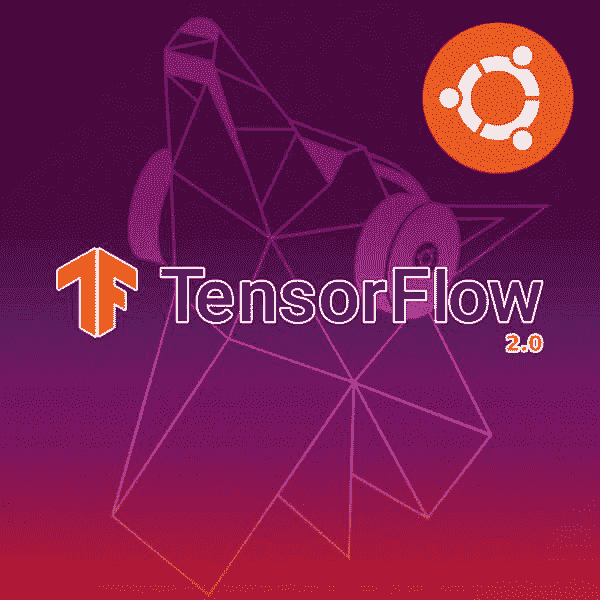
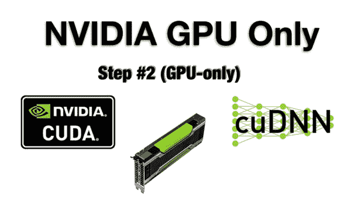
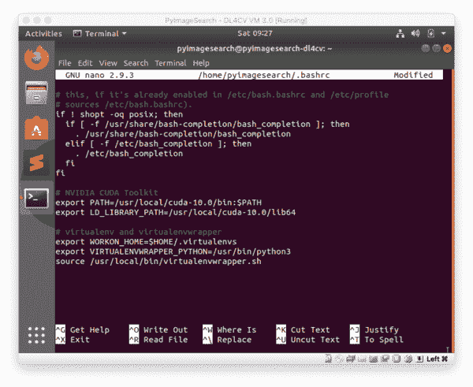

# 如何在 Ubuntu 上安装 TensorFlow 2.0

> 原文：<https://pyimagesearch.com/2019/12/09/how-to-install-tensorflow-2-0-on-ubuntu/>

[](https://pyimagesearch.com/wp-content/uploads/2019/12/tensorflow2_install_ubuntu_header.jpg)

在本教程中，您将学习在 Ubuntu 系统上安装 TensorFlow 2.0，无论有无 GPU。

TensorFlow 2.0 中有许多重要的更新，包括急切执行、自动微分和更好的多 GPU/分布式训练支持，**但*最重要的更新*是 Keras 现在是 TensorFlow 的*官方*高级深度学习 API。**

简而言之——在训练自己的深度神经网络时，你应该使用 TensorFlow 2.0(即`tf.keras`)内的 Keras 实现*。官方的 Keras 包仍然会收到错误修复，但是所有的新特性和实现都将在`tf.keras`中。*

**Francois Chollet(Keras 的创建者)以及 TensorFlow 的开发者和维护者都建议您使用`tf.keras`继续前进。**

此外，如果你有我的书《用 Python 进行计算机视觉的深度学习[](https://pyimagesearch.com/deep-learning-computer-vision-python-book/)*》的副本，你应该使用这个指南在你的 Ubuntu 系统上安装 TensorFlow 2.0。*

 *在本教程中，您将学习如何在 Ubuntu 上安装 TensorFlow 2.0。

或者，[点击此处获取我的 **macOS + TensorFlow 2.0** 安装说明](https://pyimagesearch.com/2019/12/09/how-to-install-tensorflow-2-0-on-macos)。

**要了解如何在 Ubuntu 上安装 TensorFlow 2.0，*继续阅读。***

## 如何在 Ubuntu 上安装 TensorFlow 2.0

在本教程的第一部分，我们将讨论预配置的深度学习开发环境，这是我的书 *[用 Python 进行计算机视觉的深度学习](https://pyimagesearch.com/deep-learning-computer-vision-python-book/)的一部分。*

从那里，您将了解为什么应该使用 TensorFlow 2.0，包括 TensorFlow 2.0 的中的 Keras 实现*。*

然后我们将在我们的 Ubuntu 系统上配置和安装 TensorFlow 2.0。

我们开始吧。

### 预先配置的深度学习环境

[](https://pyimagesearch.com/wp-content/uploads/2017/09/deep_learning_vm_header.png)

**Figure 1:** My deep learning Virtual Machine with TensorFlow, Keras, OpenCV, and all other Deep Learning and Computer Vision libraries you need, pre-configured and pre-installed.

当谈到使用深度学习和 Python 时，我*强烈推荐*使用基于 Unix 的环境。

深度学习工具可以更容易地配置和安装在 Linux 上，允许您快速开发和运行神经网络。

当然，配置自己的深度学习+ Python + Linux 开发环境可能是一项非常繁琐的任务，*尤其是*如果您是 Linux 新手，是命令行/终端的初学者，或者是手动编译和安装包的新手。

为了帮助您快速启动深度学习+ Python 教育，我创建了两个预配置的环境:

1.  [**预配置 VirtualBox Ubuntu 虚拟机(VM)**](https://pyimagesearch.com/2017/09/22/deep-learning-python-ubuntu-virtual-machine/) 拥有成功所需的所有必要深度学习库(包括 *Keras* 、 *TensorFlow* 、 *scikit-learn* 、 *scikit-image* 、 *OpenCV* 等) ***预配置*** 和 ***预安装【***
2.  [**预先配置的深度学习亚马逊机器映像(AMI)**](https://pyimagesearch.com/2017/09/20/pre-configured-amazon-aws-deep-learning-ami-with-python/) ，它运行在亚马逊网络服务(AWS)的弹性计算(EC2)基础设施上。互联网上的任何人都可以免费使用这个环境，不管你是否是我的 DL4CV 客户(需要支付云/GPU 费用)。深度学习库是 ***预装的*** 除了 *TFOD API* 、 *Mask R-CNN* 、 *RetinaNet* 、 *mxnet* 之外还包括#1 中列出的两个。

我 ***强烈敦促*** 如果您正在阅读我的书籍，请考虑使用我预先配置的环境。使用预先配置好的环境不是欺骗— **他们只是让你专注于学习，而不是系统管理员的工作。**

如果你更熟悉微软 Azure 的基础设施，一定要[看看他们的数据科学虚拟机(DSVM)，包括我对环境的评论](https://pyimagesearch.com/2018/03/21/my-review-of-microsofts-deep-learning-virtual-machine/)。Azure 团队为你维护了一个很好的环境，我不能说他们提供了足够高的支持，同时我确保我所有的深度学习章节都在他们的系统上成功运行。

也就是说，预配置环境并不适合所有人。

在本教程的剩余部分，我们将作为“深度学习系统管理员”在我们的裸机 Ubuntu 上安装 TensorFlow 2.0。

### 为什么是 TensorFlow 2.0，Keras 在哪里？

[](https://pyimagesearch.com/wp-content/uploads/2019/10/keras_vs_tfdotkeras_relationship.png)

**Figure 2:** Keras and TensorFlow have a complicated history together. When installing TensorFlow 2.0 on Ubuntu, keep in mind that Keras is the official high-level API built into TensorFlow.

Twitter 上似乎每天都在进行一场关于最佳深度学习框架的战争。问题是这些讨论对每个人的时间都是适得其反的。

我们*应该*谈论的是你的新模型架构，以及你如何应用它来解决问题。

也就是说，我使用 Keras 作为我的日常深度学习库和这个博客的主要教学工具。

如果你能学会 Keras，你将在 TensorFlow、PyTorch、mxnet 或任何其他类似的框架中得心应手。它们只是你工具箱中不同的棘轮扳手，可以完成相同的目标。

Francois Chollet(Keras 的主要维护者/开发者)在 2015 年 3 月 27 日将他的第一个 Keras 版本提交到了他的 GitHub 上。此后，该软件经历了多次更改和迭代。

2019 年早些时候，TensorFlow v1.10.0 中引入了`tf.keras`子模块。

现在有了 TensorFlow 2.0，Keras 是 TensorFlow 的官方高级 API。

从现在开始,`keras`包将只接收错误修复。如果现在想用 Keras，需要用 TensorFlow 2.0。

要了解更多关于 Keras 和 TensorFlow 的婚姻，一定要阅读[我之前的文章](https://pyimagesearch.com/2019/10/21/keras-vs-tf-keras-whats-the-difference-in-tensorflow-2-0/)。

TensorFlow 2.0 具有一系列新功能，包括:

*   通过`tf.keras`将 Keras 集成到 TensorFlow 中
*   会话和急切执行
*   自动微分
*   模型和层子类化
*   更好的多 GPU/分布式培训支持
*   面向移动/嵌入式设备的 TensorFlow Lite
*   TensorFlow 扩展用于部署生产模型

**长话短说——如果你想使用 Keras 进行深度学习，那么你需要安装 TensorFlow 2.0。**

### 配置您的 TensorFlow 2.0 + Ubuntu 深度学习系统

在计算机上安装 TensorFlow 2.0 的以下说明假设:

*   您拥有系统的管理权限
*   您可以打开一个终端，或者您有一个到目标机器的活动 SSH 连接
*   你知道如何操作命令行。

我们开始吧！

#### 第一步:安装 Ubuntu + TensorFlow 2.0 深度学习依赖项

此步骤针对**GPU 用户和非 GPU 用户。**

 **我们的 Ubuntu 安装说明假设你使用的是 Ubuntu 18.04 LTS 版。这些说明将于 2003 年 4 月 18 日进行测试。

我们将首先打开一个终端并更新我们的系统:

```
$ sudo apt-get update
$ sudo apt-get upgrade

```

从那里我们将安装编译器工具:

```
$ sudo apt-get install build-essential cmake unzip pkg-config
$ sudo apt-get install gcc-6 g++-6

```

然后我们将安装`screen`，这是一个用于同一个窗口中多个终端的工具——我经常用它进行远程 SSH 连接:

```
$ sudo apt-get install screen

```

从那里我们将安装 X windows 库和 OpenGL 库:

```
$ sudo apt-get install libxmu-dev libxi-dev libglu1-mesa libglu1-mesa-dev

```

以及图像和视频 I/O 库:

```
$ sudo apt-get install libjpeg-dev libpng-dev libtiff-dev
$ sudo apt-get install libavcodec-dev libavformat-dev libswscale-dev libv4l-dev
$ sudo apt-get install libxvidcore-dev libx264-dev

```

接下来，我们将安装优化库:

```
$ sudo apt-get install libopenblas-dev libatlas-base-dev liblapack-dev gfortran

```

和用于处理大型数据集的 HDF5:

```
$ sudo apt-get install libhdf5-serial-dev

```

我们还需要我们的 Python 3 开发库，包括 TK 和 GTK GUI 支持:

```
$ sudo apt-get install python3-dev python3-tk python-imaging-tk
$ sudo apt-get install libgtk-3-dev

```

**如果你有 GPU** ，继续**步骤#2** 。

否则，**如果你没有 GPU** ，跳到**步骤#3** 。

#### 第 2 步(仅限 GPU):安装 NVIDIA 驱动程序、CUDA 和 cuDNN

[](https://pyimagesearch.com/wp-content/uploads/2019/12/tensorflow2_install_ubuntu_gpu_only.png)

**Figure 3:** How to install TensorFlow 2.0 for a GPU machine.

此步骤 ***仅针对*** **GPU 用户**。

在这一步中，我们将在 Ubuntu 上为 TensorFlow 2.0 安装 NVIDIA GPU 驱动程序、CUDA 和 cuDNN。

我们需要添加一个 apt-get 存储库，以便我们可以安装 NVIDIA GPU 驱动程序。这可以在您的终端中完成:

```
$ sudo add-apt-repository ppa:graphics-drivers/ppa
$ sudo apt-get update

```

继续安装您的 NVIDIA 显卡驱动程序:

```
$ sudo apt-get install nvidia-driver-418

```

然后发出 reboot 命令，等待系统重新启动:

```
$ sudo reboot now

```

回到终端/SSH 连接后，运行`nvidia-smi`命令查询 GPU 并检查其状态:

```
$ nvidia-smi
Fri Nov 22 03:14:45 2019
+-----------------------------------------------------------------------------+
| NVIDIA-SMI 430.50       Driver Version: 430.50       CUDA Version: 10.1     |
|-------------------------------+----------------------+----------------------+
| GPU  Name        Persistence-M| Bus-Id        Disp.A | Volatile Uncorr. ECC |
| Fan  Temp  Perf  Pwr:Usage/Cap|         Memory-Usage | GPU-Util  Compute M. |
|===============================+======================+======================|
|   0  Tesla V100-SXM2...  Off  | 00000000:00:1E.0 Off |                    0 |
| N/A   41C    P0    39W / 300W |      0MiB / 16160MiB |      0%      Default |
+-------------------------------+----------------------+----------------------+
+-----------------------------------------------------------------------------+
| Processes:                                                       GPU Memory |
|  GPU       PID   Type   Process name                             Usage      |
|=============================================================================|
|  No running processes found                                                 |
+-----------------------------------------------------------------------------+

```

`nvidia-smi`命令输出有助于查看您的 GPU 的健康状况和使用情况。

让我们继续**下载 CUDA 10.0** 。从现在开始，我推荐 CUDA 10.0，因为它现在非常可靠和成熟。

以下命令将从你的终端下载和安装 CUDA 10.0

```
$ cd ~
$ mkdir installers
$ cd installers/
$ wget https://developer.nvidia.com/compute/cuda/10.0/Prod/local_installers/cuda_10.0.130_410.48_linux
$ mv cuda_10.0.130_410.48_linux cuda_10.0.130_410.48_linux.run
$ chmod +x cuda_10.0.130_410.48_linux.run
$ sudo ./cuda_10.0.130_410.48_linux.run --override

```

***注意:**当你执行这些命令时，注意长 URLs 文件名引起的换行。*

系统将提示您接受最终用户许可协议(EULA)。在此过程中，您可能会遇到以下错误:

```
Please make sure that
PATH includes /usr/local/cuda-10.0/bin
LD_LIBRARY_PATH includes /usr/local/cuda-10.0/lib64, or, add /usr/local/cuda-10.0/lib64 to /etc/ld.so.conf and run ldconfig as root
To uninstall the CUDA Toolkit, run the uninstall script in /usr/local/cuda-10.0/bin
Please see CUDA_Installation_Guide_Linux.pdf in /usr/local/cuda-10.0/doc/pdf for detailed information on setting up CUDA.
*WARNING: Incomplete installation! This installation did not install the CUDA Driver. A driver of version at least 384.00 is required for CUDA 10.0 functionality to work.
To install the driver using this installer, run the following command, replacing  with the name of this run file:
sudo .run -silent -driver

Logfile is /tmp/cuda_install_25774.log

```

您可以放心地忽略这条错误消息。

现在让我们使用`nano`更新我们的 bash 配置文件(如果你更习惯使用`vim`或`emacs`，你可以使用它们):

```
$ nano ~/.bashrc

```

在配置文件的底部插入以下几行:

```
# NVIDIA CUDA Toolkit
export PATH=/usr/local/cuda-10.0/bin:$PATH
export LD_LIBRARY_PATH=/usr/local/cuda-10.0/lib64

```

保存文件(`ctrl + x`、`y`、`enter`)，并退出到您的终端。

[](https://pyimagesearch.com/wp-content/uploads/2019/12/tensorflow2_install_ubuntu_bashrc.png)

**Figure 4:** How to install TensorFlow 2.0 on Ubuntu with an NVIDIA CUDA GPU.

然后，获取配置文件:

```
$ source ~/.bashrc

```

在这里，我们将查询 CUDA 以确保它已成功安装:

```
$ nvcc -V
nvcc: NVIDIA (R) Cuda compiler driver
Copyright (c) 2005-2018 NVIDIA Corporation
Built on Sat_Aug_25_21:08:01_CDT_2018
Cuda compilation tools, release 10.0, V10.0.130

```

如果您的输出显示 CUDA 已经构建，那么您现在就可以**安装 cud nn**——CUDA 兼容的深度神经网络库。

请从以下链接下载适用于 CUDA 10.0 的 cuDNN v7.6.4 版本:

[https://developer.nvidia.com/rdp/cudnn-archive](https://developer.nvidia.com/rdp/cudnn-archive)

**确保您选择了:**

1.  为 CUDA 10.0 下载 cud nn v 7 . 6 . 4(2019 年 9 月 27 日)
2.  用于 Linux 的 cuDNN 库
3.  然后允许。zip 文件下载(您可能需要在 NVIDIA 的网站上创建一个帐户来下载 cuDNN 文件)

然后，您可能需要将其从您的家用机器 SCP(安全复制)到您的远程深度学习箱:

```
$ scp ~/Downloads/cudnn-10.0-linux-x64-v7.6.4.24.tgz \
    username@your_ip_address:~/installers

```

回到你的 GPU 开发系统，让我们安装 cuDNN:

```
$ cd ~/installers
$ tar -zxf cudnn-10.0-linux-x64-v7.6.4.38.tgz
$ cd cuda
$ sudo cp -P lib64/* /usr/local/cuda/lib64/
$ sudo cp -P include/* /usr/local/cuda/include/
$ cd ~

```

至此，我们已经安装了:

*   NVIDIA GPU v418 驱动程序
*   CUDA 10.0
*   cuDNN 7.6.4 for CUDA 10.0

困难的部分现在已经过去了——GPU 安装可能会很有挑战性。伟大的工作设置你的 GPU！

继续执行**步骤#3** 。

#### 步骤 3:安装 pip 和虚拟环境

此步骤针对**GPU 用户和非 GPU 用户。**

 **在这一步中，我们将设置 pip 和 Python 虚拟环境。

我们将使用事实上的 Python 包管理器 pip。

***注意:**虽然欢迎您选择 Anaconda(或替代产品)，但我仍然发现 pip 在社区中更普遍。如果您愿意的话，可以随意使用 Anaconda，但请理解我不能为它提供支持。*

让我们下载并安装 pip:

```
$ wget https://bootstrap.pypa.io/get-pip.py
$ sudo python3 get-pip.py

```

为了补充 pip，我推荐同时使用 [virtualenv](https://virtualenv.pypa.io/en/latest/) 和 [virtualenvwrapper](https://virtualenvwrapper.readthedocs.io/en/latest/) 来管理虚拟环境。

就 Python 开发而言，虚拟环境是最佳实践。它们允许您在隔离的开发和生产环境中测试不同版本的 Python 库。我每天都在使用它们，对于所有 Python 开发，你也应该使用它们。

换句话说，不要将 TensorFlow 2.0 和相关的 Python 包直接安装到您的系统环境中。以后只会出问题。

现在让我们安装我喜欢的虚拟环境工具:

```
$ pip3 install virtualenv virtualenvwrapper

```

***注意:**您的系统可能需要您使用`sudo`命令来安装上述虚拟环境工具。这将只需要一次—从现在开始，不要使用`sudo`。*

从这里开始，我们需要更新 bash 概要文件以适应`virtualenvwrapper`。用 Nano 或其他文本编辑器打开`~/.bashrc`文件:

```
$ nano ~/.bashrc

```

并在文件末尾插入以下行:

```
# virtualenv and virtualenvwrapper
export WORKON_HOME=$HOME/.local/bin/.virtualenvs
export VIRTUALENVWRAPPER_PYTHON=/usr/bin/python3
export VIRTUALENVWRAPPER_VIRTUALENV=$HOME/.local/bin/virtualenv
source $HOME/.local/bin/virtualenvwrapper.sh

```

保存文件(`ctrl + x`、`y`、`enter`)，并退出到您的终端。

继续将更改来源/加载到您的个人资料中:

```
$ source ~/.bashrc

```

输出将显示在您的终端上，表明`virtualenvwrapper`已安装。*如果您在这里遇到错误，您需要在继续之前解决它们。通常，这一点上的错误是由于您的`~/.bashrc`文件中的打字错误。*

现在我们准备创建你的 **Python 3** 深度学习**虚拟**环境命名为`dl4cv`:

```
$ mkvirtualenv dl4cv -p python3

```

您可以根据需要使用不同的名称(以及其中的包)创建类似的虚拟环境。在我的个人系统上，我有许多虚拟环境。为了给我的书 *[开发和测试软件，用 Python](https://pyimagesearch.com/deep-learning-computer-vision-python-book/)* 进行计算机视觉的深度学习，我喜欢用`dl4cv`来命名(或在名称前)环境。也就是说，请随意使用对您来说最有意义的术语。

在您的系统上设置虚拟环境非常棒！

#### 步骤 3:将 TensorFlow 2.0 安装到您的`dl4cv`虚拟环境中

此步骤针对**GPU 用户和非 GPU 用户。**

 **在这一步中，我们将使用 pip 安装 TensorFlow 2.0。

确保您仍然在您的`dl4cv`虚拟环境中(通常虚拟环境名称在您的 bash 提示符之前)。如果没有，不用担心。只需使用以下命令激活环境:

```
$ workon dl4cv

```

TensorFlow 2.0 的先决条件是 NumPy 用于数值处理。继续使用 pip 安装 NumPy 和 TensorFlow 2.0:

```
$ pip install numpy
$ pip install tensorflow==2.0.0 # or tensorflow-gpu==2.0.0

```

要为 GPU 安装 TensorFlow 2.0，请确保将 ***替换为`tensorflow-gpu`***`tensorflow`。

你**不应该**两个都安装了——使用 ***或者*** `tensorflow`安装 CPU***或者*** `tensorflow-gpu`安装 GPU，*不要两个都安装！*

安装 TensorFlow 2.0 非常棒！

#### 步骤#4:将 TensorFlow 2.0 相关包安装到您的`dl4cv` **虚拟环境**

[](https://pyimagesearch.com/wp-content/uploads/2019/12/tensorflow2_install_ubuntu_libraries.png)

**Figure 5:** A fully-fledged TensorFlow 2.0 + Ubuntu deep learning environment requires additional Python libraries as well.

此步骤针对**GPU 用户和非 GPU 用户。**

 **在这一步中，我们将使用 TensorFlow 2.0 安装通用深度学习开发所需的附加包。

确保您仍然在您的`dl4cv`虚拟环境中(通常虚拟环境名称在您的 bash 提示符之前)。如果没有，不用担心。只需使用以下命令激活环境:

```
$ workon dl4cv

```

我们首先安装标准图像处理库，包括 OpenCV:

```
$ pip install opencv-contrib-python
$ pip install scikit-image
$ pip install pillow
$ pip install imutils

```

这些图像处理库将允许我们执行图像 I/O、各种预处理技术以及图形显示。

从那里，让我们安装机器学习库和支持库，最著名的两个是 scikit-learn 和 matplotlib:

```
$ pip install scikit-learn
$ pip install matplotlib
$ pip install progressbar2
$ pip install beautifulsoup4
$ pip install pandas

```

就机器学习而言，Scikit-learn 是一个特别重要的库。我们将使用该库中的许多功能，包括分类报告、标签编码器和机器学习模型。

伟大的工作安装相关的图像处理和机器学习库。

#### 步骤#5:测试您的 TensorFlow 2.0 安装

此步骤针对**GPU 用户和非 GPU 用户。**

 **作为快速健全测试，我们将测试我们的 TensorFlow 2.0 安装。

在您的`dl4cv`环境中启动一个 Python shell，并确保您可以导入以下包:

```
$ workon dl4cv
$ python
>>> import tensorflow as tf
>>> tf.__version__
2.0.0
>>> import tensorflow.keras
>>> import cv2
>>> cv2.__version__
4.1.2

```

如果您的系统配置了 NVIDIA GPU，请务必**检查 TensorFlow 2.0 的安装是否能够利用您的 GPU:**

```
$ workon dl4cv
$ python
>>> import tensorflow as tf
>>> tf.test.is_gpu_available()
True

```

在 Ubuntu 上测试 TensorFlow 2.0 安装非常棒。

### 访问您的 TensorFlow 2.0 虚拟环境

至此，你的 TensorFlow 2.0 `dl4cv`环境已经整装待发。无论何时你想执行 TensorFlow 2.0 代码(比如来自我的[深度学习书籍](https://pyimagesearch.com/deep-learning-computer-vision-python-book/)，一定要使用`workon`命令:

```
$ workon dl4cv

```

您的 bash 提示符前面会有一个`(dl4cv)`,表示您在 TensorFlow 2.0 虚拟环境的“内部”。

如果您需要回到系统级环境，可以停用当前的虚拟环境:

```
$ deactivate

```

### 常见问题(FAQ)

问:这些说明看起来真的很复杂。您有预配置的环境吗？

答:是的，说明可能会让人望而生畏。我建议在遵循这些说明之前，先复习一下您的 Linux 命令行技能。我为我的书提供了两个预配置的环境:

1.  **[预配置深度学习虚拟机](https://pyimagesearch.com/2017/09/22/deep-learning-python-ubuntu-virtual-machine/) :** 我的 VirtualBox VM 包含在您购买的[我的深度学习本](https://pyimagesearch.com/deep-learning-computer-vision-python-book/)中。只需下载 VirtualBox 并将虚拟机导入 VirtualBox。从那里，启动它，你将在几分钟内运行示例代码。
2.  **[预先配置好的亚马逊机器镜像(EC2 AMI)](https://pyimagesearch.com/2017/09/20/pre-configured-amazon-aws-deep-learning-ami-with-python/) :** 在网上免费提供给大家。即使你没有我的深度学习书，你也可以无条件地使用这个环境(当然，AWS 收费)。同样，AWS 上的计算资源不是免费的——你需要支付云/GPU 费用，而不是 AMI 本身。可以说，在云中的深度学习平台上工作比在现场保持深度学习箱更便宜，更省时。免费的硬件升级，没有系统管理员的麻烦，没有打电话给硬件供应商询问保修政策，没有电费，只需按使用量付费。如果您有几个一次性项目，并且不想用硬件费用耗尽您的银行帐户，这是最佳选择。

**问:为什么我们没有安装 Keras？**

答:自 TensorFlow v1.10.0 起，Keras 正式成为 TensorFlow 的一部分。**通过安装 TensorFlow 2.0，Keras API 被固有地安装。**

Keras 已经深深嵌入到 TensorFlow 中，`tf.keras`是 TensorFlow 2.0 中主要的高级 API。TensorFlow 附带的传统函数现在与`tf.keras`配合得很好。

为了更详细地理解 Keras 和`tf.keras`之间的区别，看看我最近的[博客文章](https://pyimagesearch.com/2019/10/21/keras-vs-tf-keras-whats-the-difference-in-tensorflow-2-0/)。

现在，您可以在 Python 程序中使用以下语句导入 Keras:

```
$ workon dl4cv
$ python
>>> import tensorflow.keras
>>>

```

问:我应该使用哪个版本的 Ubuntu？

答:Ubuntu 18.04.3 是“长期支持”(LTS)，非常合适。也有很多传统系统使用 Ubuntu 16.04，但如果你正在构建一个新系统，我会推荐 Ubuntu 18.04.3。目前，我不建议使用 Ubuntu 19.04，因为通常当一个新的 Ubuntu 操作系统发布时，会有 Aptitude 包冲突。

**问:我真的卡住了。有东西坏了。你能帮我吗？**

答:我真的很喜欢帮助读者，我也很乐意帮助你配置你的深度学习开发环境。

也就是说，我每天会收到 100 多封电子邮件和博客帖子评论——我根本没有时间一一回复

由于我自己和我的团队收到的请求数量，我的客户比非客户得到的支持优先。请通过浏览 **[我的图书和课程库](https://pyimagesearch.com/books-and-courses/)** 考虑成为客户。

我个人推荐你去拿一本《用 Python 进行计算机视觉的深度学习[](https://pyimagesearch.com/deep-learning-computer-vision-python-book/)*——那本书包括访问我预先配置的深度学习开发环境，有 TensorFlow，Keras，OpenCV 等。*预装。*您将在几分钟内启动并运行。*

 *## 摘要

在本教程中，您学习了如何在 Ubuntu 上安装 TensorFlow 2.0(无论是否有 GPU 支持)。

现在你的 TensorFlow 2.0 + Ubuntu 深度学习钻机配置好了，我建议你拿一份 *[用 Python](https://pyimagesearch.com/deep-learning-computer-vision-python-book/) 进行计算机视觉的深度学习。*你将获得很好的教育，你将学会如何成功地将深度学习应用到你自己的项目中。

**要在 PyImageSearch 上发布未来教程时得到通知，*只需在下表中输入您的电子邮件地址！***************