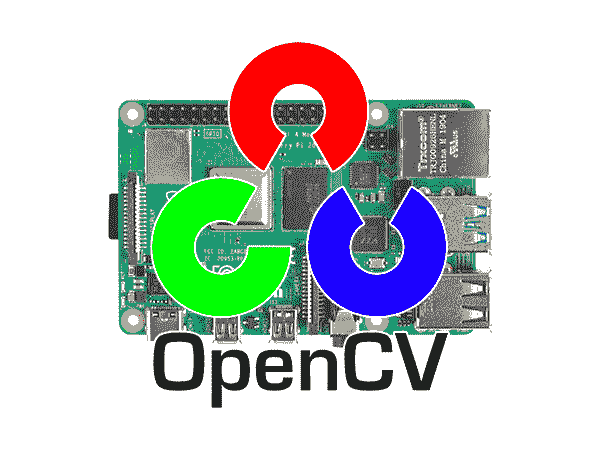
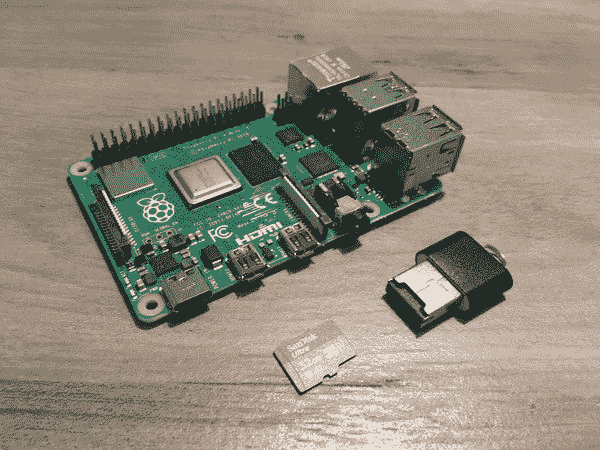
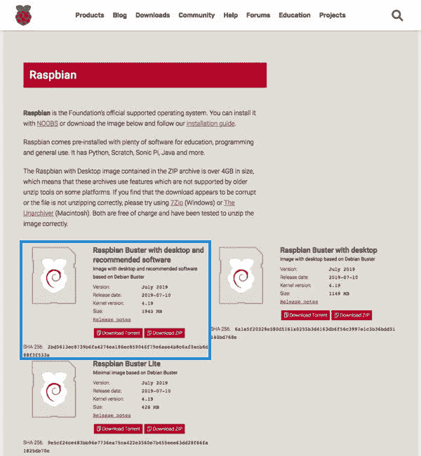
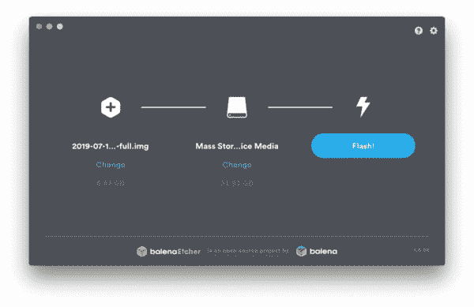
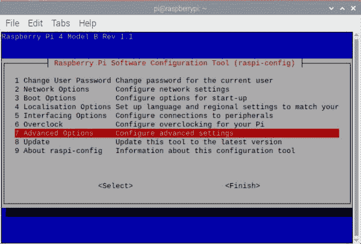
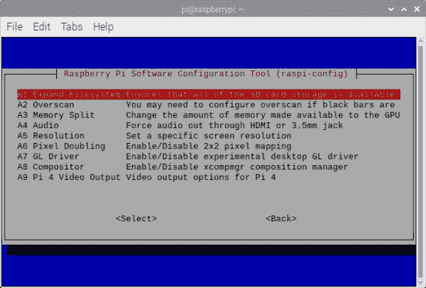
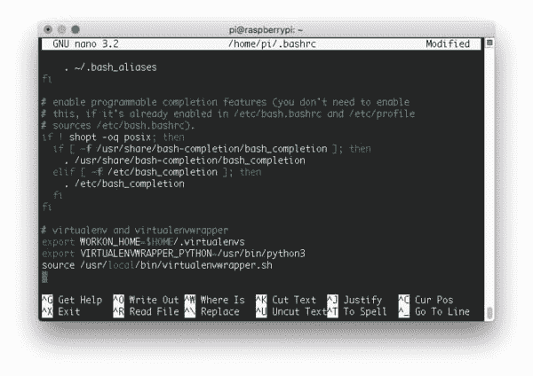
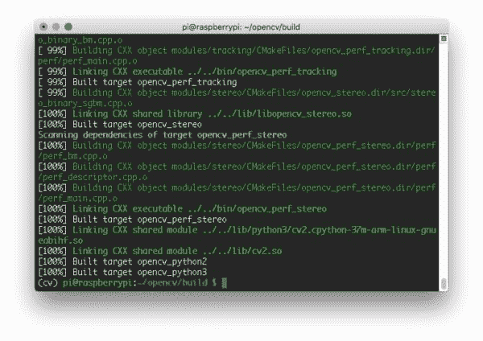
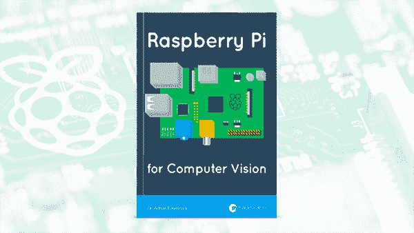

# 在 Raspberry Pi 4 和 Raspbian Buster 上安装 OpenCV 4

> 原文：<https://pyimagesearch.com/2019/09/16/install-opencv-4-on-raspberry-pi-4-and-raspbian-buster/>



在本教程中，您将学习如何在 Raspberry Pi 4 和 Raspbian Buster 上安装 OpenCV 4。

您将通过以下两种方式学习如何在 Raspbian Buster 上安装 OpenCV 4:

1.  **简单的管道安装方法**(几分钟内即可完成)
2.  **从源代码**编译(这将花费更长的时间，但将让您访问 OpenCV 的完整、优化安装)

**要了解更多关于在 Raspberry Pi 4 和 Raspbian Buster 上安装 OpenCV 4 的信息，*请继续阅读。***

***2019-11-21 更新:*** *由于使用 pip 安装方法与 OpenCV 的兼容性问题，本博客发布了一个更新。一定要在搜索“2019-11-21 更新”时通过`ctrl + f`找到更新。*

## 在 Raspberry Pi 4 和 Raspbian Buster 上安装 OpenCV 4

在本教程中，我们将通过五个简单易行的步骤在 Raspbian Buster 上安装和测试 OpenCV 4。

如果你以前曾经从头编译过 OpenCV，你就会知道这个过程是*特别耗时的*，如果你错过了一个关键步骤，或者如果你是 Linux 和 Bash 的新手，甚至*会痛苦地挫败*。

**2018 年第四季度，在树莓 Pi 上安装 OpenCV 的[新方法(即 pip 安装)得以实现，这要归功于以下人员的辛勤工作:](https://pyimagesearch.com/2018/09/19/pip-install-opencv/)**

*   [Olli-PE kka Heini soo](https://github.com/skvark)—PyPi 上 [opencv-contrib-python 包的维护者](https://pypi.org/project/opencv-contrib-python/)
*   [Ben Nuttall](https://github.com/bennuttall) —来自 Raspberry Pi 社区运营的[piwheels.org](https://www.piwheels.org/)，一个为 Raspberry Pi 提供 ARM wheels(即预编译的二进制包)的 Python 包库
*   [达夫·琼斯](https://github.com/waveform80)—`picamera`Python 模块的创建者

通过 pip 安装 OpenCV 比以往更加容易。事实上，您可以在不到 10 分钟的时间内启动并运行(**步骤# 1–步骤#4a** )。

但是有什么问题呢？

使用 pip 安装 OpenCV 很棒，但是对于一些项目(包括许多关于 PyImageSearch.com 和我的书/课程中的教育项目)**你可能想要 OpenCV 的完整安装(pip 安装*不会给你*)。**

不要担心，我会在下面的**步骤 4b** 中为您介绍——您将从头开始学习使用 CMake 和 Make 在 BusterOS 上编译 OpenCV 4。

让我们开始吧！

### 在我们开始之前:拿起你的 Raspberry Pi 4 和 flash BusterOS 到你的 microSD

让我们回顾一下本教程的**硬件要求**:

*   **树莓 Pi:** 本教程假设你使用的是 ***树莓 Pi 4B 1GB、2GB** 或 **4GB*** 硬件。
*   **操作系统:**这些指令 ***只适用于 Raspbian Buster**T5。*
*   **32GB microSD:** 我推荐优质的 SanDisk 32GB 98Mb/s 卡。这里有一个在[亚马逊](https://amzn.to/2Lv9C4O)上的例子(不过你可以在你最喜欢的在线经销商上购买)。
*   **microSD 适配器:**你需要购买一个 microSD 转 USB 适配器，这样你就可以从你的笔记本电脑上闪存存储卡。

如果你还没有树莓 Pi 4，我强烈推荐 CanaKits ( [在亚马逊](https://amzn.to/2ZWLnFr)有售)以及直接通过 [Canakit 的网站](https://www.canakit.com/)购买。他们的大多数套件都带有 Raspberry Pi、电源适配器、microSD、microSD 适配器、散热器等等！

[](https://pyimagesearch.com/wp-content/uploads/2019/09/install_opencv4_buster_hardware.jpg)

**Figure 1:** Hardware for installing OpenCV 4 on your Raspberry Pi 4 running Raspbian Buster.

一旦你准备好了硬件，你就需要**刷新 Raspbian Buster 操作系统的副本**到 microSD 卡。

1.  前往【BusterOS 官方下载页面 ( **图 2** )，开始下载。我推荐*“Raspbian Buster 带桌面和推荐软件”*。
2.  下载 [Balena Etcher](https://www.balena.io/etcher/) —用于刷新存储卡的软件。它适用于所有主流操作系统。
3.  使用 Etcher 将 BusterOS 闪存到您的存储卡中(**图 3** )。

[](https://pyimagesearch.com/wp-content/uploads/2019/09/install_opencv4_buster_download_os.jpg)

**Figure 2:** Download Raspbian Buster for your Raspberry Pi and OpenCV 4.

下载了拉斯扁克星后。img 文件，您可以使用 Etcher 将其闪存到您的 micro-SD 卡中:

[](https://pyimagesearch.com/wp-content/uploads/2019/09/install_opencv4_buster_etcher.jpg)

**Figure 3:** Flash Raspbian Buster with Etcher. We will use BusterOS to install OpenCV 4 on our Raspberry Pi 4.

几分钟后，刷新过程应该完成——将 micro-SD 卡插入您的 Raspberry Pi 4，然后启动。

从这里开始，您可以继续本指南中其余的 OpenCV 安装步骤。

### 步骤 1:扩展文件系统并回收空间

在本教程的剩余部分，我将做以下假设:

1.  您正在使用一个全新安装的 **Raspbian Buster** (参见上一节了解如何将 Buster 刷新到您的 microSD)。
2.  您已经熟悉了命令行和 Unix 环境。
3.  您与您的 Pi 建立了一个 [SSH 或 VNC 连接。或者，你可以使用键盘+鼠标+屏幕。](https://pyimagesearch.com/2019/07/01/remote-development-on-the-raspberry-pi-or-amazon-ec2/)

继续把你的 microSD 插入到你的 Raspberry Pi 中，用一个附加的屏幕启动它。

启动后，配置您的 WiFi/以太网设置以连接到互联网(您需要互联网连接来下载和安装 OpenCV 所需的软件包)。

在那里，你可以像我一样使用 SSH，或者打开一个终端。

第一步是运行并扩展您的文件系统:

```
$ sudo raspi-config

```

然后选择***【7 高级选项】*** 菜单项:

[](https://pyimagesearch.com/wp-content/uploads/2019/09/install_opencv4_buster_raspi_config.jpg)

**Figure 4:** The `raspi-config` configuration screen for Raspbian Buster. Select `7 Advanced Options` so that we can expand our filesystem.

依次选择***【A1 扩展文件系统】*** :

[](https://pyimagesearch.com/wp-content/uploads/2019/09/install_opencv4_buster_raspi_config_expand_fs.jpg)

**Figure 5:** The `A1 Expand Filesystem` menu item allows you to expand the filesystem on your microSD card containing the Raspberry Pi Buster operating system. Then we can proceed to install OpenCV 4.

一旦出现提示，您应该选择第一个选项，***【A1 扩展文件系统】*** ，点击键盘上的`enter`，向下箭头到***<【完成】>***按钮，然后重新启动您的 Pi——您可能会被提示重新启动，但如果不是，您可以执行:

```
$ sudo reboot

```

重新启动后，您的文件系统应该已经扩展到包括 micro-SD 卡上的所有可用空间。您可以通过执行`df -h`并检查输出来验证磁盘是否已经扩展:

```
$ df -h
Filesystem      Size  Used Avail Use% Mounted on
/dev/root        29G  5.3G   23G  20% /
devtmpfs        1.8G     0  1.8G   0% /dev
tmpfs           1.9G     0  1.9G   0% /dev/shm
tmpfs           1.9G  8.6M  1.9G   1% /run
tmpfs           5.0M  4.0K  5.0M   1% /run/lock
tmpfs           1.9G     0  1.9G   0% /sys/fs/cgroup
/dev/mmcblk0p1  253M   40M  213M  16% /boot
tmpfs           386M     0  386M   0% /run/user/1000

```

如您所见，我的 Raspbian 文件系统已经扩展到包括所有 32GB 的 micro-SD 卡。

然而，即使我的文件系统扩展了，我也已经使用了 32GB 卡的 15%。

虽然这不是必需的，但我建议删除 Wolfram Engine 和 LibreOffice，以便在您的 Raspberry Pi 上回收大约 1GB 的空间:

```
$ sudo apt-get purge wolfram-engine
$ sudo apt-get purge libreoffice*
$ sudo apt-get clean
$ sudo apt-get autoremove

```

### 步骤 2:安装依赖项

以下命令将更新和升级任何现有的包，然后安装 OpenCV 的依赖项、I/O 库和优化包:

第一步是更新和升级任何现有的软件包:

```
$ sudo apt-get update && sudo apt-get upgrade

```

然后我们需要安装一些开发工具，包括 [CMake](https://cmake.org/) ，它帮助我们配置 OpenCV 构建过程:

```
$ sudo apt-get install build-essential cmake pkg-config

```

接下来，我们需要安装一些图像 I/O 包，允许我们从磁盘加载各种图像文件格式。这种文件格式的例子包括 JPEG、PNG、TIFF 等。：

```
$ sudo apt-get install libjpeg-dev libtiff5-dev libjasper-dev libpng-dev

```

就像我们需要图像 I/O 包一样，我们也需要视频 I/O 包。这些库允许我们从磁盘读取各种视频文件格式，并直接处理视频流:

```
$ sudo apt-get install libavcodec-dev libavformat-dev libswscale-dev libv4l-dev
$ sudo apt-get install libxvidcore-dev libx264-dev

```

OpenCV 库附带了一个名为`highgui`的子模块，用于在屏幕上显示图像和构建基本的 GUI。为了编译`highgui`模块，我们需要安装 GTK 开发库和先决条件:

```
$ sudo apt-get install libfontconfig1-dev libcairo2-dev
$ sudo apt-get install libgdk-pixbuf2.0-dev libpango1.0-dev
$ sudo apt-get install libgtk2.0-dev libgtk-3-dev

```

OpenCV 内部的许多操作(即矩阵操作)可以通过安装一些额外的依赖项来进一步优化:

```
$ sudo apt-get install libatlas-base-dev gfortran

```

这些优化库对于资源受限的设备来说*尤其重要*，比如 Raspberry Pi。

以下先决条件是针对**步骤 4a** 的，它们当然也不会对**步骤 4b** 造成伤害。它们适用于 HDF5 数据集和 Qt GUIs:

```
$ sudo apt-get install libhdf5-dev libhdf5-serial-dev libhdf5-103
$ sudo apt-get install libqtgui4 libqtwebkit4 libqt4-test python3-pyqt5

```

最后，让我们安装 Python 3 头文件，这样我们就可以用 Python 绑定来编译 OpenCV:

```
$ sudo apt-get install python3-dev

```

如果您使用的是全新安装的操作系统，那么 Python 的这些版本可能已经是最新版本了(您会看到一条终端消息说明这一点)。

### 步骤 3:创建您的 Python 虚拟环境并安装 NumPy

我们将使用 Python **虚拟环境**，这是使用 Python 时的最佳实践。

Python 虚拟环境是您系统上的一个*隔离的*开发/测试/生产环境——它与其他环境完全隔离。最重要的是，您可以使用 pip (Python 的包管理器)管理虚拟环境中的 Python 包。

当然，也有管理虚拟环境和包的替代方法(即 Anaconda/conda)。我已经使用/尝试了所有这些工具，但最终选定 pip、 [virtualenv](https://virtualenv.pypa.io/en/latest/) 和 [virtualenvwrapper](https://virtualenvwrapper.readthedocs.org/en/latest/) 作为我安装在所有系统上的首选工具。如果你使用和我一样的工具，你会得到我最好的支持。

您可以使用以下命令安装 pip:

```
$ wget https://bootstrap.pypa.io/get-pip.py
$ sudo python get-pip.py
$ sudo python3 get-pip.py
$ sudo rm -rf ~/.cache/pip

```

现在让我们安装`virtualenv`和`virtualenvwrapper`:

```
$ sudo pip install virtualenv virtualenvwrapper

```

一旦`virtualenv`和`virtualenvwrapper`都安装好了，打开你的`~/.bashrc`文件:

```
$ nano ~/.bashrc

```

…并将以下几行附加到文件的底部:

```
# virtualenv and virtualenvwrapper
export WORKON_HOME=$HOME/.virtualenvs
export VIRTUALENVWRAPPER_PYTHON=/usr/bin/python3
source /usr/local/bin/virtualenvwrapper.sh

```

[](https://pyimagesearch.com/wp-content/uploads/2019/09/install_opencv4_buster_bashrc.jpg)

**Figure 6:** Using the `nano` editor to update ~/.bashrc with `virtualenvwrapper` settings.

通过`ctrl + x`、`y`、`enter`保存并退出。

从那里，重新加载您的`~/.bashrc`文件，将更改应用到您当前的 bash 会话:

```
$ source ~/.bashrc

```

接下来，创建您的 **Python 3 虚拟环境:**

```
$ mkvirtualenv cv -p python3

```

这里我们使用 Python 3 创建了一个名为`cv`的 Python 虚拟环境。展望未来，我推荐 Python 3 和 OpenCV 4+。

***注意:** Python 2.7 将于 2020 年 1 月 1 日到达生命的尽头，所以我**不**推荐使用 Python 2.7。*

您可以随意命名虚拟环境，但是我在 PyImageSearch 上使用`cv`作为标准命名约定。

如果你的 RPi 上有一个 Raspberry Pi 相机模块，你现在也应该安装 **PiCamera API** :

```
$ pip install "picamera[array]"

```

### 步骤#4(a 或 b):决定你想要 1 分钟的快速安装还是 2 小时的完整安装

从这里开始，您需要决定安装的其余部分。有两个选择。

1.  **步骤#4a: pip 安装 OpenCV 4:** 如果你决定 pip 安装 OpenCV，你将在几秒钟内完成**。这是迄今为止安装 OpenCV 最快、最简单的*方法。这是我向 90%的人推荐的方法——尤其是初学者。在此步骤之后，您将*跳到* **步骤#5** 来测试您的安装。***
***   **步骤#4b:从源代码编译 OpenCV 4:**这个方法给你 OpenCV 4 的**完全安装**。根据您的 Raspberry Pi 中的处理器，这将需要 2-4 个小时。**

 **如上所述，我强烈建议您使用 pip 说明。它们速度更快，可以为你 90%的项目工作。此外，专利算法只能用于教育目的(专利算法也有很多很好的替代品)。

### 步骤 4a: pip 安装 OpenCV 4

在几秒钟内，你可以将 OpenCV 安装到虚拟环境中:

```
$ pip install opencv-contrib-python==4.1.0.25

```

***2019-11-21 更新:**读者反映，通过 pip 安装的 OpenCV 4 的某些版本在树莓 Pi 上无法正常工作。如果您没有使用上面代码块中提到的 OpenCV 的特定版本，当您从 Python 中执行`import cv2`时，您可能会遇到一个“**”未定义的符号:_ _ atomic _ fetch _ add 8”“**,表示`libatomic`错误。*

如果你观察终端输出，你会看到安装的是 OpenCV 3.4 而不是 OpenCV 4？

怎么回事？

在撰写本文时，PiWheels 还没有用 Raspbian Buster 的预编译 OpenCV 4 二进制文件进行更新。PiWheels 通常会稍微落后于 OpenCV 的最新版本，这可能是为了确保主要 Raspbian 版本之间的兼容性。**一旦 OpenCV 4 为 PiWheels 发布，我将更新这一部分。**

这就是事情的全部。您现在可以跳到**步骤#5** 来测试您的安装。

### 步骤 4b:从源代码编译 OpenCV 4

此选项安装 OpenCV 的完整安装，包括专利(“非自由”)算法。

***注意:如果您遵循了步骤 4a，请不要遵循步骤 4b。***

让我们继续下载 OpenCV 源代码，包括 [opencv](https://github.com/opencv/opencv) 和 [opencv_contrib](https://github.com/opencv/opencv_contrib) 库，然后解包:

```
$ cd ~
$ wget -O opencv.zip https://github.com/opencv/opencv/archive/4.1.1.zip
$ wget -O opencv_contrib.zip https://github.com/opencv/opencv_contrib/archive/4.1.1.zip
$ unzip opencv.zip
$ unzip opencv_contrib.zip
$ mv opencv-4.1.1 opencv
$ mv opencv_contrib-4.1.1 opencv_contrib

```

对于这篇博文，我们将使用 OpenCV 4 . 1 . 1；但是，随着 OpenCV 新版本的发布，您可以更新相应的版本号。

#### 增加您的交换空间

在你开始编译之前，你必须 ***增加你的交换空间*** 。增加交换空间将使你能够用树莓派*的全部四个核心* 编译 OpenCV(而不会因为内存耗尽而导致编译挂起)。

继续打开您的`/etc/dphys-swapfile`文件:

```
$ sudo nano /etc/dphys-swapfile

```

…然后编辑`CONF_SWAPSIZE`变量:

```
# set size to absolute value, leaving empty (default) then uses computed value
#   you most likely don't want this, unless you have an special disk situation
# CONF_SWAPSIZE=100
CONF_SWAPSIZE=2048

```

注意，我将交换空间从 100MB 增加到了 **2048MB** 。这对于在 Raspbian Buster 上用多核编译 OpenCV 至关重要。

***2019-11-21 更新:**我们的测试表明，在 OpenCV 编译时，2048MB 的交换对于防止锁定是最有效的。*

通过`ctrl + x`、`y`、`enter`保存并退出。

如果你不增加 SWAP，你的 Pi 很可能会在编译过程中挂起。

从那里，重新启动交换服务:

```
$ sudo /etc/init.d/dphys-swapfile stop
$ sudo /etc/init.d/dphys-swapfile start

```

***注意:**增加交换空间是烧坏你的 Raspberry Pi microSD 卡的好方法。基于闪存的存储可以执行的写入次数有限，直到卡基本上无法再容纳 1 和 0。我们只会在短时间内启用大规模互换，所以这没什么大不了的。无论如何，一定要在安装 OpenCV + Python 后备份你的`.img`文件，以防你的卡意外提前死亡。你可以在本页的[阅读更多关于大容量交换损坏存储卡的信息。](https://www.bitpi.co/2015/02/11/how-to-change-raspberry-pis-swapfile-size-on-rasbian/)*

#### 在 Raspbian Buster 上编译并安装 OpenCV 4

我们现在准备在 Raspberry Pi 4 上编译和安装完整的、优化的 OpenCV 库。

使用`workon`命令确保您处于`cv`虚拟环境中:

```
$ workon cv

```

然后，将 NumPy(一个 OpenCV 依赖项)安装到 Python 虚拟环境中:

```
$ pip install numpy

```

并从那里配置您的构建:

```
$ cd ~/opencv
$ mkdir build
$ cd build
$ cmake -D CMAKE_BUILD_TYPE=RELEASE \
    -D CMAKE_INSTALL_PREFIX=/usr/local \
    -D OPENCV_EXTRA_MODULES_PATH=~/opencv_contrib/modules \
    -D ENABLE_NEON=ON \
    -D ENABLE_VFPV3=ON \
    -D BUILD_TESTS=OFF \
    -D INSTALL_PYTHON_EXAMPLES=OFF \
    -D OPENCV_ENABLE_NONFREE=ON \
    -D CMAKE_SHARED_LINKER_FLAGS=-latomic \
    -D BUILD_EXAMPLES=OFF ..

```

我想提请大家注意四个 CMake 标志:

*   **(1)** 霓虹灯和 **(2)** VFPv3 优化标志已启用。这几行代码可以确保你在 Raspberry Pi 上为 ARM 处理器编译出最快、最优化的 OpenCV(**第 7 行和第 8 行**)。
    *   ***注:****树莓 Pi Zero W** 硬件不兼容 NEON 或 VFPv3。如果你正在编译一个 Raspberry Pi Zero W.* ，一定要删除**第 7 行和第 8 行**
*   **(3)** 专利“非自由”算法给你 OpenCV 的完整安装(**第 11 行**)。
*   并且通过深入 OpenCV 的源代码，确定了我们需要 **(4)** `-latomic`共享链接器标志(**第 12 行**)。

现在我想花一点时间让大家意识到初学者的一个常见陷阱:

*   在上面的端子板中，您将目录更改为`~/opencv/`。
*   然后在其中创建一个`build/`目录，并在其中更改目录。
*   **如果您试图在不在`~/opencv/build`目录中的情况下执行 CMake，CMake 将会失败。**试着运行`pwd`看看在运行`cmake`之前*你在哪个工作目录。*

在为编译准备和配置 OpenCV 时，`cmake`命令将需要大约 3-5 分钟的时间来运行。

当 CMake 完成时，一定要检查 Python 3 部分下 CMake 的输出:

请注意`Interpreter`、`Libraries`、`numpy`和`packages`路径变量是如何正确设置的。这些都是指我们的`cv`虚拟环境。

现在继续操作，**向上滚动**以确保**“非自由算法”**被设置为已安装:

如你所见，OpenCV 4 的“非自由算法”将被编译+安装。

现在我们已经为 OpenCV 4 编译做好了准备，是时候使用所有四个内核启动编译过程了:

```
$ make -j4

```

[](https://pyimagesearch.com/wp-content/uploads/2019/09/install_opencv4_buster_make_complete.jpg)

**Figure 9:** We used Make to compile OpenCV 4 on a Raspberry Pi 4 running Raspbian Buster.

运行`make`可能需要 1-4 个小时，这取决于你的 Raspberry Pi 硬件(本教程与 Raspberry Pi 3B、3B+和 4 兼容)。在撰写本文时，Raspberry Pi 4 是最快的。

假设 OpenCV 编译没有错误(如我上面的截图所示)，您可以在您的 Raspberry Pi 上安装您的 OpenCV 优化版本:

```
$ sudo make install
$ sudo ldconfig

```

#### 重置您的交换

***别忘了回去*** 给你的`/etc/dphys-swapfile`文件还有:

1.  将`CONF_SWAPSIZE`重置为 100MB。
2.  重新启动交换服务。

#### Sym-link 你的 OpenCV 4 在树莓 Pi 上

符号链接是一种从一个目录指向系统中其他位置的文件或文件夹的方式。对于这一子步骤，我们将把`cv2.so`绑定符号链接到您的`cv`虚拟环境中。

让我们继续创建我们的符号链接。确保[对以下所有路径使用“tab-completion”](https://www.howtogeek.com/195207/use-tab-completion-to-type-commands-faster-on-any-operating-system/)(而不是盲目复制这些命令):

```
$ cd /usr/local/lib/python3.7/site-packages/cv2/python-3.7
$ sudo mv cv2.cpython-37m-arm-linux-gnueabihf.so cv2.so
$ cd ~/.virtualenvs/cv/lib/python3.7/site-packages/
$ ln -s /usr/local/lib/python3.7/site-packages/cv2/python-3.7/cv2.so cv2.so

```

请记住，确切的路径可能会改变，您应该[使用“tab-completion”](https://www.howtogeek.com/195207/use-tab-completion-to-type-commands-faster-on-any-operating-system/)。

### 步骤 5:测试 OpenCV 4 Raspberry Pi BusterOS 安装

作为快速检查，访问`cv`虚拟环境，启动 Python shell，并尝试导入 OpenCV 库:

```
$ cd ~
$ workon cv
$ python
>>> import cv2
>>> cv2.__version__
'4.1.1'
>>>

```

**恭喜你！**您刚刚在您的 Raspberry Pi 上安装了 OpenCV 4。

如果你正在寻找一些有趣的项目来使用 OpenCV 4，一定要看看我的 [Raspberry Pi 档案](https://pyimagesearch.com/tag/raspberry-pi/)。

### 常见问题(FAQ)

**问:当我遇到与`libatomic.so`相关的`"undefined symbol: __atomic_fetch_add8"`错误时，我该怎么办？**

答:自 OpenCV 4.1.1(大约在 2019 年 11 月的时间框架内)以来，pip 安装一直给读者带来麻烦。确保安装版本`4.1.0.25`:

`$ pip install opencv-contrib-python==4.1.0.25`

## 下一步是什么？

[](https://pyimagesearch.com/raspberry-pi-for-computer-vision/)

准备好让您的 Raspberry Pi 和 OpenCV 安装工作了吗？

我全新的书， [*计算机视觉的树莓派*](https://pyimagesearch.com/raspberry-pi-for-computer-vision/) ，有**超过 40 个嵌入式计算机视觉和物联网(IoT)应用的计算机视觉和深度学习项目**。你可以利用书中的项目来解决你的家庭、商业甚至是客户的问题。**每个项目都强调:**

*   做中学
*   卷起你的袖子
*   在代码和实现中动手
*   使用 Raspberry Pi 构建*实际的、真实的项目*

**几个突出显示的项目包括:**

*   日间和夜间野生动物监测
*   交通计数和车速检测
*   资源受限设备上的深度学习分类、对象检测和实例分割
*   手势识别
*   基本机器人导航
*   安全应用
*   课堂出勤率
*   还有更多！

这本书还涵盖了使用**谷歌 Coral** 和**英特尔 Movidius NCS** 协处理器以及**英伟达 Jetson Nano** 主板的深度学习。

如果你对研究计算机视觉和嵌入式设备上的深度学习感兴趣， [***你不会找到比这本书更好的书了！***](https://pyimagesearch.com/raspberry-pi-for-computer-vision/)

[Pick up your copy of *Raspberry Pi for Computer Vision* today!](https://pyimagesearch.com/raspberry-pi-for-computer-vision/)

## 摘要

在今天的教程中，您学习了如何通过两种方法在运行 Raspbian Buster 操作系统的 Raspberry Pi 4 上安装 OpenCV 4:

*   简单的 **pip 安装**(快速简单)
*   **从源代码**编译(花费更长时间，但是给你完整的 OpenCV 安装/优化)

安装 OpenCV 4 的 pip 方法*是迄今为止安装 OpenCV 最简单的方法*(也是我*为 90%的项目推荐的方法*)。这对初学者来说也是非常棒的。

如果您需要 OpenCV 的完整安装，您必须从源代码编译。从源代码编译可以确保您拥有完整的安装，包括带有专利(“非免费”)算法的“contrib”模块。

虽然从源代码编译既(1)更复杂，又(2)更耗时，但这是目前访问 OpenCV 所有特性的唯一方法。

我希望你喜欢今天的教程！

如果你准备好让你的 RPi 和 OpenCV 安装工作，一定要看看我的书， **[*用于计算机视觉的树莓 Pi*](https://pyimagesearch.com/raspberry-pi-for-computer-vision/)**——在这本书里，你将学习如何在树莓 Pi、Google Coral、Movidius NCS 和 NVIDIA Jetson Nano 上构建实用的、真实世界的计算机视觉和深度学习应用。

**当未来的教程在 PyImageSearch 博客上发布时会得到通知(并下载我的免费 17 页简历和 DL 资源指南 PDF)，*只需在下面的表格中输入您的电子邮件地址！*****