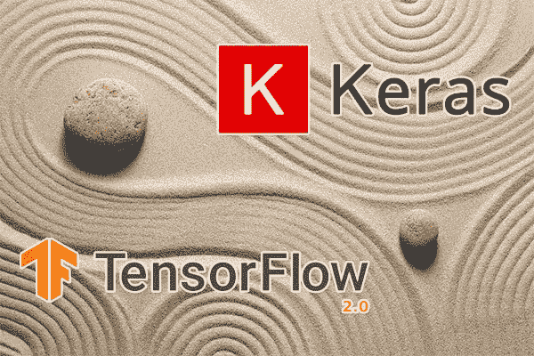
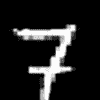
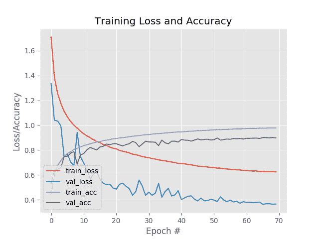

# 使用 Keras、TensorFlow 和深度学习进行标签平滑

> 原文：<https://pyimagesearch.com/2019/12/30/label-smoothing-with-keras-tensorflow-and-deep-learning/>

[](https://pyimagesearch.com/wp-content/uploads/2019/12/keras_label_smoothing_header.jpg)

在本教程中，您将学习使用 Keras、TensorFlow 和深度学习实现标注平滑的两种方法。

当训练你自己的定制深度神经网络时，有两个关键问题你应该不断地问自己:

1.  我是否让过度适应我的训练数据？
2.  我的模型*会将*推广到我的训练和测试分割之外的数据吗？

**正则化方法**用于帮助克服过度拟合，并帮助我们的模型泛化。正则化方法的例子包括丢弃、L2 权重衰减、数据扩充等。

然而，还有另一个我们还没有讨论的正则化技术*—**标签平滑。***

标签平滑:

*   将“硬”类别标签分配转换为“软”标签分配。
*   对标签本身直接操作*。*
**   实现起来非常简单。*   可以产生一个更好的模型。*

 *在本教程的剩余部分，我将向您展示如何实现标签平滑，并在训练您自己的自定义神经网络时使用它。

**要了解更多关于使用 Keras 和 TensorFlow 进行标签平滑的信息，*请继续阅读！***

## 使用 Keras、TensorFlow 和深度学习进行标签平滑

在本教程的第一部分，我将解决三个问题:

1.  什么是标签平滑？
2.  为什么我们要应用标签平滑？
3.  标签平滑如何改进我们的输出模型？

在这里，我将向您展示使用 Keras 和 TensorFlow 实现标注平滑的两种方法:

1.  通过**显式更新你的标签列表**来平滑标签
2.  使用损失函数进行标签平滑

 **然后，我们将使用这两种方法训练我们自己的定制模型，并检查结果。

### 什么是标注平滑，我们为什么要使用它？

当执行图像分类任务时，我们通常认为标签是硬的二进制分配。

例如，让我们考虑来自 MNIST 数据集的以下图像:

[](https://pyimagesearch.com/wp-content/uploads/2019/12/keras_label_smoothing_mnist_digit.png)

**Figure 1:** Label smoothing with Keras, TensorFlow, and Deep Learning is a regularization technique with a goal of enabling your model to generalize to new data better.

这个数字显然是一个*“7”*，如果我们写出这个数据点的独热编码标签向量，它将看起来像下面这样:

`[0.0, 0.0, 0.0, 0.0, 0.0, 0.0, 0.0, 1.0, 0.0, 0.0]`

注意我们在这里是如何执行**硬标签赋值的:**向量中的所有条目都是 `0` *，除了第 8 个索引(对应于数字 7)的*是一个`1`。

硬标签分配对我们来说是很自然的，并映射到我们的大脑希望如何有效地将信息分类并存储在标签和包装整齐的盒子中。

例如，我们会看着**图 1** 并说类似这样的话:

“我确定那是一个 7。我要给它贴上 7 的标签，把它放进‘7’的盒子里。”

说下面的话会觉得尴尬和不直观:

“嗯，我肯定那是一个 7。但即使我 100%确定这是一个 7，我还是会把这 7 的 90%放在“7”框中，然后把剩下的 10%分到所有的框中，这样我的大脑就不会过度适应“7”的样子。”

如果我们将软标签分配应用到上面的独热编码向量，它现在看起来像这样:

`[0.01 0.01 0.01 0.01 0.01 0.01 0.01 0.91 0.01 0.01]`

注意如何对值列表求和等于`1`，就像在原始的独热编码向量中一样。

这种类型的标签分配称为**软标签分配**。

与类别标签为二元的硬标签分配不同(即一个类别为正，所有其他类别为负)，软标签分配允许:

*   概率最大的正类
*   而所有其他类别的概率非常小

那么，为什么要大费周章呢？

答案是，我们不希望我们的模型对其预测过于自信。

通过应用标签平滑，我们可以降低模型的可信度，并防止它陷入过度拟合发生的损失景观的深裂缝中。

对于标签平滑的数学讨论，我推荐阅读毛蕾的文章。

此外，请务必阅读 Müller 等人 2019 年的论文 *[标签平滑何时有帮助？](https://arxiv.org/abs/1906.02629)*同贺在艾尔讯 s *[卷积神经网络图像分类小窍门](https://arxiv.org/abs/1812.01187)* 标签平滑详细研究。

在本教程的剩余部分，我将向您展示如何使用 Keras 和 TensorFlow 实现标签平滑。

### 项目结构

继续从今天教程的 ***【下载】*** 部分获取今天的文件。

一旦您提取了文件，您可以使用如图所示的`tree`命令来查看项目结构:

```
$ tree --dirsfirst
.
├── pyimagesearch
│   ├── __init__.py
│   ├── learning_rate_schedulers.py
│   └── minigooglenet.py
├── label_smoothing_func.py
├── label_smoothing_loss.py
├── plot_func.png
└── plot_loss.png

1 directory, 7 files

```

在`pyimagesearch`模块中，您会发现两个文件:

*   `learning_rate_schedulers.py`:一定要参考之前的 PyImageSearch 教程 [*Keras 学习率调度器和衰减*](https://pyimagesearch.com/2019/07/22/keras-learning-rate-schedules-and-decay/) 。
*   迷你谷歌网是我们将利用的 CNN 架构。关于模型架构的更多细节，一定要参考我的书， [*用 Python 进行计算机视觉的深度学习*](https://pyimagesearch.com/deep-learning-computer-vision-python-book/) 。

我们今天将*不*讨论上述实现，而是将重点放在我们的两种标签平滑方法上:

1.  **方法#1** 通过显式更新`label_smoothing_func.py`中的标签列表来使用标签平滑。
2.  **方法#2** 包括使用`label_smoothing_loss.py`中的张量流/Keras 损失函数进行标签平滑。

### 方法 1:通过显式更新标注列表来平滑标注

我们将看到的第一个标签平滑实现**在一次性编码**后直接修改我们的标签——我们需要做的就是实现一个简单的定制函数。

让我们开始吧。

打开项目结构中的`label_smoothing_func.py`文件，插入以下代码:

```
# set the matplotlib backend so figures can be saved in the background
import matplotlib
matplotlib.use("Agg")

# import the necessary packages
from pyimagesearch.learning_rate_schedulers import PolynomialDecay
from pyimagesearch.minigooglenet import MiniGoogLeNet
from sklearn.metrics import classification_report
from sklearn.preprocessing import LabelBinarizer
from tensorflow.keras.preprocessing.image import ImageDataGenerator
from tensorflow.keras.callbacks import LearningRateScheduler
from tensorflow.keras.optimizers import SGD
from tensorflow.keras.datasets import cifar10
import matplotlib.pyplot as plt
import numpy as np
import argparse

```

**第 2-16 行**导入我们的包、模块、类和函数。特别是，我们将使用 scikit-learn `LabelBinarizer` ( **第 9 行**)。

方法#1 的**核心在于`smooth_labels`函数:**

```
def smooth_labels(labels, factor=0.1):
	# smooth the labels
	labels *= (1 - factor)
	labels += (factor / labels.shape[1])

	# returned the smoothed labels
	return labels

```

**第 18 行**定义了`smooth_labels`功能。该函数接受两个参数:

*   `labels`:包含数据集中所有数据点的*的独热编码标签。*
*   `factor`:可选的“平滑因子”默认设置为 10%。

`smooth_labels`函数的其余部分是**,最好用一个两步示例来解释。**

**首先，**让我们假设下面的独热编码向量被提供给我们的函数:

`[0.0, 0.0, 0.0, 0.0, 0.0, 0.0, 0.0, 1.0, 0.0, 0.0]`

注意我们在这里有一个硬标签分配——真正的类标签是`1`而所有其他的都是 `0`。

**第 20 行**将我们的`1`硬分配标签减去供应的`factor`数量。使用`factor=0.1`，在**线 20** 上的操作产生以下向量:

`[0.0, 0.0, 0.0, 0.0, 0.0, 0.0, 0.0, 0.9, 0.0, 0.0]`

注意`1.0`的硬赋值是如何被降到`0.9`的。

下一步是对向量中的其余类别标签应用*非常小的*置信度。

我们通过用`factor`除以可能的类标签总数来完成这个任务。在我们的例子中，有`10`个可能的类标签，因此当`factor=0.1`时，我们有`0.1 / 10 = 0.01`——那个值被加到我们在**行 21** 的向量上，结果是:

`[0.01 0.01 0.01 0.01 0.01 0.01 0.01 0.91 0.01 0.01]`

注意这里的“不正确的”类有非常小的可信度。这看起来不多，但在实践中，它可以帮助我们的模型避免过拟合。

最后，**第 24 行**将平滑后的标签返回给调用函数。

***注:**`smooth_labels`函数部分来自[程维的文章](https://www.dlology.com/blog/bag-of-tricks-for-image-classification-with-convolutional-neural-networks-in-keras/)，其中他们讨论了**用卷积神经网络进行图像分类的技巧**论文。如果您对文章中的实现感兴趣，请务必阅读这篇文章。*

让我们继续实施:

```
# construct the argument parse and parse the arguments
ap = argparse.ArgumentParser()
ap.add_argument("-s", "--smoothing", type=float, default=0.1,
	help="amount of label smoothing to be applied")
ap.add_argument("-p", "--plot", type=str, default="plot.png",
	help="path to output plot file")
args = vars(ap.parse_args())

```

我们的两个[命令行参数](https://pyimagesearch.com/2018/03/12/python-argparse-command-line-arguments/)包括:

*   `--smoothing`:平滑`factor`(参考上面的`smooth_labels`函数和例子)。
*   `--plot`:输出绘图文件的路径。

让我们准备好超参数和数据:

```
# define the total number of epochs to train for, initial learning
# rate, and batch size
NUM_EPOCHS = 70
INIT_LR = 5e-3
BATCH_SIZE = 64

# initialize the label names for the CIFAR-10 dataset
labelNames = ["airplane", "automobile", "bird", "cat", "deer", "dog",
	"frog", "horse", "ship", "truck"]

# load the training and testing data, converting the images from
# integers to floats
print("[INFO] loading CIFAR-10 data...")
((trainX, trainY), (testX, testY)) = cifar10.load_data()
trainX = trainX.astype("float")
testX = testX.astype("float")

# apply mean subtraction to the data
mean = np.mean(trainX, axis=0)
trainX -= mean
testX -= mean

```

**第 36-38 行**初始化三个训练超参数，包括要训练的总时期数、初始学习率和批量大小。

**第 41 和 42 行**然后为 [CIFAR-10 数据集](https://www.cs.toronto.edu/~kriz/cifar.html)初始化我们的类`labelNames`。

**第 47-49 行**处理加载 CIFAR-10 数据集。

均值减法(Mean subtraction)是一种标准化形式，包含在使用 Python 的 [*计算机视觉深度学习的*实践者包*中，通过**行 52-54** 应用于数据。*](https://pyimagesearch.com/deep-learning-computer-vision-python-book/)

让我们**通过方法#1 应用标签平滑:**

```
# convert the labels from integers to vectors, converting the data
# type to floats so we can apply label smoothing
lb = LabelBinarizer()
trainY = lb.fit_transform(trainY)
testY = lb.transform(testY)
trainY = trainY.astype("float")
testY = testY.astype("float")

# apply label smoothing to the *training labels only*
print("[INFO] smoothing amount: {}".format(args["smoothing"]))
print("[INFO] before smoothing: {}".format(trainY[0]))
trainY = smooth_labels(trainY, args["smoothing"])
print("[INFO] after smoothing: {}".format(trainY[0]))

```

**第 58-62 行**对标签进行一次性编码，并将其转换为浮点数。

**第 67 行**使用我们的`smooth_labels`函数应用标签平滑。

在这里，我们将准备数据扩充和我们的学习率调度程序:

```
# construct the image generator for data augmentation
aug = ImageDataGenerator(
	width_shift_range=0.1,
	height_shift_range=0.1,
	horizontal_flip=True,
	fill_mode="nearest")

# construct the learning rate scheduler callback
schedule = PolynomialDecay(maxEpochs=NUM_EPOCHS, initAlpha=INIT_LR,
	power=1.0)
callbacks = [LearningRateScheduler(schedule)]

# initialize the optimizer and model
print("[INFO] compiling model...")
opt = SGD(lr=INIT_LR, momentum=0.9)
model = MiniGoogLeNet.build(width=32, height=32, depth=3, classes=10)
model.compile(loss="categorical_crossentropy", optimizer=opt,
	metrics=["accuracy"])

# train the network
print("[INFO] training network...")
H = model.fit_generator(
	aug.flow(trainX, trainY, batch_size=BATCH_SIZE),
	validation_data=(testX, testY),
	steps_per_epoch=len(trainX) // BATCH_SIZE,
	epochs=NUM_EPOCHS,
	callbacks=callbacks,
	verbose=1)

```

第 71-75 行实例化我们的[数据扩充](https://pyimagesearch.com/2019/07/08/keras-imagedatagenerator-and-data-augmentation/)对象。

**第 78-80 行**通过将在每个时期开始时执行的回调来初始化学习率衰减。要了解如何创建自己的定制 Keras 回调，请务必参考使用 Python 进行计算机视觉深度学习的 [*的*入门包*。*](https://pyimagesearch.com/deep-learning-computer-vision-python-book/)

然后我们编译并训练我们的模型(**第 84-97 行**)。

一旦模型完全训练完毕，我们将继续生成分类报告和训练历史图:

```
# evaluate the network
print("[INFO] evaluating network...")
predictions = model.predict(testX, batch_size=BATCH_SIZE)
print(classification_report(testY.argmax(axis=1),
	predictions.argmax(axis=1), target_names=labelNames))

# construct a plot that plots and saves the training history
N = np.arange(0, NUM_EPOCHS)
plt.style.use("ggplot")
plt.figure()
plt.plot(N, H.history["loss"], label="train_loss")
plt.plot(N, H.history["val_loss"], label="val_loss")
plt.plot(N, H.history["accuracy"], label="train_acc")
plt.plot(N, H.history["val_accuracy"], label="val_acc")
plt.title("Training Loss and Accuracy")
plt.xlabel("Epoch #")
plt.ylabel("Loss/Accuracy")
plt.legend(loc="lower left")
plt.savefig(args["plot"])

```

### 方法 2:使用张量流/Keras 损失函数进行标注平滑

我们实现标签平滑的第二种方法直接利用 Keras/TensorFlow 的`CategoricalCrossentropy`类。

这里的好处是，我们*不需要*实现任何定制函数——标签平滑可以在用`label_smoothing`参数实例化`CategoricalCrossentropy`类时动态应用，如下所示:

`CategoricalCrossentropy(label_smoothing=0.1)`

同样，这里的好处是我们不需要任何定制的实现。

缺点是我们无法访问原始标签列表，如果您在监控培训过程时需要它来计算您自己的自定义指标，这将是一个问题。

说了这么多，让我们学习如何利用`CategoricalCrossentropy`进行标签平滑。

**我们的实现*与前一部分的*非常相似，但有一些例外**——我将一路指出不同之处。要详细查看我们的培训脚本，请参考上一节。

打开目录结构中的`label_smoothing_loss.py`文件，我们将开始:

```
# set the matplotlib backend so figures can be saved in the background
import matplotlib
matplotlib.use("Agg")

# import the necessary packages
from pyimagesearch.learning_rate_schedulers import PolynomialDecay
from pyimagesearch.minigooglenet import MiniGoogLeNet
from sklearn.metrics import classification_report
from sklearn.preprocessing import LabelBinarizer
from tensorflow.keras.losses import CategoricalCrossentropy
from tensorflow.keras.preprocessing.image import ImageDataGenerator
from tensorflow.keras.callbacks import LearningRateScheduler
from tensorflow.keras.optimizers import SGD
from tensorflow.keras.datasets import cifar10
import matplotlib.pyplot as plt
import numpy as np
import argparse

# construct the argument parse and parse the arguments
ap = argparse.ArgumentParser()
ap.add_argument("-s", "--smoothing", type=float, default=0.1,
	help="amount of label smoothing to be applied")
ap.add_argument("-p", "--plot", type=str, default="plot.png",
	help="path to output plot file")
args = vars(ap.parse_args())

```

第 2-17 行处理我们的进口。最值得注意的**10 号线**进口`CategoricalCrossentropy`。

我们的`--smoothing`和`--plot`命令行参数与**方法#1** 中的相同。

我们的下一个代码块与**方法#1** 几乎相同，除了最后一部分:

```
# define the total number of epochs to train for initial learning
# rate, and batch size
NUM_EPOCHS = 2
INIT_LR = 5e-3
BATCH_SIZE = 64

# initialize the label names for the CIFAR-10 dataset
labelNames = ["airplane", "automobile", "bird", "cat", "deer", "dog",
	"frog", "horse", "ship", "truck"]

# load the training and testing data, converting the images from
# integers to floats
print("[INFO] loading CIFAR-10 data...")
((trainX, trainY), (testX, testY)) = cifar10.load_data()
trainX = trainX.astype("float")
testX = testX.astype("float")

# apply mean subtraction to the data
mean = np.mean(trainX, axis=0)
trainX -= mean
testX -= mean

# convert the labels from integers to vectors
lb = LabelBinarizer()
trainY = lb.fit_transform(trainY)
testY = lb.transform(testY)

```

在这里我们:

*   初始化训练超参数(**第 29-31 行**)。
*   初始化我们的 CIFAR-10 类名(**第 34 和 35 行**)。
*   加载 CIFAR-10 数据(**第 40-42 行**)。
*   应用平均减法(**第 45-47 行**)。

这些步骤中的每一步都与**方法#1** 相同。

**第 50-52 行**与我们之前的方法相比，一次性编码标签**带有*警告*。**`CategoricalCrossentropy`类会为我们处理标签平滑，所以不需要像我们之前做的那样直接修改`trainY`和`testY`列表。

让我们实例化我们的数据扩充和学习率调度回调:

```
# construct the image generator for data augmentation
aug = ImageDataGenerator(
	width_shift_range=0.1,
	height_shift_range=0.1,
	horizontal_flip=True,
	fill_mode="nearest")

# construct the learning rate scheduler callback
schedule = PolynomialDecay(maxEpochs=NUM_EPOCHS, initAlpha=INIT_LR,
	power=1.0)
callbacks = [LearningRateScheduler(schedule)]

```

从那里我们将**用标签平滑参数** 初始化我们的损失

```
# initialize the optimizer and loss
print("[INFO] smoothing amount: {}".format(args["smoothing"]))
opt = SGD(lr=INIT_LR, momentum=0.9)
loss = CategoricalCrossentropy(label_smoothing=args["smoothing"])

print("[INFO] compiling model...")
model = MiniGoogLeNet.build(width=32, height=32, depth=3, classes=10)
model.compile(loss=loss, optimizer=opt, metrics=["accuracy"])

```

第 84 和 85 行初始化我们的优化器和损失函数。

**方法#2 的核心在带有标签平滑的损失方法中:**注意我们如何将`label_smoothing`参数传递给`CategoricalCrossentropy`类。这个类将自动为我们应用标签平滑。

然后我们编译这个模型，传入带有标签平滑的`loss`。

最后，我们将训练我们的模型，评估它，并绘制训练历史:

```
# train the network
print("[INFO] training network...")
H = model.fit_generator(
	aug.flow(trainX, trainY, batch_size=BATCH_SIZE),
	validation_data=(testX, testY),
	steps_per_epoch=len(trainX) // BATCH_SIZE,
	epochs=NUM_EPOCHS,
	callbacks=callbacks,
	verbose=1)

# evaluate the network
print("[INFO] evaluating network...")
predictions = model.predict(testX, batch_size=BATCH_SIZE)
print(classification_report(testY.argmax(axis=1),
	predictions.argmax(axis=1), target_names=labelNames))

# construct a plot that plots and saves the training history
N = np.arange(0, NUM_EPOCHS)
plt.style.use("ggplot")
plt.figure()
plt.plot(N, H.history["loss"], label="train_loss")
plt.plot(N, H.history["val_loss"], label="val_loss")
plt.plot(N, H.history["accuracy"], label="train_acc")
plt.plot(N, H.history["val_accuracy"], label="val_acc")
plt.title("Training Loss and Accuracy")
plt.xlabel("Epoch #")
plt.ylabel("Loss/Accuracy")
plt.legend(loc="lower left")
plt.savefig(args["plot"])

```

### 标注平滑结果

既然我们已经实现了我们的标签平滑脚本，让我们把它们投入工作。

首先使用本教程的 ***【下载】*** 部分下载源代码。

从那里，打开一个终端，执行以下命令，使用我们的自定义`smooth_labels`函数应用标签平滑:

```
$ python label_smoothing_func.py --smoothing 0.1
[INFO] loading CIFAR-10 data...
[INFO] smoothing amount: 0.1
[INFO] before smoothing: [0\. 0\. 0\. 0\. 0\. 0\. 1\. 0\. 0\. 0.]
[INFO] after smoothing: [0.01 0.01 0.01 0.01 0.01 0.01 0.91 0.01 0.01 0.01]
[INFO] compiling model...
[INFO] training network...
Epoch 1/70
781/781 [==============================] - 115s 147ms/step - loss: 1.6987 - accuracy: 0.4482 - val_loss: 1.2606 - val_accuracy: 0.5488
Epoch 2/70
781/781 [==============================] - 98s 125ms/step - loss: 1.3924 - accuracy: 0.6066 - val_loss: 1.4393 - val_accuracy: 0.5419
Epoch 3/70
781/781 [==============================] - 96s 123ms/step - loss: 1.2696 - accuracy: 0.6680 - val_loss: 1.0286 - val_accuracy: 0.6458
Epoch 4/70
781/781 [==============================] - 96s 123ms/step - loss: 1.1806 - accuracy: 0.7133 - val_loss: 0.8514 - val_accuracy: 0.7185
Epoch 5/70
781/781 [==============================] - 95s 122ms/step - loss: 1.1209 - accuracy: 0.7440 - val_loss: 0.8533 - val_accuracy: 0.7155
...
Epoch 66/70
781/781 [==============================] - 94s 120ms/step - loss: 0.6262 - accuracy: 0.9765 - val_loss: 0.3728 - val_accuracy: 0.8910
Epoch 67/70
781/781 [==============================] - 94s 120ms/step - loss: 0.6267 - accuracy: 0.9756 - val_loss: 0.3806 - val_accuracy: 0.8924
Epoch 68/70
781/781 [==============================] - 95s 121ms/step - loss: 0.6245 - accuracy: 0.9775 - val_loss: 0.3659 - val_accuracy: 0.8943
Epoch 69/70
781/781 [==============================] - 94s 120ms/step - loss: 0.6245 - accuracy: 0.9773 - val_loss: 0.3657 - val_accuracy: 0.8936
Epoch 70/70
781/781 [==============================] - 94s 120ms/step - loss: 0.6234 - accuracy: 0.9778 - val_loss: 0.3649 - val_accuracy: 0.8938
[INFO] evaluating network...
              precision    recall  f1-score   support

    airplane       0.91      0.90      0.90      1000
  automobile       0.94      0.97      0.95      1000
        bird       0.84      0.86      0.85      1000
         cat       0.80      0.78      0.79      1000
        deer       0.90      0.87      0.89      1000
         dog       0.86      0.82      0.84      1000
        frog       0.88      0.95      0.91      1000
       horse       0.94      0.92      0.93      1000
        ship       0.94      0.94      0.94      1000
       truck       0.93      0.94      0.94      1000

    accuracy                           0.89     10000
   macro avg       0.89      0.89      0.89     10000
weighted avg       0.89      0.89      0.89     10000

```

[](https://pyimagesearch.com/wp-content/uploads/2019/12/plot_func.png)

**Figure 2:** The results of training using our **Method #1** of Label smoothing with Keras, TensorFlow, and Deep Learning.

这里你可以看到我们在测试集上获得了 **~89%的准确率**。

但是*真正有趣的*要研究的是 ****图二**中我们的训练历史情节。**

请注意:

1.  验证损失 ***明显低于培训损失*** 。
2.  然而训练精度比验证精度好*。*

 *这是非常奇怪的行为——通常，*较低的损耗*与*较高的精度*相关。

验证损失低于训练损失，而训练精度又高于验证精度，这怎么可能呢？

**答案在于标签平滑— *请记住，我们只是平滑了训练标签。*验证标签*没有*磨平。**

因此，您可以认为训练标签中有额外的“噪音”。

在训练我们的深度神经网络时应用正则化的最终目标是*减少过度拟合*和*增加我们模型的泛化能力。*

通常，我们通过在训练期间牺牲训练损失/准确性来实现这一目标，希望获得更好的可概括模型——这正是我们在这里看到的行为。

接下来，让我们在执行标签平滑时使用 Keras/TensorFlow 的`CategoricalCrossentropy`类:

```
$ python label_smoothing_loss.py --smoothing 0.1
[INFO] loading CIFAR-10 data...
[INFO] smoothing amount: 0.1
[INFO] compiling model...
[INFO] training network...
Epoch 1/70
781/781 [==============================] - 101s 130ms/step - loss: 1.6945 - accuracy: 0.4531 - val_loss: 1.4349 - val_accuracy: 0.5795
Epoch 2/70
781/781 [==============================] - 99s 127ms/step - loss: 1.3799 - accuracy: 0.6143 - val_loss: 1.3300 - val_accuracy: 0.6396
Epoch 3/70
781/781 [==============================] - 99s 126ms/step - loss: 1.2594 - accuracy: 0.6748 - val_loss: 1.3536 - val_accuracy: 0.6543
Epoch 4/70
781/781 [==============================] - 99s 126ms/step - loss: 1.1760 - accuracy: 0.7136 - val_loss: 1.2995 - val_accuracy: 0.6633
Epoch 5/70
781/781 [==============================] - 99s 127ms/step - loss: 1.1214 - accuracy: 0.7428 - val_loss: 1.1175 - val_accuracy: 0.7488
...
Epoch 66/70
781/781 [==============================] - 97s 125ms/step - loss: 0.6296 - accuracy: 0.9762 - val_loss: 0.7729 - val_accuracy: 0.8984
Epoch 67/70
781/781 [==============================] - 131s 168ms/step - loss: 0.6303 - accuracy: 0.9753 - val_loss: 0.7757 - val_accuracy: 0.8986
Epoch 68/70
781/781 [==============================] - 98s 125ms/step - loss: 0.6278 - accuracy: 0.9765 - val_loss: 0.7711 - val_accuracy: 0.9001
Epoch 69/70
781/781 [==============================] - 97s 124ms/step - loss: 0.6273 - accuracy: 0.9764 - val_loss: 0.7722 - val_accuracy: 0.9007
Epoch 70/70
781/781 [==============================] - 98s 126ms/step - loss: 0.6256 - accuracy: 0.9781 - val_loss: 0.7712 - val_accuracy: 0.9012
[INFO] evaluating network...
              precision    recall  f1-score   support

    airplane       0.90      0.93      0.91      1000
  automobile       0.94      0.97      0.96      1000
        bird       0.88      0.85      0.87      1000
         cat       0.83      0.78      0.81      1000
        deer       0.90      0.88      0.89      1000
         dog       0.87      0.84      0.85      1000
        frog       0.88      0.96      0.92      1000
       horse       0.93      0.92      0.92      1000
        ship       0.95      0.95      0.95      1000
       truck       0.94      0.94      0.94      1000

    accuracy                           0.90     10000
   macro avg       0.90      0.90      0.90     10000
weighted avg       0.90      0.90      0.90     10000

```

[](https://pyimagesearch.com/wp-content/uploads/2019/12/plot_loss.png)

**Figure 3:** The results of training using our **Method #2** of Label smoothing with Keras, TensorFlow, and Deep Learning.

在这里，我们获得了大约 90%的准确度，但这并不意味着`CategoricalCrossentropy`方法比`smooth_labels`技术“更好”——对于所有意图和目的来说，这些结果是“相等的”,如果结果是多次运行的平均值，将显示遵循相同的分布。

**图 3** 显示了基于损失的标签平滑方法的训练历史。

请再次注意，我们的验证损失低于我们的训练损失，但我们的训练精度高于我们的验证精度-这在使用标注平滑时完全是正常行为，因此不要大惊小怪。

### 何时应该应用标注平滑？

我建议在您的模型难以泛化和/或模型过度适应训练集时应用标注平滑。

当这些情况发生时，我们需要应用正则化技术。然而，标注平滑只是正则化的一种类型。其他类型的正规化包括:

*   拒绝传统社会的人
*   L1、L2 等。重量衰减
*   数据扩充
*   减少模型容量

您可以混合搭配这些方法，以防止过度拟合，并提高模型的泛化能力。

## 摘要

在本教程中，您学习了使用 Keras、TensorFlow 和深度学习应用标注平滑的两种方法:

1.  **方法#1:** 通过使用自定义标签解析功能更新标签列表来平滑标签
2.  **方法#2:** 使用 TensorFlow/Keras 中的损失函数进行标签平滑

您可以将标签平滑视为一种形式的*正则化*，它可以提高您的模型对测试数据进行*概括*的能力，但可能会以训练集的精度为*代价*—**通常这种权衡是非常值得的。**

在下列情况下，我通常会推荐标注平滑的方法#1:

1.  你的整个数据集适合内存，你可以在一次函数调用中平滑所有标签。
2.  你需要直接访问你的标签变量。

否则，方法#2 往往更容易使用，因为(1)它直接嵌入到 Keras/TensorFlow 中，并且(2)不需要任何手动实现的函数。

无论您选择哪种方法，它们都做同样的事情— **平滑您的标签，从而尝试提高您的模型的泛化能力。**

我希望你喜欢这个教程！

**要下载这篇文章的源代码(并在未来教程在 PyImageSearch 上发布时得到通知)，*只需在下面的表格中输入您的电子邮件地址！********