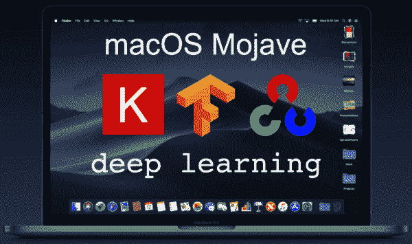
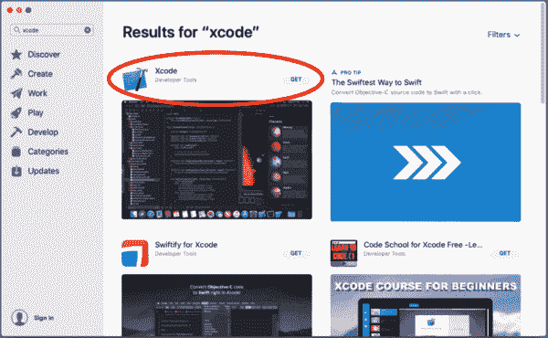
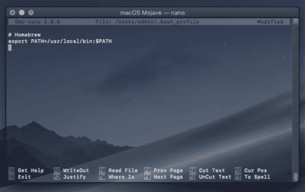
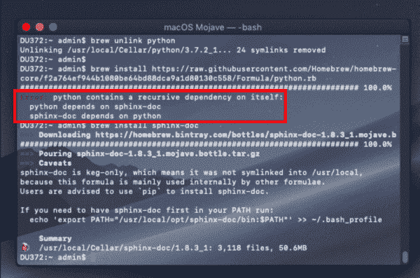
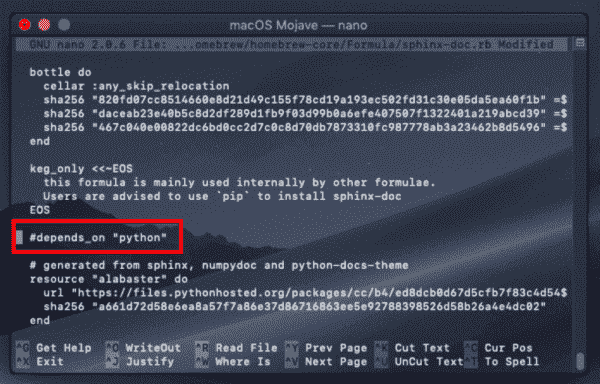
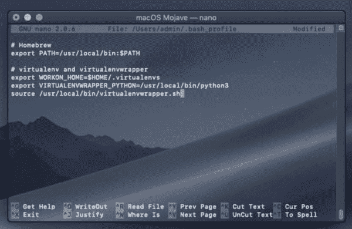
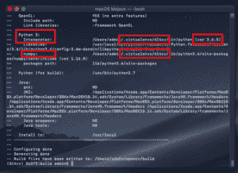
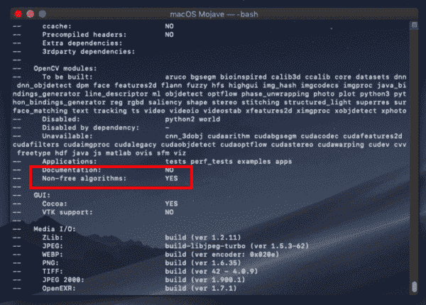
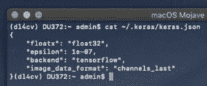

# macOS Mojave:安装 TensorFlow 和 Keras 进行深度学习

> 原文：<https://pyimagesearch.com/2019/01/30/macos-mojave-install-tensorflow-and-keras-for-deep-learning/>

[](https://pyimagesearch.com/wp-content/uploads/2019/01/macos_mojave_dl_install_header.png)

在本教程中，您将了解如何为深度学习配置 macOS Mojave。

在您完成本教程后，您的 macOS Mojave 系统将准备好(1)使用 Keras 和 TensorFlow 进行深度学习，以及(2)使用 Python 进行计算机视觉的 [*深度学习。*](https://pyimagesearch.com/deep-learning-computer-vision-python-book/)

自从 2018 年 9 月 Mojave OS 正式发布以来，关于配置 Mojave 的教程已经在我的博客上出现了很长时间。

这个操作系统从一开始就被问题所困扰，所以我决定推迟。实际上，我仍然在我的机器上运行 High Sierra，但是在整理了这个指南之后，我有信心向 PyImageSearch 的读者推荐 Mojave。

苹果已经修复了大部分的 bug，但是正如你将在本指南中看到的，Homebrew(一个非官方的 macOS 软件包管理器)并没有让一切变得特别容易。

如果你已经准备好全新安装 macOS Mojave，并准备好迎接今天的挑战，让我们开始为深度学习配置你的系统。

今天同时发布的还有我的 **[带*可选* GPU 支持](https://pyimagesearch.com/2019/01/30/ubuntu-18-04-install-tensorflow-and-keras-for-deep-learning/)的 Ubuntu 18.04 深度学习配置指南。**一定要去看看！

**要了解如何用 Python 配置 macOS 进行深度学习和计算机视觉，*继续阅读*。**

## macOS Mojave:安装 TensorFlow 和 Keras 进行深度学习

在本教程中，我们将回顾为深度学习配置 Mojave 的七个步骤。

在 ***步骤#3*** 中，我们将做一些自制公式功夫来安装 **Python 3.6** 。

你看，**家酿现在*默认*安装 Python 3.7。**

这对我们深度学习社区提出了挑战，因为 **Tensorflow 尚未正式支持 Python 3.7。**

TensorFlow 团队肯定在致力于 Python 3.7 支持——但如果你运行的是 macOS Mojave，你可能不想闲着，等到 Python 3.7 支持正式发布。

如果你遇到了这个难题，那么我的安装指南就是为你准备的。

我们开始吧！

### 步骤 1:安装和配置 Xcode

首先，你需要从苹果应用商店获得 Xcode 并安装它。别担心，它是 100%免费的。

[](https://pyimagesearch.com/wp-content/uploads/2019/01/macos_mojave_dl_install_xcodeappstore.png)

**Figure 1:** Download Xcode for macOS Mojave prior to setting up your system for deep learning.

从 App Store 下载并安装 Xcode 后，打开终端并执行以下命令*接受开发者许可*:

```
$ sudo xcodebuild -license

```

按下*“输入”*然后用*“空格”*键滚动到底部，然后输入*“同意”*。

下一步是安装苹果命令行工具:

```
$ sudo xcode-select --install

```

这将启动一个窗口，您需要按下*“安装*”。从那里，您将不得不接受另一个协议(这次是一个按钮)。最后，会出现一个下载进度窗口，您需要等待几分钟。

### 步骤 2:在 macOS Mojave 上安装自制软件

家酿(也称为 brew)，是 macOS 的软件包管理器。您的系统上可能已经安装了它，但是如果您没有，您将希望按照本节中的命令来安装它。

首先，我们将通过复制并粘贴**整个**命令到您的终端来安装 Homebrew:

```
$ /usr/bin/ruby -e "$(curl -fsSL https://raw.githubusercontent.com/Homebrew/install/master/install)"

```

接下来，我们将更新我们的包定义:

```
$ brew update

```

随后使用`nano`终端编辑器更新您的`~/.bash_profile`(任何其他编辑器也应该这样做):

```
$ nano ~/.bash_profile

```

将以下几行添加到文件中:

```
# Homebrew
export PATH=/usr/local/bin:$PATH

```

[](https://pyimagesearch.com/wp-content/uploads/2019/01/macos_mojave_dl_install_bashprofile_homebrew.jpg)

**Figure 2:** Editing the `~/.bash_profile` to ensure that Homebrew is set up with your `PATH`. We will use Homebrew to install some of the tools on macOS Mojave for deep learning.

保存并关闭，按*“ctrl+o”*(保存)，然后按*“回车”*保存文件名，最后按*“ctrl+x”*(退出)。

让我们重新加载我们的个人资料:

```
$ source ~/.bash_profile

```

现在 Brew 已经准备好了，让我们安装 Python 3.6。

### 步骤 3:在 macOS Mojave 上将 Python 3.7 降级到 Python 3.6

我对家酿啤酒又爱又恨。我喜欢它的便利性以及志愿者团队支持如此多软件的方式。他们做得非常好。他们总是在游戏中支持最新的软件。

Mojave 的问题是默认情况下 Homebrew 会安装 Python 3.7，但是 TensorFlow(目前)还不支持 3.7。

因此，我们需要做一些功夫来让 Python 3.6 安装在 Mojave 上。

如果你尝试直接安装 Python 3.6，你会遇到这个问题:

[](https://pyimagesearch.com/wp-content/uploads/2019/01/macos_mojave_dl_install_brew_sphinx-doc_dependsonpython.png)

**Figure 3:** The `sphinx-doc` + Python 3.7 circular dependency causes issues with installing Python 3.6 on macOS Mojave.

问题是`sphinx-doc`依赖 Python 3.7，Python 3.6.5 依赖`sphinx-doc`依赖 Python 3.7。

阅读这句话可能会让你头疼，但是我想你已经明白了我们有一个*循环依赖*的问题。

***注:**以下步骤对我有效，我在 Mojave 的两个新实例上测试了两次。如果你知道安装 Python 3.6 的改进方法，请在评论中告诉我和社区。*

让我们采取措施来解决循环依赖问题。

首先，安装 Python(这将安装 Python 3.7，我们稍后将降级它):

```
$ brew install python3

```

现在我们需要移除*循环依赖。*

让我们继续编辑`sphinx-doc`的自制公式，因为这就是问题所在:

```
$ nano /usr/local/Homebrew/Library/Taps/homebrew/homebrew-core/Formula/sphinx-doc.rb

```

现在向下滚动并删除 Python 依赖项，方法是在它前面放置一个`#`来注释掉它:

[](https://pyimagesearch.com/wp-content/uploads/2019/01/macos_mojave_dl_install_brewformulae_sphynx-doc_removepythondependency.png)

**Figure 4:** Removing the `sphinx-doc` dependency on Python 3.7\. This will ultimately allow us to install Python 3.6 on macOS Mojave for deep learning.

一旦添加了`#`来注释掉这一行，继续保存+退出。

从那里，只需重新安装 sphinx-doc:

```
$ brew reinstall sphinx-doc

```

现在是时候**安装 Python 3.6.5 了。**

第一步是解除 Python 的链接:

```
$ brew unlink python

```

从那里我们可以安装 Python 3.6:

```
$ brew install https://raw.githubusercontent.com/Homebrew/homebrew-core/f2a764ef944b1080be64bd88dca9a1d80130c558/Formula/python.rb

```

在这里，您应该通过查询版本来检查正在使用的 Python:

```
$ which python3
/usr/local/bin/python3
$ python3 --version
Python 3.6.5

```

检查第一个命令的输出，确保看到 `/usr/`和`bin/python3`之间的`local/` *。*

正如我们的输出所示，我们现在使用的是 **Python 3.6.5！**

### 步骤 4:在 macOS Mojave 上安装用于 OpenCV 的 brew 包

需要安装以下工具来进行编译、映像 I/O 和优化:

```
$ brew install cmake pkg-config wget
$ brew install jpeg libpng libtiff openexr
$ brew install eigen tbb hdf5

```

安装完这些包之后，我们就可以创建 Python 虚拟环境了。

### 步骤 5:在 macOS Mojave 中创建您的 Python 虚拟环境

正如我在本网站的[其他安装指南中所述，虚拟环境绝对是使用 Python 时的必由之路，使您能够在沙盒环境中适应不同的版本。](https://pyimagesearch.com/opencv-tutorials-resources-guides/)

如果您搞乱了一个环境，您可以简单地删除该环境并重新构建它，而不会影响其他 Python 虚拟环境。

让我们通过`pip`安装[虚拟 T2【和](https://virtualenv.pypa.io/en/latest/)[虚拟包装器](https://virtualenvwrapper.readthedocs.org/en/latest/):

```
$ pip3 install virtualenv virtualenvwrapper

```

从那里，我们将再次更新我们的`~/.bash_profile`:

```
$ nano ~/.bash_profile

```

我们将在文件中添加以下几行:

```
# virtualenv and virtualenvwrapper
export WORKON_HOME=$HOME/.virtualenvs
export VIRTUALENVWRAPPER_PYTHON=/usr/local/bin/python3
source /usr/local/bin/virtualenvwrapper.sh

```

[](https://pyimagesearch.com/wp-content/uploads/2019/01/macos_mojave_dl_install_bashprofile_virtualenvwrapper.jpg)

**Figure 5:** Editing the `~/.bash_profile` again, this time to accommodate `virtualenv` and `virtualenvwrapper` tools for Python virtual environments.

然后重新加载配置文件:

```
$ source ~/.bash_profile

```

检查终端输出中的任何错误。如果`virtualenvwrapper`和 Python 3.6 配合得很好，你应该准备好创建一个新的虚拟环境。

#### 在 macOS Mojave 上创建`dl4cv`虚拟环境

`dl4cv`环境将容纳 TensorFlow、Keras、OpenCV 和所有其他与我的深度学习书相关的 Python 包。当然，您可以随意命名这个环境，但是从现在开始，我们将把它称为`dl4cv`。

要使用 **Python 3** 创建`dl4cv`环境，只需输入以下命令:

```
$ mkvirtualenv dl4cv -p python3

```

在 Python 3 和支持脚本被安装到新环境中之后，您实际上应该已经在环境的中*了。这在 bash 提示符的开头用`(dl4cv)`表示，如下图所示:*

[](https://pyimagesearch.com/wp-content/uploads/2019/01/macos_mojave_dl_install_workon_dl4cv.png)

**Figure 6:** The `workon` command allows us to activate a Python virtual environment of our choice. In this case, I’m activating the `dl4cv` environment on macOS Mojave for deep learning.

如果您没有看到修改后的 bash 提示符，那么您可以随时输入以下命令来随时进入环境:

```
$ workon dl4cv

```

为了安全起见，让我们检查一下我们的环境使用的是哪种 Python，并再次查询版本:

```
$ workon dl4cv
$ which python
/Users/admin/.virtualenvs/dl4cv/bin/python
$ python --version
Python 3.6.5

```

请注意，python 可执行文件位于我们的虚拟环境`dl4cv`中的`~/.virtualenvs/dl4cv/bin/`。另外**在这里三重检查**你使用的是 Python 3.6.5。

当您确定使用 Python 3.6.5 正确配置了虚拟环境后，就可以安全地继续将软件安装到环境中了。

让我们继续**步骤#6** 。

### 步骤 6:在 macOS Mojave 上安装 OpenCV

为了与我的深度学习书籍兼容，我们有**两种安装 OpenCV** 的选项。

第一种方法( ***步骤#6a*** )是通过使用 Python 包索引中可用的预编译二进制文件(pip 从中提取)。缺点是[的维护者](https://github.com/skvark)选择了[不把专利算法编译成二进制](https://github.com/skvark/opencv-python/issues/126)。

第二个选项( ***步骤#6b*** )是从源码编译 OpenCV。这种方法允许完全控制编译，包括优化和专利算法(“非免费”)。

如果你是初学者，受时间限制，或者如果你知道你不需要专利算法 *(DL4CV 不需要增加的功能)*，我建议你选择第一个选项。第一个选项只需要 5 分钟。

高级用户应该选择第二个选项，同时留出大约 40 到 60 分钟的编译时间。

#### 步骤 6a:用 pip 安装 OpenCV

确保您在`dl4cv`环境中工作，然后输入带有包名的`pip install`命令，如下所示:

```
$ workon dl4cv
$ pip install opencv-contrib-python

```

***注意:*** *如果你需要一个特定的版本你可以使用下面的语法:`pip install opencv-contrib-python==3.4.4`。*

恭喜你。您现在已经安装了 OpenCV。

从这里你可以跳到第 7 步的 ***。***

#### 步骤 6b:编译并安装 OpenCV

如果您执行了 ***步骤#6a*** ，您应该跳过此选项，转到 ***步骤#7*** 。

让我们从源代码编译 OpenCV。

OpenCV 需要的唯一 Python 依赖项是 NumPy，我们可以通过以下方式安装它:

```
$ workon dl4cv
$ pip install numpy

```

首先，让我们下载源代码:

```
$ cd ~
$ wget -O opencv.zip https://github.com/opencv/opencv/archive/3.4.4.zip
$ wget -O opencv_contrib.zip https://github.com/opencv/opencv_contrib/archive/3.4.4.zip

```

***注:*** *如果你想使用不同版本的 OpenCV，你可以用`4.0.0.zip`或更高版本替换`3.4.4.zip`。只要确保**`opencv`和`opencv_contrib`下载都是针对*** *****相同的*** *版本！***

 **接下来打开归档文件:

```
$ unzip opencv.zip
$ unzip opencv_contrib.zip

```

并重命名目录:

```
$ mv opencv-3.4.4 opencv
$ mv opencv_contrib-3.4.4 opencv_contrib

```

***注意:*** *将命令中的文件夹名替换为您的 OpenCV 版本对应的文件夹名。*

为了准备我们的编译过程，我们使用 CMake。

复制 CMake 命令 ***与此处出现的*** 是非常重要的，注意复制并越过整个**命令；我建议点击下面工具栏中的*<>*按钮展开整个命令:**

```
$ cd ~/opencv
$ mkdir build
$ cd build
$ cmake -D CMAKE_BUILD_TYPE=RELEASE \
    -D CMAKE_INSTALL_PREFIX=/usr/local \
    -D OPENCV_EXTRA_MODULES_PATH=~/opencv_contrib/modules \
    -D PYTHON3_LIBRARY=`python -c 'import subprocess ; import sys ; s = subprocess.check_output("python-config --configdir", shell=True).decode("utf-8").strip() ; (M, m) = sys.version_info[:2] ; print("{}/libpython{}.{}.dylib".format(s, M, m))'` \
    -D PYTHON3_INCLUDE_DIR=`python -c 'import distutils.sysconfig as s; print(s.get_python_inc())'` \
    -D PYTHON3_EXECUTABLE=$VIRTUAL_ENV/bin/python \
    -D BUILD_opencv_python2=OFF \
    -D BUILD_opencv_python3=ON \
    -D INSTALL_PYTHON_EXAMPLES=ON \
    -D INSTALL_C_EXAMPLES=OFF \
    -D OPENCV_ENABLE_NONFREE=ON \
    -D BUILD_EXAMPLES=ON ..

```

***注意:**对于上面的 CMake 命令，我花了相当多的时间来创建、测试和重构它。我相信，如果你完全按照它显示的那样使用它，它会节省你的时间和挫折。**确保点击上面代码块工具栏中的< >按钮，展开代码块。**这将使你能够复制并粘贴整个**命令。*** 

运行 CMake 需要 2-5 分钟。

您应该始终检查 CMake 输出中的错误，并确保您的编译设置符合预期。

您的输出应该类似于下面的截图，确保使用了正确的 Python 3 二进制/库和 NumPy 版本，并且“非自由算法”处于打开状态:

[](https://pyimagesearch.com/wp-content/uploads/2019/01/macos_mojave_dl_install_opencv_cmake.png)

**Figure 7:** Inspecting OpenCV CMake output prior to installing deep learning frameworks on macOS.

[](https://pyimagesearch.com/wp-content/uploads/2019/01/macos_mojave_dl_install_opencv_cmake_nonfree.png)

**Figure 8:** Ensuring that the OpenCV patented (“non-free”) algorithms are installed.

如果您的 OpenCV 的 CMake 输出与我的匹配，那么我们就可以实际编译 OpenCV 了:

```
$ make -j4

```

***注意:**大多数 macOS 机器至少会有 4 个核心/CPU。您可以(也应该)根据您系统的处理规范用一个数字来编辑上面的标志，以加快编译过程。*

[](https://pyimagesearch.com/wp-content/uploads/2019/01/macos_mojave_dl_install_opencv_make.jpg)

**Figure 9:** OpenCV compilation is complete on macOS Mojave.

从那里您可以安装 OpenCV:

```
$ sudo make install

```

安装后，有必要将`cv2.so`文件符号链接到`dl4cv`虚拟环境中。

我们需要做的是创建一个从 OpenCV 安装位置到虚拟环境本身的链接。这就是所谓的符号链接。

现在让我们继续处理这个问题，首先获取`.so`文件的名称:

```
$ cd /usr/local/python/cv2/python-3.6
$ ls
cv2.cpython-36m-darwin.so

```

现在让我们重命名`.so`文件:

```
$ sudo mv cv2.cpython-36m-darwin.so cv2.opencv3.4.4.so
$ cd ~/.virtualenvs/dl4cv/lib/python3.6/site-packages
$ ln -s /usr/local/python/cv2/python-3.6/cv2.opencv3.4.4.so cv2.so

```

***注意:**如果您的系统中安装了多个 OpenCV 版本，您可以使用相同的命名约定和符号链接方法。*

最后，我们可以测试安装:

```
$ cd ~
$ python
>>> import cv2
>>> cv2.__version__
'3.4.4'

```

如果您的输出正确地显示了您安装的 OpenCV 版本，那么您就可以继续进行**步骤#7** 了，我们将在那里安装 Keras 深度学习库。

### 步骤 7:在 macOS Mojave 上安装 TensorFlow 和 Keras

在开始这一步之前，确保您已经激活了`dl4cv`虚拟环境。如果您不在该环境中，只需执行:

```
$ workon dl4cv

```

然后，使用`pip`，安装所需的 Python 计算机视觉、图像处理和机器学习库:

```
$ pip install scipy pillow
$ pip install imutils h5py requests progressbar2
$ pip install scikit-learn scikit-image

```

接下来，安装 matplotlib 并**更新渲染后端**:

```
$ pip install matplotlib
$ mkdir ~/.matplotlib
$ touch ~/.matplotlib/matplotlibrc
$ echo "backend: TkAgg" >> ~/.matplotlib/matplotlibrc

```

如果你曾经遇到过绘图不出现的问题，请务必阅读关于在 OSX 上使用 Matplotlib 的指南。

然后，安装[张量流](https://www.tensorflow.org/):

```
$ pip install tensorflow

```

其次是 [Keras](https://keras.io/) :

```
$ pip install keras

```

要验证 Keras 是否正确安装，我们可以导入它并检查错误:

```
$ workon dl4cv
$ python
>>> import keras
Using TensorFlow backend.
>>>

```

Keras 应该被正确导入，同时声明 TensorFlow 被用作后端。

此时，您可以熟悉一下`~/.keras/keras.json`文件:

[](https://pyimagesearch.com/wp-content/uploads/2019/01/macos_mojave_dl_install_keras_config.jpg)

**Figure 10:** The Keras configuration file allows you to set the backend as well as other settings.

确保`image_data_format`设置为`channels_last`并且`backend`设置为`tensorflow`。

### 预配置环境

***恭喜恭喜！*** 你已经成功配置了你的 macOS Mojave 台式机/笔记本电脑进行深度学习！

你现在已经准备好了。如果你在安装过程中没有喝过茶或咖啡，现在是时候了。也是时候找个舒服的地方读读 [*用 Python*](https://pyimagesearch.com/deep-learning-computer-vision-python-book/) 进行计算机视觉的深度学习了。

**您在配置 Mojave 深度学习系统时遇到过任何问题吗？**

如果您在这个过程中遇到了困难，我鼓励您重新阅读说明并尝试调试。如果你还在挣扎，你可以在 DL4CV 伴侣网站问题跟踪者(在你的书的前面有一个注册链接)或者通过[联系我](https://pyimagesearch.com/contact/)来寻求帮助。

我还想借此机会向您介绍一下您的图书附带的预配置实例:

*   [DL4CV VirtualBox VM](https://pyimagesearch.com/2017/09/22/deep-learning-python-ubuntu-virtual-machine/) 是预先配置好的，随时可以与 Ubuntu 18.04 和所有其他必要的深度学习包/库一起使用。这个虚拟机能够在一个叫做 VirtualBox 的工具中，在你的 macOS 操作系统之上独立运行。它将帮助你通过*初学者*和*实践者*包中几乎所有的实验。对于 *ImageNet* 捆绑包，GPU 是必需的，而这个虚拟机不支持 GPU。
*   我的用于 AWS 云的 [DL4CV 亚马逊机器映像](https://pyimagesearch.com/2017/09/20/pre-configured-amazon-aws-deep-learning-ami-with-python/)对互联网免费开放——不需要购买(当然，除了 AWS 收费)。在云中开始使用 GPU 只需要大约 4-6 分钟。以不到一杯咖啡的价格，您可以使用一个 GPU 实例一两个小时，这刚好够完成 DL4CV 中一些(肯定不是全部)更高级的课程。预先配置了以下环境:`dl4cv`、`mxnet`、`tfod_api`、`mask_rcnn`、`retinanet`。

Azure 用户应该考虑 Azure DSVM。你可以点击阅读[我对微软 Azure DSVM 的评论。2017 年 DL4CV 第一个版本中的所有代码都是使用微软的 DSVM 进行测试的。DSVM 需要额外的配置来支持 DL4CV 的*附加包*章节，但是除此之外，你不会发现自己安装了很多工具。如果 Azure 是你首选的云提供商，我鼓励你继续使用 Azure，利用 DSVM 所提供的优势。](https://pyimagesearch.com/2018/03/21/my-review-of-microsofts-deep-learning-virtual-machine/)

## 摘要

在今天的帖子中，我们为计算机视觉和深度学习配置了我们的 macOS Mojave box。软件的主要部分包括 Python 3.6、OpenCV、TensorFlow 和 Keras，并附有依赖项和安装/编译工具。

TensorFlow 尚未正式支持 Python 3.7，所以你应该不惜一切代价避免使用它(暂时)。

相反，我们学会了如何在 macOS Mojave 上**从 Python 3.7 降级到 Python 3.6，并将所有软件放入一个名为`dl4cv`的 **Python 3.6** 虚拟环境中。**

如果你想很好地利用你新配置的 macOS 深度学习环境，我强烈建议你看看我的新书， [*用 Python 进行计算机视觉的深度学习*](https://pyimagesearch.com/deep-learning-computer-vision-python-book/) 。

不管你是深度学习的新手还是已经是经验丰富的实践者，这本书都有内容可以帮助你掌握深度学习——[看这里](https://pyimagesearch.com/deep-learning-computer-vision-python-book/)。

**为了在 PyImageSearch 上发布未来的博客文章时得到通知(并获取我的 17 页深度学习和计算机视觉资源指南 PDF)，只需*在下面的表格中输入您的电子邮件地址！*******