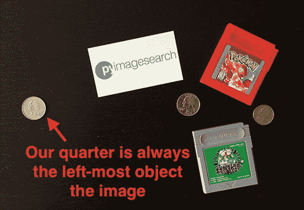
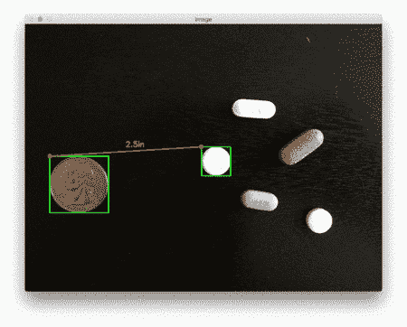
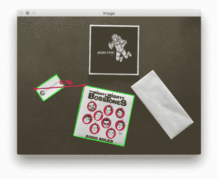

# 用 OpenCV 测量图像中物体间的距离

> 原文：<https://pyimagesearch.com/2016/04/04/measuring-distance-between-objects-in-an-image-with-opencv/>


We have now reached the final installment in our three part series on *measuring the size of objects in an image* and *computing the distance between objects*.

两周前，我们通过学习[如何使用 Python 和 OpenCV](https://pyimagesearch.com/2016/03/21/ordering-coordinates-clockwise-with-python-and-opencv/) 以顺时针方式(正确地)排序坐标，开始了这一轮教程。然后，上周，我们讨论了[如何使用参照物测量图像](https://pyimagesearch.com/2016/03/28/measuring-size-of-objects-in-an-image-with-opencv/)中物体的*大小*。

这个参考对象应该有两个重要的属性，包括:

1.  我们知道*尺寸*(以英寸、毫米等为单位。)的对象。
2.  它可以在我们的图像中*容易识别*(基于*位置*或*外观*)。

给定这样一个参考物体，我们可以用它来计算我们图像中物体的大小。

今天，我们将结合本系列之前博文中使用的技术，使用这些方法来计算物体之间的 ***距离。***

***继续阅读了解……***

## 用 OpenCV 测量图像中物体间的距离

计算物体之间的距离*与计算图像中物体的*大小*非常相似——都是从参考物体开始的。*

正如我们在[之前的博客文章](https://pyimagesearch.com/2016/03/28/measuring-size-of-objects-in-an-image-with-opencv/)中所详述的，我们的引用对象应该有两个重要的属性:

*   **性质#1:** 我们知道物体的尺寸以某种可测量的单位(如英寸、毫米等)表示。).
*   **属性#2:** 我们可以很容易地找到并识别我们图像中的参照物。

正如我们上周所做的，我们将使用一个美国硬币作为我们的参考对象，其宽度为 0.955 英寸(满足属性#1)。

我们还将确保我们的四分之一始终是图像中最左边的对象，从而满足属性#2:



**Figure 1:** We’ll identify our reference object based on location, hence we’ll *always* ensure our quarter is the left-most object in the image.

我们在这张图片中的目标是(1)找到四分之一，然后(2)使用四分之一的尺寸来测量四分之一和所有其他物体之间的距离。

### 定义我们的参照物并计算距离

让我们开始这个例子。打开一个新文件，将其命名为`distance_between.py`，并插入以下代码:

```
# import the necessary packages
from scipy.spatial import distance as dist
from imutils import perspective
from imutils import contours
import numpy as np
import argparse
import imutils
import cv2

def midpoint(ptA, ptB):
	return ((ptA[0] + ptB[0]) * 0.5, (ptA[1] + ptB[1]) * 0.5)

# construct the argument parse and parse the arguments
ap = argparse.ArgumentParser()
ap.add_argument("-i", "--image", required=True,
	help="path to the input image")
ap.add_argument("-w", "--width", type=float, required=True,
	help="width of the left-most object in the image (in inches)")
args = vars(ap.parse_args())

```

我们这里的代码与上周几乎相同。我们从在第 2-8 行导入我们需要的 Python 包开始。如果你还没有安装 [imutils 包](https://github.com/jrosebr1/imutils)，现在停止安装它:

```
$ pip install imutils

```

否则，您应该升级到最新版本(`0.3.6`在撰写本文时)，这样您就有了更新的[订单积分函数](https://pyimagesearch.com/2016/03/21/ordering-coordinates-clockwise-with-python-and-opencv/):

```
$ pip install --upgrade imutils

```

**第 14-19 行**解析我们的命令行参数。这里我们需要两个开关:`--image`，它是包含我们想要测量的对象的输入图像的路径，以及`--width`，我们的参考对象的宽度(以英寸为单位)。

接下来，我们需要预处理我们的图像:

```
# load the image, convert it to grayscale, and blur it slightly
image = cv2.imread(args["image"])
gray = cv2.cvtColor(image, cv2.COLOR_BGR2GRAY)
gray = cv2.GaussianBlur(gray, (7, 7), 0)

# perform edge detection, then perform a dilation + erosion to
# close gaps in between object edges
edged = cv2.Canny(gray, 50, 100)
edged = cv2.dilate(edged, None, iterations=1)
edged = cv2.erode(edged, None, iterations=1)

# find contours in the edge map
cnts = cv2.findContours(edged.copy(), cv2.RETR_EXTERNAL,
	cv2.CHAIN_APPROX_SIMPLE)
cnts = imutils.grab_contours(cnts)

# sort the contours from left-to-right and, then initialize the
# distance colors and reference object
(cnts, _) = contours.sort_contours(cnts)
colors = ((0, 0, 255), (240, 0, 159), (0, 165, 255), (255, 255, 0),
	(255, 0, 255))
refObj = None

```

**第 22-24 行**从磁盘加载我们的图像，将其转换为灰度，然后使用具有 *7 x 7* 内核的高斯滤镜将其模糊。

一旦我们的图像变得模糊，我们应用 Canny 边缘检测器来检测图像中的边缘——然后执行膨胀+腐蚀来闭合边缘图中的任何间隙(**第 28-30 行**)。

调用`cv2.findContours`检测边缘图中物体的轮廓(**第 33-35 行**)，而**第 39 行**从左到右对我们的轮廓进行排序。由于我们知道我们的 US quarter(即*参考对象*)将始终是图像中最左边的对象，从左到右对轮廓进行排序确保了对应于参考对象的轮廓将始终是`cnts`列表中第*个*条目。

然后我们初始化一个用于绘制距离的列表`colors`以及`refObj`变量，它将存储我们的*边界框*、*质心*和*参考对象的每公制像素*值。

```
# loop over the contours individually
for c in cnts:
	# if the contour is not sufficiently large, ignore it
	if cv2.contourArea(c) < 100:
		continue

	# compute the rotated bounding box of the contour
	box = cv2.minAreaRect(c)
	box = cv2.cv.BoxPoints(box) if imutils.is_cv2() else cv2.boxPoints(box)
	box = np.array(box, dtype="int")

	# order the points in the contour such that they appear
	# in top-left, top-right, bottom-right, and bottom-left
	# order, then draw the outline of the rotated bounding
	# box
	box = perspective.order_points(box)

	# compute the center of the bounding box
	cX = np.average(box[:, 0])
	cY = np.average(box[:, 1])

```

在第 45 行的**处，我们开始遍历`cnts`列表中的每个轮廓。如果轮廓不够大(**第 47 和 48 行**，我们忽略它。**

否则，**第 51-53 行**计算当前对象的旋转边界框(OpenCV 2.4 使用`cv2.cv.BoxPoints`，OpenCV 3 使用`cv2.boxPoints`)。

对第 59 行**上的`order_points`的调用重新排列了边界框 *(x，y)*——以左上、右上、右下和左下的顺序排列坐标，正如我们将看到的，这在我们计算对象角之间的距离时很重要。**

**第 62 行和第 63 行**通过在 *x* 和 *y* 两个方向上取边界框的平均值，计算旋转后的边界框的中心 *(x，y)* 坐标。

下一步是校准我们的`refObj`:

```
	# if this is the first contour we are examining (i.e.,
	# the left-most contour), we presume this is the
	# reference object
	if refObj is None:
		# unpack the ordered bounding box, then compute the
		# midpoint between the top-left and top-right points,
		# followed by the midpoint between the top-right and
		# bottom-right
		(tl, tr, br, bl) = box
		(tlblX, tlblY) = midpoint(tl, bl)
		(trbrX, trbrY) = midpoint(tr, br)

		# compute the Euclidean distance between the midpoints,
		# then construct the reference object
		D = dist.euclidean((tlblX, tlblY), (trbrX, trbrY))
		refObj = (box, (cX, cY), D / args["width"])
		continue

```

如果我们的`refObj`是`None` ( **第 68 行**)，那么我们需要初始化它。

我们首先解包(有序的)旋转边界框坐标，并分别计算左上和左下之间的中点以及右上和右下的点(**行 73-75** )。

从那里，我们计算点之间的欧几里德距离，给出我们的“每度量像素”，允许我们确定多少像素适合`--width`英寸。

***注:**参见[上周的帖子](https://pyimagesearch.com/2016/03/28/measuring-size-of-objects-in-an-image-with-opencv/)中关于“像素/度量”变量的更详细的讨论。*

最后，我们将`refObj`实例化为一个三元组，包括:

1.  对应于旋转的边界框参考对象的排序坐标。
2.  参考对象的质心。
3.  我们将用来确定物体之间距离的每米像素比率。

我们的下一个代码块处理围绕我们的*参考对象*和我们当前正在检查的*对象*绘制轮廓，然后构造`refCoords`和`objCoords`，使得(1)边界框坐标和(2)质心的 *(x，y)* 坐标包含在相同的数组中:

```
	# draw the contours on the image
	orig = image.copy()
	cv2.drawContours(orig, [box.astype("int")], -1, (0, 255, 0), 2)
	cv2.drawContours(orig, [refObj[0].astype("int")], -1, (0, 255, 0), 2)

	# stack the reference coordinates and the object coordinates
	# to include the object center
	refCoords = np.vstack([refObj[0], refObj[1]])
	objCoords = np.vstack([box, (cX, cY)])

```

我们现在准备计算图像中各个角和物体质心之间的距离:

```
	# loop over the original points
	for ((xA, yA), (xB, yB), color) in zip(refCoords, objCoords, colors):
		# draw circles corresponding to the current points and
		# connect them with a line
		cv2.circle(orig, (int(xA), int(yA)), 5, color, -1)
		cv2.circle(orig, (int(xB), int(yB)), 5, color, -1)
		cv2.line(orig, (int(xA), int(yA)), (int(xB), int(yB)),
			color, 2)

		# compute the Euclidean distance between the coordinates,
		# and then convert the distance in pixels to distance in
		# units
		D = dist.euclidean((xA, yA), (xB, yB)) / refObj[2]
		(mX, mY) = midpoint((xA, yA), (xB, yB))
		cv2.putText(orig, "{:.1f}in".format(D), (int(mX), int(mY - 10)),
			cv2.FONT_HERSHEY_SIMPLEX, 0.55, color, 2)

		# show the output image
		cv2.imshow("Image", orig)
		cv2.waitKey(0)

```

在第 94 行的**上，我们开始循环成对的 *(x，y)*-坐标，这些坐标对应于我们的*参考对象*和*感兴趣对象*。**

然后我们画一个圆代表 *(x，y)*-我们正在计算的当前点之间的距离的坐标，并画一条线连接这些点(**线 97-110** )。

从那里，**行 105** 计算参考位置和目标位置之间的欧几里德距离，接着将该距离除以“每度量像素”，给出两个目标之间以英寸为单位的最终*距离*。然后计算出的距离被绘制在我们的图像上(**第 106-108 行**)。

***注:**对左上、右上、右下、左下和质心坐标进行距离计算，总共进行*五次*距离比较*。

最后，**行 111 和 112** 将输出图像显示到我们的屏幕上。

### 距离测量结果

为了尝试一下我们的距离测量脚本，请使用本教程底部的“下载”表单下载源代码和相应的图片。解压缩`.zip`文件，将目录切换到`distance_between.py`脚本，然后执行以下命令:

```
$ python distance_between.py --image images/example_01.png --width 0.955

```

下面是演示我们脚本输出的 GIF 动画:


**Figure 2:** Computing the distance between objects in an image with OpenCV.

在每种情况下，我们的脚本都匹配左上角的*(红色)*、右上角的*(紫色)*、右下角的*(橙色)*、左下角的*(蓝绿色)*和质心*(粉色)*坐标，然后计算参考对象和当前对象之间的距离(以英寸为单位)。

请注意图像中的两个四分之一是如何完美地相互平行的，这意味着所有五个控制点之间的距离是 6.1 英寸。

下面是第二个例子，这次计算我们的参考对象和一组药丸之间的距离:

```
$ python distance_between.py --image images/example_02.png --width 0.955

```



**Figure 3:** Computing the distance between pills using OpenCV.

这个例子可以用作药丸分类机器人的输入，该机器人自动取出一组药丸，并根据它们的大小和与药丸容器的距离来组织它们。

我们的最后一个例子计算了我们的参考对象(一张 3.5 英寸 x 2 英寸的名片)和一套 7 英寸的黑胶唱片以及一个信封之间的距离:

```
$ python distance_between.py --image images/example_03.png --width 3.5

```



**Figure 4:** A final example of computing the distance between objects using OpenCV and computer vision.

正如你所看到的，在每一种情况下，我们都成功地计算出了图像中物体之间的距离(以实际的、可测量的单位)。

## 摘要

在测量物体尺寸系列的第三部分也是最后一部分中，我们学习了如何在一幅图像中拍摄两个不同的物体，并以*实际可测量单位*(如英寸、毫米等)计算它们之间的距离。).

正如我们在上周的帖子中发现的那样，在我们能够(1)计算一个对象的大小或(2)测量两个对象之间的距离之前，我们首先需要计算“每度量像素”比率，用于确定有多少像素“适合”给定的测量单位。

一旦我们有了这个比率，计算物体之间的距离就变得非常简单了。

无论如何，我希望你喜欢这一系列的博文！如果你对未来的系列有任何建议，请在[给我留言](https://pyimagesearch.com/contact/)上留下评论。

**在您离开之前，*请务必在下表中输入您的电子邮件地址，注册订阅 PyImageSearch 时事通讯！【T2***