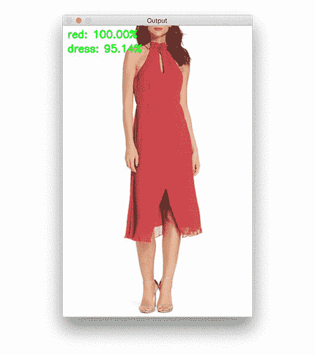
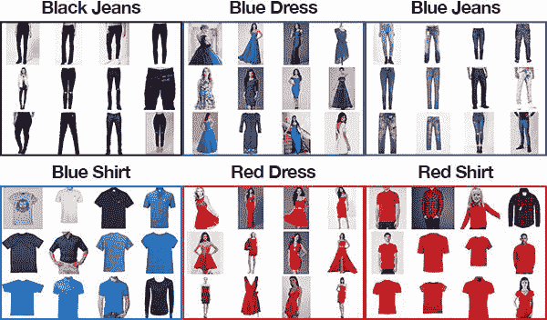
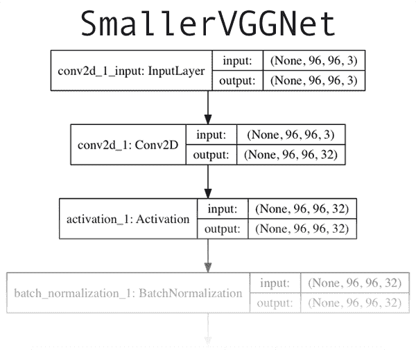
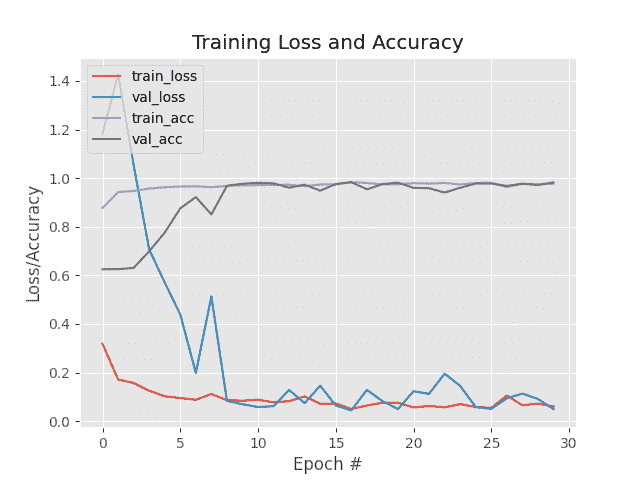
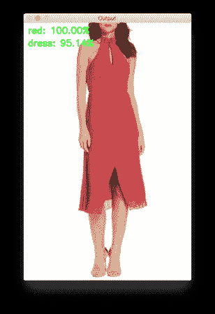
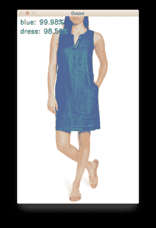
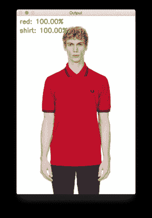
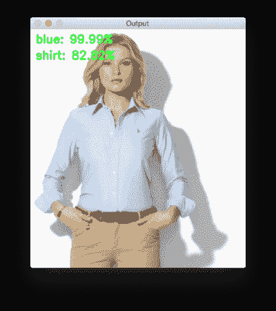
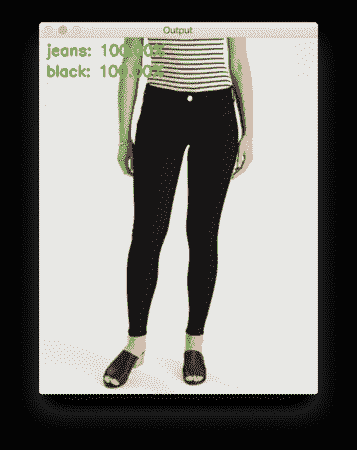

# 基于 Keras 的多标签分类

> 原文：<https://pyimagesearch.com/2018/05/07/multi-label-classification-with-keras/>



今天这篇关于 Keras 多标签分类的博客文章是从上周我收到的一封电子邮件中得到的启发，这封邮件来自瑞士的 PyImageSearch 阅读器。

Switaj 写道:

> 嗨，Adrian，感谢你的 PyImageSearch 博客和每周分享你的知识。
> 
> 我正在建立一个图像时尚搜索引擎，需要帮助。
> 
> 使用我的应用程序，用户将上传他们喜欢的衣服的照片(例如。衬衫，连衣裙，裤子，鞋子)，我的系统将返回类似的项目，并包括他们在线购买衣服的链接。
> 
> 问题是我需要训练一个分类器来将这些项目分成不同的类别:
> 
> 1.  ***服装类型:**衬衫、连衣裙、裤子、鞋子等。*
> 2.  ***颜色:**红色、蓝色、绿色、黑色等。*
> 3.  ***质地/外观:**棉、毛、丝、花呢等。*
> 
> 我已经为这三个类别中的每一个训练了三个独立的 CNN，它们工作得非常好。
> 
> 有没有办法把三个 CNN 合并成一个网络？或者至少训练单个网络来完成所有三个分类任务？
> 
> 我不想在一系列 if/else 代码中单独应用它们，这些代码根据先前分类的输出使用不同的网络。
> 
> 谢谢你的帮助。

Switaj 提出了一个很好的问题:

Keras 深度神经网络有可能返回多个预测吗？

如果是，是如何做到的？

**要了解如何使用 Keras 执行多标签分类，*继续阅读。***

## 基于 Keras 的多标签分类

***2020-06-12 更新:**此博文现已兼容 TensorFlow 2+!*

今天这篇关于多标签分类的博文分为四个部分。

在第一部分，我将讨论我们的多标签分类数据集(以及如何快速构建自己的数据集)。

从那里，我们将简要讨论`SmallerVGGNet`，我们将实现和用于多标签分类的 Keras 神经网络架构。

然后，我们将使用我们的多标签分类数据集来训练我们的`SmallerVGGNet`实现。

最后，我们将通过在示例图像上测试我们的网络来结束今天的博客文章，并讨论何时多标签分类是合适的，包括一些需要注意的警告。

### 我们的多标签分类数据集

[](https://pyimagesearch.com/wp-content/uploads/2018/04/keras_multi_label_dataset.jpg)

**Figure 1:** A montage of a multi-class deep learning dataset. We’ll be using Keras to train a multi-label classifier to predict both the *color* and the *type* of clothing.

我们将在今天的 Keras 多标签分类教程中使用的数据集旨在模拟 Switaj 在这篇文章顶部提出的问题(尽管为了这篇博客文章的缘故做了一些简化)。

我们的数据集由跨越**六个类别**的**2167**幅图像组成，包括:

*   黑色牛仔裤(344 张图片)
*   蓝色连衣裙(386 张图片)
*   蓝色牛仔裤(356 张图片)
*   蓝色衬衫(369 张图片)
*   红色连衣裙(380 张图片)
*   红色衬衫(332 张图片)

**我们卷积神经网络的目标将是预测*颜色*和*服装*类型。**

我按照我之前的教程 [*如何(快速)建立深度学习图像数据集*](https://pyimagesearch.com/2018/04/09/how-to-quickly-build-a-deep-learning-image-dataset/) 创建了这个数据集。

下载图像并手动删除六个类别中每个类别的不相关图像的整个过程大约需要 30 分钟。

当试图建立自己的深度学习图像数据集时，请确保遵循上面链接的教程——它将为你建立自己的数据集提供一个巨大的*跳跃。*

### 配置您的开发环境

要针对本教程配置您的系统，我建议您遵循以下任一教程:

*   [*如何在 Ubuntu 上安装 tensor flow 2.0*](https://pyimagesearch.com/2019/12/09/how-to-install-tensorflow-2-0-on-ubuntu/)
*   [*如何在 macOS 上安装 tensor flow 2.0*](https://pyimagesearch.com/2019/12/09/how-to-install-tensorflow-2-0-on-macos/)

这两个教程都将帮助您在一个方便的 Python 虚拟环境中，用这篇博文所需的所有软件来配置您的系统。

请注意 [PyImageSearch 不推荐也不支持 CV/DL 项目](https://pyimagesearch.com/faqs/single-faq/can-you-help-me-do-___-on-windows/)的窗口。

### 多标签分类项目结构

继续访问这篇博客文章的 ***【下载】*** 部分，获取代码和文件。解压缩 zip 文件后，您将看到以下目录结构:

```
├── classify.py
├── dataset
│   ├── black_jeans [344 entries
│   ├── blue_dress [386 entries]
│   ├── blue_jeans [356 entries]
│   ├── blue_shirt [369 entries]
│   ├── red_dress [380 entries]
│   └── red_shirt [332 entries]
├── examples
│   ├── example_01.jpg
│   ├── example_02.jpg
│   ├── example_03.jpg
│   ├── example_04.jpg
│   ├── example_05.jpg
│   ├── example_06.jpg
│   └── example_07.jpg
├── fashion.model
├── mlb.pickle
├── plot.png
├── pyimagesearch
│   ├── __init__.py
│   └── smallervggnet.py
├── search_bing_api.py
└── train.py

```

在压缩包的根目录下，你会看到 **6 个文件**和 **3 个目录。**

我们正在处理的重要文件(按照本文中出现的大致顺序)包括:

1.  `search_bing_api.py`:这个脚本使我们能够[快速构建我们的深度学习图像数据集](https://pyimagesearch.com/2018/04/09/how-to-quickly-build-a-deep-learning-image-dataset/)。您*不需要运行这个脚本*，因为图像数据集已经包含在 zip 存档中。为了完整起见，我只是包含了这个脚本。
2.  `train.py`:一旦我们获得了数据，我们将使用`train.py`脚本来训练我们的分类器。
3.  `fashion.model`:我们的`train.py`脚本将把我们的 Keras 模型序列化到磁盘上。我们将在`classify.py`脚本的后面使用这个模型。
4.  `mlb.pickle`:由`train.py`创建的 scikit-learn `MultiLabelBinarizer` pickle 文件——该文件以一种方便的序列化数据结构保存我们的类名。
5.  `plot.png`:训练脚本将生成一个`plot.png`图像文件。如果您在自己的数据集上进行训练，您会想要检查该文件的准确性/损失和过度拟合。
6.  为了测试我们的分类器，我写了`classify.py`。在将模型部署到其他地方之前，你应该总是在本地测试你的分类器(比如部署到 [iPhone 深度学习应用](https://pyimagesearch.com/2018/04/23/running-keras-models-on-ios-with-coreml/)或者部署到 [Raspberry Pi 深度学习项目](https://pyimagesearch.com/2018/04/30/a-fun-hands-on-deep-learning-project-for-beginners-students-and-hobbyists/))。

今天项目中的三个目录是:

1.  这个目录保存了我们的图像数据集。每个类都有各自的子目录。我们这样做是为了(1)保持我们的数据集有组织,( 2)便于从给定的图像路径中提取类标签名称。
2.  这是我们的模块，包含我们的 Keras 神经网络。因为这是一个模块，所以它包含一个正确格式化的`__init__.py`。另一个文件`smallervggnet.py`包含了组装神经网络本身的代码。
3.  `examples`:该目录中有七个示例图像。我们将使用`classify.py`对每个示例图像执行带有 Keras 的多标签分类。

如果这看起来很多，不要担心！我们将按照我展示的大致顺序来回顾这些文件。

### 我们的用于多标签分类的 Keras 网络架构

[](https://pyimagesearch.com/wp-content/uploads/2018/04/cnn_keras_smallervggnet.png)

**Figure 2:** A VGGNet-like network that I’ve dubbed “SmallerVGGNet” will be used for training a multi-label deep learning classifier with Keras.

本教程我们使用的 CNN 架构是`SmallerVGGNet`，它的老大哥`VGGNet`的简化版。`VGGNet`模型是由 Simonyan 和 Zisserman 在他们 2014 年的论文 *[中首次提出的，用于大规模图像识别的超深度卷积网络](https://arxiv.org/pdf/1409.1556/)* 。

出于完整性考虑，我们将在本指南中实现`SmallerVGGNet`；然而，我将把对架构/代码的任何冗长解释推迟到我的 **[上一篇文章](https://pyimagesearch.com/2018/04/16/keras-and-convolutional-neural-networks-cnns/)**——如果你对架构有任何问题或者只是想了解更多细节，请参考它。如果你正在寻找设计自己的模型，你会想要拿起我的书的副本， *[用 Python 进行计算机视觉的深度学习](https://pyimagesearch.com/deep-learning-computer-vision-python-book/)。*

确保你已经使用了这篇博文底部的 ***【下载】*** 部分来获取源代码+示例图片。从那里，打开`pyimagesearch`模块中的`smallervggnet.py`文件，继续执行:

```
# import the necessary packages
from tensorflow.keras.models import Sequential
from tensorflow.keras.layers import BatchNormalization
from tensorflow.keras.layers import Conv2D
from tensorflow.keras.layers import MaxPooling2D
from tensorflow.keras.layers import Activation
from tensorflow.keras.layers import Flatten
from tensorflow.keras.layers import Dropout
from tensorflow.keras.layers import Dense
from tensorflow.keras import backend as K

```

在**第 2-10 行**，我们导入相关的 Keras 模块，并从那里创建我们的`SmallerVGGNet`类:

```
class SmallerVGGNet:
	@staticmethod
	def build(width, height, depth, classes, finalAct="softmax"):
		# initialize the model along with the input shape to be
		# "channels last" and the channels dimension itself
		model = Sequential()
		inputShape = (height, width, depth)
		chanDim = -1

		# if we are using "channels first", update the input shape
		# and channels dimension
		if K.image_data_format() == "channels_first":
			inputShape = (depth, height, width)
			chanDim = 1

```

我们的类定义在**行 12** 。然后我们在**行 14** 上定义`build`函数，负责组装卷积神经网络。

`build`方法需要四个参数— `width`、`height`、`depth`和`classes`。`depth`指定输入图像中通道的数量，而`classes`是类别/类的数量(整数)(不是类标签本身)。我们将在训练脚本中使用这些参数来实例化带有`96 x 96 x 3`输入体积的模型。

可选参数`finalAct`(默认值为`"softmax"`)将在网络架构的末端 使用 ***。将此值从 softmax 更改为 sigmoid 将使我们能够使用 Keras 执行多标签分类。***

请记住，此行为与我们在上一篇文章中最初实现的`SmallerVGGNet`不同***——我们在这里添加它是为了控制我们是执行简单分类还是多类分类。***

 ***从那里，我们进入`build`的主体，初始化`model` ( **第 17 行**)并在**第 18 行和第 19 行**上默认为`"channels_last"`架构(在**第 23-25 行**上有一个方便的支持`"channels_first"`架构的后端开关)。

让我们构建第一个`CONV => RELU => POOL`模块:

```
		# CONV => RELU => POOL
		model.add(Conv2D(32, (3, 3), padding="same",
			input_shape=inputShape))
		model.add(Activation("relu"))
		model.add(BatchNormalization(axis=chanDim))
		model.add(MaxPooling2D(pool_size=(3, 3)))
		model.add(Dropout(0.25))

```

我们的`CONV`层有带`3 x 3`内核和`RELU`激活的`32`过滤器(整流线性单元)。我们应用批量标准化、最大池化和 25%的退出率。

掉线是从*当前*层到*下一*层随机断开节点的过程。这种随机断开的过程自然有助于网络减少过拟合，因为层中没有一个单独的节点负责预测某个类、对象、边或角。

从那里我们有两组`(CONV => RELU) * 2 => POOL`模块:

```
		# (CONV => RELU) * 2 => POOL
		model.add(Conv2D(64, (3, 3), padding="same"))
		model.add(Activation("relu"))
		model.add(BatchNormalization(axis=chanDim))
		model.add(Conv2D(64, (3, 3), padding="same"))
		model.add(Activation("relu"))
		model.add(BatchNormalization(axis=chanDim))
		model.add(MaxPooling2D(pool_size=(2, 2)))
		model.add(Dropout(0.25))

		# (CONV => RELU) * 2 => POOL
		model.add(Conv2D(128, (3, 3), padding="same"))
		model.add(Activation("relu"))
		model.add(BatchNormalization(axis=chanDim))
		model.add(Conv2D(128, (3, 3), padding="same"))
		model.add(Activation("relu"))
		model.add(BatchNormalization(axis=chanDim))
		model.add(MaxPooling2D(pool_size=(2, 2)))
		model.add(Dropout(0.25))

```

请注意这个代码块中过滤器、内核和池大小的数量，它们一起工作，逐渐减小空间大小，但增加深度。

这些块后面是我们唯一的一组`FC => RELU`层:

```
		# first (and only) set of FC => RELU layers
		model.add(Flatten())
		model.add(Dense(1024))
		model.add(Activation("relu"))
		model.add(BatchNormalization())
		model.add(Dropout(0.5))

		# softmax classifier
		model.add(Dense(classes))
		model.add(Activation(finalAct))

		# return the constructed network architecture
		return model

```

完全连接的层被放置在网络的末端(由**行 57 和 63** 上的`Dense`指定)。

**第 64 行**对于我们的多标签分类来说是 ***重要的***—`finalAct`决定了我们是将`"softmax"`激活用于单标签分类，还是将`"sigmoid"`激活**用于今天的多标签分类。**参见本剧本**第 14 行**、`train.py`的`smallervggnet.py`和**第 95 行**。

### 为多标签分类实现我们的 Keras 模型

现在我们已经实现了`SmallerVGGNet`，让我们创建`train.py`，我们将使用这个脚本来训练我们的 Keras 网络进行多标签分类。

我敦促你回顾一下今天的`train.py`剧本所基于的 **[之前的](https://pyimagesearch.com/2018/04/16/keras-and-convolutional-neural-networks-cnns/)** 。事实上，您可能希望在屏幕上并排查看它们，以了解不同之处并阅读完整的解释。相比之下，今天的回顾将是简洁的。

打开`train.py`并插入以下代码:

```
# set the matplotlib backend so figures can be saved in the background
import matplotlib
matplotlib.use("Agg")

# import the necessary packages
from tensorflow.keras.preprocessing.image import ImageDataGenerator
from tensorflow.keras.optimizers import Adam
from tensorflow.keras.preprocessing.image import img_to_array
from sklearn.preprocessing import MultiLabelBinarizer
from sklearn.model_selection import train_test_split
from pyimagesearch.smallervggnet import SmallerVGGNet
import matplotlib.pyplot as plt
from imutils import paths
import tensorflow as tf
import numpy as np
import argparse
import random
import pickle
import cv2
import os

```

在第 2-20 行中，我们导入了这个脚本所需的包和模块。**第 3 行**指定了一个 matplotlib 后端，这样我们可以在后台保存我们的图形。

我将假设此时您已经安装了 Keras、scikit-learn、matpolotlib、imutils 和 OpenCV。请务必参考上面的*“配置您的开发环境”*部分。

现在,( a)您的环境已经准备好,( b)您已经导入了包，让我们解析命令行参数:

```
# construct the argument parse and parse the arguments
ap = argparse.ArgumentParser()
ap.add_argument("-d", "--dataset", required=True,
	help="path to input dataset (i.e., directory of images)")
ap.add_argument("-m", "--model", required=True,
	help="path to output model")
ap.add_argument("-l", "--labelbin", required=True,
	help="path to output label binarizer")
ap.add_argument("-p", "--plot", type=str, default="plot.png",
	help="path to output accuracy/loss plot")
args = vars(ap.parse_args())

```

脚本的命令行参数就像函数的参数——如果你不理解这个类比，那么你需要仔细阅读[命令行参数](https://pyimagesearch.com/2018/03/12/python-argparse-command-line-arguments/)。

我们今天使用四个命令行参数(**第 23-32 行**):

1.  `--dataset`:我们数据集的路径。
2.  `--model`:我们输出序列化 Keras 模型的路径。
3.  `--labelbin`:我们输出多标签二值化器对象的路径。
4.  `--plot`:训练损失和精度输出图的路径。

请务必根据需要参考[之前的帖子](https://pyimagesearch.com/2018/04/16/keras-and-convolutional-neural-networks-cnns/)来解释这些论点。

让我们继续初始化一些在我们的培训过程中起关键作用的重要变量:

```
# initialize the number of epochs to train for, initial learning rate,
# batch size, and image dimensions
EPOCHS = 30
INIT_LR = 1e-3
BS = 32
IMAGE_DIMS = (96, 96, 3)

# disable eager execution
tf.compat.v1.disable_eager_execution()

```

第 36-39 行上的这些变量定义如下:

*   我们的网络将训练 75 次`EPOCHS`,以便通过反向传播的增量改进来学习模式。
*   我们正在建立一个初始学习率`1e-3`(Adam 优化器的默认值)。
*   批量大小为`32`。如果你使用的是 GPU，你应该根据你的 GPU 能力来调整这个值，但是我发现`32`的批量大小很适合这个项目。
*   如上所述，我们的图像是`96 x 96`并且包含`3`通道。

关于超参数的更多信息在[上一篇文章](https://pyimagesearch.com/2018/04/16/keras-and-convolutional-neural-networks-cnns/)中提供。

**第 42 行**禁用 [TensorFlow 的急切执行模式](https://www.tensorflow.org/guide/eager)。我们发现，在我们的 ***2020-06-12 更新*** 期间，这是必要的，以实现与本文最初发布日期相同的准确性。

接下来的两个代码块处理训练数据的加载和预处理:

```
# grab the image paths and randomly shuffle them
print("[INFO] loading images...")
imagePaths = sorted(list(paths.list_images(args["dataset"])))
random.seed(42)
random.shuffle(imagePaths)

# initialize the data and labels
data = []
labels = []

```

这里我们抓取`imagePaths`并随机洗牌，然后初始化`data`和`labels`列表。

接下来，我们将遍历`imagePaths`，预处理图像数据，并提取多类标签。

```
# loop over the input images
for imagePath in imagePaths:
	# load the image, pre-process it, and store it in the data list
	image = cv2.imread(imagePath)
	image = cv2.resize(image, (IMAGE_DIMS[1], IMAGE_DIMS[0]))
	image = img_to_array(image)
	data.append(image)

	# extract set of class labels from the image path and update the
	# labels list
	l = label = imagePath.split(os.path.sep)[-2].split("_")
	labels.append(l)

```

首先，我们将每幅图像加载到内存中(**第 57 行**)。然后，我们在**行 58 和 59** 上执行预处理(深度学习流水线的重要步骤)。我们把`image`追加到`data` ( **行** **60** )。

**第 64 行和第 65 行**处理将图像路径分割成多个标签，用于我们的多标签分类任务。在**行 64** 被执行后，一个 2 元素列表被创建，然后被添加到**行 65** 的标签列表中。这里有一个在终端中分解的例子，这样您可以看到在多标签解析期间发生了什么:

```
$ python
>>> import os
>>> labels = []
>>> imagePath = "dataset/red_dress/long_dress_from_macys_red.png"
>>> l = label = imagePath.split(os.path.sep)[-2].split("_")
>>> l
['red', 'dress']
>>> labels.append(l)
>>>
>>> imagePath = "dataset/blue_jeans/stylish_blue_jeans_from_your_favorite_store.png"
>>> l = label = imagePath.split(os.path.sep)[-2].split("_")
>>> labels.append(l)
>>>
>>> imagePath = "dataset/red_shirt/red_shirt_from_target.png"
>>> l = label = imagePath.split(os.path.sep)[-2].split("_")
>>> labels.append(l)
>>>
>>> labels
[['red', 'dress'], ['blue', 'jeans'], ['red', 'shirt']]

```

如您所见，`labels`列表是一个“列表列表”——`labels`的每个元素是一个 2 元素列表。每个列表的两个标签是基于输入图像的文件路径构建的。

我们还没有完成预处理:

```
# scale the raw pixel intensities to the range [0, 1]
data = np.array(data, dtype="float") / 255.0
labels = np.array(labels)
print("[INFO] data matrix: {} images ({:.2f}MB)".format(
	len(imagePaths), data.nbytes / (1024 * 1000.0)))

```

我们的`data`列表包含存储为 NumPy 数组的图像。在一行代码中，我们将列表转换为 NumPy 数组，并将像素亮度缩放到范围`[0, 1]`。

我们也将标签转换成 NumPy 数组。

从那里，让我们将标签二进制化—下面的块是本周多类分类概念的 ***关键*** :

```
# binarize the labels using scikit-learn's special multi-label
# binarizer implementation
print("[INFO] class labels:")
mlb = MultiLabelBinarizer()
labels = mlb.fit_transform(labels)

# loop over each of the possible class labels and show them
for (i, label) in enumerate(mlb.classes_):
	print("{}. {}".format(i + 1, label))

```

为了将我们的标签二进制化用于多类分类，我们需要利用 scikit-learn 库的 [MultiLabelBinarizer](http://scikit-learn.org/stable/modules/generated/sklearn.preprocessing.MultiLabelBinarizer.html) 类。你*不能*使用标准`LabelBinarizer`级进行多级分类。**第 76 行和第 77 行**将我们人类可读的标签拟合并转换成一个向量，该向量对图像中存在的类别进行编码。

下面的例子展示了`MultiLabelBinarizer`如何将一个`("red", "dress")`元组转换成一个总共有六个类别的向量:

```
$ python
>>> from sklearn.preprocessing import MultiLabelBinarizer
>>> labels = [
...     ("blue", "jeans"),
...     ("blue", "dress"),
...     ("red", "dress"),
...     ("red", "shirt"),
...     ("blue", "shirt"),
...     ("black", "jeans")
... ]
>>> mlb = MultiLabelBinarizer()
>>> mlb.fit(labels)
MultiLabelBinarizer(classes=None, sparse_output=False)
>>> mlb.classes_
array(['black', 'blue', 'dress', 'jeans', 'red', 'shirt'], dtype=object)
>>> mlb.transform([("red", "dress")])
array([[0, 0, 1, 0, 1, 0]])

```

一键编码将分类标签从单个整数转换为向量。相同的概念适用于第 16 行**和第 17 行**，除了这是双热编码的情况。

注意在 Python shell 的第 17 行(不要与`train.py`的代码块混淆)的**上，两个分类标签是“热的”(由数组中的*“1”*表示)，表示每个标签的存在。在这种情况下，“连衣裙”和“红色”在数组中是热的(**第 14-17 行**)。所有其他标签的值为*“0”。***

让我们构建培训和测试拆分，并初始化数据增强器:

```
# partition the data into training and testing splits using 80% of
# the data for training and the remaining 20% for testing
(trainX, testX, trainY, testY) = train_test_split(data,
	labels, test_size=0.2, random_state=42)

# construct the image generator for data augmentation
aug = ImageDataGenerator(rotation_range=25, width_shift_range=0.1,
	height_shift_range=0.1, shear_range=0.2, zoom_range=0.2,
	horizontal_flip=True, fill_mode="nearest")

```

分割数据用于训练和测试在机器学习实践中很常见——我将 80%的图像分配给训练数据，20%分配给测试数据。这由 scikit-learn 在**行 85 和 86** 上处理。

我们的数据增强器对象在第 89-91 行初始化。数据扩充是一种最佳实践，如果您每个班处理的图像少于 1，000 张，那么很可能是“必须的”。

接下来，让我们构建模型并初始化 Adam 优化器:

```
# initialize the model using a sigmoid activation as the final layer
# in the network so we can perform multi-label classification
print("[INFO] compiling model...")
model = SmallerVGGNet.build(
	width=IMAGE_DIMS[1], height=IMAGE_DIMS[0],
	depth=IMAGE_DIMS[2], classes=len(mlb.classes_),
	finalAct="sigmoid")

# initialize the optimizer (SGD is sufficient)
opt = Adam(lr=INIT_LR, decay=INIT_LR / EPOCHS)

```

在**第 96-99 行**中，我们构建了我们的`SmallerVGGNet`模型，注意到`finalAct="sigmoid"`参数表明我们将执行**多标签分类**。

在那里，我们将编译模型并开始培训(这可能需要一段时间，具体取决于您的硬件):

```
# compile the model using binary cross-entropy rather than
# categorical cross-entropy -- this may seem counterintuitive for
# multi-label classification, but keep in mind that the goal here
# is to treat each output label as an independent Bernoulli
# distribution
model.compile(loss="binary_crossentropy", optimizer=opt,
	metrics=["accuracy"])

# train the network
print("[INFO] training network...")
H = model.fit(
	x=aug.flow(trainX, trainY, batch_size=BS),
	validation_data=(testX, testY),
	steps_per_epoch=len(trainX) // BS,
	epochs=EPOCHS, verbose=1)

```

***2020-06-12 更新:*** *以前，TensorFlow/Keras 需要使用一种叫做`.fit_generator`的方法来完成数据扩充。现在，`.fit`方法也可以处理数据扩充，使代码更加一致。这也适用于从`.predict_generator`到`.predict`的迁移。请务必查看我关于 [fit 和 fit_generator](https://pyimagesearch.com/2018/12/24/how-to-use-keras-fit-and-fit_generator-a-hands-on-tutorial/) 以及[数据扩充](https://pyimagesearch.com/2019/07/08/keras-imagedatagenerator-and-data-augmentation/)的文章。*

在第**行的第 109 和 110** 行，我们使用**二元交叉熵**而不是**分类交叉熵**来编译模型。

对于多标签分类来说，这似乎是违反直觉的；然而，我们的目标是将每个输出标签视为一个独立的伯努利分布(T1)和 T2，我们希望独立地惩罚每个输出节点(T3)。

从那里，我们用我们的数据扩充生成器启动训练过程(**行 114-118** )。

训练完成后，我们可以将模型和标签二进制化器保存到磁盘:

```
# save the model to disk
print("[INFO] serializing network...")
model.save(args["model"], save_format="h5")

# save the multi-label binarizer to disk
print("[INFO] serializing label binarizer...")
f = open(args["labelbin"], "wb")
f.write(pickle.dumps(mlb))
f.close()

```

***2020-06-12 更新:**注意，对于 TensorFlow 2.0+我们建议明确设置`save_format="h5"` (HDF5 格式)。*

在此基础上，我们绘制精度和损耗图:

```
# plot the training loss and accuracy
plt.style.use("ggplot")
plt.figure()
N = EPOCHS
plt.plot(np.arange(0, N), H.history["loss"], label="train_loss")
plt.plot(np.arange(0, N), H.history["val_loss"], label="val_loss")
plt.plot(np.arange(0, N), H.history["accuracy"], label="train_acc")
plt.plot(np.arange(0, N), H.history["val_accuracy"], label="val_acc")
plt.title("Training Loss and Accuracy")
plt.xlabel("Epoch #")
plt.ylabel("Loss/Accuracy")
plt.legend(loc="upper left")
plt.savefig(args["plot"])

```

***2020-06-12 更新:*** *为了使这个绘图片段与 TensorFlow 2+兼容，更新了`H.history`字典键，以完全拼出“acc”而没有“ACC”(即`H.history["val_accuracy"]`和`H.history["accuracy"]`)。“val”没有拼成“validation”，这有点令人困惑；我们必须学会热爱 API 并与之共存，并永远记住这是一项正在进行的工作，世界各地的许多开发人员都为此做出了贡献。*

在**行 131-141** 上绘制了训练和验证的准确度+损失。该图在**行 142** 保存为图像文件。

在我看来，训练剧情和模型本身一样重要。在我满意地在博客上与你分享之前，我通常会经历几次反复的训练和观看情节。

我喜欢在这个迭代过程中将图保存到磁盘，原因有两个:(1)我在一个无头服务器上，不想依赖 X-forwarding，以及(2)我不想忘记保存图(即使我正在使用 X-forwarding 或者如果我在一个有图形桌面的机器上)。

回想一下，我们在上面的脚本的第 3 行**处修改了 matplotlib 后端，以便于保存到磁盘。**

### 训练用于多标签分类的 Keras 网络

不要忘记使用本文的 ***【下载】*** 部分下载代码、数据集和预先训练好的模型(以防万一你不想自己训练模型)。

如果你想自己训练模型，打开一个终端。从那里，导航到项目目录，并执行以下命令:

```
$ python train.py --dataset dataset --model fashion.model \
	--labelbin mlb.pickle
Using TensorFlow backend.
[INFO] loading images...
[INFO] data matrix: 2165 images (467.64MB)
[INFO] class labels:
1\. black
2\. blue
3\. dress
4\. jeans
5\. red
6\. shirt
[INFO] compiling model...
[INFO] training network...
Epoch 1/30
54/54 [==============================] - 2s 35ms/step - loss: 0.3184 - accuracy: 0.8774 - val_loss: 1.1824 - val_accuracy: 0.6251
Epoch 2/30
54/54 [==============================] - 2s 37ms/step - loss: 0.1881 - accuracy: 0.9427 - val_loss: 1.4268 - val_accuracy: 0.6255
Epoch 3/30
54/54 [==============================] - 2s 38ms/step - loss: 0.1551 - accuracy: 0.9471 - val_loss: 1.0533 - val_accuracy: 0.6305
...
Epoch 28/30
54/54 [==============================] - 2s 41ms/step - loss: 0.0656 - accuracy: 0.9763 - val_loss: 0.1137 - val_accuracy: 0.9773
Epoch 29/30
54/54 [==============================] - 2s 40ms/step - loss: 0.0801 - accuracy: 0.9751 - val_loss: 0.0916 - val_accuracy: 0.9715
Epoch 30/30
54/54 [==============================] - 2s 37ms/step - loss: 0.0636 - accuracy: 0.9770 - val_loss: 0.0500 - val_accuracy: 0.9823
[INFO] serializing network...
[INFO] serializing label binarizer...
```

如您所见，我们对网络进行了 30 个纪元的训练，实现了:

*   训练集上的多标签分类准确率为 97.70%
*   测试集上的多标签分类准确率为 98.23%

训练图如**图 3:** 所示

[](https://pyimagesearch.com/wp-content/uploads/2018/05/keras_multi_label_plot.png)

**Figure 3:** Our Keras deep learning multi-label classification accuracy/loss graph on the training and validation data.

### 将 Keras 多标签分类应用于新图像

现在我们的多标签分类 Keras 模型已经训练好了，让我们将它应用于测试集之外的图像*。*

这个脚本与我的 [**上一篇**](https://pyimagesearch.com/2018/04/16/keras-and-convolutional-neural-networks-cnns/) 中的`classify.py`脚本非常相似——一定要注意多标签的区别。

准备就绪后，在项目目录中打开创建一个名为`classify.py`的新文件，并插入以下代码(或者跟随 ***“下载”*** 中包含的文件):

```
# import the necessary packages
from tensorflow.keras.preprocessing.image import img_to_array
from tensorflow.keras.models import load_model
import numpy as np
import argparse
import imutils
import pickle
import cv2
import os

# construct the argument parse and parse the arguments
ap = argparse.ArgumentParser()
ap.add_argument("-m", "--model", required=True,
	help="path to trained model model")
ap.add_argument("-l", "--labelbin", required=True,
	help="path to label binarizer")
ap.add_argument("-i", "--image", required=True,
	help="path to input image")
args = vars(ap.parse_args())

```

在**第 2-9 行**我们`import`了这个脚本的必要包。值得注意的是，我们将在这个脚本中使用 Keras 和 OpenCV。

然后我们继续解析第 12-19 行上的三个必需的命令行参数。

从那里，我们加载并预处理输入图像:

```
# load the image
image = cv2.imread(args["image"])
output = imutils.resize(image, width=400)

# pre-process the image for classification
image = cv2.resize(image, (96, 96))
image = image.astype("float") / 255.0
image = img_to_array(image)
image = np.expand_dims(image, axis=0)

```

我们小心地以与预处理训练数据相同的方式对图像进行预处理。

接下来，我们加载模型+多标签二值化器，对图像进行分类:

```
# load the trained convolutional neural network and the multi-label
# binarizer
print("[INFO] loading network...")
model = load_model(args["model"])
mlb = pickle.loads(open(args["labelbin"], "rb").read())

# classify the input image then find the indexes of the two class
# labels with the *largest* probability
print("[INFO] classifying image...")
proba = model.predict(image)[0]
idxs = np.argsort(proba)[::-1][:2]

```

我们将`model`和多标签二进制化器从磁盘加载到内存的**行 34 和 35** 。

从那里，我们对(预处理的)输入`image` ( **第 40 行**)进行分类，并通过以下方式提取最高的两个类别标签索引(**第 41 行**):

*   按关联概率降序排列数组索引
*   抓取前两个类标签索引，这两个类标签索引因此是我们网络中的前 2 个预测

如果愿意，您可以修改这段代码来返回更多的类标签。我还建议设定概率阈值，只返回置信度为 *> N%* 的标签。

在此基础上，我们将准备分类标签+相关联的置信度值，以便叠加在输出图像上:

```
# loop over the indexes of the high confidence class labels
for (i, j) in enumerate(idxs):
	# build the label and draw the label on the image
	label = "{}: {:.2f}%".format(mlb.classes_[j], proba[j] * 100)
	cv2.putText(output, label, (10, (i * 30) + 25), 
		cv2.FONT_HERSHEY_SIMPLEX, 0.7, (0, 255, 0), 2)

# show the probabilities for each of the individual labels
for (label, p) in zip(mlb.classes_, proba):
	print("{}: {:.2f}%".format(label, p * 100))

# show the output image
cv2.imshow("Output", output)
cv2.waitKey(0)

```

**行 44-48** 上的循环在`output`图像上画出前两个多标签预测和相应的置信度值。

类似地，**行 51 和 52** 上的循环打印终端中的所有预测。这对于调试非常有用。

最后，我们在屏幕上显示`output`图像(**第 55 行和第 56 行**)。

### Keras 多标签分类结果

让我们使用命令行参数让`classify.py`工作。您不需要修改上面讨论的代码来通过 CNN 传递新的图像。简单地在你的终端中使用[命令行参数](https://pyimagesearch.com/2018/03/12/python-argparse-command-line-arguments/)，如下所示。

让我们尝试一幅红色连衣裙的图像—注意运行时处理的三个命令行参数:

```
$ python classify.py --model fashion.model --labelbin mlb.pickle \
	--image examples/example_01.jpg
Using TensorFlow backend.
[INFO] loading network...
[INFO] classifying image...
black: 0.00%
blue: 3.58%
dress: 95.14%
jeans: 0.00%
red: 100.00%
shirt: 64.02%

```

[](https://pyimagesearch.com/wp-content/uploads/2018/04/keras_multi_label_output_01.png)

**Figure 4:** The image of a red dress has correctly been classified as *“red”* and *“dress”* by our Keras multi-label classification deep learning script.

成功！注意这两个类(*“红色”*和*“礼服”*)是如何被标记为高置信度的。

现在让我们试试一条蓝色的裙子:

```
$ python classify.py --model fashion.model --labelbin mlb.pickle \
	--image examples/example_02.jpg
Using TensorFlow backend.
[INFO] loading network...
[INFO] classifying image...
black: 0.03%
blue: 99.98%
dress: 98.50%
jeans: 0.23%
red: 0.00%
shirt: 0.74%

```

[](https://pyimagesearch.com/wp-content/uploads/2018/04/keras_multi_label_output_02.png)

**Figure 5:** The *“blue”* and *“dress”* class labels are correctly applied in our second test of our Keras multi-label image classification project.

对我们的分类员来说，一件蓝色的连衣裙是没有竞争力的。我们有了一个良好的开端，所以让我们尝试一个红色衬衫的图像:

```
$ python classify.py --model fashion.model --labelbin mlb.pickle \
	--image examples/example_03.jpg
Using TensorFlow backend.
[INFO] loading network...
[INFO] classifying image...
black: 0.00%
blue: 0.69%
dress: 0.00%
jeans: 0.00%
red: 100.00%
shirt: 100.00%

```

[](https://pyimagesearch.com/wp-content/uploads/2018/04/keras_multi_label_output_03.png)

**Figure 6:** With 100% confidence, our deep learning multi-label classification script has correctly classified this red shirt.

红衫军的结果很有希望。

一件蓝色的衬衫怎么样？

```
$ python classify.py --model fashion.model --labelbin mlb.pickle \
	--image examples/example_04.jpg
Using TensorFlow backend.
[INFO] loading network...
[INFO] classifying image...
black: 0.00%
blue: 99.99%
dress: 22.59%
jeans: 0.08%
red: 0.00%
shirt: 82.82%

```

[](https://pyimagesearch.com/wp-content/uploads/2018/04/keras_multi_label_output_04.png)

**Figure 7:** Deep learning + multi-label + Keras classification of a blue shirt is correctly calculated.

我们的模型非常确信它看到了蓝色，但稍微不太确信它遇到了衬衫。话虽如此，这还是一个正确的多标签分类！

让我们看看是否可以用蓝色牛仔裤欺骗我们的多标签分类器:

```
$ python classify.py --model fashion.model --labelbin mlb.pickle \
	--image examples/example_05.jpg
Using TensorFlow backend.
[INFO] loading network...
[INFO] classifying image...
black: 0.00%
blue: 100.00%
dress: 0.01%
jeans: 99.99%
red: 0.00%
shirt: 0.00%

```

[](https://pyimagesearch.com/wp-content/uploads/2018/04/keras_multi_label_output_05.png)

**Figure 8:** This deep learning multi-label classification result proves that blue jeans can be correctly classified as both *“blue”* and *“jeans”*.

让我们试试黑色牛仔裤:

```
$ python classify.py --model fashion.model --labelbin mlb.pickle \
	--image examples/example_06.jpg
Using TensorFlow backend.
[INFO] loading network...
[INFO] classifying image...
black: 100.00%
blue: 0.00%
dress: 0.01%
jeans: 100.00%
red: 0.00%
shirt: 0.00%

```

[](https://pyimagesearch.com/wp-content/uploads/2018/04/keras_multi_label_output_06.png)

**Figure 9:** Both labels, *“jeans”* and *“black”* are correct in this Keras multi-label classification deep learning experiment.

我不能 100%确定这些是牛仔牛仔裤(对我来说它们看起来更像打底裤/jeggings)，但我们的多标签分类器是！

让我们试试最后一个黑色礼服的例子。虽然我们的网络已经学会预测*“黑色牛仔裤”**“蓝色牛仔裤”*以及*“蓝色连衣裙”*和*“红色连衣裙”*，但它能用来对一件*“黑色连衣裙”*进行分类吗？

```
$ python classify.py --model fashion.model --labelbin mlb.pickle \
	--image examples/example_07.jpg
Using TensorFlow backend.
[INFO] loading network...
[INFO] classifying image...
black: 91.28%
blue: 7.70%
dress: 5.48%
jeans: 71.87%
red: 0.00%
shirt: 5.92%

```

[](https://pyimagesearch.com/wp-content/uploads/2018/04/keras_multi_label_output_07.png)

**Figure 10:** What happened here? Our multi-class labels are incorrect. Color is marked as *“black”* but the classifier had a higher confidence that this was an image of *“jeans”* than a *“dress”*. The reason is that our neural network never saw this combination in its training data. See the *“Summary”* below for further explanation.

哦，不——大错特错！我们的分类器报告说模特穿的是黑色牛仔裤，而实际上她穿的是黑色裙子。

这里发生了什么？

为什么我们的多类预测不正确？要找出原因，请查看下面的摘要。

## 摘要

在今天的博文中，您学习了如何使用 Keras 执行多标签分类。

**使用 Keras 执行多标签分类非常简单，包括两个主要步骤:**

1.  将网络末端的 *softmax 激活*替换为 *sigmoid 激活*
2.  将*分类交叉熵*换成*二进制交叉熵*作为你的损失函数

从那里你可以像平常一样训练你的网络。

应用上述过程的最终结果是一个多类分类器。

你可以使用你的 Keras 多类分类器来预测*多个标签*，只需一个*单个*向前传递。

**但是，有一个难点你需要考虑:**

您需要您想要预测的类别的每个组合的训练数据*。*

就像神经网络无法预测它从未训练过的类一样，您的神经网络也无法预测它从未见过的组合的多个类标签。这种行为的原因是由于网络内部神经元的激活。

如果您的网络是根据(1)黑色裤子和(2)红色衬衫的示例训练的，现在您想要预测“红色裤子”(在您的数据集中没有*“红色裤子”*图像)，负责检测*“红色”*和*“裤子”*的神经元将会触发，但是由于网络在数据/激活到达完全连接的层之前从未见过这种数据/激活的组合，因此您的输出预测很可能是不正确的(即，您可能会遇到*“红色”*或

同样，**你的网络不能正确地对它从未在**上训练过的数据做出预测(你也不应该期望它这样做)。在为多标签分类训练自己的 Keras 网络时，请记住这一点。

我希望你喜欢这篇文章！

**要在 PyImageSearch 上发布帖子时得到通知，*只需在下表中输入您的电子邮件地址！******