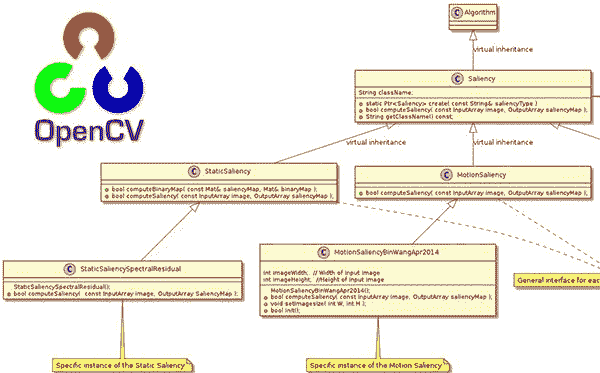
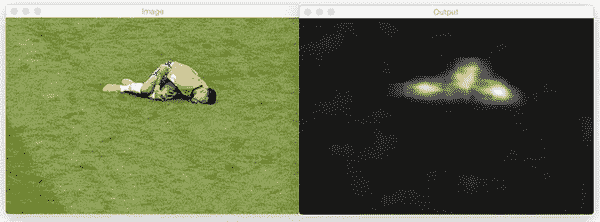
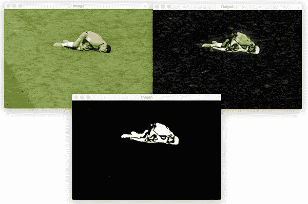
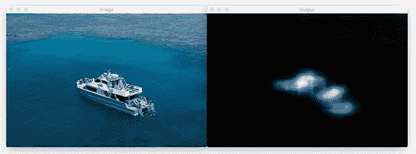
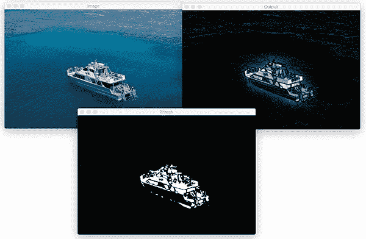
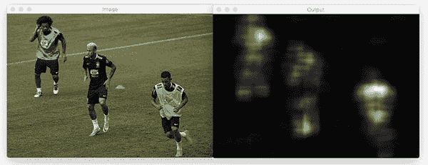

# OpenCV 显著性检测

> 原文：<https://pyimagesearch.com/2018/07/16/opencv-saliency-detection/>

[](https://pyimagesearch.com/wp-content/uploads/2018/07/opencv_saliency_finegrained_players.jpg)

今天的教程是关于显著性检测，即应用图像处理和计算机视觉算法来自动定位图像中最“显著”区域的过程。

**本质上，显著性是照片或场景中“突出”的部分，**使你的眼脑连接快速(基本上是无意识地)聚焦于最重要的区域。

例如，考虑这篇博文顶部的图，你看到一个足球场，上面有球员。当看照片时，你的眼睛会自动聚焦在球员身上，因为他们是照片中最重要的部分。这个自动定位图像或场景重要部分的过程被称为*显著性检测*。

显著性检测应用于计算机视觉和图像处理的许多方面，但是显著性的一些更流行的应用包括:

*   **物体检测**——不是穷尽地应用滑动窗口和图像金字塔，而是仅将我们的(计算昂贵的)检测算法应用于图像中最显著、最有可能包含物体的感兴趣区域
*   **广告和营销** —设计让我们一眼就能“流行”和“突出”的标志和广告
*   机器人学——设计视觉系统与我们相似的机器人

**在今天博文的剩余部分，你将学习如何使用 Python 和 OpenCV 的显著性模块执行显著性检测— *继续阅读了解更多！***

## 用 Python 实现 OpenCV 显著性检测

今天的帖子是受 **[PyImageSearch 大师课程](https://pyimagesearch.com/pyimagesearch-gurus/)** 成员杰夫·诺瓦的启发。

在私人 PyImageSearch 大师社区论坛的一个帖子中，Jeff 写道:

[](https://pyimagesearch.com/wp-content/uploads/2018/07/opencv_saliency_forum_post.png)

**Figure 1:** Jeff Nova’s OpenCV saliency question in the [PyImageSearch Gurus](https://pyimagesearch.com/pyimagesearch-gurus/) Community forums.

问得好，杰夫！

老实说，我完全忘记了 OpenCV 的显著模块。

Jeff 的问题促使我对 OpenCV 中的显著性模块做了一些研究。经过几个小时的研究、反复试验和简单地摆弄代码，我能够使用 OpenCV 执行显著性检测。

由于没有太多关于如何执行显著性检测的教程，特别是关于 Python 绑定的，我想写一个教程与你分享。

享受它，我希望它能帮助你把显著性检测带到你自己的算法中。

### 三种不同的显著性检测算法

在 OpenCV 的`saliency`模块中，显著性检测有三种主要形式:

1.  **静态显著性:**这类显著性检测算法依靠图像特征和统计来定位图像中最感兴趣的区域。
2.  **运动显著性:**这类算法通常依赖于视频或逐帧输入。运动显著性算法处理帧，跟踪“移动”的对象。移动的物体被认为是显著的。
3.  **对象性:**计算“对象性”的显著性检测算法生成一组“提议”，或者更简单地说，它认为对象可能位于图像中的什么位置的边界框。

**记住，计算显著性是*而不是*物体检测。**底层显著性检测算法*不知道*图像中是否有特定对象。

相反，显著性检测器只是报告它*认为*一个对象可能位于图像中的何处——这取决于您和您的实际对象检测/分类算法:

1.  处理由显著性检测器提出的区域
2.  预测/分类该区域，并根据该预测做出任何决策

显著性检测器通常是能够实时运行的非常快速的算法。然后，显著性检测器的结果被传递到计算量更大的算法中，您可能不想对输入图像的每个像素都运行这些算法。

### OpenCV 的显著性检测器

[](https://pyimagesearch.com/wp-content/uploads/2018/07/opencv_saliency_classes_large.png)

**Figure 2:** OpenCV’s saliency module class diagram. [*Click for the high-resolution image.*](https://pyimagesearch.com/wp-content/uploads/2018/07/opencv_saliency_classes_large.png)

要使用 OpenCV 的显著性检测器，您需要 OpenCV 3 或更高版本。OpenCV 关于他们的`saliency`模块的官方文档可以在[这个页面](https://docs.opencv.org/3.4.2/d8/d65/group__saliency.html)上找到。

请记住，您需要在启用`contrib`模块的情况下编译 OpenCV。如果你跟随了我在 PyImageSearch 上的 [OpenCV 安装教程](https://pyimagesearch.com/opencv-tutorials-resources-guides/)，你将会安装`contrib`模块。

***注意:**我发现 OpenCV 3.3 不支持运动显著性方法(将在本文后面介绍)，但支持所有其他显著性实现。如果你发现自己需要运动显著性，请确保你使用的是 OpenCV 3.4 或更高版本。*

您可以通过打开一个 Python shell 并尝试导入它来检查是否安装了`saliency`模块:

```
$ python
>>> import cv2
>>> cv2.saliency
<module 'cv2.saliency'>

```

如果导入成功，恭喜您——您已经安装了`contrib`个额外的模块！但是如果导入失败，你需要遵循我的[指南来安装 OpenCV](https://pyimagesearch.com/opencv-tutorials-resources-guides/) 和`contrib`模块。

OpenCV 为我们提供了四种使用 Python 绑定的显著性检测器实现，包括:

*   `cv2.saliency.ObjectnessBING_create()`
*   `cv2.saliency.StaticSaliencySpectralResidual_create()`
*   `cv2.saliency.StaticSaliencyFineGrained_create()`
*   `cv2.saliency.MotionSaliencyBinWangApr2014_create()`

上面的每个构造函数都返回一个实现`.computeSaliency`方法的对象——我们在输入图像上调用这个方法，返回一个二元组:

*   一个布尔值，指示显著性计算是否成功
*   输出显著图，我们可以用它来导出图像中最“有趣”的区域

在今天博文的剩余部分，我将向你展示如何使用这些算法来执行显著性检测。

### 显著性检测项目结构

请务必访问博文的 ***“下载”*** 部分，以获取 Python 脚本、图像文件和经过训练的模型文件。

从那里，我们可以使用`tree`命令在终端中查看项目结构:

```
$ tree --dirsfirst
.
├── images
│   ├── barcelona.jpg
│   ├── boat.jpg
│   ├── neymar.jpg
│   └── players.jpg
├── objectness_trained_model [9 entries]
│   ├── ObjNessB2W8HSV.idx.yml.gz
│   ├── ...
├── static_saliency.py
├── objectness_saliency.py
└── motion_saliency.py

2 directories, 16 files

```

在我们的项目文件夹中，有两个目录:

*   `image/`:测试图像的选择。
*   这是我们的物体显著性的模型目录。包括 9 个。包含对象模型 iteslf 的 yaml 文件。

我们今天将回顾三个示例脚本:

*   `static_saliency.py`:这个脚本实现了两种形式的静态显著性(基于图像特征和统计)。我们将首先回顾这个脚本。
*   `objectness_saliency.py`:使用 BING 对象显著性方法生成对象提议区域列表。
*   这个脚本将利用你计算机的网络摄像头，实时处理活动帧。显著区域是使用本指南稍后介绍的 Wang 和 Dudek 2014 方法计算的。

### 静态凸极

OpenCV 实现了两种静态显著性检测算法。

1.  第一种方法来自 Montabone 和 Soto 的 2010 年出版物， [*使用移动平台和从视觉显著机制*](https://www.sciencedirect.com/science/article/pii/S0262885609001371) 导出的新颖特征的人体检测。该算法最初用于检测图像和视频流中的人，但也可以推广到其他形式的显著性。
2.  第二种方法是由侯和张在他们 2007 年的论文中提出的， [*显著性检测:一种谱残差方法*](http://bcmi.sjtu.edu.cn/~zhangliqing/Papers/2007CVPR_Houxiaodi_04270292.pdf)。

该静态显著性检测器对图像的对数谱进行操作，计算该谱中的显著性残差，然后将相应的显著位置映射回空间域。请务必参考该文件以了解更多详细信息。

让我们继续尝试这两种静态显著性检测器。打开`static_salency.py`并插入以下代码:

```
# import the necessary packages
import argparse
import cv2

# construct the argument parser and parse the arguments
ap = argparse.ArgumentParser()
ap.add_argument("-i", "--image", required=True,
	help="path to input image")
args = vars(ap.parse_args())

# load the input image
image = cv2.imread(args["image"])

```

在**第 2 行和第 3 行**上，我们导入`argparse`和`cv2`。`argparse`模块将允许我们解析单个[命令行参数](https://pyimagesearch.com/2018/03/12/python-argparse-command-line-arguments/)——图像`--input`(**第 6-9 行** ) **。** OpenCV(带有`contrib`模块)拥有我们计算静态显著图所需的一切。

如果你没有安装 OpenCV，你可以遵循我的 [OpenCV 安装指南](https://pyimagesearch.com/opencv-tutorials-resources-guides/)。冒着被打破记录的风险，我将重复我的建议，你应该至少获得 OpenCV 3.4，因为在这篇博文中，我在 OpenCV 3.3 的运动显著性方面遇到了麻烦。

然后，我们通过第 12 行**将图像加载到内存中。**

我们的**第一个静态显著性方法**是静态谱显著性。让我们继续计算图像的显著性图并显示它:

```
# initialize OpenCV's static saliency spectral residual detector and
# compute the saliency map
saliency = cv2.saliency.StaticSaliencySpectralResidual_create()
(success, saliencyMap) = saliency.computeSaliency(image)
saliencyMap = (saliencyMap * 255).astype("uint8")
cv2.imshow("Image", image)
cv2.imshow("Output", saliencyMap)
cv2.waitKey(0)

```

使用`cv2.saliency`模块并调用`StaticSaliencySpectralResidual_create()`方法，实例化一个静态光谱残差`saliency`对象(**第 16 行**)。

从那里我们调用第 17 行**上的`computeSaliency`方法，同时传入我们的输入`image`。**

结果如何？

结果是一个`saliencyMap`，一个浮点灰度图像，它突出显示了图像中最突出的区域。浮点值的范围是*【0，1】*，接近 1 的值是“感兴趣”的区域，接近 0 的值是“不感兴趣”的区域。

我们准备好可视化输出了吗？

没那么快！在我们可以显示地图之前，我们需要将**行 18** 上的值缩放到范围*【0，255】*。

从那里，我们可以将原始的`image`和`saliencyMap`图像显示到屏幕上(**第 19 行和第 20 行**)，直到按下一个键(**第 21 行**)。

我们要应用的第二种静态显著方法叫做“细粒度”。下一个块模仿我们的第一个方法，除了我们正在实例化细粒度对象。我们还将执行一个阈值来演示一个二进制地图，您可能会处理轮廓(即，提取每个显著区域)。让我们看看它是如何做到的:

```
# initialize OpenCV's static fine grained saliency detector and
# compute the saliency map
saliency = cv2.saliency.StaticSaliencyFineGrained_create()
(success, saliencyMap) = saliency.computeSaliency(image)

# if we would like a *binary* map that we could process for contours,
# compute convex hull's, extract bounding boxes, etc., we can
# additionally threshold the saliency map
threshMap = cv2.threshold(saliencyMap.astype("uint8"), 0, 255,
	cv2.THRESH_BINARY | cv2.THRESH_OTSU)[1]

# show the images
cv2.imshow("Image", image)
cv2.imshow("Output", saliencyMap)
cv2.imshow("Thresh", threshMap)
cv2.waitKey(0)

```

在**的第 25 行**，我们实例化了细粒度的静态`saliency`对象。从那里我们计算第 26 条线上**的`saliencyMap`。**

OpenCV 代码的贡献者以不同于光谱显著性的方式实现了细粒度显著性。这次我们的值已经在范围*【0，255】*内缩放，所以我们可以继续在**第 36 行**上显示。

您可能执行的一个任务是计算二值阈值图像，以便您可以找到可能的对象区域轮廓。这在**行 31 和 32** 上执行，并在**行 37** 上显示。接下来的步骤将是在发现和提取轮廓之前的一系列腐蚀和膨胀(形态学操作)。我会把它作为一个练习留给你。

要执行静态显著性检测器，请务必下载源代码和示例(参见下面的 ***“下载”*** 部分)，然后执行以下命令:

```
$ python static_saliency.py --image images/neymar.jpg

```

巴西职业足球运动员小内马尔的图像首先经历光谱方法:

[](https://pyimagesearch.com/wp-content/uploads/2018/07/opencv_saliency_spectral_neymar.jpg)

**Figure 3:** Static spectral saliency with OpenCV on a picture of an injured Neymar Jr., a well known soccer player.

然后，在按下键之后，显示细粒度方法显著性图图像。这一次，我还展示了显著图的一个阈值(这也可以很容易地应用于光谱方法):

[](https://pyimagesearch.com/wp-content/uploads/2018/07/opencv_saliency_finegrained_neymar.jpg)

**Figure 4:** Static saliency with OpenCV using the fine grained approach (*top-right*) and binary threshold of the saliency map (*bottom*).

与先前光谱显著性图中的模糊斑点相比，细粒度图更类似于人。在*底部中心*的阈值图像将是提取可能物体的 ROI 的管道中的有用起点。

现在让我们在一张船的照片上尝试这两种方法:

```
$ python static_saliency.py --image images/boat.jpg

```

船只的静态光谱显著图:

[](https://pyimagesearch.com/wp-content/uploads/2018/07/opencv_saliency_spectral_boat.jpg)

**Figure 5:** Static spectral saliency with OpenCV on a picture of a boat.

细粒度:

[](https://pyimagesearch.com/wp-content/uploads/2018/07/opencv_saliency_finegrained_boat.jpg)

**Figure 6:** Static fine grained saliency of a boat image (*top-right*) and binary threshold of the saliency map (*bottom*).

最后，让我们在三个足球运动员的图片上尝试光谱和细粒度静态显著性方法:

```
$ python static_saliency.py --image images/players.jpg

```

这是光谱显著性的输出:

[](https://pyimagesearch.com/wp-content/uploads/2018/07/opencv_saliency_spectral_players.jpg)

**Figure 7:** A photo of three players undergoes static spectral saliency with OpenCV.

以及细粒度的显著性检测:

[](https://pyimagesearch.com/wp-content/uploads/2018/07/opencv_saliency_finegrained_players.jpg)

**Figure 8:** Three soccer players are highlighted in a saliency map created with OpenCV. This time a fine grained approach was used (*top-right*). Then, a binary threshold of the saliency map was computed which would be useful as a part of a contour detection pipeline (*bottom*).

### 客体显著性

OpenCV 包括一个目标显著性检测器—*[. BING:二值化赋范梯度用于 300fps 的目标估计](https://mmcheng.net/bing/)* ，Cheng 等人(2014)。

与 OpenCV 中其他实现完全独立的显著性检测器不同，BING 显著性检测器需要九个独立的模型文件，用于各种窗口大小、颜色空间和数学运算。

这九个模型文件加在一起非常小(~10KB)并且速度极快，这使得 BING 成为显著性检测的一个极好的方法。

要了解如何使用 OpenCV 的 objectness 显著性检测器，请打开`objectness_saliency.py`并插入以下代码:

```
# import the necessary packages
import numpy as np
import argparse
import cv2

# construct the argument parser and parse the arguments
ap = argparse.ArgumentParser()
ap.add_argument("-m", "--model", required=True,
	help="path to BING objectness saliency model")
ap.add_argument("-i", "--image", required=True,
	help="path to input image")
ap.add_argument("-n", "--max-detections", type=int, default=10,
	help="maximum # of detections to examine")
args = vars(ap.parse_args())

# load the input image
image = cv2.imread(args["image"])

```

在**2-4 行**，我们导入我们需要的包。对于这个脚本，我们将使用 NumPy、`argparse`和 OpenCV。

从那里我们解析第 7-14 行**的三个命令行参数:**

*   `--model`:BING 客体显著性模型的路径。
*   `--image`:我们的输入图像路径。
*   `--max-detections`:检测的最大数量，默认设置为`10`。

接下来，我们将我们的`image`加载到内存中(**第 17 行**)。

让我们计算对象显著性:

```
# initialize OpenCV's objectness saliency detector and set the path
# to the input model files
saliency = cv2.saliency.ObjectnessBING_create()
saliency.setTrainingPath(args["model"])

# compute the bounding box predictions used to indicate saliency
(success, saliencyMap) = saliency.computeSaliency(image)
numDetections = saliencyMap.shape[0]

```

在**线 21** 上，我们初始化目标`saliency`探测器，然后在**线 22** 上建立训练路径。

给定这两个动作，我们现在可以计算第 25 行**上的对象`saliencyMap`。**

可用显著性检测的数量可以通过检查返回的 NumPy 数组的形状来获得(**行 26** )。

现在，让我们循环查看每个检测(直到我们设置的最大值):

```
# loop over the detections
for i in range(0, min(numDetections, args["max_detections"])):
	# extract the bounding box coordinates
	(startX, startY, endX, endY) = saliencyMap[i].flatten()

	# randomly generate a color for the object and draw it on the image
	output = image.copy()
	color = np.random.randint(0, 255, size=(3,))
	color = [int(c) for c in color]
	cv2.rectangle(output, (startX, startY), (endX, endY), color, 2)

	# show the output image
	cv2.imshow("Image", output)
	cv2.waitKey(0)

```

在**第 29 行**上，我们开始循环检测，直到我们的命令行`args`字典中包含的最大检测计数。

在循环内部，我们首先提取边界框坐标(**行 31** )。

然后我们`copy`图像用于显示目的(**第 34 行**)，接着分配一个随机的`color`给边界框(**第 35-36 行**)。

要查看 OpenCV 的 objectness 显著性检测器，请务必下载源代码+示例图像，然后执行以下命令:

```
$ python objectness_saliency.py --model objectness_trained_model 
	--image images/barcelona.jpg

```

[](https://s3-us-west-2.amazonaws.com/static.pyimagesearch.com/saliency-detection/opencv_saliency_objectness.gif)

**Figure 9:** The objectness saliency detector (BING method) with OpenCV produces a total of 10 object region proposals as shown in the animation.

在这里，你可以看到物体显著性方法很好地提出了输入图像中莱昂内尔·梅西和路易斯·绍雷兹站在/跪在球场上的区域。

你可以想象将这些提议的边界框区域中的每一个都传递到分类器或对象检测器中以进行进一步的预测——最好的是，这种方法在计算上比穷尽性地应用一系列[图像金字塔](https://pyimagesearch.com/2015/03/16/image-pyramids-with-python-and-opencv/)和[滑动窗口](https://pyimagesearch.com/2015/03/23/sliding-windows-for-object-detection-with-python-and-opencv/)更加高效。

### 运动显著性

最终的 OpenCV 显著性检测器来自于王和杜德克在 2014 年发表的 [*一种快速自调整背景差分算法*](https://ieeexplore.ieee.org/document/6910012/) 。

该算法设计用于视频馈送，其中在视频馈送中移动的对象被认为是显著的。

打开`motion_saliency.py`并插入以下代码:

```
# import the necessary packages
from imutils.video import VideoStream
import imutils
import time
import cv2

# initialize the motion saliency object and start the video stream
saliency = None
vs = VideoStream(src=0).start()
time.sleep(2.0)

```

在这个脚本中，我们将直接使用我们的网络摄像头，所以我们首先从**行 2** 上的 [imutils](https://github.com/jrosebr1/imutils/blob/master/imutils/video/videostream.py) 导入`VideoStream`类。我们还将`imutils`本身、`time`，以及 OpenCV ( **第 3-5 行**)。

既然我们的导入已经完成，我们将初始化我们的运动显著性对象，并开始线程化的`VideoStream`对象(**第 9 行**)。

从这里，我们将开始循环并在每个周期的顶部捕获一帧:

```
# loop over frames from the video file stream
while True:
	# grab the frame from the threaded video stream and resize it
	# to 500px (to speedup processing)
	frame = vs.read()
	frame = imutils.resize(frame, width=500)

	# if our saliency object is None, we need to instantiate it
	if saliency is None:
		saliency = cv2.saliency.MotionSaliencyBinWangApr2014_create()
		saliency.setImagesize(frame.shape[1], frame.shape[0])
		saliency.init()

```

在**的第 16 行**我们抓取一个`frame`，然后在**的第 17 行**调整它的大小。减小`frame`的尺寸将允许环路内的图像处理和计算机视觉技术运行得更快。需要处理的数据越少，我们的管道就能运行得越快。

**第 20-23 行**实例化 OpenCV 的 motion `saliency`对象，如果它还没有建立的话。对于这个脚本，我们使用的是 Wang 方法，因为它的构造函数名副其实。

接下来，我们将计算显著图并显示我们的结果:

```
	# convert the input frame to grayscale and compute the saliency
	# map based on the motion model
	gray = cv2.cvtColor(frame, cv2.COLOR_BGR2GRAY)
	(success, saliencyMap) = saliency.computeSaliency(gray)
	saliencyMap = (saliencyMap * 255).astype("uint8")

	# display the image to our screen
	cv2.imshow("Frame", frame)
	cv2.imshow("Map", saliencyMap)
	key = cv2.waitKey(1) & 0xFF

	# if the `q` key was pressed, break from the loop
	if key == ord("q"):
		break

# do a bit of cleanup
cv2.destroyAllWindows()
vs.stop()

```

我们将`frame`转换为灰度(**第 27 行**)，随后计算我们的`saliencyMap` ( **第 28 行**)——王方法需要灰度帧。

由于`saliencyMap`包含范围*【0，1】*中的浮点值，我们缩放到范围*【0，255】*，并确保该值是无符号的 8 位整数(**第 29 行**)。

从那里，我们在第 32 和 33 行的**上显示原始的`frame`和`saliencyMap`。**

然后我们检查是否按下了 quit 键(“q”)，如果是，我们就退出循环并清理(**第 34-42 行**)。否则，我们将继续处理并在屏幕上显示显著图。

要执行运动显著性脚本，请输入以下命令:

```
$ python motion_saliency.py

```

下面我录制了一个 OpenCV 的运动显著性算法的示例演示:

<https://www.youtube.com/embed/tBaKusWUp3s?feature=oembed>