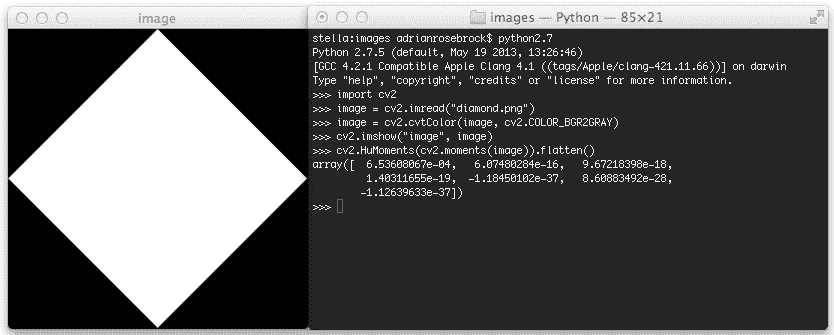
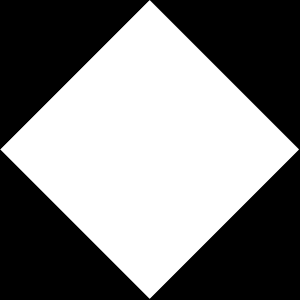

# OpenCV 形状描述符:Hu 矩示例

> 原文：<https://pyimagesearch.com/2014/10/27/opencv-shape-descriptor-hu-moments-example/>

[](https://pyimagesearch.com/wp-content/uploads/2014/05/opencv-shape-descriptors.png)

那么 OpenCV 提供了什么类型的形状描述符呢？

最值得注意的是 Hu 矩，它可用于描述、表征和量化图像中物体的形状。

Hu 矩通常从图像中物体的轮廓或外形中提取。通过描述物体的轮廓，我们能够提取形状特征向量(即一列数字)来表示物体的形状。

然后，我们可以使用相似性度量或距离函数来比较两个特征向量，以确定形状有多“相似”。

在这篇博文中，我将向你展示如何使用 Python 和 OpenCV 提取 Hu 矩形状描述符。

**OpenCV 和 Python 版本:**
这个例子将运行在 **Python 2.7/Python 3.4+** 和 **OpenCV 2.4.X/OpenCV 3.0+** 上。

# OpenCV 形状描述符:Hu 矩示例

正如我提到的，Hu 矩被用来描述图像中物体的轮廓或“轮廓”。

通常，我们在应用某种分割后获得这个形状(即，将背景像素设置为*黑色*，将前景像素设置为*白色*)。阈值化是获得我们的分割的最常见的方法。

在我们执行了阈值处理后，我们得到了图像中物体的*轮廓*。

我们也可以找到剪影的轮廓并画出来，这样就创建了物体的轮廓。

不管我们选择哪种方法，我们仍然可以应用 Hu 矩形状描述符*，只要我们在所有图像上获得一致的表示*。

例如，如果我们的目的是以某种方式比较形状特征，则从一组图像的轮廓提取 Hu 矩形状特征，然后从另一组图像的轮廓提取 Hu 矩形状描述符是没有意义的。

无论如何，让我们开始提取我们的 OpenCV 形状描述符。

首先，我们需要一张图片:

[](https://pyimagesearch.com/wp-content/uploads/2014/05/diamond.png)

**Figure 1:** Extracting OpenCV shape descriptors from our image

这张图像是一个菱形，其中黑色像素对应图像的*背景*，白色像素对应*前景*。这是图像中一个物体的*剪影*的例子。如果我们只有菱形的边界，它将是物体的轮廓。

无论如何，重要的是要注意，我们的 Hu 矩形状描述符将只在白色像素上计算。

现在，让我们提取我们的形状描述符:

```py
>>> import cv2
>>> image = cv2.imread("diamond.png")
>>> image = cv2.cvtColor(image, cv2.COLOR_BGR2GRAY)

```

我们需要做的第一件事是导入我们的`cv2`包，它为我们提供了 OpenCV 绑定。

然后，我们使用`cv2.imread`方法从磁盘上加载我们的钻石图像，并将其转换为灰度。

我们将图像转换为灰度，因为 Hu 矩需要单通道图像，形状量化只在白色像素中进行。

从这里，我们可以使用 OpenCV 计算 Hu 矩形状描述符:

```py
>>> cv2.HuMoments(cv2.moments(image)).flatten()
array([  6.53608067e-04,   6.07480284e-16,   9.67218398e-18,
         1.40311655e-19,  -1.18450102e-37,   8.60883492e-28,
        -1.12639633e-37])

```

为了计算我们的 Hu 矩，我们首先需要使用`cv2.moments`计算与图像相关的最初 24 个矩。

从那里，我们将这些矩传递到`cv2.HuMoments`，它计算胡的七个不变矩。

最后，我们展平数组以形成我们的形状特征向量。

该特征向量可用于量化和表示图像中物体的形状。

# 摘要

在这篇博文中，我向你展示了如何使用 Hu Moments OpenCV 形状描述符。

在以后的博文中，我将向你展示如何比较 Hu 矩特征向量的相似性。

请务必在下面的表格中输入您的电子邮件地址，以便在我发布新的精彩内容时得到通知！