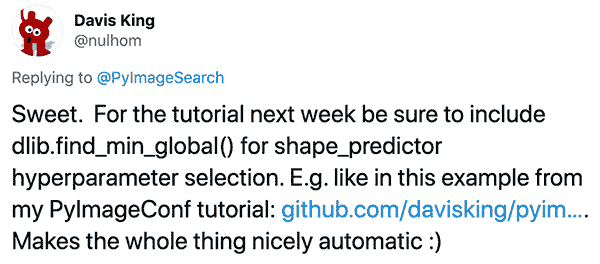
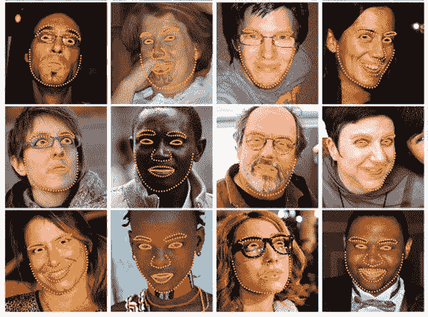
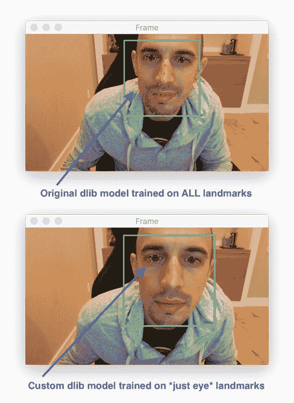
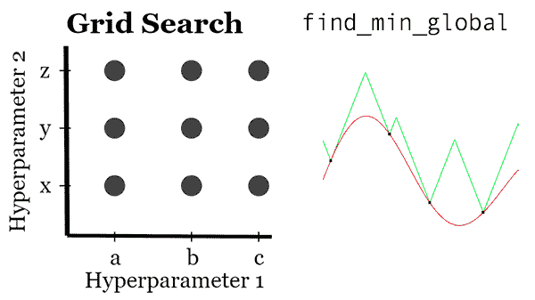

# 用 find_min_global 优化 dlib 形状预测精度

> 原文：<https://pyimagesearch.com/2020/01/13/optimizing-dlib-shape-predictor-accuracy-with-find_min_global/>

[](https://pyimagesearch.com/wp-content/uploads/2020/01/dlib_find_min_global_header.png)

在本教程中，您将学习如何使用 dlib 的`find_min_global`函数来优化 dlib 的形状预测器的选项和超参数，从而生成更精确的模型。

几周前，我发表了一个关于使用 dlib 来训练定制形状预测器的两部分系列:

1.  **第一部分:** [*训练一个自定义的 dlib 形状预测器*](https://pyimagesearch.com/2019/12/16/training-a-custom-dlib-shape-predictor/)
2.  **第二部分:** [*调整 dlib 形状预测超参数以平衡速度、精度和模型大小*](https://pyimagesearch.com/2019/12/23/tuning-dlib-shape-predictor-hyperparameters-to-balance-speed-accuracy-and-model-size/)

当我在社交媒体上发布第一篇帖子时，dlib 的创建者 Davis King 插话并建议我演示如何使用 dlib 的`find_min_global`函数来优化形状预测器超参数:

[](https://pyimagesearch.com/wp-content/uploads/2020/01/dlib_find_min_global_tweet.png)

**Figure 1:** Dlib’s creator and maintainer, [Davis King](https://pyimagesearch.com/2017/03/13/an-interview-with-davis-king-creator-of-the-dlib-toolkit/), suggested that I write content on optimizing dlib shape predictor accuracy with `find_min_global`.

我喜欢这个想法，并立即开始编写代码和收集结果。

今天，我很高兴分享关于训练 dlib 形状预测器和优化其超参数的**奖励指南**。

我希望你喜欢它！

**要了解如何使用 dlib 的`find_min_global`函数来优化形状预测超参数，*请继续阅读！***

## 用`find_min_global`优化 dlib 形状预测精度

在本教程的第一部分，我们将讨论 dlib 的`find_min_global`函数，以及如何使用它来优化形状预测器的选项/超参数。

我们还将把`find_min_global`与标准网格搜索进行比较和对比。

接下来，我们将讨论本教程将使用的数据集，包括回顾项目的目录结构。

然后，我们将打开代码编辑器，通过实现三个 Python 脚本来动手实践，包括:

1.  配置文件。
2.  用于通过`find_min_global`优化超参数的脚本。
3.  一个脚本，用于获取通过`find_min_global`找到的最佳超参数，然后使用这些值训练一个最佳形状预测器。

我们将用一个简短的讨论来结束这篇文章，讨论什么时候应该使用`find_min_global`而不是执行标准的网格超参数搜索。

我们开始吧！

### dlib 的`find_min_global`函数是做什么的？我们如何使用它来调整形状预测选项？

**视频来源:** *[一种值得使用的全局优化算法](http://blog.dlib.net/2017/12/a-global-optimization-algorithm-worth.html)* 作者:[戴维斯·金](https://pyimagesearch.com/2017/03/13/an-interview-with-davis-king-creator-of-the-dlib-toolkit/)

几周前，你学习了[如何使用系统的网格搜索](https://pyimagesearch.com/2019/12/23/tuning-dlib-shape-predictor-hyperparameters-to-balance-speed-accuracy-and-model-size/)来调整 dlib 的形状预测器选项。

这种方法足够好，但问题是网格搜索*不是一个真正的优化器！*

相反，我们硬编码我们想要探索的超参数值，网格搜索计算这些值的所有可能组合*，然后逐个探索它们。*

网格搜索在计算上是浪费的，因为算法花费了宝贵的时间和 CPU 周期来探索超参数组合，这些组合将*永远不会*产生最佳可能结果。

如果我们可以迭代地调整我们的选项，确保每次迭代我们都在增量地改进我们的模型，这不是更有优势吗？

事实上，这正是 dlib `find_min_global`函数的作用！

dlib 库的创建者 Davis King[记录了他与超参数调整算法](http://blog.dlib.net/2017/12/a-global-optimization-algorithm-worth.html)的斗争，包括:

*   **猜测和检查:**专家使用他的直觉和以前的经验来手动设置超参数，运行算法，检查结果，然后使用结果来进行有根据的猜测，以确定下一组要探索的超参数将是什么。
*   **网格搜索:**硬编码你要测试的所有可能的超参数值，计算这些超参数的所有可能的组合，然后让计算机全部测试，一个一个测试。
*   **随机搜索:**对您想要探索的超参数的上限和下限/范围进行硬编码，然后允许计算机在这些范围内对超参数值进行随机采样。
*   **贝叶斯优化:**黑盒算法的全局优化策略。这种方法通常比原始算法本身需要调整更多的超参数。相比之下，你最好使用“猜测和检查”策略，或者通过网格搜索或随机搜索来解决问题。
*   **具有良好初始猜测的局部优化:**这种方法很好，但仅限于找到局部最优，不能保证它会找到全局最优。

最终，Davis 偶然发现了马尔赫比和瓦亚蒂斯 2017 年的论文，*[lip schitz 函数](https://arxiv.org/abs/1703.02628)* 的全局优化，然后他通过`find_min_global`函数将其实现到 dlib 库中。

与几乎不可能调整的贝叶斯方法和不能保证全局最优解的局部优化方法不同，马尔赫比和瓦亚蒂斯方法是**无参数的**和**可证明是正确的**，用于寻找一组最大化/最小化特定函数的值。

Davis 在博客文章的[中写了大量关于最优化方法的文章——如果你对最优化方法背后的数学感兴趣，我建议你读一读。](http://blog.dlib.net/2017/12/a-global-optimization-algorithm-worth.html)

### iBUG-300W 数据集

[](https://pyimagesearch.com/wp-content/uploads/2019/12/dlib_shape_pred_example_pred.jpg)

**Figure 2:** The iBug 300-W face landmark dataset is used to train a custom dlib shape predictor. Using dlib’s `find_min_global` optimization method, we will optimize an eyes-only shape predictor.

为了找到最佳的 dlib 形状预测器超参数，我们将使用 [iBUG 300-W 数据集](https://ibug.doc.ic.ac.uk/resources/300-W/)，该数据集与我们之前关于形状预测器的两部分系列所使用的数据集相同。

iBUG 300-W 数据集非常适合于[训练面部标志预测器](https://pyimagesearch.com/2019/12/16/training-a-custom-dlib-shape-predictor/)来定位面部的各个结构，包括:

*   眉毛
*   眼睛
*   鼻子
*   口
*   下颌的轮廓

形状预测数据文件可能会变得非常大。为了解决这个问题，**我们将训练我们的形状预测器来定位*仅仅是眼睛*** 而不是所有的面部标志。你可以很容易地训练一个形状预测器只识别嘴，等等。

### 配置您的 dlib 开发环境

为了完成今天的教程，您需要一个安装了以下软件包的虚拟环境:

*   dlib
*   OpenCV
*   imutils
*   scikit-learn

幸运的是，这些包都是 pip 可安装的。也就是说，有一些先决条件(包括 Python 虚拟环境)。有关配置开发环境的更多信息，请务必遵循以下两个指南:

*   **[*【安装 dlib(简易、完整指南)*](https://pyimagesearch.com/2018/01/22/install-dlib-easy-complete-guide/)**
*   **[*pip 安装 opencv*](https://pyimagesearch.com/2018/09/19/pip-install-opencv/)**

pip 安装命令包括:

```
$ workon <env-name>
$ pip install dlib
$ pip install opencv-contrib-python
$ pip install imutils
$ pip install scikit-learn

```

一旦你按照我的 [dlib](https://pyimagesearch.com/2018/01/22/install-dlib-easy-complete-guide/) 或 [OpenCV](https://pyimagesearch.com/2018/09/19/pip-install-opencv/) 安装指南安装了`virtualenv`和`virtualenvwrapper`，那么`workon`命令就变得可用。

### 下载 iBUG-300W 数据集

要跟随本教程，您需要**下载 iBUG 300-W 数据集(~1.7GB):**

[http://dlib . net/files/data/ibug _ 300 w _ large _ face _ landmark _ dataset . tar . gz](http://dlib.net/files/data/ibug_300W_large_face_landmark_dataset.tar.gz)

在下载数据集的同时，您还应该使用本教程的 ***“下载”*** 部分下载源代码。

您可以(1)使用上面的超链接，或者(2)使用`wget`下载数据集。让我们介绍这两种方法，这样你的项目就像我自己的项目一样有条理。

**选项 1:** 使用上面的超链接下载数据集，然后将 iBug 300-W 数据集放入与本教程下载相关的文件夹中，如下所示:

```
$ unzip tune-dlib-shape-predictor.zip
...
$ cd tune-dlib-shape-predictor
$ mv ~/Downloads/ibug_300W_large_face_landmark_dataset.tar.gz .
$ tar -xvf ibug_300W_large_face_landmark_dataset.tar.gz
...

```

**选项 2:** 不要点击上面的超链接，直接使用终端中的`wget`下载数据集:

```
$ unzip tune-dlib-shape-predictor.zip
...
$ cd tune-dlib-shape-predictor
$ wget http://dlib.net/files/data/ibug_300W_large_face_landmark_dataset.tar.gz
$ tar -xvf ibug_300W_large_face_landmark_dataset.tar.gz
...

```

现在您已经准备好跟随教程的其余部分了。

### 项目结构

请务必遵循上一节的内容，以便(1)下载今天的。从***“Downloads”***部分解压，(2)将 iBug 300-W 数据集下载到今天的项目中。

从那里，继续执行`tree`命令来查看我们的项目结构:

```
% tree --dirsfirst --filelimit 10
.
├── ibug_300W_large_face_landmark_dataset
│   ├── afw [1011 entries]
│   ├── helen
│   │   ├── testset [990 entries]
│   │   └── trainset [6000 entries]
│   ├── ibug [405 entries]
│   ├── lfpw
│   │   ├── testset [672 entries]
│   │   └── trainset [2433 entries]
│   ├── image_metadata_stylesheet.xsl
│   ├── labels_ibug_300W.xml
│   ├── labels_ibug_300W_test.xml
│   └── labels_ibug_300W_train.xml
├── pyimagesearch
│   ├── __init__.py
│   └── config.py
├── best_predictor.dat
├── ibug_300W_large_face_landmark_dataset.tar.gz
├── parse_xml.py
├── predict_eyes.py
├── shape_predictor_tuner.py
└── train_best_predictor.py

10 directories, 11 files

```

如您所见，我们的数据集已经按照上一节中的说明提取到了`ibug_300W_large_face_landmark_dataset/`目录中。

我们的配置存放在`pyimagesearch`模块中。

我们的 Python 脚本包括:

*   `parse_xml.py`:首先，您需要从 iBug 300-W 数据集中准备并提取*只看得见的*地标，生成更小的 XML 文件。我们将在下一节回顾如何使用这个脚本，但是我们不会回顾脚本本身，因为它已经在[之前的教程](https://pyimagesearch.com/2019/12/16/training-a-custom-dlib-shape-predictor/)中介绍过了。
*   `shape_predictor_tuner.py`:这个脚本利用 dlib 的`find_min_global`方法来寻找最佳的形状预测器。我们今天将详细讨论这个脚本。这个脚本将需要很长时间来执行(几天)。
*   `train_best_predictor.py`:形状预测器调好后，我们将更新我们的形状预测器选项，并开始训练过程。
*   `predict_eys.py`:加载序列化模型，寻找地标，并在实时视频流上标注。我们今天不会讨论这个脚本，因为我们已经在之前的中讨论过了。

我们开始吧！

### 准备 iBUG-300W 数据集

[](https://pyimagesearch.com/wp-content/uploads/2019/12/dlib_shape_pred_landmark_comparison.jpg)

**Figure 3:** In this tutorial, we will optimize a custom dlib shape predictor’s accuracy with `find_min_global`.

正如之前在上面的*“iBUG-300 w 数据集”*部分提到的，**我们将只在*眼睛***上训练我们的 dlib 形状预测器(即*而不是*眉毛、鼻子、嘴或下颌)。

为此，我们将首先从 iBUG 300-W 训练/测试 XML 文件中解析出我们不感兴趣的任何面部结构。

此时，请确保您已经:

1.  使用本教程的 ***【下载】*** 部分下载源代码。
2.  已使用上面的*“下载 iBUG-300W 数据集”*部分下载 iBUG-300W 数据集。
3.  查看了*“项目结构”*部分，以便您熟悉文件和文件夹。

在你的目录结构中有一个名为`parse_xml.py`的脚本——这个脚本处理从 XML 文件中解析出*仅仅是*眼睛的位置。

我们在我之前的 *[训练自定义 dlib 形状预测器](https://pyimagesearch.com/2019/12/16/training-a-custom-dlib-shape-predictor/)* 教程中详细回顾了这个文件。我们不会再复习文件，所以一定要在本系列的[第一篇教程中复习。](https://pyimagesearch.com/2019/12/16/training-a-custom-dlib-shape-predictor/)

在继续本教程的其余部分之前，您需要执行以下命令来准备我们的“仅供参考”的培训和测试 XML 文件:

```
$ python parse_xml.py \
	--input ibug_300W_large_face_landmark_dataset/labels_ibug_300W_train.xml \
	--output ibug_300W_large_face_landmark_dataset/labels_ibug_300W_train_eyes.xml
[INFO] parsing data split XML file...
$ python parse_xml.py \
	--input ibug_300W_large_face_landmark_dataset/labels_ibug_300W_test.xml \
	--output ibug_300W_large_face_landmark_dataset/labels_ibug_300W_test_eyes.xml
[INFO] parsing data split XML file...

```

现在让我们验证培训/测试文件是否已经创建。您应该检查 iBUG-300W 根数据集目录中的`labels_ibug_300W_train_eyes.xml`和`labels_ibug_300W_test_eyes.xml`文件，如下所示:

```
$ cd ibug_300W_large_face_landmark_dataset
$ ls -lh *.xml    
-rw-r--r--@ 1 adrian  staff    21M Aug 16  2014 labels_ibug_300W.xml
-rw-r--r--@ 1 adrian  staff   2.8M Aug 16  2014 labels_ibug_300W_test.xml
-rw-r--r--  1 adrian  staff   602K Dec 12 12:54 labels_ibug_300W_test_eyes.xml
-rw-r--r--@ 1 adrian  staff    18M Aug 16  2014 labels_ibug_300W_train.xml
-rw-r--r--  1 adrian  staff   3.9M Dec 12 12:54 labels_ibug_300W_train_eyes.xml
$ cd ..

```

请注意，我们的`*_eyes.xml`文件被高亮显示。这些文件的文件大小*比它们原始的、未经解析的副本*小得多。

### 我们的配置文件

在我们可以使用`find_min_global`来调优我们的超参数之前，我们首先需要创建一个配置文件来存储我们所有的重要变量，确保我们可以跨多个 Python 脚本使用和访问它们。

打开`pyimagesearch`模块中的`config.py`文件(按照上面的项目结构)并插入以下代码:

```
# import the necessary packages
import os

# define the path to the training and testing XML files
TRAIN_PATH = os.path.join("ibug_300W_large_face_landmark_dataset",
	"labels_ibug_300W_train_eyes.xml")
TEST_PATH = os.path.join("ibug_300W_large_face_landmark_dataset",
	"labels_ibug_300W_test_eyes.xml")

```

`os`模块(**第 2 行**)允许我们的配置脚本加入文件路径。

**第 5-8 行**加入我们的培训和测试 XML 地标文件。

让我们定义我们的培训参数:

```
# define the path to the temporary model file
TEMP_MODEL_PATH = "temp.dat"

# define the number of threads/cores we'll be using when trianing our
# shape predictor models
PROCS = -1

# define the maximum number of trials we'll be performing when tuning
# our shape predictor hyperparameters
MAX_FUNC_CALLS = 100

```

在这里你会发现:

*   临时模型文件的路径(**第 11 行**)。
*   训练时使用的线程/内核数量(**第 15 行**)。值`-1`表示*您机器上的所有*处理器内核都将被利用。
*   当试图优化我们的超参数时，`find_min_global`将使用的函数调用的最大数量(**第 19 行**)。较小的值将使我们的调优脚本完成得更快，但可能会导致超参数“不太理想”。值越大，运行调优脚本的时间就越长，但可能会产生“更优”的超参数。

### 实施 dlib 形状预测器和`find_min_global`训练脚本

现在我们已经查看了我们的配置文件，我们可以继续使用`find_min_global`来调整我们的形状预测器超参数。

打开项目结构中的`shape_predictor_tuner.py`文件，插入以下代码:

```
# import the necessary packages
from pyimagesearch import config
from collections import OrderedDict
import multiprocessing
import dlib
import sys
import os

# determine the number of processes/threads to use
procs = multiprocessing.cpu_count()
procs = config.PROCS if config.PROCS > 0 else procs

```

**2-7 线**导入我们必需的包，即我们的`config`和`dlib`。我们将使用`multiprocessing`模块来获取我们系统拥有的 CPUs 内核数量(**第 10 行和第 11 行**)。一个`OrderedDict`将包含我们所有的 dlib 形状预测选项。

现在，让我们定义一个负责使用 dlib 调整形状预测器核心的函数:

```
def test_shape_predictor_params(treeDepth, nu, cascadeDepth,
	featurePoolSize, numTestSplits, oversamplingAmount,
	oversamplingTransJitter, padding, lambdaParam):
	# grab the default options for dlib's shape predictor and then
	# set the values based on our current hyperparameter values,
	# casting to ints when appropriate
	options = dlib.shape_predictor_training_options()
	options.tree_depth = int(treeDepth)
	options.nu = nu
	options.cascade_depth = int(cascadeDepth)
	options.feature_pool_size = int(featurePoolSize)
	options.num_test_splits = int(numTestSplits)
	options.oversampling_amount = int(oversamplingAmount)
	options.oversampling_translation_jitter = oversamplingTransJitter
	options.feature_pool_region_padding = padding
	options.lambda_param = lambdaParam

	# tell dlib to be verbose when training and utilize our supplied
	# number of threads when training
	options.be_verbose = True
	options.num_threads = procs

```

`test_shape_predictor_params`功能:

1.  接受一组输入超参数。
2.  使用这些超参数训练 dlib 形状预测器。
3.  计算测试集的预测损失/误差。
4.  将错误返回给`find_min_global`函数。
5.  然后，`find_min_global`函数将获取返回的误差，并使用它以迭代的方式调整迄今为止找到的最佳超参数。

如您所见，`test_shape_predictor_params`函数接受**九个参数，*，其中每个参数都是 dlib 形状预测超参数，我们将对其进行优化。***

**第 19-28 行**从参数中设置超参数值(适当时转换为整数)。

**第 32 行和第 33 行**指示 dlib 输出详细信息，并利用提供的线程/进程数量进行训练。

让我们完成对`test_shape_predictor_params`函数的编码:

```
	# display the current set of options to our terminal
	print("[INFO] starting training...")
	print(options)
	sys.stdout.flush()

	# train the model using the current set of hyperparameters
	dlib.train_shape_predictor(config.TRAIN_PATH,
		config.TEMP_MODEL_PATH, options)

	# take the newly trained shape predictor model and evaluate it on
	# both our training and testing set
	trainingError = dlib.test_shape_predictor(config.TRAIN_PATH,
		config.TEMP_MODEL_PATH)
	testingError = dlib.test_shape_predictor(config.TEST_PATH,
		config.TEMP_MODEL_PATH)

	# display the training and testing errors for the current trial
	print("[INFO] train error: {}".format(trainingError))
	print("[INFO] test error: {}".format(testingError))
	sys.stdout.flush()

	# return the error on the testing set
	return testingError

```

**第 41 行和第 42 行**使用当前超参数集训练 dlib 形状预测器。

从那里，**行 46-49** 在训练和测试集上评估新训练的形状预测器。

**第 52-54 行**在**第 57 行**将`testingError`返回给调用函数之前，打印当前试验的训练和测试错误。

让我们定义我们的形状预测超参数集:

```
# define the hyperparameters to dlib's shape predictor that we are
# going to explore/tune where the key to the dictionary is the
# hyperparameter name and the value is a 3-tuple consisting of the
# lower range, upper range, and is/is not integer boolean,
# respectively
params = OrderedDict([
	("tree_depth", (2, 5, True)),
	("nu", (0.001, 0.2, False)),
	("cascade_depth", (4, 25, True)),
	("feature_pool_size", (100, 1000, True)),
	("num_test_splits", (20, 300, True)),
	("oversampling_amount", (1, 40, True)),
	("oversampling_translation_jitter",  (0.0, 0.3, False)),
	("feature_pool_region_padding", (-0.2, 0.2, False)),
	("lambda_param", (0.01, 0.99, False))
])

```

`OrderedDict`中的每个值都是一个三元组，包括:

1.  超参数值的**下限**。
2.  超参数值的**上限**。
3.  一个指示超参数是否为整数的**布尔值**。

对于超参数的完整回顾，请务必[参考我之前的帖子](https://pyimagesearch.com/2019/12/16/training-a-custom-dlib-shape-predictor/)。

从这里，我们将提取我们的上限和下限，以及超参数是否为整数:

```
# use our ordered dictionary to easily extract the lower and upper
# boundaries of the hyperparamter range, include whether or not the
# parameter is an integer or not
lower = [v[0] for (k, v) in params.items()]
upper = [v[1] for (k, v) in params.items()]
isint = [v[2] for (k, v) in params.items()]

```

**第 79-81 行**从我们的`params`字典中提取`lower`、`upper`和`isint`布尔。

现在我们已经设置好了，让我们用 **dlib 的`find_min_global`方法**来**优化我们的形状预测器超参数**

```
# utilize dlib to optimize our shape predictor hyperparameters
(bestParams, bestLoss) = dlib.find_min_global(
	test_shape_predictor_params,
	bound1=lower,
	bound2=upper,
	is_integer_variable=isint,
	num_function_calls=config.MAX_FUNC_CALLS)

# display the optimal hyperparameters so we can reuse them in our
# training script
print("[INFO] optimal parameters: {}".format(bestParams))
print("[INFO] optimal error: {}".format(bestLoss))

# delete the temporary model file
os.remove(config.TEMP_MODEL_PATH)

```

**第 84-89 行**开始优化过程。

**行 93 和 94** 显示在**行 97** 删除临时模型文件之前的最佳参数。

### 用`find_min_global`调整形状预测器选项

要使用`find_min_global`将超参数调整到我们的 dlib 形状预测器，请确保:

1.  使用本教程的 ******【下载】****** 章节下载源代码。
2.  使用上面的*“下载 iBUG-300W 数据集”*部分下载 iBUG-300W 数据集。
3.  在*“准备 iBUG-300W 数据集”*一节中为训练和测试 XML 文件执行了`parse_xml.py`。

假设您已经完成了这三个步骤中的每一步，现在您可以执行`shape_predictor_tune.py`脚本:

```
$ time python shape_predictor_tune.py
[INFO] starting training...
shape_predictor_training_options(be_verbose=1, cascade_depth=15, tree_depth=4, num_trees_per_cascade_level=500, nu=0.1005, oversampling_amount=21, oversampling_translation_jitter=0.15, feature_pool_size=550, lambda_param=0.5, num_test_splits=160, feature_pool_region_padding=0, random_seed=, num_threads=20, landmark_relative_padding_mode=1)
Training with cascade depth: 15
Training with tree depth: 4
Training with 500 trees per cascade level.
Training with nu: 0.1005
Training with random seed:
Training with oversampling amount: 21
Training with oversampling translation jitter: 0.15
Training with landmark_relative_padding_mode: 1
Training with feature pool size: 550
Training with feature pool region padding: 0
Training with 20 threads.
Training with lambda_param: 0.5
Training with 160 split tests.
Fitting trees...
Training complete
Training complete, saved predictor to file temp.dat
[INFO] train error: 5.518466441668642
[INFO] test error: 6.977162396336371
[INFO] optimal inputs: [4.0, 0.1005, 15.0, 550.0, 160.0, 21.0, 0.15, 0.0, 0.5]
[INFO] optimal output: 6.977162396336371
...
[INFO] starting training...
shape_predictor_training_options(be_verbose=1, cascade_depth=20, tree_depth=4, num_trees_per_cascade_level=500, nu=0.1033, oversampling_amount=29, oversampling_translation_jitter=0, feature_pool_size=677, lambda_param=0.0250546, num_test_splits=295, feature_pool_region_padding=0.0974774, random_seed=, num_threads=20, landmark_relative_padding_mode=1)
Training with cascade depth: 20
Training with tree depth: 4
Training with 500 trees per cascade level.
Training with nu: 0.1033
Training with random seed:
Training with oversampling amount: 29
Training with oversampling translation jitter: 0
Training with landmark_relative_padding_mode: 1
Training with feature pool size: 677
Training with feature pool region padding: 0.0974774
Training with 20 threads.
Training with lambda_param: 0.0250546
Training with 295 split tests.
Fitting trees...
Training complete
Training complete, saved predictor to file temp.dat
[INFO] train error: 2.1037606164427904
[INFO] test error: 4.225682000183475
[INFO] optimal parameters: [4.0, 0.10329967171060293, 20.0, 677.0, 295.0, 29.0, 0.0, 0.09747738830224817, 0.025054553453757795]
[INFO] optimal error: 4.225682000183475

real    8047m24.389s
user    98916m15.646s
sys     464m33.139s

```

在我配有 20 个内核的 3 GHz 英特尔至强 W 处理器的 iMac Pro 上，总共运行 100 个`MAX_TRIALS`用了 **~8047m24s** ，或者说 **~5.6 天**。如果您没有功能强大的计算机，我建议您在功能强大的云实例上运行这个过程。

查看输出，您可以看到`find_min_global`函数找到了以下最佳形状预测超参数:

*   `tree_depth` : 4
*   `nu` : 0.1033
*   `cascade_depth` : 20
*   `feature_pool_size` : 677
*   `num_test_splits` : 295
*   `oversampling_amount` : 29
*   `oversampling_translation_jitter` : 0
*   `feature_pool_region_padding` : 0.0975
*   `lambda_param` : 0.0251

在下一节中，我们将获取这些值并更新我们的`train_best_predictor.py`脚本以包含它们。

### 使用`find_min_global`的结果更新我们的形状预测选项

此时，我们知道最佳可能的形状预测器超参数值，但是我们仍然需要使用这些值来训练我们的最终形状预测器。

要进行 make，打开`train_best_predictor.py`文件并插入以下代码:

```
# import the necessary packages
from pyimagesearch import config
import multiprocessing
import argparse
import dlib

# construct the argument parser and parse the arguments
ap = argparse.ArgumentParser()
ap.add_argument("-m", "--model", required=True,
	help="path serialized dlib shape predictor model")
args = vars(ap.parse_args())

# determine the number of processes/threads to use
procs = multiprocessing.cpu_count()
procs = config.PROCS if config.PROCS > 0 else procs

# grab the default options for dlib's shape predictor
print("[INFO] setting shape predictor options...")
options = dlib.shape_predictor_training_options()

# update our hyperparameters
options.tree_depth = 4
options.nu = 0.1033
options.cascade_depth = 20
options.feature_pool_size = 677
options.num_test_splits = 295
options.oversampling_amount = 29
options.oversampling_translation_jitter = 0
options.feature_pool_region_padding = 0.0975
options.lambda_param = 0.0251

# tell the dlib shape predictor to be verbose and print out status
# messages our model trains
options.be_verbose = True

# number of threads/CPU cores to be used when training -- we default
# this value to the number of available cores on the system, but you
# can supply an integer value here if you would like
options.num_threads = procs

# log our training options to the terminal
print("[INFO] shape predictor options:")
print(options)

# train the shape predictor
print("[INFO] training shape predictor...")
dlib.train_shape_predictor(config.TRAIN_PATH, args["model"], options)

```

**2-5 线**导入我方`config`、`multiprocessing`、`argparse`、`dlib`。

从那里，我们使用从上一节找到的最佳值来设置形状预测器`options` ( **第 14-39 行**)。

最后，**线 47** 训练输出模型。

关于这个脚本的更详细的回顾，请务必参考我之前的教程。

### 训练最终形状预测器

最后一步是执行我们的`train_best_predictor.py`文件，该文件将使用通过`find_min_global`找到的最佳超参数值来训练 dlib 形状预测器:

```
$ time python train_best_predictor.py --model best_predictor.dat
[INFO] setting shape predictor options...
[INFO] shape predictor options:
shape_predictor_training_options(be_verbose=1, cascade_depth=20, tree_depth=4, num_trees_per_cascade_level=500, nu=0.1033, oversampling_amount=29, oversampling_translation_jitter=0, feature_pool_size=677, lambda_param=0.0251, num_test_splits=295, feature_pool_region_padding=0.0975, random_seed=, num_threads=20, landmark_relative_padding_mode=1)
[INFO] training shape predictor...
Training with cascade depth: 20
Training with tree depth: 4
Training with 500 trees per cascade level.
Training with nu: 0.1033
Training with random seed:
Training with oversampling amount: 29
Training with oversampling translation jitter: 0
Training with landmark_relative_padding_mode: 1
Training with feature pool size: 677
Training with feature pool region padding: 0.0975
Training with 20 threads.
Training with lambda_param: 0.0251
Training with 295 split tests.
Fitting trees...
Training complete
Training complete, saved predictor to file best_predictor.dat

real    111m46.444s
user    1492m29.777s
sys     5m39.150s

```

命令执行完毕后，您应该在本地目录结构中有一个名为`best_predictor.dat`的文件:

```
$ ls -lh *.dat
-rw-r--r--@ 1 adrian  staff    24M Dec 22 12:02 best_predictor.dat

```

然后，您可以使用这个预测器，并使用`predict_eyes.py`脚本在实时视频中定位眼睛:

```
$ python predict_eyes.py --shape-predictor best_predictor.dat
[INFO] loading facial landmark predictor...
[INFO] camera sensor warming up...

```

### 什么时候应该使用 dlib 的`find_min_global`功能？

[](https://pyimagesearch.com/wp-content/uploads/2020/01/dlib_find_min_global_vs_grid_search.png)

**Figure 4:** Using the `find_min_global` method to optimize a custom dlib shape predictor can take significant processing time. Be sure to review this section for general rules of thumb including guidance on when to [use a Grid Search method](https://pyimagesearch.com/2019/12/23/tuning-dlib-shape-predictor-hyperparameters-to-balance-speed-accuracy-and-model-size/) to find a shape predictor model.

与盲目探索超参数集的标准网格搜索不同，`find_min_global`函数是真正的**优化器**，使其能够迭代探索超参数空间，选择最大化我们的准确性和最小化我们的损失/错误的选项。

然而，`find_min_global`的一个缺点是它*不能以一种简单的方式与*并行。

另一方面，标准网格搜索*可以通过以下方式使*并行:

1.  将超参数的所有组合分成 *N* 个大小的块
2.  然后在 *M* 个系统中分配每个块

这样做将导致*比使用`find_min_global`更快的*超参数空间探索。

缺点是您可能没有超参数的“真正”最佳选择，因为网格搜索只能探索您硬编码的值。

**因此，我推荐以下经验法则:**

如果你有 ***多台机器，*** 使用一个标准的网格搜索并在机器间分配工作。网格搜索完成后，取找到的最佳值，然后将它们作为 dlib 的`find_min_global`的输入，以找到您的最佳超参数。

如果你有一台*单机，使用 dlib 的`find_min_global`，**确保削减你想要探索的超参数范围。**例如，如果你知道你想要一个小而快的模型，你应该限制`tree_depth`的范围上限，防止你的 ERTs 变得太深(因此更慢)。*

 *虽然 dlib 的`find_min_global`功能非常强大，但它也可能*缓慢*，所以请确保您提前考虑并计划出哪些超参数对于您的应用程序来说是真正重要的*。*

 *你也应该阅读我以前的关于训练自定义 dlib 形状预测器的教程,详细了解每个超参数控制什么，以及如何使用它们来平衡速度、精度和模型大小。

使用这些建议，您将能够成功地调整和优化您的 dlib 形状预测器。

## 摘要

在本教程中，您学习了如何在训练自定义形状预测器时使用 dlib 的`find_min_global`函数来优化选项/超参数。

该功能*非常*易于使用，并使*非常简单*调整 dlib 形状预测器的超参数。

我还建议你使用我之前的教程，通过网格搜索调整 dlib 形状预测器选项——将网格搜索(使用多台机器)与`find_min_global`结合起来可以产生更好的形状预测器。

我希望你喜欢这篇博文！

**要下载这篇文章的源代码(并在未来教程在 PyImageSearch 上发布时得到通知)，*只需在下面的表格中输入您的电子邮件地址！*****