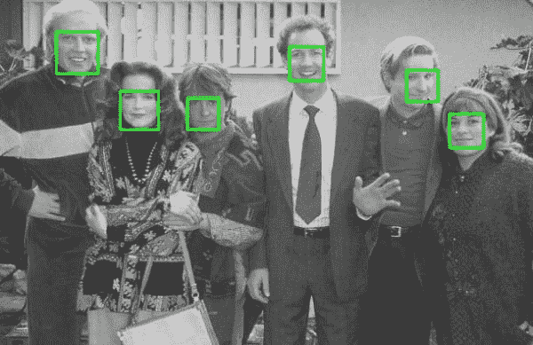
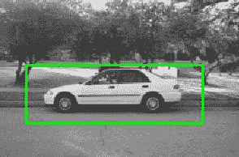
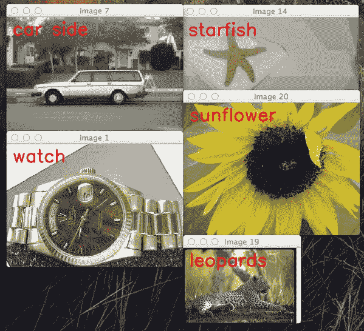
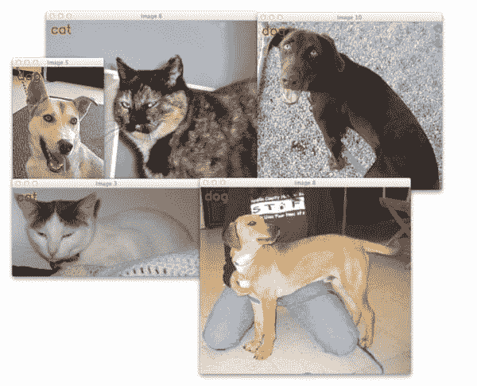
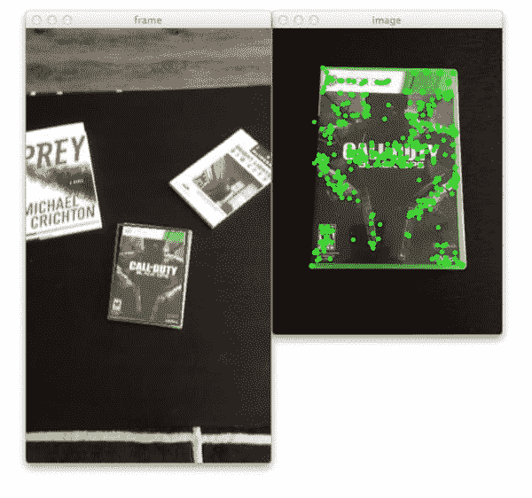

# 训练您自己的自定义图像分类器、对象检测器和对象跟踪器。

> 原文：<https://pyimagesearch.com/2015/02/04/train-custom-image-classifiers-object-detectors-object-trackers/>

你看了上周末的超级碗吗？

我做到了。算是吧。

我在我最喜欢的印度酒吧度过了超级碗周日(这实际上是美国的一个假期)。

捣翠鸟啤酒。

品尝美味的坦杜里鸡…

***…所有这一切都发生在我的笔记本电脑上，为[的 PyImageSearch 大师计算机视觉课程](https://www.kickstarter.com/projects/1186001332/pyimagesearch-gurus-become-a-computer-vision-openc)编写一些定制的图像分类器、物体检测器、&物体跟踪器。***

哦，对了——背景音乐是超级碗比赛。虽然不能说我看了很多，但我太忙于我的笔记本电脑，看起来像一个疯狂的程序员！我肯定这是一幅奇特的景象。

无论如何，我今天发布这篇文章是因为我想与你分享我的印度啤酒燃料黑客狂欢的结果… **我们将在 [PyImageSearch 大师](https://www.kickstarter.com/projects/1186001332/pyimagesearch-gurus-become-a-computer-vision-openc)内部构建的图像分类器、物体检测器和物体跟踪器的预览。**

让我们从简单的事情开始，训练你自己的面部检测器:

**Figure 1:** Inside PyImageSearch Gurus you’ll learn how to train your own custom object detector to detect faces in images.

在这里，你可以看到我已经使用梯度方向直方图描述符和线性 SVM 训练了我的自定义对象检测器，以检测从*回到未来*的演员阵容中的人脸。

在这里，我训练了另一个自定义对象检测器，它使用梯度方向直方图来检测图像中是否存在汽车:

**Figure 2:** Learn how to detect a car in an image inside the PyImageSearch Gurus course.

现在让我们做一些稍微复杂一点的事情。在下图中，我训练了一个视觉词汇金字塔(PBOW)和一个梯度方向直方图金字塔(PHOG ),以识别来自流行的 CALTECH-101 数据集的图像:

**Figure 3:** Learn how to train an image classifier on the popular 101 category CALTECH dataset.

作为另一个例子，我训练了一个分类器来区分 ASIRRA 猫和狗数据集上 Fido 和 Whiskers 夫人之间的差异:

**Figure 4:** You’ll learn how to train a custom image classifier to recognize the difference between cats and dogs.

最后，我利用关键点检测、局部不变描述符和关键点匹配在实时视频流中跟踪视频游戏盒的盖子:

**Figure 5:** Training your own custom object tracker for use in real-time video is a breeze. Discover how inside PyImageSearch Gurus.

很酷，对吧？

这些技巧并不神奇——我保证你可以自己学会。

# 在门关上之前加入 PyImageSearch 大师们吧…

正如你所看到的，我们将在 PyImageSearch 大师课程中学到很多实用的技能。从自定义图像分类器到物体检测器，再到实时物体跟踪，**在 PyImageSearch 大师课程中，你一定会成为计算机视觉大师**。

因此，如果你对揭示这些技术感兴趣，并成为一名计算机视觉大师，我肯定会建议加入我的 PyImageSearch Gurus！

一旦 Kickstarter 结束，您将无法再次注册 PyImageSearch 大师，直到 8 月份！这是你的机会！现在一定要进去…

PyImageSearch 大师课程仍有几个名额，所以请立即行动起来， [抢占你的位置！](https://www.kickstarter.com/projects/1186001332/pyimagesearch-gurus-become-a-computer-vision-openc)