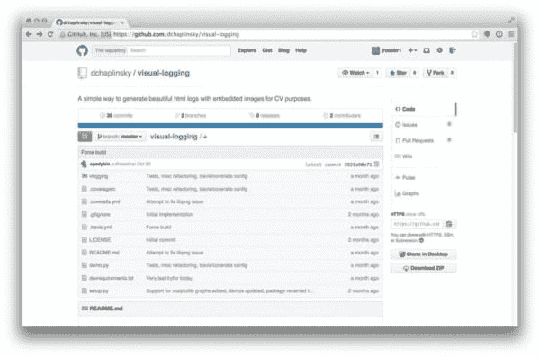
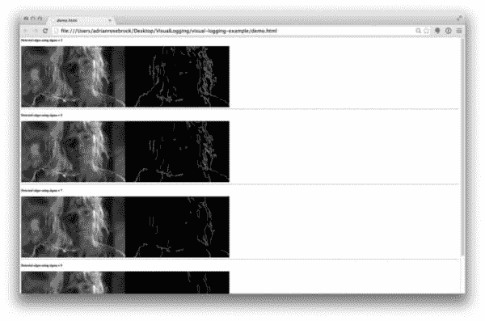

# 可视化日志，我调试 OpenCV 和 Python 应用程序的新宠工具

> 原文：<https://pyimagesearch.com/2014/12/22/visual-logging-new-favorite-tool-debugging-opencv-python-apps/>

[](https://github.com/dchaplinsky/visual-logging)

几个月前，我的朋友 Dmitry Chaplinsky 给我发了一封电子邮件，告诉我一个我必须去看看的新图书馆。我总是对新的计算机视觉和图像处理软件包感到好奇，因此产生了兴趣。

你看，德米特里的工作包括应用 Python 和 OpenCV 对粉碎的文件进行标记和分类，以期揭露乌克兰的腐败。他的图书馆[unthred](https://github.com/dchaplinsky/unshred)，做了很多脏活累活。

但是为了构建 unshred，他需要一种简单的方法来调试 OpenCV 应用程序。

就像我们使用`print`语句调试简单的 Python 应用程序一样，我们使用 OpenCV `cv2.imshow`和`cv2.waitKey`函数在屏幕上直观地显示我们的图像，以便我们可以调试它们。

老实说，这真的很让人头疼，在你意识到之前，你的管道已经完全被`cv2.imshow`电话填满了。

为了修复这个`cv2.imshow`地狱，Dmitry 创建了[视觉记录](https://github.com/dchaplinsky/visual-logging)，一个让你调试并直接记录你的 OpenCV 管道到文件的库。它使用一个漂亮的 HTML 结构对其进行格式化。

几个月前，我甚至不知道有这样的工具存在——现在我正在将它纳入我的日常计算机视觉工作流程。

因此，如果您对如何(更好地)调试和记录 OpenCV + Python 应用程序感兴趣，请继续阅读。你不会想错过这个令人敬畏的图书馆。

***再次感谢德米特里！***

**OpenCV 和 Python 版本:**
这个例子将运行在 **Python 2.7** 和 **OpenCV 2.4.X/OpenCV 3.0+** 上。

# 可视化日志，我调试 OpenCV 和 Python 应用程序的新宠工具

在撰写本文时，[视觉记录](https://github.com/dchaplinsky/visual-logging)文档声称这个包是`pip`可安装的:

```
$ pip install visual-logging

```

然而，当我执行上面的命令时，我得到了可怕的“没有为可视化日志找到任何发行版”。我假设这个包还没有向 PyPi 注册。

不管怎样，这没什么大不了的。我们可以简单地从 GitHub repo 克隆并以“老式”的方式安装:

```
(cv)annalee:VisualLogging adrianrosebrock$ git clone https://github.com/dchaplinsky/visual-logging.git
Cloning into 'visual-logging'...
remote: Counting objects: 137, done.
remote: Total 137 (delta 0), reused 0 (delta 0)
Receiving objects: 100% (137/137), 361.23 KiB | 0 bytes/s, done.
Resolving deltas: 100% (70/70), done.
Checking connectivity... done.
(cv)annalee:VisualLogging adrianrosebrock$ cd visual-logging/
(cv)annalee:visual-logging adrianrosebrock$ python setup.py install

```

现在我们已经安装了`visual-logging`，让我们创建一个简单的脚本来演示如何使用`visual-logging`来帮助我们可视化我们的管道:

```
# import the necessary packages
from logging import FileHandler
from vlogging import VisualRecord
import logging
import cv2

# open the logging file
logger = logging.getLogger("visual_logging_example")
fh = FileHandler("demo.html", mode = "w")

# set the logger attributes
logger.setLevel(logging.DEBUG)
logger.addHandler(fh)

# load our example image and convert it to grayscale
image = cv2.imread("lex.jpg")
image = cv2.cvtColor(image, cv2.COLOR_BGR2GRAY)

# loop over some varying sigma sizes
for s in xrange(3, 11, 2):
	# blur the image and detect edges
	blurred = cv2.GaussianBlur(image, (s, s), 0)
	edged = cv2.Canny(blurred, 75, 200)
	logger.debug(VisualRecord(("Detected edges using sigma = %d" % (s)),
		[blurred, edged], fmt = "png"))

```

这里的代码相当简单。在第 2-5 行上，我们导入我们需要的包。

然后，我们在第 8-13 行中设置我们的日志处理程序和属性。

我们在**的第 16 行**加载一个[莱克斯·墨菲](https://pyimagesearch.com/wp-content/uploads/2014/12/lex.jpg)(来自*侏罗纪公园*，duh)的示例图像，并在**的第 17 行**将图像转换成灰度。

**第 20-25 行**测试我们的视觉记录器。我们将使用越来越大的*西格玛*尺寸来逐渐模糊图像。然后我们检测模糊图像中的边缘。

通常，要查看我们的模糊和边缘检测的输出，我们必须调用`cv2.imshow`和`cv2.waitKey`。

但是那些日子已经过去了。

相反，我们将创建一个`VisualRecord`并将高斯模糊和边缘贴图记录到文件中。这将允许我们调试我们的管道，并轻松地查看我们的结果。

说到结果，执行以下命令来生成可视化日志文件:

```
$ python visual_logging_example.py

```

假设脚本执行无误，那么在当前工作目录中应该有一个名为`demo.html`的新文件。

下面是我的`demo.html`文件的截图:

[](https://pyimagesearch.com/wp-content/uploads/2014/12/visual_logging_example.jpg)

**Figure 1:** Example of using visual-logger to log and debug OpenCV + Python computer vision pipelines.

从这个例子中我们可以看出，随着高斯*西格玛*的大小增加，图像变得越来越模糊。随着图像变得越来越模糊，检测到的边缘越来越少。

当然，这是调试和记录 OpenCV + Python 应用程序的一个相当简单的例子。但是我想你明白了——用`cv2.imshow`和`cv2.waitKey`语句堵塞代码的日子已经一去不复返了！

相反，只需使用[视觉记录](https://github.com/dchaplinsky/visual-logging)——你的生活会简单得多。

# 摘要

在这篇博文中，我们探索了[可视化日志](https://github.com/dchaplinsky/visual-logging)，这是我调试 Python + OpenCV 应用程序的新宠工具。

到目前为止，调试 OpenCV 应用程序一直是一堆`cv2.imshow`和`cv2.waitKey`调用。所有这些函数调用都很难管理，对于调试来说更是如此。你将会对你的计算机视觉管道的每一次迭代进行一次又一次的截图。

但是现在我们有了更好的方法。我们可以利用 Dmitry Chaplinsky 的[可视化日志](https://github.com/dchaplinsky/visual-logging)包来帮助我们轻松地调试和记录 OpenCV 应用程序。

感谢 Dmitry 提供了这么棒的图书馆！